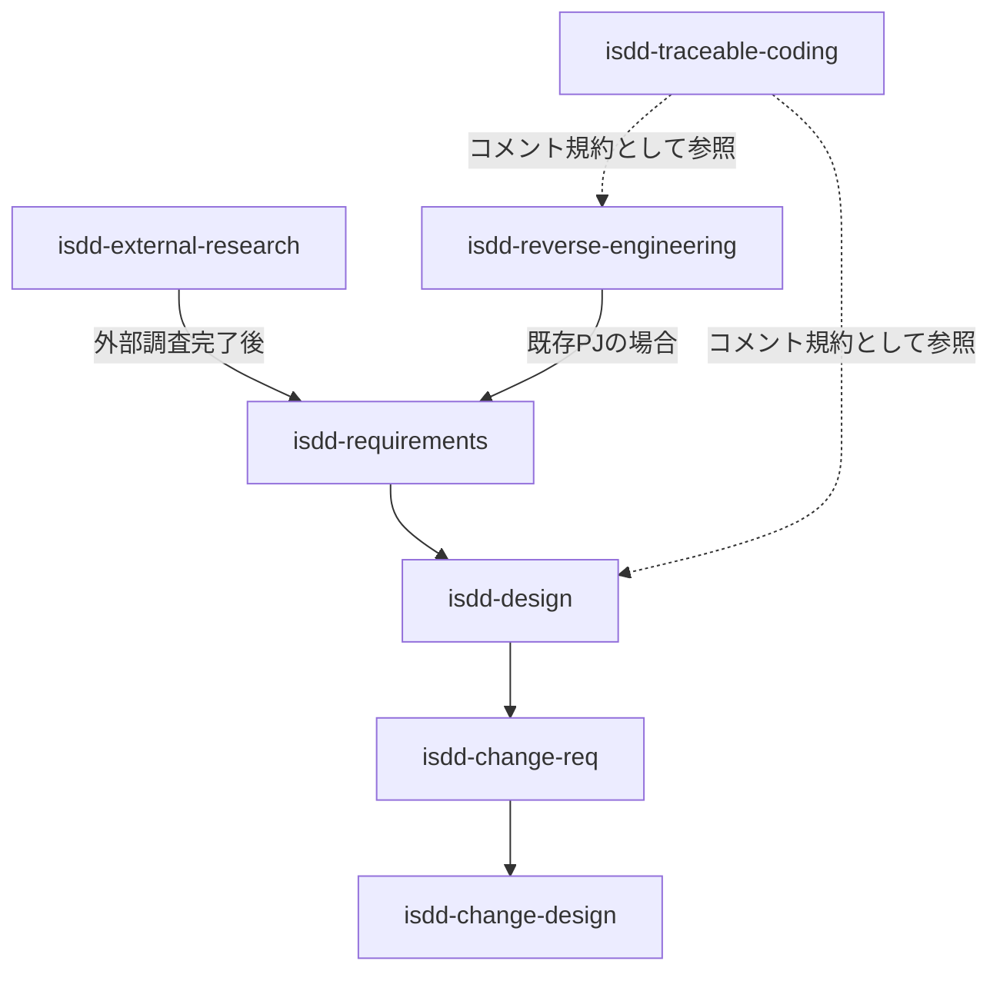
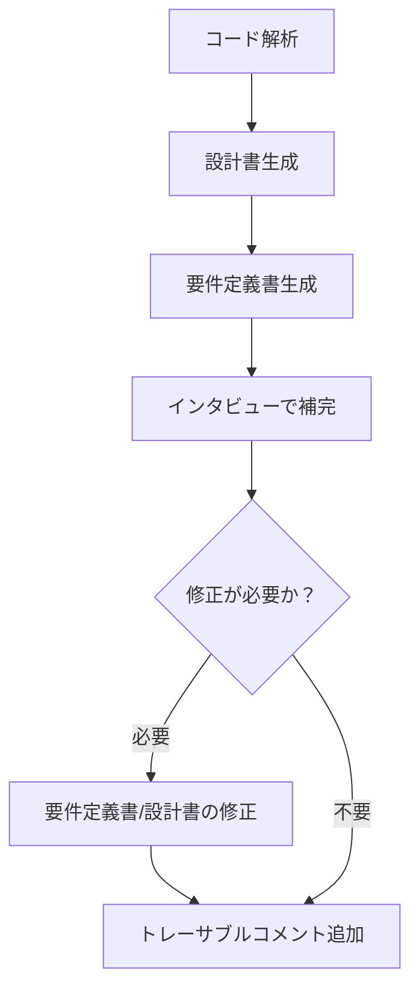

# isdd スキル拡張計画

## 概要

既存の4スキル（isdd-requirements / isdd-design / isdd-change-req / isdd-change-design）に対して、以下の拡張を実施する。



---

## 拡張エリア一覧

| # | エリア | 対応方針 | 対象スキル |
|---|---|---|---|
| 1 | 統一トレーサビリティID体系 | 新スキル作成 | `isdd-traceable-coding`（新規） |
| 2 | 外部システム事前調査 | 新スキル作成 + 既存スキルに連携指示 | `isdd-external-research`（新規）、`isdd-requirements`（修正） |
| 3 | 要件定義インタビューの改善 | 既存スキル修正 | `isdd-requirements`（修正） |
| 4 | 既存プロジェクトの仕様駆動化 | 新スキル作成 + 既存スキル全てに連携指示 | `isdd-reverse-engineering`（新規）、全既存スキル（修正） |

---

## エリア1: 統一トレーサビリティID体系

### 新規スキル: `isdd-traceable-coding`

#### 要件ID体系

**フォーマット**: `RQ-[カテゴリ]-[内容略称]`

- 略称は英語ALL CAPSケバブケース
- 連番なし、意味ベースのスラッグ

**カテゴリ一覧（7種）**:

| カテゴリ | プレフィックス | 対象 |
|---|---|---|
| 機能 | `RQ-FT` | 業務機能・ユースケース |
| 画面 | `RQ-UI` | 画面・UI要件 |
| 外部連携 | `RQ-EX` | 外部システム連携 |
| テストシナリオ | `RQ-TS` | テスト要件 |
| 非機能 | `RQ-NF` | 性能・可用性・セキュリティ等 |
| データ | `RQ-DT` | データ定義・保持ポリシー |
| 運用 | `RQ-OP` | 運用・バックアップ・監視 |

**略称の命名規則（カテゴリ別）**:

- `RQ-FT`、`RQ-EX`、`RQ-TS`: 動詞先頭（例: `CREATE-ORDER`、`SYNC-CUSTOMER-MASTER`、`VERIFY-ORDER-CANCEL`）
- `RQ-UI`: 画面名先頭（例: `ORDER-CREATE-SCREEN`、`CUSTOMER-LIST-SCREEN`）
- `RQ-NF`、`RQ-DT`、`RQ-OP`: 名詞先頭（例: `RESPONSE-TIME-2S`、`CUSTOMER-DATA-RETENTION`、`BACKUP-DAILY-POLICY`）

#### 設計ID体系

**フォーマット**: `DS-[DSカテゴリ]-[DS内容略称]-[RQカテゴリ]-[RQ内容略称]`

**DSカテゴリ一覧（7種）**:

| カテゴリ | プレフィックス | 対象 |
|---|---|---|
| モジュール | `DS-MD` | モジュール・コンポーネント単位 |
| APIインターフェース | `DS-IF` | API・インターフェース定義 |
| クラス | `DS-CL` | クラス設計 |
| 関数 | `DS-FN` | 関数・メソッド設計 |
| データモデル | `DS-SC` | スキーマ・データモデル |
| バッチ | `DS-BT` | バッチ・ジョブ設計 |
| イベント | `DS-EV` | イベント・メッセージ設計 |

#### 変更管理ポリシー

- 要件の**意味が変わる**場合: 旧要件を変更ドキュメント内で `deprecated` としてマーク → 新IDで新要件を登録
- `docs/` への反映時: `deprecated` となった要件と設計は削除 → `docs/` は常に現在有効な要件と設計のみを記載
- 変更履歴の正本: `.history/` ディレクトリのみ（Gitには依存しない）

#### コードコメントのトレーサビリティ規則

- 対象: 全ての関数・クラス・モジュール（例外なし）
- 必須記載内容:
  - 親要件ID（`RQ-*`）
  - 設計ID（`DS-*`）
  - 要件概要（要件定義書の該当要件の内容を要約）
  - 設計概要（詳細設計書の該当設計の内容を要約）
  - 呼び出し先・呼び出し元の設計ID一覧
- 目標: ソースコードのコメントだけから要件定義書・詳細設計書を再構成できる状態にする

---

## エリア2: 外部システム事前調査

### 新規スキル: `isdd-external-research`

#### 目的

要件定義開始前に外部連携システムの仕様を調査し、調査レポートとモック実装をセットで生成する。

#### 成果物

| 成果物 | 保存先 | 内容 |
|---|---|---|
| 調査レポート | `external/[システム名]/docs/research.md` | エンドポイント、認証方式、データ形式、制限事項等 |
| モック実装 | `external/[システム名]/src/` | 外部システムへの接続モックコード |
| 認証情報テンプレート | `external/[システム名]/.env.example` | 必要な環境変数の一覧（値はダミー） |

#### モック実装の言語

- スキル内では言語を固定しない
- インタビューでプロジェクトの技術スタックを確認してから生成する

#### モック方式ID（RQ-EX配下）

| 方式 | 内容 | 要件ID |
|---|---|---|
| A | ローカルHTTPサーバー | `RQ-EX-USE-LOCAL-HTTP-MOCK` |
| B | 固定レスポンスファイル | `RQ-EX-USE-FIXED-RESPONSE-MOCK` |
| C | 既存モックサーバーツール | `RQ-EX-USE-MOCK-SERVER-TOOL` |

#### ディレクトリ構造

```
external/
  [システム名]/
    docs/
      research.md       # 調査レポート
    src/                # モック実装コード
    .env.example        # 認証情報テンプレート
```

#### `isdd-requirements` への連携指示追記内容

> 外部システムとの連携が含まれる場合は、要件定義を開始する前に `isdd-external-research` スキルを実行して調査レポートとモック実装を生成すること。

---

## エリア3: 要件定義インタビューの改善

### 修正対象スキル: `isdd-requirements`

#### 変更1: インタビュー質問スタイルの明示

インタビュー実施時は、各質問において以下を必ず提示する:
- 具体的な選択肢（複数）
- 各選択肢のメリット
- 各選択肢のデメリット

ユーザーが選択肢から選ぶか、独自の回答を述べた上で決定する。

#### 変更2: CRUDテーブルを必須セクションとして追加

`requirements.md` のテンプレートに `CRUDテーブル` セクションを必須として追加する。

**テーブル形式**:

| エンティティ名 | Create | Read（一覧） | Read（詳細） | Update | Delete | 備考 |
|---|---|---|---|---|---|---|
| （エンティティ名） | ○/△/× | ○/△/× | ○/△/× | ○/△/× | ○/△/× | |

**セル値の定義**:

| 値 | 意味 |
|---|---|
| ○ | 必須の操作 |
| △ | 条件付きで必要な操作 |
| × | 対象外の操作 |

---

## エリア4: 既存プロジェクトの仕様駆動化

### 新規スキル: `isdd-reverse-engineering`

#### 目的

既存コードベースから設計書・要件定義書を逆引き生成し、インタビューで補完・修正した上でトレーサブルコメントを追加する。

#### 実施フロー



1. **コード解析** — 既存コードの構造・依存関係・処理を解析
2. **設計書生成** — `docs/detail_design.md` を生成（isddの設計書フォーマットに準拠）
3. **要件定義書生成** — `docs/requirements.md` を生成（isddの要件定義書フォーマットに準拠）
4. **インタビューで補完** — 解析だけでは判断できない業務意図・背景をユーザーにインタビュー
5. **要件定義書/設計書の修正** — インタビュー結果を反映して修正（修正が必要な場合は必ず実施）
6. **トレーサブルコメント追加** — `isdd-traceable-coding` の規則に従いコメントを追加

#### 既存コードへの介入ルール

- **既存コードのロジックには一切変更を加えない**
- 追加・変更して良いのはコメント（docstring、インラインコメント等）のみ
- コメントの追加によって既存の動作が変わる実装（例: アノテーションによる副作用）がある場合は、ユーザーに確認してから実施する

#### 全既存スキルへの連携指示追記内容

以下の文言を `isdd-requirements`、`isdd-design`、`isdd-change-req`、`isdd-change-design` の冒頭に追記する:

> 既存のプロジェクト（コードベースがすでに存在する場合）に対してこのスキルを適用する場合は、先に `isdd-reverse-engineering` スキルを実行して要件定義書と設計書を生成・確定させること。

---

## 新規作成スキル一覧

| スキル名 | ディレクトリ | 説明文（description） |
|---|---|---|
| `isdd-traceable-coding` | `.claude/skills/isdd-traceable-coding/` | 要件ID・設計IDを用いたトレーサブルなコードコメント規則を定義するスキル。全関数・クラス・モジュールへの必須コメント内容、IDフォーマット、変更管理ポリシーを規定する。 |
| `isdd-external-research` | `.claude/skills/isdd-external-research/` | 要件定義前に外部連携システムの仕様調査を行い、調査レポートとモック実装をセットで生成するスキル。 |
| `isdd-reverse-engineering` | `.claude/skills/isdd-reverse-engineering/` | 既存コードベースから設計書・要件定義書を逆引き生成し、インタビューで補完・修正した上でトレーサブルコメントを追加するスキル。 |

## 修正対象スキル一覧

| スキル名 | 修正内容 |
|---|---|
| `isdd-requirements` | ①インタビュー質問スタイル（選択肢＋メリデメ提示）の明示、②CRUDテーブル必須セクション追加、③`isdd-external-research` 連携指示追記、④`isdd-reverse-engineering` 連携指示追記 |
| `isdd-design` | `isdd-reverse-engineering` 連携指示追記 |
| `isdd-change-req` | `isdd-reverse-engineering` 連携指示追記 |
| `isdd-change-design` | `isdd-reverse-engineering` 連携指示追記 |
