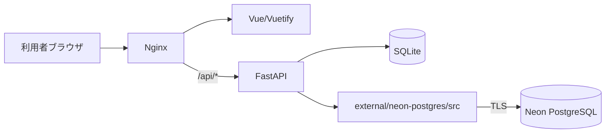
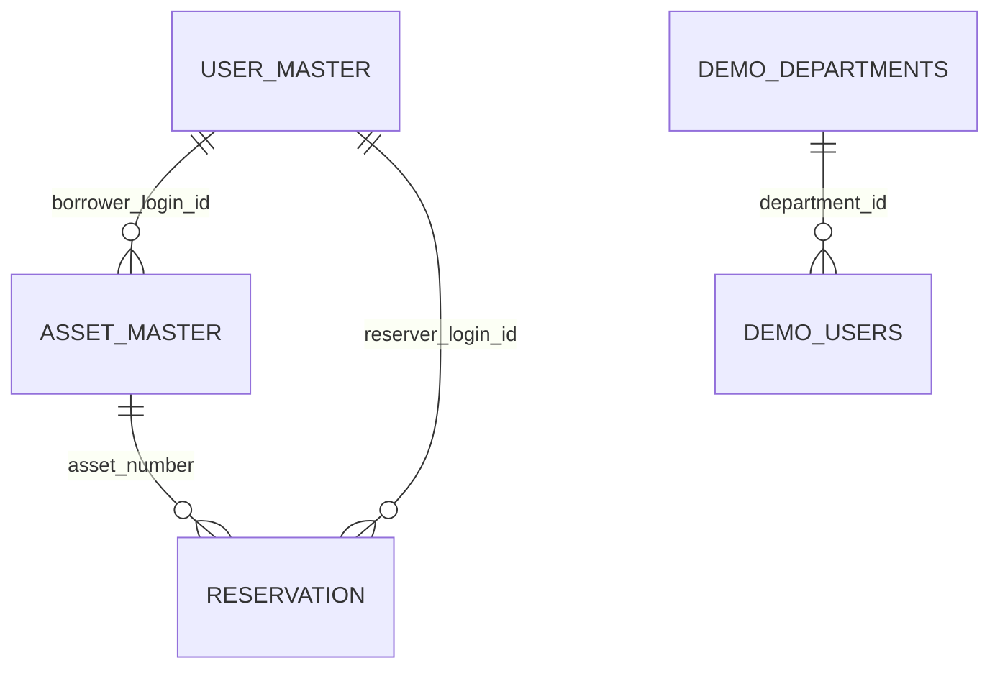
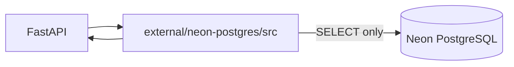
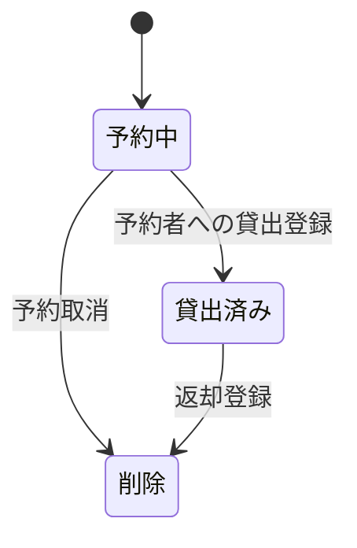
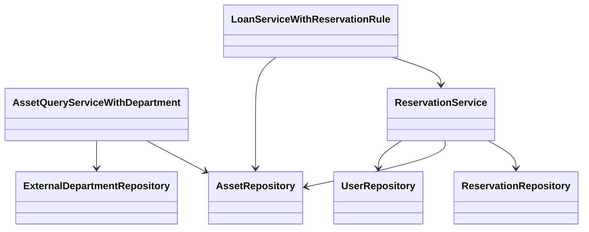

# 変更詳細設計書（部署名外部DB取得・予約機能追加）

## 0. 設計前提

- 入力要件: `.history/20260510-add-department-reservation/change_requirements.md`
- 既存参照: `docs/requirements.md`, `docs/detail_design.md`
- 外部連携整合確認: `external/neon-postgres/docs/alignment_report.md` で不整合なしを確認済み
- 変更要件除外ゲート: 除外要件なし（全 [追加] RQ-*（RQ-BK/RQ-BZ除く）を反映）

---

## 1. 言語・フレームワーク

変更なし。既存設計 `docs/detail_design.md` セクション[1] を参照。

---

## 2. システム構成

### 2-1. コンポーネント一覧（差分）

| 区分 | DS-ID | コンポーネント名 | 役割 | 対応RQ-ID | 削除理由/追加理由 |
|---|---|---|---|---|---|
| [削除] | `DS-IF-ASSET-LIST-MANAGEMENT-SCREEN-UI-ASSET-LIST-MANAGEMENT-SCREEN` | 旧備品一覧/備品管理画面IF | 予約導線・部署表示なしの画面IF | `RQ-UI-ASSET-LIST-MANAGEMENT-SCREEN` | 予約ボタン導線・部署表示要件を満たせないため |
| [削除] | `DS-FN-VIEW-ASSET-LIST-FT-VIEW-ASSET-LIST` | 旧備品一覧取得処理 | 借用者名のみ取得する旧一覧取得 | `RQ-FT-VIEW-ASSET-LIST` | 部署名表示と非同期状態表示を満たせないため |
| [削除] | `DS-FN-REGISTER-LOAN-FT-REGISTER-LOAN` | 旧貸出登録処理 | 返却予定日なしの貸出登録 | `RQ-FT-REGISTER-LOAN` | 予約重複判定の前提となる貸出期間を確定できないため |
| [追加] | `DS-MD-ASSET-RESERVATION-MANAGEMENT-BZ-ASSET-RESERVATION-MANAGEMENT` | 備品予約管理モジュール | 予約登録・取消・貸出済み遷移・返却時削除を統括する | `RQ-BZ-ASSET-RESERVATION-MANAGEMENT` | 新規業務をシステム責務として分離するため |
| [追加] | `DS-IF-ASSET-LIST-WITH-RESERVATION-BUTTON-SCREEN-UI-ASSET-LIST-WITH-RESERVATION-BUTTON-SCREEN` | 備品一覧/備品管理画面IF（予約導線付き） | 部署名表示と行末予約ボタンを提供する | `RQ-UI-ASSET-LIST-WITH-RESERVATION-BUTTON-SCREEN` | 一覧画面で部署確認と予約遷移を完結させるため |
| [追加] | `DS-IF-ASSET-RESERVATION-CALENDAR-SCREEN-UI-ASSET-RESERVATION-CALENDAR-SCREEN` | 備品予約カレンダー画面IF | 選択備品の月次予約表示、登録、取消を提供する | `RQ-UI-ASSET-RESERVATION-CALENDAR-SCREEN` | 期間重複確認を視覚的に実施するため |
| [追加] | `DS-FN-VIEW-ASSET-LIST-WITH-DEPARTMENT-FT-VIEW-ASSET-LIST-WITH-DEPARTMENT` | 備品一覧取得処理（部署名付き） | 一覧用に借用者部署名を統合して返却する | `RQ-FT-VIEW-ASSET-LIST-WITH-DEPARTMENT` | 部署名可視化を一覧で成立させるため |
| [追加] | `DS-FN-VIEW-ASSET-RESERVATION-CALENDAR-FT-VIEW-ASSET-RESERVATION-CALENDAR` | 予約カレンダー取得処理 | 選択備品の予約期間・予約者・部署名・状態を返却する | `RQ-FT-VIEW-ASSET-RESERVATION-CALENDAR` | 予約判断時に必要情報を単一画面で表示するため |
| [追加] | `DS-FN-DISPLAY-DEPARTMENT-NAME-ASYNC-STATE-FT-DISPLAY-DEPARTMENT-NAME-ASYNC-STATE` | 部署名非同期表示状態制御 | `取得しています...` / `部署名` / `部署名不明` を制御する | `RQ-FT-DISPLAY-DEPARTMENT-NAME-ASYNC-STATE` | 外部応答遅延時に表示状態を誤認させないため |
| [追加] | `DS-FN-REGISTER-RESERVATION-FT-REGISTER-RESERVATION` | 予約登録処理 | 予約期間登録と業務制約判定を実施する | `RQ-FT-REGISTER-RESERVATION` | 期間指定予約を成立させるため |
| [追加] | `DS-FN-VALIDATE-RESERVATION-PERIOD-OVERLAP-FT-VALIDATE-RESERVATION-PERIOD-OVERLAP` | 重複判定処理 | 予約中および貸出期間との重複を両端含みで判定する | `RQ-FT-VALIDATE-RESERVATION-PERIOD-OVERLAP` | 重複予約を防止するため |
| [追加] | `DS-FN-CANCEL-RESERVATION-FT-CANCEL-RESERVATION` | 予約取消処理 | 予約者本人または管理者の取消を実行する | `RQ-FT-CANCEL-RESERVATION` | 誤予約を解消するため |
| [追加] | `DS-FN-REGISTER-LOAN-WITH-RETURN-DUE-DATE-FT-REGISTER-LOAN-WITH-RETURN-DUE-DATE` | 返却予定日付き貸出処理 | 貸出登録時に返却予定日を必須で保存する | `RQ-FT-REGISTER-LOAN-WITH-RETURN-DUE-DATE` | 貸出期間を予約判定へ利用するため |
| [追加] | `DS-FN-ENFORCE-RESERVATION-OWNER-LOAN-FT-ENFORCE-RESERVATION-OWNER-LOAN` | 予約者優先貸出制御 | 予約重複がある場合は該当予約者のみ貸出可能にする | `RQ-FT-ENFORCE-RESERVATION-OWNER-LOAN` | 予約競合防止ルールを維持するため |
| [追加] | `DS-FN-TRANSITION-RESERVATION-TO-LOANED-FT-TRANSITION-RESERVATION-TO-LOANED` | 予約貸出済み遷移処理 | 貸出登録時に該当予約を`貸出済み`へ遷移する | `RQ-FT-TRANSITION-RESERVATION-TO-LOANED` | 返却時削除対象を正しく識別するため |
| [追加] | `DS-FN-DELETE-LOANED-RESERVATION-ON-RETURN-FT-DELETE-LOANED-RESERVATION-ON-RETURN` | 返却時予約削除処理 | 返却時に同一備品の`貸出済み`予約のみ削除する | `RQ-FT-DELETE-LOANED-RESERVATION-ON-RETURN` | 返却後の不要予約残存を防ぐため |
| [追加] | `DS-FN-REJECT-RESERVATION-WHEN-RETURN-DUE-DATE-MISSING-FT-REJECT-RESERVATION-WHEN-RETURN-DUE-DATE-MISSING` | 返却予定日未設定予約拒否処理 | 貸出中かつ返却予定日未設定の備品に予約登録を拒否する | `RQ-FT-REJECT-RESERVATION-WHEN-RETURN-DUE-DATE-MISSING` | 貸出期間不明時の誤予約を防ぐため |
| [削除] | `DS-IF-DISABLE-EXTERNAL-SYSTEM-INTEGRATION-EX-DISABLE-EXTERNAL-SYSTEM-INTEGRATION` | 外部連携禁止IF | 外部連携を実装しない方針 | `RQ-EX-DISABLE-EXTERNAL-SYSTEM-INTEGRATION` | 部署名外部取得要件と矛盾するため |
| [削除] | `DS-IF-NO-EXTERNAL-DB-CONNECTION-DT-NO-EXTERNAL-DB-CONNECTION` | 外部DB接続なしIF | 外部DB未接続方針 | `RQ-DT-NO-EXTERNAL-DB-CONNECTION` | 外部部署参照要件と矛盾するため |
| [削除] | `DS-SC-NO-EXTERNAL-DATA-DT-NO-EXTERNAL-DATA` | 外部データ不使用定義 | 外部データを扱わない | `RQ-DT-NO-EXTERNAL-DATA` | 外部部署マスタ参照要件と矛盾するため |
| [追加] | `DS-IF-CONNECT-EXTERNAL-DEPARTMENT-DB-EX-CONNECT-EXTERNAL-DEPARTMENT-DB` | 外部部署DB接続IF | `external/neon-postgres/src` の薄いラッパー経由で部署データを取得する | `RQ-EX-CONNECT-EXTERNAL-DEPARTMENT-DB` | 外部DB直接呼び出し禁止と要件整合を両立するため |
| [追加] | `DS-MD-READ-ONLY-EXTERNAL-DEPARTMENT-DB-EX-READ-ONLY-EXTERNAL-DEPARTMENT-DB` | 外部部署DB読取専用制御 | SELECT専用接続と更新SQL禁止を強制する | `RQ-EX-READ-ONLY-EXTERNAL-DEPARTMENT-DB` | 外部データ改変リスクを排除するため |

### 2-2. システム全体構成図（差分後）



### 2-3. ネットワーク構成図（差分後）

```mermaid
flowchart TB
    subgraph LAN[社内LAN]
      C[クライアント端末]
      N[Nginx]
      A[FastAPI]
      D[(SQLite)]
      C -->|HTTP| N
      N -->|/api/ reverse proxy| A
      A --> D
    end
    A -->|TLS(5432)| E[(Neon PostgreSQL)]
```

---

## 3. データベース設計

### 3-1. DB必須性（差分）

| 区分 | DS-ID | 判定 | 理由 | 対応RQ-ID | 削除理由/追加理由 |
|---|---|---|---|---|---|
| [削除] | `DS-SC-ASSET-MASTER-INTERNAL-DATA-DT-ASSET-MASTER-INTERNAL-DATA` | 旧定義 | 返却予定日を含まない備品データ定義 | `RQ-DT-ASSET-MASTER-INTERNAL-DATA` | 返却予定日必須要件を満たせないため |
| [追加] | `DS-SC-ASSET-MASTER-INTERNAL-DATA-WITH-RETURN-DUE-DATE-DT-ASSET-MASTER-INTERNAL-DATA-WITH-RETURN-DUE-DATE` | 必須 | 貸出期間を保持するため備品マスタへ返却予定日を追加する | `RQ-DT-ASSET-MASTER-INTERNAL-DATA-WITH-RETURN-DUE-DATE` | 予約判定前提データを保持するため |
| [追加] | `DS-SC-RESERVATION-DB-REQUIRED-DT-RESERVATION-DB-REQUIRED` | 必須 | 予約期間・状態の永続化と重複判定に予約テーブルが必要 | `RQ-DT-RESERVATION-DB-REQUIRED` | 競合防止をDB整合で担保するため |

### 3-2. テーブル設計（差分）

#### asset_master（差分列）

| 区分 | DS-ID | カラム | 型 | 制約 | 対応RQ-ID | 削除理由/追加理由 |
|---|---|---|---|---|---|---|
| [追加] | `DS-SC-RETURN-DUE-DATE-REQUIRED-WHEN-LOANED-DT-RETURN-DUE-DATE-REQUIRED-WHEN-LOANED` | return_due_date | DATE | `loan_status='貸出中'` の場合NOT NULL | `RQ-DT-RETURN-DUE-DATE-REQUIRED-WHEN-LOANED` | 貸出期間を確定させるため |

#### reservation（新規テーブル）

| 区分 | DS-ID | カラム | 型 | 制約 | 対応RQ-ID | 追加理由 |
|---|---|---|---|---|---|---|
| [追加] | `DS-SC-RESERVATION-INTERNAL-DATA-DT-RESERVATION-INTERNAL-DATA` | reservation_id | TEXT | PK, NOT NULL | `RQ-DT-RESERVATION-INTERNAL-DATA` | 予約を一意識別するため |
| [追加] | `DS-SC-RESERVATION-ENTITY-DT-RESERVATION-ENTITY` | asset_number | TEXT | FK(asset_master.asset_number), NOT NULL | `RQ-DT-RESERVATION-ENTITY` | 対象備品を紐付けるため |
| [追加] | `DS-SC-RESERVATION-ENTITY-DT-RESERVATION-ENTITY` | reserver_login_id | TEXT | FK(user_master.login_id), NOT NULL | `RQ-DT-RESERVATION-ENTITY` | 予約者本人を管理するため |
| [追加] | `DS-SC-RESERVATION-INTERNAL-DATA-DT-RESERVATION-INTERNAL-DATA` | start_date | DATE | NOT NULL | `RQ-DT-RESERVATION-INTERNAL-DATA` | 予約期間開始を保持するため |
| [追加] | `DS-SC-RESERVATION-INTERNAL-DATA-DT-RESERVATION-INTERNAL-DATA` | end_date | DATE | NOT NULL, `start_date <= end_date` | `RQ-DT-RESERVATION-INTERNAL-DATA` | 予約期間終了を保持するため |
| [追加] | `DS-SC-RESERVATION-INTERNAL-DATA-DT-RESERVATION-INTERNAL-DATA` | reservation_status | TEXT | NOT NULL, CHECK(`予約中`,`貸出済み`) | `RQ-DT-RESERVATION-INTERNAL-DATA` | 返却時削除対象を識別するため |

#### 外部参照データ（参照専用）

| 区分 | DS-ID | 外部テーブル | カラム | 制約 | 対応RQ-ID | 追加理由 |
|---|---|---|---|---|---|---|
| [追加] | `DS-SC-EXTERNAL-DEPARTMENT-MASTER-DATA-DT-EXTERNAL-DEPARTMENT-MASTER-DATA` | `public.demo_users` | `user_id`, `department_id` | `user_id` PK | `RQ-DT-EXTERNAL-DEPARTMENT-MASTER-DATA` | login_idと外部ユーザーの一致判定に使用するため |
| [追加] | `DS-SC-EXTERNAL-DEPARTMENT-MASTER-DATA-DT-EXTERNAL-DEPARTMENT-MASTER-DATA` | `public.demo_departments` | `department_id`, `department_name` | `department_id` PK | `RQ-DT-EXTERNAL-DEPARTMENT-MASTER-DATA` | 部署名表示の正規参照元とするため |

### 3-3. リレーション図（差分後）



### 3-4. CRUDテーブル（全エンティティ必須）

| エンティティ名 | Create | Read（一覧） | Read（詳細） | Update | Delete | 備考 |
|---|---|---|---|---|---|---|
| 備品 | ○ | ○ | × | ○ | △ | 貸出中削除不可、貸出時に返却予定日必須 |
| ユーザー | ○ | ○ | × | ○ | △ | 貸出中備品保有時は削除不可 |
| 予約 | ○ | ○ | ○ | △ | ○ | 登録時重複判定、貸出時`貸出済み`遷移、返却時/取消時削除 |
| 部署（外部） | × | ○ | ○ | × | × | 外部DB読み取り専用 |

### 3-5. データ整合制約（差分）

| 区分 | DS-ID | 制約 | 設計内容 | 対応RQ-ID | 削除理由/追加理由 |
|---|---|---|---|---|---|
| [追加] | `DS-SC-LOGIN-ID-MUST-MATCH-EXTERNAL-USER-ID-DT-LOGIN-ID-MUST-MATCH-EXTERNAL-USER-ID` | 参照整合 | `login_id` と `demo_users.user_id` を一致キーで参照する | `RQ-DT-LOGIN-ID-MUST-MATCH-EXTERNAL-USER-ID` | 部署名誤参照を防止するため |
| [追加] | `DS-SC-RESERVATION-NO-OVERLAP-INCLUSIVE-DT-RESERVATION-NO-OVERLAP-INCLUSIVE` | 排他制約 | 同一備品の予約期間重複（両端含む）を禁止する | `RQ-DT-RESERVATION-NO-OVERLAP-INCLUSIVE` | 境界日重複を防ぐため |
| [追加] | `DS-SC-RESERVATION-OWNER-ONLY-LOAN-DT-RESERVATION-OWNER-ONLY-LOAN` | 業務整合 | 重複する予約がある場合は予約者本人のみ貸出可能とする | `RQ-DT-RESERVATION-OWNER-ONLY-LOAN` | 予約者優先貸出を担保するため |
| [追加] | `DS-SC-REJECT-RESERVATION-WHEN-RETURN-DUE-DATE-MISSING-DT-REJECT-RESERVATION-WHEN-RETURN-DUE-DATE-MISSING` | 業務整合 | 貸出中かつ返却予定日未設定の備品は予約登録を拒否する | `RQ-DT-REJECT-RESERVATION-WHEN-RETURN-DUE-DATE-MISSING` | 貸出期間不明時の誤予約を防ぐため |
| [追加] | `DS-SC-DELETE-LOANED-RESERVATION-ON-RETURN-DT-DELETE-LOANED-RESERVATION-ON-RETURN` | 削除整合 | 返却時に同一備品の`貸出済み`予約のみ削除する | `RQ-DT-DELETE-LOANED-RESERVATION-ON-RETURN` | 削除範囲を限定し誤削除を防ぐため |
| [追加] | `DS-SC-RESERVATION-DATA-RETENTION-UNTIL-RETURN-OR-CANCEL-DT-RESERVATION-DATA-RETENTION-UNTIL-RETURN-OR-CANCEL` | 保持制約 | 予約中/貸出済みは保持し、取消時または返却時に削除する | `RQ-DT-RESERVATION-DATA-RETENTION-UNTIL-RETURN-OR-CANCEL` | 予約整合と不要データ削除を両立するため |

---

## 4. アーキテクチャ設計

### 4-1. 外部設計（UI）

| 区分 | DS-ID | 画面名 | 設計内容 | 対応RQ-ID | 削除理由/追加理由 |
|---|---|---|---|---|---|
| [削除] | `DS-IF-ASSET-LIST-MANAGEMENT-SCREEN-UI-ASSET-LIST-MANAGEMENT-SCREEN` | 旧備品一覧/備品管理画面 | 借用者部署表示・予約導線を持たない | `RQ-UI-ASSET-LIST-MANAGEMENT-SCREEN` | 変更要件を満たせないため |
| [追加] | `DS-IF-ASSET-LIST-WITH-RESERVATION-BUTTON-SCREEN-UI-ASSET-LIST-WITH-RESERVATION-BUTTON-SCREEN` | 備品一覧/備品管理画面（新） | `資産番号/備品名/状態/借用者/部署名` を表示し、各行末に予約ボタンを配置する | `RQ-UI-ASSET-LIST-WITH-RESERVATION-BUTTON-SCREEN` | 一覧で部署確認と予約遷移を成立させるため |
| [追加] | `DS-IF-ASSET-RESERVATION-CALENDAR-SCREEN-UI-ASSET-RESERVATION-CALENDAR-SCREEN` | 備品予約カレンダー画面 | 選択備品の月次カレンダー、予約登録、予約取消、重複エラー表示を提供する | `RQ-UI-ASSET-RESERVATION-CALENDAR-SCREEN` | 重複を視覚的に確認しながら予約するため |
| [追加] | `DS-FN-DISPLAY-DEPARTMENT-NAME-ASYNC-STATE-FT-DISPLAY-DEPARTMENT-NAME-ASYNC-STATE` | 部署名表示制御 | 部署名表示状態を `取得しています...` / `部署名` / `部署名不明` で管理する | `RQ-FT-DISPLAY-DEPARTMENT-NAME-ASYNC-STATE` | 遅延時の誤認を防ぐため |

```mermaid
flowchart TD
    A[ログイン] --> B[備品一覧(部署表示+予約ボタン)]
    B --> C[予約ボタン押下]
    C --> D[備品予約カレンダー]
    D --> B
```

#### 4-1-1. 画面AAモックアップ（追加画面）

| 区分 | DS-ID | 画面 | 目的 |
|---|---|---|---|
| [追加] | `DS-IF-ASSET-LIST-WITH-RESERVATION-BUTTON-SCREEN-UI-ASSET-LIST-WITH-RESERVATION-BUTTON-SCREEN` | 備品一覧/備品管理画面（予約導線付き） | 部署名確認と予約画面遷移を1画面で実施する |
| [追加] | `DS-IF-ASSET-RESERVATION-CALENDAR-SCREEN-UI-ASSET-RESERVATION-CALENDAR-SCREEN` | 備品予約カレンダー画面 | 月次カレンダーで重複確認しながら予約登録/取消を実施する |

備品一覧/備品管理画面（予約導線付き）

```text
+----------------------------------------------------------------------------------------------------------------+
| 備品一覧                                                                                                        |
| [備品登録画面へ] [ユーザー一覧へ(管理者のみ)] [パスワード変更へ]                                                |
| 資産番号 | 備品名 | 状態   | 借用者名     | 借用者部署表示状態          | 操作                                 |
| A-001    | PC-01  | 貸出中 | テストユーザー01 | 取得しています...           | [編集] [削除] [貸出登録] [返却登録] [予約] |
| A-002    | iPad   | 貸出中 | テストユーザー02 | 開発部                      | [編集] [削除] [貸出登録] [返却登録] [予約] |
| A-003    | PC-03  | 貸出可能 | -              | 部署名不明                 | [編集] [削除] [貸出登録] [返却登録] [予約] |
+----------------------------------------------------------------------------------------------------------------+
```

備品予約カレンダー画面

```text
+---------------------------------------------------------------------------------------------------------------+
| 備品予約カレンダー（対象備品: A-001 / PC-01）                                                                 |
| [前月] 2026-05 [次月] [備品一覧へ戻る]                                                                         |
|                                                                                                               |
|  日   月   火   水   木   金   土                                                                             |
|            1    2    3    4    5    6                                                                         |
|   7    8    9   10   11   12   13                                                                             |
|  14   15   16   17   18   19   20                                                                             |
|  21   22   23   24   25   26   27                                                                             |
|  28   29   30   31                                                                                            |
|                                                                                                               |
| 予約一覧（対象備品のみ）                                                                                      |
| 予約ID | 予約期間       | 予約者        | 予約者部署名 | 状態   | 操作                                    |
| R001   | 2026-05-10〜12 | U001          | 営業部       | 予約中 | [取消(本人/管理者)]                      |
| R002   | 2026-05-13〜15 | U002          | 開発部       | 貸出済み | 返却完了まで表示（返却時に削除）         |
|                                                                                                               |
| 予約登録                                                                                                       |
| 予約開始日 [YYYY-MM-DD] 予約終了日 [YYYY-MM-DD] [予約登録]                                                     |
| エラー表示: 期間が重複しています / 貸出中で返却予定日未設定のため予約できません                               |
+---------------------------------------------------------------------------------------------------------------+
```

### 4-2. 外部システム連携設計

| 区分 | DS-ID | 連携対象 | 設計内容 | 対応RQ-ID | 削除理由/追加理由 |
|---|---|---|---|---|---|
| [削除] | `DS-IF-DISABLE-EXTERNAL-SYSTEM-INTEGRATION-EX-DISABLE-EXTERNAL-SYSTEM-INTEGRATION` | 連携方針 | 外部連携を実装しない | `RQ-EX-DISABLE-EXTERNAL-SYSTEM-INTEGRATION` | 部署名外部取得要件と矛盾するため |
| [追加] | `DS-IF-CONNECT-EXTERNAL-DEPARTMENT-DB-EX-CONNECT-EXTERNAL-DEPARTMENT-DB` | Neon PostgreSQL | `external/neon-postgres/src` 経由で `user_id` から部署名を取得する | `RQ-EX-CONNECT-EXTERNAL-DEPARTMENT-DB` | 直接接続禁止ルールと要件を両立するため |
| [追加] | `DS-MD-READ-ONLY-EXTERNAL-DEPARTMENT-DB-EX-READ-ONLY-EXTERNAL-DEPARTMENT-DB` | 接続権限 | 外部接続は読み取り専用アカウント、更新SQL禁止、TLS必須とする | `RQ-EX-READ-ONLY-EXTERNAL-DEPARTMENT-DB` | 外部データ改変リスクを排除するため |



### 4-3. API設計（差分）

| 区分 | DS-ID | エンドポイント | 入力 | 出力 | バリデーション | エラー仕様 | 対応RQ-ID |
|---|---|---|---|---|---|---|---|
| [削除] | `DS-FN-VIEW-ASSET-LIST-FT-VIEW-ASSET-LIST` | `GET /api/assets` | なし | 借用者名までの一覧 | なし | 500 | `RQ-FT-VIEW-ASSET-LIST` |
| [追加] | `DS-FN-VIEW-ASSET-LIST-WITH-DEPARTMENT-FT-VIEW-ASSET-LIST-WITH-DEPARTMENT` | `GET /api/assets` | なし | 備品一覧 + 借用者部署名 + 部署表示状態 | login_idと外部user_id一致確認 | 500（一覧取得失敗） | `RQ-FT-VIEW-ASSET-LIST-WITH-DEPARTMENT` |
| [削除] | `DS-FN-REGISTER-LOAN-FT-REGISTER-LOAN` | `POST /api/assets/{asset_number}/loan` | borrower_login_id, loan_date | 貸出結果 | 貸出可能判定 | 404/409 | `RQ-FT-REGISTER-LOAN` |
| [追加] | `DS-FN-REGISTER-LOAN-WITH-RETURN-DUE-DATE-FT-REGISTER-LOAN-WITH-RETURN-DUE-DATE` | `POST /api/assets/{asset_number}/loan` | borrower_login_id, loan_date, return_due_date | 貸出結果 | 貸出可能判定、返却予定日必須 | 404/409 | `RQ-FT-REGISTER-LOAN-WITH-RETURN-DUE-DATE` |
| [追加] | `DS-FN-ENFORCE-RESERVATION-OWNER-LOAN-FT-ENFORCE-RESERVATION-OWNER-LOAN` | `POST /api/assets/{asset_number}/loan` | borrower_login_id | 貸出可否判定結果 | 重複予約がある場合の予約者一致判定 | 409（予約者不一致） | `RQ-FT-ENFORCE-RESERVATION-OWNER-LOAN` |
| [追加] | `DS-FN-TRANSITION-RESERVATION-TO-LOANED-FT-TRANSITION-RESERVATION-TO-LOANED` | `POST /api/assets/{asset_number}/loan` | asset_number, borrower_login_id | 予約遷移結果 | 該当予約存在確認 | 409（遷移対象なし） | `RQ-FT-TRANSITION-RESERVATION-TO-LOANED` |
| [追加] | `DS-FN-VIEW-ASSET-RESERVATION-CALENDAR-FT-VIEW-ASSET-RESERVATION-CALENDAR` | `GET /api/assets/{asset_number}/reservations` | year_month | 月次予約一覧 | asset_number存在確認 | 404/500 | `RQ-FT-VIEW-ASSET-RESERVATION-CALENDAR` |
| [追加] | `DS-FN-REGISTER-RESERVATION-FT-REGISTER-RESERVATION` | `POST /api/assets/{asset_number}/reservations` | start_date, end_date | 予約結果 | 本人予約、日付整合、当日以降 | 400/409 | `RQ-FT-REGISTER-RESERVATION` |
| [追加] | `DS-FN-VALIDATE-RESERVATION-PERIOD-OVERLAP-FT-VALIDATE-RESERVATION-PERIOD-OVERLAP` | `POST /api/assets/{asset_number}/reservations` | start_date, end_date | 重複判定結果 | 予約中+貸出期間の両端含む重複判定 | 409（期間重複） | `RQ-FT-VALIDATE-RESERVATION-PERIOD-OVERLAP` |
| [追加] | `DS-FN-REJECT-RESERVATION-WHEN-RETURN-DUE-DATE-MISSING-FT-REJECT-RESERVATION-WHEN-RETURN-DUE-DATE-MISSING` | `POST /api/assets/{asset_number}/reservations` | asset_number | 受付可否 | 貸出中かつ返却予定日未設定を拒否 | 409（返却予定日未設定） | `RQ-FT-REJECT-RESERVATION-WHEN-RETURN-DUE-DATE-MISSING` |
| [追加] | `DS-FN-CANCEL-RESERVATION-FT-CANCEL-RESERVATION` | `DELETE /api/reservations/{reservation_id}` | reservation_id | 取消結果 | 予約者本人または管理者判定 | 403/404 | `RQ-FT-CANCEL-RESERVATION` |
| [追加] | `DS-FN-DELETE-LOANED-RESERVATION-ON-RETURN-FT-DELETE-LOANED-RESERVATION-ON-RETURN` | `POST /api/assets/{asset_number}/return` | asset_number | 返却結果 | 貸出中確認後、同一備品の貸出済み予約のみ削除 | 404/409 | `RQ-FT-DELETE-LOANED-RESERVATION-ON-RETURN` |

### 4-4. トランザクション境界・排他制御（差分）

| 区分 | DS-ID | トランザクション境界 | ロールバック条件 | 排他制御 | 対応RQ-ID |
|---|---|---|---|---|---|
| [追加] | `DS-FN-REGISTER-RESERVATION-FT-REGISTER-RESERVATION` | 予約重複判定開始〜予約INSERT完了 | 重複検出、日付不整合、DB例外 | SQLite書込ロック（IMMEDIATE） | `RQ-FT-REGISTER-RESERVATION` |
| [追加] | `DS-FN-CANCEL-RESERVATION-FT-CANCEL-RESERVATION` | 取消権限判定開始〜DELETE完了 | 権限不足、対象なし、DB例外 | SQLite書込ロック | `RQ-FT-CANCEL-RESERVATION` |
| [追加] | `DS-FN-REGISTER-LOAN-WITH-RETURN-DUE-DATE-FT-REGISTER-LOAN-WITH-RETURN-DUE-DATE` | 貸出条件判定開始〜貸出更新+予約遷移完了 | 予約者不一致、返却予定日欠落、DB例外 | SQLite書込ロック | `RQ-FT-REGISTER-LOAN-WITH-RETURN-DUE-DATE` |
| [追加] | `DS-FN-DELETE-LOANED-RESERVATION-ON-RETURN-FT-DELETE-LOANED-RESERVATION-ON-RETURN` | 返却更新開始〜貸出済み予約削除完了 | 返却条件不一致、DB例外 | SQLite書込ロック | `RQ-FT-DELETE-LOANED-RESERVATION-ON-RETURN` |

### 4-5. 状態遷移設計（予約）



### 4-6. 重複実装排除（共通化方針）

| 区分 | DS-ID | 共通化対象 | 方針 | 対応RQ-ID |
|---|---|---|---|---|
| [追加] | `DS-FN-VALIDATE-RESERVATION-PERIOD-OVERLAP-FT-VALIDATE-RESERVATION-PERIOD-OVERLAP` | 期間重複判定 | 予約登録APIと貸出可否判定で同一関数を再利用し二重実装を禁止する | `RQ-FT-VALIDATE-RESERVATION-PERIOD-OVERLAP` |
| [追加] | `DS-IF-CONNECT-EXTERNAL-DEPARTMENT-DB-EX-CONNECT-EXTERNAL-DEPARTMENT-DB` | 外部部署取得 | 備品一覧APIと予約カレンダーAPIで `external/neon-postgres/src` の共通取得IFのみ使用する | `RQ-EX-CONNECT-EXTERNAL-DEPARTMENT-DB` |

---

## 5. クラス設計

### 5-1. クラス一覧（差分）

| 区分 | DS-ID | クラス名 | 責務 | 対応RQ-ID | 削除理由/追加理由 |
|---|---|---|---|---|---|
| [削除] | `DS-FN-VIEW-ASSET-LIST-FT-VIEW-ASSET-LIST` | AssetQueryService(旧) | 部署名を扱わない一覧取得 | `RQ-FT-VIEW-ASSET-LIST` | 新一覧要件を満たせないため |
| [削除] | `DS-FN-REGISTER-LOAN-FT-REGISTER-LOAN` | LoanService(旧) | 返却予定日なし貸出登録 | `RQ-FT-REGISTER-LOAN` | 予約整合要件を満たせないため |
| [追加] | `DS-CL-ASSET-QUERY-SERVICE-WITH-DEPARTMENT-FT-VIEW-ASSET-LIST-WITH-DEPARTMENT` | AssetQueryServiceWithDepartment | 一覧と予約画面向け部署統合データ生成 | `RQ-FT-VIEW-ASSET-LIST-WITH-DEPARTMENT` | 部署名表示を統合するため |
| [追加] | `DS-CL-RESERVATION-SERVICE-FT-REGISTER-RESERVATION` | ReservationService | 予約登録、重複判定、取消、貸出済み遷移、返却時削除 | `RQ-FT-REGISTER-RESERVATION` | 予約業務を単一責務で集約するため |
| [追加] | `DS-CL-EXTERNAL-DEPARTMENT-REPOSITORY-EX-CONNECT-EXTERNAL-DEPARTMENT-DB` | ExternalDepartmentRepository | 外部部署DB取得IFを呼び出す読み取り専用アダプタ | `RQ-EX-CONNECT-EXTERNAL-DEPARTMENT-DB` | 外部接続責務を分離するため |
| [追加] | `DS-CL-LOAN-SERVICE-WITH-RESERVATION-RULE-FT-REGISTER-LOAN-WITH-RETURN-DUE-DATE` | LoanServiceWithReservationRule | 返却予定日必須貸出と予約者優先判定を統合する | `RQ-FT-REGISTER-LOAN-WITH-RETURN-DUE-DATE` | 貸出/予約整合を一貫処理するため |

### 5-2. クラス図（差分後）



### 5-3. システム内メッセージ一覧（差分）

| 区分 | DS-ID | メッセージ | 用途 | 対応RQ-ID |
|---|---|---|---|---|
| [追加] | `DS-FN-VALIDATE-RESERVATION-PERIOD-OVERLAP-FT-VALIDATE-RESERVATION-PERIOD-OVERLAP` | RESERVATION_OVERLAP_DETECTED | 期間重複拒否通知 | `RQ-FT-VALIDATE-RESERVATION-PERIOD-OVERLAP` |
| [追加] | `DS-FN-ENFORCE-RESERVATION-OWNER-LOAN-FT-ENFORCE-RESERVATION-OWNER-LOAN` | RESERVATION_OWNER_MISMATCH | 予約者不一致貸出拒否通知 | `RQ-FT-ENFORCE-RESERVATION-OWNER-LOAN` |
| [追加] | `DS-FN-REJECT-RESERVATION-WHEN-RETURN-DUE-DATE-MISSING-FT-REJECT-RESERVATION-WHEN-RETURN-DUE-DATE-MISSING` | RETURN_DUE_DATE_MISSING | 返却予定日欠落予約拒否通知 | `RQ-FT-REJECT-RESERVATION-WHEN-RETURN-DUE-DATE-MISSING` |

---

## 6. その他設計

### 6-1. エラーハンドリング設計（差分）

| 区分 | DS-ID | 想定エラー | 条件 | 対応 | 対応RQ-ID |
|---|---|---|---|---|---|
| [追加] | `DS-FN-VALIDATE-RESERVATION-PERIOD-OVERLAP-FT-VALIDATE-RESERVATION-PERIOD-OVERLAP` | 予約重複 | 同一備品で期間重複（両端含む） | 409で拒否 | `RQ-FT-VALIDATE-RESERVATION-PERIOD-OVERLAP` |
| [追加] | `DS-FN-ENFORCE-RESERVATION-OWNER-LOAN-FT-ENFORCE-RESERVATION-OWNER-LOAN` | 予約者不一致貸出 | 予約存在時に予約者以外で貸出要求 | 409で拒否 | `RQ-FT-ENFORCE-RESERVATION-OWNER-LOAN` |
| [追加] | `DS-FN-REJECT-RESERVATION-WHEN-RETURN-DUE-DATE-MISSING-FT-REJECT-RESERVATION-WHEN-RETURN-DUE-DATE-MISSING` | 返却予定日欠落 | 貸出中備品でreturn_due_dateが未設定 | 409で拒否 | `RQ-FT-REJECT-RESERVATION-WHEN-RETURN-DUE-DATE-MISSING` |
| [追加] | `DS-FN-DISPLAY-DEPARTMENT-NAME-ASYNC-STATE-FT-DISPLAY-DEPARTMENT-NAME-ASYNC-STATE` | 部署参照失敗 | 外部DB参照失敗または対象不在 | `部署名不明` 表示で継続 | `RQ-FT-DISPLAY-DEPARTMENT-NAME-ASYNC-STATE` |

### 6-2. セキュリティ設計（差分）

| 区分 | DS-ID | 設計項目 | 内容 | 対応RQ-ID |
|---|---|---|---|---|
| [追加] | `DS-MD-EXTERNAL-DB-READ-ONLY-ACCESS-NF-EXTERNAL-DB-READ-ONLY-ACCESS` | 外部DB権限 | 外部DB接続ユーザーはSELECTのみ許可する | `RQ-NF-EXTERNAL-DB-READ-ONLY-ACCESS` |
| [追加] | `DS-MD-READ-ONLY-EXTERNAL-DEPARTMENT-DB-EX-READ-ONLY-EXTERNAL-DEPARTMENT-DB` | 外部接続方式 | TLS必須接続とし、更新系SQLをアプリから発行しない | `RQ-EX-READ-ONLY-EXTERNAL-DEPARTMENT-DB` |

---

## 7. コード設計

### 7-1. ソースコードのディレクトリ構成（AA）

| 区分 | DS-ID | ディレクトリ | 役割 | 対応RQ-ID |
|---|---|---|---|---|
| [追加] | `DS-MD-ASSET-RESERVATION-MANAGEMENT-BZ-ASSET-RESERVATION-MANAGEMENT` | `backend/app` | 予約・貸出整合処理の実装配置 | `RQ-BZ-ASSET-RESERVATION-MANAGEMENT` |
| [追加] | `DS-IF-CONNECT-EXTERNAL-DEPARTMENT-DB-EX-CONNECT-EXTERNAL-DEPARTMENT-DB` | `external/neon-postgres/src` | 外部部署DB参照ラッパー配置 | `RQ-EX-CONNECT-EXTERNAL-DEPARTMENT-DB` |
| [追加] | `DS-MD-VERIFY-DEPARTMENT-NAME-ASYNC-DISPLAY-TS-VERIFY-DEPARTMENT-NAME-ASYNC-DISPLAY` | `external/neon-postgres/mock` | psycopg差し替えモック配置 | `RQ-TS-VERIFY-DEPARTMENT-NAME-ASYNC-DISPLAY` |
| [追加] | `DS-IF-ASSET-RESERVATION-CALENDAR-SCREEN-UI-ASSET-RESERVATION-CALENDAR-SCREEN` | `frontend/src/views` | 予約カレンダー画面配置 | `RQ-UI-ASSET-RESERVATION-CALENDAR-SCREEN` |

### 7-2. ファイル名・役割・クラス一覧（差分）

| 区分 | DS-ID | ファイル | 役割 | 含まれるクラス/関数 | 対応RQ-ID |
|---|---|---|---|---|---|
| [削除] | `DS-FN-VIEW-ASSET-LIST-FT-VIEW-ASSET-LIST` | `backend/app/main.py` | 旧一覧取得関数 | view_asset_list（部署なし） | `RQ-FT-VIEW-ASSET-LIST` |
| [削除] | `DS-FN-REGISTER-LOAN-FT-REGISTER-LOAN` | `backend/app/main.py` | 旧貸出登録関数 | register_loan（返却予定日なし） | `RQ-FT-REGISTER-LOAN` |
| [追加] | `DS-FN-VIEW-ASSET-LIST-WITH-DEPARTMENT-FT-VIEW-ASSET-LIST-WITH-DEPARTMENT` | `backend/app/main.py` | 新一覧API | view_asset_list_with_department | `RQ-FT-VIEW-ASSET-LIST-WITH-DEPARTMENT` |
| [追加] | `DS-FN-VIEW-ASSET-RESERVATION-CALENDAR-FT-VIEW-ASSET-RESERVATION-CALENDAR` | `backend/app/main.py` | 予約カレンダーAPI | view_asset_reservation_calendar | `RQ-FT-VIEW-ASSET-RESERVATION-CALENDAR` |
| [追加] | `DS-FN-REGISTER-RESERVATION-FT-REGISTER-RESERVATION` | `backend/app/main.py` | 予約登録API | register_reservation | `RQ-FT-REGISTER-RESERVATION` |
| [追加] | `DS-FN-CANCEL-RESERVATION-FT-CANCEL-RESERVATION` | `backend/app/main.py` | 予約取消API | cancel_reservation | `RQ-FT-CANCEL-RESERVATION` |
| [追加] | `DS-FN-REGISTER-LOAN-WITH-RETURN-DUE-DATE-FT-REGISTER-LOAN-WITH-RETURN-DUE-DATE` | `backend/app/main.py` | 返却予定日付き貸出API | register_loan_with_return_due_date | `RQ-FT-REGISTER-LOAN-WITH-RETURN-DUE-DATE` |
| [追加] | `DS-FN-DELETE-LOANED-RESERVATION-ON-RETURN-FT-DELETE-LOANED-RESERVATION-ON-RETURN` | `backend/app/main.py` | 返却時予約削除 | delete_loaned_reservation_on_return | `RQ-FT-DELETE-LOANED-RESERVATION-ON-RETURN` |
| [追加] | `DS-IF-CONNECT-EXTERNAL-DEPARTMENT-DB-EX-CONNECT-EXTERNAL-DEPARTMENT-DB` | `external/neon-postgres/src/department_reader.py` | 外部部署取得ラッパー | DepartmentReader | `RQ-EX-CONNECT-EXTERNAL-DEPARTMENT-DB` |
| [追加] | `DS-MD-READ-ONLY-EXTERNAL-DEPARTMENT-DB-EX-READ-ONLY-EXTERNAL-DEPARTMENT-DB` | `external/neon-postgres/src/department_reader.py` | 読み取り専用接続制御 | ensure_read_only_query | `RQ-EX-READ-ONLY-EXTERNAL-DEPARTMENT-DB` |
| [追加] | `DS-MD-VERIFY-DEPARTMENT-NAME-ASYNC-DISPLAY-TS-VERIFY-DEPARTMENT-NAME-ASYNC-DISPLAY` | `external/neon-postgres/mock/psycopg_mock.py` | 外部DBモック | connect, patch_psycopg_connect | `RQ-TS-VERIFY-DEPARTMENT-NAME-ASYNC-DISPLAY` |
| [追加] | `DS-IF-ASSET-RESERVATION-CALENDAR-SCREEN-UI-ASSET-RESERVATION-CALENDAR-SCREEN` | `frontend/src/views/AssetReservationCalendarView.vue` | 予約カレンダー画面 | AssetReservationCalendarView | `RQ-UI-ASSET-RESERVATION-CALENDAR-SCREEN` |
| [追加] | `DS-IF-ASSET-LIST-WITH-RESERVATION-BUTTON-SCREEN-UI-ASSET-LIST-WITH-RESERVATION-BUTTON-SCREEN` | `frontend/src/views/AssetListView.vue` | 新一覧UI | 予約ボタン、部署名状態表示 | `RQ-UI-ASSET-LIST-WITH-RESERVATION-BUTTON-SCREEN` |

### 7-3. コーディング規約（差分）

| 区分 | DS-ID | 規約 | 対応RQ-ID |
|---|---|---|---|
| [追加] | `DS-IF-CONNECT-EXTERNAL-DEPARTMENT-DB-EX-CONNECT-EXTERNAL-DEPARTMENT-DB` | 外部DBアクセスは `external/neon-postgres/src` の関数経由のみ使用し、直接接続を禁止する | `RQ-EX-CONNECT-EXTERNAL-DEPARTMENT-DB` |
| [追加] | `DS-FN-VALIDATE-RESERVATION-PERIOD-OVERLAP-FT-VALIDATE-RESERVATION-PERIOD-OVERLAP` | 重複判定は単一関数化し、APIごとの重複実装を禁止する | `RQ-FT-VALIDATE-RESERVATION-PERIOD-OVERLAP` |

---

## 8. テスト設計

### 8-1. テスト種別と内容（差分）

| 区分 | DS-ID | テスト種別 | 目的 | 方法 | 対応RQ-ID |
|---|---|---|---|---|---|
| [削除] | `DS-MD-VERIFY-ADMIN-REGISTER-LOAN-RETURN-TS-VERIFY-ADMIN-REGISTER-LOAN-RETURN` | E2E | 旧貸出返却のみ検証 | Playwright | `RQ-TS-VERIFY-ADMIN-REGISTER-LOAN-RETURN` |
| [削除] | `DS-MD-VERIFY-GENERAL-USER-VIEW-BORROWER-TS-VERIFY-GENERAL-USER-VIEW-BORROWER` | E2E | 旧借用者表示のみ検証 | Playwright | `RQ-TS-VERIFY-GENERAL-USER-VIEW-BORROWER` |
| [追加] | `DS-MD-VERIFY-LOAN-WITH-RETURN-DUE-DATE-AND-RESERVATION-TS-VERIFY-LOAN-WITH-RETURN-DUE-DATE-AND-RESERVATION` | E2E | 返却予定日付き貸出と予約貸出済み遷移検証 | Playwright | `RQ-TS-VERIFY-LOAN-WITH-RETURN-DUE-DATE-AND-RESERVATION` |
| [追加] | `DS-MD-VERIFY-DEPARTMENT-NAME-ASYNC-DISPLAY-TS-VERIFY-DEPARTMENT-NAME-ASYNC-DISPLAY` | E2E | 部署名非同期表示状態検証 | Playwright | `RQ-TS-VERIFY-DEPARTMENT-NAME-ASYNC-DISPLAY` |
| [追加] | `DS-MD-REJECT-RESERVATION-WITH-OVERLAP-TS-REJECT-RESERVATION-WITH-OVERLAP` | E2E | 期間重複予約拒否検証 | Playwright | `RQ-TS-REJECT-RESERVATION-WITH-OVERLAP` |
| [追加] | `DS-MD-VERIFY-RESERVATION-CALENDAR-WITH-DEPARTMENT-TS-VERIFY-RESERVATION-CALENDAR-WITH-DEPARTMENT` | E2E | 予約カレンダー部署表示検証 | Playwright | `RQ-TS-VERIFY-RESERVATION-CALENDAR-WITH-DEPARTMENT` |
| [追加] | `DS-MD-REJECT-RESERVATION-WHEN-RETURN-DUE-DATE-MISSING-TS-REJECT-RESERVATION-WHEN-RETURN-DUE-DATE-MISSING` | E2E | 返却予定日未設定時予約拒否検証 | Playwright | `RQ-TS-REJECT-RESERVATION-WHEN-RETURN-DUE-DATE-MISSING` |

### 8-2. 正常系/異常系テストケース（必須）

| 区分 | DS-ID | 区分種別 | ケース | 期待結果 | 対応RQ-ID |
|---|---|---|---|---|---|
| [追加] | `DS-MD-VERIFY-LOAN-WITH-RETURN-DUE-DATE-AND-RESERVATION-TS-VERIFY-LOAN-WITH-RETURN-DUE-DATE-AND-RESERVATION` | 正常系 | 予約者本人で貸出登録 | 予約が`貸出済み`へ遷移する | `RQ-TS-VERIFY-LOAN-WITH-RETURN-DUE-DATE-AND-RESERVATION` |
| [追加] | `DS-MD-VERIFY-DEPARTMENT-NAME-ASYNC-DISPLAY-TS-VERIFY-DEPARTMENT-NAME-ASYNC-DISPLAY` | 正常系 | 一覧とカレンダーの部署表示 | `取得しています...` 後に部署名表示 | `RQ-TS-VERIFY-DEPARTMENT-NAME-ASYNC-DISPLAY` |
| [追加] | `DS-MD-REJECT-RESERVATION-WITH-OVERLAP-TS-REJECT-RESERVATION-WITH-OVERLAP` | 異常系 | 重複期間で予約登録 | 409で拒否される | `RQ-TS-REJECT-RESERVATION-WITH-OVERLAP` |
| [追加] | `DS-MD-REJECT-RESERVATION-WHEN-RETURN-DUE-DATE-MISSING-TS-REJECT-RESERVATION-WHEN-RETURN-DUE-DATE-MISSING` | 異常系 | 返却予定日未設定備品で予約登録 | 409で拒否される | `RQ-TS-REJECT-RESERVATION-WHEN-RETURN-DUE-DATE-MISSING` |

---

## 9. 運用設計

### 9-1. 起動・設定差分

| 区分 | DS-ID | 項目 | 設計内容 | 対応RQ-ID |
|---|---|---|---|---|
| [追加] | `DS-IF-EXTERNAL-DEPARTMENT-DB-CONNECTION-DT-EXTERNAL-DEPARTMENT-DB-CONNECTION` | 環境変数 | `EXTERNAL_DEPARTMENT_DB_URL` を必須化する | `RQ-DT-EXTERNAL-DEPARTMENT-DB-CONNECTION` |
| [追加] | `DS-MD-EXTERNAL-DB-READ-ONLY-ACCESS-NF-EXTERNAL-DB-READ-ONLY-ACCESS` | 権限運用 | 外部DB接続ユーザーを読み取り専用権限で運用する | `RQ-NF-EXTERNAL-DB-READ-ONLY-ACCESS` |
| [追加] | `DS-SC-RESERVATION-DATA-RETENTION-UNTIL-RETURN-OR-CANCEL-DT-RESERVATION-DATA-RETENTION-UNTIL-RETURN-OR-CANCEL` | 予約データ運用 | 取消時または返却時に対象予約を物理削除する | `RQ-DT-RESERVATION-DATA-RETENTION-UNTIL-RETURN-OR-CANCEL` |

起動方法と操作説明のREADME記載は継続必須とする。

---

## 10. ログ・監視・アラート設計

変更なし。既存設計 `docs/detail_design.md` セクション[10] を参照。

---

## 11. E2Eテスト設計

### 11-1. シナリオ網羅（差分）

| 区分 | DS-ID | シナリオ | 目的 | 対応RQ-ID |
|---|---|---|---|---|
| [追加] | `DS-MD-VERIFY-LOAN-WITH-RETURN-DUE-DATE-AND-RESERVATION-TS-VERIFY-LOAN-WITH-RETURN-DUE-DATE-AND-RESERVATION` | 返却予定日付き貸出 | 予約貸出済み遷移を確認する | `RQ-TS-VERIFY-LOAN-WITH-RETURN-DUE-DATE-AND-RESERVATION` |
| [追加] | `DS-MD-VERIFY-DEPARTMENT-NAME-ASYNC-DISPLAY-TS-VERIFY-DEPARTMENT-NAME-ASYNC-DISPLAY` | 非同期部署表示 | 取得中/不明/取得済み表示を確認する | `RQ-TS-VERIFY-DEPARTMENT-NAME-ASYNC-DISPLAY` |
| [追加] | `DS-MD-REJECT-RESERVATION-WITH-OVERLAP-TS-REJECT-RESERVATION-WITH-OVERLAP` | 重複予約拒否 | 両端含む重複拒否を確認する | `RQ-TS-REJECT-RESERVATION-WITH-OVERLAP` |
| [追加] | `DS-MD-VERIFY-RESERVATION-CALENDAR-WITH-DEPARTMENT-TS-VERIFY-RESERVATION-CALENDAR-WITH-DEPARTMENT` | 予約カレンダー表示 | 部署名付き予約表示を確認する | `RQ-TS-VERIFY-RESERVATION-CALENDAR-WITH-DEPARTMENT` |
| [追加] | `DS-MD-REJECT-RESERVATION-WHEN-RETURN-DUE-DATE-MISSING-TS-REJECT-RESERVATION-WHEN-RETURN-DUE-DATE-MISSING` | 返却予定日欠落拒否 | 予約受付不可制御を確認する | `RQ-TS-REJECT-RESERVATION-WHEN-RETURN-DUE-DATE-MISSING` |

### 11-2. mock/real 二モード運用

| 区分 | DS-ID | 項目 | 設計内容 | 対応RQ-ID |
|---|---|---|---|---|
| [追加] | `DS-MD-VERIFY-DEPARTMENT-NAME-ASYNC-DISPLAY-TS-VERIFY-DEPARTMENT-NAME-ASYNC-DISPLAY` | mockモード | `external/neon-postgres/mock/psycopg_mock.py` を使用し外部連携を模擬する | `RQ-TS-VERIFY-DEPARTMENT-NAME-ASYNC-DISPLAY` |
| [追加] | `DS-MD-VERIFY-DEPARTMENT-NAME-ASYNC-DISPLAY-TS-VERIFY-DEPARTMENT-NAME-ASYNC-DISPLAY` | realモード | 実Neon PostgreSQLへ接続して手動実行する | `RQ-TS-VERIFY-DEPARTMENT-NAME-ASYNC-DISPLAY` |
| [追加] | `DS-MD-VERIFY-RESERVATION-CALENDAR-WITH-DEPARTMENT-TS-VERIFY-RESERVATION-CALENDAR-WITH-DEPARTMENT` | 実行方針 | CI/実装時はmockモード全件通過を必須、realモードは手動必須とする | `RQ-TS-VERIFY-RESERVATION-CALENDAR-WITH-DEPARTMENT` |

E2E実行コマンドは以下を採用する。

- `docker compose run --rm --workdir /workspace/e2e test_playwright sh -c "npm install && npx playwright test"`

---

## 12. 削除要素一覧

| 区分 | DS-ID | 対応RQ-ID | 削除理由 |
|---|---|---|---|
| [削除] | `DS-IF-ASSET-LIST-MANAGEMENT-SCREEN-UI-ASSET-LIST-MANAGEMENT-SCREEN` | `RQ-UI-ASSET-LIST-MANAGEMENT-SCREEN` | 予約導線と部署表示を持たないため |
| [削除] | `DS-FN-VIEW-ASSET-LIST-FT-VIEW-ASSET-LIST` | `RQ-FT-VIEW-ASSET-LIST` | 部署表示要件に不足するため |
| [削除] | `DS-FN-REGISTER-LOAN-FT-REGISTER-LOAN` | `RQ-FT-REGISTER-LOAN` | 返却予定日必須要件に不足するため |
| [削除] | `DS-IF-DISABLE-EXTERNAL-SYSTEM-INTEGRATION-EX-DISABLE-EXTERNAL-SYSTEM-INTEGRATION` | `RQ-EX-DISABLE-EXTERNAL-SYSTEM-INTEGRATION` | 外部連携要件と矛盾するため |
| [削除] | `DS-SC-ASSET-MASTER-INTERNAL-DATA-DT-ASSET-MASTER-INTERNAL-DATA` | `RQ-DT-ASSET-MASTER-INTERNAL-DATA` | 返却予定日保持がないため |
| [削除] | `DS-SC-NO-EXTERNAL-DATA-DT-NO-EXTERNAL-DATA` | `RQ-DT-NO-EXTERNAL-DATA` | 外部部署データ参照要件と矛盾するため |
| [削除] | `DS-IF-NO-EXTERNAL-DB-CONNECTION-DT-NO-EXTERNAL-DB-CONNECTION` | `RQ-DT-NO-EXTERNAL-DB-CONNECTION` | 外部DB参照要件と矛盾するため |
| [削除] | `DS-MD-ASSET-LIST-RESPONSE-UNDER-2S-NF-ASSET-LIST-RESPONSE-UNDER-2S` | `RQ-NF-ASSET-LIST-RESPONSE-UNDER-2S` | 外部参照追加後の性能要件へ置換するため |
| [削除] | `DS-MD-VERIFY-ADMIN-REGISTER-LOAN-RETURN-TS-VERIFY-ADMIN-REGISTER-LOAN-RETURN` | `RQ-TS-VERIFY-ADMIN-REGISTER-LOAN-RETURN` | 返却予定日と予約遷移を検証できないため |
| [削除] | `DS-MD-VERIFY-GENERAL-USER-VIEW-BORROWER-TS-VERIFY-GENERAL-USER-VIEW-BORROWER` | `RQ-TS-VERIFY-GENERAL-USER-VIEW-BORROWER` | 部署名表示の新要件を検証できないため |

---

## 13. RQ-DS対応表（変更差分）

### 13-1. [追加]要件の対応

| 区分 | RQ-ID | DS-ID |
|---|---|---|
| [追加] | `RQ-UI-ASSET-LIST-WITH-RESERVATION-BUTTON-SCREEN` | `DS-IF-ASSET-LIST-WITH-RESERVATION-BUTTON-SCREEN-UI-ASSET-LIST-WITH-RESERVATION-BUTTON-SCREEN` |
| [追加] | `RQ-UI-ASSET-RESERVATION-CALENDAR-SCREEN` | `DS-IF-ASSET-RESERVATION-CALENDAR-SCREEN-UI-ASSET-RESERVATION-CALENDAR-SCREEN` |
| [追加] | `RQ-FT-VIEW-ASSET-LIST-WITH-DEPARTMENT` | `DS-FN-VIEW-ASSET-LIST-WITH-DEPARTMENT-FT-VIEW-ASSET-LIST-WITH-DEPARTMENT` |
| [追加] | `RQ-FT-VIEW-ASSET-RESERVATION-CALENDAR` | `DS-FN-VIEW-ASSET-RESERVATION-CALENDAR-FT-VIEW-ASSET-RESERVATION-CALENDAR` |
| [追加] | `RQ-FT-DISPLAY-DEPARTMENT-NAME-ASYNC-STATE` | `DS-FN-DISPLAY-DEPARTMENT-NAME-ASYNC-STATE-FT-DISPLAY-DEPARTMENT-NAME-ASYNC-STATE` |
| [追加] | `RQ-FT-REGISTER-RESERVATION` | `DS-FN-REGISTER-RESERVATION-FT-REGISTER-RESERVATION` |
| [追加] | `RQ-FT-VALIDATE-RESERVATION-PERIOD-OVERLAP` | `DS-FN-VALIDATE-RESERVATION-PERIOD-OVERLAP-FT-VALIDATE-RESERVATION-PERIOD-OVERLAP` |
| [追加] | `RQ-FT-CANCEL-RESERVATION` | `DS-FN-CANCEL-RESERVATION-FT-CANCEL-RESERVATION` |
| [追加] | `RQ-FT-REGISTER-LOAN-WITH-RETURN-DUE-DATE` | `DS-FN-REGISTER-LOAN-WITH-RETURN-DUE-DATE-FT-REGISTER-LOAN-WITH-RETURN-DUE-DATE` |
| [追加] | `RQ-FT-ENFORCE-RESERVATION-OWNER-LOAN` | `DS-FN-ENFORCE-RESERVATION-OWNER-LOAN-FT-ENFORCE-RESERVATION-OWNER-LOAN` |
| [追加] | `RQ-FT-TRANSITION-RESERVATION-TO-LOANED` | `DS-FN-TRANSITION-RESERVATION-TO-LOANED-FT-TRANSITION-RESERVATION-TO-LOANED` |
| [追加] | `RQ-FT-DELETE-LOANED-RESERVATION-ON-RETURN` | `DS-FN-DELETE-LOANED-RESERVATION-ON-RETURN-FT-DELETE-LOANED-RESERVATION-ON-RETURN` |
| [追加] | `RQ-FT-REJECT-RESERVATION-WHEN-RETURN-DUE-DATE-MISSING` | `DS-FN-REJECT-RESERVATION-WHEN-RETURN-DUE-DATE-MISSING-FT-REJECT-RESERVATION-WHEN-RETURN-DUE-DATE-MISSING` |
| [追加] | `RQ-EX-CONNECT-EXTERNAL-DEPARTMENT-DB` | `DS-IF-CONNECT-EXTERNAL-DEPARTMENT-DB-EX-CONNECT-EXTERNAL-DEPARTMENT-DB` |
| [追加] | `RQ-EX-READ-ONLY-EXTERNAL-DEPARTMENT-DB` | `DS-MD-READ-ONLY-EXTERNAL-DEPARTMENT-DB-EX-READ-ONLY-EXTERNAL-DEPARTMENT-DB` |
| [参照] | `RQ-DT-ASSET-ENTITY` | `DS-SC-ASSET-ENTITY-DT-ASSET-ENTITY` |
| [追加] | `RQ-DT-ASSET-MASTER-INTERNAL-DATA-WITH-RETURN-DUE-DATE` | `DS-SC-ASSET-MASTER-INTERNAL-DATA-WITH-RETURN-DUE-DATE-DT-ASSET-MASTER-INTERNAL-DATA-WITH-RETURN-DUE-DATE` |
| [追加] | `RQ-DT-RESERVATION-INTERNAL-DATA` | `DS-SC-RESERVATION-INTERNAL-DATA-DT-RESERVATION-INTERNAL-DATA` |
| [追加] | `RQ-DT-EXTERNAL-DEPARTMENT-MASTER-DATA` | `DS-SC-EXTERNAL-DEPARTMENT-MASTER-DATA-DT-EXTERNAL-DEPARTMENT-MASTER-DATA` |
| [追加] | `RQ-DT-RESERVATION-DATA-RETENTION-UNTIL-RETURN-OR-CANCEL` | `DS-SC-RESERVATION-DATA-RETENTION-UNTIL-RETURN-OR-CANCEL-DT-RESERVATION-DATA-RETENTION-UNTIL-RETURN-OR-CANCEL` |
| [追加] | `RQ-DT-EXTERNAL-DEPARTMENT-DB-CONNECTION` | `DS-IF-EXTERNAL-DEPARTMENT-DB-CONNECTION-DT-EXTERNAL-DEPARTMENT-DB-CONNECTION` |
| [追加] | `RQ-DT-RESERVATION-DB-REQUIRED` | `DS-SC-RESERVATION-DB-REQUIRED-DT-RESERVATION-DB-REQUIRED` |
| [追加] | `RQ-DT-RESERVATION-ENTITY` | `DS-SC-RESERVATION-ENTITY-DT-RESERVATION-ENTITY` |
| [追加] | `RQ-DT-DEPARTMENT-ENTITY` | `DS-SC-DEPARTMENT-ENTITY-DT-DEPARTMENT-ENTITY` |
| [追加] | `RQ-DT-RETURN-DUE-DATE-REQUIRED-WHEN-LOANED` | `DS-SC-RETURN-DUE-DATE-REQUIRED-WHEN-LOANED-DT-RETURN-DUE-DATE-REQUIRED-WHEN-LOANED` |
| [追加] | `RQ-DT-LOGIN-ID-MUST-MATCH-EXTERNAL-USER-ID` | `DS-SC-LOGIN-ID-MUST-MATCH-EXTERNAL-USER-ID-DT-LOGIN-ID-MUST-MATCH-EXTERNAL-USER-ID` |
| [追加] | `RQ-DT-RESERVATION-NO-OVERLAP-INCLUSIVE` | `DS-SC-RESERVATION-NO-OVERLAP-INCLUSIVE-DT-RESERVATION-NO-OVERLAP-INCLUSIVE` |
| [追加] | `RQ-DT-RESERVATION-OWNER-ONLY-LOAN` | `DS-SC-RESERVATION-OWNER-ONLY-LOAN-DT-RESERVATION-OWNER-ONLY-LOAN` |
| [追加] | `RQ-DT-REJECT-RESERVATION-WHEN-RETURN-DUE-DATE-MISSING` | `DS-SC-REJECT-RESERVATION-WHEN-RETURN-DUE-DATE-MISSING-DT-REJECT-RESERVATION-WHEN-RETURN-DUE-DATE-MISSING` |
| [追加] | `RQ-DT-DELETE-LOANED-RESERVATION-ON-RETURN` | `DS-SC-DELETE-LOANED-RESERVATION-ON-RETURN-DT-DELETE-LOANED-RESERVATION-ON-RETURN` |
| [追加] | `RQ-NF-ASSET-LIST-WITH-DEPARTMENT-RESPONSE-UNDER-3S` | `DS-MD-ASSET-LIST-WITH-DEPARTMENT-RESPONSE-UNDER-3S-NF-ASSET-LIST-WITH-DEPARTMENT-RESPONSE-UNDER-3S` |
| [追加] | `RQ-NF-RESERVATION-CALENDAR-RESPONSE-UNDER-3S` | `DS-MD-RESERVATION-CALENDAR-RESPONSE-UNDER-3S-NF-RESERVATION-CALENDAR-RESPONSE-UNDER-3S` |
| [追加] | `RQ-NF-EXTERNAL-DB-READ-ONLY-ACCESS` | `DS-MD-EXTERNAL-DB-READ-ONLY-ACCESS-NF-EXTERNAL-DB-READ-ONLY-ACCESS` |
| [追加] | `RQ-TS-VERIFY-LOAN-WITH-RETURN-DUE-DATE-AND-RESERVATION` | `DS-MD-VERIFY-LOAN-WITH-RETURN-DUE-DATE-AND-RESERVATION-TS-VERIFY-LOAN-WITH-RETURN-DUE-DATE-AND-RESERVATION` |
| [追加] | `RQ-TS-VERIFY-DEPARTMENT-NAME-ASYNC-DISPLAY` | `DS-MD-VERIFY-DEPARTMENT-NAME-ASYNC-DISPLAY-TS-VERIFY-DEPARTMENT-NAME-ASYNC-DISPLAY` |
| [追加] | `RQ-TS-REJECT-RESERVATION-WITH-OVERLAP` | `DS-MD-REJECT-RESERVATION-WITH-OVERLAP-TS-REJECT-RESERVATION-WITH-OVERLAP` |
| [追加] | `RQ-TS-VERIFY-RESERVATION-CALENDAR-WITH-DEPARTMENT` | `DS-MD-VERIFY-RESERVATION-CALENDAR-WITH-DEPARTMENT-TS-VERIFY-RESERVATION-CALENDAR-WITH-DEPARTMENT` |
| [追加] | `RQ-TS-REJECT-RESERVATION-WHEN-RETURN-DUE-DATE-MISSING` | `DS-MD-REJECT-RESERVATION-WHEN-RETURN-DUE-DATE-MISSING-TS-REJECT-RESERVATION-WHEN-RETURN-DUE-DATE-MISSING` |

### 13-2. [削除]要件の対応

| 区分 | RQ-ID | DS-ID | 削除理由 |
|---|---|---|---|
| [削除] | `RQ-UI-ASSET-LIST-MANAGEMENT-SCREEN` | `DS-IF-ASSET-LIST-MANAGEMENT-SCREEN-UI-ASSET-LIST-MANAGEMENT-SCREEN` | 予約導線・部署表示を満たせないため |
| [削除] | `RQ-FT-VIEW-ASSET-LIST` | `DS-FN-VIEW-ASSET-LIST-FT-VIEW-ASSET-LIST` | 部署表示要件へ置換するため |
| [削除] | `RQ-FT-REGISTER-LOAN` | `DS-FN-REGISTER-LOAN-FT-REGISTER-LOAN` | 返却予定日付き貸出要件へ置換するため |
| [削除] | `RQ-EX-DISABLE-EXTERNAL-SYSTEM-INTEGRATION` | `DS-IF-DISABLE-EXTERNAL-SYSTEM-INTEGRATION-EX-DISABLE-EXTERNAL-SYSTEM-INTEGRATION` | 外部連携導入により不要なため |
| [削除] | `RQ-DT-ASSET-MASTER-INTERNAL-DATA` | `DS-SC-ASSET-MASTER-INTERNAL-DATA-DT-ASSET-MASTER-INTERNAL-DATA` | 返却予定日付き定義へ置換するため |
| [削除] | `RQ-DT-NO-EXTERNAL-DATA` | `DS-SC-NO-EXTERNAL-DATA-DT-NO-EXTERNAL-DATA` | 外部部署データ参照導入により不要なため |
| [削除] | `RQ-DT-NO-EXTERNAL-DB-CONNECTION` | `DS-IF-NO-EXTERNAL-DB-CONNECTION-DT-NO-EXTERNAL-DB-CONNECTION` | 外部DB接続導入により不要なため |
| [削除] | `RQ-NF-ASSET-LIST-RESPONSE-UNDER-2S` | `DS-MD-ASSET-LIST-RESPONSE-UNDER-2S-NF-ASSET-LIST-RESPONSE-UNDER-2S` | 新性能要件3秒以内へ置換するため |
| [削除] | `RQ-TS-VERIFY-ADMIN-REGISTER-LOAN-RETURN` | `DS-MD-VERIFY-ADMIN-REGISTER-LOAN-RETURN-TS-VERIFY-ADMIN-REGISTER-LOAN-RETURN` | 新貸出・予約遷移テストへ置換するため |
| [削除] | `RQ-TS-VERIFY-GENERAL-USER-VIEW-BORROWER` | `DS-MD-VERIFY-GENERAL-USER-VIEW-BORROWER-TS-VERIFY-GENERAL-USER-VIEW-BORROWER` | 部署表示テストへ置換するため |
