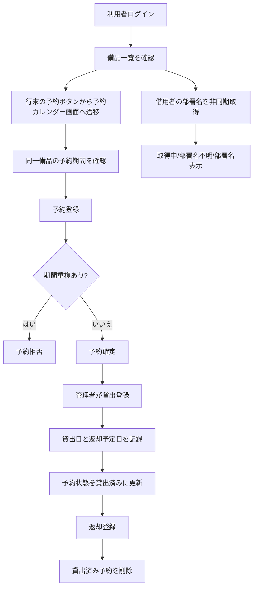
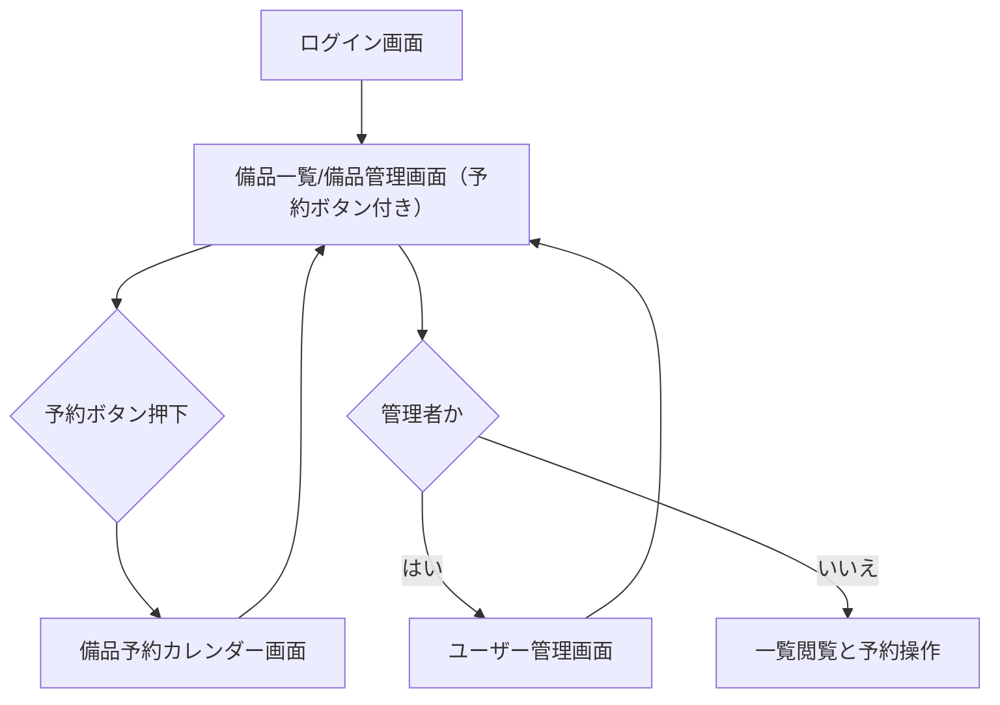
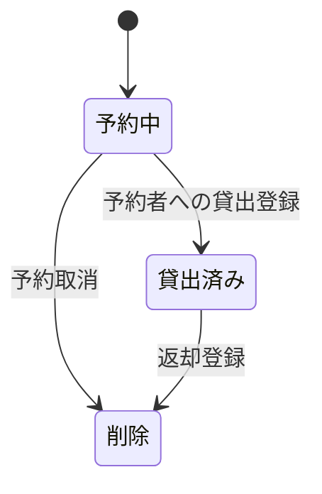

# 変更要件定義書（部署名外部DB取得・予約機能追加）

## 0. 変更概要

- 対象既存要件: `docs/requirements.md`
- 変更要求:
  - 外部DBから部署名を取得して表示する
  - 期間指定の予約機能を追加する
- 先行スキル実行結果:
  - `isdd-external-precheck` 実行済み
  - レポート: `external/neon-postgres/docs/precheck_report.md`
  - 判定: 要件定義へ進行可

---

## 1. 目的・前提

変更なし。既存要件定義書 `docs/requirements.md` セクション[1] を参照。

---

## 2. 業務

### 2-1. 対象業務一覧

既存業務（備品台帳管理業務、備品貸出返却業務）は変更なし。

| 変更区分 | RQ-BZ-ID | 業務名 | 概要 | この要件が無いと何が困るか |
|---|---|---|---|---|
| [追加] | `RQ-BZ-ASSET-RESERVATION-MANAGEMENT` | 備品予約管理業務 | 備品ごとの予約登録・予約取消・予約カレンダー確認を行う。 | 予約の責務が業務として定義されず、機能追加の判断基準が曖昧になる。 |

### 2-2. 業務フロー（mermaid）



### 2-3. 業務の範囲・担当者

| 変更区分 | 業務ID | 範囲 | 担当者 | 対応業務課題ID（RQ-BK-*） | この要件が無いと何が困るか（または削除しても困らない根拠） |
|---|---|---|---|---|---|
| [追加] | `RQ-BZ-ASSET-RESERVATION-MANAGEMENT` | 予約登録、予約取消、予約カレンダー確認 | 管理者、一般ユーザー | `RQ-BK-RESERVATION-CONFLICT-PREVENTION` | 利用者が予約を業務として扱えず、貸出前の調整ができない。 |

### 2-4. 業務課題・KPI

| 変更区分 | RQ-BK-ID | 業務課題 | KPI | この要件が無いと何が困るか |
|---|---|---|---|---|
| [追加] | `RQ-BK-DEPARTMENT-NAME-VISIBILITY` | 借用者の部署名が一覧と予約画面で確認できず、利用調整の判断が遅れる | 備品一覧および予約カレンダーで部署名確認を3秒以内にする | 誰がどの部門で利用しているか判断できず、問い合わせと調整工数が増える。 |
| [追加] | `RQ-BK-RESERVATION-CONFLICT-PREVENTION` | 期間指定の予約ができず、貸出予定が重複する | 同一備品の期間重複予約を0件にする | 貸出直前に競合が発生し、業務が停止または再調整になる。 |

### 2-5. 解決すべき課題と対応方針

| 変更区分 | RQ-BK-ID | 解決課題 | 対応方針 | この要件が無いと何が困るか |
|---|---|---|---|---|
| [追加] | `RQ-BK-DEPARTMENT-NAME-VISIBILITY` | 借用者部署の可視化不足 | 外部DBから部署名を読み取り専用で非同期取得し、備品一覧と予約カレンダーへ表示する。 | 予約判断時に部門確認のため別確認が必要になり、即時判断できない。 |
| [追加] | `RQ-BK-RESERVATION-CONFLICT-PREVENTION` | 予約競合の発生 | 期間指定予約、重複拒否、予約者優先貸出ルールを定義する。 | 同一期間に複数予約が成立し、貸出時点で衝突する。 |

### 2-6. システム化による見込み経営効果

| 変更区分 | RQ-BK-ID | 効果区分 | 内容 | この要件が無いと何が困るか |
|---|---|---|---|---|
| [追加] | `RQ-BK-DEPARTMENT-NAME-VISIBILITY` | Soft Saving | 部門確認の問い合わせ往復を削減し、貸出判断時間を短縮する。 | 部門確認の手戻り工数が継続する。 |
| [追加] | `RQ-BK-RESERVATION-CONFLICT-PREVENTION` | Cost Avoidance | 競合予約による再調整・再説明コストを抑止する。 | 競合発生時の再調整コストが継続する。 |

### 2-1. 業務課題一覧（必須）

| 変更区分 | RQ-BK-ID | 業務課題 | 現状の問題 | 業務影響 | 解決状態 |
|---|---|---|---|---|---|
| [追加] | `RQ-BK-DEPARTMENT-NAME-VISIBILITY` | 部署名可視化不足 | 借用者名は見えるが部署名を業務画面で確認できない | 予約・貸出判断に追加確認が発生する | 一覧と予約カレンダーで部署名を確認できる |
| [追加] | `RQ-BK-RESERVATION-CONFLICT-PREVENTION` | 期間重複予約の発生 | 予約機能がなく、利用予定を事前固定できない | 貸出タイミングで競合が発生する | 期間重複を拒否し、予約者優先で貸出できる |

### 2-7. 業務課題と機能の整合

| 変更区分 | RQ-BK-ID | 対応機能ID | 確認結果 |
|---|---|---|---|
| [追加] | `RQ-BK-DEPARTMENT-NAME-VISIBILITY` | `RQ-EX-CONNECT-EXTERNAL-DEPARTMENT-DB`, `RQ-EX-READ-ONLY-EXTERNAL-DEPARTMENT-DB`, `RQ-FT-VIEW-ASSET-LIST-WITH-DEPARTMENT`, `RQ-FT-DISPLAY-DEPARTMENT-NAME-ASYNC-STATE`, `RQ-FT-VIEW-ASSET-RESERVATION-CALENDAR` | 可視化要件を満たす最小機能が定義されている |
| [追加] | `RQ-BK-RESERVATION-CONFLICT-PREVENTION` | `RQ-FT-REGISTER-RESERVATION`, `RQ-FT-VALIDATE-RESERVATION-PERIOD-OVERLAP`, `RQ-FT-CANCEL-RESERVATION`, `RQ-FT-REGISTER-LOAN-WITH-RETURN-DUE-DATE`, `RQ-FT-ENFORCE-RESERVATION-OWNER-LOAN`, `RQ-FT-TRANSITION-RESERVATION-TO-LOANED`, `RQ-FT-DELETE-LOANED-RESERVATION-ON-RETURN`, `RQ-FT-REJECT-RESERVATION-WHEN-RETURN-DUE-DATE-MISSING` | 競合防止要件を満たす最小機能が定義されている |

---

## 3. 機能要件

### 3-1. 入力データ（人手入力 / 外部連携）

| 変更区分 | RQ-ID | 種別 | 入力内容 | 入力者 | 対応業務課題ID（RQ-BK-*） | この要件が無いと何が困るか（または削除しても困らない根拠） |
|---|---|---|---|---|---|---|
| [削除] | `RQ-FT-REGISTER-LOAN` (`deprecated`) | 人手入力 | 資産管理番号、借用者、貸出日 | 管理者 | `RQ-BK-RESERVATION-CONFLICT-PREVENTION` | 返却予定日を扱えず、貸出期間と予約期間の重複判定が成立しないため削除する。 |
| [追加] | `RQ-FT-REGISTER-LOAN-WITH-RETURN-DUE-DATE` | 人手入力 | 資産管理番号、借用者、貸出日、返却予定日 | 管理者 | `RQ-BK-RESERVATION-CONFLICT-PREVENTION` | 貸出期間が確定できず、予約受付可否を判定できない。 |
| [追加] | `RQ-FT-REGISTER-RESERVATION` | 人手入力 | 資産管理番号、予約開始日、予約終了日 | 管理者、一般ユーザー（本人予約のみ） | `RQ-BK-RESERVATION-CONFLICT-PREVENTION` | 期間指定予約ができず、利用調整を事前に確定できない。 |
| [追加] | `RQ-FT-CANCEL-RESERVATION` | 人手入力 | 予約ID | 管理者、予約者本人 | `RQ-BK-RESERVATION-CONFLICT-PREVENTION` | 誤予約の解消ができず、予約枠が塞がったままになる。 |
| [削除] | `RQ-EX-DISABLE-EXTERNAL-SYSTEM-INTEGRATION` (`deprecated`) | 外部連携 | 外部システムからの入力は受け付けない | なし | `RQ-BK-DEPARTMENT-NAME-VISIBILITY` | 部署名取得の前提と矛盾するため削除する。 |
| [追加] | `RQ-EX-CONNECT-EXTERNAL-DEPARTMENT-DB` | 外部連携 | `login_id=user_id` で外部DBを参照し部署名を取得する | システム | `RQ-BK-DEPARTMENT-NAME-VISIBILITY` | 部署名を業務画面へ表示できない。 |

### 3-2. 出力データ

| 変更区分 | RQ-ID | 出力項目 | 内容 | 対応業務課題ID（RQ-BK-*） | この要件が無いと何が困るか（または削除しても困らない根拠） |
|---|---|---|---|---|---|
| [削除] | `RQ-FT-VIEW-ASSET-LIST` (`deprecated`) | 備品一覧 | `資産管理番号 / 備品名 / 状態 / 借用者名` のみ表示 | `RQ-BK-DEPARTMENT-NAME-VISIBILITY` | 部署名表示を満たせないため削除する。 |
| [追加] | `RQ-FT-VIEW-ASSET-LIST-WITH-DEPARTMENT` | 備品一覧 | `資産管理番号 / 備品名 / 状態 / 借用者名 / 借用者部署名` を表示し、各行末に `予約` ボタンを表示する | `RQ-BK-DEPARTMENT-NAME-VISIBILITY`, `RQ-BK-RESERVATION-CONFLICT-PREVENTION` | 借用者部署を確認できず、予約画面への導線も不足する。 |
| [追加] | `RQ-FT-VIEW-ASSET-RESERVATION-CALENDAR` | 予約カレンダー | 選択備品の月次カレンダーで予約期間、予約者、予約者部署名、予約状態を表示する | `RQ-BK-DEPARTMENT-NAME-VISIBILITY`, `RQ-BK-RESERVATION-CONFLICT-PREVENTION` | 期間重複を視覚確認できず、予約判断に時間がかかる。 |
| [追加] | `RQ-FT-DISPLAY-DEPARTMENT-NAME-ASYNC-STATE` | 部署名表示状態 | 部署名は `取得しています...` → `部署名` または `部署名不明` を表示する | `RQ-BK-DEPARTMENT-NAME-VISIBILITY` | 遅延時に未取得と障害を区別できず、誤解が発生する。 |

### 3-3. 外部連携

| 変更区分 | RQ-ID | 項目 | 内容 | 対応業務課題ID（RQ-BK-*） | この要件が無いと何が困るか（または削除しても困らない根拠） |
|---|---|---|---|---|---|
| [削除] | `RQ-EX-DISABLE-EXTERNAL-SYSTEM-INTEGRATION` (`deprecated`) | 外部連携要件 | 外部連携を実施しない | `RQ-BK-DEPARTMENT-NAME-VISIBILITY` | 部署名取得要件と矛盾するため削除する。 |
| [追加] | `RQ-EX-CONNECT-EXTERNAL-DEPARTMENT-DB` | 接続先 | Neon PostgreSQL の `public.demo_users` と `public.demo_departments` を参照する | `RQ-BK-DEPARTMENT-NAME-VISIBILITY` | 参照元が未定義となり、部署名取得の整合が取れない。 |
| [追加] | `RQ-EX-READ-ONLY-EXTERNAL-DEPARTMENT-DB` | 接続方式 | 外部DBは読み取り専用で使用し、書き込み操作を禁止する | `RQ-BK-DEPARTMENT-NAME-VISIBILITY` | 外部データ改変リスクが発生し、運用統制を満たせない。 |

### 3-4. GUI の場合：全画面の仕様と画面遷移図

既存のログイン画面およびユーザー管理画面は変更なし。

| 変更区分 | RQ-ID | 画面名 | 利用者 | 仕様 | 対応業務課題ID（RQ-BK-*） | この要件が無いと何が困るか（または削除しても困らない根拠） |
|---|---|---|---|---|---|---|
| [削除] | `RQ-UI-ASSET-LIST-MANAGEMENT-SCREEN` (`deprecated`) | 備品一覧/備品管理画面 | 管理者、一般ユーザー | 予約導線と予約表示を持たない旧画面 | `RQ-BK-DEPARTMENT-NAME-VISIBILITY`, `RQ-BK-RESERVATION-CONFLICT-PREVENTION` | 予約機能導線と部署名表示要件を満たせないため削除する。 |
| [追加] | `RQ-UI-ASSET-LIST-WITH-RESERVATION-BUTTON-SCREEN` | 備品一覧/備品管理画面（予約導線付き） | 管理者、一般ユーザー | 一覧に借用者部署名を表示し、各行末に `予約` ボタンを配置する | `RQ-BK-DEPARTMENT-NAME-VISIBILITY`, `RQ-BK-RESERVATION-CONFLICT-PREVENTION` | 予約画面へ遷移できず、部署確認も不足する。 |
| [追加] | `RQ-UI-ASSET-RESERVATION-CALENDAR-SCREEN` | 備品予約カレンダー画面 | 管理者、一般ユーザー | 選択備品の月次カレンダー表示、予約登録、予約取消、重複エラー表示を行う | `RQ-BK-DEPARTMENT-NAME-VISIBILITY`, `RQ-BK-RESERVATION-CONFLICT-PREVENTION` | 期間重複を確認しながら予約できない。 |



### 3-5. 全機能のユーザー利用フロー（mermaid）

```mermaid
flowchart TD
    A[利用者ログイン] --> B[備品一覧で部署名確認]
    B --> C[予約ボタン押下]
    C --> D[予約カレンダーで期間確認]
    D --> E[予約登録]
    E --> F{重複判定}
    F -->|重複あり| G[予約拒否]
    F -->|重複なし| H[予約確定]
    H --> I[管理者が貸出登録(返却予定日含む)]
    I --> J[予約状態を貸出済みに更新]
    J --> K[返却登録]
    K --> L[貸出済み予約を削除]
```

### 3-6. 業務フローとの対応関係

| 変更区分 | RQ-ID | 業務フロー工程 | 対応内容 |
|---|---|---|---|
| [削除] | `RQ-FT-REGISTER-LOAN` (`deprecated`) | 貸出登録 | 返却予定日なしの旧貸出登録 |
| [追加] | `RQ-FT-REGISTER-LOAN-WITH-RETURN-DUE-DATE` | 貸出登録 | 貸出日と返却予定日を記録する |
| [追加] | `RQ-FT-REGISTER-RESERVATION` | 予約登録 | 予約期間を登録する |
| [追加] | `RQ-FT-VALIDATE-RESERVATION-PERIOD-OVERLAP` | 予約登録 | 期間重複を判定し重複時は拒否する |
| [追加] | `RQ-FT-ENFORCE-RESERVATION-OWNER-LOAN` | 貸出登録 | 予約がある場合は該当予約者のみ貸出可能にする |
| [追加] | `RQ-FT-TRANSITION-RESERVATION-TO-LOANED` | 貸出登録後 | 該当予約を貸出済みに更新する |
| [追加] | `RQ-FT-DELETE-LOANED-RESERVATION-ON-RETURN` | 返却登録 | 同一備品の貸出済み予約を削除する |

### 3-7. ログの要否・内容・保存期間

変更なし。既存要件定義書 `docs/requirements.md` セクション[3-7] を参照。

### 3-8. 監視・アラートの要否・内容・対応方法

変更なし。既存要件定義書 `docs/requirements.md` セクション[3-8] を参照。

### 3-9. 機能一覧

| 変更区分 | RQ-ID | カテゴリ | 機能名 | 対応業務課題ID（RQ-BK-*） | この機能が無いと何が困るか（または削除しても困らない根拠） |
|---|---|---|---|---|---|
| [削除] | `RQ-FT-VIEW-ASSET-LIST` (`deprecated`) | 業務機能 | 備品一覧閲覧（部署名なし） | `RQ-BK-DEPARTMENT-NAME-VISIBILITY` | 部署名表示の新要件を満たせないため削除する。 |
| [削除] | `RQ-FT-REGISTER-LOAN` (`deprecated`) | 業務機能 | 返却予定日なし貸出登録 | `RQ-BK-RESERVATION-CONFLICT-PREVENTION` | 予約期間との突合に必要な返却予定日を扱えないため削除する。 |
| [削除] | `RQ-EX-DISABLE-EXTERNAL-SYSTEM-INTEGRATION` (`deprecated`) | 外部連携 | 外部連携なし固定スコープ | `RQ-BK-DEPARTMENT-NAME-VISIBILITY` | 部署名取得要件と矛盾するため削除する。 |
| [追加] | `RQ-FT-VIEW-ASSET-LIST-WITH-DEPARTMENT` | 業務機能 | 備品一覧閲覧（部署名表示・予約導線付き） | `RQ-BK-DEPARTMENT-NAME-VISIBILITY`, `RQ-BK-RESERVATION-CONFLICT-PREVENTION` | 部署確認と予約遷移が1画面で成立しない。 |
| [追加] | `RQ-FT-DISPLAY-DEPARTMENT-NAME-ASYNC-STATE` | 業務機能 | 部署名非同期表示状態管理 | `RQ-BK-DEPARTMENT-NAME-VISIBILITY` | 取得中と取得失敗の区別がつかず誤解を生む。 |
| [追加] | `RQ-FT-VIEW-ASSET-RESERVATION-CALENDAR` | 業務機能 | 備品予約カレンダー表示 | `RQ-BK-DEPARTMENT-NAME-VISIBILITY`, `RQ-BK-RESERVATION-CONFLICT-PREVENTION` | 期間重複を視覚的に判断できない。 |
| [追加] | `RQ-FT-REGISTER-RESERVATION` | 業務機能 | 期間指定予約登録（本人予約） | `RQ-BK-RESERVATION-CONFLICT-PREVENTION` | 利用予定を事前確定できない。 |
| [追加] | `RQ-FT-VALIDATE-RESERVATION-PERIOD-OVERLAP` | 業務機能 | 期間重複判定（両端含む） | `RQ-BK-RESERVATION-CONFLICT-PREVENTION` | 同日境界を含む重複予約を防止できない。 |
| [追加] | `RQ-FT-CANCEL-RESERVATION` | 業務機能 | 予約取消（本人・管理者） | `RQ-BK-RESERVATION-CONFLICT-PREVENTION` | 誤予約を解除できず予約枠が固定される。 |
| [追加] | `RQ-FT-REGISTER-LOAN-WITH-RETURN-DUE-DATE` | 業務機能 | 返却予定日付き貸出登録 | `RQ-BK-RESERVATION-CONFLICT-PREVENTION` | 予約受付可否を貸出期間で判定できない。 |
| [追加] | `RQ-FT-ENFORCE-RESERVATION-OWNER-LOAN` | 業務機能 | 予約者優先貸出制御 | `RQ-BK-RESERVATION-CONFLICT-PREVENTION` | 予約者以外への貸出で衝突防止要件が崩れる。 |
| [追加] | `RQ-FT-TRANSITION-RESERVATION-TO-LOANED` | 業務機能 | 予約状態の貸出済み遷移 | `RQ-BK-RESERVATION-CONFLICT-PREVENTION` | 予約から貸出への連続性が途切れ、返却時処理基準が失われる。 |
| [追加] | `RQ-FT-DELETE-LOANED-RESERVATION-ON-RETURN` | 業務機能 | 返却時の貸出済み予約削除 | `RQ-BK-RESERVATION-CONFLICT-PREVENTION` | 返却後も不要予約が残り、次回予約判定を妨げる。 |
| [追加] | `RQ-FT-REJECT-RESERVATION-WHEN-RETURN-DUE-DATE-MISSING` | 業務機能 | 返却予定日未設定時の予約拒否 | `RQ-BK-RESERVATION-CONFLICT-PREVENTION` | 貸出期間不明のまま予約を受け付け、誤判定が発生する。 |
| [追加] | `RQ-EX-CONNECT-EXTERNAL-DEPARTMENT-DB` | 外部連携 | 外部DB部署マスタ参照 | `RQ-BK-DEPARTMENT-NAME-VISIBILITY` | 部署名の取得元がなく可視化できない。 |
| [追加] | `RQ-EX-READ-ONLY-EXTERNAL-DEPARTMENT-DB` | 外部連携 | 外部DB読み取り専用制御 | `RQ-BK-DEPARTMENT-NAME-VISIBILITY` | 外部データ改変リスクを抑止できない。 |

### 3-10. 機能と画面・ユーザーフローの対応検証

| 変更区分 | 機能ID | 画面ID | ユーザーフロー工程 | 対応確認 |
|---|---|---|---|---|
| [追加] | `RQ-FT-VIEW-ASSET-LIST-WITH-DEPARTMENT` | `RQ-UI-ASSET-LIST-WITH-RESERVATION-BUTTON-SCREEN` | 一覧閲覧 | 一致 |
| [追加] | `RQ-FT-VIEW-ASSET-RESERVATION-CALENDAR` | `RQ-UI-ASSET-RESERVATION-CALENDAR-SCREEN` | 予約確認 | 一致 |
| [追加] | `RQ-FT-REGISTER-RESERVATION` | `RQ-UI-ASSET-RESERVATION-CALENDAR-SCREEN` | 予約登録 | 一致 |
| [追加] | `RQ-FT-CANCEL-RESERVATION` | `RQ-UI-ASSET-RESERVATION-CALENDAR-SCREEN` | 予約取消 | 一致 |
| [追加] | `RQ-FT-DISPLAY-DEPARTMENT-NAME-ASYNC-STATE` | `RQ-UI-ASSET-LIST-WITH-RESERVATION-BUTTON-SCREEN`, `RQ-UI-ASSET-RESERVATION-CALENDAR-SCREEN` | 部署名表示 | 一致 |

---

## 4. データ

### 4-1. 内部データ / 外部データの区別

既存のユーザーデータ、現在貸出状態データ、エラーログデータは変更なし。

| 変更区分 | RQ-ID | データ名 | 区分 | 内容 | 対応業務課題ID（RQ-BK-*） | この要件が無いと何が困るか（または削除しても困らない根拠） |
|---|---|---|---|---|---|---|
| [削除] | `RQ-DT-ASSET-MASTER-INTERNAL-DATA` (`deprecated`) | 備品マスタ | 内部データ | 返却予定日を持たない旧定義 | `RQ-BK-RESERVATION-CONFLICT-PREVENTION` | 貸出期間判定に必要な返却予定日を扱えないため削除する。 |
| [追加] | `RQ-DT-ASSET-MASTER-INTERNAL-DATA-WITH-RETURN-DUE-DATE` | 備品マスタ | 内部データ | 資産管理番号、備品名、貸出状態、借用者、貸出日、返却予定日 | `RQ-BK-RESERVATION-CONFLICT-PREVENTION` | 予約判定の基準となる貸出期間を保持できない。 |
| [追加] | `RQ-DT-RESERVATION-INTERNAL-DATA` | 予約データ | 内部データ | 予約ID、資産管理番号、予約者ログインID、開始日、終了日、予約状態（予約中/貸出済み） | `RQ-BK-RESERVATION-CONFLICT-PREVENTION` | 予約と貸出の整合を維持できない。 |
| [削除] | `RQ-DT-NO-EXTERNAL-DATA` (`deprecated`) | 外部データなし | 外部データ | 外部データを使用しない | `RQ-BK-DEPARTMENT-NAME-VISIBILITY` | 部署名取得要件と矛盾するため削除する。 |
| [追加] | `RQ-DT-EXTERNAL-DEPARTMENT-MASTER-DATA` | 部署マスタ（外部） | 外部データ | `demo_users.user_id/department_id`, `demo_departments.department_id/department_name` を参照する | `RQ-BK-DEPARTMENT-NAME-VISIBILITY` | 部署名表示要件を満たせない。 |

### 4-2. データ保持期間

既存のデータ保持期間（備品、ユーザー、現在貸出状態、エラーログ）は変更なし。

| 変更区分 | RQ-ID | データ名 | 保持期間 | 対応業務課題ID（RQ-BK-*） | この要件が無いと何が困るか |
|---|---|---|---|---|---|
| [追加] | `RQ-DT-RESERVATION-DATA-RETENTION-UNTIL-RETURN-OR-CANCEL` | 予約データ | 予約中および貸出済みの間は保持し、取消時および返却時に削除する | `RQ-BK-RESERVATION-CONFLICT-PREVENTION` | 返却前の予約整合が維持できず、不要データも残存する。 |

### 4-3. 外部 DB 接続先と接続方法の一覧

| 変更区分 | RQ-ID | 接続先 | 接続方法 | 対応業務課題ID（RQ-BK-*） | この要件が無いと何が困るか（または削除しても困らない根拠） |
|---|---|---|---|---|---|
| [削除] | `RQ-DT-NO-EXTERNAL-DB-CONNECTION` (`deprecated`) | なし | 外部DB接続は行わない | `RQ-BK-DEPARTMENT-NAME-VISIBILITY` | 部署名取得要件と矛盾するため削除する。 |
| [追加] | `RQ-DT-EXTERNAL-DEPARTMENT-DB-CONNECTION` | Neon PostgreSQL | `login_id=user_id` で部署を参照し、読み取り専用で接続する | `RQ-BK-DEPARTMENT-NAME-VISIBILITY` | 接続仕様が未定義となり、実装と運用の整合が取れない。 |

### 4-4. DB の必要性の有無と理由

既存の内部DB利用方針（SQLite利用と単一台帳維持のためのDB必要性）は変更なし。

| 変更区分 | RQ-ID | 判定 | 理由 | 対応業務課題ID（RQ-BK-*） | この要件が無いと何が困るか |
|---|---|---|---|---|---|
| [追加] | `RQ-DT-RESERVATION-DB-REQUIRED` | 必要 | 期間重複判定と貸出済み遷移を保持するため予約テーブルが必要 | `RQ-BK-RESERVATION-CONFLICT-PREVENTION` | 予約競合を恒久的に防止できない。 |

### 4-5. 業務エンティティ一覧

既存の業務エンティティ（備品、ユーザー）は変更なし。

| 変更区分 | RQ-ID | カテゴリ | 業務エンティティ名 | 対応業務課題ID（RQ-BK-*） | この業務エンティティが無いと何が困るか |
|---|---|---|---|---|---|
| [追加] | `RQ-DT-RESERVATION-ENTITY` | データ | 予約 | `RQ-BK-RESERVATION-CONFLICT-PREVENTION` | 予約期間と予約者を管理できない。 |
| [追加] | `RQ-DT-DEPARTMENT-ENTITY` | データ | 部署（外部参照） | `RQ-BK-DEPARTMENT-NAME-VISIBILITY` | 借用者部署名の表示根拠を持てない。 |

### 4-6. エンティティ定義表

#### 備品エンティティ（`RQ-DT-ASSET-ENTITY`、対応業務課題: `RQ-BK-RESERVATION-CONFLICT-PREVENTION`）

| 項目名 | 型 | 必須 | 説明 |
|---|---|---|---|
| 資産管理番号 | 文字列 | 必須 | 一意キー |
| 備品名 | 文字列 | 必須 | 備品表示名 |
| 貸出状態 | 列挙 | 必須 | `貸出可能` / `貸出中` |
| 借用者ログインID | 文字列 | 条件付き | 貸出中のみ必須 |
| 貸出日 | 日付 | 条件付き | 貸出中のみ必須 |
| 返却予定日 | 日付 | 条件付き | 貸出中のみ必須（更新不可） |

#### 予約エンティティ（`RQ-DT-RESERVATION-ENTITY`）

| 項目名 | 型 | 必須 | 説明 |
|---|---|---|---|
| 予約ID | 文字列 | 必須 | 一意キー |
| 資産管理番号 | 文字列 | 必須 | 予約対象備品 |
| 予約者ログインID | 文字列 | 必須 | 本人予約のみ |
| 予約開始日 | 日付 | 必須 | 当日以降 |
| 予約終了日 | 日付 | 必須 | 開始日以上 |
| 予約状態 | 列挙 | 必須 | `予約中` / `貸出済み` |

### 4-1. CRUDテーブル（必須）

| エンティティ名 | Create | Read（一覧） | Read（詳細） | Update | Delete | 備考 |
|---|---|---|---|---|---|---|
| 備品 | ○ | ○ | × | ○ | △ | 貸出中は削除不可 |
| ユーザー | ○ | ○ | × | ○ | △ | 貸出中備品保有時は削除不可 |
| 予約 | ○ | ○ | ○ | △ | ○ | 貸出時に`貸出済み`へ更新、返却時/取消時に削除 |
| 部署（外部） | × | ○ | ○ | × | × | 外部DB読み取り専用 |

### 4-7. データ整合制約

既存の主要整合制約（資産管理番号一意、ログインID一意、借用者参照整合）は変更なし。

| 変更区分 | RQ-ID | 制約 | 内容 | 対応業務課題ID（RQ-BK-*） | この要件が無いと何が困るか |
|---|---|---|---|---|---|
| [追加] | `RQ-DT-RETURN-DUE-DATE-REQUIRED-WHEN-LOANED` | 必須制約 | 貸出状態が`貸出中`の備品は返却予定日を必須とする | `RQ-BK-RESERVATION-CONFLICT-PREVENTION` | 貸出期間が欠落し、予約可否を判定できない。 |
| [追加] | `RQ-DT-LOGIN-ID-MUST-MATCH-EXTERNAL-USER-ID` | 参照整合制約 | 内部`login_id`と外部`user_id`を一致させて部署を参照する | `RQ-BK-DEPARTMENT-NAME-VISIBILITY` | 部署名参照が不一致となり誤表示が発生する。 |
| [追加] | `RQ-DT-RESERVATION-NO-OVERLAP-INCLUSIVE` | 排他制約 | 同一備品で予約期間の両端含む重複を禁止する | `RQ-BK-RESERVATION-CONFLICT-PREVENTION` | 境界日を含む二重予約を防止できない。 |
| [追加] | `RQ-DT-RESERVATION-OWNER-ONLY-LOAN` | 業務整合制約 | 重複する予約が存在する場合は予約者本人のみ貸出可能とする | `RQ-BK-RESERVATION-CONFLICT-PREVENTION` | 予約者以外への貸出で競合防止が崩れる。 |
| [追加] | `RQ-DT-REJECT-RESERVATION-WHEN-RETURN-DUE-DATE-MISSING` | 業務整合制約 | 貸出中かつ返却予定日未設定の備品は予約受付を拒否する | `RQ-BK-RESERVATION-CONFLICT-PREVENTION` | 貸出期間不明のまま予約が成立し、誤判定が起きる。 |
| [追加] | `RQ-DT-DELETE-LOANED-RESERVATION-ON-RETURN` | 業務整合制約 | 返却時に同一備品の`貸出済み`予約のみ削除する | `RQ-BK-RESERVATION-CONFLICT-PREVENTION` | 返却後に不要予約が残り、次回判定を阻害する。 |

### 4-8. エンティティ状態遷移

#### 予約状態遷移



---

## 5. 非機能要件

### 5-1. 性能

| 変更区分 | RQ-ID | 項目 | 要件 | 対応業務課題ID（RQ-BK-*） | この要件が無いと何が困るか（または削除しても困らない根拠） |
|---|---|---|---|---|---|
| [削除] | `RQ-NF-ASSET-LIST-RESPONSE-UNDER-2S` (`deprecated`) | 応答時間 | 一覧2秒以内 | `RQ-BK-DEPARTMENT-NAME-VISIBILITY` | 外部DB非同期参照を含む実運用条件と整合しないため削除する。 |
| [追加] | `RQ-NF-ASSET-LIST-WITH-DEPARTMENT-RESPONSE-UNDER-3S` | 応答時間 | 外部部署表示を含む備品一覧表示を3秒以内で完了する | `RQ-BK-DEPARTMENT-NAME-VISIBILITY` | 一覧応答維持と部署可視化の両立ができない。 |
| [追加] | `RQ-NF-RESERVATION-CALENDAR-RESPONSE-UNDER-3S` | 応答時間 | 予約カレンダー表示を3秒以内で完了する | `RQ-BK-RESERVATION-CONFLICT-PREVENTION` | 予約判断に時間がかかり、現場で即時予約できない。 |

### 5-2. 利用人数

変更なし。既存要件定義書 `docs/requirements.md` セクション[5-2] を参照。

### 5-3. セキュリティ要件

| 変更区分 | RQ-ID | 項目 | 要件 | 対応業務課題ID（RQ-BK-*） | この要件が無いと何が困るか |
|---|---|---|---|---|---|
| [追加] | `RQ-NF-EXTERNAL-DB-READ-ONLY-ACCESS` | 外部接続権限 | 外部DB接続アカウントは読み取り専用とし、更新系SQLを禁止する | `RQ-BK-DEPARTMENT-NAME-VISIBILITY` | 外部部署マスタの改変リスクを抑止できない。 |

### 5-4. 非機能要件一覧

| 変更区分 | RQ-ID | カテゴリ | 非機能要件名 | 対応業務課題ID（RQ-BK-*） | この非機能要件が無いと何が困るか（または削除しても困らない根拠） |
|---|---|---|---|---|---|
| [削除] | `RQ-NF-ASSET-LIST-RESPONSE-UNDER-2S` (`deprecated`) | 性能 | 一覧2秒以内表示 | `RQ-BK-DEPARTMENT-NAME-VISIBILITY` | 外部参照追加後の実運用条件に不整合なため削除する。 |
| [追加] | `RQ-NF-ASSET-LIST-WITH-DEPARTMENT-RESPONSE-UNDER-3S` | 性能 | 部署表示込み一覧3秒以内 | `RQ-BK-DEPARTMENT-NAME-VISIBILITY` | 一覧応答維持と可視化を両立できない。 |
| [追加] | `RQ-NF-RESERVATION-CALENDAR-RESPONSE-UNDER-3S` | 性能 | 予約カレンダー3秒以内表示 | `RQ-BK-RESERVATION-CONFLICT-PREVENTION` | 予約判断の即時性を満たせない。 |
| [追加] | `RQ-NF-EXTERNAL-DB-READ-ONLY-ACCESS` | セキュリティ | 外部DB読み取り専用アクセス | `RQ-BK-DEPARTMENT-NAME-VISIBILITY` | 外部データ改変リスクが残る。 |

---

## 6. テスト用利用シナリオ

| 変更区分 | RQ-TS-ID | テスト目的 | 前提条件 | テスト手順 | 期待される結果 | 対応業務課題ID（RQ-BK-*） |
|---|---|---|---|---|---|---|
| [削除] | `RQ-TS-VERIFY-ADMIN-REGISTER-LOAN-RETURN` (`deprecated`) | 旧貸出返却フロー確認 | 管理者ログイン済み | 備品登録→貸出登録→返却登録 | 返却予定日と予約遷移を扱わない旧検証 | `RQ-BK-RESERVATION-CONFLICT-PREVENTION` |
| [削除] | `RQ-TS-VERIFY-GENERAL-USER-VIEW-BORROWER` (`deprecated`) | 借用者名のみ閲覧確認 | 一般ユーザーログイン済み | 備品一覧表示 | 部署名表示を検証しない旧検証 | `RQ-BK-DEPARTMENT-NAME-VISIBILITY` |
| [追加] | `RQ-TS-VERIFY-LOAN-WITH-RETURN-DUE-DATE-AND-RESERVATION` | 返却予定日付き貸出と予約貸出済み遷移を確認する | 管理者ログイン済み、対象備品に予約中レコードがある | 予約者本人で貸出登録（返却予定日入力）を実行する | 貸出登録成功、予約状態が`貸出済み`へ遷移する | `RQ-BK-RESERVATION-CONFLICT-PREVENTION` |
| [追加] | `RQ-TS-VERIFY-DEPARTMENT-NAME-ASYNC-DISPLAY` | 部署名非同期表示を確認する | 外部DB接続可能、一般ユーザーログイン済み | 備品一覧と予約カレンダーを表示する | `取得しています...` の後に `部署名` または `部署名不明` が表示される | `RQ-BK-DEPARTMENT-NAME-VISIBILITY` |
| [追加] | `RQ-TS-REJECT-RESERVATION-WITH-OVERLAP` | 期間重複予約拒否を確認する | 既存予約または貸出期間が存在する | 重複する開始日/終了日で予約登録する | 重複エラーで予約登録が拒否される | `RQ-BK-RESERVATION-CONFLICT-PREVENTION` |
| [追加] | `RQ-TS-VERIFY-RESERVATION-CALENDAR-WITH-DEPARTMENT` | 予約カレンダーで部署名確認を行う | 任意の備品に予約データが存在する | 備品一覧行末の予約ボタンから予約カレンダーへ遷移する | 選択備品の月次カレンダーに予約者と部署名が表示される | `RQ-BK-DEPARTMENT-NAME-VISIBILITY`, `RQ-BK-RESERVATION-CONFLICT-PREVENTION` |
| [追加] | `RQ-TS-REJECT-RESERVATION-WHEN-RETURN-DUE-DATE-MISSING` | 返却予定日未設定時の予約拒否を確認する | 貸出中かつ返却予定日未設定の備品が存在する | 該当備品に予約登録を試行する | 予約受付不可エラーとなる | `RQ-BK-RESERVATION-CONFLICT-PREVENTION` |

---

## 7. 変更後の業務課題と要件の対応表

### 7-1. 業務課題（RQ-BK-*）→ 要件（RQ-*）

| 変更区分 | RQ-BK-ID | 業務課題 | 対応要件ID |
|---|---|---|---|
| [追加] | `RQ-BK-DEPARTMENT-NAME-VISIBILITY` | 部署名可視化不足 | `RQ-EX-CONNECT-EXTERNAL-DEPARTMENT-DB`, `RQ-EX-READ-ONLY-EXTERNAL-DEPARTMENT-DB`, `RQ-FT-VIEW-ASSET-LIST-WITH-DEPARTMENT`, `RQ-FT-VIEW-ASSET-RESERVATION-CALENDAR`, `RQ-FT-DISPLAY-DEPARTMENT-NAME-ASYNC-STATE`, `RQ-UI-ASSET-LIST-WITH-RESERVATION-BUTTON-SCREEN`, `RQ-UI-ASSET-RESERVATION-CALENDAR-SCREEN`, `RQ-DT-EXTERNAL-DEPARTMENT-MASTER-DATA`, `RQ-DT-EXTERNAL-DEPARTMENT-DB-CONNECTION`, `RQ-DT-LOGIN-ID-MUST-MATCH-EXTERNAL-USER-ID`, `RQ-DT-DEPARTMENT-ENTITY`, `RQ-NF-ASSET-LIST-WITH-DEPARTMENT-RESPONSE-UNDER-3S`, `RQ-NF-EXTERNAL-DB-READ-ONLY-ACCESS`, `RQ-TS-VERIFY-DEPARTMENT-NAME-ASYNC-DISPLAY`, `RQ-TS-VERIFY-RESERVATION-CALENDAR-WITH-DEPARTMENT`, `RQ-EX-DISABLE-EXTERNAL-SYSTEM-INTEGRATION` (`deprecated`), `RQ-DT-NO-EXTERNAL-DATA` (`deprecated`), `RQ-DT-NO-EXTERNAL-DB-CONNECTION` (`deprecated`), `RQ-FT-VIEW-ASSET-LIST` (`deprecated`), `RQ-NF-ASSET-LIST-RESPONSE-UNDER-2S` (`deprecated`), `RQ-UI-ASSET-LIST-MANAGEMENT-SCREEN` (`deprecated`), `RQ-TS-VERIFY-GENERAL-USER-VIEW-BORROWER` (`deprecated`) |
| [追加] | `RQ-BK-RESERVATION-CONFLICT-PREVENTION` | 期間重複予約の発生 | `RQ-FT-REGISTER-RESERVATION`, `RQ-FT-VALIDATE-RESERVATION-PERIOD-OVERLAP`, `RQ-FT-CANCEL-RESERVATION`, `RQ-FT-REGISTER-LOAN-WITH-RETURN-DUE-DATE`, `RQ-FT-ENFORCE-RESERVATION-OWNER-LOAN`, `RQ-FT-TRANSITION-RESERVATION-TO-LOANED`, `RQ-FT-DELETE-LOANED-RESERVATION-ON-RETURN`, `RQ-FT-REJECT-RESERVATION-WHEN-RETURN-DUE-DATE-MISSING`, `RQ-FT-VIEW-ASSET-RESERVATION-CALENDAR`, `RQ-UI-ASSET-LIST-WITH-RESERVATION-BUTTON-SCREEN`, `RQ-UI-ASSET-RESERVATION-CALENDAR-SCREEN`, `RQ-DT-ASSET-MASTER-INTERNAL-DATA-WITH-RETURN-DUE-DATE`, `RQ-DT-RESERVATION-INTERNAL-DATA`, `RQ-DT-RESERVATION-DATA-RETENTION-UNTIL-RETURN-OR-CANCEL`, `RQ-DT-RESERVATION-DB-REQUIRED`, `RQ-DT-RESERVATION-ENTITY`, `RQ-DT-RETURN-DUE-DATE-REQUIRED-WHEN-LOANED`, `RQ-DT-RESERVATION-NO-OVERLAP-INCLUSIVE`, `RQ-DT-RESERVATION-OWNER-ONLY-LOAN`, `RQ-DT-REJECT-RESERVATION-WHEN-RETURN-DUE-DATE-MISSING`, `RQ-DT-DELETE-LOANED-RESERVATION-ON-RETURN`, `RQ-NF-RESERVATION-CALENDAR-RESPONSE-UNDER-3S`, `RQ-TS-VERIFY-LOAN-WITH-RETURN-DUE-DATE-AND-RESERVATION`, `RQ-TS-REJECT-RESERVATION-WITH-OVERLAP`, `RQ-TS-VERIFY-RESERVATION-CALENDAR-WITH-DEPARTMENT`, `RQ-TS-REJECT-RESERVATION-WHEN-RETURN-DUE-DATE-MISSING`, `RQ-FT-REGISTER-LOAN` (`deprecated`), `RQ-TS-VERIFY-ADMIN-REGISTER-LOAN-RETURN` (`deprecated`) |

### 7-2. 要件（RQ-*）→ 業務課題（RQ-BK-*）

| 変更区分 | RQ-ID | 対応業務課題ID（RQ-BK-*） |
|---|---|---|
| [削除] | `RQ-EX-DISABLE-EXTERNAL-SYSTEM-INTEGRATION` (`deprecated`) | `RQ-BK-DEPARTMENT-NAME-VISIBILITY` |
| [削除] | `RQ-DT-NO-EXTERNAL-DATA` (`deprecated`) | `RQ-BK-DEPARTMENT-NAME-VISIBILITY` |
| [削除] | `RQ-DT-NO-EXTERNAL-DB-CONNECTION` (`deprecated`) | `RQ-BK-DEPARTMENT-NAME-VISIBILITY` |
| [削除] | `RQ-FT-VIEW-ASSET-LIST` (`deprecated`) | `RQ-BK-DEPARTMENT-NAME-VISIBILITY` |
| [削除] | `RQ-FT-REGISTER-LOAN` (`deprecated`) | `RQ-BK-RESERVATION-CONFLICT-PREVENTION` |
| [削除] | `RQ-UI-ASSET-LIST-MANAGEMENT-SCREEN` (`deprecated`) | `RQ-BK-DEPARTMENT-NAME-VISIBILITY`, `RQ-BK-RESERVATION-CONFLICT-PREVENTION` |
| [削除] | `RQ-DT-ASSET-MASTER-INTERNAL-DATA` (`deprecated`) | `RQ-BK-RESERVATION-CONFLICT-PREVENTION` |
| [削除] | `RQ-NF-ASSET-LIST-RESPONSE-UNDER-2S` (`deprecated`) | `RQ-BK-DEPARTMENT-NAME-VISIBILITY` |
| [削除] | `RQ-TS-VERIFY-ADMIN-REGISTER-LOAN-RETURN` (`deprecated`) | `RQ-BK-RESERVATION-CONFLICT-PREVENTION` |
| [削除] | `RQ-TS-VERIFY-GENERAL-USER-VIEW-BORROWER` (`deprecated`) | `RQ-BK-DEPARTMENT-NAME-VISIBILITY` |
| [追加] | `RQ-EX-CONNECT-EXTERNAL-DEPARTMENT-DB` | `RQ-BK-DEPARTMENT-NAME-VISIBILITY` |
| [追加] | `RQ-EX-READ-ONLY-EXTERNAL-DEPARTMENT-DB` | `RQ-BK-DEPARTMENT-NAME-VISIBILITY` |
| [追加] | `RQ-FT-VIEW-ASSET-LIST-WITH-DEPARTMENT` | `RQ-BK-DEPARTMENT-NAME-VISIBILITY`, `RQ-BK-RESERVATION-CONFLICT-PREVENTION` |
| [追加] | `RQ-FT-DISPLAY-DEPARTMENT-NAME-ASYNC-STATE` | `RQ-BK-DEPARTMENT-NAME-VISIBILITY` |
| [追加] | `RQ-FT-VIEW-ASSET-RESERVATION-CALENDAR` | `RQ-BK-DEPARTMENT-NAME-VISIBILITY`, `RQ-BK-RESERVATION-CONFLICT-PREVENTION` |
| [追加] | `RQ-FT-REGISTER-RESERVATION` | `RQ-BK-RESERVATION-CONFLICT-PREVENTION` |
| [追加] | `RQ-FT-VALIDATE-RESERVATION-PERIOD-OVERLAP` | `RQ-BK-RESERVATION-CONFLICT-PREVENTION` |
| [追加] | `RQ-FT-CANCEL-RESERVATION` | `RQ-BK-RESERVATION-CONFLICT-PREVENTION` |
| [追加] | `RQ-FT-REGISTER-LOAN-WITH-RETURN-DUE-DATE` | `RQ-BK-RESERVATION-CONFLICT-PREVENTION` |
| [追加] | `RQ-FT-ENFORCE-RESERVATION-OWNER-LOAN` | `RQ-BK-RESERVATION-CONFLICT-PREVENTION` |
| [追加] | `RQ-FT-TRANSITION-RESERVATION-TO-LOANED` | `RQ-BK-RESERVATION-CONFLICT-PREVENTION` |
| [追加] | `RQ-FT-DELETE-LOANED-RESERVATION-ON-RETURN` | `RQ-BK-RESERVATION-CONFLICT-PREVENTION` |
| [追加] | `RQ-FT-REJECT-RESERVATION-WHEN-RETURN-DUE-DATE-MISSING` | `RQ-BK-RESERVATION-CONFLICT-PREVENTION` |
| [追加] | `RQ-UI-ASSET-LIST-WITH-RESERVATION-BUTTON-SCREEN` | `RQ-BK-DEPARTMENT-NAME-VISIBILITY`, `RQ-BK-RESERVATION-CONFLICT-PREVENTION` |
| [追加] | `RQ-UI-ASSET-RESERVATION-CALENDAR-SCREEN` | `RQ-BK-DEPARTMENT-NAME-VISIBILITY`, `RQ-BK-RESERVATION-CONFLICT-PREVENTION` |
| [追加] | `RQ-DT-ASSET-MASTER-INTERNAL-DATA-WITH-RETURN-DUE-DATE` | `RQ-BK-RESERVATION-CONFLICT-PREVENTION` |
| [追加] | `RQ-DT-RESERVATION-INTERNAL-DATA` | `RQ-BK-RESERVATION-CONFLICT-PREVENTION` |
| [追加] | `RQ-DT-EXTERNAL-DEPARTMENT-MASTER-DATA` | `RQ-BK-DEPARTMENT-NAME-VISIBILITY` |
| [追加] | `RQ-DT-RESERVATION-DATA-RETENTION-UNTIL-RETURN-OR-CANCEL` | `RQ-BK-RESERVATION-CONFLICT-PREVENTION` |
| [追加] | `RQ-DT-EXTERNAL-DEPARTMENT-DB-CONNECTION` | `RQ-BK-DEPARTMENT-NAME-VISIBILITY` |
| [追加] | `RQ-DT-RESERVATION-DB-REQUIRED` | `RQ-BK-RESERVATION-CONFLICT-PREVENTION` |
| [追加] | `RQ-DT-RESERVATION-ENTITY` | `RQ-BK-RESERVATION-CONFLICT-PREVENTION` |
| [追加] | `RQ-DT-DEPARTMENT-ENTITY` | `RQ-BK-DEPARTMENT-NAME-VISIBILITY` |
| [追加] | `RQ-DT-RETURN-DUE-DATE-REQUIRED-WHEN-LOANED` | `RQ-BK-RESERVATION-CONFLICT-PREVENTION` |
| [追加] | `RQ-DT-LOGIN-ID-MUST-MATCH-EXTERNAL-USER-ID` | `RQ-BK-DEPARTMENT-NAME-VISIBILITY` |
| [追加] | `RQ-DT-RESERVATION-NO-OVERLAP-INCLUSIVE` | `RQ-BK-RESERVATION-CONFLICT-PREVENTION` |
| [追加] | `RQ-DT-RESERVATION-OWNER-ONLY-LOAN` | `RQ-BK-RESERVATION-CONFLICT-PREVENTION` |
| [追加] | `RQ-DT-REJECT-RESERVATION-WHEN-RETURN-DUE-DATE-MISSING` | `RQ-BK-RESERVATION-CONFLICT-PREVENTION` |
| [追加] | `RQ-DT-DELETE-LOANED-RESERVATION-ON-RETURN` | `RQ-BK-RESERVATION-CONFLICT-PREVENTION` |
| [追加] | `RQ-NF-ASSET-LIST-WITH-DEPARTMENT-RESPONSE-UNDER-3S` | `RQ-BK-DEPARTMENT-NAME-VISIBILITY` |
| [追加] | `RQ-NF-RESERVATION-CALENDAR-RESPONSE-UNDER-3S` | `RQ-BK-RESERVATION-CONFLICT-PREVENTION` |
| [追加] | `RQ-NF-EXTERNAL-DB-READ-ONLY-ACCESS` | `RQ-BK-DEPARTMENT-NAME-VISIBILITY` |
| [追加] | `RQ-TS-VERIFY-LOAN-WITH-RETURN-DUE-DATE-AND-RESERVATION` | `RQ-BK-RESERVATION-CONFLICT-PREVENTION` |
| [追加] | `RQ-TS-VERIFY-DEPARTMENT-NAME-ASYNC-DISPLAY` | `RQ-BK-DEPARTMENT-NAME-VISIBILITY` |
| [追加] | `RQ-TS-REJECT-RESERVATION-WITH-OVERLAP` | `RQ-BK-RESERVATION-CONFLICT-PREVENTION` |
| [追加] | `RQ-TS-VERIFY-RESERVATION-CALENDAR-WITH-DEPARTMENT` | `RQ-BK-DEPARTMENT-NAME-VISIBILITY`, `RQ-BK-RESERVATION-CONFLICT-PREVENTION` |
| [追加] | `RQ-TS-REJECT-RESERVATION-WHEN-RETURN-DUE-DATE-MISSING` | `RQ-BK-RESERVATION-CONFLICT-PREVENTION` |

---

## 8. MVP最小化確認（削除可能要件の整理）

| 削除した要件候補 | 削除理由 | 削除しても業務が成立する根拠 |
|---|---|---|
| 予約通知機能 | 今回は競合防止が目的であり通知は必須ではない | 予約カレンダーの可視化と重複拒否で業務目的を達成できる |
| 予約承認ワークフロー | 予約者本人登録と管理者取消で運用可能 | 承認なしでも重複判定と予約者優先貸出で競合防止できる |
| 部署名キャッシュ保持 | 非同期取得と`部署名不明`表示で要件を満たす | 表示継続性は非同期状態表示で担保できる |

上記を削除した結果、追加要件は「部署名可視化」と「期間重複防止」に必要な最小構成のみとする。
