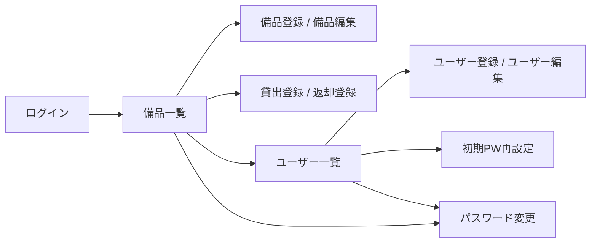

# 備品管理・貸出管理アプリ

このアプリは、社内備品の台帳管理と貸出状況の管理を Web 画面で行うためのシステムです。

## 機能紹介

- ログイン認証（管理者 / 一般ユーザー）
- 備品一覧の表示（資産番号、備品名、状態、借用者名）
- 管理者向けの備品操作（登録、編集、削除、貸出登録、返却登録）
- 管理者向けのユーザー操作（登録、編集、削除、初期PW再設定）
- 利用者自身のパスワード変更

## 画面導線

## 起動方法

1. プロジェクトのルートディレクトリで `docker compose up -d --build` を実行します。
2. 起動後、ブラウザで `http://localhost:8501` を開きます。
3. 停止する場合は `docker compose down` を実行します。

## 初期ログイン方法

初期状態では、次のユーザーでログインできます。

- 管理者
  - ログインID: `admin`
  - パスワード: `admin`
- 一般ユーザー
  - ログインID: `user1`
  - パスワード: `user1`

> 初期ユーザーは、DB が空の状態で起動したときに自動作成されます。  
> 既存データを保持したまま再起動した場合は、過去に変更したパスワードがそのまま有効です。
