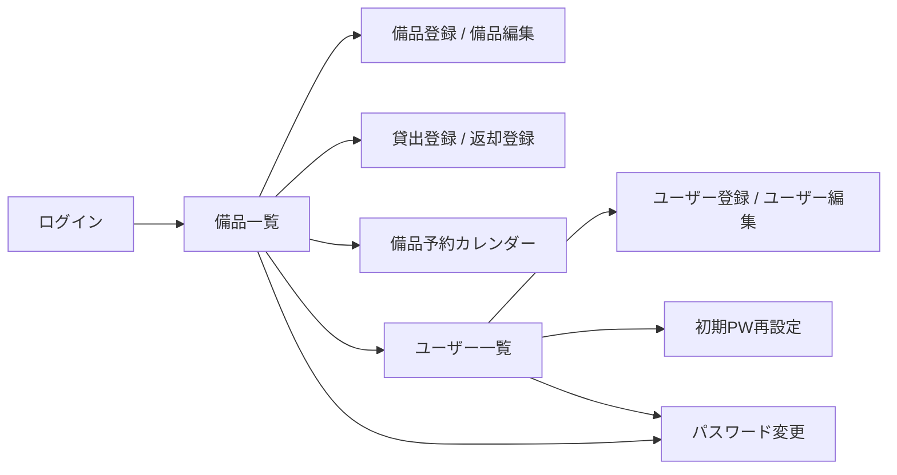

# 備品管理・貸出管理アプリ

このアプリは、社内備品の台帳管理と貸出状況の管理を Web 画面で行うためのシステムです。

## 機能紹介

- ログイン認証（管理者 / 一般ユーザー）
- 備品一覧の表示（資産番号、備品名、状態、借用者名）
- 管理者向けの備品操作（登録、編集、削除、貸出登録、返却登録）
- 備品予約（期間指定登録、取消、予約カレンダー表示）
- 管理者向けのユーザー操作（登録、編集、削除、初期PW再設定）
- 利用者自身のパスワード変更
- 借用者部署名の表示（外部部署DB参照）

## 画面導線

## 起動方法

1. プロジェクトのルートディレクトリで `docker compose up -d --build` を実行します。
2. 起動後、ブラウザで `http://localhost:8501` を開きます。
3. 停止する場合は `docker compose down` を実行します。

### 外部部署DB連携設定

- 外部連携の実運用（realモード）では、以下を環境変数に設定して起動します。
  - `EXTERNAL_DEPARTMENT_DB_URL`: Neon PostgreSQL 接続文字列
- 外部連携の検証（mockモード）では、以下を設定して起動します。
  - `EXTERNAL_DEPARTMENT_DB_USE_MOCK=1`
- mockモードでは `external/neon-postgres/mock/psycopg_mock.py` を使用し、外部DB未接続でも部署名表示を検証できます。

### 予約機能の操作

1. 備品一覧の各行末にある `予約` ボタンを押して、対象備品の予約カレンダー画面へ移動します。
2. `予約開始日` と `予約終了日` を入力して `予約登録` を実行します。
3. 同一備品で期間が重複する場合は登録が拒否されます（両端含む）。
4. 予約取消は「予約者本人」または「管理者」のみ可能です。
5. 貸出登録時は返却予定日が必須です。返却時には同一備品の `貸出済み` 予約のみ削除されます。

### E2E実行（mock / real）

- mockモードでのE2E実行:
  - `EXTERNAL_DEPARTMENT_DB_USE_MOCK=1 docker compose run --rm --workdir /workspace/e2e test_playwright sh -c "npm install && npx playwright test"`
- realモードでのE2E実行:
  - `EXTERNAL_DEPARTMENT_DB_URL=<接続文字列> docker compose run --rm --workdir /workspace/e2e test_playwright sh -c "npm install && npx playwright test"`

## 初期ログイン方法

初期状態では、次のユーザーでログインできます。

- 管理者
  - ログインID: `admin`
  - パスワード: `admin`
- 一般ユーザー
  - ログインID: `user1`
  - パスワード: `user1`

> 初期ユーザーは、DB が空の状態で起動したときに自動作成されます。  
> 既存データを保持したまま再起動した場合は、過去に変更したパスワードがそのまま有効です。
