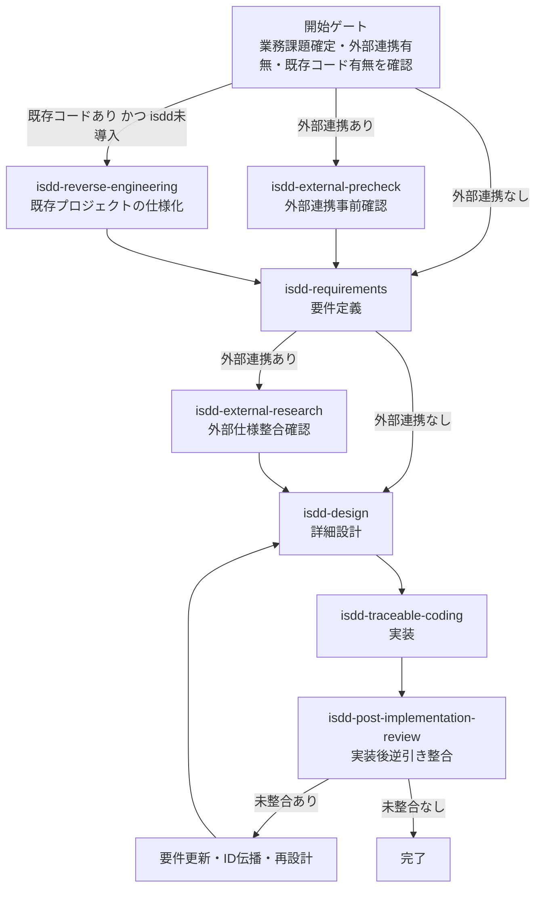
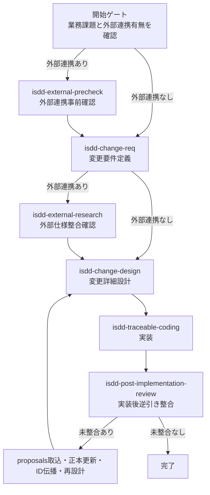
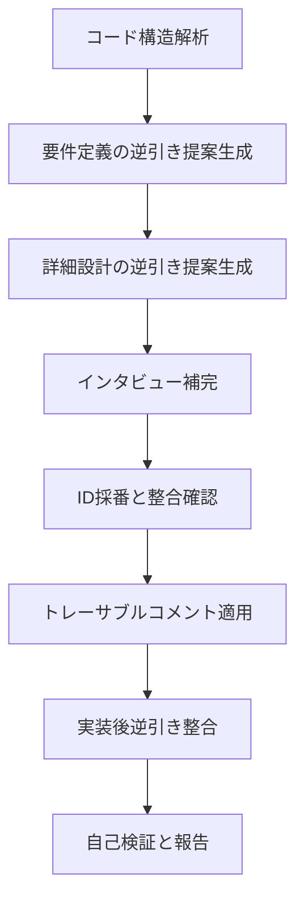

# 対話駆動仕様開発 - 要件・設計・ソースをIDで一貫追跡する

isdd（Interview-driven Spec-driven Development）はインタビュー駆動で仕様を確定して、要件・設計・ソースをIDで一貫追跡しながら、開発を進める手法です。

スキル群は `skills/` に格納し、`gh skill publish` で GitHub に公開・`gh skill install` で導入する形式で管理します。

## 背景と目的

isdd は、AI 実装で起こりやすい次の問題を抑制することを目的とします。

1. 要件の曖昧さによる意図しない実装差分
2. 変更時の影響範囲不明による品質低下
3. 仕様とコードの対応関係が失われることによる保守性低下
4. 実装中に判明した差分が要件・設計へ戻らないことによるドキュメント陳腐化

そのため、isdd では要件と設計を先に確定し、実装では要件 ID と設計 ID を基準にトレーサビリティを維持します。
さらに実装後は逆引き整合チェックを必須化し、要件・設計へ差分を還流して整合状態を保ちます。

## かんたんな使い方

### 全スキルの最新版を導入する

最初の導入は対話モードで実行し、スキル選択画面で `(all skills)` を選ぶ。

```bash
gh skill install notfolder/req-spec-driven
```

`@vX.Y.Z` を付けずにインストールすると、公開されている最新リリースが導入される。

### 要件定義の起動方法

導入後は、エージェントの入力で次のように開始する。

```text
/isdd-requirements [XXXアプリを作りたい]
```

---

## 開発フロー全体像

### フロー運用原則

- 設計スキル（`isdd-design` / `isdd-change-design`）で見つかった要件・設計差分は、起点要件定義へ直接反映する。
- 実装スキルで見つかった要件・設計差分提案は `docs/proposals.md` に一時集約する。
- 実装起因の正本更新は `isdd-post-implementation-review` で実施し、`docs/requirements.md` と `docs/detail_design.md` を最新状態へ更新する。
- `docs/proposals.md` は一時ファイルとして扱い、`isdd-post-implementation-review` 完了時に削除する。
- 変更要件定義、変更設計を使うのは、新たな要求が追加された場合のみとする。

### 新規開発フロー



### 新規要求追加時の変更フロー

このフローは、新たな要求追加が発生した場合にのみ適用する。
設計中に見つかった差分は `change_requirements.md` に直接反映し、実装中に見つかった差分提案は `docs/proposals.md` に集約して扱う。



### 既存プロジェクト適用フロー



---

## スキル一覧

| スキル名 | 役割 | 主な成果物 |
|---|---|---|
| isdd-requirements | インタビュー駆動で要件定義書を作成する | docs/requirements.md |
| isdd-design | 要件定義書から詳細設計書と実装タスクを作成する | docs/detail_design.md、.history/[日付]-[タスク名]/tasks.md |
| isdd-change-req | 新たな要求追加時に変更要件定義書を作成する | .history 配下の change_requirements.md |
| isdd-change-design | 変更要件から変更詳細設計書と実装タスクを作成し、必要時は変更要件を直接更新する | .history/[日付]-[タスク名]/change_detail_design.md、.history/[日付]-[タスク名]/tasks.md、.history/[日付]-[タスク名]/change_requirements.md（更新時） |
| isdd-external-precheck | 外部連携の接続可否・認証方式・主要制限を実接続で事前確認する | precheck_report.md |
| isdd-external-research | 外部連携先の詳細仕様を調査し要件との整合を確認する | alignment_report.md、external 配下調査成果物 |
| isdd-reverse-engineering | 既存コードから要件・設計を逆引きし初回 isdd 化の提案を作成する | docs/proposals.md |
| isdd-traceable-coding | 要件 ID と設計 ID に基づく実装コメント規則を適用する | 各ソースファイルのトレーサブルコメント |
| isdd-post-implementation-review | 実装後に実装起因の要件・設計・コード逆引き整合を検証し正本を確定する | docs/requirements.md、docs/detail_design.md（更新後）、未マッピング一覧、整合レポート |
| isdd-common | 共通参照ルールを提供する基盤スキル | skills/isdd-common/references 配下の定義ファイル |

---

## サブエージェント一覧

| エージェント名 | 主な利用スキル | 役割 |
|---|---|---|
| code-structure-analyzer | isdd-reverse-engineering | 既存コードの構造解析を分離実行する |
| external-research-investigator | isdd-external-research | 外部ライブラリ候補の調査と評価を実行する |
| db-schema-extractor | isdd-external-research | 外部 DB スキーマ情報の抽出を実行する |

---

## 共通リファレンスとスクリプト

isdd-common の references 配下に全スキルで参照する共通ルール、scripts 配下に整合性検証スクリプトを格納します。

### references/

| ファイル | 内容 |
|---|---|
| id-definitions.md | 要件 ID と設計 ID の定義 |
| document-rules.md | 仕様書・設計書の記述ルール |
| requirements-chapters.md | 要件定義書の章構成 |
| design-chapters.md | 詳細設計書の章構成 |
| design-completeness.md | 設計網羅性の確認ルール |
| design-tasks-rules.md | 実装タスク化のルール |
| hearing-complexity-rules.md | ヒアリング共通ルール |

### scripts/

| スクリプト | 用途 | 実行例 |
| --- | --- | --- |
| rq_integrity_checker.py | 要件定義書の RQ-* 内部整合性を検証（BKマッピング・フォーマット） | `python3 rq_integrity_checker.py docs/requirements.md` |
| rq_ds_link_checker.py | 要件ID（RQ-*）と設計ID（DS-*）の対応欠落・重複・不整合を検証し、未マッピング要件抽出の起点にする | `python3 rq_ds_link_checker.py docs/requirements.md docs/detail_design.md` |
| trace_comment_coverage_checker.py | ソースコードのトレーサブルコメント付与率と記載不足を検証 | `python3 trace_comment_coverage_checker.py src/` |

### 実装後逆引き整合の共通部品

`isdd-post-implementation-review` で使う共通部品は、次の役割を担う。

- 構造抽出: コードからモジュール・クラス・関数・依存関係を抽出する
- 差分要約: 実装差分から仕様影響点を抽出する
- 未マッピング一覧生成: RQ-DS突合結果と差分要約を統合して要件単位の一覧を作る
- ID再伝播: 要件更新後のID差分を設計へ反映する

---

## バージョン管理

各スキルは SKILL.md の frontmatter に metadata.version を持ち、同一リリースでは全スキルのバージョンを揃えて管理します。

---

## GitHub Skill 公開手順

スキルの編集は `skills/` 配下で直接行い、`gh skill publish` で GitHub に公開します。

### 事前確認

1. `skills/` 配下の各 SKILL.md の frontmatter に `license` フィールドが含まれていることを確認する。
2. 公開前に dry-run を実行し、エラーがないことを確認する。

### dry-run（検証のみ）

```bash
gh skill publish ./skills --dry-run
```

### 本番公開

```bash
gh skill publish ./skills --tag v1.0.13
```

---

## スキル導入手順（gh skill install）

公開済みスキルは `gh skill install` で導入する。

### 全スキルを導入

```bash
gh skill install notfolder/req-spec-driven
```

### 1つのスキルを導入

```bash
gh skill install notfolder/req-spec-driven isdd-requirements
```

### バージョンを固定して導入

```bash
gh skill install notfolder/req-spec-driven isdd-requirements@v1.0.13
```

### ユーザースコープへ導入

```bash
gh skill install notfolder/req-spec-driven isdd-requirements --scope user
```

必要に応じて skill 名を isdd-design など他のスキル名に置き換えて導入する。

---

## Waza 評価運用

評価資材は `evals/[skill-name]/` 配下に配置し、評価は `evals/run-all.sh` で実行する。`waza run --discover` は使用しない。

### 特定スキルのみ実行

```bash
bash evals/run-all.sh real isdd-change-design
bash evals/run-all.sh real isdd-requirements isdd-design
```

### 全スキル一括実行

```bash
bash evals/run-all.sh real
```

### mock モードについて

`eval.mock.yaml` が存在するスキルのみ mock モードで実行できる。

```bash
bash evals/run-all.sh mock
```

### 単体実行（デバッグ用）

```bash
waza run evals/[skill-name]/eval.copilot.yaml --context-dir evals/[skill-name]/fixtures -v
```

---

## 変更履歴

### v1.0.13

#### 新規追加

- `isdd-post-implementation-review` スキルを新規追加。実装後に要件・設計・実装コードの逆引き整合を検証し、未マッピング要件のヒアリング更新と正本確定を実施する。
- `isdd-post-implementation-review` の waza 評価を4テストケースで追加（最小・proposals.mdあり・変更要件フロー後・未マッピング検出）。
- `isdd-common/scripts/implementation_completeness_checker.py` を追加。実装コードの完全性を検証するスクリプト。
- `isdd-common/references/design-tasks-rules.md` を追加。実装タスク化のルールを共通リファレンスとして分離。
- `install.sh` を追加。スキル群のインストールを自動化するスクリプト。
- 各スキルに `evals/evals.json` を追加（anthropic skill-creator 対応）。

#### 変更

- 既存スキル（isdd-change-design・isdd-change-req・isdd-design・isdd-requirements・isdd-reverse-engineering・isdd-traceable-coding）に完了判定・終了条件を追加。
- 既存スキルの eval タスクファイルの入力ファイルリストを `.agents/skills` パス形式に統一。
- `isdd-common/references/design-chapters.md`・`requirements-chapters.md`・`hearing-complexity-rules.md` を更新。
- `evals/run-all.sh` を修正。
- 【論点1 ヒアリング平易化】`isdd-requirements`・`isdd-change-req`・`isdd-reverse-engineering` のヒアリング方針を更新。専門用語を避け業務文脈の平易な言葉で質問すること、業務語の意味を推定で確定しないこと、GUI 要件では画面ごとに5項目（目的・主要要素・入力項目・表示項目・エラー時の見え方）を必ず確認することを義務化。`hearing-complexity-rules.md` に同方針と禁止ルールを追加。
- 【論点2 用語確認ゲート】`isdd-requirements`・`isdd-change-req`・`isdd-reverse-engineering` に用語確認ゲートを追加。新出ドメイン用語が出た場合は用語集へ反映して意味確定後でなければ次の要件質問へ進めないルールを追加。`requirements-chapters.md` の用語集フォーマットを業務上の意味・使用範囲・同義語/類義語の3列に固定。
- 【論点3 設計→要件フィードバック方式】`isdd-design`・`isdd-change-design` に変更運用方針を追加。変更要件定義・変更設計は新たな要求追加時のみ使用し、設計・実装中の差分は起点要件定義を直接更新する方式を明記。
- 【論点4 実装後逆引き整合】`isdd-traceable-coding` に `isdd-post-implementation-review` との連携を追記。`isdd-design`・`isdd-change-design` に `isdd-post-implementation-review` との責務分離（設計スキルは正本更新を直接実施し PIR は呼び出さない）を明記。

### v1.0.12

- gh skills での配布方法に変更。
- README.md のインストールコマンドに `--allow-hidden-dirs` オプションを追加。
