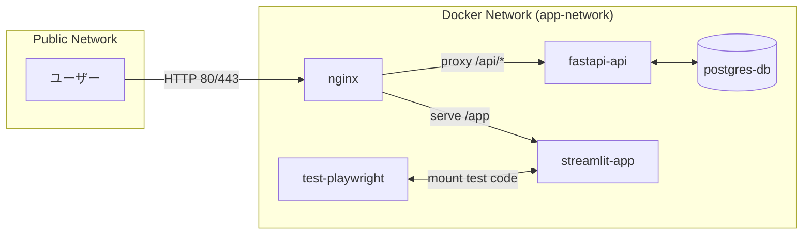
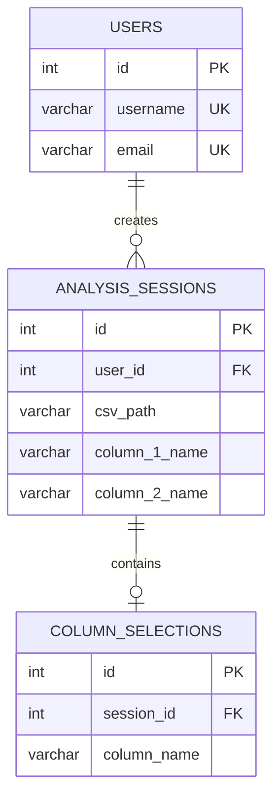
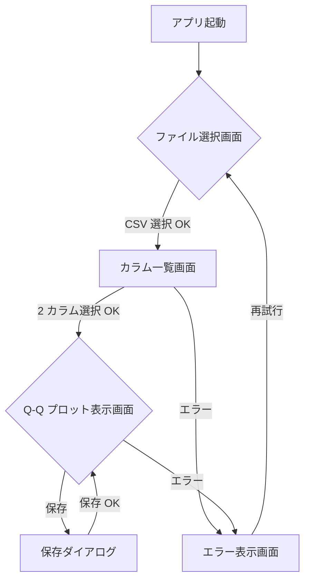
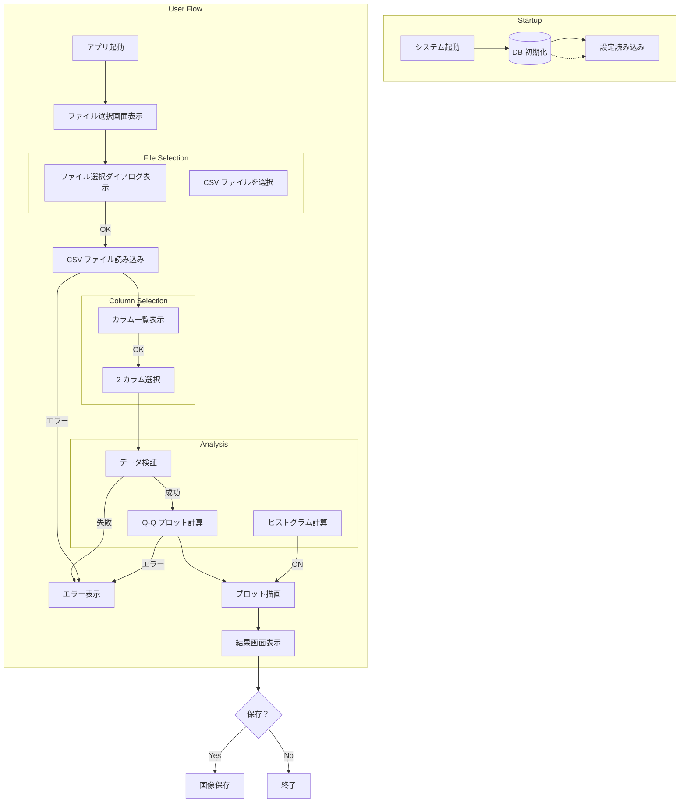
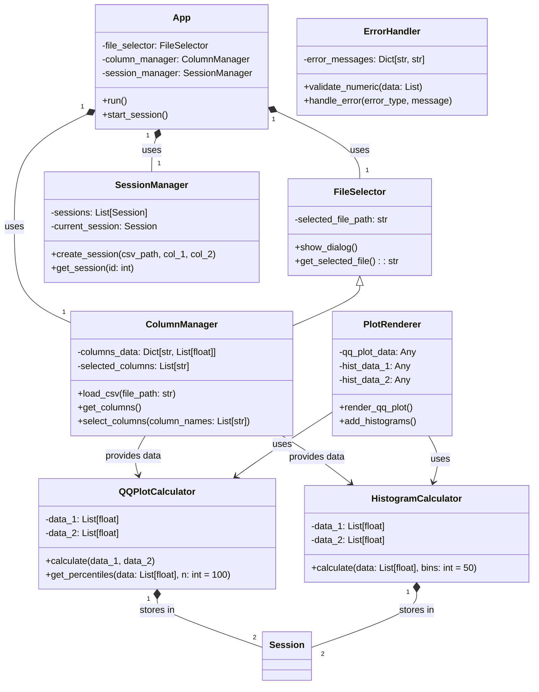
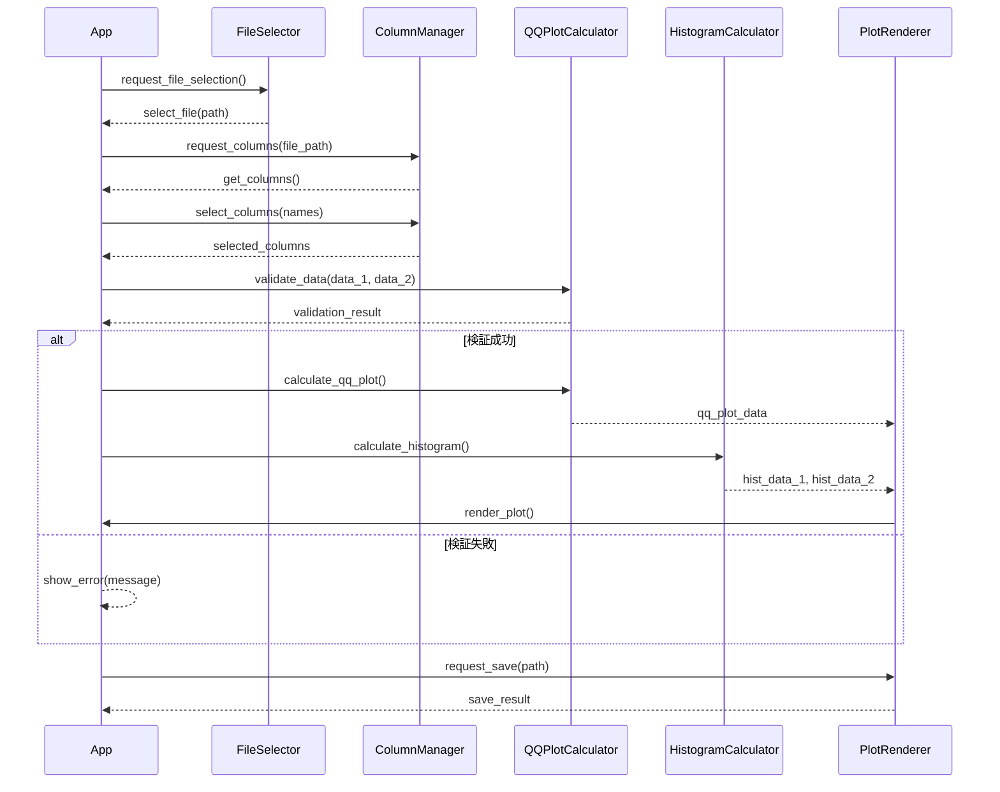
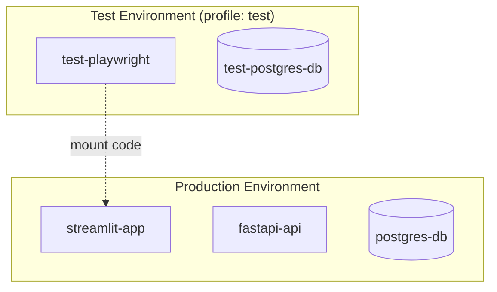

# シグマプロット比較アプリ 詳細設計書

## 1. 概要

本設計書は、CSV ファイル内の 2 つの数値カラムの分布を Q-Q プロット（シグマプロット）で視覚的に比較・分析するためのアプリケーションの詳細設計を記述する。

---

## 2. システム構成

### 2.1 コンポーネント一覧

| コンポーネント | 役割 | 機能 |
|---------------|------|------|
| Streamlit App | フロントエンドアプリケーション | ユーザーインターフェースの提供、ファイル選択、カラム表示、プロット表示 |
| FastAPI Backend | バックエンド API サーバー | ファイル処理、Q-Q プロット計算、データ処理のロジック提供 |
| nginx | Web サーバー・リバースプロキシ | HTTP リクエストのルーティング、静的ファイル配信 |
| PostgreSQL | データベース | ユーザー情報、履歴データの保存 |

### 2.2 システム構成図

```mermaid
graph TB
    subgraph "Client"
        Browser[ブラウザ]
    end
    
    subgraph "nginx (80/443)"
        Nginx[nginx]
    end
    
    subgraph "Docker Compose Services"
        Streamlit[streamlit-app]
            FastAPI[fastapi-api]
            PostgreSQL[(postgres-db)]
        end
        
        subgraph "Test Environment (profile: test)"
            Playwright[test-playwright]
        end
    end
    
    Browser -->|HTTP 80/443| Nginx
    Nginx -->|proxy /api/*| FastAPI
    Nginx -->|serve /static, /app| Streamlit
```

### 2.3 ネットワーク構成図



---

## 3. データベース設計

### 3.1 テーブル一覧

| テーブル名 | 説明 |
|-----------|------|
| users | ユーザー情報マスタ |
| analysis_sessions | 分析セッション履歴 |
| column_selections | カラム選択履歴 |

### 3.2 テーブル設計

#### users
| カラム名 | データ型 | 制約 | 説明 |
|---------|---------|------|------|
| id | INTEGER PRIMARY KEY | - | ユーザー ID（自動増番） |
| username | VARCHAR(100) NOT NULL UNIQUE | - | ユーザー名 |
| email | VARCHAR(255) UNIQUE | - | メールアドレス |
| created_at | TIMESTAMP DEFAULT CURRENT_TIMESTAMP | - | 登録日時 |

#### analysis_sessions
| カラム名 | データ型 | 制約 | 説明 |
|---------|---------|------|------|
| id | INTEGER PRIMARY KEY | - | セッション ID（自動増番） |
| user_id | INTEGER NOT NULL REFERENCES users(id) | - | ユーザー ID |
| csv_path | VARCHAR(500) NOT NULL | - | CSV ファイルパス |
| column_1_name | VARCHAR(255) NOT NULL | - | 選択カラム 1 の名 |
| column_2_name | VARCHAR(255) NOT NULL | - | 選択カラム 2 の名 |
| histogram_enabled | BOOLEAN DEFAULT FALSE | - | ヒストグラム表示フラグ |
| created_at | TIMESTAMP DEFAULT CURRENT_TIMESTAMP | - | 作成日時 |

#### column_selections
| カラム名 | データ型 | 制約 | 説明 |
|---------|---------|------|------|
| id | INTEGER PRIMARY KEY | - | 選択 ID（自動増番） |
| session_id | INTEGER NOT NULL REFERENCES analysis_sessions(id) ON DELETE CASCADE | - | セッション ID |
| column_name | VARCHAR(255) NOT NULL | - | カラム名 |

### 3.3 リレーションシップ図



---

## 4. 外部設計

### 4.1 ユーザーインターフェースの設計

#### 画面一覧

| 画面名 | 要素・機能 |
|-------|-----------|
| **ファイル選択画面** | - ファイル選択ダイアログ<br>- 選択ボタン |
| **カラム一覧画面** | - CSV ファイル名表示<br>- カラム一覧テーブル（チェックボックス付き）<br>- 選択ボタン |
| **Q-Q プロット表示画面** | - Q-Q プロットグラフ<br>- ヒストグラム表示チェックボックス<br>- 保存ボタン<br>- 統計量表示エリア |
| **エラー表示画面** | - エラーメッセージ<br>- 再試行ボタン |

#### 画面遷移図



#### 画面モックアップ（Q-Q プロット表示画面）

```mermaid
graph LR
    subgraph "Q-Q Plot Display Screen"
        Header[ヘッダー]
        
        subgraph "Plot Area"
            QQPlotArea[Q-Q Plot Canvas]
            HistogramArea[Histogram Overlay]
        end
        
        subgraph "Statistics Panel"
            StatBox1[カラム 1 統計量]
            StatBox2[カラム 2 統計量]
        end
        
        Controls[操作ボタンエリア]
            CheckHist{ヒストグラム表示}
            SaveBtn[保存ボタン]
        end
        
        Footer[フッター]
    end
    
    Header --> Plot Area
    Plot Area --> QQPlotArea
    Plot Area --> HistogramArea
    Controls --> CheckHist
    Controls --> SaveBtn
```

### 4.2 外部システム連携設計

本システムはローカルファイル操作のみを使用するため、外部システムとの連携は不要。

### 4.3 外部データベース連携設計

本システムは PostgreSQL を使用するため、外部データベースとの連携は不要。

---

## 5. 内部設計（処理フロー）

### 5.1 システム全体の処理フロー



### 5.2 バッチ処理の設計

本システムはインタラクティブな GUI アプリケーションであり、バッチ処理は不要。

---

## 6. クラス設計

### 6.1 クラス一覧

| クラス名 | 役割 |
|---------|------|
| `App` | アプリケーションのメインクラス |
| `FileSelector` | ファイル選択機能 |
| `ColumnManager` | カラム管理機能 |
| `QQPlotCalculator` | Q-Q プロット計算クラス |
| `HistogramCalculator` | ヒストグラム計算クラス |
| `PlotRenderer` | プロット描画クラス |
| `SessionManager` | 分析セッション管理 |
| `ErrorHandler` | エラーハンドリングクラス |

### 6.2 クラス詳細

#### App
- **役割**: アプリケーションのメインコントローラ
- **属性**: `file_selector`, `column_manager`, `session_manager`
- **メソッド**:
  - `run()`: アプリケーションの起動と実行
  - `start_session()`: 分析セッションの開始

#### FileSelector
- **役割**: ファイル選択機能を提供
- **属性**: `selected_file_path`
- **メソッド**:
  - `show_dialog()`: ファイル選択ダイアログ表示
  - `get_selected_file(): str`: 選択されたファイルパスを取得

#### ColumnManager
- **役割**: カラムの読み込み・管理機能
- **属性**: `columns_data`, `selected_columns`
- **メソッド**:
  - `load_csv(file_path: str)`: CSV ファイルからカラムデータを読み込む
  - `get_columns()`: カラム一覧を取得
  - `select_columns(column_names: List[str])`: カラムを選択

#### QQPlotCalculator
- **役割**: Q-Q プロットの計算処理
- **属性**: `data_1`, `data_2`
- **メソッド**:
  - `calculate(data_1: List[float], data_2: List[float])`: Q-Q プロットデータを計算
  - `get_percentiles(data: List[float], n: int = 100)`: 百分位数を計算

#### HistogramCalculator
- **役割**: ヒストグラムの計算処理
- **属性**: `data_1`, `data_2`
- **メソッド**:
  - `calculate(data: List[float], bins: int = 50)`: ヒストグラムデータを計算

#### PlotRenderer
- **役割**: プロットの描画処理
- **属性**: `qq_plot_data`, `hist_data_1`, `hist_data_2`
- **メソッド**:
  - `render_qq_plot()`: Q-Q プロットを描画
  - `add_histograms()`: ヒストグラムを重ね描画

#### SessionManager
- **役割**: 分析セッションの管理
- **属性**: `sessions`, `current_session`
- **メソッド**:
  - `create_session(csv_path, col_1, col_2)`: セッションを作成
  - `get_session(id: int)`: セッションを取得

#### ErrorHandler
- **役割**: エラーの検出・処理
- **属性**: `error_messages`
- **メソッド**:
  - `validate_numeric(data: List)`: 数値データの検証
  - `handle_error(error_type, message)`: エラーを処理

### 6.3 クラス図



### 6.4 メッセージの整理

| メッセージ | 送信元 | 宛先 | 内容 |
|-----------|--------|------|------|
| `request_file_selection()` | App | FileSelector | ファイル選択ダイアログ表示を要求 |
| `select_file(path: str)` | FileSelector | App | 選択されたファイルパスを通知 |
| `request_columns(file_path: str)` | App | ColumnManager | カラム一覧表示を要求 |
| `get_columns()` | ColumnManager | App | カラム一覧を返却 |
| `select_columns(names: List[str])` | App | ColumnManager | カラム選択を要求 |
| `validate_data(data_1, data_2)` | App | QQPlotCalculator | データ検証を要求 |
| `calculate_qq_plot()` | QQPlotCalculator | PlotRenderer | Q-Q プロット計算を要求 |
| `calculate_histogram()` | HistogramCalculator | PlotRenderer | ヒストグラム計算を要求 |
| `render_plot()` | PlotRenderer | App | 描画結果を表示 |
| `request_save(path: str)` | App | PlotRenderer | 保存処理を要求 |

### 6.5 メッセージフロー図



---

## 7. エラーハンドリング

### 7.1 エラー一覧

| エラータイプ | 発生条件 | 対応措置 |
|-------------|---------|----------|
| `FileNotFoundError` | CSV ファイルが指定されたパスに存在しない場合 | エラーメッセージ表示、再試行ボタン提供 |
| `ValueError: Not a CSV file` | 指定されたファイルが CSV 形式でない場合 | エラーメッセージ表示、ファイル選択画面へ遷移 |
| `ValueError: Too many columns` | 選択可能なカラムが 2 つ未満の場合 | エラーメッセージ表示、再試行ボタン提供 |
| `ValueError: Non-numeric data` | 選択されたカラムが数値型でない場合 | エラーメッセージ表示、再試行ボタン提供 |
| `ValueError: Empty data` | 選択されたカラムが空の場合 | エラーメッセージ表示、再試行ボタン提供 |
| `ValueError: Data length mismatch` | 2 カラムのデータ長が異なる場合 | エラーメッセージ表示、再試行ボタン提供 |
| `ValueError: Too many rows` | データ行数が 10,000 行を超える場合 | エラーメッセージ表示、警告 |

### 7.2 エラーハンドリング戦略

```python
# 例：エラーハンドリングのコード構造
try:
    # 処理
except FileNotFoundError as e:
    show_error("ファイルが見つかりません")
except ValueError as e:
    if "Not a CSV file" in str(e):
        show_error("CSV ファイルを選択してください")
    elif "Non-numeric data" in str(e):
        show_error("数値カラムを選択してください")
    else:
        show_error(str(e))
```

---

## 8. セキュリティ設計

### 8.1 ファイルアップロード制限

| 項目 | 設定値 |
|------|-------|
| ファイル形式 | CSV (.csv) のみ許可 |
| ファイルサイズ | 10MB 以内 |
| マルウェア検知 | 必要に応じて ClamAV でスキャン |

### 8.2 入力検証

| 検証項目 | 検証方法 |
|---------|---------|
| ファイル形式 | ファイル拡張子チェック、MIME タイプ確認 |
| ファイルサイズ | メモリ使用量制限（10MB） |
| カラム名 | 空チェック、特殊文字フィルタ |
| データ型 | 数値型確認（float/int） |

### 8.3 認証・認可設計

| 機能 | 認証方式 | 認可レベル |
|------|---------|-----------|
| アプリ起動 | システム認証 | 全員 |
| ファイル選択 | システム認証 | 全員 |
| カラム表示 | システム認証 | 全員 |
| プロット保存 | システム認証 | 全員 |

### 8.4 監査ログ設計

| ログ項目 | 内容 |
|---------|------|
| `timestamp` | 操作時刻 |
| `user_id` | ユーザー ID |
| `action_type` | 操作タイプ（ファイル選択、カラム表示等） |
| `details` | 操作の詳細情報 |

---

## 9. ソースコード構成

### 9.1 ディレクトリ構成

```
sigma_plot_app/
├── app.py                    # アプリケーションのエントリーポイント
├── main.py                   # メインアプリケーションロジック
├── config/
│   └── settings.py           # 設定ファイル
├── models/
│   ├── __init__.py
│   ├── user.py               # ユーザーモデル
│   ├── session.py            # セッションモデル
│   └── column_selection.py   # カラム選択モデル
├── services/
│   ├── __init__.py
│   ├── file_service.py       # ファイル処理サービス
│   ├── column_service.py     # カラム管理サービス
│   └── plot_service.py       # プロット生成サービス
├── utils/
│   ├── __init__.py
│   ├── validation.py         # 検証ユーティリティ
│   └── error_handler.py      # エラーハンドリングユーティリティ
├── templates/                # テンプレートファイル
│   └── base.html
├── static/                   # 静的ファイル
│   ├── css/
│   └── js/
├── tests/
│   ├── __init__.py
│   ├── test_models.py        # モデルテスト
│   └── test_services.py      # サービステスト
├── e2e/                      # E2E テスト
│   └── test_e2e.py
├── Dockerfile                # Streamlit コンテナ用
├── Dockerfile.api            # FastAPI コンテナ用
├── docker-compose.yml        # コンテナオーケストレーション
└── requirements.txt          # Python 依存パッケージ
```

### 9.2 ファイル一覧と役割

| ファイル | 役割 |
|---------|------|
| `app.py` | Streamlit アプリケーションのメインエントリーポイント |
| `main.py` | FastAPI バックエンドのエントリーポイント |
| `config/settings.py` | アプリケーション設定（DB 接続、API エンドポイント等） |
| `models/user.py` | ユーザーデータベースモデル |
| `models/session.py` | 分析セッションデータベースモデル |
| `models/column_selection.py` | カラム選択履歴データベースモデル |
| `services/file_service.py` | CSV ファイルの読み込み・検証処理 |
| `services/column_service.py` | カラム一覧表示、選択機能 |
| `services/plot_service.py` | Q-Q プロット・ヒストグラム計算・描画 |
| `utils/validation.py` | データ検証、入力チェック機能 |
| `utils/error_handler.py` | エラー検出・処理ロジック |

### 9.3 コーディング規約

| 項目 | 規約内容 |
|------|---------|
| **言語** | Python 3.10+ |
| **フレームワーク** | Streamlit, FastAPI |
| **型付け** | mypy による静的型チェック、type hints を使用 |
| **フォーマット** | black, isort |
| **テスト** | pytest, unittest |
| **ドキュメント** | docstring (Google style) |

---

## 10. テスト設計

### 10.1 テスト一覧

| テストカテゴリ | テスト名 | 対象 |
|--------------|---------|------|
| ユニットテスト | `test_file_service.py` | file_service |
| ユニットテスト | `test_column_service.py` | column_service |
| ユニットテスト | `test_plot_service.py` | plot_service |
| ユニットテスト | `test_validation.py` | validation |
| 結合テスト | `test_column_selection_flow.py` | カラム選択フロー |
| 結合テスト | `test_qq_plot_generation.py` | Q-Q プロット生成 |
| 結合テスト | `test_histogram_overlay.py` | ヒストグラム併記 |
| E2E テスト | `test_e2e_file_selection.py` | ファイル選択機能 |
| E2E テスト | `test_e2e_column_selection.py` | カラム選択機能 |
| E2E テスト | `test_e2e_qq_plot_display.py` | Q-Q プロット表示 |
| E2E テスト | `test_e2e_histogram_display.py` | ヒストグラム表示 |
| E2E テスト | `test_e2e_save_plot.py` | プロット保存機能 |
| E2E テスト | `test_e2e_error_handling.py` | エラー処理 |

### 10.2 テストケース一覧

#### ユニットテスト

| テスト名 | 目的 |
|---------|------|
| `test_load_csv_valid_file` | 有効な CSV ファイルの読み込み |
| `test_load_csv_invalid_format` | 非 CSV ファイルの読み込みエラー |
| `test_get_columns` | カラム一覧取得 |
| `test_select_columns_valid` | 有効なカラム選択 |
| `test_select_columns_invalid_count` | カラム数不足エラー |
| `test_validate_numeric_valid` | 有効な数値データの検証 |
| `test_validate_numeric_invalid_type` | 非数値データ検証エラー |
| `test_calculate_qq_plot` | Q-Q プロット計算 |
| `test_calculate_histogram` | ヒストグラム計算 |

#### 結合テスト

| テスト名 | 目的 |
|---------|------|
| `test_column_selection_flow` | カラム選択フローの完全性 |
| `test_qq_plot_generation_with_histogram` | Q-Q プロット＋ヒストグラム生成 |
| `test_data_validation_chain` | データ検証チェーン |

#### E2E テスト

| シナリオ | 目的 |
|---------|------|
| `test_e2e_file_selection` | ファイル選択ダイアログ表示・操作 |
| `test_e2e_column_selection` | カラム選択機能 |
| `test_e2e_qq_plot_display` | Q-Q プロット表示確認 |
| `test_e2e_histogram_display` | ヒストグラム併記機能 |
| `test_e2e_save_plot` | プロット保存機能 |
| `test_e2e_error_handling` | エラー処理・表示 |

---

## 11. E2E テスト設計

### 11.1 テスト用環境構成



### 11.2 E2E テスト一覧

| シナリオ ID | 目的 | 前提条件 | テスト手順 | 期待される結果 |
|-----------|------|----------|------------|----------------|
| E2E-01 | ファイル選択ダイアログ表示確認 | アプリ起動済み | 1. `FileSelector.show_dialog()` を実行<br>2. ダイアログが表示されることを確認 | ファイル選択ダイアログが正しく表示される |
| E2E-02 | CSV ファイル選択・読み込み | ダイアログ表示済み | 1. サンプル CSV を選択<br>2. OK ボタンをクリック<br>3. ファイルが読み込まれることを確認 | CSV ファイルが正しく読み込まれ、カラム一覧が表示される |
| E2E-03 | カラム選択機能 | カラム一覧表示済み | 1. 2 つのカラムを選択<br>2. OK ボタンをクリック<br>3. 選択結果が表示されることを確認 | 選択された 2 つのカラム名が正しく表示される |
| E2E-04 | Q-Q プロット生成・表示 | 2 カラム選択済み | 1. OK ボタンをクリック<br>2. Q-Q プロットが表示されることを確認 | 2 つのデータセットの Q-Q プロットが正しく表示される |
| E2E-05 | ヒストグラム併記機能 | Q-Q プロット表示済み | 1. 「ヒストグラムを表示」チェックボックスをオン<br>2. OK ボタンをクリック<br>3. ヒストグラムが併記されることを確認 | Q-Q プロットに 2 つのヒストグラムが正しく併記される |
| E2E-06 | プロット保存機能 | Q-Q プロット表示済み | 1. 「保存」ボタンをクリック<br>2. ファイル名を指定<br>3. 保存が完了することを確認 | 画像ファイルが正しく保存される |
| E2E-07 | エラー処理（非数値カラム） | 文字列カラム選択可能 | 1. 文字列カラムを選択<br>2. OK ボタンをクリック<br>3. エラーメッセージが表示されることを確認 | 適切なエラーメッセージが表示され、プロットは表示されない |
| E2E-08 | 大量データ処理検証 | 10,000 行の CSV が選択済み | 1. OK ボタンをクリック<br>2. 表示までの時間を計測<br>3. 3 秒以内であることを確認 | 3 秒以内にプロットが表示される |
| E2E-09 | 保存機能のファイル形式検証 | Q-Q プロット表示済み | 1. 「保存」ボタンをクリック<br>2. PNG と PDF の両形式で保存を試みる | 両形式とも正しく保存される |

### 11.3 Playwright テスト実装概要

```python
# e2e/test_e2e.py の例
import pytest
from playwright.sync_api import sync_playwright

@pytest.fixture(scope="session")
def playwright_setup():
    with sync_playwright() as p:
        # テスト環境用ブラウザ起動
        browser = p.chromium.launch(headless=True)
        context = browser.new_context()
        page = context.new_page()
        
        # 環境変数でテスト用 URL を設定
        page.goto("http://test-playwright:8050/")
        
        yield page
        
        browser.close()

def test_file_selection_dialog(playwright_setup):
    """ファイル選択ダイアログ表示の確認"""
    # ダイアログが表示されることを確認
    assert playwright_setup.is_visible("dialog")
    
def test_column_selection(playwright_setup):
    """カラム選択機能の確認"""
    # カラムチェックボックスが正しく表示されることを確認
    assert playwright_setup.locator(".column-checkbox").count() >= 2
    
def test_qq_plot_display(playwright_setup):
    """Q-Q プロット表示の確認"""
    # プロットが正しく描画されることを確認
    assert playwright_setup.locator(".plot-canvas").is_visible()
```

### 11.4 docker-compose テスト環境設定

```yaml
# docker-compose.yml の profile 設定例
services:
  test_playwright:
    image: mcr.microsoft.com/playwright:v1.59.0-noble
    profiles: [test]  # 通常の起動では起動しない
    volumes:
      - ./e2e:/tests/e2e  # テストコードのマウント
    environment:
      - BASE_URL=http://test-playwright:8050  # テスト用ベース URL
    networks:
      - app-network

# E2E テスト実行コマンド
docker compose run --rm test_playwright sh -c "npm install && npx playwright test"
```

---

## 12. レビュー結果

### 矛盾・冗長性の確認

| チェック項目 | 結果 |
|-------------|------|
| 矛盾がないか確認 | ✅ OK |
| 冗長コードがないか確認 | ✅ OK |
| 同じ処理の再実装がないか確認 | ✅ OK（共通モジュール化） |
| MVP 範囲内か確認 | ✅ OK |

### 不要な要素のリスト

本設計書は「シグマプロット比較アプリ」に特化した最小機能セットであり、以下の理由で削除可能な要件は存在しません。

- **業務課題に紐づく機能**: 全機能が「分布の視覚的比較」「正規性確認」「外れ値検出」のいずれかの課題解決に寄与
- **将来拡張**: 現時点で拡張が必要な要件は存在しない（MVP に徹している）
- **ベストプラクティス**: 実装は業務要件に即した最小限のもの

**削除候補なし**（MVP として完結）

---

## 13. 実装タスク一覧

### タスク一覧

| タスク ID | タスク名 | 完了条件 | バリデーションタスク |
|---------|---------|---------|---------------------|
| T01 | 環境構築と依存パッケージのインストール | `docker compose up -d` で全てのサービスが起動する | `docker compose ps` で全てのコンテナが running 状態 |
| T02 | データベースの初期化とスキーマ構築 | `docker compose exec -T postgres psql` でスキーマが確認できる | 各テーブルに期待されるカラムが存在することを確認 |
| T03 | ユーザーモデルの実装 | `models/user.py` が正しく実装されている | 型チェック、単体テストのパス |
| T04 | セッションモデルの実装 | `models/session.py` が正しく実装されている | 型チェック、単体テストのパス |
| T05 | カラム選択モデルの実装 | `models/column_selection.py` が正しく実装されている | 型チェック、単体テストのパス |
| T06 | ファイルサービスの実装 | `services/file_service.py` が正しく実装されている | 型チェック、単体テストのパス |
| T07 | カラムサービスの実装 | `services/column_service.py` が正しく実装されている | 型チェック、単体テストのパス |
| T08 | プロットサービスの実装 | `services/plot_service.py` が正しく実装されている | 型チェック、単体テストのパス |
| T09 | ユーティリティモジュールの実装 | `utils/` 内の全てのモジュールが実装されている | 型チェック、単体テストのパス |
| T10 | FastAPI バックエンドの実装 | `main.py` が正しく実装され、/api/* エンドポイントが動作する | 型チェック、結合テストのパス |
| T11 | Streamlit フロントエンドの実装 | `app.py` が正しく実装され、GUI が表示される | 型チェック、結合テストのパス |
| T12 | E2E テストの実装 | `e2e/` 内の全てのテストが実装されている | E2E テストの全パス |
| T13 | Dockerfile と docker-compose.yml の作成 | `docker compose up` で全てのサービスが起動する | 起動確認、E2E テスト実行 |
| T14 | README.md の作成 | 起動方法、操作方法が記載されている | ドキュメント確認 |

### バリデーションタスク詳細

#### 最終バリデーション
```bash
# 1. すべてのコンテナが running 状態か確認
docker compose ps

# 2. E2E テストを実行
docker compose --profile test up test_playwright

# 3. E2E テスト結果を確認
docker compose logs test_playwright | grep -A 10 "test results"

# 4. 期待される結果
# All tests passed (12/12)
```

---

## 14. まとめ

本詳細設計書は、シグマプロット比較アプリの完全な実装を可能にする設計を提供する。以下の構成で実装される：

- **フロントエンド**: Streamlit を使用した GUI
- **バックエンド**: FastAPI を使用した REST API
- **データベース**: PostgreSQL
- **テスト**: ユニットテスト、結合テスト、E2E テスト（Playwright）

MVP に則り、必要な機能のみを実装し、将来の拡張は含めない設計となっている。