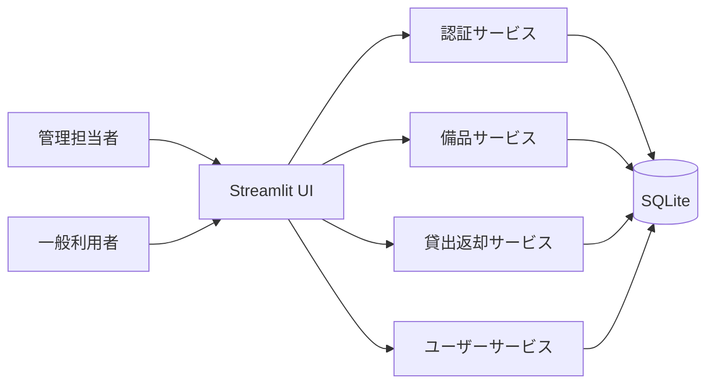
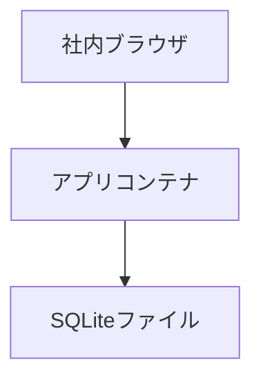
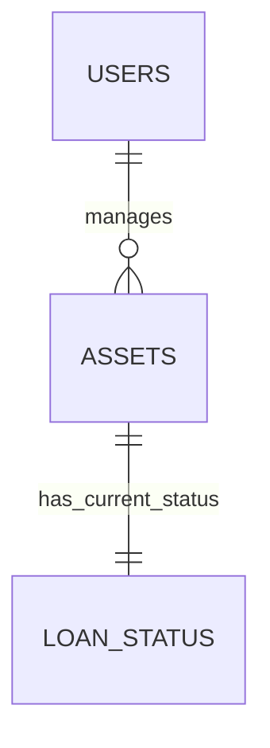
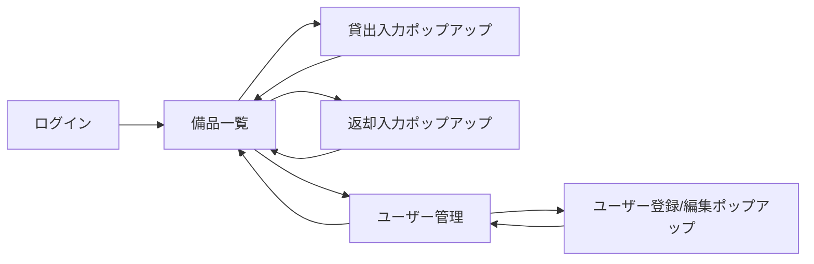
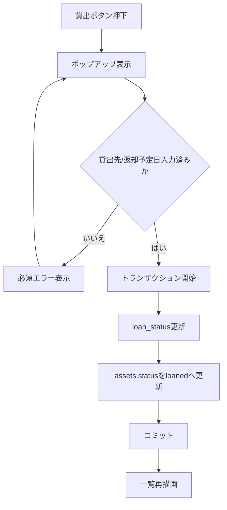
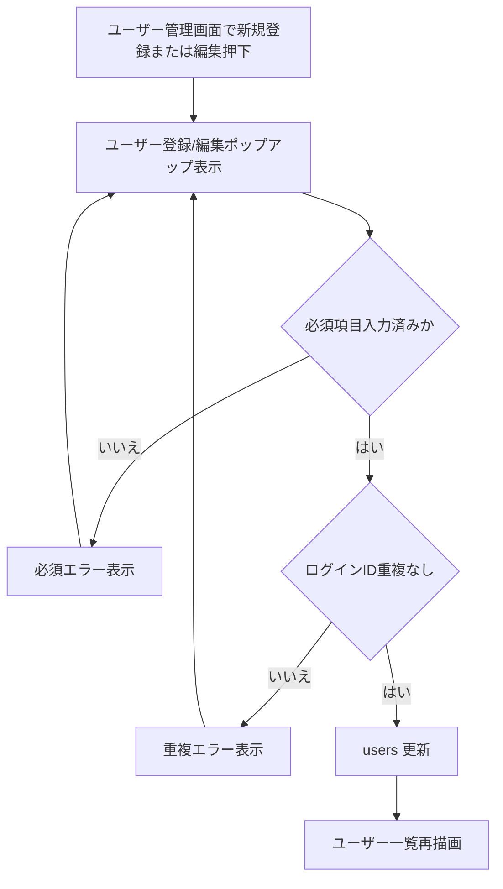
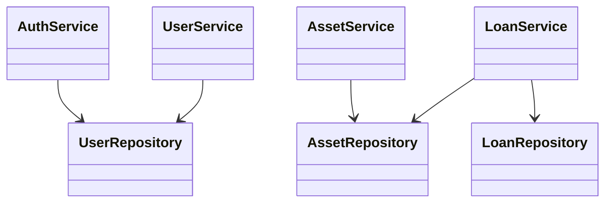
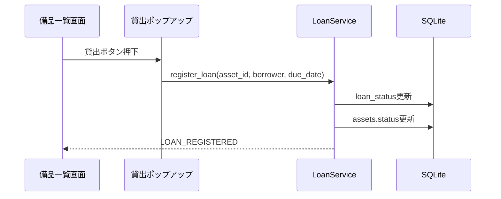

# 備品管理システム 詳細設計書

## 1. 言語・フレームワーク

| DS-ID | 項目 | 選定結果 | 選定理由 | 対応要件ID |
|---|---|---|---|---|
| DS-MD-APP-CORE-FT-VIEW-ASSET-STATUS | 言語 | Python 3.12 | 要件の単一業務画面構成を最小構成で実装でき、保守性を確保できるため | RQ-FT-VIEW-ASSET-STATUS |
| DS-MD-STREAMLIT-UI-UI-ASSET-LIST-SCREEN | フレームワーク | Streamlit | GUI が必要であり、単一ページ中心の画面構成を最小実装で実現できるため | RQ-UI-ASSET-LIST-SCREEN |

## 2. システム構成

### 2-1. コンポーネント一覧

| DS-ID | コンポーネント名 | 役割 | 対応要件ID |
|---|---|---|---|
| DS-MD-STREAMLIT-UI-UI-ASSET-LIST-SCREEN | UI層（Streamlit） | ログイン、備品一覧、貸出ポップアップ、ユーザー管理画面を提供する | RQ-UI-ASSET-LIST-SCREEN |
| DS-CL-AUTH-SERVICE-FT-AUTHENTICATE-USER | 認証サービス | ログインID/パスワードを検証し、権限判定を返す | RQ-FT-AUTHENTICATE-USER |
| DS-CL-ASSET-SERVICE-FT-MANAGE-ASSET-MASTER | 備品サービス | 備品一覧取得、備品属性更新を行う | RQ-FT-MANAGE-ASSET-MASTER |
| DS-CL-LOAN-SERVICE-FT-REGISTER-LOAN | 貸出返却サービス | 貸出登録、返却登録、状態遷移制御を行う | RQ-FT-REGISTER-LOAN |
| DS-CL-USER-SERVICE-FT-MANAGE-USER-ACCOUNT | ユーザーサービス | ユーザーアカウント登録/更新/無効化を行う | RQ-FT-MANAGE-USER-ACCOUNT |
| DS-SC-SQLITE-SCHEMA-DT-DB-NECESSITY | 永続化層（SQLite） | 備品、ユーザー、貸出状態の整合を保持する | RQ-DT-DB-NECESSITY |

### 2-2. システム全体構成図



### 2-3. 各コンポーネントの役割と機能
- UI層は権限に応じて表示制御する。
- 認証サービスはログイン認証のみを責務とし、業務更新処理を持たない。
- 備品サービスは備品マスタのCRUDと一覧検索を行う。
- 貸出返却サービスは状態遷移のみを管理し、備品属性更新を行わない。
- ユーザーサービスはログインアカウント運用を管理する。

### 2-4. コンポーネント間インターフェースとデータフロー

| DS-ID | 送信元 | 送信先 | データ | 対応要件ID |
|---|---|---|---|---|
| DS-IF-LOGIN-REQUEST-FT-AUTHENTICATE-USER | ログイン画面 | 認証サービス | ログインID、パスワード | RQ-FT-AUTHENTICATE-USER |
| DS-IF-ASSET-LIST-QUERY-FT-VIEW-ASSET-STATUS | 備品一覧画面 | 備品サービス | 検索条件 | RQ-FT-VIEW-ASSET-STATUS |
| DS-IF-LOAN-POPUP-SUBMIT-UI-LOAN-ENTRY-POPUP | 貸出入力ポップアップ | 貸出返却サービス | 備品ID、貸出先、返却予定日 | RQ-UI-LOAN-ENTRY-POPUP |
| DS-IF-RETURN-SUBMIT-FT-REGISTER-RETURN | 備品一覧画面 | 貸出返却サービス | 備品ID、返却日 | RQ-FT-REGISTER-RETURN |
| DS-IF-USER-MAINTENANCE-FT-MANAGE-USER-ACCOUNT | ユーザー管理画面 | ユーザーサービス | 氏名、ログインID、パスワード、権限、有効/無効 | RQ-FT-MANAGE-USER-ACCOUNT |

### 2-5. ネットワーク構成図



## 3. データベース設計

### 3-1. DB 必須性判定
- システム内部DBは必須である。
- 理由: 同時利用時に貸出状態と備品状態を一貫更新し、一覧検索の応答を維持するため。

### 3-2. DB 製品選定
| DS-ID | 項目 | 選定 | 理由 | 対応要件ID |
|---|---|---|---|---|
| DS-SC-SQLITE-SCHEMA-DT-DB-NECESSITY | DB製品 | SQLite | 取り扱いデータ規模が小さく、構成を最小化できるため | RQ-DT-DB-NECESSITY |

### 3-3. テーブル設計

| DS-ID | テーブル名 | 主なカラム | 制約 | 対応要件ID |
|---|---|---|---|---|
| DS-SC-USERS-DT-USER-ACCOUNT-ENTITY | users | user_id, login_id, password_hash, role, is_active, display_name | PK: user_id, UK: login_id, CHECK: role in ('admin','viewer') | RQ-DT-USER-ACCOUNT-ENTITY |
| DS-SC-ASSETS-DT-ASSET-ENTITY | assets | asset_id, asset_code, asset_name, location, status, version_no | PK: asset_id, UK: asset_code, CHECK: status in ('available','loaned') | RQ-DT-ASSET-ENTITY |
| DS-SC-LOAN-STATUS-DT-LOAN-STATUS-ENTITY | loan_status | asset_id, borrower_name, due_date, loaned_at, returned_at | PK/FK: asset_id -> assets.asset_id, CHECK: due_date >= loaned_at | RQ-DT-LOAN-STATUS-ENTITY |

### 3-4. データ区分・保持期間・外部DB
| DS-ID | 設計内容 | 方針 | 対応要件ID |
|---|---|---|---|
| DS-SC-DATA-BOUNDARY-DT-INTERNAL-EXTERNAL-DATA-BOUNDARY | 内部/外部データ区分 | 内部データのみ利用し、外部データを扱わない | RQ-DT-INTERNAL-EXTERNAL-DATA-BOUNDARY |
| DS-SC-RETENTION-POLICY-DT-DATA-RETENTION-POLICY | 保持期間 | 備品、ユーザー、現在貸出状態のみ保持し、返却済み履歴を保持しない | RQ-DT-DATA-RETENTION-POLICY |
| DS-IF-NO-EXTERNAL-DB-DT-EXTERNAL-DB-CONNECTION-NONE | 外部DB接続 | 外部DB接続を実装しない | RQ-DT-EXTERNAL-DB-CONNECTION-NONE |

### 3-5. リレーション図



### 3-6. CRUD・一覧・詳細・検索・状態管理

| エンティティ | Create | Read（一覧） | Read（詳細） | Search | Update | 状態管理 | Delete |
|---|---|---|---|---|---|---|---|
| users | 管理担当者が作成 | ユーザー一覧表示 | ユーザー編集表示 | ログインID部分一致 | 権限・有効状態更新 | is_active 管理 | 物理削除なし |
| assets | 管理担当者が作成 | 備品一覧表示 | 備品編集表示 | 備品名/管理番号/状態 | 備品属性更新 | status: available/loaned | 物理削除なし |
| loan_status | 貸出時に作成/更新 | 備品一覧へ連結表示 | 備品詳細で表示 | 貸出先名部分一致 | 返却時に returned_at 更新 | 貸出状態遷移管理 | 物理削除なし |

### 3-7. データ整合性（PK/FK/業務制約）
- assets.status が available の場合、loan_status.borrower_name は空とする。
- assets.status が loaned の場合、loan_status.borrower_name と due_date を必須とする。
- users.is_active が false の利用者は認証を許可しない。

## 4. アーキテクチャ設計

### 4-1. 外部設計

#### 4-1-1. 画面一覧

| DS-ID | 画面名 | 要素 | 機能 | 対応要件ID |
|---|---|---|---|---|
| DS-IF-LOGIN-SCREEN-UI-LOGIN-SCREEN | ログイン画面 | ログインID、パスワード、ログインボタン、エラー領域 | 認証と権限判定 | RQ-UI-LOGIN-SCREEN |
| DS-IF-ASSET-LIST-SCREEN-UI-ASSET-LIST-SCREEN | 備品一覧画面 | 検索欄、一覧テーブル、貸出/返却/編集ボタン | 一覧閲覧と管理操作 | RQ-UI-ASSET-LIST-SCREEN |
| DS-IF-LOAN-POPUP-SCREEN-UI-LOAN-ENTRY-POPUP | 貸出入力ポップアップ | 貸出先、返却予定日、確定/キャンセル、エラー領域 | 貸出入力必須制御 | RQ-UI-LOAN-ENTRY-POPUP |
| DS-IF-RETURN-ENTRY-POPUP-FT-REGISTER-RETURN | 返却入力ポップアップ | 返却日、確定/キャンセル、エラー領域 | 返却入力必須制御 | RQ-FT-REGISTER-RETURN |
| DS-IF-USER-MANAGEMENT-SCREEN-UI-USER-MANAGEMENT-SCREEN | ユーザー管理画面 | ユーザー一覧、新規登録ボタン、編集ボタン、有効/無効切替 | アカウント管理 | RQ-UI-USER-MANAGEMENT-SCREEN |
| DS-IF-USER-ENTRY-POPUP-FT-MANAGE-USER-ACCOUNT | ユーザー登録/編集ポップアップ | 氏名、ログインID、パスワード、権限、有効状態、確定/キャンセル、エラー領域 | ユーザー登録と編集入力 | RQ-FT-MANAGE-USER-ACCOUNT |

#### 4-1-2. 画面遷移図



#### 4-1-3. 画面AAモックアップ

```text
[DS-ID: DS-IF-LOGIN-SCREEN-UI-LOGIN-SCREEN]
ログイン画面
+------------------------------------------------+
| 備品管理システム                                |
| ログインID: [____________________]             |
| パスワード: [____________________]             |
| [ログイン]                                     |
| エラー: IDまたはパスワードが正しくない         |
+------------------------------------------------+

[DS-ID: DS-IF-ASSET-LIST-SCREEN-UI-ASSET-LIST-SCREEN]
+---------------------------------------------------------+
| 備品一覧画面                                             |
| [検索条件________] [検索]                                |
|---------------------------------------------------------|
| 備品名 | 管理番号 | 状態 | 貸出中利用者 | 操作          |
| PC-A   | AST001   | 利用可能 | -          | [貸出][編集] |
| PC-B   | AST002   | 貸出中   | 山田太郎    | [返却][編集] |
+---------------------------------------------------------+

[DS-ID: DS-IF-LOAN-POPUP-SCREEN-UI-LOAN-ENTRY-POPUP]
貸出ボタン押下時のポップアップ
+-----------------------------------------+
| 貸出入力                                 |
| 対象備品: PC-A (AST001)                  |
| 貸出先: [________________]                |
| 返却予定日: [YYYY-MM-DD]                 |
| [確定] [キャンセル]                      |
| エラー: 必須項目を入力してください       |
+-----------------------------------------+

[DS-ID: DS-IF-RETURN-ENTRY-POPUP-FT-REGISTER-RETURN]
返却ボタン押下時のポップアップ
+-----------------------------------------+
| 返却入力                                 |
| 対象備品: PC-B (AST002)                  |
| 返却日: [YYYY-MM-DD]                     |
| [確定] [キャンセル]                      |
| エラー: 返却日を入力してください         |
+-----------------------------------------+

[DS-ID: DS-IF-USER-MANAGEMENT-SCREEN-UI-USER-MANAGEMENT-SCREEN]
ユーザー管理画面
+------------------------------------------------------------------+
| ユーザー管理画面                                                  |
| [新規ユーザー登録]                                                |
|------------------------------------------------------------------|
| 氏名     | ログインID | 権限       | 有効状態 | 操作             |
| 総務A    | admin01    | 管理担当者 | 有効     | [編集][無効化]   |
| 社員B    | user01     | 一般利用者 | 有効     | [編集][無効化]   |
+------------------------------------------------------------------+

[DS-ID: DS-IF-USER-ENTRY-POPUP-FT-MANAGE-USER-ACCOUNT]
ユーザー登録/編集ポップアップ
+----------------------------------------------------------------+
| ユーザー登録/編集                                                |
| 氏名: [____________] ログインID: [____________]                |
| パスワード: [____________] 権限: [管理担当者 v]                |
| 有効状態: [有効 v]                                              |
| [確定] [キャンセル]                                            |
| エラー: ログインIDが重複しています                             |
+----------------------------------------------------------------+
```

#### 4-1-4. 外部システム連携
- 外部システム連携は実装しない。

#### 4-1-5. 外部DB連携
- 外部DB連携は実装しない。

### 4-2. 内部設計

#### 4-2-1. 処理フロー図





#### 4-2-2. 各処理の役割

| DS-ID | 処理名 | 役割 | 対応要件ID |
|---|---|---|---|
| DS-FN-AUTHENTICATE-USER-FT-AUTHENTICATE-USER | authenticate_user | ログイン認証と権限返却 | RQ-FT-AUTHENTICATE-USER |
| DS-FN-MANAGE-ASSET-MASTER-FT-MANAGE-ASSET-MASTER | save_asset_master | 備品属性の登録/更新 | RQ-FT-MANAGE-ASSET-MASTER |
| DS-FN-REGISTER-LOAN-FT-REGISTER-LOAN | register_loan | 貸出入力検証と貸出状態更新 | RQ-FT-REGISTER-LOAN |
| DS-FN-REGISTER-RETURN-FT-REGISTER-RETURN | register_return | 返却登録と利用可能状態への復帰 | RQ-FT-REGISTER-RETURN |
| DS-FN-VIEW-ASSET-STATUS-FT-VIEW-ASSET-STATUS | list_assets_with_status | 備品一覧と貸出中利用者表示 | RQ-FT-VIEW-ASSET-STATUS |
| DS-FN-MANAGE-USER-ACCOUNT-FT-MANAGE-USER-ACCOUNT | save_user_account | ユーザー登録/更新/無効化 | RQ-FT-MANAGE-USER-ACCOUNT |

#### 4-2-3. トランザクション境界とロールバック条件

| DS-ID | 対象処理 | トランザクション境界 | ロールバック条件 | 対応要件ID |
|---|---|---|---|---|
| DS-FN-LOAN-TX-BOUNDARY-FT-REGISTER-LOAN | 貸出登録 | loan_status 更新から assets 更新までを1トランザクション | 必須入力不足、対象備品が貸出中、更新件数0 | RQ-FT-REGISTER-LOAN |
| DS-FN-RETURN-TX-BOUNDARY-FT-REGISTER-RETURN | 返却登録 | loan_status 更新から assets 更新までを1トランザクション | 返却日未入力、対象備品が利用可能、更新件数0 | RQ-FT-REGISTER-RETURN |

#### 4-2-4. 排他制御

| DS-ID | 方式 | 適用先 | 設計内容 | 対応要件ID |
|---|---|---|---|---|
| DS-FN-ASSET-OPTIMISTIC-LOCK-FT-REGISTER-LOAN | 楽観排他 | assets | version_no を更新条件に含め、競合時は再読込エラーを返す | RQ-FT-REGISTER-LOAN |
| DS-FN-ASSET-OPTIMISTIC-LOCK-FT-REGISTER-RETURN | 楽観排他 | assets | version_no を更新条件に含め、競合時は再読込エラーを返す | RQ-FT-REGISTER-RETURN |

#### 4-2-5. バッチ設計
- バッチ処理は実装しない（要件範囲外）。

## 5. クラス設計

### 5-1. 全クラス一覧と役割

| DS-ID | クラス名 | 役割 | 対応要件ID |
|---|---|---|---|
| DS-CL-AUTH-SERVICE-FT-AUTHENTICATE-USER | AuthService | 認証ロジックを担当する | RQ-FT-AUTHENTICATE-USER |
| DS-CL-ASSET-SERVICE-FT-MANAGE-ASSET-MASTER | AssetService | 備品マスタと一覧取得を担当する | RQ-FT-MANAGE-ASSET-MASTER |
| DS-CL-LOAN-SERVICE-FT-REGISTER-LOAN | LoanService | 貸出返却状態遷移を担当する | RQ-FT-REGISTER-LOAN |
| DS-CL-USER-SERVICE-FT-MANAGE-USER-ACCOUNT | UserService | ユーザー管理を担当する | RQ-FT-MANAGE-USER-ACCOUNT |
| DS-CL-ASSET-REPOSITORY-DT-ASSET-ENTITY | AssetRepository | 備品データアクセスを担当する | RQ-DT-ASSET-ENTITY |
| DS-CL-USER-REPOSITORY-DT-USER-ACCOUNT-ENTITY | UserRepository | ユーザーデータアクセスを担当する | RQ-DT-USER-ACCOUNT-ENTITY |
| DS-CL-LOAN-REPOSITORY-DT-LOAN-STATUS-ENTITY | LoanRepository | 貸出状態データアクセスを担当する | RQ-DT-LOAN-STATUS-ENTITY |

### 5-2. SOLID 原則適合状況

| DS-ID | SRP | OCP | LSP | ISP | DIP | 適合内容 |
|---|---|---|---|---|---|---|
| DS-CL-AUTH-SERVICE-FT-AUTHENTICATE-USER | 適合 | 適合 | 適合 | 適合 | 適合 | 認証責務を分離し、Repository 抽象へ依存する |
| DS-CL-ASSET-SERVICE-FT-MANAGE-ASSET-MASTER | 適合 | 適合 | 適合 | 適合 | 適合 | 備品更新責務を限定し、貸出ロジックを持たない |
| DS-CL-LOAN-SERVICE-FT-REGISTER-LOAN | 適合 | 適合 | 適合 | 適合 | 適合 | 状態遷移責務のみを持ち、入力UIに依存しない |
| DS-CL-USER-SERVICE-FT-MANAGE-USER-ACCOUNT | 適合 | 適合 | 適合 | 適合 | 適合 | アカウント管理責務を分離する |

### 5-3. 主要属性・主要メソッド

| DS-ID | クラス名 | 主要属性 | 主要メソッド | 対応要件ID |
|---|---|---|---|---|
| DS-CL-AUTH-SERVICE-FT-AUTHENTICATE-USER | AuthService | user_repository | authenticate_user | RQ-FT-AUTHENTICATE-USER |
| DS-CL-ASSET-SERVICE-FT-MANAGE-ASSET-MASTER | AssetService | asset_repository | save_asset_master, list_assets_with_status | RQ-FT-MANAGE-ASSET-MASTER |
| DS-CL-LOAN-SERVICE-FT-REGISTER-LOAN | LoanService | loan_repository, asset_repository | register_loan, register_return | RQ-FT-REGISTER-LOAN |
| DS-CL-USER-SERVICE-FT-MANAGE-USER-ACCOUNT | UserService | user_repository | save_user_account | RQ-FT-MANAGE-USER-ACCOUNT |

### 5-4. クラス図



### 5-5. システム内メッセージ一覧と役割

| DS-ID | メッセージ | 役割 | 対応要件ID |
|---|---|---|---|
| DS-EV-LOGIN-SUCCESS-FT-AUTHENTICATE-USER | LOGIN_SUCCESS | 認証成功時にセッションへ権限を設定する | RQ-FT-AUTHENTICATE-USER |
| DS-EV-LOGIN-FAILED-FT-AUTHENTICATE-USER | LOGIN_FAILED | 認証失敗時にエラー表示する | RQ-FT-AUTHENTICATE-USER |
| DS-EV-LOAN-REGISTERED-FT-REGISTER-LOAN | LOAN_REGISTERED | 貸出登録成功を一覧再描画へ通知する | RQ-FT-REGISTER-LOAN |
| DS-EV-RETURN-REGISTERED-FT-REGISTER-RETURN | RETURN_REGISTERED | 返却登録成功を一覧再描画へ通知する | RQ-FT-REGISTER-RETURN |

### 5-6. メッセージフロー図



## 6. その他設計

### 6-1. エラーハンドリング設計

| DS-ID | 想定エラー | 発生条件 | 対応 | 対応要件ID |
|---|---|---|---|---|
| DS-FN-ERR-INVALID-CREDENTIAL-FT-AUTHENTICATE-USER | 認証失敗 | IDまたはパスワード不一致 | ログイン画面にエラー表示し再入力を促す | RQ-FT-AUTHENTICATE-USER |
| DS-FN-ERR-LOAN-REQUIRED-UI-LOAN-ENTRY-POPUP | 貸出入力不足 | 貸出先または返却予定日が未入力 | ポップアップ内に必須エラーを表示し確定しない | RQ-UI-LOAN-ENTRY-POPUP |
| DS-FN-ERR-STATE-CONFLICT-FT-REGISTER-LOAN | 状態競合 | 同時更新により version_no が不一致 | 一覧再読込を要求する | RQ-FT-REGISTER-LOAN |
| DS-FN-ERR-RETURN-INVALID-FT-REGISTER-RETURN | 不正返却 | 利用可能状態で返却実行 | 返却不可エラーを表示する | RQ-FT-REGISTER-RETURN |
| DS-FN-ERR-RETURN-REQUIRED-FT-REGISTER-RETURN | 返却入力不足 | 返却日が未入力 | 返却入力ポップアップに必須エラーを表示し確定しない | RQ-FT-REGISTER-RETURN |
| DS-FN-ERR-USER-DUPLICATE-FT-MANAGE-USER-ACCOUNT | ユーザーID重複 | 既存 login_id と同じ値で登録/更新 | ユーザー登録/編集ポップアップに重複エラーを表示し確定しない | RQ-FT-MANAGE-USER-ACCOUNT |

### 6-2. セキュリティ設計

| DS-ID | 項目 | 設計内容 | 対応要件ID |
|---|---|---|---|
| DS-FN-ROLE-AUTHORIZATION-NF-LOW-SECURITY-POLICY | 認可 | 管理担当者のみ貸出/返却/マスタ更新/ユーザー管理を実行可能にする | RQ-NF-LOW-SECURITY-POLICY |
| DS-FN-PASSWORD-HASH-NF-LOW-SECURITY-POLICY | 認証情報保護 | パスワードはハッシュ値で保存し平文保持しない | RQ-NF-LOW-SECURITY-POLICY |
| DS-FN-SESSION-POLICY-NF-LOW-SECURITY-POLICY | セッション | 要件に従い自動ログアウトとロックを実装しない | RQ-NF-LOW-SECURITY-POLICY |

### 6-3. 性能・利用人数設計

| DS-ID | 項目 | 設計内容 | 対応要件ID |
|---|---|---|---|
| DS-MD-PERFORMANCE-POLICY-NF-RESPONSE-TIME-3S | 応答時間 | ログイン、一覧検索、貸出確定、返却確定、ユーザー保存の各操作は通常条件で3秒以内に完了するよう、一覧取得は単一結合クエリ、更新は単一トランザクションで処理する | RQ-NF-RESPONSE-TIME-3S |
| DS-MD-CAPACITY-POLICY-NF-CONCURRENT-USERS-20 | 同時利用人数 | 同時利用20人を前提に、読み取りは共有、更新は楽観排他で競合解決し、処理待ちを局所化する | RQ-NF-CONCURRENT-USERS-20 |

## 7. コード設計

### 7-1. ソースコードのディレクトリ構成（AA）

```text
app/
  ui/
  services/
  repositories/
  models/
  db/
  security/

tests/
  unit/
  integration/
  e2e/

docs/
.history/
```

### 7-2. ファイル一覧（役割・クラス）

| DS-ID | ファイル名 | 役割 | 含まれるクラス |
|---|---|---|---|
| DS-MD-STREAMLIT-UI-UI-ASSET-LIST-SCREEN | app/ui/main_view.py | ログイン後の備品一覧、貸出ポップアップ、返却操作を提供する | MainView |
| DS-IF-LOGIN-SCREEN-UI-LOGIN-SCREEN | app/ui/login_view.py | ログイン画面を提供する | LoginView |
| DS-IF-USER-MANAGEMENT-SCREEN-UI-USER-MANAGEMENT-SCREEN | app/ui/user_view.py | ユーザー管理画面を提供する | UserManagementView |
| DS-IF-USER-ENTRY-POPUP-FT-MANAGE-USER-ACCOUNT | app/ui/user_popup.py | ユーザー登録/編集ポップアップを提供する | UserEntryPopup |
| DS-CL-AUTH-SERVICE-FT-AUTHENTICATE-USER | app/services/auth_service.py | 認証処理を提供する | AuthService |
| DS-CL-ASSET-SERVICE-FT-MANAGE-ASSET-MASTER | app/services/asset_service.py | 備品管理処理を提供する | AssetService |
| DS-CL-LOAN-SERVICE-FT-REGISTER-LOAN | app/services/loan_service.py | 貸出返却処理を提供する | LoanService |
| DS-CL-USER-SERVICE-FT-MANAGE-USER-ACCOUNT | app/services/user_service.py | ユーザー管理処理を提供する | UserService |
| DS-SC-SQLITE-SCHEMA-DT-DB-NECESSITY | app/db/schema.sql | DBスキーマを定義する | なし |

### 7-3. コーディング規約

| DS-ID | 規約項目 | 規約内容 | 対応要件ID |
|---|---|---|---|
| DS-MD-PYTHON-STYLE-FT-MANAGE-ASSET-MASTER | Python規約 | PEP8 準拠、型ヒント必須、関数docstring必須 | RQ-FT-MANAGE-ASSET-MASTER |
| DS-MD-UI-NAMING-UI-ASSET-LIST-SCREEN | UI命名規約 | 画面イベントは action_target 形式で統一する | RQ-UI-ASSET-LIST-SCREEN |
| DS-MD-SQL-NAMING-DT-ASSET-ENTITY | DB命名規約 | テーブル名は複数形スネークケース、主キーは {table}_id | RQ-DT-ASSET-ENTITY |

## 8. テスト設計

### 8-1. テスト種別と内容

| DS-ID | テスト種別 | 対象 | 方法 | 対応要件ID |
|---|---|---|---|---|
| DS-IF-UNIT-AUTH-TS-VERIFY-LOGIN-ROLE-CONTROL | 単体テスト | AuthService | 認証成功/失敗、権限判定を検証 | RQ-TS-VERIFY-LOGIN-ROLE-CONTROL |
| DS-IF-UNIT-LOAN-TS-VERIFY-LOAN-FLOW | 単体テスト | LoanService | 必須入力、状態遷移、排他制御を検証 | RQ-TS-VERIFY-LOAN-FLOW |
| DS-IF-IT-USER-MAINTENANCE-FT-MANAGE-USER-ACCOUNT | 結合テスト | ユーザー管理画面-サービス-DB | ユーザー登録/編集ポップアップ、重複IDエラー、有効/無効更新を検証 | RQ-FT-MANAGE-USER-ACCOUNT |
| DS-IF-IT-ASSET-MASTER-FT-MANAGE-ASSET-MASTER | 結合テスト | 備品一覧画面-サービス-DB | 備品登録、更新、検索、状態表示を検証 | RQ-FT-MANAGE-ASSET-MASTER |
| DS-IF-IT-RETURN-TS-VERIFY-RETURN-FLOW | 結合テスト | UI-サービス-DB | 返却操作から状態更新までを検証 | RQ-TS-VERIFY-RETURN-FLOW |
| DS-IF-E2E-STATUS-TS-VERIFY-STATUS-VISIBILITY | E2Eテスト | 画面遷移全体 | 一般利用者視点で状態表示を検証 | RQ-TS-VERIFY-STATUS-VISIBILITY |

### 8-2. 全機能の正常系/異常系テスト
- 正常系: ログイン成功、貸出成功、返却成功、一覧表示成功、ユーザー更新成功。
- 異常系: 認証失敗、貸出必須項目未入力、貸出競合、返却日未入力、返却不可状態、ユーザーID重複。

### 8-3. 実装すべき全テストケース
- 全モジュールの単体テストを実装する。
- 全機能要件の結合テストを実装する。
- システム全体の総合テストを実装する。
- GUI のユーザー視点 E2E テストを実装する。

## 9. 運用設計

### 9-1. 起動方式
- 基本起動方式は docker compose とする。

### 9-2. 初期化自動化
- DB スキーマ作成と初期管理ユーザー投入を起動時に自動実行する。

### 9-3. README 記載方針
- 起動方法と操作説明を README.md に記載する。

## 10. ログ・監視・アラート設計

### 10-1. ログ設計
- ログの設計は必須ではないため、ログの種類と内容の記述は行わない。

### 10-2. 監視・アラート設計
- 監視・アラートの設計は必須ではないため、監視・アラートの内容と対応方法の記述は行わない。

## 11. E2Eテスト設計

### 11-1. 要件シナリオ網羅方針
- 要件書の RQ-TS-VERIFY-LOGIN-ROLE-CONTROL、RQ-TS-VERIFY-LOAN-FLOW、RQ-TS-VERIFY-RETURN-FLOW、RQ-TS-VERIFY-STATUS-VISIBILITY を 100% 網羅する。

### 11-2. E2Eシナリオ定義

| DS-ID | 目的 | 前提条件 | 手順 | 期待結果 | 対応要件ID |
|---|---|---|---|---|---|
| DS-IF-E2E-LOGIN-TS-VERIFY-LOGIN-ROLE-CONTROL | 権限制御確認 | 管理/閲覧アカウント登録済み | ログイン画面で認証失敗表示を確認した後、管理でログインして更新ボタン表示を確認し、閲覧で再ログインして非表示確認 | 認証失敗時はエラー表示され、管理のみ更新操作可能 | RQ-TS-VERIFY-LOGIN-ROLE-CONTROL |
| DS-IF-E2E-LOAN-TS-VERIFY-LOAN-FLOW | 貸出登録確認 | 利用可能備品あり | 備品一覧で貸出ボタン押下、ポップアップ入力、確定 | 未入力時はエラー、入力後は貸出中へ更新 | RQ-TS-VERIFY-LOAN-FLOW |
| DS-IF-E2E-RETURN-TS-VERIFY-RETURN-FLOW | 返却登録確認 | 貸出中備品あり | 備品一覧で返却ボタン押下、返却入力ポップアップで返却日入力、確定 | 未入力時はエラー、入力後は状態が利用可能へ戻る | RQ-TS-VERIFY-RETURN-FLOW |
| DS-IF-E2E-VISIBILITY-TS-VERIFY-STATUS-VISIBILITY | 状態可視化確認 | 利用可能/貸出中が混在 | 閲覧権限で一覧表示 | 状態と貸出中利用者名が表示される | RQ-TS-VERIFY-STATUS-VISIBILITY |

### 11-3. test_playwright サービス設計
- イメージ: mcr.microsoft.com/playwright:v1.59.0
- プロファイル: test
- 通常起動では起動しない。
- テストコードをコンテナへマウントして即時反映する。

### 11-4. E2E実行コマンド

docker compose run --rm test_playwright sh -c "npm install && npx playwright test"

### 11-5. E2E運用設計
- テスト資産はプロジェクトルートの e2e 配下に配置する。
- テスト実行時の URL は docker compose サービス名ベースで定義する。
- 実装時・CI時の必須ゴールは E2E 全件通過とする。
- テスト失敗時は修正と再実行を繰り返し、全成功まで継続する。

## 12. 完全性チェック結果

### 12-1. エンティティ・データ整合性
- 業務エンティティごとに CRUD・一覧・詳細・検索・状態管理を定義済み。
- エンティティと画面/サービス/クラスの対応を定義済み。
- PK、FK、業務制約を定義済み。

### 12-2. トランザクション・排他制御
- 貸出/返却のトランザクション境界とロールバック条件を定義済み。
- version_no による楽観排他を定義済み。

### 12-3. API設計
- 画面からサービスへの入出力、バリデーション、エラー仕様を定義済み。

### 12-4. セキュリティ・監査
- 認証/認可を設計済み。
- 監査ログは要件上不要であるため非実装方針を明記済み。

### 12-5. 運用・監視
- docker compose 起動、初期化、README 記載方針を定義済み。
- 監視/アラート不要方針を明記済み。

### 12-6. 状態遷移・ビジネスロジック
- available -> loaned -> available の遷移を設計済み。

### 12-7. テスト
- 正常系/異常系、単体/結合/総合/E2E を設計済み。

### 12-8. コード品質
- 認証、備品管理、貸出返却、ユーザー管理の責務を分離し、同一意味処理の重複実装を排除済み。

### 12-9. 削除可能設計要素の見直し
削除候補として検討し、削除済み:
- 外部システム連携用モジュール
- 外部DB接続レイヤー
- ログ保存モジュール
- 監視アラートモジュール

### 12-10. ID付与
- 設計要素に DS-ID を付与済み。

## 13. RQ-DS対応表

| DS-ID | 対応要件ID |
|---|---|
| DS-FN-AUTHENTICATE-USER-FT-AUTHENTICATE-USER | RQ-FT-AUTHENTICATE-USER |
| DS-FN-MANAGE-ASSET-MASTER-FT-MANAGE-ASSET-MASTER | RQ-FT-MANAGE-ASSET-MASTER |
| DS-FN-MANAGE-USER-ACCOUNT-FT-MANAGE-USER-ACCOUNT | RQ-FT-MANAGE-USER-ACCOUNT |
| DS-FN-REGISTER-LOAN-FT-REGISTER-LOAN | RQ-FT-REGISTER-LOAN |
| DS-FN-REGISTER-RETURN-FT-REGISTER-RETURN | RQ-FT-REGISTER-RETURN |
| DS-FN-VIEW-ASSET-STATUS-FT-VIEW-ASSET-STATUS | RQ-FT-VIEW-ASSET-STATUS |
| DS-IF-LOGIN-SCREEN-UI-LOGIN-SCREEN | RQ-UI-LOGIN-SCREEN |
| DS-IF-ASSET-LIST-SCREEN-UI-ASSET-LIST-SCREEN | RQ-UI-ASSET-LIST-SCREEN |
| DS-IF-LOAN-POPUP-SCREEN-UI-LOAN-ENTRY-POPUP | RQ-UI-LOAN-ENTRY-POPUP |
| DS-IF-USER-MANAGEMENT-SCREEN-UI-USER-MANAGEMENT-SCREEN | RQ-UI-USER-MANAGEMENT-SCREEN |
| DS-SC-DATA-BOUNDARY-DT-INTERNAL-EXTERNAL-DATA-BOUNDARY | RQ-DT-INTERNAL-EXTERNAL-DATA-BOUNDARY |
| DS-SC-RETENTION-POLICY-DT-DATA-RETENTION-POLICY | RQ-DT-DATA-RETENTION-POLICY |
| DS-IF-NO-EXTERNAL-DB-DT-EXTERNAL-DB-CONNECTION-NONE | RQ-DT-EXTERNAL-DB-CONNECTION-NONE |
| DS-SC-SQLITE-SCHEMA-DT-DB-NECESSITY | RQ-DT-DB-NECESSITY |
| DS-SC-ASSETS-DT-ASSET-ENTITY | RQ-DT-ASSET-ENTITY |
| DS-SC-USERS-DT-USER-ACCOUNT-ENTITY | RQ-DT-USER-ACCOUNT-ENTITY |
| DS-SC-LOAN-STATUS-DT-LOAN-STATUS-ENTITY | RQ-DT-LOAN-STATUS-ENTITY |
| DS-MD-PERFORMANCE-POLICY-NF-RESPONSE-TIME-3S | RQ-NF-RESPONSE-TIME-3S |
| DS-MD-CAPACITY-POLICY-NF-CONCURRENT-USERS-20 | RQ-NF-CONCURRENT-USERS-20 |
| DS-FN-ROLE-AUTHORIZATION-NF-LOW-SECURITY-POLICY | RQ-NF-LOW-SECURITY-POLICY |
| DS-IF-E2E-LOGIN-TS-VERIFY-LOGIN-ROLE-CONTROL | RQ-TS-VERIFY-LOGIN-ROLE-CONTROL |
| DS-IF-E2E-LOAN-TS-VERIFY-LOAN-FLOW | RQ-TS-VERIFY-LOAN-FLOW |
| DS-IF-E2E-RETURN-TS-VERIFY-RETURN-FLOW | RQ-TS-VERIFY-RETURN-FLOW |
| DS-IF-E2E-VISIBILITY-TS-VERIFY-STATUS-VISIBILITY | RQ-TS-VERIFY-STATUS-VISIBILITY |
