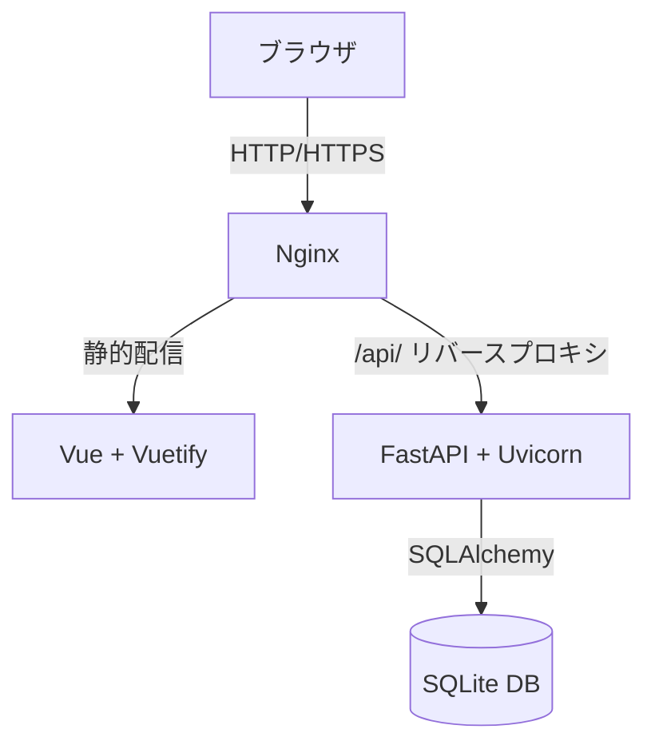
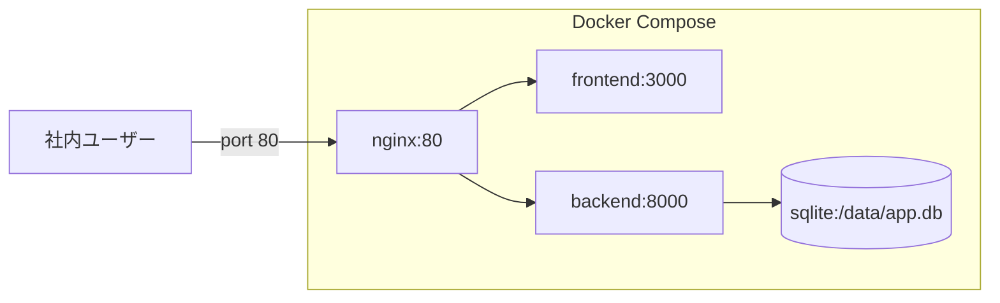
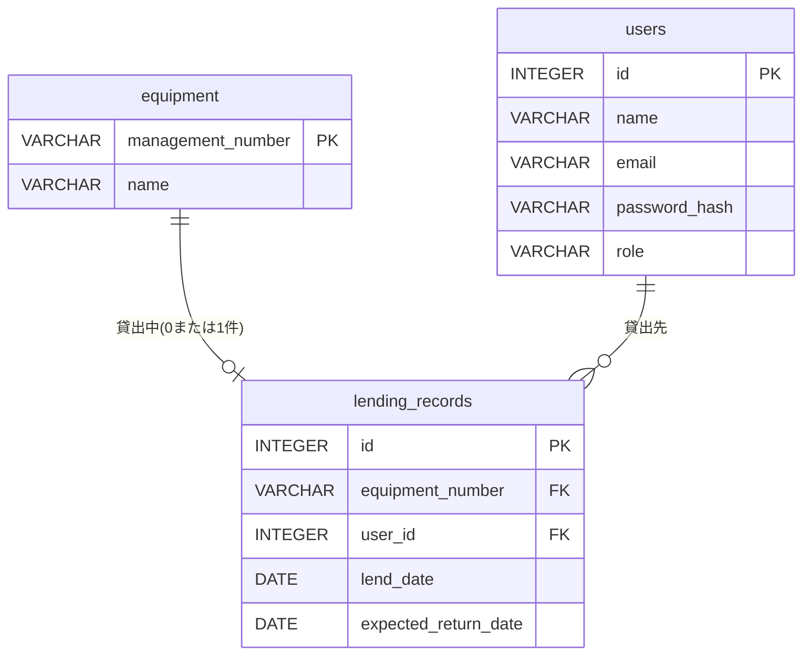
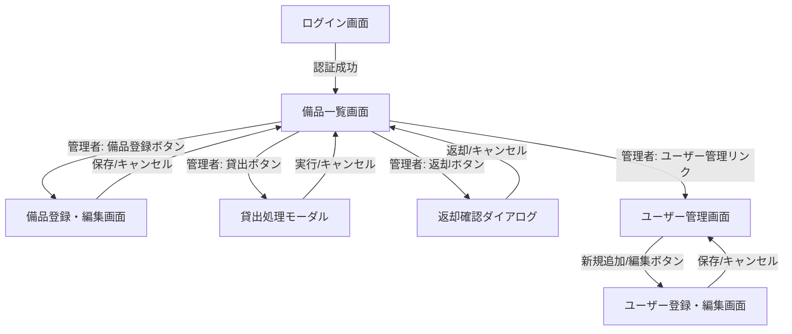
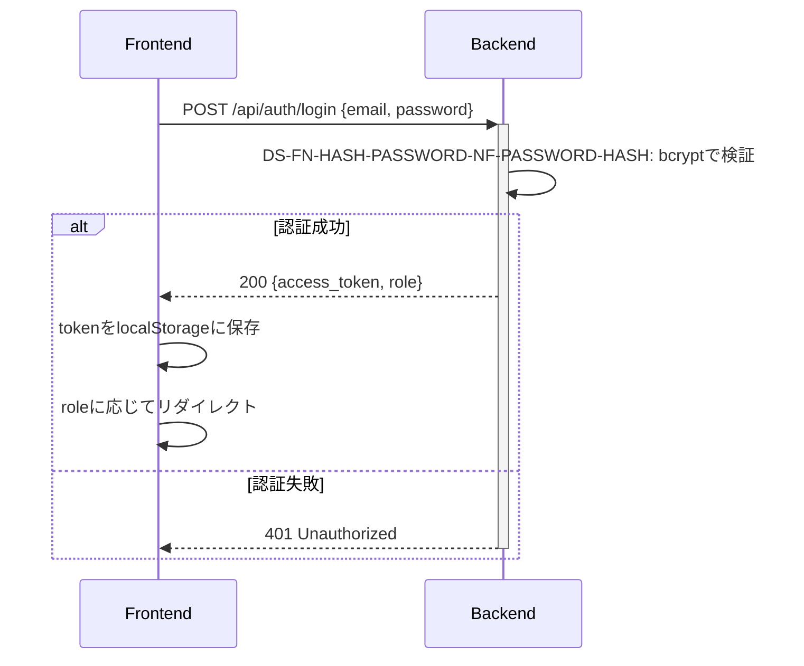
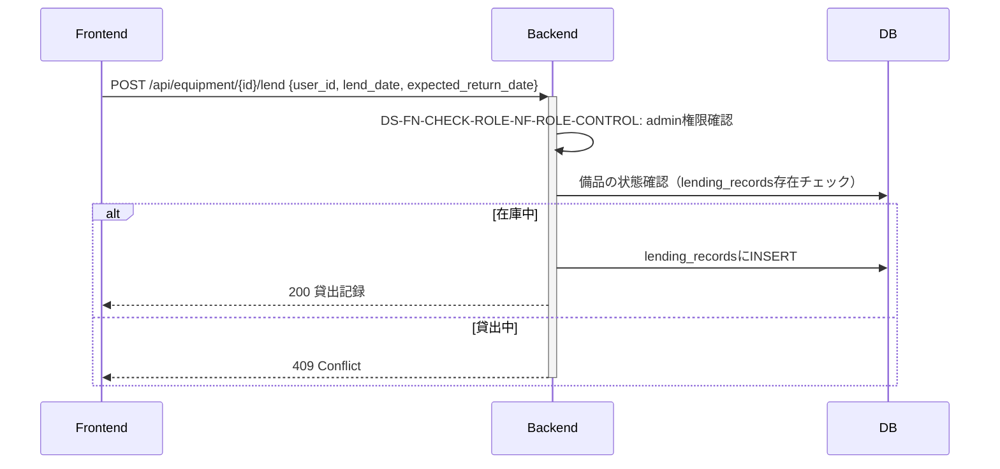
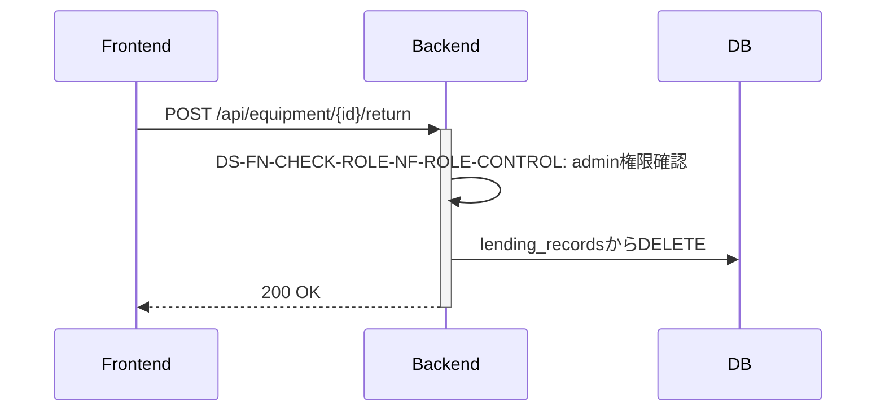
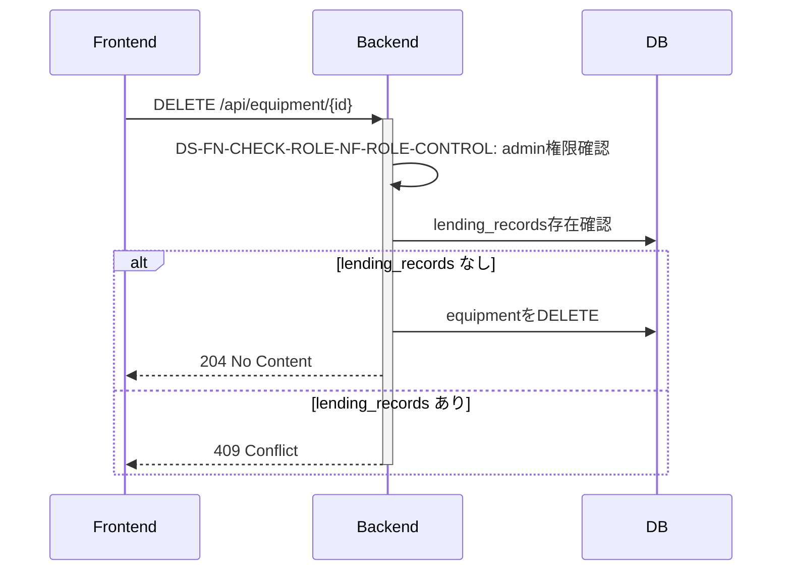
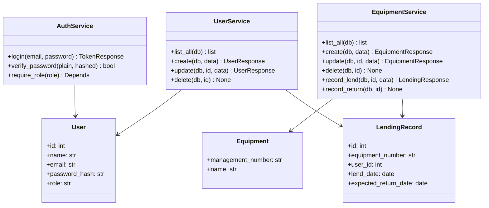
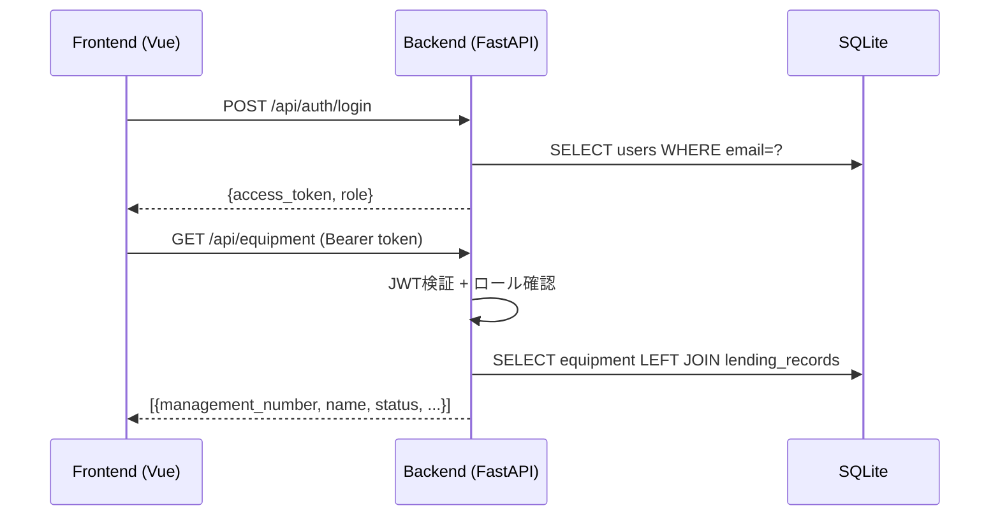

# 備品管理アプリ 詳細設計書

---

## 1. 言語・フレームワーク

### GUIフレームワーク判定

判定日時: 2026-05-31

| 条件ID | 判定条件 | 該当有無 | 理由 |
|---|---|---|---|
| GUI-1 | SSO（OIDC/SAML）必須 | 非該当 | メール/パスワード認証のみ（RQ-NF-ROLE-CONTROL） |
| GUI-2 | 画面・機能単位の厳密な認可が必須 | **該当** | RQ-NF-ROLE-CONTROL：ページ単位の権限制御が必須 |
| GUI-3 | 監査ログ（誰が何をしたか）を本番必須 | 非該当 | ログ不要（要件より） |
| GUI-4 | 外部公開（インターネット公開）前提 | 非該当 | 社内利用のみ |
| GUI-5 | 複雑な画面遷移・状態管理が必須 | 非該当 | 7画面・シンプルな遷移 |

**最終選定結果: Vue（Vuetify）+ FastAPI**

GUI-2が該当するため、ゲート条件により Vue（Vuetify）+ FastAPI を選定する。
フロントエンドはマルチステージビルド後 Nginx で配信し、バックエンドは Nginx でリバースプロキシを設定する。APIエンドポイントは `/api/` に統一する。

### DBフレームワーク判定

| 条件ID | 規模・複雑度 | 選択肢 | 判定 |
|---|---|---|---|
| DB-2 | 極端に少量（100件以下）かつ単純 | **SQLite** | 該当 |

**最終選定: SQLite**

備品100件以下・ユーザー50名以下・単純な3テーブル構成のため SQLite で十分。

### 使用技術スタック

| 区分 | 技術 | バージョン目安 |
|---|---|---|
| フロントエンド | Vue 3 + Vuetify 3 | Vue 3.x / Vuetify 3.x |
| バックエンド | Python + FastAPI | Python 3.11 / FastAPI 0.100+ |
| ORM | SQLAlchemy | 2.x |
| バリデーション | Pydantic | v2 |
| 認証 | JWT (python-jose) + bcrypt (passlib) | - |
| DBドライバー | SQLite3（標準ライブラリ） | - |
| Webサーバー | Nginx + Uvicorn | - |
| E2Eテスト | Playwright | v1.59.0 |
| コンテナ | Docker Compose | - |

---

## 2. システム構成

### コンポーネント一覧

| DS-ID | コンポーネント名 | 役割 | 対応RQ-ID |
|---|---|---|---|
| DS-MD-FRONTEND-FT-LOGIN | フロントエンド（Vue + Vuetify） | 全画面のUI表示・操作 | RQ-FT-LOGIN |
| DS-MD-BACKEND-FT-LIST-EQUIPMENT | バックエンド（FastAPI） | API提供・ビジネスロジック | RQ-FT-LIST-EQUIPMENT |
| DS-MD-SQLITE-DT-DB-REQUIRED | データベース（SQLite） | 永続データ管理 | RQ-DT-DB-REQUIRED |
| DS-MD-INTERNAL-ONLY-DT-NO-EXTERNAL-DB | システム境界（外部接続なし） | 外部DB・外部API接続を持たない | RQ-DT-NO-EXTERNAL-DB |
| DS-MD-SCALE-CONFIG-NF-CONCURRENT-USERS | スケール構成（単一サーバー） | 50名以下の同時接続に対応 | RQ-NF-CONCURRENT-USERS |
| DS-MD-PERFORMANCE-CONFIG-NF-RESPONSE-TIME | パフォーマンス構成 | 全画面3秒以内の応答を保証 | RQ-NF-RESPONSE-TIME |

### システム全体構成図



### ネットワーク構成図



---

## 3. データベース設計

### テーブル設計

#### equipment テーブル（DS-SC-EQUIPMENT-DT-ENTITY-EQUIPMENT）

| カラム名 | 型 | 制約 | 説明 |
|---|---|---|---|
| management_number | VARCHAR(50) | PRIMARY KEY, NOT NULL | 管理番号（手動入力） |
| name | VARCHAR(100) | NOT NULL | 備品名 |

データ区分: 内部データ（DS-SC-EQUIPMENT-DATA-SCOPE-DT-EQUIPMENT-INTERNAL）
保持ポリシー: 削除操作まで保持（DS-SC-EQUIPMENT-LIFECYCLE-DT-EQUIPMENT-RETENTION）

#### users テーブル（DS-SC-USER-DT-ENTITY-USER）

| カラム名 | 型 | 制約 | 説明 |
|---|---|---|---|
| id | INTEGER | PRIMARY KEY, AUTOINCREMENT | - |
| name | VARCHAR(100) | NOT NULL | 氏名 |
| email | VARCHAR(200) | NOT NULL, UNIQUE | ログイン用メールアドレス |
| password_hash | VARCHAR(200) | NOT NULL | bcryptハッシュ済みパスワード |
| role | VARCHAR(10) | NOT NULL, CHECK(role IN ('admin','general')) | 権限（admin/general） |

データ区分: 内部データ（DS-SC-USER-DATA-SCOPE-DT-USER-INTERNAL）
保持ポリシー: 削除操作まで保持（DS-SC-USER-LIFECYCLE-DT-USER-RETENTION）

#### lending_records テーブル（DS-SC-LENDING-DT-ENTITY-LENDING）

| カラム名 | 型 | 制約 | 説明 |
|---|---|---|---|
| id | INTEGER | PRIMARY KEY, AUTOINCREMENT | - |
| equipment_number | VARCHAR(50) | NOT NULL, UNIQUE, FK(equipment.management_number) | 備品管理番号 |
| user_id | INTEGER | NOT NULL, FK(users.id) | 貸出先ユーザーID |
| lend_date | DATE | NOT NULL | 貸出日 |
| expected_return_date | DATE | NOT NULL, CHECK >= lend_date | 返却予定日 |

データ区分: 内部データ（DS-SC-LENDING-DATA-SCOPE-DT-LENDING-INTERNAL）
保持ポリシー: 返却処理時に削除（履歴なし）（DS-SC-LENDING-LIFECYCLE-DT-LENDING-RETENTION）

### リレーション図



### 業務制約

- equipment を DELETE する場合: lending_records に同一 equipment_number の行が存在しないこと
- users を DELETE する場合: lending_records に同一 user_id の行が存在しないこと
- lending_records の equipment_number は UNIQUE（1備品に最大1件の現在貸出記録）

---

## 4. アーキテクチャ設計

### 外部設計

#### 画面一覧

| DS-ID | 画面名 | 対応RQ-ID |
|---|---|---|
| DS-CL-LOGIN-VIEW-UI-LOGIN-SCREEN | ログイン画面 | RQ-UI-LOGIN-SCREEN |
| DS-CL-EQUIPMENT-LIST-VIEW-UI-EQUIPMENT-LIST-SCREEN | 備品一覧画面 | RQ-UI-EQUIPMENT-LIST-SCREEN |
| DS-CL-EQUIPMENT-FORM-VIEW-UI-EQUIPMENT-FORM-SCREEN | 備品登録・編集画面 | RQ-UI-EQUIPMENT-FORM-SCREEN |
| DS-CL-LENDING-MODAL-UI-LENDING-MODAL | 貸出処理モーダル | RQ-UI-LENDING-MODAL |
| DS-CL-RETURN-DIALOG-UI-RETURN-DIALOG | 返却確認ダイアログ | RQ-UI-RETURN-DIALOG |
| DS-CL-USER-LIST-VIEW-UI-USER-LIST-SCREEN | ユーザー管理画面 | RQ-UI-USER-LIST-SCREEN |
| DS-CL-USER-FORM-VIEW-UI-USER-FORM-SCREEN | ユーザー登録・編集画面 | RQ-UI-USER-FORM-SCREEN |

#### 画面遷移図



#### AAモックアップ

**ログイン画面（DS-CL-LOGIN-VIEW-UI-LOGIN-SCREEN）**

```
+---------------------------------------+
|         備品管理システム              |
|                                       |
|   メールアドレス                      |
|   [_______________________________]   |
|   パスワード                          |
|   [_______________________________]   |
|                                       |
|         [    ログイン    ]            |
|                                       |
| ※エラー: メールアドレスまたはパス    |
|   ワードが正しくありません            |
+---------------------------------------+
```

**備品一覧画面・管理者（DS-CL-EQUIPMENT-LIST-VIEW-UI-EQUIPMENT-LIST-SCREEN）**

```
+----------------------------------------------------------------+
| 備品管理システム         [ユーザー管理]  [ログアウト]          |
+----------------------------------------------------------------+
| [+ 備品登録]                                                   |
|                                                                |
| 管理番号 | 備品名        | 状態   | 貸出先  | 返却予定   | 操作 |
|---------|--------------|--------|---------|-----------|------|
| PC-001  | MacBook Pro  | 在庫中 |         |            |[貸出][削除]|
| PC-002  | iPad Air     | 貸出中 | 田中太郎| 2026-06-30 |[返却][削除]|
+----------------------------------------------------------------+
```

**備品一覧画面・一般社員（DS-CL-EQUIPMENT-LIST-VIEW-UI-EQUIPMENT-LIST-SCREEN）**

```
+----------------------------------------------------------------+
| 備品管理システム                           [ログアウト]        |
+----------------------------------------------------------------+
| 管理番号 | 備品名        | 状態   | 貸出先  | 返却予定   |
|---------|--------------|--------|---------|-----------|
| PC-001  | MacBook Pro  | 在庫中 |         |            |
| PC-002  | iPad Air     | 貸出中 | 田中太郎| 2026-06-30 |
+----------------------------------------------------------------+
```

**貸出処理モーダル（DS-CL-LENDING-MODAL-UI-LENDING-MODAL）**

```
+--------------------------------------------+
|  貸出処理: PC-001 / MacBook Pro            |
|--------------------------------------------|
|  貸出先                                    |
|  [田中太郎 ▼]                             |
|  貸出日                                    |
|  [2026-05-31]                              |
|  返却予定日                                |
|  [2026-06-30]                              |
|  ※返却予定日は貸出日以降に設定してください|
|--------------------------------------------|
|           [実行]   [キャンセル]            |
+--------------------------------------------+
```

**返却確認ダイアログ（DS-CL-RETURN-DIALOG-UI-RETURN-DIALOG）**

```
+--------------------------------------------+
|  返却確認                                  |
|--------------------------------------------|
|  以下の備品の返却を記録しますか？          |
|  備品名: MacBook Pro                       |
|  貸出先: 田中太郎                          |
|  返却予定: 2026-06-30                      |
|--------------------------------------------|
|        [返却する]   [キャンセル]           |
+--------------------------------------------+
```

**備品登録・編集画面（DS-CL-EQUIPMENT-FORM-VIEW-UI-EQUIPMENT-FORM-SCREEN）**

```
+--------------------------------------------+
|  備品登録                                  |
|--------------------------------------------|
|  管理番号（必須）                          |
|  [_____________________]                   |
|  備品名（必須）                            |
|  [_____________________]                   |
|--------------------------------------------|
|        [保存]   [キャンセル]               |
+--------------------------------------------+
```

**ユーザー管理画面（DS-CL-USER-LIST-VIEW-UI-USER-LIST-SCREEN）**

```
+--------------------------------------------+
| ユーザー管理              [+ 新規追加]     |
|--------------------------------------------|
| 氏名   | メールアドレス     | 権限  | 操作  |
|--------|-------------------|-------|-------|
| 田中太郎| tanaka@co.jp      | 一般  |[編集][削除]|
| 山田管理| yamada@co.jp      | 管理者|[編集][削除]|
+--------------------------------------------+
```

**ユーザー登録・編集画面（DS-CL-USER-FORM-VIEW-UI-USER-FORM-SCREEN）**

```
+--------------------------------------------+
|  ユーザー登録                              |
|--------------------------------------------|
|  氏名（必須）                              |
|  [_____________________]                   |
|  メールアドレス（必須）                    |
|  [_____________________]                   |
|  パスワード                                |
|  [_____________________]                   |
|  権限（必須）                              |
|  ( ) 管理者  (●) 一般                     |
|--------------------------------------------|
|        [保存]   [キャンセル]               |
+--------------------------------------------+
```

#### 外部連携

外部システムとの連携はなし（RQ-DT-NO-EXTERNAL-DB）。

### 内部設計

#### 処理フロー図

**ログイン処理（DS-IF-AUTH-LOGIN-FT-LOGIN）**



**備品貸出処理（DS-IF-RECORD-LENDING-FT-RECORD-LENDING）**



**備品返却処理（DS-IF-RECORD-RETURN-FT-RECORD-RETURN）**



**備品削除処理（DS-IF-DELETE-EQUIPMENT-FT-DELETE-EQUIPMENT）**



---

## 5. クラス設計

### 全クラス一覧とSOLID適合状況

| DS-ID | クラス名 | 責務 | S | O | L | I | D |
|---|---|---|---|---|---|---|---|
| DS-CL-AUTH-SERVICE-FT-LOGIN | AuthService | 認証・トークン管理 | ✓ | ✓ | - | ✓ | ✓ |
| DS-CL-EQUIPMENT-SERVICE-FT-LIST-EQUIPMENT | EquipmentService | 備品CRUD・貸出制御 | ✓ | ✓ | - | ✓ | ✓ |
| DS-CL-USER-SERVICE-FT-MANAGE-USERS | UserService | ユーザーCRUD | ✓ | ✓ | - | ✓ | ✓ |
| DS-CL-LOGIN-VIEW-UI-LOGIN-SCREEN | LoginView | ログイン画面表示・操作 | ✓ | ✓ | - | ✓ | ✓ |
| DS-CL-EQUIPMENT-LIST-VIEW-UI-EQUIPMENT-LIST-SCREEN | EquipmentListView | 備品一覧表示・操作 | ✓ | ✓ | - | ✓ | ✓ |
| DS-CL-EQUIPMENT-FORM-VIEW-UI-EQUIPMENT-FORM-SCREEN | EquipmentFormView | 備品登録・編集フォーム | ✓ | ✓ | - | ✓ | ✓ |
| DS-CL-LENDING-MODAL-UI-LENDING-MODAL | LendingModal | 貸出入力モーダル | ✓ | ✓ | - | ✓ | ✓ |
| DS-CL-RETURN-DIALOG-UI-RETURN-DIALOG | ReturnDialog | 返却確認ダイアログ | ✓ | ✓ | - | ✓ | ✓ |
| DS-CL-USER-LIST-VIEW-UI-USER-LIST-SCREEN | UserListView | ユーザー一覧表示・操作 | ✓ | ✓ | - | ✓ | ✓ |
| DS-CL-USER-FORM-VIEW-UI-USER-FORM-SCREEN | UserFormView | ユーザー登録・編集フォーム | ✓ | ✓ | - | ✓ | ✓ |

（L列: 継承なしのため非適用）

### バックエンドサービスクラス設計

#### AuthService（DS-CL-AUTH-SERVICE-FT-LOGIN）

**責務**: パスワード検証、JWTトークン生成、現在ユーザー取得

**主要メソッド**:

| DS-ID | メソッド名 | 入力 | 出力 | 説明 |
|---|---|---|---|---|
| DS-FN-LOGIN-FT-LOGIN | login(email, password) | str, str | TokenResponse | 認証してJWT返却 |
| DS-FN-HASH-PASSWORD-NF-PASSWORD-HASH | verify_password(plain, hashed) | str, str | bool | bcryptで検証 |
| DS-FN-CHECK-ROLE-NF-ROLE-CONTROL | require_role(role) | str | Depends関数 | ロール確認デコレータ |

#### EquipmentService（DS-CL-EQUIPMENT-SERVICE-FT-LIST-EQUIPMENT）

**責務**: 備品のCRUD操作・貸出返却処理・業務制約チェック

**主要メソッド**:

| DS-ID | メソッド名 | 入力 | 出力 | 説明 |
|---|---|---|---|---|
| DS-FN-LIST-EQUIPMENT-FT-LIST-EQUIPMENT | list_all(db) | Session | list[EquipmentResponse] | 全備品と貸出情報を取得 |
| DS-FN-CREATE-EQUIPMENT-FT-CREATE-EQUIPMENT | create(db, data) | Session, EquipmentCreate | EquipmentResponse | 備品登録 |
| DS-FN-UPDATE-EQUIPMENT-FT-UPDATE-EQUIPMENT | update(db, id, data) | Session, str, EquipmentUpdate | EquipmentResponse | 備品更新 |
| DS-FN-DELETE-EQUIPMENT-FT-DELETE-EQUIPMENT | delete(db, id) | Session, str | None | 貸出中チェック後削除 |
| DS-FN-RECORD-LENDING-FT-RECORD-LENDING | record_lend(db, id, data) | Session, str, LendingCreate | LendingResponse | 貸出記録登録 |
| DS-FN-RECORD-RETURN-FT-RECORD-RETURN | record_return(db, id) | Session, str | None | 貸出記録削除（返却） |

#### UserService（DS-CL-USER-SERVICE-FT-MANAGE-USERS）

**責務**: ユーザーCRUD・削除時の貸出中チェック

**主要メソッド**:

| DS-ID | メソッド名 | 入力 | 出力 | 説明 |
|---|---|---|---|---|
| DS-FN-MANAGE-USERS-FT-MANAGE-USERS | list_all(db) | Session | list[UserResponse] | ユーザー一覧 |
| DS-FN-CREATE-USER-FT-MANAGE-USERS | create(db, data) | Session, UserCreate | UserResponse | ユーザー登録（パスワードハッシュ化） |
| DS-FN-UPDATE-USER-FT-MANAGE-USERS | update(db, id, data) | Session, int, UserUpdate | UserResponse | ユーザー更新 |
| DS-FN-DELETE-USER-FT-MANAGE-USERS | delete(db, id) | Session, int | None | 貸出中チェック後削除 |

### クラス図



### メッセージ一覧とメッセージフロー図

| DS-ID | メッセージ/イベント | 送信元 | 受信先 | 内容 |
|---|---|---|---|---|
| DS-IF-AUTH-LOGIN-FT-LOGIN | POST /api/auth/login | Frontend | Backend | 認証要求 |
| DS-IF-LIST-EQUIPMENT-FT-LIST-EQUIPMENT | GET /api/equipment | Frontend | Backend | 備品一覧取得 |
| DS-IF-CREATE-EQUIPMENT-FT-CREATE-EQUIPMENT | POST /api/equipment | Frontend | Backend | 備品登録 |
| DS-IF-UPDATE-EQUIPMENT-FT-UPDATE-EQUIPMENT | PUT /api/equipment/{id} | Frontend | Backend | 備品更新 |
| DS-IF-DELETE-EQUIPMENT-FT-DELETE-EQUIPMENT | DELETE /api/equipment/{id} | Frontend | Backend | 備品削除 |
| DS-IF-RECORD-LENDING-FT-RECORD-LENDING | POST /api/equipment/{id}/lend | Frontend | Backend | 貸出処理 |
| DS-IF-RECORD-RETURN-FT-RECORD-RETURN | POST /api/equipment/{id}/return | Frontend | Backend | 返却処理 |
| DS-IF-LIST-USERS-FT-MANAGE-USERS | GET /api/users | Frontend | Backend | ユーザー一覧取得 |
| DS-IF-CREATE-USER-FT-MANAGE-USERS | POST /api/users | Frontend | Backend | ユーザー登録 |
| DS-IF-UPDATE-USER-FT-MANAGE-USERS | PUT /api/users/{id} | Frontend | Backend | ユーザー更新 |
| DS-IF-DELETE-USER-FT-MANAGE-USERS | DELETE /api/users/{id} | Frontend | Backend | ユーザー削除 |
| DS-IF-ROLE-MIDDLEWARE-NF-ROLE-CONTROL | Authorization: Bearer | Frontend | Backend | JWT + ロール確認 |



---

## 6. その他設計

### エラーハンドリング設計

| HTTPステータス | 発生条件 | レスポンス形式 |
|---|---|---|
| 400 Bad Request | リクエストパラメータ不正 | {"detail": "メッセージ"} |
| 401 Unauthorized | 未認証・トークン無効 | {"detail": "認証が必要です"} |
| 403 Forbidden | ロール不足（一般が管理者操作） | {"detail": "この操作には管理者権限が必要です"} |
| 404 Not Found | 備品・ユーザーが存在しない | {"detail": "該当するデータが見つかりません"} |
| 409 Conflict | 貸出中備品の削除、貸出中ユーザーの削除、管理番号重複 | {"detail": "操作できません: [理由]"} |
| 422 Unprocessable Entity | Pydanticバリデーションエラー | FastAPI標準 |
| 500 Internal Server Error | DBエラー等想定外 | {"detail": "サーバーエラーが発生しました"} |

フロントエンドエラー表示ルール:
- 4xx: フィールド横またはフォーム下にエラーメッセージを表示
- 5xx: 画面上部に「エラーが発生しました。しばらく後に再試行してください」を表示

### セキュリティ設計

| 対策 | 実装内容 | 対応要件 |
|---|---|---|
| パスワードハッシュ化 | passlib[bcrypt]でbcryptハッシュ化して保存 | RQ-NF-PASSWORD-HASH |
| JWT認証 | HS256アルゴリズム、有効期限8時間 | RQ-FT-LOGIN |
| ロール制御 | FastAPI Dependsでエンドポイントごとにロール確認 | RQ-NF-ROLE-CONTROL |
| Vue Routerガード | 管理者専用ルートへの一般ユーザーアクセスをフロントでも遮断 | RQ-NF-ROLE-CONTROL |
| CORS設定 | Nginx経由の同一オリジンのみ許可 | RQ-NF-ROLE-CONTROL |

---

## 7. コード設計

### ディレクトリ構成

```
/
├── backend/
│   ├── app/
│   │   ├── api/
│   │   ├── core/
│   │   ├── models/
│   │   ├── schemas/
│   │   └── services/
│   └── tests/
├── frontend/
│   ├── src/
│   │   ├── api/
│   │   ├── components/
│   │   ├── router/
│   │   ├── stores/
│   │   └── views/
│   └── public/
├── e2e/
├── nginx/
└── docker-compose.yml
```

### ファイル一覧（バックエンド）

| ファイルパス | 役割 | 主な設計ID |
|---|---|---|
| backend/app/main.py | FastAPIアプリ起動・ルーター登録 | DS-MD-BACKEND-FT-LIST-EQUIPMENT |
| backend/app/database.py | SQLite接続・セッション生成 | DS-MD-SQLITE-DT-DB-REQUIRED |
| backend/app/models/equipment.py | equipmentテーブルモデル | DS-SC-EQUIPMENT-DT-ENTITY-EQUIPMENT |
| backend/app/models/user.py | usersテーブルモデル | DS-SC-USER-DT-ENTITY-USER |
| backend/app/models/lending.py | lending_recordsテーブルモデル | DS-SC-LENDING-DT-ENTITY-LENDING |
| backend/app/schemas/equipment.py | 備品のリクエスト/レスポンス定義 | DS-IF-CREATE-EQUIPMENT-FT-CREATE-EQUIPMENT |
| backend/app/schemas/user.py | ユーザーのリクエスト/レスポンス定義 | DS-IF-CREATE-USER-FT-MANAGE-USERS |
| backend/app/schemas/auth.py | 認証スキーマ | DS-IF-AUTH-LOGIN-FT-LOGIN |
| backend/app/core/security.py | bcrypt検証・JWT生成・ロール確認 | DS-FN-HASH-PASSWORD-NF-PASSWORD-HASH |
| backend/app/core/deps.py | 認証済みユーザー取得Depends | DS-FN-CHECK-ROLE-NF-ROLE-CONTROL |
| backend/app/services/auth_service.py | AuthServiceクラス | DS-CL-AUTH-SERVICE-FT-LOGIN |
| backend/app/services/equipment_service.py | EquipmentServiceクラス | DS-CL-EQUIPMENT-SERVICE-FT-LIST-EQUIPMENT |
| backend/app/services/user_service.py | UserServiceクラス | DS-CL-USER-SERVICE-FT-MANAGE-USERS |
| backend/app/api/auth.py | POST /api/auth/login | DS-IF-AUTH-LOGIN-FT-LOGIN |
| backend/app/api/equipment.py | 備品CRUD・貸出・返却エンドポイント | DS-IF-LIST-EQUIPMENT-FT-LIST-EQUIPMENT |
| backend/app/api/users.py | ユーザーCRUDエンドポイント | DS-IF-LIST-USERS-FT-MANAGE-USERS |
| backend/tests/test_equipment.py | 備品機能テスト | DS-FN-E2E-VERIFY-LENDING-TS-VERIFY-LENDING |
| backend/tests/test_users.py | ユーザー機能テスト | DS-FN-E2E-VERIFY-USER-MANAGE-TS-VERIFY-USER-MANAGE |
| backend/tests/test_auth.py | 認証機能テスト | DS-FN-E2E-VERIFY-LOGIN-TS-VERIFY-LOGIN |

### ファイル一覧（フロントエンド）

| ファイルパス | 役割 | 主な設計ID |
|---|---|---|
| frontend/src/main.js | Vueアプリ起動 | DS-MD-FRONTEND-FT-LOGIN |
| frontend/src/router/index.js | ルーティング定義・ナビゲーションガード | DS-FN-CHECK-ROLE-NF-ROLE-CONTROL |
| frontend/src/stores/auth.js | 認証状態管理（Pinia） | DS-CL-AUTH-SERVICE-FT-LOGIN |
| frontend/src/api/equipment.js | 備品API呼び出し | DS-IF-LIST-EQUIPMENT-FT-LIST-EQUIPMENT |
| frontend/src/api/users.js | ユーザーAPI呼び出し | DS-IF-LIST-USERS-FT-MANAGE-USERS |
| frontend/src/api/auth.js | 認証API呼び出し | DS-IF-AUTH-LOGIN-FT-LOGIN |
| frontend/src/views/LoginView.vue | ログイン画面 | DS-CL-LOGIN-VIEW-UI-LOGIN-SCREEN |
| frontend/src/views/EquipmentListView.vue | 備品一覧画面 | DS-CL-EQUIPMENT-LIST-VIEW-UI-EQUIPMENT-LIST-SCREEN |
| frontend/src/views/EquipmentFormView.vue | 備品登録・編集画面 | DS-CL-EQUIPMENT-FORM-VIEW-UI-EQUIPMENT-FORM-SCREEN |
| frontend/src/views/UserListView.vue | ユーザー管理画面 | DS-CL-USER-LIST-VIEW-UI-USER-LIST-SCREEN |
| frontend/src/views/UserFormView.vue | ユーザー登録・編集画面 | DS-CL-USER-FORM-VIEW-UI-USER-FORM-SCREEN |
| frontend/src/components/LendingModal.vue | 貸出処理モーダルコンポーネント | DS-CL-LENDING-MODAL-UI-LENDING-MODAL |
| frontend/src/components/ReturnDialog.vue | 返却確認ダイアログコンポーネント | DS-CL-RETURN-DIALOG-UI-RETURN-DIALOG |

### コーディング規約

| 対象 | 規約 |
|---|---|
| Pythonファイル名 | スネークケース |
| Pythonクラス名 | パスカルケース |
| Python関数・変数 | スネークケース |
| Vue ファイル名 | パスカルケース（例: EquipmentListView.vue） |
| Vue コンポーネント名 | パスカルケース |
| JavaScriptファイル名 | キャメルケース（例: equipment.js） |
| APIエンドポイント | ケバブケース・小文字（例: /api/equipment） |
| DBカラム名 | スネークケース |
| 定数 | UPPER_SNAKE_CASE |

---

## 8. テスト設計

### テスト種別

| テスト種別 | 対象 | ツール |
|---|---|---|
| 単体テスト | バックエンドサービスクラス・関数 | pytest |
| 結合テスト | APIエンドポイント（DBを含む） | pytest + FastAPI TestClient |
| E2Eテスト | 全画面操作シナリオ | Playwright |

### 単体テストケース

| テスト対象 | テストケース | 正常/異常 |
|---|---|---|
| AuthService.verify_password | 正しいパスワードでTrueを返す | 正常 |
| AuthService.verify_password | 誤パスワードでFalseを返す | 異常 |
| AuthService.login | 認証成功でトークン返却 | 正常 |
| AuthService.login | 存在しないメールで401 | 異常 |
| EquipmentService.delete | 在庫中備品を正常削除 | 正常 |
| EquipmentService.delete | 貸出中備品で409を返す | 異常 |
| EquipmentService.record_lend | 在庫中備品を貸出中に変更 | 正常 |
| EquipmentService.record_lend | 貸出中備品の再貸出で409 | 異常 |
| UserService.delete | 貸出中備品なしで正常削除 | 正常 |
| UserService.delete | 貸出中備品ありで409 | 異常 |

### 結合テストケース

| APIエンドポイント | テストケース | 正常/異常 |
|---|---|---|
| POST /api/auth/login | 正しい認証情報でトークン返却 | 正常 |
| GET /api/equipment | JWT付きで全備品一覧返却 | 正常 |
| GET /api/equipment | JWT未設定で401 | 異常 |
| POST /api/equipment | 管理者で備品登録成功 | 正常 |
| POST /api/equipment | 一般ユーザーで403 | 異常 |
| POST /api/equipment/{id}/lend | 在庫中備品の貸出成功 | 正常 |
| POST /api/equipment/{id}/return | 貸出中備品の返却成功 | 正常 |
| DELETE /api/equipment/{id} | 貸出中備品削除で409 | 異常 |
| DELETE /api/users/{id} | 貸出中ユーザー削除で409 | 異常 |

---

## 9. 運用設計

### Docker Compose構成

起動方式は docker compose を採用する。DBスキーマと初期管理者アカウントは起動時に自動生成する。

**サービス構成**:

| サービス名 | ベースイメージ | ポート | 役割 |
|---|---|---|---|
| nginx | nginx:alpine | 80 | リバースプロキシ・静的配信 |
| backend | python:3.11-slim | 8000（内部） | FastAPI + Uvicorn |
| frontend（ビルド） | node:20-alpine（マルチステージ） | - | Vue ビルド成果物をnginxにコピー |

**初期化処理**（バックエンド起動時自動実行）:
1. SQLiteのDDL実行（テーブル未存在時のみ作成）
2. 管理者アカウントが0件の場合、初期管理者を登録する（メール: admin@example.com、パスワード: 環境変数 `INITIAL_ADMIN_PASSWORD`）

起動方法と初期ユーザー情報は README.md に記載する。

### README.mdへの記載内容

README.md に以下のセクションを必ず記載する:
- 「起動方法」: `docker compose up` コマンドのみで全サービスが起動する手順
- 「初期ユーザー」: 初期管理者アカウントのメールアドレスと初期パスワードの設定方法

---

## 10. ログ・監視・アラート設計

ログの設計は必須ではないため、ログの種類と内容の記述は行わない（RQ-OP相当: 要件より不要）。

監視・アラートの設計は必須ではないため、監視・アラートの内容と対応方法の記述は行わない（要件より不要）。

---

## 11. E2Eテスト設計

### 設計要件

- 要件書の全テスト用利用シナリオ（RQ-TS-*、9件）を100%網羅する
- Playwright前提で設計する
- 外部連携なしのため、mock/realモード切替は不要。単一モードで運用する
- テストコードは `e2e/` 配下に配置し、docker compose でマウントして即時反映できる構成とする

### docker compose test_playwrightサービス

```
サービス名: test_playwright
イメージ: mcr.microsoft.com/playwright:v1.59.0
プロファイル: test
マウント: ./e2e:/e2e
テスト対象URL: http://nginx（docker compose内サービス名）
通常起動では起動しない
```

### E2E実行コマンド

```
docker compose run --rm test_playwright sh -c "npm install && npx playwright test"
```

### E2Eシナリオ設計

| DS-ID | RQ-TS-ID | テスト目的 | 前提条件 | テスト手順 | 期待結果 |
|---|---|---|---|---|---|
| DS-FN-E2E-VERIFY-LOGIN-TS-VERIFY-LOGIN | RQ-TS-VERIFY-LOGIN | ログイン成功確認 | 管理者アカウント存在 | ログイン画面を開き正しいメール・パスワードを入力してログイン | 備品一覧画面に遷移する |
| DS-FN-E2E-VERIFY-LOGIN-FAIL-TS-VERIFY-LOGIN-FAIL | RQ-TS-VERIFY-LOGIN-FAIL | ログイン失敗確認 | アカウント存在 | 誤ったパスワードでログイン操作 | エラーメッセージが表示されログインできない |
| DS-FN-E2E-VERIFY-EQUIPMENT-LIST-TS-VERIFY-EQUIPMENT-LIST | RQ-TS-VERIFY-EQUIPMENT-LIST | 備品一覧表示確認 | 備品（在庫中・貸出中各1件）登録済み | ログイン後に備品一覧画面を表示 | 管理番号・備品名・状態が表示される。貸出中備品は貸出先氏名・返却予定日も表示される |
| DS-FN-E2E-VERIFY-CREATE-EQUIPMENT-TS-VERIFY-CREATE-EQUIPMENT | RQ-TS-VERIFY-CREATE-EQUIPMENT | 備品登録確認 | 管理者でログイン済み | 備品登録画面で管理番号・備品名を入力して保存 | 一覧に追加され状態が「在庫中」で表示される |
| DS-FN-E2E-VERIFY-LENDING-TS-VERIFY-LENDING | RQ-TS-VERIFY-LENDING | 貸出処理確認 | 管理者ログイン済み、在庫中備品と登録ユーザー存在 | 在庫中備品の貸出ボタンをクリックし社員選択・日付入力後に実行 | 備品状態が「貸出中」に変わり貸出先氏名・返却予定日が表示される |
| DS-FN-E2E-VERIFY-RETURN-TS-VERIFY-RETURN | RQ-TS-VERIFY-RETURN | 返却処理確認 | 管理者ログイン済み、貸出中備品存在 | 貸出中備品の返却ボタンをクリックし確認ダイアログで返却実行 | 備品状態が「在庫中」に変わり貸出先表示が消える |
| DS-FN-E2E-VERIFY-DELETE-LENT-EQUIPMENT-TS-VERIFY-DELETE-LENT-EQUIPMENT | RQ-TS-VERIFY-DELETE-LENT-EQUIPMENT | 貸出中備品削除不可確認 | 管理者ログイン済み、貸出中備品存在 | 貸出中備品の削除ボタンをクリック | エラーメッセージが表示され削除されない |
| DS-FN-E2E-VERIFY-USER-MANAGE-TS-VERIFY-USER-MANAGE | RQ-TS-VERIFY-USER-MANAGE | ユーザー登録確認 | 管理者ログイン済み | ユーザー管理画面で新規ユーザーを登録し一覧表示を確認 | 登録したユーザーが一覧に表示されそのアカウントでログインできる |
| DS-FN-E2E-VERIFY-GENERAL-READONLY-TS-VERIFY-GENERAL-READONLY | RQ-TS-VERIFY-GENERAL-READONLY | 一般社員の権限確認 | 一般社員アカウントでログイン済み | 管理者専用ページへのアクセスを試みる | アクセスが拒否される |

### E2E運用方針

- テストコードは `e2e/` 配下に配置する
- テスト失敗時は修正と再実行を繰り返し、全成功まで継続する
- 実装時・CI時の必須ゴールは全E2Eシナリオ通過とする

---

## 付録: RQ-DS マッピング一覧

| DS-ID | 対応 RQ-ID |
|---|---|
| DS-MD-FRONTEND-FT-LOGIN | RQ-FT-LOGIN |
| DS-MD-BACKEND-FT-LIST-EQUIPMENT | RQ-FT-LIST-EQUIPMENT |
| DS-MD-SQLITE-DT-DB-REQUIRED | RQ-DT-DB-REQUIRED |
| DS-MD-INTERNAL-ONLY-DT-NO-EXTERNAL-DB | RQ-DT-NO-EXTERNAL-DB |
| DS-MD-SCALE-CONFIG-NF-CONCURRENT-USERS | RQ-NF-CONCURRENT-USERS |
| DS-MD-PERFORMANCE-CONFIG-NF-RESPONSE-TIME | RQ-NF-RESPONSE-TIME |
| DS-SC-EQUIPMENT-DT-ENTITY-EQUIPMENT | RQ-DT-ENTITY-EQUIPMENT |
| DS-SC-USER-DT-ENTITY-USER | RQ-DT-ENTITY-USER |
| DS-SC-LENDING-DT-ENTITY-LENDING | RQ-DT-ENTITY-LENDING |
| DS-SC-EQUIPMENT-DATA-SCOPE-DT-EQUIPMENT-INTERNAL | RQ-DT-EQUIPMENT-INTERNAL |
| DS-SC-USER-DATA-SCOPE-DT-USER-INTERNAL | RQ-DT-USER-INTERNAL |
| DS-SC-LENDING-DATA-SCOPE-DT-LENDING-INTERNAL | RQ-DT-LENDING-INTERNAL |
| DS-SC-EQUIPMENT-LIFECYCLE-DT-EQUIPMENT-RETENTION | RQ-DT-EQUIPMENT-RETENTION |
| DS-SC-USER-LIFECYCLE-DT-USER-RETENTION | RQ-DT-USER-RETENTION |
| DS-SC-LENDING-LIFECYCLE-DT-LENDING-RETENTION | RQ-DT-LENDING-RETENTION |
| DS-IF-AUTH-LOGIN-FT-LOGIN | RQ-FT-LOGIN |
| DS-IF-LIST-EQUIPMENT-FT-LIST-EQUIPMENT | RQ-FT-LIST-EQUIPMENT |
| DS-IF-CREATE-EQUIPMENT-FT-CREATE-EQUIPMENT | RQ-FT-CREATE-EQUIPMENT |
| DS-IF-UPDATE-EQUIPMENT-FT-UPDATE-EQUIPMENT | RQ-FT-UPDATE-EQUIPMENT |
| DS-IF-DELETE-EQUIPMENT-FT-DELETE-EQUIPMENT | RQ-FT-DELETE-EQUIPMENT |
| DS-IF-RECORD-LENDING-FT-RECORD-LENDING | RQ-FT-RECORD-LENDING |
| DS-IF-RECORD-RETURN-FT-RECORD-RETURN | RQ-FT-RECORD-RETURN |
| DS-IF-LIST-USERS-FT-MANAGE-USERS | RQ-FT-MANAGE-USERS |
| DS-IF-CREATE-USER-FT-MANAGE-USERS | RQ-FT-MANAGE-USERS |
| DS-IF-UPDATE-USER-FT-MANAGE-USERS | RQ-FT-MANAGE-USERS |
| DS-IF-DELETE-USER-FT-MANAGE-USERS | RQ-FT-MANAGE-USERS |
| DS-IF-ROLE-MIDDLEWARE-NF-ROLE-CONTROL | RQ-NF-ROLE-CONTROL |
| DS-CL-AUTH-SERVICE-FT-LOGIN | RQ-FT-LOGIN |
| DS-CL-EQUIPMENT-SERVICE-FT-LIST-EQUIPMENT | RQ-FT-LIST-EQUIPMENT |
| DS-CL-USER-SERVICE-FT-MANAGE-USERS | RQ-FT-MANAGE-USERS |
| DS-CL-LOGIN-VIEW-UI-LOGIN-SCREEN | RQ-UI-LOGIN-SCREEN |
| DS-CL-EQUIPMENT-LIST-VIEW-UI-EQUIPMENT-LIST-SCREEN | RQ-UI-EQUIPMENT-LIST-SCREEN |
| DS-CL-EQUIPMENT-FORM-VIEW-UI-EQUIPMENT-FORM-SCREEN | RQ-UI-EQUIPMENT-FORM-SCREEN |
| DS-CL-LENDING-MODAL-UI-LENDING-MODAL | RQ-UI-LENDING-MODAL |
| DS-CL-RETURN-DIALOG-UI-RETURN-DIALOG | RQ-UI-RETURN-DIALOG |
| DS-CL-USER-LIST-VIEW-UI-USER-LIST-SCREEN | RQ-UI-USER-LIST-SCREEN |
| DS-CL-USER-FORM-VIEW-UI-USER-FORM-SCREEN | RQ-UI-USER-FORM-SCREEN |
| DS-FN-LOGIN-FT-LOGIN | RQ-FT-LOGIN |
| DS-FN-HASH-PASSWORD-NF-PASSWORD-HASH | RQ-NF-PASSWORD-HASH |
| DS-FN-CHECK-ROLE-NF-ROLE-CONTROL | RQ-NF-ROLE-CONTROL |
| DS-FN-LIST-EQUIPMENT-FT-LIST-EQUIPMENT | RQ-FT-LIST-EQUIPMENT |
| DS-FN-CREATE-EQUIPMENT-FT-CREATE-EQUIPMENT | RQ-FT-CREATE-EQUIPMENT |
| DS-FN-UPDATE-EQUIPMENT-FT-UPDATE-EQUIPMENT | RQ-FT-UPDATE-EQUIPMENT |
| DS-FN-DELETE-EQUIPMENT-FT-DELETE-EQUIPMENT | RQ-FT-DELETE-EQUIPMENT |
| DS-FN-RECORD-LENDING-FT-RECORD-LENDING | RQ-FT-RECORD-LENDING |
| DS-FN-RECORD-RETURN-FT-RECORD-RETURN | RQ-FT-RECORD-RETURN |
| DS-FN-MANAGE-USERS-FT-MANAGE-USERS | RQ-FT-MANAGE-USERS |
| DS-FN-E2E-VERIFY-LOGIN-TS-VERIFY-LOGIN | RQ-TS-VERIFY-LOGIN |
| DS-FN-E2E-VERIFY-LOGIN-FAIL-TS-VERIFY-LOGIN-FAIL | RQ-TS-VERIFY-LOGIN-FAIL |
| DS-FN-E2E-VERIFY-EQUIPMENT-LIST-TS-VERIFY-EQUIPMENT-LIST | RQ-TS-VERIFY-EQUIPMENT-LIST |
| DS-FN-E2E-VERIFY-CREATE-EQUIPMENT-TS-VERIFY-CREATE-EQUIPMENT | RQ-TS-VERIFY-CREATE-EQUIPMENT |
| DS-FN-E2E-VERIFY-LENDING-TS-VERIFY-LENDING | RQ-TS-VERIFY-LENDING |
| DS-FN-E2E-VERIFY-RETURN-TS-VERIFY-RETURN | RQ-TS-VERIFY-RETURN |
| DS-FN-E2E-VERIFY-DELETE-LENT-EQUIPMENT-TS-VERIFY-DELETE-LENT-EQUIPMENT | RQ-TS-VERIFY-DELETE-LENT-EQUIPMENT |
| DS-FN-E2E-VERIFY-USER-MANAGE-TS-VERIFY-USER-MANAGE | RQ-TS-VERIFY-USER-MANAGE |
| DS-FN-E2E-VERIFY-GENERAL-READONLY-TS-VERIFY-GENERAL-READONLY | RQ-TS-VERIFY-GENERAL-READONLY |
