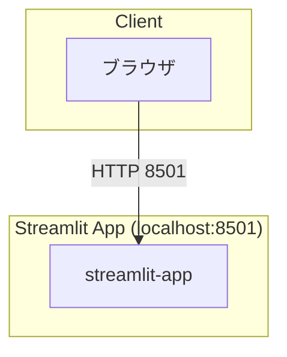
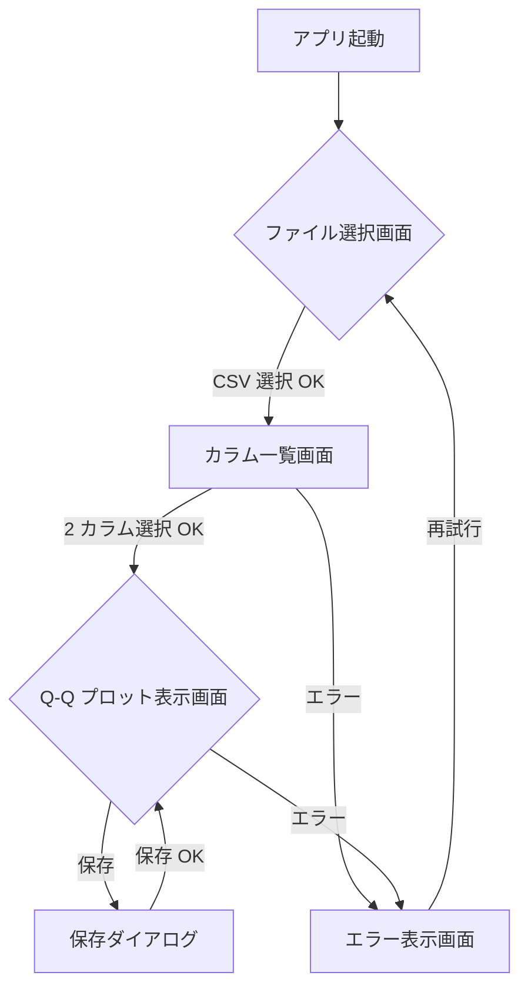
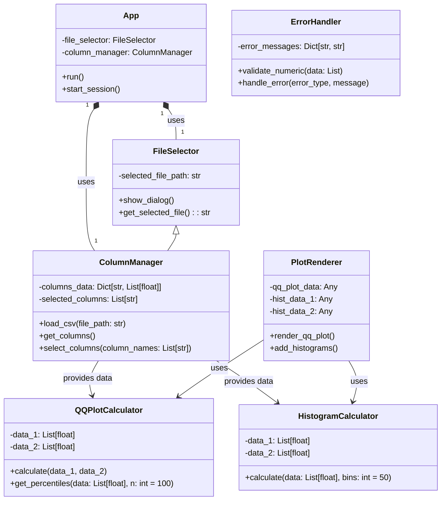
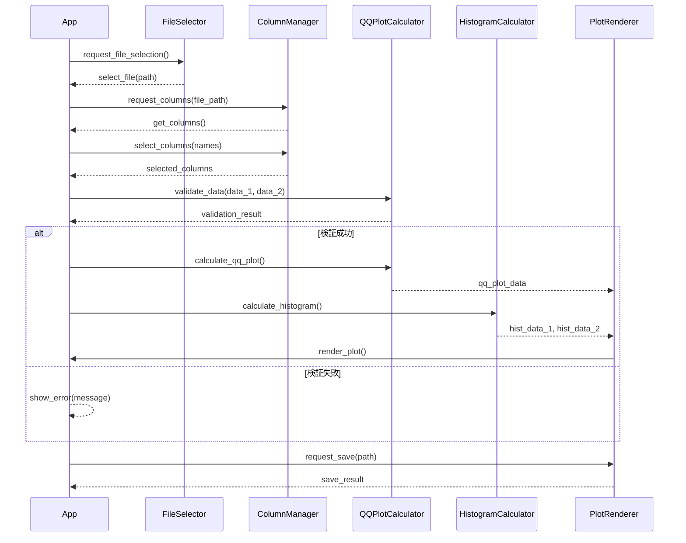

# シグマプロット比較アプリ 詳細設計書（MVP）

## 1. システム構成

### 1.1 コンポーネント一覧

| コンポーネント | 役割 |
|---------------|------|
| Streamlit App | フロントエンドアプリケーション（GUI） |

### 1.2 システム構成図



---

## 2. 外部設計

### 2.1 ユーザーインターフェースの設計

#### 画面一覧

| 画面名 | 要素・機能 |
|-------|-----------|
| **ファイル選択画面** | - ファイル選択ダイアログ<br>- 選択ボタン |
| **カラム一覧画面** | - CSV ファイル名表示<br>- カラム一覧テーブル（チェックボックス付き）<br>- 選択ボタン |
| **Q-Q プロット表示画面** | - Q-Q プロットグラフ<br>- ヒストグラム表示チェックボックス<br>- 保存ボタン<br>- 統計量表示エリア |
| **エラー表示画面** | - エラーメッセージ<br>- 再試行ボタン |

#### 画面遷移図



#### 画面モックアップ（Q-Q プロット表示画面）

```
┌─────────────────────────────────────────────────────┐
│              シグマプロット比較アプリ                 │
├─────────────────────────────────────────────────────┤
│                                                     │
│  ┌───────────────────────────────────────────┐     │
│  │                                             │     │
│  │         ┌─────────────┐                   │     │
│  │         │   Q-Q Plot  │                   │     │
│  │         │             │                   │     │
│  │         │   ┌─────┐   │                   │     │
│  │         │   │     │   │    ┌─────┐       │     │
│  │         │   │     │   │    │     │       │     │
│  │         │   │     │   │    │     │       │     │
│  │         │   │     │   │    │     │       │     │
│  │         │   └─────┘   │    └─────┘       │     │
│  │         │             │                   │     │
│  │         └─────────────┘                   │     │
│  │                                             │     │
│  └───────────────────────────────────────────┘     │
│                                                     │
│  ┌─────────────┐    ┌─────────────┐                │
│  │ カラム 1     │    │ カラム 2     │                │
│  │ 平均：50.3   │    │ 平均：49.8   │                │
│  │ 標準偏差：2.1│    │ 標準偏差：2.3│                │
│  └─────────────┘    └─────────────┘                │
│                                                     │
│  [○] ヒストグラムを表示                              │
│  [保存]                                              │
│                                                     │
└─────────────────────────────────────────────────────┘
```

---

## 3. クラス設計

### 3.1 クラス一覧

| クラス名 | 役割 |
|---------|------|
| `App` | アプリケーションのメインクラス |
| `FileSelector` | ファイル選択機能 |
| `ColumnManager` | カラム管理機能 |
| `QQPlotCalculator` | Q-Q プロット計算クラス |
| `HistogramCalculator` | ヒストグラム計算クラス |
| `PlotRenderer` | プロット描画クラス |
| `ErrorHandler` | エラーハンドリングクラス |

### 3.2 クラス詳細

#### App
- **役割**: アプリケーションのメインコントローラ
- **属性**: `file_selector`, `column_manager`
- **メソッド**:
  - `run()`: アプリケーションの起動と実行
  - `start_session()`: 分析セッションの開始

#### FileSelector
- **役割**: ファイル選択機能を提供
- **属性**: `selected_file_path`
- **メソッド**:
  - `show_dialog()`: ファイル選択ダイアログ表示
  - `get_selected_file(): str`: 選択されたファイルパスを取得

#### ColumnManager
- **役割**: カラムの読み込み・管理機能
- **属性**: `columns_data`, `selected_columns`
- **メソッド**:
  - `load_csv(file_path: str)`: CSV ファイルからカラムデータを読み込む
  - `get_columns()`: カラム一覧を取得
  - `select_columns(column_names: List[str])`: カラムを選択

#### QQPlotCalculator
- **役割**: Q-Q プロットの計算処理
- **属性**: `data_1`, `data_2`
- **メソッド**:
  - `calculate(data_1: List[float], data_2: List[float])`: Q-Q プロットデータを計算
  - `get_percentiles(data: List[float], n: int = 100)`: 百分位数を計算

#### HistogramCalculator
- **役割**: ヒストグラムの計算処理
- **属性**: `data_1`, `data_2`
- **メソッド**:
  - `calculate(data: List[float], bins: int = 50)`: ヒストグラムデータを計算

#### PlotRenderer
- **役割**: プロットの描画処理
- **属性**: `qq_plot_data`, `hist_data_1`, `hist_data_2`
- **メソッド**:
  - `render_qq_plot()`: Q-Q プロットを描画
  - `add_histograms()`: ヒストグラムを重ね描画

#### ErrorHandler
- **役割**: エラーの検出・処理
- **属性**: `error_messages`
- **メソッド**:
  - `validate_numeric(data: List)`: 数値データの検証
  - `handle_error(error_type, message)`: エラーを処理

### 3.3 クラス図



### 3.4 メッセージの整理

| メッセージ | 送信元 | 宛先 | 内容 |
|-----------|--------|------|------|
| `request_file_selection()` | App | FileSelector | ファイル選択ダイアログ表示を要求 |
| `select_file(path: str)` | FileSelector | App | 選択されたファイルパスを通知 |
| `request_columns(file_path: str)` | App | ColumnManager | カラム一覧表示を要求 |
| `get_columns()` | ColumnManager | App | カラム一覧を返却 |
| `select_columns(names: List[str])` | App | ColumnManager | カラム選択を要求 |
| `validate_data(data_1, data_2)` | App | QQPlotCalculator | データ検証を要求 |
| `calculate_qq_plot()` | QQPlotCalculator | PlotRenderer | Q-Q プロット計算を要求 |
| `calculate_histogram()` | HistogramCalculator | PlotRenderer | ヒストグラム計算を要求 |
| `render_plot()` | PlotRenderer | App | 描画結果を表示 |

### 3.5 メッセージフロー図



---

## 4. エラーハンドリング

### 4.1 エラー一覧

| エラータイプ | 発生条件 | 対応措置 |
|-------------|---------|----------|
| `FileNotFoundError` | CSV ファイルが指定されたパスに存在しない場合 | エラーメッセージ表示、再試行ボタン提供 |
| `ValueError: Not a CSV file` | 指定されたファイルが CSV 形式でない場合 | エラーメッセージ表示、ファイル選択画面へ遷移 |
| `ValueError: Too many columns` | 選択可能なカラムが 2 つ未満の場合 | エラーメッセージ表示、再試行ボタン提供 |
| `ValueError: Non-numeric data` | 選択されたカラムが数値型でない場合 | エラーメッセージ表示、再試行ボタン提供 |
| `ValueError: Empty data` | 選択されたカラムが空の場合 | エラーメッセージ表示、再試行ボタン提供 |
| `ValueError: Data length mismatch` | 2 カラムのデータ長が異なる場合 | エラーメッセージ表示、再試行ボタン提供 |
| `ValueError: Too many rows` | データ行数が 10,000 行を超える場合 | エラーメッセージ表示、警告 |

### 4.2 エラーハンドリング戦略

```python
# 例：エラーハンドリングのコード構造
try:
    # 処理
except FileNotFoundError as e:
    show_error("ファイルが見つかりません")
except ValueError as e:
    if "Not a CSV file" in str(e):
        show_error("CSV ファイルを選択してください")
    elif "Non-numeric data" in str(e):
        show_error("数値カラムを選択してください")
    else:
        show_error(str(e))
```

---

## 5. セキュリティ設計

### 5.1 ファイルアップロード制限

| 項目 | 設定値 |
|------|-------|
| ファイル形式 | CSV (.csv) のみ許可 |
| ファイルサイズ | 10MB 以内 |

### 5.2 入力検証

| 検証項目 | 検証方法 |
|---------|---------|
| ファイル形式 | ファイル拡張子チェック、MIME タイプ確認 |
| ファイルサイズ | メモリ使用量制限（10MB） |
| カラム名 | 空チェック、特殊文字フィルタ |
| データ型 | 数値型確認（float/int） |

---

## 6. ソースコード構成

### 6.1 ディレクトリ構成

```
sigma_plot_app/
├── app.py                    # Streamlit アプリケーションのエントリーポイント
├── services/
│   ├── __init__.py
│   ├── file_service.py       # ファイル処理サービス
│   ├── column_service.py     # カラム管理サービス
│   └── plot_service.py       # プロット生成サービス
├── utils/
│   ├── __init__.py
│   ├── validation.py         # 検証ユーティリティ
│   └── error_handler.py      # エラーハンドリングユーティリティ
├── tests/
│   ├── __init__.py
│   └── test_services.py      # サービステスト
├── e2e/                      # E2E テスト
│   └── test_e2e.py
├── Dockerfile                # Streamlit コンテナ用
├── docker-compose.yml        # コンテナオーケストレーション
└── requirements.txt          # Python 依存パッケージ
```

### 6.2 ファイル一覧と役割

| ファイル | 役割 |
|---------|------|
| `app.py` | Streamlit アプリケーションのメインエントリーポイント |
| `services/file_service.py` | CSV ファイルの読み込み・検証処理 |
| `services/column_service.py` | カラム一覧表示、選択機能 |
| `services/plot_service.py` | Q-Q プロット・ヒストグラム計算・描画 |
| `utils/validation.py` | データ検証、入力チェック機能 |
| `utils/error_handler.py` | エラー検出・処理ロジック |

### 6.3 コーディング規約

| 項目 | 規約内容 |
|------|---------|
| **言語** | Python 3.10+ |
| **フレームワーク** | Streamlit |
| **型付け** | mypy による静的型チェック、type hints を使用 |
| **フォーマット** | black, isort |
| **テスト** | pytest, unittest |
| **ドキュメント** | docstring (Google style) |

---

## 7. テスト設計

### 7.1 テスト一覧

| テストカテゴリ | テスト名 | 対象 |
|--------------|---------|------|
| ユニットテスト | `test_file_service.py` | file_service |
| ユニットテスト | `test_column_service.py` | column_service |
| ユニットテスト | `test_plot_service.py` | plot_service |
| ユニットテスト | `test_validation.py` | validation |
| 結合テスト | `test_column_selection_flow.py` | カラム選択フロー |
| 結合テスト | `test_qq_plot_generation.py` | Q-Q プロット生成 |
| 結合テスト | `test_histogram_overlay.py` | ヒストグラム併記 |
| E2E テスト | `test_e2e_file_selection.py` | ファイル選択機能 |
| E2E テスト | `test_e2e_column_selection.py` | カラム選択機能 |
| E2E テスト | `test_e2e_qq_plot_display.py` | Q-Q プロット表示 |
| E2E テスト | `test_e2e_histogram_display.py` | ヒストグラム表示 |
| E2E テスト | `test_e2e_save_plot.py` | プロット保存機能 |
| E2E テスト | `test_e2e_error_handling.py` | エラー処理 |

### 7.2 E2E テスト設計

#### docker-compose テスト環境設定

```yaml
# docker-compose.yml の profile 設定例
services:
  test_playwright:
    image: mcr.microsoft.com/playwright:v1.59.0-noble
    profiles: [test]  # 通常の起動では起動しない
    volumes:
      - ./e2e:/tests/e2e  # テストコードのマウント
    environment:
      - BASE_URL=http://localhost:8501  # テスト用ベース URL
    networks:
      - app-network

# E2E テスト実行コマンド
docker compose run --rm test_playwright sh -c "npm install && npx playwright test"
```

---

## 8. レビュー結果

### 矛盾・冗長性の確認

| チェック項目 | 結果 |
|-------------|------|
| 矛盾がないか確認 | ✅ OK |
| 冗長コードがないか確認 | ✅ OK |
| 同じ処理の再実装がないか確認 | ✅ OK（共通モジュール化） |
| MVP 範囲内か確認 | ✅ OK |

### 不要な要素のリスト

本設計書は「シグマプロット比較アプリ」に特化した最小機能セットであり、以下の理由で削除可能な要件は存在しません。

- **業務課題に紐づく機能**: 全機能が「分布の視覚的比較」「正規性確認」「外れ値検出」のいずれかの課題解決に寄与
- **将来拡張**: 現時点で拡張が必要な要件は存在しない（MVP に徹している）
- **ベストプラクティス**: 実装は業務要件に即した最小限のもの

**削除候補なし**（MVP として完結）

---

## 9. まとめ

本詳細設計書は、シグマプロット比較アプリの完全な実装を可能にする最小限の設計を提供する。

- **システム構成**: Streamlit アプリのみで完結
- **フロントエンド**: Streamlit を使用した GUI
- **バックエンド**: なし（Streamlit 内での処理）
- **テスト**: ユニットテスト、結合テスト、E2E テスト（Playwright）

MVP に則り、必要な機能のみを実装し、将来の拡張は含めない設計となっている。