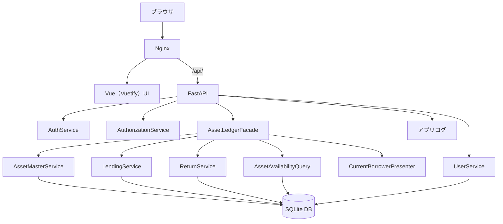
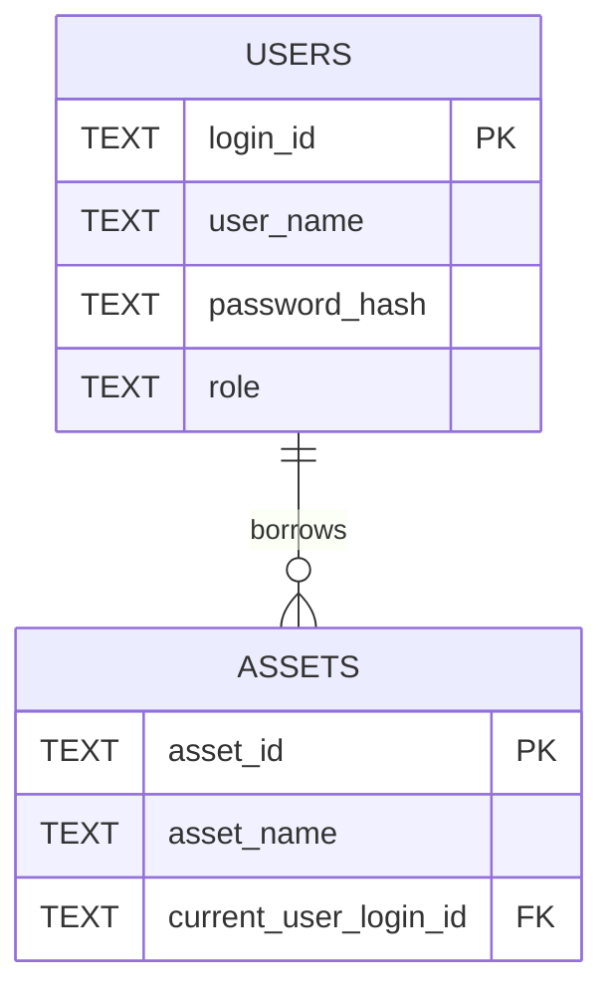
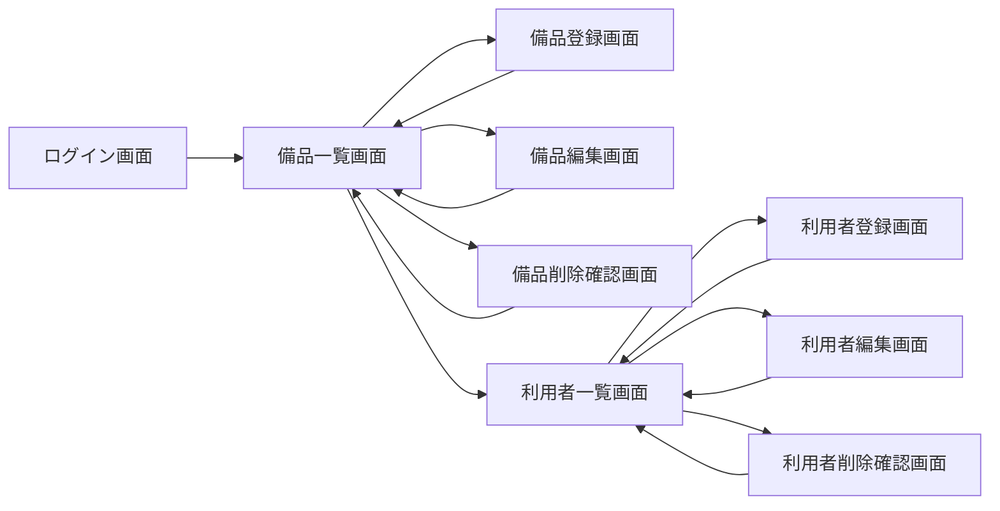
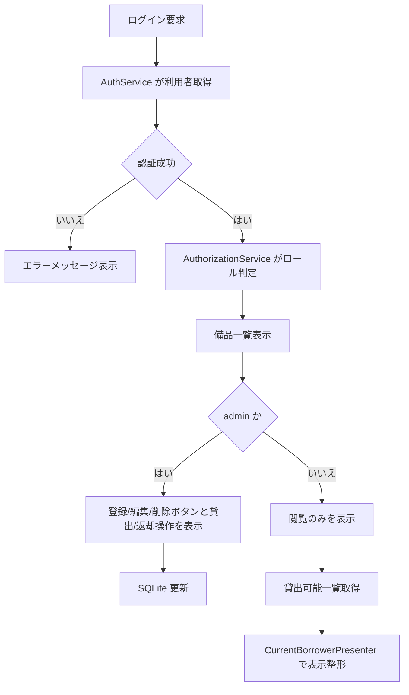
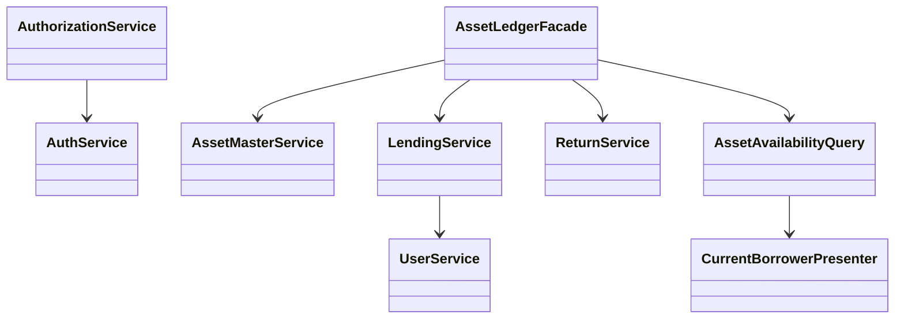
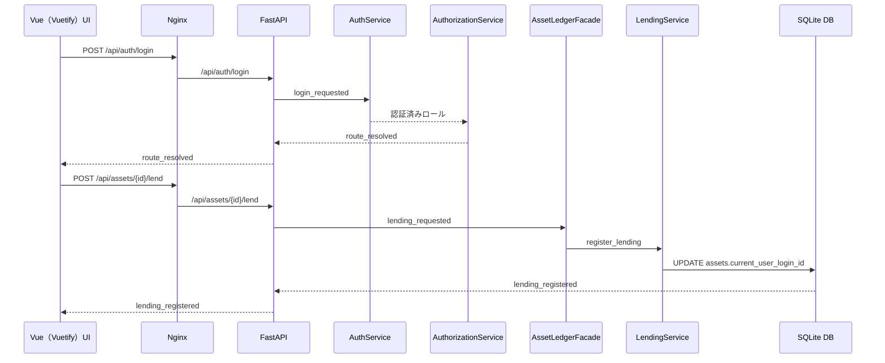

# 詳細設計書

## 1. 言語・フレームワーク

| DS-ID | 項目 | 選定結果 | 選定理由 | 対応要件ID |
|---|---|---|---|---|
| DS-MD-ASSET-LEDGER-APP-FT-UNIFY-ASSET-LEDGER | 言語 | Python 3.12 | SQLite と組み合わせた単一プロセス構成を最小実装で実現しやすいため | RQ-FT-UNIFY-ASSET-LEDGER |
| DS-MD-VUE-VUETIFY-UI-UI-APPLICATION-TYPE-GUI | フロントエンド | Vue 3 + Vuetify 3 | 10画面規模の CRUD 画面をコンポーネント分割で管理しやすいため | RQ-UI-APPLICATION-TYPE-GUI |
| DS-MD-FASTAPI-BACKEND-FT-UNIFY-ASSET-LEDGER | バックエンド | FastAPI | 認証、権限、業務ロジックを API として分離しやすいため | RQ-FT-UNIFY-ASSET-LEDGER |
| DS-MD-NGINX-REVERSE-PROXY-UI-ROLE-BASED-SCREENS | Web 配信 | Nginx | Vue の静的配信と FastAPI への `/api/` リバースプロキシを一元化するため | RQ-UI-ROLE-BASED-SCREENS |

## 2. システム構成

### 2.1 コンポーネント一覧

| DS-ID | コンポーネント名 | 役割 | 対応要件ID |
|---|---|---|---|
| DS-MD-VUE-VUETIFY-UI-UI-APPLICATION-TYPE-GUI | Vue（Vuetify）UI | ログイン画面、単一備品一覧画面、備品 CRUD 画面、利用者 CRUD 画面を描画する | RQ-UI-APPLICATION-TYPE-GUI |
| DS-MD-FASTAPI-BACKEND-FT-UNIFY-ASSET-LEDGER | FastAPI API | 認証、権限判定、備品・利用者 CRUD、貸出・返却 API を提供する | RQ-FT-UNIFY-ASSET-LEDGER |
| DS-MD-NGINX-REVERSE-PROXY-UI-ROLE-BASED-SCREENS | Nginx | Vue 静的ファイル配信と `/api/` パスの API 逆プロキシを行う | RQ-UI-ROLE-BASED-SCREENS |
| DS-IF-ROLE-ROUTING-UI-ROLE-BASED-SCREENS | 画面ルーティング制御 | ロールごとに表示画面を切り替える | RQ-UI-ROLE-BASED-SCREENS |
| DS-CL-AUTH-SERVICE-NF-AUTHENTICATION-ID-PASSWORD | AuthService | ログインIDとパスワードハッシュで認証する | RQ-NF-AUTHENTICATION-ID-PASSWORD |
| DS-CL-AUTHORIZATION-SERVICE-NF-AUTHORIZATION-BY-ROLE | AuthorizationService | 管理者操作を認可し、一般利用者を一覧参照へ限定する | RQ-NF-AUTHORIZATION-BY-ROLE |
| DS-CL-ASSET-LEDGER-FACADE-FT-UNIFY-ASSET-LEDGER | AssetLedgerFacade | 備品関連ユースケースを単一台帳の入り口として集約する | RQ-FT-UNIFY-ASSET-LEDGER |
| DS-CL-CURRENT-BORROWER-PRESENTER-FT-SHOW-CURRENT-BORROWER | CurrentBorrowerPresenter | 現在利用者名と貸出可能状態を表示形式へ変換する | RQ-FT-SHOW-CURRENT-BORROWER |
| DS-CL-ASSET-MASTER-SERVICE-FT-MANAGE-ASSET-MASTER | AssetMasterService | 備品の登録、更新、削除、一覧、詳細を管理する | RQ-FT-MANAGE-ASSET-MASTER |
| DS-CL-LENDING-SERVICE-FT-REGISTER-LENDING | LendingService | 現在利用者IDを設定し備品を貸出中へ遷移させる | RQ-FT-REGISTER-LENDING |
| DS-CL-RETURN-SERVICE-FT-REGISTER-RETURN | ReturnService | 現在利用者IDを解除し備品を貸出可能へ戻す | RQ-FT-REGISTER-RETURN |
| DS-CL-ASSET-AVAILABILITY-QUERY-FT-VIEW-ASSET-AVAILABILITY | AssetAvailabilityQuery | 一般利用者向けに貸出可能状態一覧を返す | RQ-FT-VIEW-ASSET-AVAILABILITY |
| DS-CL-USER-SERVICE-FT-MANAGE-USERS | UserService | 利用者の登録、更新、削除、一覧を管理する | RQ-FT-MANAGE-USERS |
| DS-SC-LOCAL-DB-SCHEMA-DT-USE-INTERNAL-DB | SQLite DB | 備品台帳と利用者情報を永続化する | RQ-DT-USE-INTERNAL-DB |
| DS-IF-APPLICATION-LOG-OP-APPLICATION-LOG-RETENTION | アプリログ出力 | 動作ログとエラーログをファイルへ出力する | RQ-OP-APPLICATION-LOG-RETENTION |
| DS-MD-STANDALONE-DEPLOYMENT-EX-NO-EXTERNAL-INTEGRATION | 単独配備構成 | 外部システムに依存せず単体で起動する | RQ-EX-NO-EXTERNAL-INTEGRATION |

### 2.2 システム全体構成図



### 2.3 各コンポーネントの役割と機能

| DS-ID | 機能詳細 | 対応要件ID |
|---|---|---|
| DS-MD-ASSET-LEDGER-APP-FT-UNIFY-ASSET-LEDGER | 備品操作の入口を一つにそろえ、担当者ごとの差異を排除する | RQ-FT-UNIFY-ASSET-LEDGER |
| DS-CL-CURRENT-BORROWER-PRESENTER-FT-SHOW-CURRENT-BORROWER | 現在利用者IDから氏名を引き当て、一覧表示文字列を生成する | RQ-FT-SHOW-CURRENT-BORROWER |
| DS-MD-KPI-RECORD-LEAKAGE-NF-KPI-RECORD-LEAKAGE-RATE | 月次の記録漏れ件数と総貸出更新件数から漏れ率を算出する運用ルールを保持する | RQ-NF-KPI-RECORD-LEAKAGE-RATE |
| DS-MD-KPI-NO-UNKNOWN-ITEM-NF-KPI-NO-UNKNOWN-ITEM | 所在不明件数を月次棚卸結果で 0 件確認する運用ルールを保持する | RQ-NF-KPI-NO-UNKNOWN-ITEM |
| DS-MD-PERFORMANCE-BUDGET-NF-RESPONSE-TIME-3S | 一覧表示と更新処理を 3 秒以内に収める処理上限を定義する | RQ-NF-RESPONSE-TIME-3S |
| DS-MD-CONNECTION-LIMIT-NF-CONCURRENT-USERS-20 | 20 ユーザー同時利用を前提に単一コンテナ 1 プロセスで処理する | RQ-NF-CONCURRENT-USERS-20 |
| DS-MD-KPI-MEASUREMENT-OP-SOFT-SAVING-SEARCH-TIME | 所在確認時間の実測値を README 記載手順で比較する運用を定義する | RQ-OP-SOFT-SAVING-SEARCH-TIME |
| DS-MD-NO-EXTERNAL-DATA-DT-EXTERNAL-DATA-SCOPE | 外部入力を受けず、全データ生成元を画面入力に限定する | RQ-DT-EXTERNAL-DATA-SCOPE |
| DS-MD-UNLIMITED-RETENTION-DT-DATA-RETENTION-UNLIMITED | 業務データを自動削除せず残し続ける | RQ-DT-DATA-RETENTION-UNLIMITED |
| DS-MD-LOCAL-SQLITE-CONNECTION-DT-NO-EXTERNAL-DB-CONNECTION | DB 接続先をローカル SQLite ファイルに固定する | RQ-DT-NO-EXTERNAL-DB-CONNECTION |
| DS-MD-NGINX-API-PATH-FT-UNIFY-ASSET-LEDGER | API エンドポイントを `/api/` 配下へ統一する | RQ-FT-UNIFY-ASSET-LEDGER |

### 2.4 コンポーネント間インターフェースとデータフロー

| DS-ID | 送信元 | 送信先 | データ | 対応要件ID |
|---|---|---|---|---|
| DS-IF-LOGIN-INPUT-NF-AUTHENTICATION-ID-PASSWORD | ログイン画面 | FastAPI | `/api/auth/login` にログインID、平文パスワードを送る | RQ-NF-AUTHENTICATION-ID-PASSWORD |
| DS-IF-ROLE-ROUTING-UI-ROLE-BASED-SCREENS | FastAPI | Vue（Vuetify）UI | ロール情報と表示許可情報を返す | RQ-UI-ROLE-BASED-SCREENS |
| DS-IF-ASSET-MASTER-FORM-FT-MANAGE-ASSET-MASTER | 備品編集画面 | AssetMasterService | 資産管理番号、備品名 | RQ-FT-MANAGE-ASSET-MASTER |
| DS-IF-LENDING-FORM-FT-REGISTER-LENDING | 備品一覧画面 | LendingService | 資産管理番号、利用者ログインID | RQ-FT-REGISTER-LENDING |
| DS-IF-RETURN-FORM-FT-REGISTER-RETURN | 備品一覧画面 | ReturnService | 資産管理番号 | RQ-FT-REGISTER-RETURN |
| DS-IF-ASSET-LIST-QUERY-FT-VIEW-ASSET-AVAILABILITY | 備品一覧画面 | AssetAvailabilityQuery | 一覧取得要求 | RQ-FT-VIEW-ASSET-AVAILABILITY |
| DS-IF-CURRENT-BORROWER-VIEW-FT-SHOW-CURRENT-BORROWER | AssetAvailabilityQuery | CurrentBorrowerPresenter | 資産管理番号、現在利用者ID | RQ-FT-SHOW-CURRENT-BORROWER |
| DS-IF-USER-FORM-FT-MANAGE-USERS | 利用者管理画面 | UserService | ログインID、氏名、パスワードハッシュ、ロール | RQ-FT-MANAGE-USERS |
| DS-IF-APPLICATION-LOG-OP-APPLICATION-LOG-RETENTION | 各サービス | ログファイル | 操作結果、例外内容、実行時刻 | RQ-OP-APPLICATION-LOG-RETENTION |

### 2.5 ネットワーク構成図

```mermaid
flowchart LR
    Client[利用者ブラウザ] -->|HTTP| Nginx[nginx コンテナ]
    Nginx -->|静的配信| Frontend[frontend コンテナでビルドした成果物]
    Nginx -->|/api/| Backend[backend コンテナ(FastAPI)]
    Backend -->|ローカルファイルI/O| Db[(SQLite ファイル)]
    Backend -->|ローカルファイルI/O| Log[(logs ディレクトリ)]
    Playwright[test_playwright コンテナ] -->|HTTP| Nginx
```

## 3. データベース設計

### 3.1 DB 必須性

| DS-ID | 判定 | 理由 | 対応要件ID |
|---|---|---|---|
| DS-SC-LOCAL-DB-SCHEMA-DT-USE-INTERNAL-DB | DB は必須 | 単一台帳、同時更新整合、ロール認証を永続化するため | RQ-DT-USE-INTERNAL-DB |
| DS-MD-LOCAL-SQLITE-CONNECTION-DT-NO-EXTERNAL-DB-CONNECTION | 製品選定 | データ規模が小さく単純なため SQLite を採用する | RQ-DT-NO-EXTERNAL-DB-CONNECTION |

### 3.2 テーブル設計

#### 3.2.1 assets テーブル

| DS-ID | カラム名 | 型 | 制約 | 説明 | 対応要件ID |
|---|---|---|---|---|---|
| DS-SC-ASSET-TABLE-DT-ASSET-ENTITY | asset_id | TEXT | PK, NOT NULL | 資産管理番号 | RQ-DT-ASSET-ENTITY |
| DS-SC-ASSET-COLUMNS-DT-ASSET-ATTRIBUTES | asset_name | TEXT | NOT NULL | 備品名 | RQ-DT-ASSET-ATTRIBUTES |
| DS-SC-ASSET-COLUMNS-DT-ASSET-ATTRIBUTES | current_user_login_id | TEXT | NULL, FK users.login_id | 現在利用者ID | RQ-DT-ASSET-ATTRIBUTES |

#### 3.2.2 users テーブル

| DS-ID | カラム名 | 型 | 制約 | 説明 | 対応要件ID |
|---|---|---|---|---|---|
| DS-SC-USER-TABLE-DT-USER-ENTITY | login_id | TEXT | PK, NOT NULL | ログインID | RQ-DT-USER-ENTITY |
| DS-SC-USER-COLUMNS-DT-USER-ATTRIBUTES | user_name | TEXT | NOT NULL | 氏名 | RQ-DT-USER-ATTRIBUTES |
| DS-SC-USER-COLUMNS-DT-USER-ATTRIBUTES | password_hash | TEXT | NOT NULL | パスワードハッシュ | RQ-DT-USER-ATTRIBUTES |
| DS-SC-USER-COLUMNS-DT-USER-ATTRIBUTES | role | TEXT | NOT NULL, CHECK role in ('admin','viewer') | ロール | RQ-DT-USER-ATTRIBUTES |

### 3.3 リレーション図



### 3.4 データ整合性制約

| DS-ID | 制約内容 | 対応要件ID |
|---|---|---|
| DS-SC-INTERNAL-DATA-SCHEMA-DT-INTERNAL-DATA-SCOPE | 業務データは assets、users、ログファイルの 3 種に限定する | RQ-DT-INTERNAL-DATA-SCOPE |
| DS-SC-ASSET-COLUMNS-DT-ASSET-ATTRIBUTES | assets.current_user_login_id は users.login_id に存在する値のみ許可する | RQ-DT-ASSET-ATTRIBUTES |
| DS-SC-USER-COLUMNS-DT-USER-ATTRIBUTES | users.role は admin または viewer のみ許可する | RQ-DT-USER-ATTRIBUTES |
| DS-EV-ASSET-STATE-TRANSITION-DT-ASSET-STATE-TRANSITION | current_user_login_id が NULL のとき貸出可能、非 NULL のとき貸出中と判定する | RQ-DT-ASSET-STATE-TRANSITION |

## 4. アーキテクチャ設計

### 4.1 外部設計

#### 4.1.1 UI 設計

| DS-ID | 画面名 | 要素 | 動作 | 対応要件ID |
|---|---|---|---|---|
| DS-MD-VUE-VUETIFY-UI-UI-APPLICATION-TYPE-GUI | ログイン画面 | ログインID入力、パスワード入力、ログインボタン | `/api/auth/login` の認証成功時にロール別画面へ遷移する | RQ-UI-APPLICATION-TYPE-GUI |
| DS-MD-VUE-VUETIFY-UI-UI-APPLICATION-TYPE-GUI | 備品一覧画面 | 一覧テーブル、状態列、現在利用者列、管理者のみ表示する登録/編集/削除ボタン、貸出/返却操作、利用者一覧導線 | `/api/assets` と `/api/assets/availability` の結果を表示し、管理者のみ更新操作を有効化する | RQ-UI-APPLICATION-TYPE-GUI |
| DS-MD-VUE-VUETIFY-UI-UI-APPLICATION-TYPE-GUI | 備品登録画面 | 資産管理番号入力、備品名入力、保存ボタン | `/api/assets` へ POST して新規備品を登録する | RQ-UI-APPLICATION-TYPE-GUI |
| DS-IF-ROLE-ROUTING-UI-ROLE-BASED-SCREENS | 画面遷移制御 | ログイン API で返却されたロール値 | ログイン後は全ユーザーを備品一覧画面へ遷移し、admin のみ CRUD ボタンを表示する | RQ-UI-ROLE-BASED-SCREENS |
| DS-CL-ASSET-MASTER-SERVICE-FT-MANAGE-ASSET-MASTER | 備品編集画面 | 資産管理番号表示、備品名入力、保存ボタン | 既存備品を更新する | RQ-FT-MANAGE-ASSET-MASTER |
| DS-CL-ASSET-MASTER-SERVICE-FT-MANAGE-ASSET-MASTER | 備品削除確認画面 | 資産管理番号表示、備品名表示、削除確認ボタン | 削除対象を確認して削除する | RQ-FT-MANAGE-ASSET-MASTER |
| DS-CL-LENDING-SERVICE-FT-REGISTER-LENDING | 備品一覧画面 | 貸出対象備品選択、利用者選択、貸出実行（管理者のみ表示） | 貸出中へ更新する | RQ-FT-REGISTER-LENDING |
| DS-CL-RETURN-SERVICE-FT-REGISTER-RETURN | 備品一覧画面 | 貸出中備品選択、返却実行（管理者のみ表示） | 貸出可能へ更新する | RQ-FT-REGISTER-RETURN |
| DS-CL-ASSET-AVAILABILITY-QUERY-FT-VIEW-ASSET-AVAILABILITY | 備品一覧画面 | 備品一覧テーブル | 全件を表示し、検索欄は設けない | RQ-FT-VIEW-ASSET-AVAILABILITY |
| DS-CL-CURRENT-BORROWER-PRESENTER-FT-SHOW-CURRENT-BORROWER | 備品一覧画面 | 現在利用者列、貸出状態列 | 借用者名または空欄を表示する | RQ-FT-SHOW-CURRENT-BORROWER |
| DS-CL-USER-SERVICE-FT-MANAGE-USERS | 利用者一覧画面 | 利用者テーブル、登録導線、編集導線、削除導線 | 利用者操作の起点にする | RQ-FT-MANAGE-USERS |
| DS-CL-USER-SERVICE-FT-MANAGE-USERS | 利用者登録画面 | ログインID、氏名、パスワード、ロール、保存 | 新規利用者を登録する | RQ-FT-MANAGE-USERS |
| DS-CL-USER-SERVICE-FT-MANAGE-USERS | 利用者編集画面 | ログインID表示、氏名、パスワード、ロール、保存 | 既存利用者を更新する | RQ-FT-MANAGE-USERS |
| DS-CL-USER-SERVICE-FT-MANAGE-USERS | 利用者削除確認画面 | ログインID表示、氏名表示、削除確認ボタン | 削除対象を確認して削除する | RQ-FT-MANAGE-USERS |

#### 4.1.6 API エンドポイント設計（`/api/` 統一）

| DS-ID | メソッド | パス | 役割 | 対応要件ID |
|---|---|---|---|---|
| DS-IF-AUTH-LOGIN-API-NF-AUTHENTICATION-ID-PASSWORD | POST | /api/auth/login | ログイン認証 | RQ-NF-AUTHENTICATION-ID-PASSWORD |
| DS-IF-ASSET-LIST-API-FT-MANAGE-ASSET-MASTER | GET | /api/assets | 備品一覧取得（ロールに応じて操作可否情報を付与） | RQ-FT-MANAGE-ASSET-MASTER |
| DS-IF-ASSET-CREATE-API-FT-MANAGE-ASSET-MASTER | POST | /api/assets | 備品登録 | RQ-FT-MANAGE-ASSET-MASTER |
| DS-IF-ASSET-UPDATE-API-FT-MANAGE-ASSET-MASTER | PUT | /api/assets/{asset_id} | 備品更新 | RQ-FT-MANAGE-ASSET-MASTER |
| DS-IF-ASSET-DELETE-API-FT-MANAGE-ASSET-MASTER | DELETE | /api/assets/{asset_id} | 備品削除 | RQ-FT-MANAGE-ASSET-MASTER |
| DS-IF-ASSET-LEND-API-FT-REGISTER-LENDING | POST | /api/assets/{asset_id}/lend | 貸出登録 | RQ-FT-REGISTER-LENDING |
| DS-IF-ASSET-RETURN-API-FT-REGISTER-RETURN | POST | /api/assets/{asset_id}/return | 返却登録 | RQ-FT-REGISTER-RETURN |
| DS-IF-ASSET-AVAILABILITY-API-FT-VIEW-ASSET-AVAILABILITY | GET | /api/assets/availability | 一般利用者向け貸出可能一覧取得 | RQ-FT-VIEW-ASSET-AVAILABILITY |
| DS-IF-USER-LIST-API-FT-MANAGE-USERS | GET | /api/users | 利用者一覧取得 | RQ-FT-MANAGE-USERS |
| DS-IF-USER-CREATE-API-FT-MANAGE-USERS | POST | /api/users | 利用者登録 | RQ-FT-MANAGE-USERS |
| DS-IF-USER-UPDATE-API-FT-MANAGE-USERS | PUT | /api/users/{login_id} | 利用者更新 | RQ-FT-MANAGE-USERS |
| DS-IF-USER-DELETE-API-FT-MANAGE-USERS | DELETE | /api/users/{login_id} | 利用者削除 | RQ-FT-MANAGE-USERS |

#### 4.1.2 画面遷移図



#### 4.1.3 AA モックアップ

ログイン画面

```text
+--------------------------------+
| 備品管理・貸出管理アプリ       |
| ログインID [______________]    |
| パスワード [______________]    |
| [ ログイン ]                   |
+--------------------------------+
```

備品一覧画面

```text
+------------------------------------------------------+
| 備品一覧                                             |
| 資産管理番号 | 備品名 | 状態     | 現在利用者       |
| A001         | PC     | 貸出可能 |                  |
| A002         | iPad   | 貸出中   | 山田 太郎        |
+------------------------------------------------------+
```

備品一覧画面（管理者ボタン表示時）

```text
+----------------------------------------------------------------------------------+
| 備品一覧                                                                         |
| [備品登録]                                                                        |
| 資産管理番号 | 備品名 | 状態     | 現在利用者 | 貸出 | 返却 | 編集 | 削除       |
| A001         | PC     | 貸出可能 |            | [貸出] |      | [編集] | [削除] |
| A002         | iPad   | 貸出中   | 山田 太郎  |        | [返却] | [編集] | [削除] |
+----------------------------------------------------------------------------------+
```

利用者一覧画面

```text
+------------------------------------------------------+
| 利用者一覧                                           |
| [利用者登録へ]                                       |
| ログインID | 氏名 | ロール | [編集] [削除]           |
+------------------------------------------------------+
```

#### 4.1.4 外部システム連携

| DS-ID | 方針 | 内容 | 対応要件ID |
|---|---|---|---|
| DS-MD-STANDALONE-DEPLOYMENT-EX-NO-EXTERNAL-INTEGRATION | 外部連携なし | external 配下は作成せず、アプリ単体で完結させる | RQ-EX-NO-EXTERNAL-INTEGRATION |

#### 4.1.5 外部 DB 連携

| DS-ID | 方針 | 内容 | 対応要件ID |
|---|---|---|---|
| DS-MD-LOCAL-SQLITE-CONNECTION-DT-NO-EXTERNAL-DB-CONNECTION | 外部 DB なし | 接続先は sqlite:///data/app.db 相当のローカルファイルのみとする | RQ-DT-NO-EXTERNAL-DB-CONNECTION |

### 4.2 内部設計

#### 4.2.1 処理フロー図



#### 4.2.2 ユースケース入出力・バリデーション・エラー仕様

| DS-ID | 入力 | バリデーション | 出力 | エラー仕様 | 対応要件ID |
|---|---|---|---|---|---|
| DS-FN-AUTHENTICATE-USER-NF-AUTHENTICATION-ID-PASSWORD | ログインID、平文パスワード | 空文字禁止、ログインID存在確認 | ロール、表示名 | 認証失敗時は画面上に失敗メッセージを表示する | RQ-NF-AUTHENTICATION-ID-PASSWORD |
| DS-FN-CHECK-ROLE-NF-AUTHORIZATION-BY-ROLE | ロール、要求画面 | admin/viewer 以外拒否 | 表示可能画面名 | 権限不足時は備品一覧へ戻す | RQ-NF-AUTHORIZATION-BY-ROLE |
| DS-FN-SAVE-ASSET-FT-MANAGE-ASSET-MASTER | 資産管理番号、備品名 | 資産管理番号重複禁止、備品名空文字禁止 | 保存結果 | 一意制約違反時は保存しない | RQ-FT-MANAGE-ASSET-MASTER |
| DS-FN-DELETE-ASSET-FT-MANAGE-ASSET-MASTER | 資産管理番号 | 貸出中備品は削除禁止 | 削除結果 | current_user_login_id 非 NULL の場合は業務エラー | RQ-FT-MANAGE-ASSET-MASTER |
| DS-FN-REGISTER-LENDING-FT-REGISTER-LENDING | 資産管理番号、利用者ログインID | 備品存在確認、利用者存在確認、未貸出確認 | 更新後の備品状態 | 貸出中の備品は更新しない | RQ-FT-REGISTER-LENDING |
| DS-FN-REGISTER-RETURN-FT-REGISTER-RETURN | 資産管理番号 | 備品存在確認、貸出中確認 | 更新後の備品状態 | 未貸出の備品は更新しない | RQ-FT-REGISTER-RETURN |
| DS-FN-LIST-ASSET-AVAILABILITY-FT-VIEW-ASSET-AVAILABILITY | なし | なし | 備品一覧 | 一覧取得失敗時は空配列ではなくエラー表示 | RQ-FT-VIEW-ASSET-AVAILABILITY |
| DS-FN-RESOLVE-CURRENT-BORROWER-FT-SHOW-CURRENT-BORROWER | 資産管理番号、現在利用者ID | 利用者IDがある場合のみ users を参照 | 現在利用者名、貸出状態 | 利用者未存在時はデータ不整合としてエラーログへ記録 | RQ-FT-SHOW-CURRENT-BORROWER |
| DS-FN-SAVE-USER-FT-MANAGE-USERS | ログインID、氏名、パスワードハッシュ、ロール | ログインID重複禁止、ロール値制限 | 保存結果 | 一意制約違反時は保存しない | RQ-FT-MANAGE-USERS |
| DS-FN-DELETE-USER-FT-MANAGE-USERS | ログインID | 貸出中備品の current_user_login_id 参照有無を確認 | 削除結果 | 参照中の利用者は削除しない | RQ-FT-MANAGE-USERS |

#### 4.2.3 トランザクション境界とロールバック条件

| DS-ID | トランザクション境界 | ロールバック条件 | 対応要件ID |
|---|---|---|---|
| DS-FN-SAVE-ASSET-FT-MANAGE-ASSET-MASTER | assets への INSERT/UPDATE/DELETE を 1 トランザクションで実行する | 一意制約違反、貸出中削除要求、SQLite 例外 | RQ-FT-MANAGE-ASSET-MASTER |
| DS-FN-REGISTER-LENDING-FT-REGISTER-LENDING | assets.current_user_login_id 更新を 1 トランザクションで実行する | 未貸出条件不成立、利用者不存在、SQLite 例外 | RQ-FT-REGISTER-LENDING |
| DS-FN-REGISTER-RETURN-FT-REGISTER-RETURN | assets.current_user_login_id NULL 更新を 1 トランザクションで実行する | 貸出中条件不成立、SQLite 例外 | RQ-FT-REGISTER-RETURN |
| DS-FN-SAVE-USER-FT-MANAGE-USERS | users への INSERT/UPDATE/DELETE を 1 トランザクションで実行する | 一意制約違反、参照中削除要求、SQLite 例外 | RQ-FT-MANAGE-USERS |

#### 4.2.4 排他制御

| DS-ID | 制御方式 | 内容 | 対応要件ID |
|---|---|---|---|
| DS-MD-CONNECTION-LIMIT-NF-CONCURRENT-USERS-20 | 悲観寄り排他 | 更新系処理開始時に SQLite の BEGIN IMMEDIATE を使い、書き込み競合を直列化する | RQ-NF-CONCURRENT-USERS-20 |

## 5. クラス設計

### 5.1 クラス一覧と SOLID 適合

| DS-ID | クラス名 | 単一責務 | 依存逆転 | 役割 | 対応要件ID |
|---|---|---|---|---|---|
| DS-CL-AUTH-SERVICE-NF-AUTHENTICATION-ID-PASSWORD | AuthService | 認証のみ担当 | SQLite 接続を抽象化した gateway 関数へ依存 | 認証成功時にセッション情報を返す | RQ-NF-AUTHENTICATION-ID-PASSWORD |
| DS-CL-AUTHORIZATION-SERVICE-NF-AUTHORIZATION-BY-ROLE | AuthorizationService | 認可判定のみ担当 | AuthService の結果値に依存 | 表示可能画面を判定する | RQ-NF-AUTHORIZATION-BY-ROLE |
| DS-CL-ASSET-LEDGER-FACADE-FT-UNIFY-ASSET-LEDGER | AssetLedgerFacade | 備品関連ユースケース呼び出しを集約 | 各サービスへ依存 | 単一台帳の入口を統一する | RQ-FT-UNIFY-ASSET-LEDGER |
| DS-CL-CURRENT-BORROWER-PRESENTER-FT-SHOW-CURRENT-BORROWER | CurrentBorrowerPresenter | 表示整形のみ担当 | UserService の参照結果へ依存 | 現在利用者名と状態を作る | RQ-FT-SHOW-CURRENT-BORROWER |
| DS-CL-ASSET-MASTER-SERVICE-FT-MANAGE-ASSET-MASTER | AssetMasterService | 備品 CRUD のみ担当 | SQLite gateway へ依存 | 備品台帳を管理する | RQ-FT-MANAGE-ASSET-MASTER |
| DS-CL-LENDING-SERVICE-FT-REGISTER-LENDING | LendingService | 貸出登録のみ担当 | AssetMasterService と UserService の参照結果を利用 | 現在利用者を設定する | RQ-FT-REGISTER-LENDING |
| DS-CL-RETURN-SERVICE-FT-REGISTER-RETURN | ReturnService | 返却登録のみ担当 | AssetMasterService の参照結果を利用 | 現在利用者を解除する | RQ-FT-REGISTER-RETURN |
| DS-CL-ASSET-AVAILABILITY-QUERY-FT-VIEW-ASSET-AVAILABILITY | AssetAvailabilityQuery | 一覧取得のみ担当 | SQLite gateway と Presenter へ依存 | 一般利用者向け一覧を返す | RQ-FT-VIEW-ASSET-AVAILABILITY |
| DS-CL-USER-SERVICE-FT-MANAGE-USERS | UserService | 利用者 CRUD のみ担当 | SQLite gateway へ依存 | 利用者を管理する | RQ-FT-MANAGE-USERS |

### 5.2 主要メソッド

| DS-ID | メソッド名 | 所属クラス | 責務 | 対応要件ID |
|---|---|---|---|---|
| DS-FN-AUTHENTICATE-USER-NF-AUTHENTICATION-ID-PASSWORD | authenticate_user | AuthService | ログインIDとパスワードから認証結果を返す | RQ-NF-AUTHENTICATION-ID-PASSWORD |
| DS-FN-CHECK-ROLE-NF-AUTHORIZATION-BY-ROLE | check_role | AuthorizationService | ロールごとに表示可否を返す | RQ-NF-AUTHORIZATION-BY-ROLE |
| DS-FN-SAVE-ASSET-FT-MANAGE-ASSET-MASTER | save_asset | AssetMasterService | 備品の新規登録と更新を行う | RQ-FT-MANAGE-ASSET-MASTER |
| DS-FN-DELETE-ASSET-FT-MANAGE-ASSET-MASTER | delete_asset | AssetMasterService | 備品を削除する | RQ-FT-MANAGE-ASSET-MASTER |
| DS-FN-GET-ASSET-DETAIL-FT-MANAGE-ASSET-MASTER | get_asset_detail | AssetMasterService | 備品詳細を取得する | RQ-FT-MANAGE-ASSET-MASTER |
| DS-FN-LIST-ASSETS-FT-MANAGE-ASSET-MASTER | list_assets | AssetMasterService | 管理者向け一覧を取得する | RQ-FT-MANAGE-ASSET-MASTER |
| DS-FN-REGISTER-LENDING-FT-REGISTER-LENDING | register_lending | LendingService | 現在利用者IDを設定する | RQ-FT-REGISTER-LENDING |
| DS-FN-REGISTER-RETURN-FT-REGISTER-RETURN | register_return | ReturnService | 現在利用者IDを解除する | RQ-FT-REGISTER-RETURN |
| DS-FN-LIST-ASSET-AVAILABILITY-FT-VIEW-ASSET-AVAILABILITY | list_asset_availability | AssetAvailabilityQuery | 一般利用者向け一覧を返す | RQ-FT-VIEW-ASSET-AVAILABILITY |
| DS-FN-RESOLVE-CURRENT-BORROWER-FT-SHOW-CURRENT-BORROWER | resolve_current_borrower | CurrentBorrowerPresenter | 現在利用者名と状態を組み立てる | RQ-FT-SHOW-CURRENT-BORROWER |
| DS-FN-SAVE-USER-FT-MANAGE-USERS | save_user | UserService | 利用者を新規登録または更新する | RQ-FT-MANAGE-USERS |
| DS-FN-DELETE-USER-FT-MANAGE-USERS | delete_user | UserService | 利用者を削除する | RQ-FT-MANAGE-USERS |
| DS-FN-LIST-USERS-FT-MANAGE-USERS | list_users | UserService | 利用者一覧を返す | RQ-FT-MANAGE-USERS |

### 5.3 クラス図



### 5.4 システム内メッセージ一覧

| DS-ID | メッセージ名 | 役割 | 対応要件ID |
|---|---|---|---|
| DS-IF-LOGIN-INPUT-NF-AUTHENTICATION-ID-PASSWORD | login_requested | 認証要求を開始する | RQ-NF-AUTHENTICATION-ID-PASSWORD |
| DS-IF-ROLE-ROUTING-UI-ROLE-BASED-SCREENS | route_resolved | 表示画面を決定する | RQ-UI-ROLE-BASED-SCREENS |
| DS-IF-ASSET-MASTER-FORM-FT-MANAGE-ASSET-MASTER | asset_saved | 備品 CRUD 結果を UI に返す | RQ-FT-MANAGE-ASSET-MASTER |
| DS-IF-LENDING-FORM-FT-REGISTER-LENDING | lending_registered | 貸出更新結果を UI に返す | RQ-FT-REGISTER-LENDING |
| DS-IF-RETURN-FORM-FT-REGISTER-RETURN | return_registered | 返却更新結果を UI に返す | RQ-FT-REGISTER-RETURN |
| DS-IF-ASSET-LIST-QUERY-FT-VIEW-ASSET-AVAILABILITY | asset_availability_listed | 一覧表示データを返す | RQ-FT-VIEW-ASSET-AVAILABILITY |
| DS-IF-USER-FORM-FT-MANAGE-USERS | user_saved | 利用者 CRUD 結果を UI に返す | RQ-FT-MANAGE-USERS |

### 5.5 メッセージフロー図



## 6. その他設計

### 6.1 エラーハンドリング設計

| DS-ID | 想定エラー | ハンドリング | 対応要件ID |
|---|---|---|---|
| DS-FN-AUTHENTICATE-USER-NF-AUTHENTICATION-ID-PASSWORD | 認証失敗 | ログイン画面に失敗メッセージを表示し、セッションを作らない | RQ-NF-AUTHENTICATION-ID-PASSWORD |
| DS-FN-CHECK-ROLE-NF-AUTHORIZATION-BY-ROLE | 権限不足 | 管理画面を表示せず備品一覧へ戻す | RQ-NF-AUTHORIZATION-BY-ROLE |
| DS-FN-SAVE-ASSET-FT-MANAGE-ASSET-MASTER | 重複資産管理番号 | 保存を中止しエラーメッセージを表示する | RQ-FT-MANAGE-ASSET-MASTER |
| DS-FN-REGISTER-LENDING-FT-REGISTER-LENDING | 既に貸出中 | 更新を中止しエラーメッセージを表示する | RQ-FT-REGISTER-LENDING |
| DS-FN-REGISTER-RETURN-FT-REGISTER-RETURN | 既に貸出可能 | 更新を中止しエラーメッセージを表示する | RQ-FT-REGISTER-RETURN |
| DS-FN-SAVE-USER-FT-MANAGE-USERS | 参照中利用者の削除要求 | 削除を中止し理由を表示する | RQ-FT-MANAGE-USERS |
| DS-IF-APPLICATION-LOG-OP-APPLICATION-LOG-RETENTION | SQLite 例外 | エラーログへ記録し UI に障害メッセージを表示する | RQ-OP-APPLICATION-LOG-RETENTION |

### 6.2 セキュリティ設計

| DS-ID | 設計内容 | 対応要件ID |
|---|---|---|
| DS-CL-AUTH-SERVICE-NF-AUTHENTICATION-ID-PASSWORD | パスワードは PBKDF2-HMAC-SHA256 でハッシュ化し、平文保存しない | RQ-NF-AUTHENTICATION-ID-PASSWORD |
| DS-CL-AUTHORIZATION-SERVICE-NF-AUTHORIZATION-BY-ROLE | 画面描画前に role を判定し、viewer に更新系ボタンを描画しない | RQ-NF-AUTHORIZATION-BY-ROLE |
| DS-IF-APPLICATION-LOG-OP-APPLICATION-LOG-RETENTION | ログへ平文パスワードを出力しない | RQ-OP-APPLICATION-LOG-RETENTION |

## 7. コード設計

### 7.1 ディレクトリ構成（AA）

```text
src/
    frontend/
    backend/
    nginx/
docs/
tests/
  unit/
  integration/
  system/
e2e/
  specs/
  fixtures/
```

### 7.2 ファイル一覧

| DS-ID | ファイル名 | 役割 | 含まれるクラス | 対応要件ID |
|---|---|---|---|---|
| DS-MD-VUE-VUETIFY-UI-UI-APPLICATION-TYPE-GUI | src/frontend/pages/ | Vue（Vuetify）画面のページ群 | なし | RQ-UI-APPLICATION-TYPE-GUI |
| DS-IF-ROLE-ROUTING-UI-ROLE-BASED-SCREENS | src/frontend/router/ | ロール別画面遷移制御と CRUD 画面切替 | なし | RQ-UI-ROLE-BASED-SCREENS |
| DS-CL-AUTH-SERVICE-NF-AUTHENTICATION-ID-PASSWORD | src/backend/services/auth_service.py | 認証処理 | AuthService | RQ-NF-AUTHENTICATION-ID-PASSWORD |
| DS-CL-AUTHORIZATION-SERVICE-NF-AUTHORIZATION-BY-ROLE | src/backend/services/authorization_service.py | 認可処理 | AuthorizationService | RQ-NF-AUTHORIZATION-BY-ROLE |
| DS-CL-ASSET-LEDGER-FACADE-FT-UNIFY-ASSET-LEDGER | src/backend/services/asset_ledger_facade.py | 備品ユースケース集約 | AssetLedgerFacade | RQ-FT-UNIFY-ASSET-LEDGER |
| DS-CL-CURRENT-BORROWER-PRESENTER-FT-SHOW-CURRENT-BORROWER | src/backend/services/current_borrower_presenter.py | 現在利用者表示整形 | CurrentBorrowerPresenter | RQ-FT-SHOW-CURRENT-BORROWER |
| DS-CL-ASSET-MASTER-SERVICE-FT-MANAGE-ASSET-MASTER | src/backend/services/asset_master_service.py | 備品 CRUD | AssetMasterService | RQ-FT-MANAGE-ASSET-MASTER |
| DS-CL-LENDING-SERVICE-FT-REGISTER-LENDING | src/backend/services/lending_service.py | 貸出登録 | LendingService | RQ-FT-REGISTER-LENDING |
| DS-CL-RETURN-SERVICE-FT-REGISTER-RETURN | src/backend/services/return_service.py | 返却登録 | ReturnService | RQ-FT-REGISTER-RETURN |
| DS-CL-ASSET-AVAILABILITY-QUERY-FT-VIEW-ASSET-AVAILABILITY | src/backend/services/asset_availability_query.py | 一覧取得 | AssetAvailabilityQuery | RQ-FT-VIEW-ASSET-AVAILABILITY |
| DS-CL-USER-SERVICE-FT-MANAGE-USERS | src/backend/services/user_service.py | 利用者 CRUD | UserService | RQ-FT-MANAGE-USERS |
| DS-SC-LOCAL-DB-SCHEMA-DT-USE-INTERNAL-DB | src/backend/data/sqlite_gateway.py | SQLite 接続と SQL 実行 | なし | RQ-DT-USE-INTERNAL-DB |
| DS-MD-FASTAPI-BACKEND-FT-UNIFY-ASSET-LEDGER | src/backend/api/routers/ | FastAPI の `/api/` ルーター群 | なし | RQ-FT-UNIFY-ASSET-LEDGER |
| DS-MD-NGINX-REVERSE-PROXY-UI-ROLE-BASED-SCREENS | src/nginx/default.conf | Vue 配信と `/api/` リバースプロキシ設定 | なし | RQ-UI-ROLE-BASED-SCREENS |
| DS-IF-APPLICATION-LOG-OP-APPLICATION-LOG-RETENTION | src/backend/config/logging.py | ログ設定 | なし | RQ-OP-APPLICATION-LOG-RETENTION |
| DS-MD-KPI-MEASUREMENT-OP-SOFT-SAVING-SEARCH-TIME | README.md | 所在確認時間の測定手順を記載する | なし | RQ-OP-SOFT-SAVING-SEARCH-TIME |

### 7.3 コーディング規約

| DS-ID | 規約 | 内容 | 対応要件ID |
|---|---|---|---|
| DS-MD-ASSET-LEDGER-APP-FT-UNIFY-ASSET-LEDGER | Python 規約 | PEP 8 準拠、型ヒント必須、責務ごとにサービスを分離する | RQ-FT-UNIFY-ASSET-LEDGER |
| DS-MD-VUE-VUETIFY-UI-UI-APPLICATION-TYPE-GUI | UI 規約 | 1 画面 1 Vue ページを基本とし、共通フォーム部品は Vuetify コンポーネントで再利用する | RQ-UI-APPLICATION-TYPE-GUI |

## 8. テスト設計

### 8.1 テスト種別と内容

| DS-ID | テスト種別 | 内容 | 対応要件ID |
|---|---|---|---|
| DS-FN-AUTHENTICATE-USER-NF-AUTHENTICATION-ID-PASSWORD | 単体テスト | 認証成功、認証失敗、空文字入力を検証する | RQ-NF-AUTHENTICATION-ID-PASSWORD |
| DS-FN-CHECK-ROLE-NF-AUTHORIZATION-BY-ROLE | 単体テスト | admin と viewer の画面可否を検証する | RQ-NF-AUTHORIZATION-BY-ROLE |
| DS-FN-SAVE-ASSET-FT-MANAGE-ASSET-MASTER | 単体テスト | 備品保存、重複、貸出中削除禁止を検証する | RQ-FT-MANAGE-ASSET-MASTER |
| DS-FN-REGISTER-LENDING-FT-REGISTER-LENDING | 結合テスト | 利用者存在時の貸出成功と既貸出エラーを検証する | RQ-FT-REGISTER-LENDING |
| DS-FN-REGISTER-RETURN-FT-REGISTER-RETURN | 結合テスト | 返却成功と未貸出返却エラーを検証する | RQ-FT-REGISTER-RETURN |
| DS-FN-LIST-ASSET-AVAILABILITY-FT-VIEW-ASSET-AVAILABILITY | 結合テスト | 貸出可能/貸出中の表示結果を検証する | RQ-FT-VIEW-ASSET-AVAILABILITY |
| DS-FN-RESOLVE-CURRENT-BORROWER-FT-SHOW-CURRENT-BORROWER | 単体テスト | 利用者あり/なしの表示整形を検証する | RQ-FT-SHOW-CURRENT-BORROWER |
| DS-FN-SAVE-USER-FT-MANAGE-USERS | 単体テスト | 利用者保存、重複、参照中削除禁止を検証する | RQ-FT-MANAGE-USERS |
| DS-MD-PERFORMANCE-BUDGET-NF-RESPONSE-TIME-3S | 総合テスト | 一覧表示と更新が 3 秒以内で完了するか測定する | RQ-NF-RESPONSE-TIME-3S |
| DS-MD-CONNECTION-LIMIT-NF-CONCURRENT-USERS-20 | 総合テスト | 20 ユーザー相当の同時アクセスでエラーなく処理できるか確認する | RQ-NF-CONCURRENT-USERS-20 |
| DS-MD-KPI-RECORD-LEAKAGE-NF-KPI-RECORD-LEAKAGE-RATE | 運用テスト | 月次記録漏れ率を算出できることを確認する | RQ-NF-KPI-RECORD-LEAKAGE-RATE |
| DS-MD-KPI-NO-UNKNOWN-ITEM-NF-KPI-NO-UNKNOWN-ITEM | 運用テスト | 月次棚卸で所在不明 0 件を確認する | RQ-NF-KPI-NO-UNKNOWN-ITEM |
| DS-MD-STANDALONE-DEPLOYMENT-EX-NO-EXTERNAL-INTEGRATION | 総合テスト | 外部サービス未接続でも起動できることを確認する | RQ-EX-NO-EXTERNAL-INTEGRATION |
| DS-MD-NO-EXTERNAL-DATA-DT-EXTERNAL-DATA-SCOPE | 総合テスト | UI 入力以外のデータ流入がないことを確認する | RQ-DT-EXTERNAL-DATA-SCOPE |
| DS-MD-UNLIMITED-RETENTION-DT-DATA-RETENTION-UNLIMITED | 運用テスト | 自動削除ジョブが存在しないことを確認する | RQ-DT-DATA-RETENTION-UNLIMITED |
| DS-SC-ASSET-TABLE-DT-ASSET-ENTITY | 結合テスト | assets テーブルへの永続化を確認する | RQ-DT-ASSET-ENTITY |
| DS-SC-USER-TABLE-DT-USER-ENTITY | 結合テスト | users テーブルへの永続化を確認する | RQ-DT-USER-ENTITY |
| DS-SC-ASSET-COLUMNS-DT-ASSET-ATTRIBUTES | 結合テスト | asset_name と current_user_login_id の制約を確認する | RQ-DT-ASSET-ATTRIBUTES |
| DS-SC-USER-COLUMNS-DT-USER-ATTRIBUTES | 結合テスト | role 制約と password_hash 保存を確認する | RQ-DT-USER-ATTRIBUTES |
| DS-EV-ASSET-STATE-TRANSITION-DT-ASSET-STATE-TRANSITION | 結合テスト | NULL と非 NULL による状態遷移判定を確認する | RQ-DT-ASSET-STATE-TRANSITION |
| DS-SC-INTERNAL-DATA-SCHEMA-DT-INTERNAL-DATA-SCOPE | 結合テスト | assets と users とログのみが内部データであることを確認する | RQ-DT-INTERNAL-DATA-SCOPE |

### 8.2 全テストケース

| DS-ID | テストケース | 正常/異常 | 対応要件ID |
|---|---|---|---|
| DS-IF-E2E-LOGIN-TS-VERIFY-LOGIN-ROLE-ROUTING | 管理者ログイン後に備品一覧で管理者ボタンが表示される | 正常 | RQ-TS-VERIFY-LOGIN-ROLE-ROUTING |
| DS-IF-E2E-LOGIN-TS-VERIFY-LOGIN-ROLE-ROUTING | 一般利用者ログイン後に備品一覧へ遷移する | 正常 | RQ-TS-VERIFY-LOGIN-ROLE-ROUTING |
| DS-IF-E2E-ASSET-CRUD-TS-VERIFY-ASSET-MASTER-CRUD | 管理者が備品を登録、更新、削除できる | 正常 | RQ-TS-VERIFY-ASSET-MASTER-CRUD |
| DS-IF-E2E-ASSET-CRUD-TS-VERIFY-ASSET-MASTER-CRUD | 貸出中の備品削除が拒否される | 異常 | RQ-TS-VERIFY-ASSET-MASTER-CRUD |
| DS-IF-E2E-LENDING-RETURN-TS-VERIFY-LENDING-RETURN-CURRENT-USER | 管理者が貸出登録後に返却登録できる | 正常 | RQ-TS-VERIFY-LENDING-RETURN-CURRENT-USER |
| DS-IF-E2E-LENDING-RETURN-TS-VERIFY-LENDING-RETURN-CURRENT-USER | 既貸出中備品への再貸出が拒否される | 異常 | RQ-TS-VERIFY-LENDING-RETURN-CURRENT-USER |
| DS-IF-E2E-ASSET-AVAILABILITY-TS-VERIFY-USER-VIEW-AVAILABILITY | 一般利用者が貸出可能/貸出中を閲覧できる | 正常 | RQ-TS-VERIFY-USER-VIEW-AVAILABILITY |
| DS-IF-E2E-ASSET-AVAILABILITY-TS-VERIFY-USER-VIEW-AVAILABILITY | データ取得失敗時にエラー表示される | 異常 | RQ-TS-VERIFY-USER-VIEW-AVAILABILITY |

## 9. 運用設計

| DS-ID | 項目 | 設計内容 | 対応要件ID |
|---|---|---|---|
| DS-MD-STANDALONE-DEPLOYMENT-EX-NO-EXTERNAL-INTEGRATION | 基本起動方式 | docker compose で frontend、backend、nginx、test_playwright を起動可能にする | RQ-EX-NO-EXTERNAL-INTEGRATION |
| DS-SC-LOCAL-DB-SCHEMA-DT-USE-INTERNAL-DB | 初期化 | backend 起動時に DB ファイルがなければ users と assets テーブルを自動作成する | RQ-DT-USE-INTERNAL-DB |
| DS-MD-KPI-MEASUREMENT-OP-SOFT-SAVING-SEARCH-TIME | README 記載 | 起動方法、ログイン方法、所在確認時間の測定手順を README.md に記載する | RQ-OP-SOFT-SAVING-SEARCH-TIME |

## 10. ログ・監視・アラート設計

### 10.1 ログ設計

| DS-ID | ログ種別 | 出力内容 | 保存期間 | 対応要件ID |
|---|---|---|---|---|
| DS-IF-APPLICATION-LOG-OP-APPLICATION-LOG-RETENTION | アプリ動作ログ | ログイン成功、備品保存、貸出、返却、利用者保存の実行結果 | 1 年 | RQ-OP-APPLICATION-LOG-RETENTION |
| DS-IF-APPLICATION-LOG-OP-APPLICATION-LOG-RETENTION | エラーログ | SQLite 例外、認証失敗、業務エラー | 1 年 | RQ-OP-APPLICATION-LOG-RETENTION |

### 10.2 監視・アラート設計

監視・アラートの設計は必須ではないため、監視・アラートの内容と対応方法の記述は行わない。

### 10.3 障害対応

| DS-ID | 障害内容 | 対応方法 | 対応要件ID |
|---|---|---|---|
| DS-IF-APPLICATION-LOG-OP-APPLICATION-LOG-RETENTION | アプリ例外 | エラーログ確認後にアプリ再起動を行う | RQ-OP-APPLICATION-LOG-RETENTION |

## 11. E2E テスト設計

### 11.1 Playwright 実行基盤

| DS-ID | 項目 | 設計内容 | 対応要件ID |
|---|---|---|---|
| DS-IF-E2E-LOGIN-TS-VERIFY-LOGIN-ROLE-ROUTING | コンテナ | test_playwright サービスは mcr.microsoft.com/playwright:v1.59.0 を使い、test プロファイルでのみ起動する | RQ-TS-VERIFY-LOGIN-ROLE-ROUTING |
| DS-IF-E2E-ASSET-CRUD-TS-VERIFY-ASSET-MASTER-CRUD | 配置 | E2E 資産は e2e 配下へ配置し、テストコードをコンテナへマウントする | RQ-TS-VERIFY-ASSET-MASTER-CRUD |
| DS-IF-E2E-LENDING-RETURN-TS-VERIFY-LENDING-RETURN-CURRENT-USER | 実行コマンド | docker compose run --rm test_playwright sh -c "npm install && npx playwright test" を採用する | RQ-TS-VERIFY-LENDING-RETURN-CURRENT-USER |
| DS-IF-E2E-ASSET-AVAILABILITY-TS-VERIFY-USER-VIEW-AVAILABILITY | 運用方針 | テスト対象 URL は nginx サービスを起点とし、失敗時は修正と再実行を繰り返し、全成功まで継続する | RQ-TS-VERIFY-USER-VIEW-AVAILABILITY |

### 11.2 E2E シナリオ詳細

| DS-ID | 目的 | 前提条件 | 手順 | 期待結果 | 対応要件ID |
|---|---|---|---|---|---|
| DS-IF-E2E-LOGIN-TS-VERIFY-LOGIN-ROLE-ROUTING | ロール別表示制御を確認する | 管理者と一般利用者が作成済み | 各ロールでログインする | 管理者は備品一覧で CRUD ボタンが表示され、一般利用者には表示されない | RQ-TS-VERIFY-LOGIN-ROLE-ROUTING |
| DS-IF-E2E-ASSET-CRUD-TS-VERIFY-ASSET-MASTER-CRUD | 備品 CRUD を確認する | 管理者でログイン済み | 登録、更新、削除を順に行う | 一覧と詳細に反映される | RQ-TS-VERIFY-ASSET-MASTER-CRUD |
| DS-IF-E2E-LENDING-RETURN-TS-VERIFY-LENDING-RETURN-CURRENT-USER | 貸出と返却を確認する | 備品と利用者が作成済み | 貸出し、その後返却する | 状態と現在利用者表示が切り替わる | RQ-TS-VERIFY-LENDING-RETURN-CURRENT-USER |
| DS-IF-E2E-ASSET-AVAILABILITY-TS-VERIFY-USER-VIEW-AVAILABILITY | 一般利用者一覧を確認する | 一般利用者でログイン済み | 備品一覧を表示する | 全備品の貸出可能/貸出中が表示される | RQ-TS-VERIFY-USER-VIEW-AVAILABILITY |

### 11.3 mock / real モード方針

外部連携がないため、mock モードと real モードの切替設計は行わない。

## 12. 削除した冗長設計要素

- 備品履歴テーブル: 要件に履歴保持要件がないため削除した。
- 通知モジュール: 要件に通知要件がないため削除した。
- 外部認証連携モジュール: 要件に外部連携要件がないため削除した。
