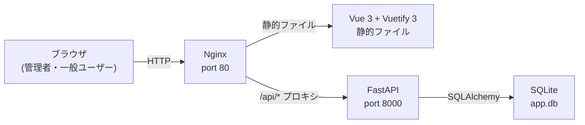
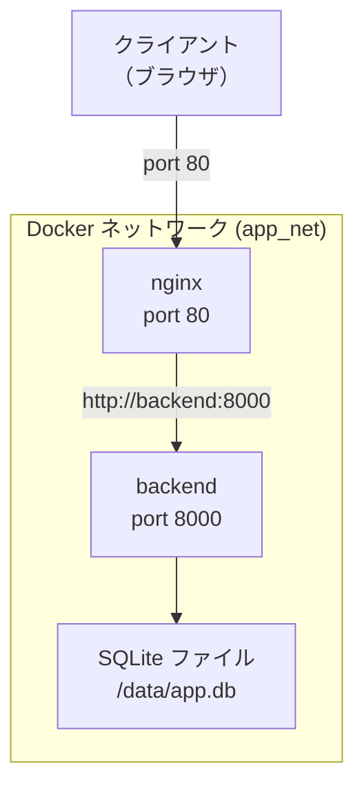
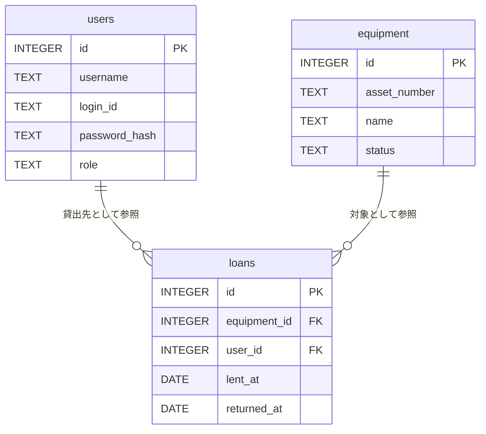
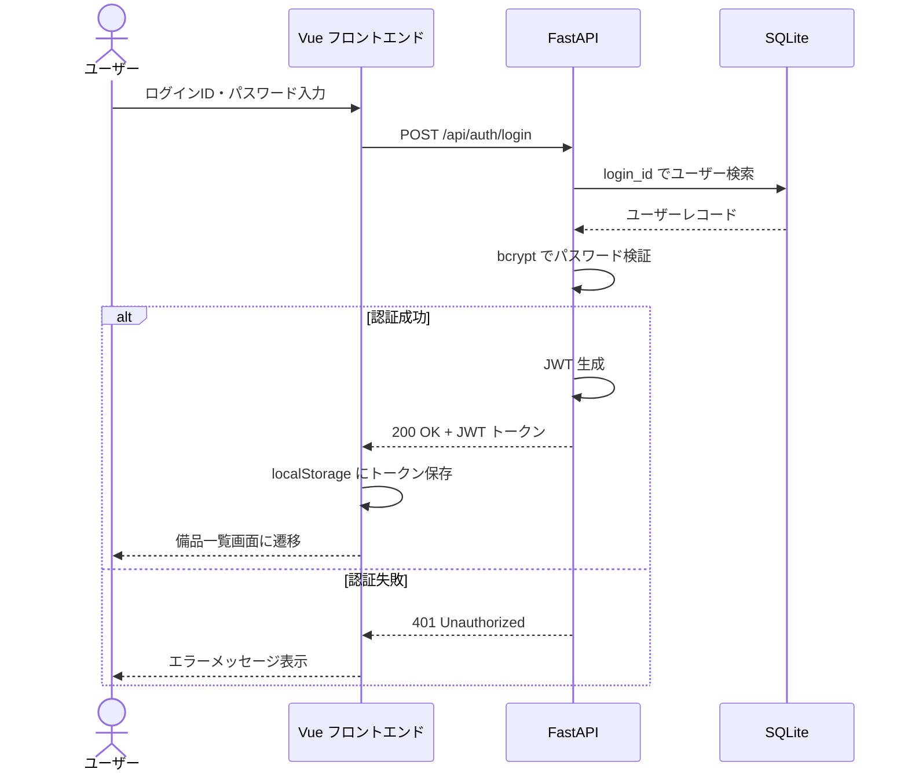
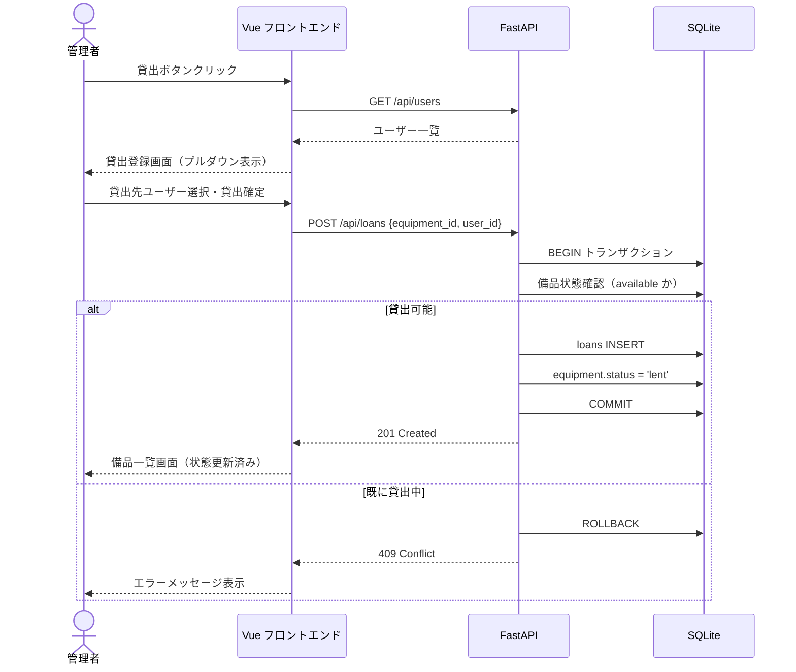
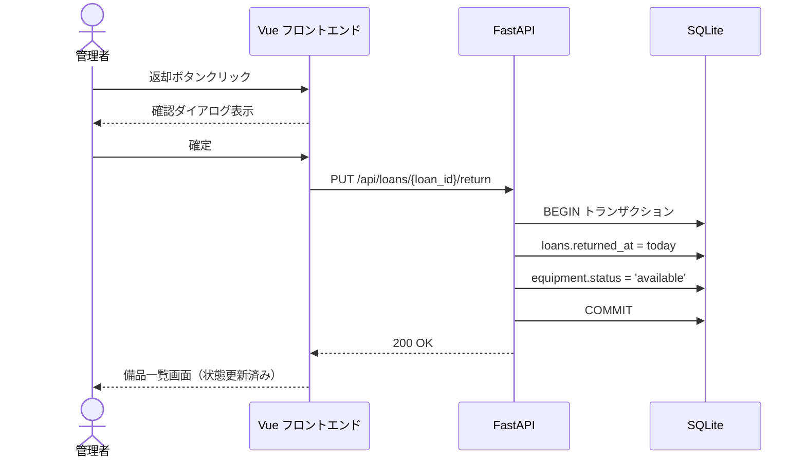
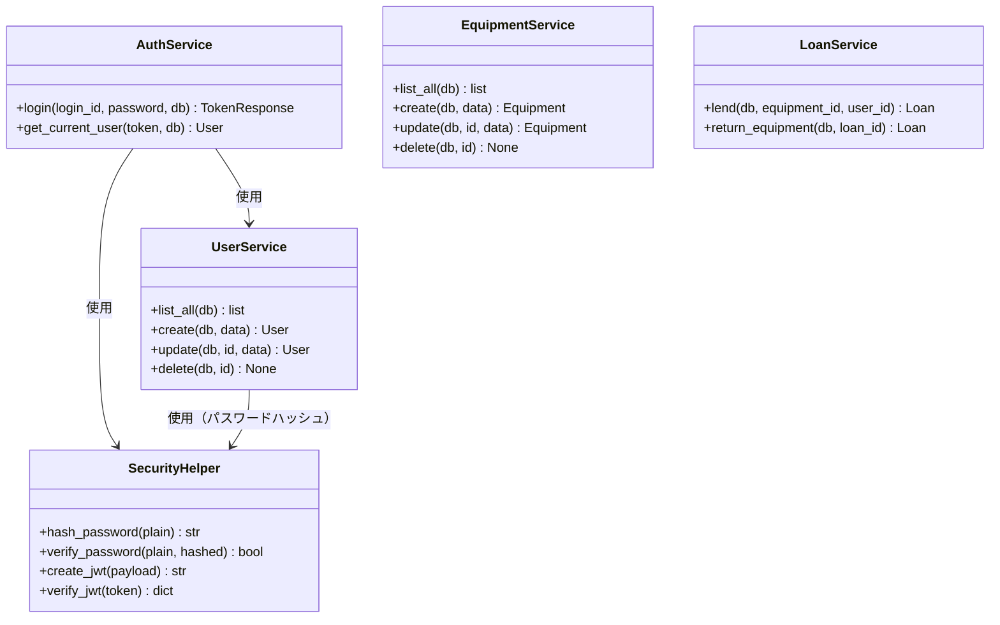
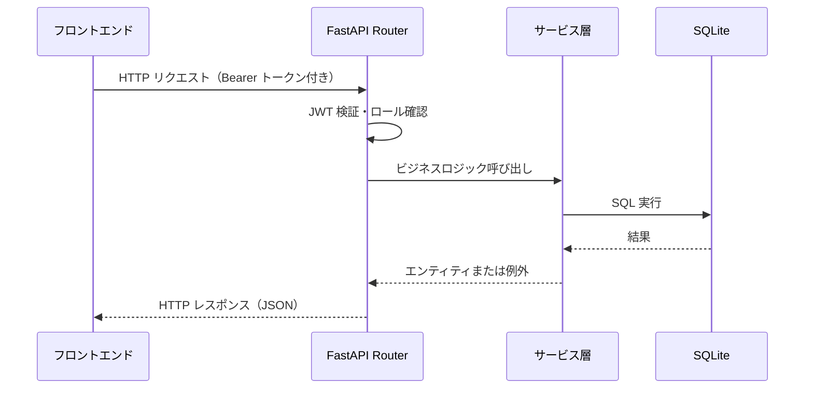

# 備品管理・貸出管理アプリ 詳細設計書

---

## 1. 言語・フレームワーク

### 選定結果

| レイヤー | 言語 / フレームワーク | バージョン | 選定理由 |
|---|---|---|---|
| バックエンド | Python / FastAPI | Python 3.12, FastAPI 0.115 | isdd 標準言語。非同期対応の軽量 Web フレームワークで REST API 実装に適する |
| フロントエンド | JavaScript / Vue 3 + Vuetify 3 | Vue 3.5, Vuetify 3.7 | 6 画面・2 役割切替・認証状態管理など複雑な画面遷移が必要なためマルチページ SPA を選択。Streamlit はシンプルな単一ページ向けのため非選択 |
| DB | SQLite | SQLite 3.45 | 利用者 10 名・備品数・貸出履歴ともに 100 万件未満かつシンプルな構造のため |
| リバースプロキシ | Nginx | 1.27 | Vue 静的ファイル配信と FastAPI へのリバースプロキシを一元管理するため |
| JWT 認証 | python-jose + passlib | - | JWT 生成/検証と bcrypt パスワードハッシュを標準ライブラリで提供 |

### フロントエンドビルドと配信方針

- Vue 3 アプリをマルチステージ Dockerfile でビルドし、成果物の静的ファイルを Nginx で配信する
- バックエンドは Nginx がリバースプロキシし、`/api/` プレフィックスで統一する

---

## 2. システム構成

### 2-1. コンポーネント一覧

| コンポーネント | 役割 | 根拠要件 |
|---|---|---|
| Nginx | 静的ファイル配信 + `/api/` へのリバースプロキシ | RQ-UI-LOGIN-SCREEN, RQ-UI-EQUIPMENT-LIST-SCREEN |
| FastAPI バックエンド | REST API 提供、認証、ビジネスロジック実行 | RQ-FT-LOGIN, RQ-FT-LIST-EQUIPMENT 他全 RQ-FT |
| SQLite | 備品・貸出記録・ユーザーデータの永続化 | RQ-DT-DB-REQUIRED |
| Vue 3 + Vuetify 3 フロントエンド | ブラウザ上で動作する SPA | RQ-UI-LOGIN-SCREEN 他全 RQ-UI |
| Playwright テストランナー | E2E テスト実行 | RQ-TS-LOGIN-SUCCESS 他全 RQ-TS |

### 2-2. システム全体構成図



### 2-3. ネットワーク構成図



---

## 3. データベース設計

SQLite を使用する。データ量が少量かつ構造が単純なため PostgreSQL は不要。

WAL（Write-Ahead Logging）モードを起動時に有効化し、同時接続時の読み取りブロックを防ぐ（RQ-NF-CONCURRENT-USERS、RQ-NF-RESPONSE-TIME 対応）。

### 3-1. テーブル設計

#### users テーブル

| カラム名 | 型 | 制約 | 説明 |
|---|---|---|---|
| id | INTEGER | PRIMARY KEY AUTOINCREMENT | 内部 ID |
| username | TEXT | NOT NULL | 表示名 |
| login_id | TEXT | NOT NULL UNIQUE | ログイン識別子 |
| password_hash | TEXT | NOT NULL | bcrypt ハッシュ |
| role | TEXT | NOT NULL CHECK(role IN ('admin','general')) | 役割 |

#### equipment テーブル

| カラム名 | 型 | 制約 | 説明 |
|---|---|---|---|
| id | INTEGER | PRIMARY KEY AUTOINCREMENT | 内部 ID |
| asset_number | TEXT | NOT NULL UNIQUE | 資産管理番号 |
| name | TEXT | NOT NULL | 備品名 |
| status | TEXT | NOT NULL DEFAULT 'available' CHECK(status IN ('available','lent')) | 貸出状態 |

#### loans テーブル

| カラム名 | 型 | 制約 | 説明 |
|---|---|---|---|
| id | INTEGER | PRIMARY KEY AUTOINCREMENT | 内部 ID |
| equipment_id | INTEGER | NOT NULL REFERENCES equipment(id) | 対象備品 |
| user_id | INTEGER | NOT NULL REFERENCES users(id) | 貸出先ユーザー |
| lent_at | DATE | NOT NULL | 貸出日 |
| returned_at | DATE | NULL | 返却日（未返却時は NULL） |

### 3-2. リレーション図



---

## 4. アーキテクチャ設計

### 4-1. 外部設計

#### UI 設計

##### 画面一覧

| DS-ID | 画面名 | 対応要件 |
|---|---|---|
| DS-MD-LOGIN-PAGE-UI-LOGIN-SCREEN | ログイン画面 | RQ-UI-LOGIN-SCREEN |
| DS-MD-EQUIPMENT-LIST-PAGE-UI-EQUIPMENT-LIST-SCREEN | 備品一覧画面 | RQ-UI-EQUIPMENT-LIST-SCREEN |
| DS-MD-EQUIPMENT-FORM-PAGE-UI-EQUIPMENT-FORM-SCREEN | 備品登録・編集画面 | RQ-UI-EQUIPMENT-FORM-SCREEN |
| DS-MD-LEND-PAGE-UI-LEND-SCREEN | 貸出登録画面 | RQ-UI-LEND-SCREEN |
| DS-MD-USER-MANAGEMENT-PAGE-UI-USER-MANAGEMENT-SCREEN | ユーザー管理画面 | RQ-UI-USER-MANAGEMENT-SCREEN |
| DS-MD-USER-FORM-PAGE-UI-USER-FORM-SCREEN | ユーザー登録・編集画面 | RQ-UI-USER-FORM-SCREEN |

##### ログイン画面（DS-MD-LOGIN-PAGE-UI-LOGIN-SCREEN）

```
┌────────────────────────────────────┐
│          備品管理システム          │
│                                    │
│  ログインID  [                  ]  │
│  パスワード  [                  ]  │
│                                    │
│           [  ログイン  ]           │
│                                    │
│  ※ 入力エラー時はフォーム下に     │
│     エラーメッセージを表示する     │
└────────────────────────────────────┘
```

##### 備品一覧画面 - 管理者ビュー（DS-MD-EQUIPMENT-LIST-PAGE-UI-EQUIPMENT-LIST-SCREEN）

```
┌──────────────────────────────────────────────────────────────────────┐
│  備品管理システム           [ユーザー管理]              [ログアウト]  │
├──────────────────────────────────────────────────────────────────────┤
│  備品一覧                                       [備品新規登録]       │
├──────────────┬────────────────┬──────────┬──────────┬────────┬──────┤
│ 資産管理番号 │ 備品名         │ 状態     │ 貸出先   │ 貸出日 │ 操作 │
├──────────────┼────────────────┼──────────┼──────────┼────────┼──────┤
│ PC-001       │ ノートPC       │ 貸出中   │ 山田太郎 │2025/05/01│[返却][編集][削除]│
│ PJ-001       │ プロジェクター │ 貸出可能 │          │        │[貸出][編集][削除]│
└──────────────┴────────────────┴──────────┴──────────┴────────┴──────┘
```

##### 備品一覧画面 - 一般ユーザービュー（DS-MD-EQUIPMENT-LIST-PAGE-UI-EQUIPMENT-LIST-SCREEN）

```
┌────────────────────────────────────────────────────────┐
│  備品管理システム                          [ログアウト] │
├────────────────────────────────────────────────────────┤
│  備品一覧                                               │
├────────────────┬────────────────┬──────────┬──────────┤
│  資産管理番号  │    備品名      │   状態   │  貸出先  │
├────────────────┼────────────────┼──────────┼──────────┤
│  PC-001        │  ノートPC     │  貸出中  │ 山田太郎 │
│  PJ-001        │プロジェクター  │ 貸出可能 │          │
└────────────────┴────────────────┴──────────┴──────────┘
```

##### 備品登録・編集画面（DS-MD-EQUIPMENT-FORM-PAGE-UI-EQUIPMENT-FORM-SCREEN）

```
┌────────────────────────────────────────┐
│  備品登録  （編集時: 備品編集）        │
│                                        │
│  資産管理番号  [                     ] │
│  備品名        [                     ] │
│                                        │
│         [保存]       [キャンセル]      │
│                                        │
│  ※ バリデーションエラーはフォーム     │
│     下に表示する                       │
└────────────────────────────────────────┘
```

##### 貸出登録画面（DS-MD-LEND-PAGE-UI-LEND-SCREEN）

```
┌──────────────────────────────────────────┐
│  貸出登録                                │
│                                          │
│  備品名:       ノートPC                  │
│  資産管理番号: PC-001                    │
│                                          │
│  貸出先 [ ▼ ユーザーを選択           ]  │
│                                          │
│       [貸出確定]      [キャンセル]       │
└──────────────────────────────────────────┘
```

##### ユーザー管理画面（DS-MD-USER-MANAGEMENT-PAGE-UI-USER-MANAGEMENT-SCREEN）

```
┌────────────────────────────────────────────────────────┐
│  ユーザー管理          [ユーザー新規登録]    [戻る]    │
├──────────────────┬─────────────┬──────────┬────────────┤
│  ユーザー名      │  ログインID │  役割    │  操作      │
├──────────────────┼─────────────┼──────────┼────────────┤
│  山田太郎        │  yamada     │  一般    │[編集][削除]│
│  システム管理者  │  admin      │  管理者  │[編集][削除]│
└──────────────────┴─────────────┴──────────┴────────────┘
```

##### ユーザー登録・編集画面（DS-MD-USER-FORM-PAGE-UI-USER-FORM-SCREEN）

```
┌──────────────────────────────────────────────┐
│  ユーザー登録  （編集時: ユーザー編集）       │
│                                              │
│  ユーザー名  [                            ]  │
│  ログインID  [                            ]  │
│  パスワード  [                            ]  │
│  役割        [ ▼ 管理者 / 一般ユーザー   ]  │
│                                              │
│         [保存]         [キャンセル]          │
└──────────────────────────────────────────────┘
```

#### 外部システム連携

外部連携なし（要件定義書 RQ-DT-INTERNAL-DATA）。

#### 外部 DB 連携

外部 DB なし（アプリ内蔵 SQLite のみ使用）。

### 4-2. 内部設計

#### 処理フロー図

##### ログインフロー



##### 備品貸出フロー



##### 備品返却フロー



---

## 5. クラス設計

### 5-1. 全クラス一覧と役割

| DS-ID | クラス名 | 役割 | 対応要件 | S | O | L | I | D |
|---|---|---|---|---|---|---|---|---|
| DS-CL-AUTH-SERVICE-FT-LOGIN | AuthService | ログイン認証、JWT 発行 | RQ-FT-LOGIN | ✅ | ✅ | - | ✅ | ✅ |
| DS-CL-EQUIPMENT-SERVICE-FT-LIST-EQUIPMENT | EquipmentService | 備品 CRUD | RQ-FT-LIST-EQUIPMENT | ✅ | ✅ | - | ✅ | ✅ |
| DS-CL-LOAN-SERVICE-FT-LEND-EQUIPMENT | LoanService | 貸出・返却業務ロジック | RQ-FT-LEND-EQUIPMENT | ✅ | ✅ | - | ✅ | ✅ |
| DS-CL-USER-SERVICE-FT-CREATE-USER | UserService | ユーザー CRUD | RQ-FT-CREATE-USER | ✅ | ✅ | - | ✅ | ✅ |

### 5-2. クラス責務・主要属性・主要メソッド

#### DS-CL-AUTH-SERVICE-FT-LOGIN : AuthService

- **責務**：ログインID・パスワードの検証と JWT トークンの生成
- **主要メソッド**：
  - `login(login_id, password, db)` → TokenResponse：パスワード照合後 JWT を返す
  - `get_current_user(token, db)` → User：トークンからユーザー情報を取得する

#### DS-CL-EQUIPMENT-SERVICE-FT-LIST-EQUIPMENT : EquipmentService

- **責務**：備品の登録・参照・更新・削除
- **主要メソッド**：
  - `list_all(db)` → list[Equipment]：全備品を返す
  - `create(db, data)` → Equipment：新規備品を登録する。重複資産管理番号は 409 Conflict
  - `update(db, id, data)` → Equipment：指定 ID の備品を更新する。未存在は 404 Not Found
  - `delete(db, id)`：指定 ID の備品を削除する。貸出中は 409 Conflict

#### DS-CL-LOAN-SERVICE-FT-LEND-EQUIPMENT : LoanService

- **責務**：貸出登録と返却登録のトランザクション管理
- **主要メソッド**：
  - `lend(db, equipment_id, user_id)` → Loan：貸出記録を INSERT し備品ステータスを 'lent' に更新する。トランザクションで実行
  - `return_equipment(db, loan_id)` → Loan：loans.returned_at を記録し備品ステータスを 'available' に戻す。トランザクションで実行

#### DS-CL-USER-SERVICE-FT-CREATE-USER : UserService

- **責務**：ユーザーの登録・参照・更新・削除
- **主要メソッド**：
  - `list_all(db)` → list[User]：全ユーザーを返す
  - `create(db, data)` → User：ユーザーを登録する。重複 login_id は 409 Conflict。パスワードは bcrypt でハッシュ化してから保存
  - `update(db, id, data)` → User：指定 ID のユーザーを更新する
  - `delete(db, id)`：指定 ID のユーザーを削除する。貸出中備品を持つ場合は 409 Conflict

### 5-3. クラス図



### 5-4. システム内メッセージ一覧と役割

| メッセージ名 | 送信元 | 受信先 | 内容 |
|---|---|---|---|
| TokenResponse | AuthService | フロントエンド | JWT アクセストークンと役割 |
| EquipmentList | EquipmentService | フロントエンド | 全備品（貸出中の場合は貸出先ユーザー名・貸出日を含む） |
| LoanRecord | LoanService | フロントエンド | 貸出記録（equipment_id, user_id, lent_at, returned_at） |
| UserList | UserService | フロントエンド | 全ユーザー（password_hash を除く） |
| ErrorResponse | 各サービス | フロントエンド | HTTP ステータスとエラーメッセージ |

### 5-5. メッセージフロー図



---

## 6. その他設計

### 6-1. エラーハンドリング設計

| エラー種別 | HTTP ステータス | 発生条件 | レスポンス例 |
|---|---|---|---|
| 認証失敗 | 401 Unauthorized | ログインID/パスワード不一致、トークン未付与 | `{"detail": "認証に失敗しました"}` |
| 権限不足 | 403 Forbidden | 一般ユーザーが管理者専用エンドポイントにアクセス | `{"detail": "管理者権限が必要です"}` |
| リソース未存在 | 404 Not Found | 指定 ID の備品・ユーザーが存在しない | `{"detail": "備品が見つかりません"}` |
| 業務制約違反 | 409 Conflict | 貸出中備品の削除、貸出中備品を持つユーザーの削除、重複 asset_number/login_id | `{"detail": "貸出中の備品は削除できません"}` |
| バリデーションエラー | 422 Unprocessable Entity | 必須フィールド欠損、型不一致 | FastAPI デフォルト形式 |
| サーバーエラー | 500 Internal Server Error | DB 接続エラー等の予期しないエラー | `{"detail": "サーバーエラーが発生しました"}` |

すべてのエラーはフロントエンドが受け取り、画面上に日本語メッセージとして表示する。

### 6-2. セキュリティ設計

| DS-ID | 設計項目 | 内容 | 対応要件 |
|---|---|---|---|
| DS-FN-HASH-PASSWORD-NF-SECURITY-PASSWORD | パスワードハッシュ化 | passlib の bcrypt でハッシュ化し DB に保存。平文保存は禁止 | RQ-NF-SECURITY-PASSWORD |
| DS-FN-VERIFY-JWT-NF-SECURITY-ROLE | JWT 検証 | 全 API エンドポイントで Bearer トークンを検証。有効期限は 8 時間 | RQ-NF-SECURITY-ROLE |
| DS-FN-REQUIRE-ADMIN-NF-SECURITY-ROLE | 管理者ロール確認 | 管理者専用エンドポイントに FastAPI Depends で役割チェックを適用 | RQ-NF-SECURITY-ROLE |
| DS-FN-LOGIN-FT-LOGIN | ログイン処理 | login_id + password でユーザーを検索し bcrypt で照合。成功時 JWT を発行 | RQ-FT-LOGIN |
| DS-FN-CONFIGURE-DB-NF-CONCURRENT-USERS | DB 設定 | SQLite WAL モードを起動時に有効化し、最大 10 名の同時接続による読み取りブロックを防ぐ | RQ-NF-CONCURRENT-USERS |
| DS-FN-ASYNC-API-NF-RESPONSE-TIME | 応答時間保証 | FastAPI の非同期処理と SQLite WAL モードの組合せにより、全エンドポイントの応答時間を 3 秒以内に抑える | RQ-NF-RESPONSE-TIME |
| DS-FN-SEED-INITIAL-USER-FT-CREATE-USER | 初期管理者登録 | DB 初期化時に管理者アカウント（login_id: admin）を 1 件シードする | RQ-FT-CREATE-USER |
| DS-FN-CHECK-EQUIPMENT-DELETABLE-FT-DELETE-EQUIPMENT | 備品削除可否チェック | status が 'lent' の場合は 409 Conflict を返す | RQ-FT-DELETE-EQUIPMENT |
| DS-FN-CHECK-USER-DELETABLE-FT-DELETE-USER | ユーザー削除可否チェック | returned_at が NULL の貸出記録が存在するユーザーは 409 Conflict を返す | RQ-FT-DELETE-USER |
| DS-FN-LEND-FT-LEND-EQUIPMENT | 貸出トランザクション | loans INSERT と equipment.status 更新をトランザクションで実行 | RQ-FT-LEND-EQUIPMENT |

#### トランザクション・排他制御

- **トランザクション境界**：貸出（loans INSERT + equipment UPDATE）と返却（loans UPDATE + equipment UPDATE）の各操作を 1 トランザクションで実行する
- **ロールバック条件**：INSERT/UPDATE のいずれかが失敗した場合にロールバックする
- **排他制御**：SQLite WAL モードにより、同時読み取りは許容し、書き込みはシリアライズする。同時書き込み競合が発生した場合は SQLAlchemy が例外を上げ、500 エラーとして返す

---

## 7. コード設計

### 7-1. ディレクトリ構成

```
project/
├── backend/
│   ├── app/
│   │   ├── api/
│   │   │   └── v1/
│   │   ├── core/
│   │   ├── db/
│   │   ├── models/
│   │   ├── schemas/
│   │   └── services/
│   └── tests/
│       ├── unit/
│       └── integration/
├── frontend/
│   └── src/
│       ├── api/
│       ├── pages/
│       ├── router/
│       └── stores/
├── e2e/
│   └── tests/
├── nginx/
└── docker-compose.yml
```

### 7-2. ファイル一覧・役割・設計 ID

#### バックエンド

| ファイル名 | 役割 | 主要クラス / 関数 | 設計 ID |
|---|---|---|---|
| `app/main.py` | FastAPI アプリ初期化、ルーター登録、DB 初期化呼び出し | - | DS-SC-DB-INIT-DT-DB-REQUIRED |
| `app/core/security.py` | JWT 生成・検証、bcrypt ハッシュ | `SecurityHelper` | DS-FN-HASH-PASSWORD-NF-SECURITY-PASSWORD, DS-FN-VERIFY-JWT-NF-SECURITY-ROLE |
| `app/db/database.py` | SQLAlchemy セッション管理、WAL 設定 | - | DS-FN-CONFIGURE-DB-NF-CONCURRENT-USERS, DS-SC-INTERNAL-DATA-DT-INTERNAL-DATA |
| `app/db/seed.py` | 初期管理者アカウントのシード | - | DS-FN-SEED-INITIAL-USER-FT-CREATE-USER |
| `app/models/equipment.py` | equipment テーブルの SQLAlchemy モデル | `Equipment` | DS-SC-EQUIPMENT-DT-EQUIPMENT-ENTITY |
| `app/models/loan.py` | loans テーブルの SQLAlchemy モデル | `Loan` | DS-SC-LOAN-DT-LOAN-ENTITY |
| `app/models/user.py` | users テーブルの SQLAlchemy モデル | `User` | DS-SC-USER-DT-USER-ENTITY |
| `app/schemas/equipment.py` | 備品の Pydantic スキーマ（Create/Update/Response） | - | DS-SC-EQUIPMENT-DT-EQUIPMENT-ENTITY |
| `app/schemas/loan.py` | 貸出記録の Pydantic スキーマ | - | DS-SC-LOAN-DT-LOAN-ENTITY |
| `app/schemas/user.py` | ユーザーの Pydantic スキーマ（Create/Update/Response） | - | DS-SC-USER-DT-USER-ENTITY |
| `app/services/auth_service.py` | 認証サービス | `AuthService` | DS-CL-AUTH-SERVICE-FT-LOGIN |
| `app/services/equipment_service.py` | 備品サービス | `EquipmentService` | DS-CL-EQUIPMENT-SERVICE-FT-LIST-EQUIPMENT |
| `app/services/loan_service.py` | 貸出サービス | `LoanService` | DS-CL-LOAN-SERVICE-FT-LEND-EQUIPMENT |
| `app/services/user_service.py` | ユーザーサービス | `UserService` | DS-CL-USER-SERVICE-FT-CREATE-USER |
| `app/api/deps.py` | 依存注入（認証チェック、管理者チェック） | `get_current_user`, `require_admin` | DS-FN-REQUIRE-ADMIN-NF-SECURITY-ROLE |
| `app/api/v1/auth.py` | 認証エンドポイント | - | DS-IF-AUTH-LOGIN-FT-LOGIN, DS-IF-AUTH-LOGOUT-FT-LOGOUT |
| `app/api/v1/equipment.py` | 備品エンドポイント | - | DS-IF-LIST-EQUIPMENT-FT-LIST-EQUIPMENT, DS-IF-CREATE-EQUIPMENT-FT-CREATE-EQUIPMENT, DS-IF-UPDATE-EQUIPMENT-FT-EDIT-EQUIPMENT, DS-IF-DELETE-EQUIPMENT-FT-DELETE-EQUIPMENT |
| `app/api/v1/loans.py` | 貸出エンドポイント | - | DS-IF-LEND-EQUIPMENT-FT-LEND-EQUIPMENT, DS-IF-RETURN-EQUIPMENT-FT-RETURN-EQUIPMENT |
| `app/api/v1/users.py` | ユーザーエンドポイント | - | DS-IF-LIST-USERS-FT-DELETE-USER, DS-IF-CREATE-USER-FT-CREATE-USER, DS-IF-UPDATE-USER-FT-EDIT-USER, DS-IF-DELETE-USER-FT-DELETE-USER |

#### フロントエンド

| ファイル名 | 役割 | 設計 ID |
|---|---|---|
| `src/api/client.js` | Axios インスタンス（Bearer トークン自動付与） | DS-MD-API-CLIENT-FT-LIST-EQUIPMENT |
| `src/stores/auth.js` | Pinia 認証ストア（トークン管理・ログイン・ログアウト） | DS-MD-AUTH-STORE-FT-LOGIN |
| `src/router/index.js` | Vue Router（ログイン必須ガード、管理者ガード） | DS-FN-REQUIRE-ADMIN-NF-SECURITY-ROLE |
| `src/pages/LoginPage.vue` | ログイン画面コンポーネント | DS-MD-LOGIN-PAGE-UI-LOGIN-SCREEN |
| `src/pages/EquipmentListPage.vue` | 備品一覧画面（管理者・一般ユーザー共通。役割に応じて操作ボタンを切替表示） | DS-MD-EQUIPMENT-LIST-PAGE-UI-EQUIPMENT-LIST-SCREEN |
| `src/pages/EquipmentFormPage.vue` | 備品登録・編集画面（新規と編集を props で切替） | DS-MD-EQUIPMENT-FORM-PAGE-UI-EQUIPMENT-FORM-SCREEN |
| `src/pages/LendPage.vue` | 貸出登録画面（ユーザー一覧プルダウン） | DS-MD-LEND-PAGE-UI-LEND-SCREEN |
| `src/pages/UserManagementPage.vue` | ユーザー管理画面（管理者のみ） | DS-MD-USER-MANAGEMENT-PAGE-UI-USER-MANAGEMENT-SCREEN |
| `src/pages/UserFormPage.vue` | ユーザー登録・編集画面（新規と編集を props で切替） | DS-MD-USER-FORM-PAGE-UI-USER-FORM-SCREEN |

#### データ保持方針

| DS-ID | 内容 | 対応要件 |
|---|---|---|
| DS-SC-INTERNAL-DATA-DT-INTERNAL-DATA | 全データを SQLite 内に保持。外部への同期・エクスポートは設計しない | RQ-DT-INTERNAL-DATA |
| DS-SC-NO-AUTO-DELETE-DT-RETENTION | loans, equipment, users の各テーブルに自動削除バッチや TTL 設定は一切実装しない | RQ-DT-RETENTION |

### 7-3. コーディング規約

#### バックエンド（Python）

| 項目 | 規約 |
|---|---|
| フォーマッター | Black（行幅 88 文字） |
| リンター | Ruff |
| 型ヒント | 全関数の引数・戻り値に型ヒントを必須とする |
| 変数名 | スネークケース（例: `loan_id`） |
| クラス名 | パスカルケース（例: `EquipmentService`） |
| コメント | 自明な処理へのコメントは不要。WHY が非自明な制約のみ記述 |

#### フロントエンド（JavaScript）

| 項目 | 規約 |
|---|---|
| フォーマッター | Prettier |
| リンター | ESLint (Vue 公式設定) |
| コンポーネント名 | パスカルケース（例: `EquipmentListPage.vue`） |
| 変数名 | キャメルケース（例: `equipmentId`） |
| API 呼び出し | 全て `src/api/client.js` 経由で行う。直接 fetch/axios 呼び出しを禁止 |

---

## 8. テスト設計

### 8-1. テスト種別と内容

| テスト種別 | 目的 | ツール |
|---|---|---|
| 単体テスト | 各サービスクラスのビジネスロジックを検証する | pytest + pytest-mock |
| 結合テスト | FastAPI の API エンドポイントを TestClient で検証する | pytest + FastAPI TestClient + SQLite（テスト用） |
| 総合テスト | サービス間の連携（貸出→返却フロー等）を検証する | pytest + FastAPI TestClient |
| E2E テスト | ブラウザ操作を通じた全画面遷移・ユーザーフローを検証する | Playwright（詳細は第 11 章） |

### 8-2. 単体テストケース

#### AuthService 単体テスト

| テスト名 | 前提条件 | 検証内容 |
|---|---|---|
| test_login_success | 正しい login_id と password | JWT トークンが返ること |
| test_login_fail_wrong_password | 正しい login_id・誤った password | 401 例外が発生すること |
| test_login_fail_user_not_found | 存在しない login_id | 401 例外が発生すること |

#### EquipmentService 単体テスト

| テスト名 | 前提条件 | 検証内容 |
|---|---|---|
| test_list_all | 備品 2 件登録済み | 全件返ること |
| test_create_success | 一意の asset_number | 備品が作成されること |
| test_create_duplicate_asset_number | 既存と同じ asset_number | 409 例外が発生すること |
| test_update_success | 存在する備品 ID | 更新後の備品が返ること |
| test_update_not_found | 存在しない ID | 404 例外が発生すること |
| test_delete_available | status = 'available' の備品 | 削除されること |
| test_delete_lent | status = 'lent' の備品 | 409 例外が発生すること |

#### LoanService 単体テスト

| テスト名 | 前提条件 | 検証内容 |
|---|---|---|
| test_lend_success | available 状態の備品 | 貸出記録が作成され status が lent になること |
| test_lend_already_lent | lent 状態の備品 | 409 例外が発生すること |
| test_return_success | 未返却の貸出記録 | returned_at が記録され status が available になること |
| test_return_not_found | 存在しない loan_id | 404 例外が発生すること |

#### UserService 単体テスト

| テスト名 | 前提条件 | 検証内容 |
|---|---|---|
| test_list_all | ユーザー 2 件登録済み | 全件返ること |
| test_create_success | 一意の login_id | ユーザーが作成されパスワードがハッシュ化されること |
| test_create_duplicate_login_id | 既存と同じ login_id | 409 例外が発生すること |
| test_delete_no_active_loans | 未返却貸出なし | 削除されること |
| test_delete_with_active_loans | 未返却貸出あり | 409 例外が発生すること |

### 8-3. 結合テストケース

| テスト名 | エンドポイント | 検証内容 |
|---|---|---|
| test_login_api_success | POST /api/auth/login | 200 + JWT トークン返却 |
| test_login_api_fail | POST /api/auth/login | 401 返却 |
| test_get_equipment_no_auth | GET /api/equipment | 401 返却 |
| test_get_equipment_with_auth | GET /api/equipment | 200 + 備品リスト返却 |
| test_create_equipment_admin | POST /api/equipment（管理者トークン） | 201 返却 |
| test_create_equipment_general | POST /api/equipment（一般ユーザートークン） | 403 返却 |
| test_delete_lent_equipment | DELETE /api/equipment/{id}（貸出中） | 409 返却 |
| test_lend_equipment | POST /api/loans | 201 + 貸出記録返却 |
| test_return_equipment | PUT /api/loans/{id}/return | 200 + 更新済み記録返却 |
| test_delete_user_with_active_loan | DELETE /api/users/{id} | 409 返却 |

### 8-4. 総合テストケース

| テスト名 | 検証内容 |
|---|---|
| test_full_equipment_lifecycle | 備品登録 → 貸出 → 返却 → 削除の全フローが正常に完結する |
| test_full_user_lifecycle | ユーザー登録 → 貸出先として使用 → 返却後に削除できる |

---

## 9. 運用設計

- 起動方式は `docker compose up` に統一する
- DB（SQLite ファイル）と初期管理者ユーザーの初期化は、バックエンドコンテナ起動時に自動実行する（`app/db/seed.py` 呼び出し）
- 起動手順・初期ログイン情報（login_id: admin）・操作説明を `README.md` に記載する

### docker-compose.yml サービス構成

| サービス名 | イメージ | 役割 |
|---|---|---|
| nginx | nginx:1.27-alpine | 静的配信 + リバースプロキシ |
| backend | プロジェクト独自ビルド | FastAPI + uvicorn |
| test_playwright | mcr.microsoft.com/playwright:v1.59.0 | E2E テスト実行（profile: test） |

通常起動（`docker compose up`）では test_playwright は起動しない。

---

## 10. ログ・監視・アラート設計

ログの設計は必須ではないため、ログの種類と内容の記述は行わない（アプリフレームワークの標準エラーログのみを使用する）。

監視・アラートの設計は必須ではないため、監視・アラートの内容と対応方法の記述は行わない。

---

## 11. E2E テスト設計

### 11-1. 設計要件

- 要件書のテスト用利用シナリオ（RQ-TS-*）を 100% 網羅する
- Playwright を使用し、`e2e/tests/` 配下に配置する
- 外部連携がないため、モード切替は不要。単一モードで実行する

### 11-2. docker compose への test_playwright サービス

```yaml
test_playwright:
  image: mcr.microsoft.com/playwright:v1.59.0
  profiles: [test]
  volumes:
    - ./e2e:/e2e
  working_dir: /e2e
  depends_on:
    - nginx
```

### 11-3. E2E 実行コマンド

```
docker compose run --rm test_playwright sh -c "npm install && npx playwright test"
```

### 11-4. E2E テストシナリオ一覧

| DS-ID | RQ-TS-ID | テスト目的 | 前提条件 | 手順（Playwright） | 期待結果 |
|---|---|---|---|---|---|
| DS-MD-E2E-LOGIN-SUCCESS-TS-LOGIN-SUCCESS | RQ-TS-LOGIN-SUCCESS | ログイン正常系 | 管理者アカウント登録済み | ログインID・パスワードを入力し「ログイン」ボタンをクリック | 備品一覧ページに遷移すること |
| DS-MD-E2E-LOGIN-FAIL-TS-LOGIN-FAIL | RQ-TS-LOGIN-FAIL | ログイン異常系 | 管理者アカウント登録済み | 誤ったパスワードで「ログイン」をクリック | エラーメッセージが表示され遷移しないこと |
| DS-MD-E2E-CREATE-EQUIPMENT-TS-CREATE-EQUIPMENT | RQ-TS-CREATE-EQUIPMENT | 備品登録 | 管理者でログイン済み | 「備品新規登録」から資産管理番号・備品名を入力して保存 | 新備品が「貸出可能」として一覧に表示されること |
| DS-MD-E2E-EDIT-EQUIPMENT-TS-EDIT-EQUIPMENT | RQ-TS-EDIT-EQUIPMENT | 備品編集 | 管理者でログイン済み、備品1件登録済み | 編集ボタンから備品名を変更して保存 | 変更後の備品名が一覧に表示されること |
| DS-MD-E2E-DELETE-EQUIPMENT-OK-TS-DELETE-EQUIPMENT-OK | RQ-TS-DELETE-EQUIPMENT-OK | 貸出可能な備品の削除 | 管理者でログイン済み、貸出可能な備品が存在 | 削除ボタンをクリックして確定 | 対象備品が一覧から消えること |
| DS-MD-E2E-DELETE-EQUIPMENT-NG-TS-DELETE-EQUIPMENT-NG | RQ-TS-DELETE-EQUIPMENT-NG | 貸出中の備品削除不可 | 管理者でログイン済み、貸出中の備品が存在 | 貸出中備品の削除ボタンをクリック | エラーメッセージが表示され削除されないこと |
| DS-MD-E2E-LEND-EQUIPMENT-TS-LEND-EQUIPMENT | RQ-TS-LEND-EQUIPMENT | 備品貸出 | 管理者でログイン済み、貸出可能な備品・一般ユーザー登録済み | 「貸出」ボタンからユーザーを選択して確定 | 状態が「貸出中」に変わり貸出先・貸出日が表示されること |
| DS-MD-E2E-RETURN-EQUIPMENT-TS-RETURN-EQUIPMENT | RQ-TS-RETURN-EQUIPMENT | 備品返却 | 管理者でログイン済み、貸出中の備品が存在 | 「返却」ボタンをクリックして確定 | 状態が「貸出可能」に変わること |
| DS-MD-E2E-GENERAL-USER-VIEW-TS-GENERAL-USER-VIEW | RQ-TS-GENERAL-USER-VIEW | 一般ユーザーの閲覧制限確認 | 一般ユーザーでログイン済み | 備品一覧画面を開く | 資産管理番号・備品名・状態のみ表示され操作ボタンが存在しないこと |
| DS-MD-E2E-CREATE-USER-TS-CREATE-USER | RQ-TS-CREATE-USER | ユーザー登録 | 管理者でログイン済み | ユーザー管理画面から新規ユーザーを登録 | 新ユーザーが一覧に表示されること |
| DS-MD-E2E-DELETE-USER-NG-TS-DELETE-USER-NG | RQ-TS-DELETE-USER-NG | 貸出中備品ありユーザーの削除不可 | 管理者でログイン済み、貸出中備品を持つユーザーが存在 | 対象ユーザーの削除ボタンをクリック | エラーメッセージが表示され削除されないこと |
| DS-MD-E2E-DELETE-USER-OK-TS-DELETE-USER-OK | RQ-TS-DELETE-USER-OK | 貸出中備品なしユーザーの削除 | 管理者でログイン済み、貸出中備品のないユーザーが存在 | 対象ユーザーの削除ボタンをクリックして確定 | 対象ユーザーが一覧から消えること |

### 11-5. E2E 運用設計

- ファイル配置：`e2e/tests/` 配下にシナリオ別の `.spec.js` ファイルを配置する
- テスト実行時の URL：`http://nginx/` をベースとする（docker compose 内サービス名）
- テスト失敗時は原因を修正して再実行し、全件成功まで継続する

---

## RQ-DS 対応表（整合性チェック用）

| DS-ID | 対応 RQ-ID |
|---|---|
| DS-IF-AUTH-LOGIN-FT-LOGIN | RQ-FT-LOGIN |
| DS-IF-AUTH-LOGOUT-FT-LOGOUT | RQ-FT-LOGOUT |
| DS-IF-LIST-EQUIPMENT-FT-LIST-EQUIPMENT | RQ-FT-LIST-EQUIPMENT |
| DS-IF-CREATE-EQUIPMENT-FT-CREATE-EQUIPMENT | RQ-FT-CREATE-EQUIPMENT |
| DS-IF-UPDATE-EQUIPMENT-FT-EDIT-EQUIPMENT | RQ-FT-EDIT-EQUIPMENT |
| DS-IF-DELETE-EQUIPMENT-FT-DELETE-EQUIPMENT | RQ-FT-DELETE-EQUIPMENT |
| DS-IF-LEND-EQUIPMENT-FT-LEND-EQUIPMENT | RQ-FT-LEND-EQUIPMENT |
| DS-IF-RETURN-EQUIPMENT-FT-RETURN-EQUIPMENT | RQ-FT-RETURN-EQUIPMENT |
| DS-IF-LIST-USERS-FT-DELETE-USER | RQ-FT-DELETE-USER |
| DS-IF-CREATE-USER-FT-CREATE-USER | RQ-FT-CREATE-USER |
| DS-IF-UPDATE-USER-FT-EDIT-USER | RQ-FT-EDIT-USER |
| DS-IF-DELETE-USER-FT-DELETE-USER | RQ-FT-DELETE-USER |
| DS-CL-AUTH-SERVICE-FT-LOGIN | RQ-FT-LOGIN |
| DS-CL-EQUIPMENT-SERVICE-FT-LIST-EQUIPMENT | RQ-FT-LIST-EQUIPMENT |
| DS-CL-LOAN-SERVICE-FT-LEND-EQUIPMENT | RQ-FT-LEND-EQUIPMENT |
| DS-CL-USER-SERVICE-FT-CREATE-USER | RQ-FT-CREATE-USER |
| DS-FN-HASH-PASSWORD-NF-SECURITY-PASSWORD | RQ-NF-SECURITY-PASSWORD |
| DS-FN-VERIFY-JWT-NF-SECURITY-ROLE | RQ-NF-SECURITY-ROLE |
| DS-FN-REQUIRE-ADMIN-NF-SECURITY-ROLE | RQ-NF-SECURITY-ROLE |
| DS-FN-LOGIN-FT-LOGIN | RQ-FT-LOGIN |
| DS-FN-CONFIGURE-DB-NF-CONCURRENT-USERS | RQ-NF-CONCURRENT-USERS |
| DS-FN-ASYNC-API-NF-RESPONSE-TIME | RQ-NF-RESPONSE-TIME |
| DS-FN-SEED-INITIAL-USER-FT-CREATE-USER | RQ-FT-CREATE-USER |
| DS-FN-CHECK-EQUIPMENT-DELETABLE-FT-DELETE-EQUIPMENT | RQ-FT-DELETE-EQUIPMENT |
| DS-FN-CHECK-USER-DELETABLE-FT-DELETE-USER | RQ-FT-DELETE-USER |
| DS-FN-LEND-FT-LEND-EQUIPMENT | RQ-FT-LEND-EQUIPMENT |
| DS-SC-EQUIPMENT-DT-EQUIPMENT-ENTITY | RQ-DT-EQUIPMENT-ENTITY |
| DS-SC-LOAN-DT-LOAN-ENTITY | RQ-DT-LOAN-ENTITY |
| DS-SC-USER-DT-USER-ENTITY | RQ-DT-USER-ENTITY |
| DS-SC-DB-INIT-DT-DB-REQUIRED | RQ-DT-DB-REQUIRED |
| DS-SC-INTERNAL-DATA-DT-INTERNAL-DATA | RQ-DT-INTERNAL-DATA |
| DS-SC-NO-AUTO-DELETE-DT-RETENTION | RQ-DT-RETENTION |
| DS-MD-LOGIN-PAGE-UI-LOGIN-SCREEN | RQ-UI-LOGIN-SCREEN |
| DS-MD-EQUIPMENT-LIST-PAGE-UI-EQUIPMENT-LIST-SCREEN | RQ-UI-EQUIPMENT-LIST-SCREEN |
| DS-MD-EQUIPMENT-FORM-PAGE-UI-EQUIPMENT-FORM-SCREEN | RQ-UI-EQUIPMENT-FORM-SCREEN |
| DS-MD-LEND-PAGE-UI-LEND-SCREEN | RQ-UI-LEND-SCREEN |
| DS-MD-USER-MANAGEMENT-PAGE-UI-USER-MANAGEMENT-SCREEN | RQ-UI-USER-MANAGEMENT-SCREEN |
| DS-MD-USER-FORM-PAGE-UI-USER-FORM-SCREEN | RQ-UI-USER-FORM-SCREEN |
| DS-MD-AUTH-STORE-FT-LOGIN | RQ-FT-LOGIN |
| DS-MD-API-CLIENT-FT-LIST-EQUIPMENT | RQ-FT-LIST-EQUIPMENT |
| DS-MD-E2E-LOGIN-SUCCESS-TS-LOGIN-SUCCESS | RQ-TS-LOGIN-SUCCESS |
| DS-MD-E2E-LOGIN-FAIL-TS-LOGIN-FAIL | RQ-TS-LOGIN-FAIL |
| DS-MD-E2E-CREATE-EQUIPMENT-TS-CREATE-EQUIPMENT | RQ-TS-CREATE-EQUIPMENT |
| DS-MD-E2E-EDIT-EQUIPMENT-TS-EDIT-EQUIPMENT | RQ-TS-EDIT-EQUIPMENT |
| DS-MD-E2E-DELETE-EQUIPMENT-OK-TS-DELETE-EQUIPMENT-OK | RQ-TS-DELETE-EQUIPMENT-OK |
| DS-MD-E2E-DELETE-EQUIPMENT-NG-TS-DELETE-EQUIPMENT-NG | RQ-TS-DELETE-EQUIPMENT-NG |
| DS-MD-E2E-LEND-EQUIPMENT-TS-LEND-EQUIPMENT | RQ-TS-LEND-EQUIPMENT |
| DS-MD-E2E-RETURN-EQUIPMENT-TS-RETURN-EQUIPMENT | RQ-TS-RETURN-EQUIPMENT |
| DS-MD-E2E-GENERAL-USER-VIEW-TS-GENERAL-USER-VIEW | RQ-TS-GENERAL-USER-VIEW |
| DS-MD-E2E-CREATE-USER-TS-CREATE-USER | RQ-TS-CREATE-USER |
| DS-MD-E2E-DELETE-USER-NG-TS-DELETE-USER-NG | RQ-TS-DELETE-USER-NG |
| DS-MD-E2E-DELETE-USER-OK-TS-DELETE-USER-OK | RQ-TS-DELETE-USER-OK |
