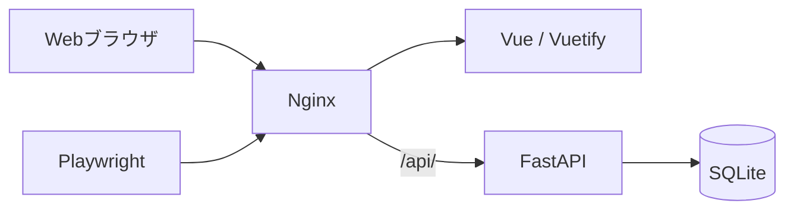
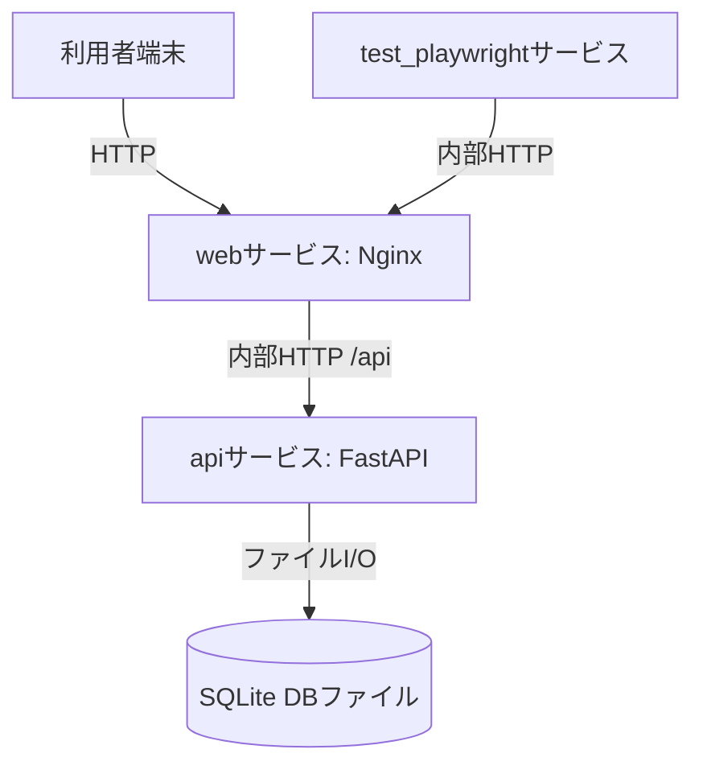
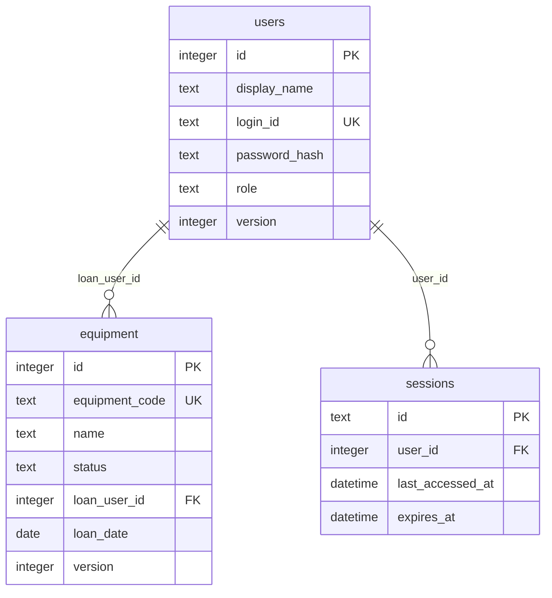
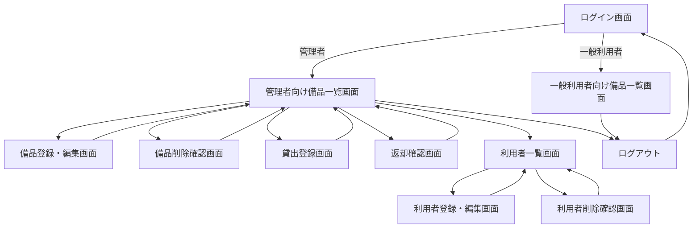
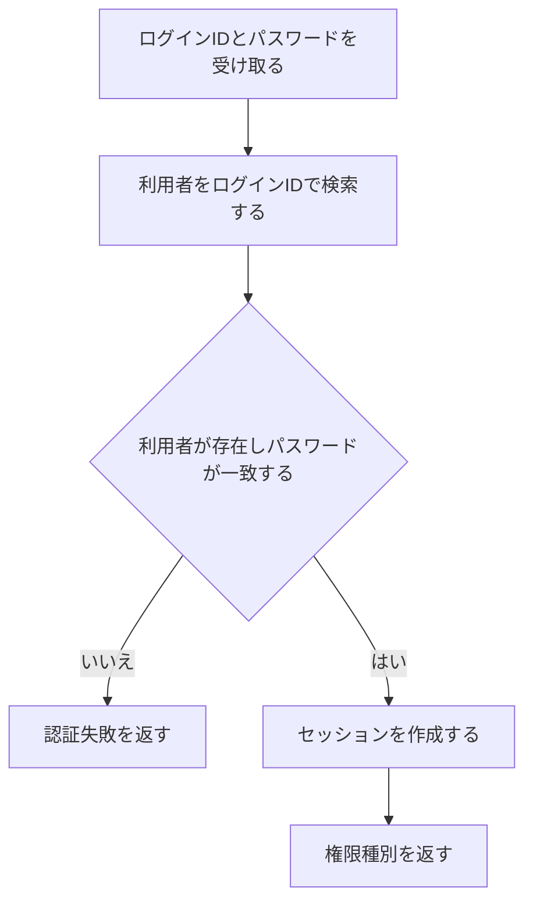
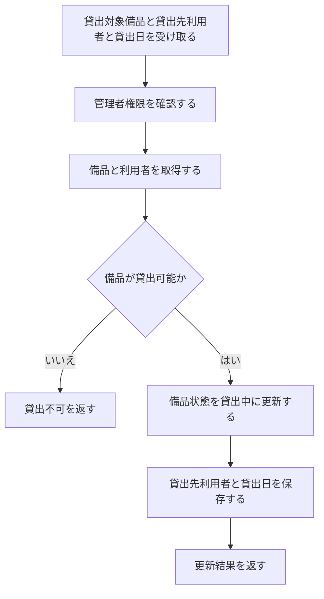
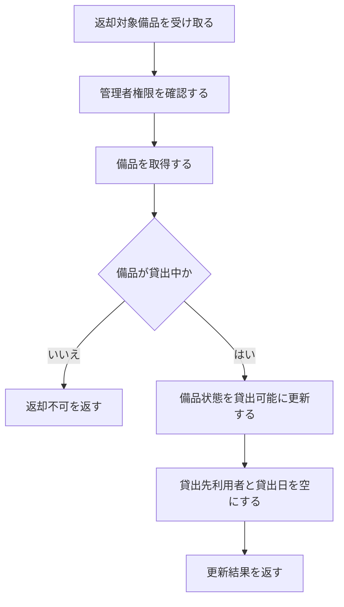
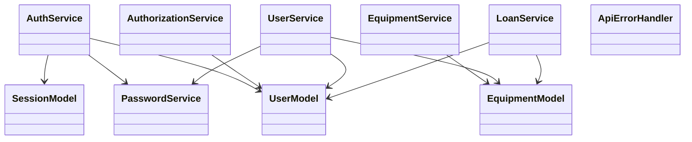
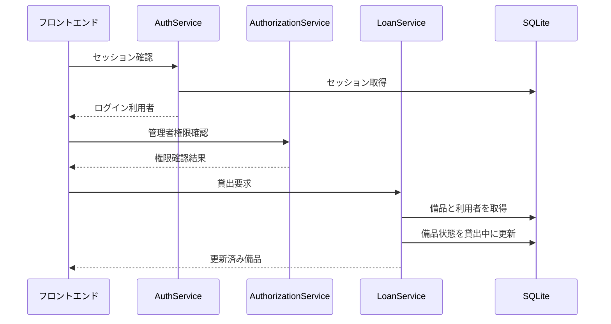

# 備品管理・貸出管理アプリ 詳細設計書

## 1. 言語・フレームワーク

| DS-ID | 対応要件ID | 設計要素 | 採用内容 | 選定理由 |
|---|---|---|---|---|
| DS-MD-FRONTEND-UI-UI-WEB-GUI | RQ-UI-WEB-GUI | フロントエンド | Vue、Vuetify、Nginx | 管理者向けと一般利用者向けの複数画面、画面遷移、権限別表示が必要なため、マルチページ構成に適した構成にする。 |
| DS-MD-BACKEND-API-UI-WEB-GUI | RQ-UI-WEB-GUI | バックエンド | Python、FastAPI | 要件の業務操作をAPIとして分離し、画面と業務処理の責務を分ける。Pythonは標準選定であり、FastAPIは小規模APIを明確に設計しやすい。 |
| DS-MD-WEB-SERVER-UI-WEB-GUI | RQ-UI-WEB-GUI | Web配信・リバースプロキシ | Nginx | フロントエンドを配信し、`/api/` で始まるリクエストをバックエンドへ転送する。 |
| DS-SC-SQLITE-DATABASE-DT-APP-DATABASE-REQUIRED | RQ-DT-APP-DATABASE-REQUIRED | データベース | SQLite | 管理者1〜3人、一般利用者30人程度、同時利用5人程度であり、備品・利用者・現在状態の単純な永続化に必要十分である。 |
| DS-MD-CONTAINER-RUNTIME-NF-USERS-ADMIN-3-GENERAL-30 | RQ-NF-USERS-ADMIN-3-GENERAL-30 | 実行方式 | docker compose | フロントエンド、バックエンド、E2Eテストを同一手順で起動・検証できるようにする。 |

## 2. システム構成

### 2.1 コンポーネント一覧

| DS-ID | 対応要件ID | コンポーネント | 役割 | 根拠 |
|---|---|---|---|---|
| DS-MD-FRONTEND-APP-UI-WEB-GUI | RQ-UI-WEB-GUI | フロントエンドアプリ | ログイン、備品一覧、備品登録・編集、備品削除確認、貸出登録、返却確認、利用者一覧、利用者登録・編集、利用者削除確認、一般利用者向け備品一覧を表示する。 | Webブラウザで操作するGUIが必要であるため。 |
| DS-MD-BACKEND-APP-FT-MANAGE-EQUIPMENT | RQ-FT-MANAGE-EQUIPMENT | バックエンドアプリ | 認証、認可、備品管理、利用者管理、貸出、返却、初期管理者作成を実行する。 | 更新操作を管理者に限定し、データ整合性を集中管理するため。 |
| DS-SC-SQLITE-STORE-DT-INTERNAL-APP-DATA | RQ-DT-INTERNAL-APP-DATA | SQLiteデータベース | 備品、利用者、現在の貸出状態、ログインセッションを保存する。 | アプリ内DBに保存する要件を満たすため。 |
| DS-MD-REVERSE-PROXY-UI-WEB-GUI | RQ-UI-WEB-GUI | Nginx | フロントエンド配信と `/api/` リバースプロキシを行う。 | 画面配信とAPI入口を同一オリジンに統一するため。 |
| DS-MD-E2E-RUNNER-TS-VERIFY-GENERAL-EQUIPMENT-VIEW | RQ-TS-VERIFY-GENERAL-EQUIPMENT-VIEW | Playwright実行コンテナ | ユーザー視点の画面遷移と業務操作を検証する。 | GUIのE2Eテストを要件シナリオ単位で実行するため。 |

### 2.2 システム全体構成図



### 2.3 コンポーネント間インターフェースとデータフロー

| DS-ID | 対応要件ID | 入力元 | 出力先 | インターフェース | データフロー |
|---|---|---|---|---|---|
| DS-IF-FRONTEND-TO-BACKEND-UI-WEB-GUI | RQ-UI-WEB-GUI | フロントエンド | バックエンド | `/api/` 配下のHTTP API | 画面操作をAPI要求へ変換し、API応答を画面状態へ反映する。 |
| DS-IF-BACKEND-TO-DATABASE-DT-APP-DATABASE-REQUIRED | RQ-DT-APP-DATABASE-REQUIRED | バックエンド | SQLite | SQLAlchemy経由のDBアクセス | API処理単位でトランザクションを開始し、成功時に確定、失敗時にロールバックする。 |
| DS-IF-NGINX-ROUTING-UI-WEB-GUI | RQ-UI-WEB-GUI | Webブラウザ | フロントエンド、バックエンド | HTTPルーティング | 画面要求はフロントエンドへ、`/api/` はバックエンドへ転送する。 |

### 2.4 ネットワーク構成図



## 3. データベース設計

### 3.1 DB必須性

| DS-ID | 対応要件ID | 判定 | 理由 |
|---|---|---|---|
| DS-SC-DATABASE-REQUIRED-DT-APP-DATABASE-REQUIRED | RQ-DT-APP-DATABASE-REQUIRED | DBは必須 | 備品、利用者、現在の貸出状態を画面終了後も保持し、管理者が削除するまで維持する必要がある。 |

### 3.2 テーブル設計

| DS-ID | 対応要件ID | テーブル | カラム | 型 | 制約 | 説明 |
|---|---|---|---|---|---|---|
| DS-SC-USERS-DT-BORROWER-FIELDS | RQ-DT-BORROWER-FIELDS | users | id | integer | 主キー、自動採番 | 利用者を一意に識別する内部ID。 |
| DS-SC-USERS-DT-BORROWER-FIELDS | RQ-DT-BORROWER-FIELDS | users | display_name | text | 必須 | 画面に表示する利用者名。 |
| DS-SC-USERS-DT-BORROWER-FIELDS | RQ-DT-BORROWER-FIELDS | users | login_id | text | 必須、一意 | ログインに使用するID。 |
| DS-SC-USERS-DT-BORROWER-FIELDS | RQ-DT-BORROWER-FIELDS | users | password_hash | text | 必須 | ハッシュ化済みパスワード。画面には表示しない。 |
| DS-SC-USERS-DT-BORROWER-FIELDS | RQ-DT-BORROWER-FIELDS | users | role | text | 必須、`admin` または `general` | 権限種別。 |
| DS-SC-USERS-DT-BORROWER-FIELDS | RQ-DT-BORROWER-FIELDS | users | version | integer | 必須 | 更新競合を検知する楽観ロック用の版数。 |
| DS-SC-EQUIPMENT-DT-EQUIPMENT-FIELDS | RQ-DT-EQUIPMENT-FIELDS | equipment | id | integer | 主キー、自動採番 | 備品を一意に識別する内部ID。 |
| DS-SC-EQUIPMENT-DT-EQUIPMENT-FIELDS | RQ-DT-EQUIPMENT-FIELDS | equipment | equipment_code | text | 必須、一意 | 画面に表示する備品ID。 |
| DS-SC-EQUIPMENT-DT-EQUIPMENT-FIELDS | RQ-DT-EQUIPMENT-FIELDS | equipment | name | text | 必須 | 備品名。 |
| DS-SC-EQUIPMENT-DT-EQUIPMENT-STATE-TRANSITION | RQ-DT-EQUIPMENT-STATE-TRANSITION | equipment | status | text | 必須、`available` または `loaned` | 貸出可能または貸出中を表す。 |
| DS-SC-EQUIPMENT-DT-LOAN-STATE-FIELDS | RQ-DT-LOAN-STATE-FIELDS | equipment | loan_user_id | integer | users.idへの外部キー、貸出可能時は空 | 貸出中の貸出先利用者。 |
| DS-SC-EQUIPMENT-DT-LOAN-STATE-FIELDS | RQ-DT-LOAN-STATE-FIELDS | equipment | loan_date | date | 貸出可能時は空 | 貸出日。返却時に空へ戻す。 |
| DS-SC-EQUIPMENT-DT-EQUIPMENT-FIELDS | RQ-DT-EQUIPMENT-FIELDS | equipment | version | integer | 必須 | 更新競合を検知する楽観ロック用の版数。 |
| DS-SC-SESSIONS-NF-SESSION-AUTO-LOGOUT-60MIN | RQ-NF-SESSION-AUTO-LOGOUT-60MIN | sessions | id | text | 主キー | セッションID。 |
| DS-SC-SESSIONS-NF-SESSION-AUTO-LOGOUT-60MIN | RQ-NF-SESSION-AUTO-LOGOUT-60MIN | sessions | user_id | integer | users.idへの外部キー、必須 | ログイン中の利用者。 |
| DS-SC-SESSIONS-NF-SESSION-AUTO-LOGOUT-60MIN | RQ-NF-SESSION-AUTO-LOGOUT-60MIN | sessions | last_accessed_at | datetime | 必須 | 未操作60分判定に使用する。 |
| DS-SC-SESSIONS-NF-SESSION-AUTO-LOGOUT-60MIN | RQ-NF-SESSION-AUTO-LOGOUT-60MIN | sessions | expires_at | datetime | 必須 | セッション期限。 |

### 3.3 データ整合性制約

| DS-ID | 対応要件ID | 制約 | 内容 |
|---|---|---|---|
| DS-SC-EQUIPMENT-STATUS-CONSISTENCY-DT-EQUIPMENT-STATE-TRANSITION | RQ-DT-EQUIPMENT-STATE-TRANSITION | 備品状態整合性 | `status` が `available` の場合、`loan_user_id` と `loan_date` は空にする。`status` が `loaned` の場合、`loan_user_id` と `loan_date` は必須にする。 |
| DS-SC-EQUIPMENT-DELETE-RULE-FT-MANAGE-EQUIPMENT | RQ-FT-MANAGE-EQUIPMENT | 備品削除制約 | `status` が `available` の備品だけ削除できる。 |
| DS-SC-USER-DELETE-RULE-FT-MANAGE-BORROWER | RQ-FT-MANAGE-BORROWER | 利用者削除制約 | 現在貸出中の貸出先、自分自身、最後の管理者利用者は削除できない。 |
| DS-SC-LAST-ADMIN-RULE-FT-MANAGE-BORROWER | RQ-FT-MANAGE-BORROWER | 最後の管理者保護 | 最後の管理者利用者の権限種別は一般利用者へ変更できない。 |
| DS-SC-PASSWORD-HASH-NF-PASSWORD-HASH-STORAGE | RQ-NF-PASSWORD-HASH-STORAGE | パスワード保存制約 | 平文パスワードはDBに保存せず、bcryptでハッシュ化した値だけ保存する。 |

### 3.4 リレーション図



## 4. アーキテクチャ設計

### 4.1 外部設計: 画面一覧

| DS-ID | 対応要件ID | 画面 | 表示要素 | 主要操作 |
|---|---|---|---|---|
| DS-MD-LOGIN-SCREEN-UI-LOGIN-SCREEN | RQ-UI-LOGIN-SCREEN | ログイン画面 | ログインID、パスワード、ログイン実行、エラー表示 | ログイン成功時に権限種別で遷移先を分ける。 |
| DS-MD-ADMIN-EQUIPMENT-LIST-UI-ADMIN-EQUIPMENT-LIST-SCREEN | RQ-UI-ADMIN-EQUIPMENT-LIST-SCREEN | 管理者向け備品一覧画面 | 備品ID、備品名、状態、貸出先利用者名、貸出日、各画面への遷移 | 備品登録・編集、備品削除確認、貸出登録、返却確認、利用者一覧へ遷移する。 |
| DS-MD-EQUIPMENT-FORM-UI-EQUIPMENT-FORM-SCREEN | RQ-UI-EQUIPMENT-FORM-SCREEN | 備品登録・編集画面 | 備品ID、備品名、状態 | 備品を登録・編集し、一覧へ戻る。 |
| DS-MD-EQUIPMENT-DELETE-UI-EQUIPMENT-DELETE-CONFIRM-SCREEN | RQ-UI-EQUIPMENT-DELETE-CONFIRM-SCREEN | 備品削除確認画面 | 削除対象の備品ID、備品名、状態 | 貸出可能な備品だけ削除する。 |
| DS-MD-LOAN-FORM-UI-LOAN-FORM-SCREEN | RQ-UI-LOAN-FORM-SCREEN | 貸出登録画面 | 貸出可能な備品、貸出先利用者、貸出日 | 貸出を記録し、備品を貸出中にする。 |
| DS-MD-RETURN-CONFIRM-UI-RETURN-CONFIRM-SCREEN | RQ-UI-RETURN-CONFIRM-SCREEN | 返却確認画面 | 貸出中備品、貸出先利用者名、貸出日 | 返却を実行し、備品を貸出可能に戻す。 |
| DS-MD-BORROWER-LIST-UI-BORROWER-LIST-SCREEN | RQ-UI-BORROWER-LIST-SCREEN | 利用者一覧画面 | 利用者名、ログインID、権限種別 | 利用者登録・編集、利用者削除確認へ遷移する。パスワードは表示しない。 |
| DS-MD-BORROWER-FORM-UI-BORROWER-FORM-SCREEN | RQ-UI-BORROWER-FORM-SCREEN | 利用者登録・編集画面 | 利用者名、ログインID、パスワード、権限種別 | 利用者とログイン権限を登録・編集する。 |
| DS-MD-BORROWER-DELETE-UI-BORROWER-DELETE-CONFIRM-SCREEN | RQ-UI-BORROWER-DELETE-CONFIRM-SCREEN | 利用者削除確認画面 | 削除対象の利用者名、ログインID、権限種別 | 削除可能な利用者だけ削除する。 |
| DS-MD-GENERAL-EQUIPMENT-LIST-UI-GENERAL-EQUIPMENT-LIST-SCREEN | RQ-UI-GENERAL-EQUIPMENT-LIST-SCREEN | 一般利用者向け備品一覧画面 | 全備品の備品ID、備品名、状態 | 閲覧のみを行い、更新操作は表示しない。 |

### 4.2 画面遷移図



### 4.3 AAモックアップ

#### DS-MD-LOGIN-SCREEN-UI-LOGIN-SCREEN

```text
+----------------------------------+
| 備品管理・貸出管理アプリ          |
| ログインID [                  ]   |
| パスワード [                  ]   |
| [ログイン]                       |
+----------------------------------+
```

#### DS-MD-ADMIN-EQUIPMENT-LIST-UI-ADMIN-EQUIPMENT-LIST-SCREEN

```text
+----------------------------------------------------------+
| 備品一覧 管理者                                          |
| [備品登録] [利用者一覧] [ログアウト]                     |
| 備品ID | 備品名 | 状態 | 貸出先 | 貸出日 | 操作         |
| E001   | PC-A   | 貸出可能 |      |        | 編集 削除 貸出 |
| E002   | PC-B   | 貸出中   | 山田 | 2026-05-06 | 返却       |
+----------------------------------------------------------+
```

#### DS-MD-BORROWER-LIST-UI-BORROWER-LIST-SCREEN

```text
+--------------------------------------------------+
| 利用者一覧                                       |
| [利用者登録] [備品一覧へ戻る]                    |
| 利用者名 | ログインID | 権限種別 | 操作          |
| 山田     | yamada     | 管理者   | 編集 削除     |
| 佐藤     | sato       | 一般利用者 | 編集 削除   |
+--------------------------------------------------+
```

### 4.4 外部システム連携

| DS-ID | 対応要件ID | 判定 | 設計内容 |
|---|---|---|---|
| DS-IF-NO-EXTERNAL-INTEGRATION-EX-NO-EXTERNAL-INTEGRATION | RQ-EX-NO-EXTERNAL-INTEGRATION | 外部連携なし | 外部システム、外部DB、外部通知サービス、外部認証サービスへの接続は設計しない。 |

### 4.5 外部DB連携

| DS-ID | 対応要件ID | 判定 | 設計内容 |
|---|---|---|---|
| DS-IF-NO-EXTERNAL-DB-DT-NO-EXTERNAL-DB | RQ-DT-NO-EXTERNAL-DB | 外部DB連携なし | 外部DB接続先と接続処理は設計しない。 |

### 4.6 API一覧

| DS-ID | 対応要件ID | API | 権限 | 入力 | 出力 | バリデーション | エラー |
|---|---|---|---|---|---|---|---|
| DS-IF-LOGIN-FT-LOGIN | RQ-FT-LOGIN | `POST /api/auth/login` | 未ログイン | ログインID、パスワード | ログイン利用者、権限種別 | ログインIDとパスワード必須 | 認証失敗、入力不備 |
| DS-IF-LOGOUT-FT-LOGOUT | RQ-FT-LOGOUT | `POST /api/auth/logout` | ログイン済み | なし | 成功結果 | セッション必須 | 未ログイン |
| DS-IF-CURRENT-USER-FT-LOGIN | RQ-FT-LOGIN | `GET /api/auth/me` | ログイン済み | なし | 利用者名、ログインID、権限種別 | セッション必須 | 未ログイン、自動ログアウト済み |
| DS-IF-LIST-EQUIPMENT-FT-VIEW-EQUIPMENT-LIST | RQ-FT-VIEW-EQUIPMENT-LIST | `GET /api/equipment` | ログイン済み | なし | 備品一覧 | セッション必須 | 未ログイン |
| DS-IF-CREATE-EQUIPMENT-FT-MANAGE-EQUIPMENT | RQ-FT-MANAGE-EQUIPMENT | `POST /api/equipment` | 管理者 | 備品ID、備品名 | 登録済み備品 | 備品IDと備品名必須、備品ID一意 | 権限不足、入力不備、重複 |
| DS-IF-UPDATE-EQUIPMENT-FT-MANAGE-EQUIPMENT | RQ-FT-MANAGE-EQUIPMENT | `PUT /api/equipment/{id}` | 管理者 | 備品ID、備品名、version | 更新済み備品 | 備品IDと備品名必須、version一致 | 権限不足、入力不備、重複、競合 |
| DS-IF-DELETE-EQUIPMENT-FT-MANAGE-EQUIPMENT | RQ-FT-MANAGE-EQUIPMENT | `DELETE /api/equipment/{id}` | 管理者 | version | 成功結果 | 貸出可能状態、version一致 | 権限不足、貸出中、競合 |
| DS-IF-LIST-USERS-FT-MANAGE-BORROWER | RQ-FT-MANAGE-BORROWER | `GET /api/users` | 管理者 | なし | 利用者一覧 | 管理者権限必須 | 権限不足 |
| DS-IF-CREATE-USER-FT-MANAGE-BORROWER | RQ-FT-MANAGE-BORROWER | `POST /api/users` | 管理者 | 利用者名、ログインID、パスワード、権限種別 | 登録済み利用者 | 全項目必須、ログインID一意 | 権限不足、入力不備、重複 |
| DS-IF-UPDATE-USER-FT-MANAGE-BORROWER | RQ-FT-MANAGE-BORROWER | `PUT /api/users/{id}` | 管理者 | 利用者名、ログインID、パスワード、権限種別、version | 更新済み利用者 | 利用者名、ログインID、権限種別必須、version一致 | 権限不足、入力不備、最後の管理者変更、競合 |
| DS-IF-DELETE-USER-FT-MANAGE-BORROWER | RQ-FT-MANAGE-BORROWER | `DELETE /api/users/{id}` | 管理者 | version | 成功結果 | 貸出中の貸出先ではない、自分自身ではない、最後の管理者ではない、version一致 | 権限不足、削除不可、競合 |
| DS-IF-CREATE-LOAN-FT-LOAN-EQUIPMENT | RQ-FT-LOAN-EQUIPMENT | `POST /api/loans` | 管理者 | 備品ID、貸出先利用者ID、貸出日、備品version | 更新済み備品 | 備品が貸出可能、利用者が存在、貸出日必須 | 権限不足、入力不備、貸出不可、競合 |
| DS-IF-RETURN-EQUIPMENT-FT-RETURN-EQUIPMENT | RQ-FT-RETURN-EQUIPMENT | `POST /api/returns` | 管理者 | 備品ID、備品version | 更新済み備品 | 備品が貸出中 | 権限不足、返却不可、競合 |

### 4.7 内部処理フロー

#### ログイン



#### 貸出



#### 返却



### 4.8 トランザクション・排他制御

| DS-ID | 対応要件ID | 対象処理 | トランザクション境界 | ロールバック条件 | 排他制御 |
|---|---|---|---|---|---|
| DS-FN-EQUIPMENT-TRANSACTION-FT-MANAGE-EQUIPMENT | RQ-FT-MANAGE-EQUIPMENT | 備品登録・編集・削除 | API要求1件を1トランザクションにする。 | 入力不備、重複、削除不可、更新競合、DBエラー | versionによる楽観ロック。 |
| DS-FN-USER-TRANSACTION-FT-MANAGE-BORROWER | RQ-FT-MANAGE-BORROWER | 利用者登録・編集・削除 | API要求1件を1トランザクションにする。 | 入力不備、重複、削除不可、最後の管理者変更、更新競合、DBエラー | versionによる楽観ロック。 |
| DS-FN-LOAN-TRANSACTION-FT-LOAN-EQUIPMENT | RQ-FT-LOAN-EQUIPMENT | 貸出 | API要求1件を1トランザクションにする。 | 貸出不可、利用者不在、更新競合、DBエラー | 備品versionによる楽観ロック。 |
| DS-FN-RETURN-TRANSACTION-FT-RETURN-EQUIPMENT | RQ-FT-RETURN-EQUIPMENT | 返却 | API要求1件を1トランザクションにする。 | 返却不可、更新競合、DBエラー | 備品versionによる楽観ロック。 |

### 4.9 バッチ設計

| DS-ID | 対応要件ID | バッチ | 設計内容 |
|---|---|---|---|
| DS-BT-INITIAL-ADMIN-OP-INITIAL-ADMIN-ENV | RQ-OP-INITIAL-ADMIN-ENV | 初期管理者作成 | アプリ起動時に利用者が0件の場合だけ、環境変数のログインIDとパスワードから管理者利用者を作成する。利用者が1件以上存在する場合は作成しない。 |
| DS-BT-SESSION-CLEANUP-NF-SESSION-AUTO-LOGOUT-60MIN | RQ-NF-SESSION-AUTO-LOGOUT-60MIN | 期限切れセッション削除 | API要求時に期限切れセッションを無効扱いにし、該当セッションを削除する。常駐バッチは作成しない。 |

## 5. クラス設計

### 5.1 全クラス一覧

| DS-ID | 対応要件ID | クラス | 責務 | SOLID適合 |
|---|---|---|---|---|
| DS-CL-USER-MODEL-DT-BORROWER-FIELDS | RQ-DT-BORROWER-FIELDS | UserModel | 利用者テーブルのデータ構造を表す。 | データ表現に責務を限定する。 |
| DS-CL-EQUIPMENT-MODEL-DT-EQUIPMENT-FIELDS | RQ-DT-EQUIPMENT-FIELDS | EquipmentModel | 備品と現在の貸出状態のデータ構造を表す。 | データ表現に責務を限定する。 |
| DS-CL-SESSION-MODEL-NF-SESSION-AUTO-LOGOUT-60MIN | RQ-NF-SESSION-AUTO-LOGOUT-60MIN | SessionModel | ログインセッションのデータ構造を表す。 | データ表現に責務を限定する。 |
| DS-CL-AUTH-SERVICE-FT-LOGIN | RQ-FT-LOGIN | AuthService | ログイン、ログアウト、セッション確認、自動ログアウトを扱う。 | 認証処理に責務を限定する。 |
| DS-CL-AUTHORIZATION-SERVICE-NF-ROLE-BASED-AUTHORIZATION | RQ-NF-ROLE-BASED-AUTHORIZATION | AuthorizationService | 管理者権限とログイン済み状態を判定する。 | 認可判定に責務を限定し、各業務サービスから再利用する。 |
| DS-CL-EQUIPMENT-SERVICE-FT-MANAGE-EQUIPMENT | RQ-FT-MANAGE-EQUIPMENT | EquipmentService | 備品の登録、編集、削除、一覧取得を扱う。 | 備品管理に責務を限定する。 |
| DS-CL-USER-SERVICE-FT-MANAGE-BORROWER | RQ-FT-MANAGE-BORROWER | UserService | 利用者の登録、編集、削除、一覧取得、最後の管理者保護を扱う。 | 利用者管理に責務を限定する。 |
| DS-CL-LOAN-SERVICE-FT-LOAN-EQUIPMENT | RQ-FT-LOAN-EQUIPMENT | LoanService | 貸出処理と返却処理を扱う。 | 貸出状態遷移に責務を限定する。 |
| DS-CL-PASSWORD-SERVICE-NF-PASSWORD-HASH-STORAGE | RQ-NF-PASSWORD-HASH-STORAGE | PasswordService | パスワードのハッシュ化と照合を扱う。 | パスワード処理を共通化し、重複実装を排除する。 |
| DS-CL-API-ERROR-HANDLER-FT-VIEW-EQUIPMENT-LIST | RQ-FT-VIEW-EQUIPMENT-LIST | ApiErrorHandler | APIエラーを統一形式で返す。 | エラー応答整形に責務を限定する。 |

### 5.2 主要メソッド

| DS-ID | 対応要件ID | クラス | メソッド | 処理内容 |
|---|---|---|---|---|
| DS-FN-LOGIN-FT-LOGIN | RQ-FT-LOGIN | AuthService | login | ログインIDで利用者を取得し、パスワードを照合し、セッションを作成する。 |
| DS-FN-LOGOUT-FT-LOGOUT | RQ-FT-LOGOUT | AuthService | logout | セッションを削除し、ログアウト状態にする。 |
| DS-FN-REQUIRE-SESSION-NF-SESSION-AUTO-LOGOUT-60MIN | RQ-NF-SESSION-AUTO-LOGOUT-60MIN | AuthService | require_session | セッションの存在、期限、最終操作時刻を確認し、有効なら最終操作時刻を更新する。 |
| DS-FN-REQUIRE-ADMIN-NF-ROLE-BASED-AUTHORIZATION | RQ-NF-ROLE-BASED-AUTHORIZATION | AuthorizationService | require_admin | ログイン利用者が管理者であることを確認する。 |
| DS-FN-LIST-EQUIPMENT-FT-VIEW-EQUIPMENT-LIST | RQ-FT-VIEW-EQUIPMENT-LIST | EquipmentService | list_equipment | 備品一覧を取得し、貸出中の場合は貸出先利用者名と貸出日を含める。 |
| DS-FN-CREATE-EQUIPMENT-FT-MANAGE-EQUIPMENT | RQ-FT-MANAGE-EQUIPMENT | EquipmentService | create_equipment | 備品IDと備品名を登録し、初期状態を貸出可能にする。 |
| DS-FN-UPDATE-EQUIPMENT-FT-MANAGE-EQUIPMENT | RQ-FT-MANAGE-EQUIPMENT | EquipmentService | update_equipment | 備品IDと備品名を更新し、versionを進める。 |
| DS-FN-DELETE-EQUIPMENT-FT-MANAGE-EQUIPMENT | RQ-FT-MANAGE-EQUIPMENT | EquipmentService | delete_equipment | 貸出可能な備品だけ削除する。 |
| DS-FN-LIST-USERS-FT-MANAGE-BORROWER | RQ-FT-MANAGE-BORROWER | UserService | list_users | 利用者名、ログインID、権限種別を一覧取得する。パスワードハッシュは返さない。 |
| DS-FN-CREATE-USER-FT-MANAGE-BORROWER | RQ-FT-MANAGE-BORROWER | UserService | create_user | 利用者名、ログインID、パスワード、権限種別を登録する。 |
| DS-FN-UPDATE-USER-FT-MANAGE-BORROWER | RQ-FT-MANAGE-BORROWER | UserService | update_user | 利用者情報と権限種別を更新し、必要な場合だけパスワードを再ハッシュ化する。 |
| DS-FN-DELETE-USER-FT-MANAGE-BORROWER | RQ-FT-MANAGE-BORROWER | UserService | delete_user | 現在貸出中の貸出先、自分自身、最後の管理者利用者を除外して削除する。 |
| DS-FN-CREATE-LOAN-FT-LOAN-EQUIPMENT | RQ-FT-LOAN-EQUIPMENT | LoanService | create_loan | 貸出可能な備品に貸出先利用者と貸出日を設定し、貸出中へ変更する。 |
| DS-FN-RETURN-EQUIPMENT-FT-RETURN-EQUIPMENT | RQ-FT-RETURN-EQUIPMENT | LoanService | return_equipment | 貸出中の備品を貸出可能へ戻し、貸出先利用者と貸出日を空にする。 |

### 5.3 クラス図



### 5.4 システム内メッセージ一覧

| DS-ID | 対応要件ID | メッセージ | 送信元 | 送信先 | 役割 |
|---|---|---|---|---|---|
| DS-EV-LOGIN-REQUEST-FT-LOGIN | RQ-FT-LOGIN | ログイン要求 | フロントエンド | AuthService | 利用者の認証を開始する。 |
| DS-EV-EQUIPMENT-UPDATE-REQUEST-FT-MANAGE-EQUIPMENT | RQ-FT-MANAGE-EQUIPMENT | 備品更新要求 | フロントエンド | EquipmentService | 備品登録・編集・削除を実行する。 |
| DS-EV-USER-UPDATE-REQUEST-FT-MANAGE-BORROWER | RQ-FT-MANAGE-BORROWER | 利用者更新要求 | フロントエンド | UserService | 利用者登録・編集・削除を実行する。 |
| DS-EV-LOAN-REQUEST-FT-LOAN-EQUIPMENT | RQ-FT-LOAN-EQUIPMENT | 貸出要求 | フロントエンド | LoanService | 備品を貸出中へ変更する。 |
| DS-EV-RETURN-REQUEST-FT-RETURN-EQUIPMENT | RQ-FT-RETURN-EQUIPMENT | 返却要求 | フロントエンド | LoanService | 備品を貸出可能へ戻す。 |

### 5.5 メッセージフロー図



## 6. その他設計

### 6.1 エラーハンドリング設計

| DS-ID | 対応要件ID | エラー | 発生条件 | 画面表示 |
|---|---|---|---|---|
| DS-FN-ERROR-AUTH-FT-LOGIN | RQ-FT-LOGIN | 認証失敗 | ログインIDまたはパスワードが一致しない。 | ログインIDまたはパスワードが正しくない旨を表示する。 |
| DS-FN-ERROR-UNAUTHORIZED-NF-ROLE-BASED-AUTHORIZATION | RQ-NF-ROLE-BASED-AUTHORIZATION | 未ログイン | セッションが存在しない、または期限切れ。 | ログイン画面へ戻す。 |
| DS-FN-ERROR-FORBIDDEN-NF-ROLE-BASED-AUTHORIZATION | RQ-NF-ROLE-BASED-AUTHORIZATION | 権限不足 | 一般利用者が管理者APIへアクセスする。 | 操作できない旨を表示する。 |
| DS-FN-ERROR-VALIDATION-FT-MANAGE-EQUIPMENT | RQ-FT-MANAGE-EQUIPMENT | 入力不備 | 必須項目が空、状態値が不正、日付が不正。 | 入力項目ごとに修正内容を表示する。 |
| DS-FN-ERROR-CONFLICT-DT-EQUIPMENT-STATE-TRANSITION | RQ-DT-EQUIPMENT-STATE-TRANSITION | 更新競合 | versionが一致しない。 | 一覧を再読み込みしてから操作する旨を表示する。 |
| DS-FN-ERROR-BUSINESS-RULE-FT-MANAGE-BORROWER | RQ-FT-MANAGE-BORROWER | 業務制約違反 | 最後の管理者変更、自分自身削除、貸出中利用者削除。 | 削除または変更できない理由を表示する。 |

### 6.2 セキュリティ設計

| DS-ID | 対応要件ID | 項目 | 設計内容 |
|---|---|---|---|
| DS-FN-PASSWORD-HASH-NF-PASSWORD-HASH-STORAGE | RQ-NF-PASSWORD-HASH-STORAGE | パスワード保護 | PasswordServiceでbcryptハッシュを作成し、平文パスワードは保存しない。 |
| DS-FN-SESSION-COOKIE-NF-SESSION-AUTO-LOGOUT-60MIN | RQ-NF-SESSION-AUTO-LOGOUT-60MIN | セッションCookie | セッションIDをHttpOnly、SameSite=LaxのCookieに保存する。 |
| DS-FN-AUTO-LOGOUT-NF-SESSION-AUTO-LOGOUT-60MIN | RQ-NF-SESSION-AUTO-LOGOUT-60MIN | 未操作60分 | API要求ごとに最終操作時刻を確認し、60分を超えた場合はセッションを削除してログイン画面へ戻す。 |
| DS-FN-ROLE-AUTHORIZATION-NF-ROLE-BASED-AUTHORIZATION | RQ-NF-ROLE-BASED-AUTHORIZATION | 認可 | 管理者APIではAuthorizationServiceで管理者権限を必ず確認する。 |
| DS-FN-PASSWORD-HIDDEN-NF-PASSWORD-HASH-STORAGE | RQ-NF-PASSWORD-HASH-STORAGE | パスワード非表示 | 利用者一覧、利用者編集、API応答にパスワードハッシュを含めない。 |

## 7. コード設計

### 7.1 ディレクトリ構成

```text
.
├── backend
│   ├── app
│   │   ├── api
│   │   ├── core
│   │   ├── db
│   │   ├── models
│   │   ├── schemas
│   │   └── services
│   └── tests
├── frontend
│   ├── src
│   │   ├── api
│   │   ├── components
│   │   ├── router
│   │   ├── stores
│   │   └── views
│   └── tests
├── e2e
├── nginx
├── docs
└── .history
```

### 7.2 ファイル一覧と役割

| DS-ID | 対応要件ID | 配置 | ファイル名 | 役割 | 含まれるクラス |
|---|---|---|---|---|---|
| DS-MD-BACKEND-ENTRY-UI-WEB-GUI | RQ-UI-WEB-GUI | backend/app | main.py | FastAPIアプリを起動し、APIルーターと初期化処理を登録する。 | なし |
| DS-MD-BACKEND-CONFIG-OP-INITIAL-ADMIN-ENV | RQ-OP-INITIAL-ADMIN-ENV | backend/app/core | config.py | 環境変数と固定設定を読み込む。 | なし |
| DS-SC-BACKEND-DATABASE-DT-APP-DATABASE-REQUIRED | RQ-DT-APP-DATABASE-REQUIRED | backend/app/db | database.py | DB接続、セッション、トランザクションを提供する。 | なし |
| DS-SC-BACKEND-MODELS-DT-BORROWER-FIELDS | RQ-DT-BORROWER-FIELDS | backend/app/models | user.py | 利用者モデルを定義する。 | UserModel |
| DS-SC-BACKEND-MODELS-DT-EQUIPMENT-FIELDS | RQ-DT-EQUIPMENT-FIELDS | backend/app/models | equipment.py | 備品モデルを定義する。 | EquipmentModel |
| DS-SC-BACKEND-MODELS-NF-SESSION-AUTO-LOGOUT-60MIN | RQ-NF-SESSION-AUTO-LOGOUT-60MIN | backend/app/models | session.py | セッションモデルを定義する。 | SessionModel |
| DS-IF-BACKEND-AUTH-FT-LOGIN | RQ-FT-LOGIN | backend/app/api | auth.py | ログイン、ログアウト、ログイン利用者取得APIを提供する。 | なし |
| DS-IF-BACKEND-EQUIPMENT-FT-MANAGE-EQUIPMENT | RQ-FT-MANAGE-EQUIPMENT | backend/app/api | equipment.py | 備品一覧、登録、編集、削除APIを提供する。 | なし |
| DS-IF-BACKEND-USERS-FT-MANAGE-BORROWER | RQ-FT-MANAGE-BORROWER | backend/app/api | users.py | 利用者一覧、登録、編集、削除APIを提供する。 | なし |
| DS-IF-BACKEND-LOANS-FT-LOAN-EQUIPMENT | RQ-FT-LOAN-EQUIPMENT | backend/app/api | loans.py | 貸出APIと返却APIを提供する。 | なし |
| DS-CL-BACKEND-SERVICES-FT-LOGIN | RQ-FT-LOGIN | backend/app/services | auth_service.py | 認証とセッション処理を実装する。 | AuthService |
| DS-CL-BACKEND-SERVICES-NF-ROLE-BASED-AUTHORIZATION | RQ-NF-ROLE-BASED-AUTHORIZATION | backend/app/services | authorization_service.py | 認可判定を実装する。 | AuthorizationService |
| DS-CL-BACKEND-SERVICES-FT-MANAGE-EQUIPMENT | RQ-FT-MANAGE-EQUIPMENT | backend/app/services | equipment_service.py | 備品管理処理を実装する。 | EquipmentService |
| DS-CL-BACKEND-SERVICES-FT-MANAGE-BORROWER | RQ-FT-MANAGE-BORROWER | backend/app/services | user_service.py | 利用者管理処理を実装する。 | UserService |
| DS-CL-BACKEND-SERVICES-FT-LOAN-EQUIPMENT | RQ-FT-LOAN-EQUIPMENT | backend/app/services | loan_service.py | 貸出・返却処理を実装する。 | LoanService |
| DS-CL-BACKEND-SERVICES-NF-PASSWORD-HASH-STORAGE | RQ-NF-PASSWORD-HASH-STORAGE | backend/app/services | password_service.py | パスワードハッシュ化と照合を実装する。 | PasswordService |
| DS-MD-FRONTEND-ENTRY-UI-WEB-GUI | RQ-UI-WEB-GUI | frontend/src | main.ts | Vueアプリを起動する。 | なし |
| DS-MD-FRONTEND-ROUTER-UI-WEB-GUI | RQ-UI-WEB-GUI | frontend/src/router | index.ts | 画面遷移と権限別ルート制御を定義する。 | なし |
| DS-MD-FRONTEND-API-FT-VIEW-EQUIPMENT-LIST | RQ-FT-VIEW-EQUIPMENT-LIST | frontend/src/api | client.ts | `/api/` 呼び出しを共通化する。 | なし |
| DS-MD-FRONTEND-STORE-FT-LOGIN | RQ-FT-LOGIN | frontend/src/stores | auth.ts | ログイン状態と権限種別を保持する。 | なし |
| DS-MD-FRONTEND-VIEWS-UI-LOGIN-SCREEN | RQ-UI-LOGIN-SCREEN | frontend/src/views | LoginView.vue | ログイン画面を実装する。 | なし |
| DS-MD-FRONTEND-VIEWS-UI-ADMIN-EQUIPMENT-LIST-SCREEN | RQ-UI-ADMIN-EQUIPMENT-LIST-SCREEN | frontend/src/views | AdminEquipmentListView.vue | 管理者向け備品一覧画面を実装する。 | なし |
| DS-MD-FRONTEND-VIEWS-UI-EQUIPMENT-FORM-SCREEN | RQ-UI-EQUIPMENT-FORM-SCREEN | frontend/src/views | EquipmentFormView.vue | 備品登録・編集画面を実装する。 | なし |
| DS-MD-FRONTEND-VIEWS-UI-BORROWER-LIST-SCREEN | RQ-UI-BORROWER-LIST-SCREEN | frontend/src/views | UserListView.vue | 利用者一覧画面を実装する。 | なし |
| DS-MD-FRONTEND-VIEWS-UI-BORROWER-FORM-SCREEN | RQ-UI-BORROWER-FORM-SCREEN | frontend/src/views | UserFormView.vue | 利用者登録・編集画面を実装する。 | なし |
| DS-MD-FRONTEND-VIEWS-UI-GENERAL-EQUIPMENT-LIST-SCREEN | RQ-UI-GENERAL-EQUIPMENT-LIST-SCREEN | frontend/src/views | GeneralEquipmentListView.vue | 一般利用者向け備品一覧画面を実装する。 | なし |
| DS-MD-E2E-TESTS-TS-VERIFY-ADMIN-LOGIN | RQ-TS-VERIFY-ADMIN-LOGIN | e2e | equipment-loan.spec.ts | E2Eシナリオを実装する。 | なし |
| DS-MD-NGINX-CONFIG-UI-WEB-GUI | RQ-UI-WEB-GUI | nginx | default.conf | フロントエンド配信と `/api/` 転送を定義する。 | なし |

### 7.3 コーディング規約

| DS-ID | 対応要件ID | 対象 | 規約 |
|---|---|---|---|
| DS-MD-PYTHON-CODING-RULES-UI-WEB-GUI | RQ-UI-WEB-GUI | Python | PEP8に準拠し、型ヒントとdocstringを付与する。業務処理はサービスクラスへ集約する。 |
| DS-MD-TYPESCRIPT-CODING-RULES-UI-WEB-GUI | RQ-UI-WEB-GUI | TypeScript | API型、画面状態、ルート定義を明示し、画面コンポーネントに業務判定を重複実装しない。 |
| DS-MD-TRACEABLE-COMMENT-RULES-BZ-EQUIPMENT-LOAN-MANAGEMENT | RQ-BZ-EQUIPMENT-LOAN-MANAGEMENT | 全コード | 主要な関数、クラス、モジュールに対応するRQ-IDとDS-IDをコメントとして記載する。 |

## 8. テスト設計

### 8.1 テスト種別

| DS-ID | 対応要件ID | テスト種別 | 内容 |
|---|---|---|---|
| DS-MD-BACKEND-UNIT-TESTS-FT-MANAGE-EQUIPMENT | RQ-FT-MANAGE-EQUIPMENT | 単体テスト | サービスクラスごとの正常系、入力不備、業務制約、競合を検証する。 |
| DS-MD-BACKEND-INTEGRATION-TESTS-FT-LOAN-EQUIPMENT | RQ-FT-LOAN-EQUIPMENT | API結合テスト | API、認証、認可、DB更新を通した業務処理を検証する。 |
| DS-MD-FRONTEND-UNIT-TESTS-UI-WEB-GUI | RQ-UI-WEB-GUI | フロントエンド単体テスト | 画面コンポーネント、ルート制御、表示制御を検証する。 |
| DS-MD-E2E-TESTS-TS-VERIFY-GENERAL-EQUIPMENT-VIEW | RQ-TS-VERIFY-GENERAL-EQUIPMENT-VIEW | E2Eテスト | Playwrightで要件の利用シナリオを画面操作として検証する。 |

### 8.2 実装すべきテストケース

| DS-ID | 対応要件ID | テスト対象 | 正常系 | 異常系 |
|---|---|---|---|---|
| DS-MD-TEST-AUTH-FT-LOGIN | RQ-FT-LOGIN | 認証 | 管理者と一般利用者がログインできる。 | 不正なログインIDまたはパスワードでログインできない。 |
| DS-MD-TEST-LOGOUT-FT-LOGOUT | RQ-FT-LOGOUT | ログアウト | ログアウト後にログイン画面へ戻る。 | ログアウト後に保護画面へ直接アクセスできない。 |
| DS-MD-TEST-AUTO-LOGOUT-NF-SESSION-AUTO-LOGOUT-60MIN | RQ-NF-SESSION-AUTO-LOGOUT-60MIN | 自動ログアウト | 未操作60分でセッションが無効になる。 | 期限切れセッションでAPI操作できない。 |
| DS-MD-TEST-EQUIPMENT-FT-MANAGE-EQUIPMENT | RQ-FT-MANAGE-EQUIPMENT | 備品管理 | 備品を登録・編集・削除できる。 | 貸出中備品を削除できない。重複備品IDを登録できない。 |
| DS-MD-TEST-USERS-FT-MANAGE-BORROWER | RQ-FT-MANAGE-BORROWER | 利用者管理 | 利用者を登録・編集・削除できる。 | 貸出中の貸出先、自分自身、最後の管理者利用者を削除できない。最後の管理者を一般利用者へ変更できない。 |
| DS-MD-TEST-LOAN-FT-LOAN-EQUIPMENT | RQ-FT-LOAN-EQUIPMENT | 貸出 | 貸出可能備品を貸出中にできる。 | 貸出中備品を再貸出できない。存在しない利用者へ貸出できない。 |
| DS-MD-TEST-RETURN-FT-RETURN-EQUIPMENT | RQ-FT-RETURN-EQUIPMENT | 返却 | 貸出中備品を貸出可能へ戻せる。 | 貸出可能備品を返却できない。 |
| DS-MD-TEST-GENERAL-VIEW-UI-GENERAL-EQUIPMENT-LIST-SCREEN | RQ-UI-GENERAL-EQUIPMENT-LIST-SCREEN | 一般利用者画面 | 全備品の状態を閲覧できる。 | 更新操作が表示されず、管理者APIへアクセスできない。 |

## 9. 運用設計

| DS-ID | 対応要件ID | 項目 | 設計内容 |
|---|---|---|---|
| DS-MD-DOCKER-COMPOSE-RUNTIME-NF-USERS-ADMIN-3-GENERAL-30 | RQ-NF-USERS-ADMIN-3-GENERAL-30 | 起動方式 | docker composeでweb、api、test_playwrightを定義する。通常起動ではwebとapiを起動する。 |
| DS-BT-INITIALIZE-ADMIN-OP-INITIAL-ADMIN-ENV | RQ-OP-INITIAL-ADMIN-ENV | 初期化 | api起動時にDBスキーマを作成し、利用者が0件の場合だけ環境変数から初期管理者を作成する。 |
| DS-MD-README-OP-INITIAL-ADMIN-ENV | RQ-OP-INITIAL-ADMIN-ENV | README | 起動方法、初期管理者環境変数、ログイン方法、通常操作をREADME.mdに記載する。 |
| DS-SC-DATA-PERSISTENCE-DT-CURRENT-DATA-RETENTION | RQ-DT-CURRENT-DATA-RETENTION | データ永続化 | SQLite DBファイルをdocker volumeに保存し、管理者が削除するまでデータを保持する。 |

## 10. ログ・監視・アラート設計

| DS-ID | 対応要件ID | 項目 | 判定 | 設計内容 |
|---|---|---|---|---|
| DS-MD-NO-BUSINESS-LOG-OP-NO-BUSINESS-OPERATION-LOG | RQ-OP-NO-BUSINESS-OPERATION-LOG | 業務操作ログ | 必須ではない | ログの設計は必須ではないため、貸出・返却・備品編集・利用者編集の業務操作ログの種類と内容の記述は行わない。 |
| DS-MD-NO-BUSINESS-ALERT-OP-NO-BUSINESS-ALERT | RQ-OP-NO-BUSINESS-ALERT | 監視・アラート | 必須ではない | 監視・アラートの設計は必須ではないため、監視・アラートの内容と対応方法の記述は行わない。 |

## 11. E2Eテスト設計

### 11.1 E2E実行方式

| DS-ID | 対応要件ID | 項目 | 設計内容 |
|---|---|---|---|
| DS-MD-PLAYWRIGHT-SERVICE-TS-VERIFY-GENERAL-EQUIPMENT-VIEW | RQ-TS-VERIFY-GENERAL-EQUIPMENT-VIEW | test_playwrightサービス | `mcr.microsoft.com/playwright:v1.59.0` を使用し、`test` プロファイルでのみ起動する。 |
| DS-MD-E2E-FILES-TS-VERIFY-GENERAL-EQUIPMENT-VIEW | RQ-TS-VERIFY-GENERAL-EQUIPMENT-VIEW | ファイル配置 | プロジェクトルートの `e2e` 配下にテスト資産を配置する。 |
| DS-MD-E2E-COMMAND-TS-VERIFY-GENERAL-EQUIPMENT-VIEW | RQ-TS-VERIFY-GENERAL-EQUIPMENT-VIEW | 実行コマンド | `docker compose run --rm test_playwright sh -c "npm install && npx playwright test"` をREADME.mdに記載する。 |
| DS-MD-E2E-URL-TS-VERIFY-GENERAL-EQUIPMENT-VIEW | RQ-TS-VERIFY-GENERAL-EQUIPMENT-VIEW | テストURL | compose内サービス名ベースで `http://web` を使用する。 |

### 11.2 E2Eシナリオ

| DS-ID | 対応要件ID | 目的 | 前提条件 | 手順 | 期待結果 |
|---|---|---|---|---|---|
| DS-MD-E2E-ADMIN-LOGIN-TS-VERIFY-ADMIN-LOGIN | RQ-TS-VERIFY-ADMIN-LOGIN | 管理者がログインできることを確認する。 | 初期管理者利用者が作成済みである。 | ログイン画面で管理者のログインIDとパスワードを入力する。 | 管理者向け備品一覧画面に遷移する。 |
| DS-MD-E2E-GENERAL-LOGIN-TS-VERIFY-GENERAL-LOGIN | RQ-TS-VERIFY-GENERAL-LOGIN | 一般利用者がログインできることを確認する。 | 一般利用者が登録済みである。 | ログイン画面で一般利用者のログインIDとパスワードを入力する。 | 一般利用者向け備品一覧画面に遷移する。 |
| DS-MD-E2E-INITIAL-ADMIN-TS-VERIFY-INITIAL-ADMIN-CREATION | RQ-TS-VERIFY-INITIAL-ADMIN-CREATION | 初回起動時に初期管理者利用者が作成されることを確認する。 | 環境変数に初期管理者のログインIDとパスワードが設定済みで、DBに利用者が存在しない。 | アプリを起動し、環境変数のログインIDとパスワードでログインする。 | 初期管理者利用者が作成され、管理者向け備品一覧画面に遷移する。 |
| DS-MD-E2E-EQUIPMENT-MANAGEMENT-TS-VERIFY-EQUIPMENT-MANAGEMENT | RQ-TS-VERIFY-EQUIPMENT-MANAGEMENT | 管理者が備品を登録・編集・削除できることを確認する。 | 管理者でログイン済みである。 | 備品登録・編集画面で登録と編集を行い、備品削除確認画面で貸出可能備品を削除する。 | 備品が登録・編集・削除され、貸出中備品は削除できない。 |
| DS-MD-E2E-USER-MANAGEMENT-TS-VERIFY-BORROWER-MANAGEMENT | RQ-TS-VERIFY-BORROWER-MANAGEMENT | 管理者が利用者とログイン権限を管理できることを確認する。 | 管理者でログイン済みである。 | 利用者登録・編集画面で登録と編集を行い、利用者削除確認画面で削除可能な利用者を削除する。 | 利用者が登録・編集・削除され、削除不可条件と最後の管理者変更不可が守られる。 |
| DS-MD-E2E-LOAN-TS-VERIFY-LOAN-EQUIPMENT | RQ-TS-VERIFY-LOAN-EQUIPMENT | 管理者が貸出を記録できることを確認する。 | 管理者でログイン済みで、貸出可能な備品と利用者が登録済みである。 | 貸出登録画面で利用者と貸出日を入力して貸出を実行する。 | 備品状態が貸出中になり、貸出先利用者名と貸出日が表示される。 |
| DS-MD-E2E-RETURN-TS-VERIFY-RETURN-EQUIPMENT | RQ-TS-VERIFY-RETURN-EQUIPMENT | 管理者が返却処理できることを確認する。 | 管理者でログイン済みで、貸出中の備品が存在する。 | 返却確認画面で返却対象を確認して返却を実行する。 | 備品状態が貸出可能になり、貸出先利用者名と貸出日は表示されなくなる。 |
| DS-MD-E2E-GENERAL-VIEW-TS-VERIFY-GENERAL-EQUIPMENT-VIEW | RQ-TS-VERIFY-GENERAL-EQUIPMENT-VIEW | 一般利用者が全備品の状態を閲覧でき、更新操作できないことを確認する。 | 一般利用者でログイン済みで、貸出可能と貸出中の備品が存在する。 | 一般利用者向け備品一覧画面を開く。 | 全備品の備品ID、備品名、状態が表示され、更新操作は表示されない。 |
| DS-MD-E2E-LOGOUT-TS-VERIFY-LOGOUT | RQ-TS-VERIFY-LOGOUT | ログアウトできることを確認する。 | 任意の利用者でログイン済みである。 | 画面上でログアウトを実行する。 | セッションが終了し、ログイン画面へ戻る。 |
| DS-MD-E2E-AUTO-LOGOUT-TS-VERIFY-AUTO-LOGOUT | RQ-TS-VERIFY-AUTO-LOGOUT | 未操作60分で自動ログアウトすることを確認する。 | 任意の利用者でログイン済みである。 | 最終操作時刻を60分超過状態にして再操作する。 | セッションが終了し、ログイン画面へ戻る。 |

## 12. 要件・設計対応表

| 対応要件ID | 主要設計ID |
|---|---|
| RQ-UI-WEB-GUI | DS-MD-FRONTEND-UI-UI-WEB-GUI、DS-MD-BACKEND-API-UI-WEB-GUI、DS-MD-WEB-SERVER-UI-WEB-GUI |
| RQ-DT-APP-DATABASE-REQUIRED | DS-SC-SQLITE-DATABASE-DT-APP-DATABASE-REQUIRED、DS-SC-DATABASE-REQUIRED-DT-APP-DATABASE-REQUIRED |
| RQ-FT-LOGIN | DS-IF-LOGIN-FT-LOGIN、DS-FN-LOGIN-FT-LOGIN、DS-CL-AUTH-SERVICE-FT-LOGIN |
| RQ-FT-LOGOUT | DS-IF-LOGOUT-FT-LOGOUT、DS-FN-LOGOUT-FT-LOGOUT |
| RQ-NF-SESSION-AUTO-LOGOUT-60MIN | DS-SC-SESSIONS-NF-SESSION-AUTO-LOGOUT-60MIN、DS-FN-AUTO-LOGOUT-NF-SESSION-AUTO-LOGOUT-60MIN |
| RQ-FT-MANAGE-EQUIPMENT | DS-IF-CREATE-EQUIPMENT-FT-MANAGE-EQUIPMENT、DS-IF-UPDATE-EQUIPMENT-FT-MANAGE-EQUIPMENT、DS-IF-DELETE-EQUIPMENT-FT-MANAGE-EQUIPMENT、DS-CL-EQUIPMENT-SERVICE-FT-MANAGE-EQUIPMENT |
| RQ-FT-MANAGE-BORROWER | DS-IF-CREATE-USER-FT-MANAGE-BORROWER、DS-IF-UPDATE-USER-FT-MANAGE-BORROWER、DS-IF-DELETE-USER-FT-MANAGE-BORROWER、DS-CL-USER-SERVICE-FT-MANAGE-BORROWER |
| RQ-FT-VIEW-EQUIPMENT-LIST | DS-IF-LIST-EQUIPMENT-FT-VIEW-EQUIPMENT-LIST、DS-FN-LIST-EQUIPMENT-FT-VIEW-EQUIPMENT-LIST |
| RQ-FT-LOAN-EQUIPMENT | DS-IF-CREATE-LOAN-FT-LOAN-EQUIPMENT、DS-FN-CREATE-LOAN-FT-LOAN-EQUIPMENT、DS-CL-LOAN-SERVICE-FT-LOAN-EQUIPMENT |
| RQ-FT-RETURN-EQUIPMENT | DS-IF-RETURN-EQUIPMENT-FT-RETURN-EQUIPMENT、DS-FN-RETURN-EQUIPMENT-FT-RETURN-EQUIPMENT |
| RQ-UI-LOGIN-SCREEN | DS-MD-LOGIN-SCREEN-UI-LOGIN-SCREEN |
| RQ-UI-ADMIN-EQUIPMENT-LIST-SCREEN | DS-MD-ADMIN-EQUIPMENT-LIST-UI-ADMIN-EQUIPMENT-LIST-SCREEN |
| RQ-UI-BORROWER-LIST-SCREEN | DS-MD-BORROWER-LIST-UI-BORROWER-LIST-SCREEN |
| RQ-UI-GENERAL-EQUIPMENT-LIST-SCREEN | DS-MD-GENERAL-EQUIPMENT-LIST-UI-GENERAL-EQUIPMENT-LIST-SCREEN |
| RQ-EX-NO-EXTERNAL-INTEGRATION | DS-IF-NO-EXTERNAL-INTEGRATION-EX-NO-EXTERNAL-INTEGRATION |
| RQ-OP-NO-BUSINESS-OPERATION-LOG | DS-MD-NO-BUSINESS-LOG-OP-NO-BUSINESS-OPERATION-LOG |
| RQ-OP-NO-BUSINESS-ALERT | DS-MD-NO-BUSINESS-ALERT-OP-NO-BUSINESS-ALERT |
| RQ-TS-VERIFY-ADMIN-LOGIN | DS-MD-E2E-ADMIN-LOGIN-TS-VERIFY-ADMIN-LOGIN |
| RQ-TS-VERIFY-GENERAL-LOGIN | DS-MD-E2E-GENERAL-LOGIN-TS-VERIFY-GENERAL-LOGIN |
| RQ-TS-VERIFY-INITIAL-ADMIN-CREATION | DS-MD-E2E-INITIAL-ADMIN-TS-VERIFY-INITIAL-ADMIN-CREATION |
| RQ-TS-VERIFY-EQUIPMENT-MANAGEMENT | DS-MD-E2E-EQUIPMENT-MANAGEMENT-TS-VERIFY-EQUIPMENT-MANAGEMENT |
| RQ-TS-VERIFY-BORROWER-MANAGEMENT | DS-MD-E2E-USER-MANAGEMENT-TS-VERIFY-BORROWER-MANAGEMENT |
| RQ-TS-VERIFY-LOAN-EQUIPMENT | DS-MD-E2E-LOAN-TS-VERIFY-LOAN-EQUIPMENT |
| RQ-TS-VERIFY-RETURN-EQUIPMENT | DS-MD-E2E-RETURN-TS-VERIFY-RETURN-EQUIPMENT |
| RQ-TS-VERIFY-GENERAL-EQUIPMENT-VIEW | DS-MD-E2E-GENERAL-VIEW-TS-VERIFY-GENERAL-EQUIPMENT-VIEW |
| RQ-TS-VERIFY-LOGOUT | DS-MD-E2E-LOGOUT-TS-VERIFY-LOGOUT |
| RQ-TS-VERIFY-AUTO-LOGOUT | DS-MD-E2E-AUTO-LOGOUT-TS-VERIFY-AUTO-LOGOUT |

## 13. 削除した設計要素

| DS-ID | 対応要件ID | 削除した設計要素 | 削除理由 |
|---|---|---|---|
| DS-MD-REMOVE-LOAN-HISTORY-DT-LOAN-STATE-FIELDS | RQ-DT-LOAN-STATE-FIELDS | 貸出履歴テーブル | 返却日と履歴を要件から削除しており、現在の貸出状態だけを保持すれば要件を満たすため。 |
| DS-MD-REMOVE-SEARCH-FT-VIEW-EQUIPMENT-LIST | RQ-FT-VIEW-EQUIPMENT-LIST | 検索APIと検索画面 | 要件で検索機能をMVP外としているため。 |
| DS-MD-REMOVE-BUSINESS-AUDIT-OP-NO-BUSINESS-OPERATION-LOG | RQ-OP-NO-BUSINESS-OPERATION-LOG | 業務操作ログテーブル | 業務上の操作ログを残さない要件に反するため。 |
| DS-MD-REMOVE-ALERT-OP-NO-BUSINESS-ALERT | RQ-OP-NO-BUSINESS-ALERT | 監視・アラート処理 | 返却予定日と監視・アラートを持たない要件に反するため。 |
| DS-MD-REMOVE-SEPARATE-ACCOUNT-DT-BORROWER-FIELDS | RQ-DT-BORROWER-FIELDS | ログイン情報専用エンティティ | 利用者エンティティにログインID、パスワードハッシュ、権限種別を持たせるため。 |

## 14. 完全性チェック

| チェック項目 | 結果 |
|---|---|
| 業務エンティティ、CRUD、一覧、詳細、検索、状態管理の定義が完全であるか | 備品、利用者、現在の貸出状態を定義し、詳細画面と検索はMVP外として削除済み。状態管理は備品状態と貸出先カラムで定義済み。 |
| エンティティと画面、API、クラスの対応関係が明確であるか | 画面一覧、API一覧、クラス一覧、要件・設計対応表で対応を定義済み。 |
| データ整合性が定義されているか | PK、FK、一意制約、状態整合性、削除制約、最後の管理者保護を定義済み。 |
| トランザクション境界とロールバック条件が定義されているか | API要求単位のトランザクション、ロールバック条件、versionによる楽観ロックを定義済み。 |
| API入出力、バリデーション、エラー仕様が定義されているか | API一覧とエラーハンドリング設計で定義済み。 |
| 認証、認可、監査ログが設計されているか | 認証、認可、セッション、自動ログアウトを定義済み。業務操作ログは要件に従って設計しない。 |
| ログ、監視、アラート、障害対応が定義されているか | 業務操作ログと監視・アラートは要件に従って不要と判定済み。エラー表示とロールバック条件を定義済み。 |
| 各エンティティの状態遷移が定義されているか | 備品の貸出可能・貸出中の状態遷移を定義済み。 |
| 全機能に対応する正常系、異常系テストが設計されているか | 単体、結合、E2Eの正常系・異常系を定義済み。 |
| 同一意味処理の重複実装が排除されているか | 認証、認可、パスワード、貸出状態遷移、エラー応答はサービスへ集約済み。 |
| 削除可能な設計要素を列挙し、削除しても要件を満たす要素は削除しているか | 削除した設計要素として列挙済み。 |
| 全ての設計要素にDS-IDが付与されているか | 各表の設計要素にDS-IDを付与済み。 |

## 15. レビュー結果

| 観点 | 結果 |
|---|---|
| 内容に矛盾がないか | 要件定義書の外部連携なし、アプリ内DB、管理者のみ更新、一般利用者閲覧のみ、返却日なし、業務操作ログなし、監視・アラートなしと整合している。 |
| 冗長な記述や冗長設計がないか | 貸出履歴、返却予定日、返却日、検索、独立したログイン情報管理、業務操作ログ、監視・アラートの設計を削除し、現在状態管理に必要な設計だけを残している。 |
| 完全性制約およびドキュメント作成ルールを満たしているか | 必須章、DS-ID、mermaid図、DB、API、トランザクション、排他制御、テスト、E2E、運用、削除要素、レビューを記載済み。仕様外の実装例や計画記述は含めていない。 |
