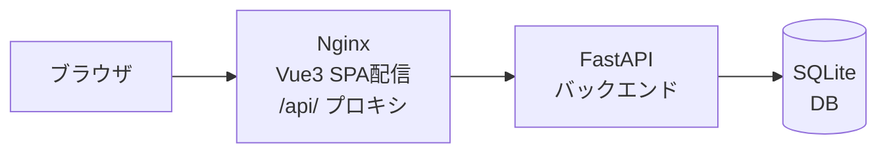
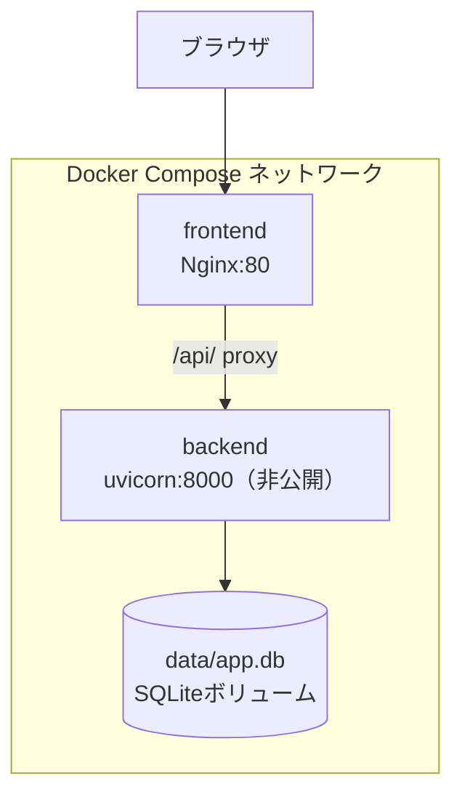
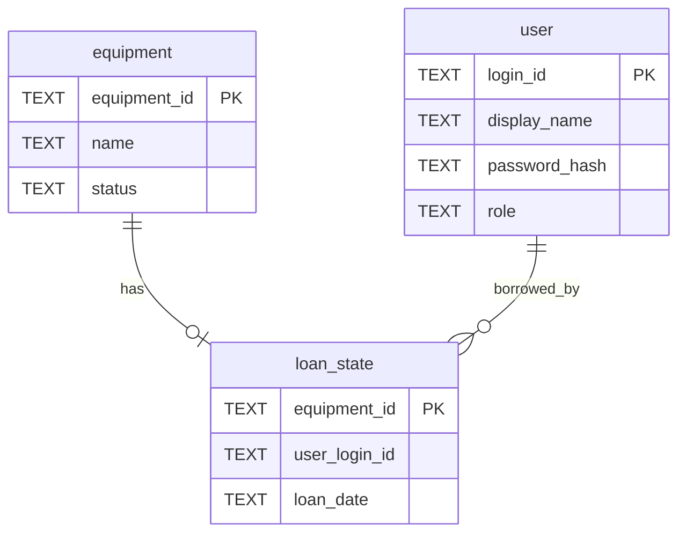
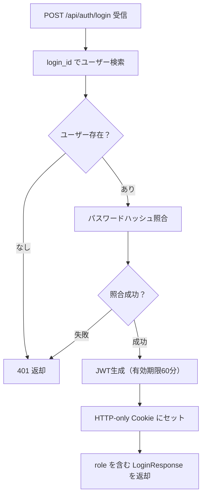
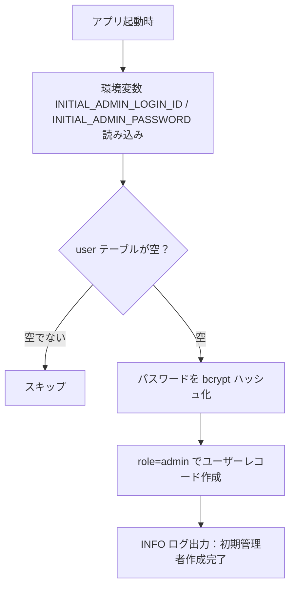
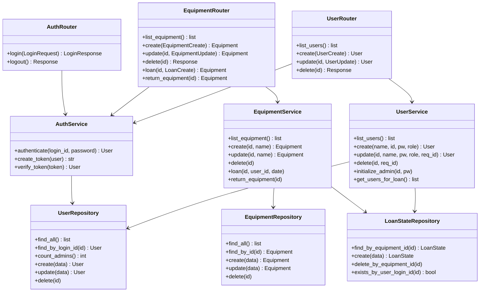
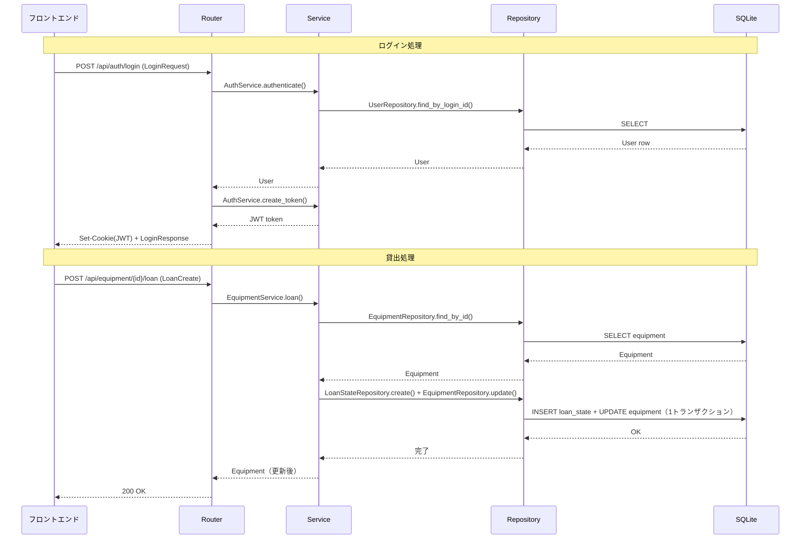

# 備品管理・貸出管理アプリ 詳細設計書

---

## 1. 言語・フレームワーク

| DS-ID | 対象 | 採用技術 | バージョン | 選定理由 |
|---|---|---|---|---|
| DS-MD-FRONTEND-FT-VIEW-EQUIPMENT-LIST | フロントエンド | Vue 3 + Vuetify 3 | Vue 3.x / Vuetify 3.x | ロール別ルーティングと10画面の複雑な遷移が必要なため、Streamlit（単一ページ向け）ではなくVue+Vuetifyを選定 |
| DS-MD-BACKEND-FT-MANAGE-EQUIPMENT | バックエンド | Python + FastAPI | Python 3.12 / FastAPI 0.115 | isddのデフォルト言語はPythonであり、非同期対応・Pydantic統合・応答3秒以内の非機能要件を満たせる |
| DS-MD-DATABASE-DT-EQUIPMENT-ENTITY | DB | SQLite | SQLite 3 | 備品最大100件・利用者最大30人の小規模データのため外部DBサーバー不要 |
| DS-MD-E2E-TEST-TS-VERIFY-ADMIN-LOGIN | E2Eテスト | Playwright | 1.59.0 | 全画面遷移シナリオを自動テストするため |

### フロントエンド構成方針

- Vue 3 SPA をマルチステージビルド後、Nginx で配信する
- バックエンドは Nginx でリバースプロキシを設定する
- API エンドポイントは `/api/` に統一する

---

## 2. システム構成

### コンポーネント一覧

| DS-ID | コンポーネント | 役割 | 根拠要件 |
|---|---|---|---|
| DS-MD-FRONTEND-FT-VIEW-EQUIPMENT-LIST | フロントエンド（Vue3 + Nginx） | 全画面の提供、/api/ をバックエンドへプロキシ | RQ-UI-WEB-GUI |
| DS-MD-BACKEND-FT-MANAGE-EQUIPMENT | バックエンド（FastAPI + uvicorn） | 全APIエンドポイント、認証認可、ビジネスロジック | RQ-FT-LOGIN〜RQ-FT-RETURN-EQUIPMENT |
| DS-MD-DATABASE-DT-EQUIPMENT-ENTITY | DB（SQLite） | 備品・利用者・現在の貸出状態の永続化 | RQ-DT-APP-DATABASE-REQUIRED |

### システム全体構成図



### ネットワーク構成図



---

## 3. データベース設計

SQLite を採用する。備品最大100件・利用者最大30人の小規模データのため、外部DBサーバーを立てるオーバーヘッドは不要であり、SQLiteで要件を満たせる。

### テーブル設計

#### equipmentテーブル（DS-SC-EQUIPMENT-DT-EQUIPMENT-ENTITY）

| カラム名 | 型 | 制約 | 説明 |
|---|---|---|---|
| equipment_id | TEXT | PRIMARY KEY | 管理者が入力する備品ID（例：PC-001） |
| name | TEXT | NOT NULL | 備品名 |
| status | TEXT | NOT NULL DEFAULT 'available' | 'available'（貸出可能）または 'loaned'（貸出中） |

#### userテーブル（DS-SC-USER-DT-BORROWER-ENTITY）

| カラム名 | 型 | 制約 | 説明 |
|---|---|---|---|
| login_id | TEXT | PRIMARY KEY | ログインID（一意） |
| display_name | TEXT | NOT NULL | 利用者名（貸出先として表示） |
| password_hash | TEXT | NOT NULL | bcryptハッシュ化済みパスワード |
| role | TEXT | NOT NULL | 'admin'（管理者）または 'general'（一般利用者） |

#### loan_stateテーブル（DS-SC-LOAN-STATE-DT-LOAN-STATE-ENTITY）

| カラム名 | 型 | 制約 | 説明 |
|---|---|---|---|
| equipment_id | TEXT | PRIMARY KEY, FK→equipment.equipment_id | 貸出中の備品ID（1備品に1レコードのみ） |
| user_login_id | TEXT | NOT NULL, FK→user.login_id | 貸出先利用者のログインID |
| loan_date | TEXT | NOT NULL | 貸出日（ISO 8601形式、例：2026-05-05） |

返却時は loan_state レコードを削除し、equipment.status を 'available' に更新する（1トランザクション）。

### リレーション図



### データ整合性・業務制約

| DS-ID | 制約 | 実装箇所 |
|---|---|---|
| DS-FN-VALIDATE-EQUIPMENT-DELETE-DT-EQUIPMENT-ENTITY | status が 'loaned' の備品は削除不可。削除操作は status 確認後のみ実行 | EquipmentService.delete |
| DS-FN-VALIDATE-USER-DELETE-DT-BORROWER-ENTITY | 現在貸出中の貸出先・自分自身・最後の管理者利用者は削除不可 | UserService.delete |
| DS-FN-VALIDATE-LAST-ADMIN-DT-BORROWER-ENTITY | 管理者が1人の場合、その利用者の role を general に変更不可 | UserService.update |
| DS-FN-VALIDATE-LOAN-AVAILABLE-DT-LOAN-STATE-ENTITY | status が 'loaned' の備品への再貸出は不可 | EquipmentService.loan |

---

## 4. アーキテクチャ設計

### 4.1 外部設計

#### 画面一覧

| DS-ID | 画面名 | 対応RQ-UI-ID | 利用者 |
|---|---|---|---|
| DS-MD-LOGIN-VIEW-UI-LOGIN-SCREEN | ログイン画面 | RQ-UI-LOGIN-SCREEN | 全員 |
| DS-MD-ADMIN-EQUIPMENT-LIST-VIEW-UI-ADMIN-EQUIPMENT-LIST-SCREEN | 管理者向け備品一覧画面 | RQ-UI-ADMIN-EQUIPMENT-LIST-SCREEN | 管理者 |
| DS-MD-EQUIPMENT-FORM-VIEW-UI-EQUIPMENT-FORM-SCREEN | 備品登録・編集画面 | RQ-UI-EQUIPMENT-FORM-SCREEN | 管理者 |
| DS-MD-EQUIPMENT-DELETE-VIEW-UI-EQUIPMENT-DELETE-CONFIRM-SCREEN | 備品削除確認画面 | RQ-UI-EQUIPMENT-DELETE-CONFIRM-SCREEN | 管理者 |
| DS-MD-LOAN-FORM-VIEW-UI-LOAN-FORM-SCREEN | 貸出登録画面 | RQ-UI-LOAN-FORM-SCREEN | 管理者 |
| DS-MD-RETURN-CONFIRM-VIEW-UI-RETURN-CONFIRM-SCREEN | 返却確認画面 | RQ-UI-RETURN-CONFIRM-SCREEN | 管理者 |
| DS-MD-USER-LIST-VIEW-UI-BORROWER-LIST-SCREEN | 利用者一覧画面 | RQ-UI-BORROWER-LIST-SCREEN | 管理者 |
| DS-MD-USER-FORM-VIEW-UI-BORROWER-FORM-SCREEN | 利用者登録・編集画面 | RQ-UI-BORROWER-FORM-SCREEN | 管理者 |
| DS-MD-USER-DELETE-VIEW-UI-BORROWER-DELETE-CONFIRM-SCREEN | 利用者削除確認画面 | RQ-UI-BORROWER-DELETE-CONFIRM-SCREEN | 管理者 |
| DS-MD-GENERAL-EQUIPMENT-LIST-VIEW-UI-GENERAL-EQUIPMENT-LIST-SCREEN | 一般利用者向け備品一覧画面 | RQ-UI-GENERAL-EQUIPMENT-LIST-SCREEN | 一般利用者 |

#### 画面AAモックアップ

**DS-MD-LOGIN-VIEW-UI-LOGIN-SCREEN: ログイン画面**
```
┌──────────────────────────────────┐
│      備品貸出管理システム        │
├──────────────────────────────────┤
│  ログインID  [________________]  │
│  パスワード  [________________]  │
│                                  │
│         [  ログイン  ]           │
│                                  │
│  ※ 認証失敗時: エラーメッセージ │
└──────────────────────────────────┘
```

**DS-MD-ADMIN-EQUIPMENT-LIST-VIEW-UI-ADMIN-EQUIPMENT-LIST-SCREEN: 管理者向け備品一覧画面**
```
┌────────────────────────────────────────────────────────┐
│ 備品一覧 (管理者)       [利用者管理]  [ログアウト]     │
├────────────────────────────────────────────────────────┤
│ [+ 備品登録]                                           │
├────────┬──────────┬──────────┬────────────┬───────────┤
│ 備品ID │ 備品名   │ 状態     │ 貸出先     │ 操作      │
├────────┼──────────┼──────────┼────────────┼───────────┤
│ PC-001 │MacBook A │ 貸出中   │ 山田 太郎  │ [返却]    │
├────────┼──────────┼──────────┼────────────┼───────────┤
│ PC-002 │MacBook B │ 貸出可能 │            │[貸出][削除]│
└────────┴──────────┴──────────┴────────────┴───────────┘
```

**DS-MD-EQUIPMENT-FORM-VIEW-UI-EQUIPMENT-FORM-SCREEN: 備品登録・編集画面**
```
┌──────────────────────────────────┐
│ 備品登録 / 備品編集              │
├──────────────────────────────────┤
│ 備品ID  [__________________]     │
│         ※ 新規登録時のみ入力可  │
│ 備品名  [__________________]     │
│                                  │
│       [保存]   [キャンセル]      │
│                                  │
│ ※ バリデーションエラー表示      │
└──────────────────────────────────┘
```

**DS-MD-EQUIPMENT-DELETE-VIEW-UI-EQUIPMENT-DELETE-CONFIRM-SCREEN: 備品削除確認画面**
```
┌──────────────────────────────────┐
│ 備品削除確認                     │
├──────────────────────────────────┤
│ 備品ID  : PC-002                 │
│ 備品名  : MacBook B              │
│ 状態    : 貸出可能               │
│                                  │
│  この備品を削除しますか？        │
│                                  │
│    [削除する]  [キャンセル]      │
└──────────────────────────────────┘
```

**DS-MD-LOAN-FORM-VIEW-UI-LOAN-FORM-SCREEN: 貸出登録画面**
```
┌──────────────────────────────────┐
│ 貸出登録                         │
├──────────────────────────────────┤
│ 備品ID  : PC-002                 │
│ 備品名  : MacBook B              │
│                                  │
│ 貸出先  [▼ 利用者を選択 ]       │
│ 貸出日  [2026-05-05     ]        │
│                                  │
│    [登録する]  [キャンセル]      │
└──────────────────────────────────┘
```

**DS-MD-RETURN-CONFIRM-VIEW-UI-RETURN-CONFIRM-SCREEN: 返却確認画面**
```
┌──────────────────────────────────┐
│ 返却確認                         │
├──────────────────────────────────┤
│ 備品ID  : PC-001                 │
│ 備品名  : MacBook A              │
│ 貸出先  : 山田 太郎              │
│ 貸出日  : 2026-05-01             │
│                                  │
│  返却処理を実行しますか？        │
│                                  │
│    [返却する]  [キャンセル]      │
└──────────────────────────────────┘
```

**DS-MD-USER-LIST-VIEW-UI-BORROWER-LIST-SCREEN: 利用者一覧画面**
```
┌──────────────────────────────────────────────────────┐
│ 利用者一覧        [備品一覧へ戻る]  [ログアウト]     │
├──────────────────────────────────────────────────────┤
│ [+ 利用者登録]                                       │
├────────────────┬──────────┬────────────┬────────────┤
│ 利用者名       │ログインID│ 権限       │ 操作       │
├────────────────┼──────────┼────────────┼────────────┤
│ 山田 太郎      │ yamada   │ 管理者     │[編集][削除]│
├────────────────┼──────────┼────────────┼────────────┤
│ 鈴木 花子      │ suzuki   │ 一般利用者 │[編集][削除]│
└────────────────┴──────────┴────────────┴────────────┘
```

**DS-MD-USER-FORM-VIEW-UI-BORROWER-FORM-SCREEN: 利用者登録・編集画面**
```
┌──────────────────────────────────┐
│ 利用者登録 / 利用者編集          │
├──────────────────────────────────┤
│ 利用者名   [__________________]  │
│ ログインID [__________________]  │
│            ※ 新規登録時のみ入力可│
│ パスワード [__________________]  │
│ 権限種別   [▼ 管理者 ]          │
│                                  │
│       [保存]   [キャンセル]      │
└──────────────────────────────────┘
```

**DS-MD-USER-DELETE-VIEW-UI-BORROWER-DELETE-CONFIRM-SCREEN: 利用者削除確認画面**
```
┌──────────────────────────────────┐
│ 利用者削除確認                   │
├──────────────────────────────────┤
│ 利用者名  : 鈴木 花子            │
│ ログインID: suzuki               │
│ 権限種別  : 一般利用者           │
│                                  │
│  この利用者を削除しますか？      │
│                                  │
│    [削除する]  [キャンセル]      │
└──────────────────────────────────┘
```

**DS-MD-GENERAL-EQUIPMENT-LIST-VIEW-UI-GENERAL-EQUIPMENT-LIST-SCREEN: 一般利用者向け備品一覧画面**
```
┌───────────────────────────────────────────┐
│ 備品一覧 (閲覧のみ)            [ログアウト]│
├────────┬──────────┬────────────────────── ┤
│ 備品ID │ 備品名   │ 状態                  │
├────────┼──────────┼───────────────────────┤
│ PC-001 │ MacBook A│ 貸出中                │
├────────┼──────────┼───────────────────────┤
│ PC-002 │ MacBook B│ 貸出可能              │
└────────┴──────────┴───────────────────────┘
```

#### 外部連携

外部連携なし（RQ-EX-NO-EXTERNAL-INTEGRATION）。

#### 外部DB連携

外部DB連携なし（RQ-DT-NO-EXTERNAL-DB）。

### 4.2 APIエンドポイント設計

| DS-ID | メソッド | パス | 権限 | 入力スキーマ | 出力スキーマ | エラー |
|---|---|---|---|---|---|---|
| DS-IF-AUTH-LOGIN-FT-LOGIN | POST | /api/auth/login | 不要 | LoginRequest | LoginResponse + HTTP-only Cookie | 401 |
| DS-IF-AUTH-LOGOUT-FT-LOGOUT | POST | /api/auth/logout | 要ログイン | なし | 200 OK / Cookie削除 | 401 |
| DS-IF-EQUIPMENT-LIST-FT-VIEW-EQUIPMENT-LIST | GET | /api/equipment | 要ログイン | なし | EquipmentResponse[] | 401 |
| DS-IF-EQUIPMENT-CREATE-FT-MANAGE-EQUIPMENT | POST | /api/equipment | 管理者のみ | EquipmentCreate | EquipmentResponse | 401/403/409 |
| DS-IF-EQUIPMENT-UPDATE-FT-MANAGE-EQUIPMENT | PUT | /api/equipment/{id} | 管理者のみ | EquipmentUpdate | EquipmentResponse | 401/403/404 |
| DS-IF-EQUIPMENT-DELETE-FT-MANAGE-EQUIPMENT | DELETE | /api/equipment/{id} | 管理者のみ | なし | 204 | 401/403/404/409 |
| DS-IF-EQUIPMENT-LOAN-FT-LOAN-EQUIPMENT | POST | /api/equipment/{id}/loan | 管理者のみ | LoanCreate | EquipmentResponse | 401/403/404/409 |
| DS-IF-EQUIPMENT-RETURN-FT-RETURN-EQUIPMENT | POST | /api/equipment/{id}/return | 管理者のみ | なし | EquipmentResponse | 401/403/404 |
| DS-IF-USER-LIST-FT-MANAGE-BORROWER | GET | /api/users | 管理者のみ | なし | UserResponse[] | 401/403 |
| DS-IF-USER-CREATE-FT-MANAGE-BORROWER | POST | /api/users | 管理者のみ | UserCreate | UserResponse | 401/403/409 |
| DS-IF-USER-UPDATE-FT-MANAGE-BORROWER | PUT | /api/users/{id} | 管理者のみ | UserUpdate | UserResponse | 401/403/404/409 |
| DS-IF-USER-DELETE-FT-MANAGE-BORROWER | DELETE | /api/users/{id} | 管理者のみ | なし | 204 | 401/403/404/409 |

### 4.3 内部設計

#### 処理フロー図

**ログイン処理（DS-FN-PROCESS-LOGIN-FT-LOGIN）**



**貸出処理（DS-FN-PROCESS-LOAN-FT-LOAN-EQUIPMENT）**

```mermaid
flowchart TD
    A[POST /api/equipment/{id}/loan 受信] --> B[管理者権限チェック]
    B -->|403| X[403 Forbidden]
    B --> C[equipment 取得]
    C -->|なし| Y[404 Not Found]
    C --> D{status == available？}
    D -->|loaned| Z[409 Conflict]
    D -->|available| E[トランザクション開始]
    E --> F[loan_state レコード作成]
    F --> G[equipment.status を loaned に更新]
    G --> H[コミット → 200 OK]
```

**返却処理（DS-FN-PROCESS-RETURN-FT-RETURN-EQUIPMENT）**

```mermaid
flowchart TD
    A[POST /api/equipment/{id}/return 受信] --> B[管理者権限チェック]
    B -->|403| X[403 Forbidden]
    B --> C[loan_state 取得]
    C -->|なし| Y[404 Not Found]
    C --> D[トランザクション開始]
    D --> E[loan_state レコード削除]
    E --> F[equipment.status を available に更新]
    F --> G[コミット → 200 OK]
```

**初期管理者作成処理（DS-FN-INIT-ADMIN-OP-INITIAL-ADMIN-ENV）**



#### トランザクション・排他制御

| DS-ID | 処理 | トランザクション境界 | ロールバック条件 |
|---|---|---|---|
| DS-FN-TRANSACTION-LOAN-DT-LOAN-STATE-ENTITY | 貸出登録 | loan_state 作成 + equipment.status 更新 を1トランザクション | どちらか失敗時にロールバック |
| DS-FN-TRANSACTION-RETURN-DT-LOAN-STATE-ENTITY | 返却処理 | loan_state 削除 + equipment.status 更新 を1トランザクション | どちらか失敗時にロールバック |
| DS-FN-TRANSACTION-SINGLE-DT-EQUIPMENT-ENTITY | 備品登録・更新・削除 | 単一テーブル操作 | SQLAlchemy 例外発生時 |
| DS-FN-TRANSACTION-SINGLE-DT-BORROWER-ENTITY | 利用者登録・更新・削除 | 単一テーブル操作 | SQLAlchemy 例外発生時 |

排他制御: SQLite のデフォルト WRITE LOCK を使用する。同時5接続程度の小規模のため楽観ロックは不要。

---

## 5. クラス設計

### クラス一覧と役割

| DS-ID | クラス名 | 役割 | SOLID適合 |
|---|---|---|---|
| DS-CL-AUTH-ROUTER-FT-LOGIN | AuthRouter | ログイン・ログアウト API エンドポイント定義 | S: 認証 API のみ |
| DS-CL-EQUIPMENT-ROUTER-FT-MANAGE-EQUIPMENT | EquipmentRouter | 備品 CRUD・貸出・返却 API エンドポイント定義 | S: 備品 API のみ |
| DS-CL-USER-ROUTER-FT-MANAGE-BORROWER | UserRouter | 利用者 CRUD API エンドポイント定義 | S: 利用者 API のみ |
| DS-CL-AUTH-SERVICE-FT-LOGIN | AuthService | 認証・JWT 発行・検証 | S: 認証ロジックのみ |
| DS-CL-EQUIPMENT-SERVICE-FT-MANAGE-EQUIPMENT | EquipmentService | 備品 CRUD・貸出・返却のビジネスロジックと業務制約チェック | S: 備品業務ロジックのみ |
| DS-CL-USER-SERVICE-FT-MANAGE-BORROWER | UserService | 利用者 CRUD・初期管理者作成のビジネスロジックと業務制約チェック | S: 利用者業務ロジックのみ |
| DS-CL-EQUIPMENT-REPO-DT-EQUIPMENT-ENTITY | EquipmentRepository | equipment テーブルの CRUD データアクセス | S: データ永続化のみ |
| DS-CL-USER-REPO-DT-BORROWER-ENTITY | UserRepository | user テーブルの CRUD データアクセス | S: データ永続化のみ |
| DS-CL-LOAN-STATE-REPO-DT-LOAN-STATE-ENTITY | LoanStateRepository | loan_state テーブルの CRUD データアクセス | S: データ永続化のみ |
| DS-CL-LOGIN-VIEW-UI-LOGIN-SCREEN | LoginView | ログイン画面コンポーネント | S: ログイン画面のみ |
| DS-CL-ADMIN-EQUIPMENT-LIST-VIEW-UI-ADMIN-EQUIPMENT-LIST-SCREEN | AdminEquipmentListView | 管理者向け備品一覧画面コンポーネント | S: 管理者備品一覧のみ |
| DS-CL-EQUIPMENT-FORM-VIEW-UI-EQUIPMENT-FORM-SCREEN | EquipmentFormView | 備品登録・編集画面コンポーネント | S: 備品フォームのみ |
| DS-CL-EQUIPMENT-DELETE-VIEW-UI-EQUIPMENT-DELETE-CONFIRM-SCREEN | EquipmentDeleteConfirmView | 備品削除確認画面コンポーネント | S: 備品削除確認のみ |
| DS-CL-LOAN-FORM-VIEW-UI-LOAN-FORM-SCREEN | LoanFormView | 貸出登録画面コンポーネント | S: 貸出登録のみ |
| DS-CL-RETURN-CONFIRM-VIEW-UI-RETURN-CONFIRM-SCREEN | ReturnConfirmView | 返却確認画面コンポーネント | S: 返却確認のみ |
| DS-CL-USER-LIST-VIEW-UI-BORROWER-LIST-SCREEN | UserListView | 利用者一覧画面コンポーネント | S: 利用者一覧のみ |
| DS-CL-USER-FORM-VIEW-UI-BORROWER-FORM-SCREEN | UserFormView | 利用者登録・編集画面コンポーネント | S: 利用者フォームのみ |
| DS-CL-USER-DELETE-VIEW-UI-BORROWER-DELETE-CONFIRM-SCREEN | UserDeleteConfirmView | 利用者削除確認画面コンポーネント | S: 利用者削除確認のみ |
| DS-CL-GENERAL-EQUIPMENT-LIST-VIEW-UI-GENERAL-EQUIPMENT-LIST-SCREEN | GeneralEquipmentListView | 一般利用者向け備品一覧画面コンポーネント | S: 一般利用者備品一覧のみ |
| DS-CL-AUTH-STORE-FT-LOGIN | AuthStore（Pinia） | ログイン状態・ロール・エラーメッセージの状態管理 | S: 認証状態管理のみ |
| DS-CL-EQUIPMENT-STORE-FT-VIEW-EQUIPMENT-LIST | EquipmentStore（Pinia） | 備品一覧データの状態管理 | S: 備品状態管理のみ |
| DS-CL-USER-STORE-FT-MANAGE-BORROWER | UserStore（Pinia） | 利用者一覧データの状態管理 | S: 利用者状態管理のみ |
| DS-CL-API-CLIENT-FT-VIEW-EQUIPMENT-LIST | ApiClient | axios 共通設定・401 インターセプター | S: HTTP 設定管理のみ。O: 新 API は関数追加のみで対応 |

**SOLID原則の適合状況:**

| 原則 | 適合 | 根拠 |
|---|---|---|
| S（単一責任） | 適合 | 全クラスが1つの責務のみを担う |
| O（開放閉鎖） | 適合 | ApiClient は新 API 追加時に関数追加のみで対応可能 |
| L（リスコフ置換） | 該当なし | 継承を使用しない |
| I（インターフェース分離） | 適合 | Router は Service の必要メソッドのみを呼び出す |
| D（依存関係逆転） | 適合 | Router → Service → Repository の一方向依存 |

### クラスの責務・主要属性・主要メソッド

#### DS-CL-AUTH-SERVICE-FT-LOGIN: AuthService

| 種別 | 名前 | 説明 |
|---|---|---|
| メソッド | authenticate(login_id, password) → User | login_id でユーザーを検索し、bcrypt でパスワードを照合する。不一致は HTTPException(401) |
| メソッド | create_token(user) → str | role を含む JWT（有効期限60分）を生成して返す |
| メソッド | verify_token(token) → User | JWT を検証してユーザーを返す。期限切れ・不正は HTTPException(401) |

#### DS-CL-EQUIPMENT-SERVICE-FT-MANAGE-EQUIPMENT: EquipmentService

| 種別 | 名前 | 説明 |
|---|---|---|
| メソッド | list_equipment() → list[Equipment] | 全備品と対応する loan_state を結合して返す |
| メソッド | create(equipment_id, name) → Equipment | 備品を登録する |
| メソッド | update(equipment_id, name) → Equipment | 備品名を更新する |
| メソッド | delete(equipment_id) | status を確認し 'loaned' なら HTTPException(409)、それ以外は削除 |
| メソッド | loan(equipment_id, user_login_id, loan_date) | status が 'available' でなければ HTTPException(409)。トランザクション内で loan_state 作成と status 更新 |
| メソッド | return_equipment(equipment_id) | loan_state がなければ HTTPException(404)。トランザクション内で loan_state 削除と status 更新 |

#### DS-CL-USER-SERVICE-FT-MANAGE-BORROWER: UserService

| 種別 | 名前 | 説明 |
|---|---|---|
| メソッド | list_users() → list[User] | 全利用者一覧を返す |
| メソッド | create(display_name, login_id, password, role) → User | パスワードを bcrypt ハッシュ化して利用者を登録する |
| メソッド | update(login_id, display_name, password, role, requesting_login_id) → User | 最後の管理者の role 変更は HTTPException(409)。パスワードは入力があればハッシュ化して更新 |
| メソッド | delete(login_id, requesting_login_id) | 自分自身・最後の管理者・貸出中の貸出先の削除は HTTPException(409) |
| メソッド | initialize_admin(login_id, password) | user テーブルが空の場合のみ role=admin で利用者を作成する |
| メソッド | get_users_for_loan() → list[User] | 貸出登録画面の選択肢用に全利用者を返す |

### クラス図



### システム内メッセージ一覧

| DS-ID | メッセージ名 | 内容 |
|---|---|---|
| DS-EV-LOGIN-REQUEST-FT-LOGIN | LoginRequest | login_id: str, password: str |
| DS-EV-LOGIN-RESPONSE-FT-LOGIN | LoginResponse | role: str, redirect_path: str |
| DS-EV-EQUIPMENT-CREATE-FT-MANAGE-EQUIPMENT | EquipmentCreate | equipment_id: str, name: str |
| DS-EV-EQUIPMENT-UPDATE-FT-MANAGE-EQUIPMENT | EquipmentUpdate | name: str |
| DS-EV-LOAN-CREATE-FT-LOAN-EQUIPMENT | LoanCreate | user_login_id: str, loan_date: str |
| DS-EV-USER-CREATE-FT-MANAGE-BORROWER | UserCreate | display_name: str, login_id: str, password: str, role: str |
| DS-EV-USER-UPDATE-FT-MANAGE-BORROWER | UserUpdate | display_name: str, password: str（省略可）, role: str |

### メッセージフロー図



---

## 6. その他設計

### エラーハンドリング設計

| DS-ID | HTTP ステータス | 発生条件 | レスポンス内容 |
|---|---|---|---|
| DS-FN-ERROR-401-FT-LOGIN | 401 Unauthorized | 未ログインでの API アクセス、または認証失敗 | {"detail": "認証が必要です"} |
| DS-FN-ERROR-403-FT-LOGIN | 403 Forbidden | 一般利用者が管理者専用 API を呼び出し | {"detail": "権限がありません"} |
| DS-FN-ERROR-404-FT-MANAGE-EQUIPMENT | 404 Not Found | 存在しない備品 ID・利用者 ID の指定 | {"detail": "対象が見つかりません"} |
| DS-FN-ERROR-409-FT-MANAGE-EQUIPMENT | 409 Conflict | 貸出中備品の削除、重複 ID 登録、削除不可利用者の削除 | {"detail": "操作できません：（理由）"} |
| DS-FN-ERROR-422-FT-MANAGE-EQUIPMENT | 422 Unprocessable Entity | 入力バリデーション失敗（空文字・型不正） | FastAPI デフォルトのバリデーションエラー形式 |
| DS-FN-ERROR-500-FT-MANAGE-EQUIPMENT | 500 Internal Server Error | 予期しないサーバーエラー | {"detail": "サーバーエラーが発生しました"} |

フロントエンド側のエラー処理:

| DS-ID | 処理 | 実装箇所 |
|---|---|---|
| DS-FN-FRONTEND-401-HANDLER-FT-LOGIN | axios インターセプターで 401 を検知し、ログイン画面へリダイレクト | ApiClient |
| DS-FN-FRONTEND-ERROR-DISPLAY-FT-MANAGE-EQUIPMENT | 403/404/409/500 は Vuetify Snackbar でエラーメッセージを表示 | AuthStore.errorMessage |

### セキュリティ設計

| DS-ID | 設計項目 | 設計内容 |
|---|---|---|
| DS-FN-AUTH-JWT-FT-LOGIN | JWT 認証 | HS256 アルゴリズムで JWT を生成。秘密鍵は環境変数 JWT_SECRET_KEY から取得。有効期限 60 分 |
| DS-FN-AUTH-COOKIE-FT-LOGIN | Cookie セキュリティ | JWT を HttpOnly・SameSite=Strict に設定して送信。JavaScript からのアクセスを防ぐ |
| DS-FN-PASSWORD-HASH-NF-PASSWORD-HASH-STORAGE | パスワードハッシュ | bcrypt でパスワードをハッシュ化して保存。平文保存は行わない。画面への表示も行わない |
| DS-FN-ROLE-CHECK-NF-ROLE-BASED-AUTHORIZATION | ロール認可 | FastAPI Depends を使い、require_admin / get_current_user をルートごとに適用 |
| DS-FN-AUTO-LOGOUT-NF-SESSION-AUTO-LOGOUT-60MIN | 自動ログアウト | JWT 有効期限を 60 分に設定。フロントエンドは API から 401 を受信したらログイン画面へ遷移 |
| DS-FN-INPUT-VALIDATION-FT-MANAGE-EQUIPMENT | 入力バリデーション | Pydantic スキーマで全入力の型・必須・空文字不可チェック |

---

## 7. コード設計

### ディレクトリ構成

```
project/
├── backend/
│   ├── app/
│   │   ├── api/
│   │   ├── services/
│   │   ├── repositories/
│   │   ├── models/
│   │   ├── schemas/
│   │   └── core/
│   └── tests/
│       ├── unit/
│       └── integration/
├── frontend/
│   ├── src/
│   │   ├── views/
│   │   ├── stores/
│   │   ├── api/
│   │   └── router/
│   └── nginx.conf
├── e2e/
│   └── tests/
└── docker-compose.yml
```

### ファイル一覧と役割

#### backend/app/

| ファイル名 | 役割 | DS-ID |
|---|---|---|
| main.py | FastAPI アプリ初期化、ルーター登録、起動時 DB 初期化と初期管理者作成 | DS-MD-BACKEND-FT-MANAGE-EQUIPMENT |
| core/config.py | 環境変数読み込み（JWT_SECRET_KEY・INITIAL_ADMIN_LOGIN_ID・INITIAL_ADMIN_PASSWORD） | DS-FN-AUTH-JWT-FT-LOGIN |
| core/auth.py | JWT 生成・検証・Depends 関数（get_current_user / require_admin） | DS-CL-AUTH-SERVICE-FT-LOGIN |
| core/database.py | SQLAlchemy エンジン・セッション生成 | DS-MD-DATABASE-DT-EQUIPMENT-ENTITY |
| models/equipment.py | Equipment ORM モデル（equipment テーブル） | DS-SC-EQUIPMENT-DT-EQUIPMENT-ENTITY |
| models/user.py | User ORM モデル（user テーブル） | DS-SC-USER-DT-BORROWER-ENTITY |
| models/loan_state.py | LoanState ORM モデル（loan_state テーブル） | DS-SC-LOAN-STATE-DT-LOAN-STATE-ENTITY |
| schemas/equipment.py | EquipmentCreate / EquipmentUpdate / EquipmentResponse | DS-EV-EQUIPMENT-CREATE-FT-MANAGE-EQUIPMENT |
| schemas/user.py | UserCreate / UserUpdate / UserResponse | DS-EV-USER-CREATE-FT-MANAGE-BORROWER |
| schemas/auth.py | LoginRequest / LoginResponse | DS-EV-LOGIN-REQUEST-FT-LOGIN |
| schemas/loan.py | LoanCreate | DS-EV-LOAN-CREATE-FT-LOAN-EQUIPMENT |
| repositories/equipment.py | EquipmentRepository | DS-CL-EQUIPMENT-REPO-DT-EQUIPMENT-ENTITY |
| repositories/user.py | UserRepository | DS-CL-USER-REPO-DT-BORROWER-ENTITY |
| repositories/loan_state.py | LoanStateRepository | DS-CL-LOAN-STATE-REPO-DT-LOAN-STATE-ENTITY |
| services/auth_service.py | AuthService | DS-CL-AUTH-SERVICE-FT-LOGIN |
| services/equipment_service.py | EquipmentService | DS-CL-EQUIPMENT-SERVICE-FT-MANAGE-EQUIPMENT |
| services/user_service.py | UserService | DS-CL-USER-SERVICE-FT-MANAGE-BORROWER |
| api/auth.py | AuthRouter（POST /api/auth/login・logout） | DS-CL-AUTH-ROUTER-FT-LOGIN |
| api/equipment.py | EquipmentRouter（GET/POST/PUT/DELETE /api/equipment） | DS-CL-EQUIPMENT-ROUTER-FT-MANAGE-EQUIPMENT |
| api/users.py | UserRouter（GET/POST/PUT/DELETE /api/users） | DS-CL-USER-ROUTER-FT-MANAGE-BORROWER |

#### frontend/src/

| ファイル名 | 役割 | DS-ID |
|---|---|---|
| views/LoginView.vue | ログイン画面 | DS-CL-LOGIN-VIEW-UI-LOGIN-SCREEN |
| views/AdminEquipmentListView.vue | 管理者向け備品一覧画面 | DS-CL-ADMIN-EQUIPMENT-LIST-VIEW-UI-ADMIN-EQUIPMENT-LIST-SCREEN |
| views/EquipmentFormView.vue | 備品登録・編集画面（新規・編集共用） | DS-CL-EQUIPMENT-FORM-VIEW-UI-EQUIPMENT-FORM-SCREEN |
| views/EquipmentDeleteConfirmView.vue | 備品削除確認画面 | DS-CL-EQUIPMENT-DELETE-VIEW-UI-EQUIPMENT-DELETE-CONFIRM-SCREEN |
| views/LoanFormView.vue | 貸出登録画面 | DS-CL-LOAN-FORM-VIEW-UI-LOAN-FORM-SCREEN |
| views/ReturnConfirmView.vue | 返却確認画面 | DS-CL-RETURN-CONFIRM-VIEW-UI-RETURN-CONFIRM-SCREEN |
| views/UserListView.vue | 利用者一覧画面 | DS-CL-USER-LIST-VIEW-UI-BORROWER-LIST-SCREEN |
| views/UserFormView.vue | 利用者登録・編集画面（新規・編集共用） | DS-CL-USER-FORM-VIEW-UI-BORROWER-FORM-SCREEN |
| views/UserDeleteConfirmView.vue | 利用者削除確認画面 | DS-CL-USER-DELETE-VIEW-UI-BORROWER-DELETE-CONFIRM-SCREEN |
| views/GeneralEquipmentListView.vue | 一般利用者向け備品一覧画面 | DS-CL-GENERAL-EQUIPMENT-LIST-VIEW-UI-GENERAL-EQUIPMENT-LIST-SCREEN |
| stores/auth.js | AuthStore（Pinia）：ログイン状態・ロール・エラーメッセージ | DS-CL-AUTH-STORE-FT-LOGIN |
| stores/equipment.js | EquipmentStore（Pinia）：備品一覧データ | DS-CL-EQUIPMENT-STORE-FT-VIEW-EQUIPMENT-LIST |
| stores/user.js | UserStore（Pinia）：利用者一覧データ | DS-CL-USER-STORE-FT-MANAGE-BORROWER |
| api/client.js | axios 共通設定・401 インターセプター | DS-CL-API-CLIENT-FT-VIEW-EQUIPMENT-LIST |
| api/auth.js | 認証 API コール関数（login / logout） | DS-CL-AUTH-ROUTER-FT-LOGIN |
| api/equipment.js | 備品 API コール関数（list / create / update / delete / loan / return） | DS-CL-EQUIPMENT-ROUTER-FT-MANAGE-EQUIPMENT |
| api/users.js | 利用者 API コール関数（list / create / update / delete） | DS-CL-USER-ROUTER-FT-MANAGE-BORROWER |
| router/index.js | Vue Router 定義（ログインガード・ロール別ルート） | DS-CL-AUTH-STORE-FT-LOGIN |

**Vue Router ルート定義（DS-CL-AUTH-STORE-FT-LOGIN）:**

| パス | View | 権限ガード |
|---|---|---|
| /login | LoginView | なし（未ログイン時のみアクセス可） |
| /admin/equipment | AdminEquipmentListView | admin のみ |
| /admin/equipment/new | EquipmentFormView | admin のみ |
| /admin/equipment/:id/edit | EquipmentFormView | admin のみ |
| /admin/equipment/:id/delete | EquipmentDeleteConfirmView | admin のみ |
| /admin/equipment/:id/loan | LoanFormView | admin のみ |
| /admin/equipment/:id/return | ReturnConfirmView | admin のみ |
| /admin/users | UserListView | admin のみ |
| /admin/users/new | UserFormView | admin のみ |
| /admin/users/:id/edit | UserFormView | admin のみ |
| /admin/users/:id/delete | UserDeleteConfirmView | admin のみ |
| /general/equipment | GeneralEquipmentListView | general のみ |
| / | リダイレクト | ログイン状態と role に応じて /admin/equipment または /general/equipment へ |

#### e2e/

| ファイル名 | 役割 | DS-ID |
|---|---|---|
| tests/auth.spec.js | ログイン・ログアウト・自動ログアウト E2E テスト | DS-MD-E2E-TEST-TS-VERIFY-ADMIN-LOGIN |
| tests/equipment.spec.js | 備品管理・貸出・返却 E2E テスト | DS-MD-E2E-TEST-TS-VERIFY-EQUIPMENT-MANAGEMENT |
| tests/users.spec.js | 利用者管理 E2E テスト | DS-MD-E2E-TEST-TS-VERIFY-BORROWER-MANAGEMENT |
| tests/general.spec.js | 一般利用者閲覧 E2E テスト | DS-MD-E2E-TEST-TS-VERIFY-GENERAL-EQUIPMENT-VIEW |
| playwright.config.js | Playwright 設定（URL: http://frontend、タイムアウト等） | DS-MD-E2E-TEST-TS-VERIFY-ADMIN-LOGIN |

### コーディング規約

#### バックエンド（Python）

| 項目 | 規約 |
|---|---|
| 命名規則 | 変数・関数は snake_case、クラスは PascalCase |
| 型ヒント | 全関数の引数と戻り値に型ヒントを付与する |
| 依存注入 | FastAPI Depends を使い Service と Repository を注入する |
| 例外 | HTTPException（FastAPI）で統一する |
| DB 操作 | SQLAlchemy ORM を使用する。生 SQL は禁止 |

#### フロントエンド（Vue 3 / JavaScript）

| 項目 | 規約 |
|---|---|
| 命名規則 | コンポーネントは PascalCase、変数・関数は camelCase |
| API 呼び出し | api/ 配下の関数のみを使用する。View から直接 axios を呼び出すことを禁止する |
| 状態管理 | Pinia ストアを経由してデータを操作する |
| エラー表示 | Vuetify Snackbar コンポーネントを AuthStore.errorMessage で制御する |

---

## 8. テスト設計

### テスト種別と方針

| テスト種別 | 目的 | 方法 |
|---|---|---|
| 単体テスト | Service 層・Repository 層の個別ロジックと業務制約チェック | pytest + SQLite on-memory DB |
| 結合テスト | 全 API エンドポイントの入出力・認可・エラー検証 | pytest + FastAPI TestClient |
| E2E テスト | 要件定義書の全テスト用利用シナリオの画面操作検証 | Playwright |

### 単体テスト一覧

| DS-ID | テスト対象 | 正常系 | 異常系 |
|---|---|---|---|
| DS-FN-TEST-AUTH-AUTHENTICATE-FT-LOGIN | AuthService.authenticate | 正しい ID/PW で User を返す | 存在しない ID → 401、誤り PW → 401 |
| DS-FN-TEST-AUTH-TOKEN-FT-LOGIN | AuthService.create_token / verify_token | トークン生成・検証成功 | 期限切れ・改ざんトークン → 401 |
| DS-FN-TEST-EQUIPMENT-CREATE-FT-MANAGE-EQUIPMENT | EquipmentService.create | 備品登録成功 | 重複 ID → 409 |
| DS-FN-TEST-EQUIPMENT-DELETE-FT-MANAGE-EQUIPMENT | EquipmentService.delete | 貸出可能備品の削除成功 | 貸出中備品の削除 → 409 |
| DS-FN-TEST-EQUIPMENT-LOAN-FT-LOAN-EQUIPMENT | EquipmentService.loan | 貸出可能備品の貸出成功 | 貸出中備品の再貸出 → 409 |
| DS-FN-TEST-EQUIPMENT-RETURN-FT-RETURN-EQUIPMENT | EquipmentService.return_equipment | 貸出中備品の返却成功、equipment.status が available になる | loan_state なし → 404 |
| DS-FN-TEST-USER-CREATE-FT-MANAGE-BORROWER | UserService.create | 利用者登録成功、パスワードがハッシュ化される | 重複 login_id → 409 |
| DS-FN-TEST-USER-DELETE-FT-MANAGE-BORROWER | UserService.delete | 削除可能利用者の削除成功 | 自分自身・最後の管理者・貸出中貸出先 → 409 |
| DS-FN-TEST-USER-LAST-ADMIN-FT-MANAGE-BORROWER | UserService.update | 管理者が2人いる場合の role 変更成功 | 最後の管理者の role を general に変更 → 409 |
| DS-FN-TEST-INIT-ADMIN-OP-INITIAL-ADMIN-ENV | UserService.initialize_admin | テーブル空時に role=admin で作成 | テーブル非空時はスキップ（何もしない） |

### 結合テスト一覧

| DS-ID | テスト対象 | 正常系 | 異常系 |
|---|---|---|---|
| DS-FN-TEST-API-LOGIN-FT-LOGIN | POST /api/auth/login | ログイン成功・Cookie セット・role 返却 | 認証失敗 → 401 |
| DS-FN-TEST-API-EQUIPMENT-LIST-FT-VIEW-EQUIPMENT-LIST | GET /api/equipment | ログイン済みで一覧取得 | 未ログイン → 401 |
| DS-FN-TEST-API-EQUIPMENT-CRUD-FT-MANAGE-EQUIPMENT | POST/PUT/DELETE /api/equipment | 管理者が CRUD 成功 | 一般利用者が実行 → 403 |
| DS-FN-TEST-API-LOAN-FT-LOAN-EQUIPMENT | POST /api/equipment/{id}/loan | 貸出成功・status が loaned になる | 貸出中備品 → 409、一般利用者 → 403 |
| DS-FN-TEST-API-RETURN-FT-RETURN-EQUIPMENT | POST /api/equipment/{id}/return | 返却成功・status が available になる | loan_state なし → 404 |
| DS-FN-TEST-API-USER-CRUD-FT-MANAGE-BORROWER | GET/POST/PUT/DELETE /api/users | 管理者が CRUD 成功 | 一般利用者が実行 → 403 |

### E2E テスト

要件定義書の RQ-TS-* を 100% 網羅する。詳細はセクション 11 を参照。

---

## 9. 運用設計

### docker compose 構成

| サービス名 | イメージ | 役割 | ポート |
|---|---|---|---|
| frontend | Nginx + Vue3 マルチステージビルド成果物 | Vue3 SPA 配信・/api/ プロキシ | 80:80 |
| backend | Python 3.12 + uvicorn | FastAPI アプリ | 8000（非公開） |

SQLite ファイルは backend コンテナ内の `/app/data/app.db` にホストのボリュームをマウントして永続化する。

### 初期化設計

- backend コンテナ起動時に自動で SQLAlchemy create_all を実行して DB スキーマを作成する
- 環境変数 `INITIAL_ADMIN_LOGIN_ID` と `INITIAL_ADMIN_PASSWORD` を設定した状態で初回起動すると、user テーブルが空の場合のみ初期管理者を作成する
- 以降の起動では user テーブルが空でない限りスキップされる

### 起動方法

README.md に以下の内容を記載する:

1. プロジェクトルートに `.env` ファイルを作成し `INITIAL_ADMIN_LOGIN_ID`・`INITIAL_ADMIN_PASSWORD`・`JWT_SECRET_KEY` を設定する
2. `docker compose up -d` で起動する
3. ブラウザで `http://localhost` にアクセスする

---

## 10. ログ・監視・アラート設計

### ログ設計

業務上の操作ログ（貸出・返却・備品編集・利用者編集）は設計しない（RQ-OP-NO-BUSINESS-OPERATION-LOG）。アプリ起動ログ・初期管理者作成ログ（INFO）・エラーログ（ERROR）は uvicorn のデフォルトログ出力のみを使用する。追加のログ設計は不要。

### 監視・アラート設計

業務上の監視・アラートは設計しない（RQ-OP-NO-BUSINESS-ALERT）。

---

## 11. E2Eテスト設計

### docker compose test_playwright サービス定義

```yaml
test_playwright:
  image: mcr.microsoft.com/playwright:v1.59.0
  profiles:
    - test
  volumes:
    - ./e2e:/e2e
  working_dir: /e2e
  depends_on:
    - frontend
    - backend
  environment:
    - BASE_URL=http://frontend
```

### E2E 実行コマンド

```
docker compose run --rm test_playwright sh -c "npm install && npx playwright test"
```

### E2Eシナリオ一覧

| DS-ID | 対応 RQ-TS | 目的 | 前提条件 | 手順 | 期待結果 |
|---|---|---|---|---|---|
| DS-FN-E2E-ADMIN-LOGIN-TS-VERIFY-ADMIN-LOGIN | RQ-TS-VERIFY-ADMIN-LOGIN | 管理者ログイン成功を確認する | 初期管理者が作成済み | ログイン画面で管理者のログインIDとパスワードを入力してログインボタンを押す | 管理者向け備品一覧画面に遷移し、備品登録ボタンと利用者管理ボタンが表示される |
| DS-FN-E2E-GENERAL-LOGIN-TS-VERIFY-GENERAL-LOGIN | RQ-TS-VERIFY-GENERAL-LOGIN | 一般利用者ログイン成功を確認する | 一般利用者が登録済み | ログイン画面で一般利用者のログインIDとパスワードを入力してログインボタンを押す | 一般利用者向け備品一覧画面に遷移し、操作ボタンが表示されない |
| DS-FN-E2E-INIT-ADMIN-TS-VERIFY-INITIAL-ADMIN-CREATION | RQ-TS-VERIFY-INITIAL-ADMIN-CREATION | 初期管理者の自動作成を確認する | 環境変数設定済み・DB は空 | アプリを起動し、環境変数の ID とパスワードでログインする | 管理者向け備品一覧画面に遷移する |
| DS-FN-E2E-EQUIPMENT-MANAGEMENT-TS-VERIFY-EQUIPMENT-MANAGEMENT | RQ-TS-VERIFY-EQUIPMENT-MANAGEMENT | 備品の登録・編集・削除・貸出中削除不可を確認する | 管理者でログイン済み | 備品登録→備品名編集→貸出可能備品を削除→貸出中備品の削除を試みる | 登録・編集・削除が成功する。貸出中備品の削除はエラーが表示される |
| DS-FN-E2E-BORROWER-MANAGEMENT-TS-VERIFY-BORROWER-MANAGEMENT | RQ-TS-VERIFY-BORROWER-MANAGEMENT | 利用者の登録・編集・削除・制限を確認する | 管理者でログイン済み | 利用者登録→権限変更→削除可能利用者を削除→自分自身・最後の管理者・貸出中貸出先の削除を試みる | 登録・編集・削除が成功する。制限対象の操作はエラーが表示される |
| DS-FN-E2E-LOAN-EQUIPMENT-TS-VERIFY-LOAN-EQUIPMENT | RQ-TS-VERIFY-LOAN-EQUIPMENT | 貸出記録を確認する | 管理者でログイン済み、貸出可能備品と利用者が存在する | 管理者向け備品一覧から貸出可能備品を選択し、貸出登録画面で利用者と貸出日を入力して登録する | 備品状態が貸出中になり、一覧に貸出先利用者名と貸出日が表示される |
| DS-FN-E2E-RETURN-EQUIPMENT-TS-VERIFY-RETURN-EQUIPMENT | RQ-TS-VERIFY-RETURN-EQUIPMENT | 返却処理を確認する | 管理者でログイン済み、貸出中備品が存在する | 管理者向け備品一覧から貸出中備品を選択し、返却確認画面で内容を確認して返却を実行する | 備品状態が貸出可能になり、貸出先と貸出日が表示されなくなる |
| DS-FN-E2E-GENERAL-VIEW-TS-VERIFY-GENERAL-EQUIPMENT-VIEW | RQ-TS-VERIFY-GENERAL-EQUIPMENT-VIEW | 一般利用者閲覧専用を確認する | 一般利用者でログイン済み、備品が存在する | 一般利用者向け備品一覧画面を開く | 全備品の状態が表示され、登録・貸出・返却・削除ボタンが表示されない |
| DS-FN-E2E-LOGOUT-TS-VERIFY-LOGOUT | RQ-TS-VERIFY-LOGOUT | ログアウトを確認する | 任意の利用者でログイン済み | ログアウトボタンを押す | ログイン画面に遷移し、管理者画面への再アクセス時に再ログインが要求される |
| DS-FN-E2E-AUTO-LOGOUT-TS-VERIFY-AUTO-LOGOUT | RQ-TS-VERIFY-AUTO-LOGOUT | 未操作60分の自動ログアウトを確認する | 任意の利用者でログイン済み | ログイン後、Playwright の page.clock.fastForward で 60 分経過させた後に操作する | セッションが切れ、ログイン画面に遷移する |

### E2E 運用設計

- テスト資産はプロジェクトルート `e2e/` 配下に配置する
- 外部モックなし（外部連携なしのため）
- テスト実行時の URL は docker compose 内サービス名 `http://frontend` を使用する
- 自動ログアウトテストは Playwright の `page.clock.fastForward` を使い 60 分相当の時間を進めてテストする
- テスト失敗時は修正と再実行を繰り返し、全シナリオ通過まで継続する

---

## 12. 削除可能な設計要素の確認

MVP 設計として以下の要素は設計対象外とした。追加すると要件を超えるため設計に含めない。

| 削除した設計要素 | 理由 |
|---|---|
| 返却予定日管理ロジック | RQ-BZ の対象外として要件で除外済み |
| 貸出履歴テーブル | 現在の貸出状態のみ管理するため不要 |
| 検索・フィルター API | 最大100件で全件表示で要件を満たすため不要 |
| 備品詳細画面 | 一覧と登録・編集画面で情報が揃うため不要 |
| 利用者詳細画面 | 一覧と登録・編集画面で情報が揃うため不要 |
| Redis セッションストア | JWT + SQLite で小規模要件を満たすため不要 |
| CSRF トークン | JWT を HTTP-only Cookie で管理し SameSite=Strict を設定するため追加 CSRF 対策は不要 |
