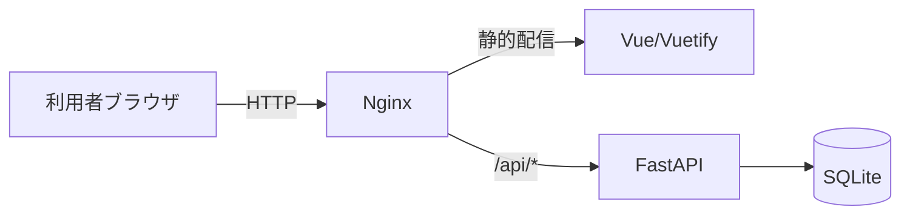
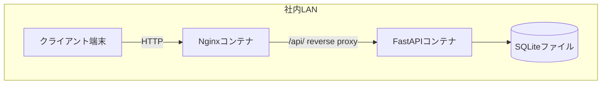
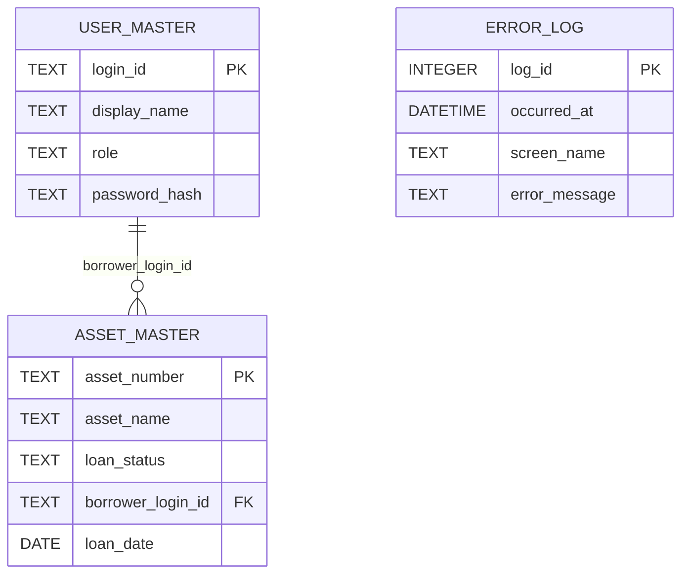
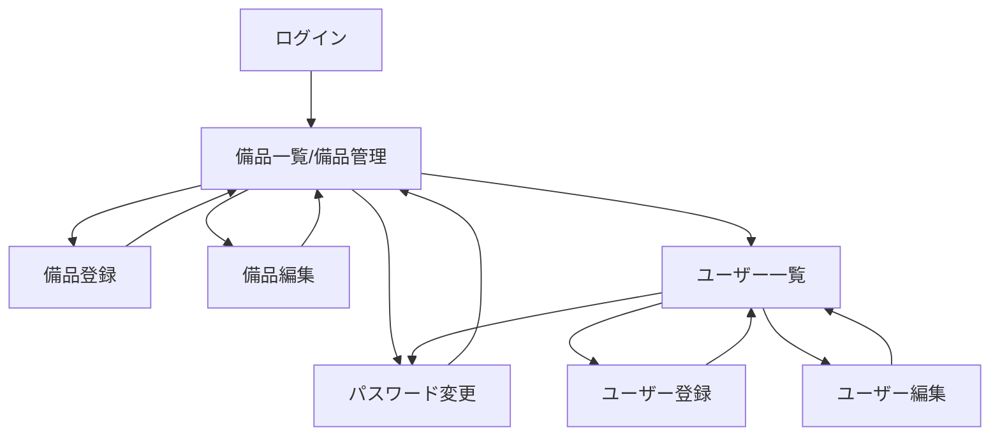
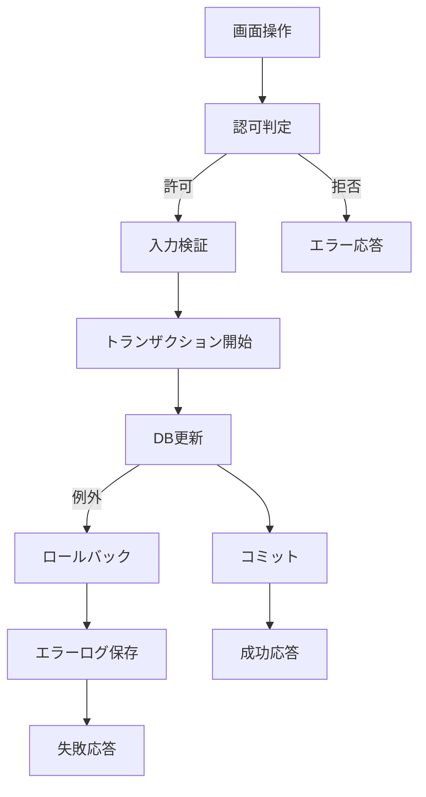
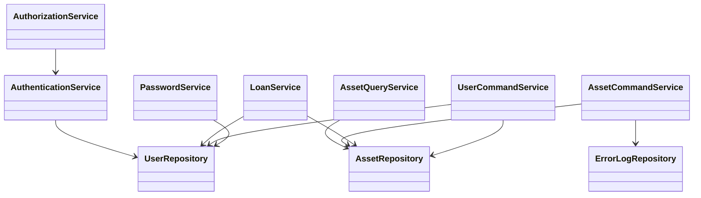
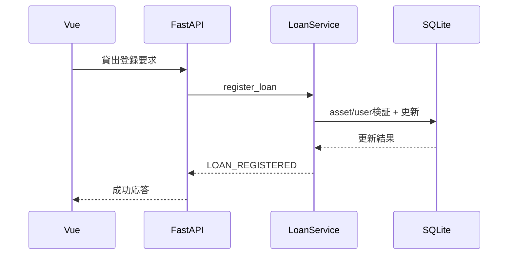

# 備品管理・貸出管理アプリ 詳細設計書

## 0. 設計前提

- 本設計は `docs/requirements.md` の全 `RQ-*`（`RQ-BK` / `RQ-BZ` 除く）を対象とし、要件除外は行わない。
- MVP方針として、要件にない機能は追加しない。
- 外部システム連携は行わないため、外部連携向け追加調査は不要である。

---

## 1. 言語・フレームワーク

| DS-ID | 項目 | 設計内容 | 選定理由 |
|---|---|---|---|
| `DS-MD-WEB-GUI-USE-UI-WEB-GUI-USE` | フロントエンド | Vue 3 + Vuetify | サブ画面構成（一覧・登録・編集・管理）を明確に分離して実装できるため |
| `DS-MD-WEB-GUI-USE-UI-WEB-GUI-USE` | バックエンド | FastAPI | `/api/` プレフィックスのAPIを明確に定義し、CRUD実装を最小で構成できるため |
| `DS-MD-WEB-GUI-USE-UI-WEB-GUI-USE` | フロント配信 | Vueをマルチステージビルドし、Nginxで静的配信する | 画面配信を安定化し、コンテナ起動を単純化できるため |
| `DS-MD-WEB-GUI-USE-UI-WEB-GUI-USE` | リバースプロキシ | Nginxで `/api/` をFastAPIへリバースプロキシする | UI配信とAPIアクセスを単一エントリポイントで提供するため |
| `DS-SC-USE-SQLITE-LOCAL-DB-DT-USE-SQLITE-LOCAL-DB` | DB | SQLite | 要件のデータ規模と運用条件に対して最小構成で成立するため |

---

## 2. システム構成

### 2-1. コンポーネント一覧

| DS-ID | コンポーネント名 | 役割 |
|---|---|---|
| `DS-MD-WEB-GUI-USE-UI-WEB-GUI-USE` | Frontend (Vue/Vuetify) | 画面表示、入力制御、行操作ボタン表示 |
| `DS-MD-WEB-GUI-USE-UI-WEB-GUI-USE` | Nginx | フロント配信と `/api/` 逆プロキシ |
| `DS-FN-AUTHENTICATE-USER-FT-AUTHENTICATE-USER` | FastAPI 認証層 | ログイン認証 |
| `DS-FN-AUTHORIZE-BY-ROLE-FT-AUTHORIZE-BY-ROLE` | FastAPI 認可層 | ロール別操作制御 |
| `DS-FN-VIEW-ASSET-LIST-FT-VIEW-ASSET-LIST` | FastAPI 備品一覧層 | 備品一覧取得 |
| `DS-FN-REGISTER-ASSET-FT-REGISTER-ASSET` | FastAPI 備品登録層 | 備品登録 |
| `DS-FN-UPDATE-ASSET-FT-UPDATE-ASSET` | FastAPI 備品更新層 | 備品編集 |
| `DS-FN-DELETE-ASSET-WITH-LOAN-CHECK-FT-DELETE-ASSET-WITH-LOAN-CHECK` | FastAPI 備品削除層 | 貸出中削除拒否付き削除 |
| `DS-FN-REGISTER-LOAN-FT-REGISTER-LOAN` | FastAPI 貸出層 | 貸出登録 |
| `DS-FN-REGISTER-RETURN-CLEAR-CURRENT-LOAN-FT-REGISTER-RETURN-CLEAR-CURRENT-LOAN` | FastAPI 返却層 | 返却登録 |
| `DS-FN-REGISTER-USER-FT-REGISTER-USER` | FastAPI ユーザー登録層 | ユーザー登録 |
| `DS-FN-UPDATE-USER-FT-UPDATE-USER` | FastAPI ユーザー更新層 | ユーザー編集 |
| `DS-FN-DELETE-USER-WITH-LOAN-CHECK-FT-DELETE-USER-WITH-LOAN-CHECK` | FastAPI ユーザー削除層 | 貸出保有時削除拒否付き削除 |
| `DS-FN-CHANGE-OWN-PASSWORD-FT-CHANGE-OWN-PASSWORD` | FastAPI PW変更層 | 利用者自己PW変更 |
| `DS-FN-RESET-USER-PASSWORD-FT-RESET-USER-PASSWORD` | FastAPI PW再設定層 | 管理者による初期PW再設定 |
| `DS-SC-ASSET-MASTER-INTERNAL-DATA-DT-ASSET-MASTER-INTERNAL-DATA` | SQLite 備品テーブル | 備品情報保持 |
| `DS-SC-USER-MASTER-INTERNAL-DATA-DT-USER-MASTER-INTERNAL-DATA` | SQLite ユーザーテーブル | ユーザー情報保持 |
| `DS-SC-ERROR-LOG-INTERNAL-DATA-DT-ERROR-LOG-INTERNAL-DATA` | SQLite エラーログテーブル | エラーログ保持 |

### 2-2. システム全体構成図



### 2-3. コンポーネント間インターフェース

| DS-ID | 送信元 | 宛先 | インターフェース | データ |
|---|---|---|---|---|
| `DS-MD-WEB-GUI-USE-UI-WEB-GUI-USE` | Vue | Nginx | HTTP | 画面リクエスト |
| `DS-MD-WEB-GUI-USE-UI-WEB-GUI-USE` | Vue | FastAPI | `/api/*` | JSON |
| `DS-SC-USE-SQLITE-LOCAL-DB-DT-USE-SQLITE-LOCAL-DB` | FastAPI | SQLite | SQLAlchemy接続 | CRUDデータ |

### 2-4. ネットワーク構成図



### 2-5. ネットワーク境界制御

| DS-ID | 制御項目 | 設計内容 |
|---|---|---|
| `DS-MD-LAN-ONLY-HTTP-ACCESS-NF-LAN-ONLY-HTTP-ACCESS` | 公開境界 | 画面公開先は社内ネットワーク内に限定し、インターネットからの直接到達を許可しない |
| `DS-MD-LAN-ONLY-HTTP-ACCESS-NF-LAN-ONLY-HTTP-ACCESS` | プロトコル | アプリ公開プロトコルはHTTPとし、社内ネットワーク境界で通信元を制御する |

---

## 3. データベース設計

### 3-1. DB必須性

| DS-ID | 判定 | 理由 |
|---|---|---|
| `DS-SC-DB-REQUIRED-FOR-UNIFIED-LEDGER-DT-DB-REQUIRED-FOR-UNIFIED-LEDGER` | 必須 | 単一台帳で整合性を維持するため |
| `DS-SC-NO-EXTERNAL-DATA-DT-NO-EXTERNAL-DATA` | 外部データ | 外部データは利用しない |
| `DS-IF-NO-EXTERNAL-DB-CONNECTION-DT-NO-EXTERNAL-DB-CONNECTION` | 外部DB | 接続しない |

### 3-2. テーブル設計

#### asset_master

| DS-ID | カラム | 型 | 制約 | 説明 |
|---|---|---|---|---|
| `DS-SC-ASSET-NUMBER-UNIQUE-DT-ASSET-NUMBER-UNIQUE` | asset_number | TEXT | PK, UNIQUE, NOT NULL | 資産管理番号 |
| `DS-SC-ASSET-ENTITY-DT-ASSET-ENTITY` | asset_name | TEXT | NOT NULL | 備品名 |
| `DS-SC-CURRENT-LOAN-STATE-INTERNAL-DATA-DT-CURRENT-LOAN-STATE-INTERNAL-DATA` | loan_status | TEXT | NOT NULL, CHECK(`貸出可能`,`貸出中`) | 貸出状態 |
| `DS-SC-BORROWER-MUST-BE-REGISTERED-USER-DT-BORROWER-MUST-BE-REGISTERED-USER` | borrower_login_id | TEXT | NULL, FK(user_master.login_id) | 借用者ログインID |
| `DS-SC-CURRENT-LOAN-STATE-INTERNAL-DATA-DT-CURRENT-LOAN-STATE-INTERNAL-DATA` | loan_date | DATE | NULL | 貸出日 |

#### user_master

| DS-ID | カラム | 型 | 制約 | 説明 |
|---|---|---|---|---|
| `DS-SC-LOGIN-ID-UNIQUE-DT-LOGIN-ID-UNIQUE` | login_id | TEXT | PK, UNIQUE, NOT NULL | ログインID |
| `DS-SC-USER-ENTITY-DT-USER-ENTITY` | display_name | TEXT | NOT NULL | 表示名 |
| `DS-SC-USER-ENTITY-DT-USER-ENTITY` | role | TEXT | NOT NULL, CHECK(`管理者`,`一般ユーザー`) | 権限 |
| `DS-MD-PASSWORD-HASH-STORAGE-NF-PASSWORD-HASH-STORAGE` | password_hash | TEXT | NOT NULL | ハッシュ化PW |

#### error_log

| DS-ID | カラム | 型 | 制約 | 説明 |
|---|---|---|---|---|
| `DS-SC-ERROR-LOG-INTERNAL-DATA-DT-ERROR-LOG-INTERNAL-DATA` | log_id | INTEGER | PK, AUTOINCREMENT | ログID |
| `DS-SC-ERROR-LOG-INTERNAL-DATA-DT-ERROR-LOG-INTERNAL-DATA` | occurred_at | DATETIME | NOT NULL | 発生時刻 |
| `DS-SC-ERROR-LOG-INTERNAL-DATA-DT-ERROR-LOG-INTERNAL-DATA` | screen_name | TEXT | NOT NULL | 画面名 |
| `DS-SC-ERROR-LOG-INTERNAL-DATA-DT-ERROR-LOG-INTERNAL-DATA` | error_message | TEXT | NOT NULL | エラー内容 |

### 3-3. リレーション図



### 3-4. エンティティ別操作定義（CRUD・一覧・詳細・検索・状態管理）

| DS-ID | エンティティ | Create | Read一覧 | Read詳細 | Update | Delete | 検索 | 状態管理 |
|---|---|---|---|---|---|---|---|---|
| `DS-SC-ASSET-ENTITY-DT-ASSET-ENTITY` | 備品 | ○ | ○ | × | ○ | △ | × | `貸出可能` / `貸出中` |
| `DS-SC-USER-ENTITY-DT-USER-ENTITY` | ユーザー | ○ | ○ | × | ○ | △ | × | `登録済み` / `削除` |

### 3-5. 保持期間・削除ルール

| DS-ID | 対象 | ルール |
|---|---|---|
| `DS-SC-ASSET-MASTER-RETENTION-UNTIL-DELETED-DT-ASSET-MASTER-RETENTION-UNTIL-DELETED` | 備品マスタ | 削除まで保持 |
| `DS-SC-USER-MASTER-RETENTION-UNTIL-DELETED-DT-USER-MASTER-RETENTION-UNTIL-DELETED` | ユーザーマスタ | 削除まで保持 |
| `DS-SC-CURRENT-LOAN-NO-HISTORY-RETENTION-DT-CURRENT-LOAN-NO-HISTORY-RETENTION` | 貸出情報 | 返却時に借用者と貸出日をクリアし履歴を残さない |
| `DS-SC-ERROR-LOG-RETENTION-90D-DT-ERROR-LOG-RETENTION-90D` | エラーログ | 90日保持 |

---

## 4. アーキテクチャ設計

### 4-1. 外部設計（UI）

#### 画面一覧

| DS-ID | 画面名 | 種別 | 主機能 |
|---|---|---|---|
| `DS-IF-LOGIN-SCREEN-UI-LOGIN-SCREEN` | ログイン画面 | 共通 | ログイン実行 |
| `DS-IF-ASSET-LIST-MANAGEMENT-SCREEN-UI-ASSET-LIST-MANAGEMENT-SCREEN` | 備品一覧/備品管理画面 | 一覧 | 備品一覧表示、行末ボタン操作（編集/削除/貸出登録/返却登録）、画面上部ナビゲーション（ユーザー一覧へ、パスワード変更へ） |
| `DS-IF-ASSET-LIST-MANAGEMENT-SCREEN-UI-ASSET-LIST-MANAGEMENT-SCREEN` | 備品登録画面 | 登録 | 備品登録 |
| `DS-IF-ASSET-LIST-MANAGEMENT-SCREEN-UI-ASSET-LIST-MANAGEMENT-SCREEN` | 備品編集画面 | 編集 | 備品編集 |
| `DS-IF-USER-MANAGEMENT-SCREEN-UI-USER-MANAGEMENT-SCREEN` | ユーザー一覧画面 | 一覧 | ユーザー一覧表示、行末ボタン操作（編集/削除）、画面上部ナビゲーション（備品一覧へ、パスワード変更へ） |
| `DS-IF-USER-MANAGEMENT-SCREEN-UI-USER-MANAGEMENT-SCREEN` | ユーザー登録画面 | 登録 | ユーザー登録 |
| `DS-IF-USER-MANAGEMENT-SCREEN-UI-USER-MANAGEMENT-SCREEN` | ユーザー編集画面 | 編集 | ユーザー編集 |
| `DS-IF-CHANGE-OWN-PASSWORD-SCREEN-FT-CHANGE-OWN-PASSWORD` | パスワード変更画面 | 編集 | 利用者自身のパスワード変更 |

#### 画面内ナビゲーション表示ルール

| DS-ID | 画面 | ナビゲーション要素 | 表示条件 |
|---|---|---|---|
| `DS-IF-ASSET-LIST-MANAGEMENT-SCREEN-UI-ASSET-LIST-MANAGEMENT-SCREEN` | 備品一覧/備品管理画面 | `ユーザー一覧へ` ボタン | 管理者のみ表示 |
| `DS-IF-ASSET-LIST-MANAGEMENT-SCREEN-UI-ASSET-LIST-MANAGEMENT-SCREEN` | 備品一覧/備品管理画面 | `パスワード変更へ` ボタン | 管理者/一般ユーザーに表示 |
| `DS-IF-USER-MANAGEMENT-SCREEN-UI-USER-MANAGEMENT-SCREEN` | ユーザー一覧画面 | `備品一覧へ` ボタン | 管理者のみ表示 |
| `DS-IF-USER-MANAGEMENT-SCREEN-UI-USER-MANAGEMENT-SCREEN` | ユーザー一覧画面 | `パスワード変更へ` ボタン | 管理者のみ表示 |

#### ナビゲーション固定配置ルール

| DS-ID | ルール | 設計内容 |
|---|---|---|
| `DS-IF-ASSET-LIST-MANAGEMENT-SCREEN-UI-ASSET-LIST-MANAGEMENT-SCREEN` | 配置位置 | 画面最上部に共通ヘッダーを固定し、左に画面タイトル、右に画面遷移ボタンを配置する |
| `DS-IF-USER-MANAGEMENT-SCREEN-UI-USER-MANAGEMENT-SCREEN` | ボタン順序 | ヘッダー右側の順序を `備品一覧へ` → `ユーザー登録画面へ` → `初期PW再設定` → `パスワード変更へ` に固定する |
| `DS-IF-ASSET-LIST-MANAGEMENT-SCREEN-UI-ASSET-LIST-MANAGEMENT-SCREEN` | ボタン順序 | ヘッダー右側の順序を `備品登録画面へ` → `ユーザー一覧へ` → `パスワード変更へ` に固定する |
| `DS-IF-CHANGE-OWN-PASSWORD-SCREEN-FT-CHANGE-OWN-PASSWORD` | 戻り遷移 | パスワード変更画面の `一覧へ戻る` は遷移元画面（備品一覧またはユーザー一覧）へ戻す |
| `DS-FN-AUTHORIZE-BY-ROLE-FT-AUTHORIZE-BY-ROLE` | 表示制御 | ナビゲーションボタンの表示可否はAPI認可結果に連動し、非許可ボタンは非表示にする |

#### 画面遷移図



#### AAモックアップ

備品一覧/備品管理画面（行末ボタン）

```text
+-----------------------------------------------------------------------------------------------------+
| 備品一覧                                                                                             |
| [備品登録画面へ] [ユーザー一覧へ(管理者のみ)] [パスワード変更へ]                                     |
| 資産番号 | 備品名 | 状態   | 借用者名 | 操作                                                      |
| A-001    | PC-01  | 貸出中 | 田中     | [編集] [削除] [貸出登録] [返却登録]                      |
| A-002    | iPad   | 貸出可能 | -      | [編集] [削除] [貸出登録] [返却登録]                      |
+-----------------------------------------------------------------------------------------------------+
```

ユーザー一覧画面（行末ボタン）

```text
+----------------------------------------------------------------------------------------------+
| ユーザー一覧                                                                                   |
| [備品一覧へ] [ユーザー登録画面へ] [初期PW再設定] [パスワード変更へ]                           |
| ログインID | 表示名 | 権限         | 操作                                                |
| tanaka     | 田中   | 一般ユーザー | [編集] [削除]                                      |
| admin      | 管理者 | 管理者       | [編集] [削除]                                      |
+----------------------------------------------------------------------------------------------+
```

備品登録画面

```text
+--------------------------------------------------+
| 備品登録                                          |
| 資産管理番号 [____________]                       |
| 備品名       [____________]                       |
| [登録] [一覧へ戻る]                               |
+--------------------------------------------------+
```

備品編集画面

```text
+--------------------------------------------------+
| 備品編集                                          |
| 資産管理番号 [A-001] (編集不可)                   |
| 備品名       [____________]                       |
| [更新] [一覧へ戻る]                               |
+--------------------------------------------------+
```

ユーザー登録画面

```text
+--------------------------------------------------+
| ユーザー登録                                      |
| ログインID [____________]                         |
| 表示名     [____________]                         |
| 権限       [管理者/一般ユーザー]                  |
| 初期PW     [____________]                         |
| [登録] [一覧へ戻る]                               |
+--------------------------------------------------+
```

ユーザー編集画面

```text
+--------------------------------------------------+
| ユーザー編集                                      |
| ログインID [tanaka] (編集不可)                    |
| 表示名     [____________]                         |
| 権限       [管理者/一般ユーザー]                  |
| [更新] [一覧へ戻る]                               |
+--------------------------------------------------+
```

パスワード変更画面

```text
+--------------------------------------------------+
| パスワード変更                                    |
| 現在のPW   [____________]                         |
| 新しいPW   [____________]                         |
| 新しいPW確認 [____________]                        |
| [変更] [一覧へ戻る]                               |
+--------------------------------------------------+
```

### 4-2. 外部設計（API）

APIはすべて `/api/` 配下で定義する。

| DS-ID | エンドポイント | 入力 | 出力 | バリデーション | エラー仕様 |
|---|---|---|---|---|---|
| `DS-FN-AUTHENTICATE-USER-FT-AUTHENTICATE-USER` | `POST /api/auth/login` | login_id, password | 認証結果、ロール | 必須・ユーザー存在・PW一致 | 401 認証失敗 |
| `DS-FN-AUTHORIZE-BY-ROLE-FT-AUTHORIZE-BY-ROLE` | `共通ガード` | token, action | 許可/拒否 | ロール確認 | 403 権限不足 |
| `DS-FN-VIEW-ASSET-LIST-FT-VIEW-ASSET-LIST` | `GET /api/assets` | なし | 備品一覧 | なし | 500 取得失敗 |
| `DS-FN-REGISTER-ASSET-FT-REGISTER-ASSET` | `POST /api/assets` | asset_number, asset_name | 登録結果 | 資産番号重複禁止 | 409 重複 |
| `DS-FN-UPDATE-ASSET-FT-UPDATE-ASSET` | `PUT /api/assets/{asset_number}` | asset_name | 更新結果 | 対象存在確認 | 404 未存在 |
| `DS-FN-DELETE-ASSET-WITH-LOAN-CHECK-FT-DELETE-ASSET-WITH-LOAN-CHECK` | `DELETE /api/assets/{asset_number}` | なし | 削除結果 | 貸出中削除禁止 | 409 削除不可 |
| `DS-FN-REGISTER-LOAN-FT-REGISTER-LOAN` | `POST /api/assets/{asset_number}/loan` | borrower_login_id, loan_date | 更新結果 | 状態=貸出可能、借用者存在 | 404 未存在（備品/借用者）, 409 条件不一致 |
| `DS-FN-REGISTER-RETURN-CLEAR-CURRENT-LOAN-FT-REGISTER-RETURN-CLEAR-CURRENT-LOAN` | `POST /api/assets/{asset_number}/return` | なし | 更新結果 | 状態=貸出中 | 409 条件不一致 |
| `DS-FN-REGISTER-USER-FT-REGISTER-USER` | `POST /api/users` | login_id, display_name, role, initial_password | 登録結果 | ログインID重複禁止 | 409 重複 |
| `DS-FN-UPDATE-USER-FT-UPDATE-USER` | `PUT /api/users/{login_id}` | display_name, role | 更新結果 | 対象存在確認 | 404 未存在 |
| `DS-FN-DELETE-USER-WITH-LOAN-CHECK-FT-DELETE-USER-WITH-LOAN-CHECK` | `DELETE /api/users/{login_id}` | なし | 削除結果 | 貸出中保有時削除禁止 | 409 削除不可 |
| `DS-FN-CHANGE-OWN-PASSWORD-FT-CHANGE-OWN-PASSWORD` | `POST /api/users/me/password` | old_password, new_password | 変更結果 | 旧PW一致 | 409 不一致 |
| `DS-FN-RESET-USER-PASSWORD-FT-RESET-USER-PASSWORD` | `POST /api/users/{login_id}/reset-password` | initial_password | 再設定結果 | 管理者権限 | 403 権限不足 |

### 4-3. 外部システム連携

| DS-ID | 設計 |
|---|---|
| `DS-IF-DISABLE-EXTERNAL-SYSTEM-INTEGRATION-EX-DISABLE-EXTERNAL-SYSTEM-INTEGRATION` | 外部システム連携は実装しない |

### 4-4. 外部DB連携

| DS-ID | 設計 |
|---|---|
| `DS-IF-NO-EXTERNAL-DB-CONNECTION-DT-NO-EXTERNAL-DB-CONNECTION` | 外部DBには接続しない |

### 4-5. 処理フロー図



### 4-6. トランザクション境界・排他制御

| DS-ID | 境界 | ロールバック条件 | 排他制御 |
|---|---|---|---|
| `DS-FN-REGISTER-ASSET-FT-REGISTER-ASSET` | 登録開始〜登録完了 | 重複・DB例外 | SQLite書込ロック |
| `DS-FN-UPDATE-ASSET-FT-UPDATE-ASSET` | 更新開始〜更新完了 | 未存在・DB例外 | SQLite書込ロック |
| `DS-FN-DELETE-ASSET-WITH-LOAN-CHECK-FT-DELETE-ASSET-WITH-LOAN-CHECK` | 削除判定〜削除完了 | 貸出中・DB例外 | SQLite書込ロック |
| `DS-FN-REGISTER-LOAN-FT-REGISTER-LOAN` | 貸出判定〜更新完了 | 状態不一致・未存在・DB例外 | SQLite書込ロック |
| `DS-FN-REGISTER-RETURN-CLEAR-CURRENT-LOAN-FT-REGISTER-RETURN-CLEAR-CURRENT-LOAN` | 返却判定〜更新完了 | 状態不一致・DB例外 | SQLite書込ロック |
| `DS-FN-REGISTER-USER-FT-REGISTER-USER` | 登録開始〜登録完了 | 重複・DB例外 | SQLite書込ロック |
| `DS-FN-UPDATE-USER-FT-UPDATE-USER` | 更新開始〜更新完了 | 未存在・DB例外 | SQLite書込ロック |
| `DS-FN-DELETE-USER-WITH-LOAN-CHECK-FT-DELETE-USER-WITH-LOAN-CHECK` | 削除判定〜削除完了 | 貸出保有・DB例外 | SQLite書込ロック |
| `DS-FN-CHANGE-OWN-PASSWORD-FT-CHANGE-OWN-PASSWORD` | 本人確認〜更新完了 | 旧PW不一致・DB例外 | SQLite書込ロック |
| `DS-FN-RESET-USER-PASSWORD-FT-RESET-USER-PASSWORD` | 管理者確認〜更新完了 | 権限不足・未存在・DB例外 | SQLite書込ロック |

### 4-7. バッチ設計

| DS-ID | バッチ名 | 実行タイミング | 処理 |
|---|---|---|---|
| `DS-BT-ERROR-LOG-RETENTION-90D-OP-ERROR-LOG-RETENTION-90D` | エラーログ削除バッチ | 日次1回 | 90日超のエラーログを削除 |

---

## 5. クラス設計

### 5-1. クラス一覧（SOLID適合）

| DS-ID | クラス名 | 責務 | S | O | L | I | D |
|---|---|---|---|---|---|---|---|
| `DS-FN-AUTHENTICATE-USER-FT-AUTHENTICATE-USER` | AuthenticationService | 認証処理 | 適合 | 適合 | 適合 | 適合 | 適合 |
| `DS-FN-AUTHORIZE-BY-ROLE-FT-AUTHORIZE-BY-ROLE` | AuthorizationService | 認可処理 | 適合 | 適合 | 適合 | 適合 | 適合 |
| `DS-FN-VIEW-ASSET-LIST-FT-VIEW-ASSET-LIST` | AssetQueryService | 備品一覧取得 | 適合 | 適合 | 適合 | 適合 | 適合 |
| `DS-FN-REGISTER-ASSET-FT-REGISTER-ASSET` | AssetCommandService | 備品登録 | 適合 | 適合 | 適合 | 適合 | 適合 |
| `DS-FN-UPDATE-ASSET-FT-UPDATE-ASSET` | AssetCommandService | 備品編集 | 適合 | 適合 | 適合 | 適合 | 適合 |
| `DS-FN-DELETE-ASSET-WITH-LOAN-CHECK-FT-DELETE-ASSET-WITH-LOAN-CHECK` | AssetCommandService | 備品削除 | 適合 | 適合 | 適合 | 適合 | 適合 |
| `DS-FN-REGISTER-LOAN-FT-REGISTER-LOAN` | LoanService | 貸出登録 | 適合 | 適合 | 適合 | 適合 | 適合 |
| `DS-FN-REGISTER-RETURN-CLEAR-CURRENT-LOAN-FT-REGISTER-RETURN-CLEAR-CURRENT-LOAN` | LoanService | 返却登録 | 適合 | 適合 | 適合 | 適合 | 適合 |
| `DS-FN-REGISTER-USER-FT-REGISTER-USER` | UserCommandService | ユーザー登録 | 適合 | 適合 | 適合 | 適合 | 適合 |
| `DS-FN-UPDATE-USER-FT-UPDATE-USER` | UserCommandService | ユーザー編集 | 適合 | 適合 | 適合 | 適合 | 適合 |
| `DS-FN-DELETE-USER-WITH-LOAN-CHECK-FT-DELETE-USER-WITH-LOAN-CHECK` | UserCommandService | ユーザー削除 | 適合 | 適合 | 適合 | 適合 | 適合 |
| `DS-FN-CHANGE-OWN-PASSWORD-FT-CHANGE-OWN-PASSWORD` | PasswordService | 自己PW変更 | 適合 | 適合 | 適合 | 適合 | 適合 |
| `DS-FN-RESET-USER-PASSWORD-FT-RESET-USER-PASSWORD` | PasswordService | 管理者PW再設定 | 適合 | 適合 | 適合 | 適合 | 適合 |
| `DS-SC-ASSET-ENTITY-DT-ASSET-ENTITY` | AssetRepository | 備品永続化 | 適合 | 適合 | 適合 | 適合 | 適合 |
| `DS-SC-USER-ENTITY-DT-USER-ENTITY` | UserRepository | ユーザー永続化 | 適合 | 適合 | 適合 | 適合 | 適合 |
| `DS-SC-ERROR-LOG-INTERNAL-DATA-DT-ERROR-LOG-INTERNAL-DATA` | ErrorLogRepository | エラーログ永続化 | 適合 | 適合 | 適合 | 適合 | 適合 |

### 5-2. クラス図



### 5-3. システム内メッセージ一覧

| DS-ID | メッセージ | 用途 |
|---|---|---|
| `DS-FN-AUTHENTICATE-USER-FT-AUTHENTICATE-USER` | AUTH_FAILED | 認証失敗通知 |
| `DS-FN-AUTHORIZE-BY-ROLE-FT-AUTHORIZE-BY-ROLE` | FORBIDDEN_OPERATION | 権限不足通知 |
| `DS-FN-DELETE-ASSET-WITH-LOAN-CHECK-FT-DELETE-ASSET-WITH-LOAN-CHECK` | ASSET_DELETE_BLOCKED | 貸出中削除拒否通知 |
| `DS-FN-DELETE-USER-WITH-LOAN-CHECK-FT-DELETE-USER-WITH-LOAN-CHECK` | USER_DELETE_BLOCKED | 貸出保有削除拒否通知 |
| `DS-FN-REGISTER-LOAN-FT-REGISTER-LOAN` | LOAN_REGISTERED | 貸出登録完了通知 |
| `DS-FN-REGISTER-RETURN-CLEAR-CURRENT-LOAN-FT-REGISTER-RETURN-CLEAR-CURRENT-LOAN` | RETURN_REGISTERED | 返却登録完了通知 |

### 5-4. メッセージフロー図



---

## 6. その他設計

### 6-1. エラーハンドリング設計

| DS-ID | 想定エラー | 条件 | 対応 |
|---|---|---|---|
| `DS-FN-AUTHENTICATE-USER-FT-AUTHENTICATE-USER` | 認証失敗 | ID/PW不一致 | 401で拒否 |
| `DS-FN-AUTHORIZE-BY-ROLE-FT-AUTHORIZE-BY-ROLE` | 権限不足 | 一般ユーザー更新操作 | 403で拒否 |
| `DS-FN-REGISTER-ASSET-FT-REGISTER-ASSET` | 重複登録 | 資産番号重複 | 409で拒否 |
| `DS-FN-REGISTER-USER-FT-REGISTER-USER` | 重複登録 | ログインID重複 | 409で拒否 |
| `DS-FN-DELETE-ASSET-WITH-LOAN-CHECK-FT-DELETE-ASSET-WITH-LOAN-CHECK` | 削除不可 | 貸出中備品 | 409で拒否 |
| `DS-FN-DELETE-USER-WITH-LOAN-CHECK-FT-DELETE-USER-WITH-LOAN-CHECK` | 削除不可 | 貸出保有ユーザー | 409で拒否 |
| `DS-MD-ERROR-LOG-CAPTURE-OP-ERROR-LOG-CAPTURE` | システム例外 | DB例外等 | error_logに記録して500応答 |

### 6-2. セキュリティ設計

| DS-ID | 設計項目 | 内容 |
|---|---|---|
| `DS-MD-ROLE-BASED-AUTHORIZATION-NF-ROLE-BASED-AUTHORIZATION` | 認可 | 管理者のみ更新系APIを実行可能 |
| `DS-MD-LAN-ONLY-HTTP-ACCESS-NF-LAN-ONLY-HTTP-ACCESS` | 通信経路 | 社内LAN内HTTPのみ許可 |
| `DS-MD-PASSWORD-HASH-STORAGE-NF-PASSWORD-HASH-STORAGE` | 認証情報保護 | PWはハッシュ化して保存 |
| `DS-MD-PASSWORD-COMPLEXITY-RULE-NONE-NF-PASSWORD-COMPLEXITY-RULE-NONE` | PW制約 | 文字数・文字種制約を設けない |
| `DS-MD-AUDIT-LOG-NOT-REQUIRED-OP-AUDIT-LOG-NOT-REQUIRED` | 監査ログ | 監査ログは設計対象外 |

---

## 7. コード設計

### 7-1. ディレクトリ構成（AA）

```text
/
├─ docs/
│  ├─ requirements.md
│  └─ detail_design.md
├─ backend/
│  ├─ app/
│  │  └─ main.py
│  └─ batch/
│     └─ purge_error_logs.py
├─ frontend/
│  ├─ src/
│  │  ├─ views/
│  │  ├─ components/
│  │  ├─ router/
│  │  ├─ services/
│  │  ├─ App.vue
│  │  └─ main.js
│  ├─ nginx.conf
│  └─ Dockerfile
└─ e2e/
   ├─ tests/
   │  └─ asset-lending.spec.js
   └─ playwright.config.js
```

### 7-2. ファイル一覧・役割・クラス

| ディレクトリ | ファイル名 | 役割 | 含まれるクラス/機能 | 関係DS-ID |
|---|---|---|---|---|
| `frontend/src` | `main.js` | フロントエンドエントリポイント | Vue/Vuetify初期化、ルーター組込 | `DS-MD-WEB-GUI-USE-UI-WEB-GUI-USE` |
| `frontend/src` | `App.vue` | ルーター描画ホスト | 画面ルーティング表示 | `DS-MD-WEB-GUI-USE-UI-WEB-GUI-USE` |
| `frontend/src/router` | `index.js` | 画面ルート定義 | ログイン・備品・ユーザー・PW変更画面ルーティング | `DS-MD-WEB-GUI-USE-UI-WEB-GUI-USE` |
| `frontend/src/services` | `api.js` | API呼び出し共通化 | 認証ヘッダー付与、JSON送受信、エラー処理 | `DS-FN-AUTHENTICATE-USER-FT-AUTHENTICATE-USER`, `DS-FN-AUTHORIZE-BY-ROLE-FT-AUTHORIZE-BY-ROLE` |
| `frontend/src/components` | `MainNavigationBar.vue` | 画面上部共通ナビゲーション | 画面遷移ボタン表示制御、ログアウト | `DS-IF-ASSET-LIST-MANAGEMENT-SCREEN-UI-ASSET-LIST-MANAGEMENT-SCREEN`, `DS-IF-USER-MANAGEMENT-SCREEN-UI-USER-MANAGEMENT-SCREEN`, `DS-FN-AUTHORIZE-BY-ROLE-FT-AUTHORIZE-BY-ROLE` |
| `frontend/src/views` | `LoginView.vue` | ログイン画面 | ログインフォーム | `DS-IF-LOGIN-SCREEN-UI-LOGIN-SCREEN` |
| `frontend/src/views` | `AssetListView.vue` | 備品一覧画面 | 一覧表示、行末操作ボタン | `DS-IF-ASSET-LIST-MANAGEMENT-SCREEN-UI-ASSET-LIST-MANAGEMENT-SCREEN` |
| `frontend/src/views` | `AssetCreateView.vue` | 備品登録画面 | 登録フォーム | `DS-IF-ASSET-LIST-MANAGEMENT-SCREEN-UI-ASSET-LIST-MANAGEMENT-SCREEN` |
| `frontend/src/views` | `AssetEditView.vue` | 備品編集画面 | 編集フォーム | `DS-IF-ASSET-LIST-MANAGEMENT-SCREEN-UI-ASSET-LIST-MANAGEMENT-SCREEN` |
| `frontend/src/views` | `UserListView.vue` | ユーザー一覧画面 | 一覧表示、行末操作ボタン | `DS-IF-USER-MANAGEMENT-SCREEN-UI-USER-MANAGEMENT-SCREEN` |
| `frontend/src/views` | `UserCreateView.vue` | ユーザー登録画面 | 登録フォーム | `DS-IF-USER-MANAGEMENT-SCREEN-UI-USER-MANAGEMENT-SCREEN` |
| `frontend/src/views` | `UserEditView.vue` | ユーザー編集画面 | 編集フォーム | `DS-IF-USER-MANAGEMENT-SCREEN-UI-USER-MANAGEMENT-SCREEN` |
| `frontend/src/views` | `PasswordChangeView.vue` | パスワード変更画面 | PW変更フォーム | `DS-IF-CHANGE-OWN-PASSWORD-SCREEN-FT-CHANGE-OWN-PASSWORD` |
| `backend/app` | `main.py` | FastAPI本体（API集約） | 認証/認可、備品CRUD、貸出返却、ユーザーCRUD、PW変更/再設定、DB初期化、エラーログ記録 | `DS-MD-WEB-GUI-USE-UI-WEB-GUI-USE`, `DS-FN-AUTHENTICATE-USER-FT-AUTHENTICATE-USER`, `DS-FN-AUTHORIZE-BY-ROLE-FT-AUTHORIZE-BY-ROLE`, `DS-FN-VIEW-ASSET-LIST-FT-VIEW-ASSET-LIST`, `DS-FN-REGISTER-ASSET-FT-REGISTER-ASSET`, `DS-FN-UPDATE-ASSET-FT-UPDATE-ASSET`, `DS-FN-DELETE-ASSET-WITH-LOAN-CHECK-FT-DELETE-ASSET-WITH-LOAN-CHECK`, `DS-FN-REGISTER-LOAN-FT-REGISTER-LOAN`, `DS-FN-REGISTER-RETURN-CLEAR-CURRENT-LOAN-FT-REGISTER-RETURN-CLEAR-CURRENT-LOAN`, `DS-FN-REGISTER-USER-FT-REGISTER-USER`, `DS-FN-UPDATE-USER-FT-UPDATE-USER`, `DS-FN-DELETE-USER-WITH-LOAN-CHECK-FT-DELETE-USER-WITH-LOAN-CHECK`, `DS-FN-CHANGE-OWN-PASSWORD-FT-CHANGE-OWN-PASSWORD`, `DS-FN-RESET-USER-PASSWORD-FT-RESET-USER-PASSWORD`, `DS-MD-ERROR-LOG-CAPTURE-OP-ERROR-LOG-CAPTURE` |
| `backend/batch` | `purge_error_logs.py` | ログ削除バッチ | 90日超ログ削除 | `DS-BT-ERROR-LOG-RETENTION-90D-OP-ERROR-LOG-RETENTION-90D` |
| `frontend` | `nginx.conf` | フロント配信/逆プロキシ設定 | 静的配信、`/api/` をバックエンドへ中継 | `DS-MD-WEB-GUI-USE-UI-WEB-GUI-USE`, `DS-MD-LAN-ONLY-HTTP-ACCESS-NF-LAN-ONLY-HTTP-ACCESS` |
| `e2e/tests` | `asset-lending.spec.js` | E2Eシナリオ実装 | 管理者正常系、一般ユーザー閲覧、PW変更/再設定、権限拒否、削除禁止 | `DS-MD-VERIFY-ADMIN-REGISTER-LOAN-RETURN-TS-VERIFY-ADMIN-REGISTER-LOAN-RETURN`, `DS-MD-VERIFY-GENERAL-USER-VIEW-BORROWER-TS-VERIFY-GENERAL-USER-VIEW-BORROWER`, `DS-MD-VERIFY-PASSWORD-CHANGE-AND-RESET-TS-VERIFY-PASSWORD-CHANGE-AND-RESET`, `DS-MD-REJECT-PRIVILEGE-VIOLATION-TS-REJECT-PRIVILEGE-VIOLATION`, `DS-MD-REJECT-DELETE-WHEN-LOAN-EXISTS-TS-REJECT-DELETE-WHEN-LOAN-EXISTS` |
| `e2e` | `playwright.config.js` | E2E実行設定 | ベースURL、タイムアウト、トレース設定 | `DS-MD-WEB-GUI-USE-UI-WEB-GUI-USE` |
| `/` | `docker-compose.yml` | コンテナ起動定義 | backend/frontend/test_playwright の構成定義 | `DS-MD-WEB-GUI-USE-UI-WEB-GUI-USE` |

### 7-3. コーディング規約

| 区分 | 規約 |
|---|---|
| Vue | Composition API、画面ごとの責務分割、共通ボタン部品を再利用 |
| Vuetify | 一覧は `v-data-table` を使用し、行末操作列を固定化 |
| FastAPI | `/api/` ルート統一、Pydanticで入力検証 |
| Python | 型ヒント必須、例外時はエラーログ記録を必須 |
| 重複防止 | 権限制御と入力検証を共通層へ集約し、再実装禁止 |

---

## 8. テスト設計

### 8-1. テスト種別

| DS-ID | テスト種別 | 目的 | 方法 |
|---|---|---|---|
| `DS-MD-VERIFY-ADMIN-REGISTER-LOAN-RETURN-TS-VERIFY-ADMIN-REGISTER-LOAN-RETURN` | E2E | 管理者正常系検証 | Playwright |
| `DS-MD-VERIFY-GENERAL-USER-VIEW-BORROWER-TS-VERIFY-GENERAL-USER-VIEW-BORROWER` | E2E | 一般ユーザー閲覧検証 | Playwright |
| `DS-MD-VERIFY-PASSWORD-CHANGE-AND-RESET-TS-VERIFY-PASSWORD-CHANGE-AND-RESET` | E2E | PW変更/再設定検証 | Playwright |
| `DS-MD-REJECT-PRIVILEGE-VIOLATION-TS-REJECT-PRIVILEGE-VIOLATION` | E2E | 権限拒否検証 | Playwright |
| `DS-MD-REJECT-DELETE-WHEN-LOAN-EXISTS-TS-REJECT-DELETE-WHEN-LOAN-EXISTS` | E2E | 削除禁止検証 | Playwright |
| `DS-MD-ASSET-LIST-RESPONSE-UNDER-2S-NF-ASSET-LIST-RESPONSE-UNDER-2S` | 非機能確認 | 一覧応答2秒以内確認 | 画面操作による手動実測 |
| `DS-MD-CONCURRENT-USERS-10-NF-CONCURRENT-USERS-10` | 非機能確認 | 同時10人利用確認 | 同時アクセスによる手動確認 |

### 8-2. 自動テスト資産

- `e2e/tests/asset-lending.spec.js`
  - 管理者の備品登録・貸出・返却が成立する
  - 一般ユーザーが借用者表示を確認できる
  - 自己PW変更と管理者初期PW再設定が成立する
  - 一般ユーザーの更新系操作が拒否される
  - 貸出中データの削除が拒否される

### 8-3. テスト実行方法

- E2E実行コマンドは以下とする。
- `docker compose run --rm test_playwright sh -c "cd e2e && npm install && npx playwright test"`

---

## 9. 運用設計

| DS-ID | 項目 | 設計内容 |
|---|---|---|
| `DS-MD-WEB-GUI-USE-UI-WEB-GUI-USE` | 基本起動方式 | docker compose を基本起動方式とする |
| `DS-SC-USE-SQLITE-LOCAL-DB-DT-USE-SQLITE-LOCAL-DB` | 初期化 | 起動時にSQLiteスキーマを自動作成する |
| `DS-MD-INITIAL-LEDGER-MANUAL-REGISTRATION-OP-INITIAL-LEDGER-MANUAL-REGISTRATION` | 初期台帳統一 | 管理者が既存台帳を手動再登録する |
| `DS-MD-BACKUP-NOT-REQUIRED-REINPUT-ACCEPTED-OP-BACKUP-NOT-REQUIRED-REINPUT-ACCEPTED` | 障害時運用 | バックアップせず再入力で復旧する |

起動方法と操作説明は `README.md` に必ず記載する。

---

## 10. ログ・監視・アラート設計

### 10-1. ログ設計必須性

| DS-ID | 判定 | 内容 |
|---|---|---|
| `DS-MD-ERROR-LOG-CAPTURE-OP-ERROR-LOG-CAPTURE` | 必須 | 例外時に画面名・時刻・メッセージを記録する |
| `DS-BT-ERROR-LOG-RETENTION-90D-OP-ERROR-LOG-RETENTION-90D` | 必須 | 日次で90日超ログを削除する |
| `DS-MD-AUDIT-LOG-NOT-REQUIRED-OP-AUDIT-LOG-NOT-REQUIRED` | 不要 | 監査ログは記録しない |

### 10-2. 監視・アラート設計必須性

`DS-MD-MONITORING-ALERT-NOT-REQUIRED-OP-MONITORING-ALERT-NOT-REQUIRED` に基づき、監視・アラートの設計は必須ではないため、監視・アラートの内容と対応方法の記述は行わない。

---

## 11. E2Eテスト設計

### 11-1. 要件シナリオ網羅表

| DS-ID | 目的 | 前提条件 | 手順 | 期待結果 |
|---|---|---|---|---|
| `DS-MD-VERIFY-ADMIN-REGISTER-LOAN-RETURN-TS-VERIFY-ADMIN-REGISTER-LOAN-RETURN` | 管理者正常操作確認 | 管理者ログイン済み | 備品登録→貸出登録→返却登録 | 返却後に借用者/貸出日がクリアされる |
| `DS-MD-VERIFY-GENERAL-USER-VIEW-BORROWER-TS-VERIFY-GENERAL-USER-VIEW-BORROWER` | 一般ユーザー確認操作検証 | 貸出中備品あり | 一覧表示 | 借用者名が表示される |
| `DS-MD-VERIFY-PASSWORD-CHANGE-AND-RESET-TS-VERIFY-PASSWORD-CHANGE-AND-RESET` | PW運用検証 | 対象ユーザー存在 | 自己変更→再ログイン→管理者再設定→再ログイン | 2回とも成功する |
| `DS-MD-REJECT-PRIVILEGE-VIOLATION-TS-REJECT-PRIVILEGE-VIOLATION` | 権限違反拒否検証 | 一般ユーザーログイン済み | 更新系操作を実行 | 操作拒否される |
| `DS-MD-REJECT-DELETE-WHEN-LOAN-EXISTS-TS-REJECT-DELETE-WHEN-LOAN-EXISTS` | 削除制約検証 | 貸出中備品あり | 備品削除・ユーザー削除 | どちらも拒否される |

### 11-2. test_playwright サービス設計

| 項目 | 設計内容 |
|---|---|
| イメージ | `mcr.microsoft.com/playwright:v1.59.0` |
| プロファイル | `test` |
| 起動条件 | 通常起動では起動しない |
| マウント | `e2e` ディレクトリをマウントする |
| URL | composeサービス名ベースで指定する |

### 11-3. E2E実行コマンド

`docker compose run --rm test_playwright sh -c "npm install && npx playwright test"`

### 11-4. E2E運用方針

- テスト資産はプロジェクトルート `e2e` 配下に配置する。
- 外部連携がないため `mock` / `real` モードの分割は行わない。
- 実装時・CI時とも、定義済みE2E全件通過を必須とする。
- 失敗時は修正・再実行を繰り返し、全件成功まで継続する。

---

## 12. 削除可能要素の整理（冗長排除）

| 削除した設計要素 | 理由 |
|---|---|
| 備品検索API/画面要素 | 要件で検索なし |
| 貸出履歴テーブル | 要件で履歴保持なし |
| 外部連携アダプタ | 要件で外部連携なし |
| 監視・アラート処理 | 要件で不要 |
| 監査ログ収集処理 | 要件で不要 |

同一意味処理の再実装を防ぐため、認可判定、入力検証、エラー記録は共通サービスで一元化する。

---

## 13. RQ-DS対応表

| RQ-ID | DS-ID |
|---|---|
| `RQ-UI-WEB-GUI-USE` | `DS-MD-WEB-GUI-USE-UI-WEB-GUI-USE` |
| `RQ-UI-LOGIN-SCREEN` | `DS-IF-LOGIN-SCREEN-UI-LOGIN-SCREEN` |
| `RQ-UI-ASSET-LIST-MANAGEMENT-SCREEN` | `DS-IF-ASSET-LIST-MANAGEMENT-SCREEN-UI-ASSET-LIST-MANAGEMENT-SCREEN` |
| `RQ-UI-USER-MANAGEMENT-SCREEN` | `DS-IF-USER-MANAGEMENT-SCREEN-UI-USER-MANAGEMENT-SCREEN` |
| `RQ-FT-AUTHENTICATE-USER` | `DS-FN-AUTHENTICATE-USER-FT-AUTHENTICATE-USER` |
| `RQ-FT-AUTHORIZE-BY-ROLE` | `DS-FN-AUTHORIZE-BY-ROLE-FT-AUTHORIZE-BY-ROLE` |
| `RQ-FT-VIEW-ASSET-LIST` | `DS-FN-VIEW-ASSET-LIST-FT-VIEW-ASSET-LIST` |
| `RQ-FT-REGISTER-LOAN` | `DS-FN-REGISTER-LOAN-FT-REGISTER-LOAN` |
| `RQ-FT-REGISTER-RETURN-CLEAR-CURRENT-LOAN` | `DS-FN-REGISTER-RETURN-CLEAR-CURRENT-LOAN-FT-REGISTER-RETURN-CLEAR-CURRENT-LOAN` |
| `RQ-FT-REGISTER-ASSET` | `DS-FN-REGISTER-ASSET-FT-REGISTER-ASSET` |
| `RQ-FT-UPDATE-ASSET` | `DS-FN-UPDATE-ASSET-FT-UPDATE-ASSET` |
| `RQ-FT-DELETE-ASSET-WITH-LOAN-CHECK` | `DS-FN-DELETE-ASSET-WITH-LOAN-CHECK-FT-DELETE-ASSET-WITH-LOAN-CHECK` |
| `RQ-FT-REGISTER-USER` | `DS-FN-REGISTER-USER-FT-REGISTER-USER` |
| `RQ-FT-UPDATE-USER` | `DS-FN-UPDATE-USER-FT-UPDATE-USER` |
| `RQ-FT-DELETE-USER-WITH-LOAN-CHECK` | `DS-FN-DELETE-USER-WITH-LOAN-CHECK-FT-DELETE-USER-WITH-LOAN-CHECK` |
| `RQ-FT-CHANGE-OWN-PASSWORD` | `DS-FN-CHANGE-OWN-PASSWORD-FT-CHANGE-OWN-PASSWORD` |
| `RQ-FT-CHANGE-OWN-PASSWORD` | `DS-IF-CHANGE-OWN-PASSWORD-SCREEN-FT-CHANGE-OWN-PASSWORD` |
| `RQ-FT-RESET-USER-PASSWORD` | `DS-FN-RESET-USER-PASSWORD-FT-RESET-USER-PASSWORD` |
| `RQ-EX-DISABLE-EXTERNAL-SYSTEM-INTEGRATION` | `DS-IF-DISABLE-EXTERNAL-SYSTEM-INTEGRATION-EX-DISABLE-EXTERNAL-SYSTEM-INTEGRATION` |
| `RQ-OP-ERROR-LOG-CAPTURE` | `DS-MD-ERROR-LOG-CAPTURE-OP-ERROR-LOG-CAPTURE` |
| `RQ-OP-ERROR-LOG-RETENTION-90D` | `DS-BT-ERROR-LOG-RETENTION-90D-OP-ERROR-LOG-RETENTION-90D` |
| `RQ-OP-AUDIT-LOG-NOT-REQUIRED` | `DS-MD-AUDIT-LOG-NOT-REQUIRED-OP-AUDIT-LOG-NOT-REQUIRED` |
| `RQ-OP-MONITORING-ALERT-NOT-REQUIRED` | `DS-MD-MONITORING-ALERT-NOT-REQUIRED-OP-MONITORING-ALERT-NOT-REQUIRED` |
| `RQ-OP-INITIAL-LEDGER-MANUAL-REGISTRATION` | `DS-MD-INITIAL-LEDGER-MANUAL-REGISTRATION-OP-INITIAL-LEDGER-MANUAL-REGISTRATION` |
| `RQ-OP-BACKUP-NOT-REQUIRED-REINPUT-ACCEPTED` | `DS-MD-BACKUP-NOT-REQUIRED-REINPUT-ACCEPTED-OP-BACKUP-NOT-REQUIRED-REINPUT-ACCEPTED` |
| `RQ-DT-ASSET-MASTER-INTERNAL-DATA` | `DS-SC-ASSET-MASTER-INTERNAL-DATA-DT-ASSET-MASTER-INTERNAL-DATA` |
| `RQ-DT-USER-MASTER-INTERNAL-DATA` | `DS-SC-USER-MASTER-INTERNAL-DATA-DT-USER-MASTER-INTERNAL-DATA` |
| `RQ-DT-CURRENT-LOAN-STATE-INTERNAL-DATA` | `DS-SC-CURRENT-LOAN-STATE-INTERNAL-DATA-DT-CURRENT-LOAN-STATE-INTERNAL-DATA` |
| `RQ-DT-ERROR-LOG-INTERNAL-DATA` | `DS-SC-ERROR-LOG-INTERNAL-DATA-DT-ERROR-LOG-INTERNAL-DATA` |
| `RQ-DT-NO-EXTERNAL-DATA` | `DS-SC-NO-EXTERNAL-DATA-DT-NO-EXTERNAL-DATA` |
| `RQ-DT-ASSET-MASTER-RETENTION-UNTIL-DELETED` | `DS-SC-ASSET-MASTER-RETENTION-UNTIL-DELETED-DT-ASSET-MASTER-RETENTION-UNTIL-DELETED` |
| `RQ-DT-USER-MASTER-RETENTION-UNTIL-DELETED` | `DS-SC-USER-MASTER-RETENTION-UNTIL-DELETED-DT-USER-MASTER-RETENTION-UNTIL-DELETED` |
| `RQ-DT-CURRENT-LOAN-NO-HISTORY-RETENTION` | `DS-SC-CURRENT-LOAN-NO-HISTORY-RETENTION-DT-CURRENT-LOAN-NO-HISTORY-RETENTION` |
| `RQ-DT-ERROR-LOG-RETENTION-90D` | `DS-SC-ERROR-LOG-RETENTION-90D-DT-ERROR-LOG-RETENTION-90D` |
| `RQ-DT-NO-EXTERNAL-DB-CONNECTION` | `DS-IF-NO-EXTERNAL-DB-CONNECTION-DT-NO-EXTERNAL-DB-CONNECTION` |
| `RQ-DT-USE-SQLITE-LOCAL-DB` | `DS-SC-USE-SQLITE-LOCAL-DB-DT-USE-SQLITE-LOCAL-DB` |
| `RQ-DT-DB-REQUIRED-FOR-UNIFIED-LEDGER` | `DS-SC-DB-REQUIRED-FOR-UNIFIED-LEDGER-DT-DB-REQUIRED-FOR-UNIFIED-LEDGER` |
| `RQ-DT-ASSET-ENTITY` | `DS-SC-ASSET-ENTITY-DT-ASSET-ENTITY` |
| `RQ-DT-USER-ENTITY` | `DS-SC-USER-ENTITY-DT-USER-ENTITY` |
| `RQ-DT-ASSET-NUMBER-UNIQUE` | `DS-SC-ASSET-NUMBER-UNIQUE-DT-ASSET-NUMBER-UNIQUE` |
| `RQ-DT-LOGIN-ID-UNIQUE` | `DS-SC-LOGIN-ID-UNIQUE-DT-LOGIN-ID-UNIQUE` |
| `RQ-DT-BORROWER-MUST-BE-REGISTERED-USER` | `DS-SC-BORROWER-MUST-BE-REGISTERED-USER-DT-BORROWER-MUST-BE-REGISTERED-USER` |
| `RQ-NF-ASSET-LIST-RESPONSE-UNDER-2S` | `DS-MD-ASSET-LIST-RESPONSE-UNDER-2S-NF-ASSET-LIST-RESPONSE-UNDER-2S` |
| `RQ-NF-CONCURRENT-USERS-10` | `DS-MD-CONCURRENT-USERS-10-NF-CONCURRENT-USERS-10` |
| `RQ-NF-ROLE-BASED-AUTHORIZATION` | `DS-MD-ROLE-BASED-AUTHORIZATION-NF-ROLE-BASED-AUTHORIZATION` |
| `RQ-NF-LAN-ONLY-HTTP-ACCESS` | `DS-MD-LAN-ONLY-HTTP-ACCESS-NF-LAN-ONLY-HTTP-ACCESS` |
| `RQ-NF-PASSWORD-HASH-STORAGE` | `DS-MD-PASSWORD-HASH-STORAGE-NF-PASSWORD-HASH-STORAGE` |
| `RQ-NF-PASSWORD-COMPLEXITY-RULE-NONE` | `DS-MD-PASSWORD-COMPLEXITY-RULE-NONE-NF-PASSWORD-COMPLEXITY-RULE-NONE` |
| `RQ-TS-VERIFY-ADMIN-REGISTER-LOAN-RETURN` | `DS-MD-VERIFY-ADMIN-REGISTER-LOAN-RETURN-TS-VERIFY-ADMIN-REGISTER-LOAN-RETURN` |
| `RQ-TS-VERIFY-GENERAL-USER-VIEW-BORROWER` | `DS-MD-VERIFY-GENERAL-USER-VIEW-BORROWER-TS-VERIFY-GENERAL-USER-VIEW-BORROWER` |
| `RQ-TS-VERIFY-PASSWORD-CHANGE-AND-RESET` | `DS-MD-VERIFY-PASSWORD-CHANGE-AND-RESET-TS-VERIFY-PASSWORD-CHANGE-AND-RESET` |
| `RQ-TS-REJECT-PRIVILEGE-VIOLATION` | `DS-MD-REJECT-PRIVILEGE-VIOLATION-TS-REJECT-PRIVILEGE-VIOLATION` |
| `RQ-TS-REJECT-DELETE-WHEN-LOAN-EXISTS` | `DS-MD-REJECT-DELETE-WHEN-LOAN-EXISTS-TS-REJECT-DELETE-WHEN-LOAN-EXISTS` |
