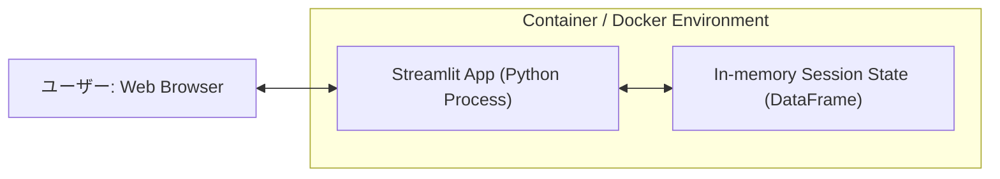
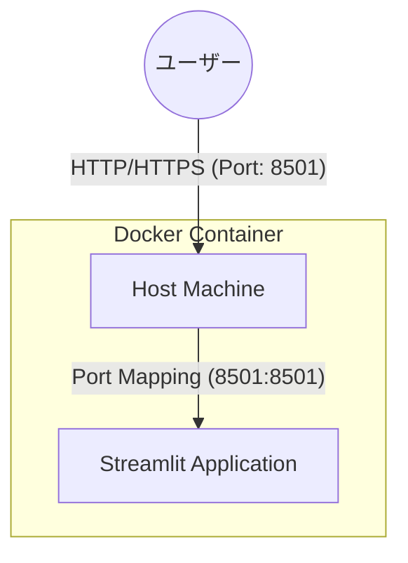
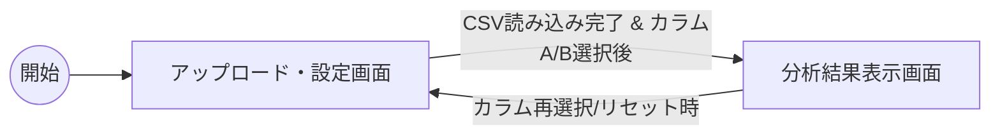
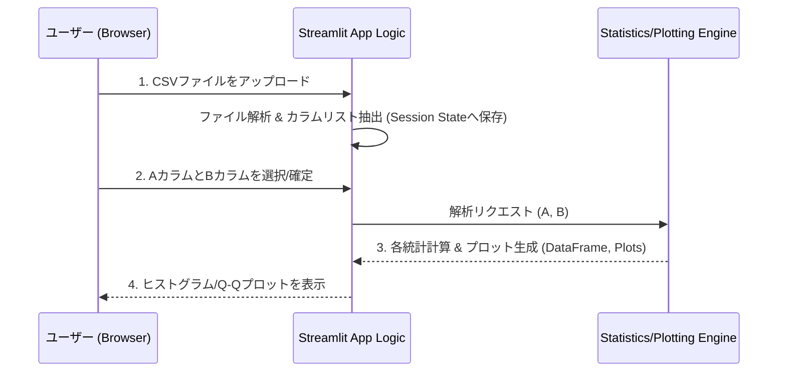

# シグマプロット・分布比較Webアプリ 詳細設計書

## 1. 言語・フレームワーク
- **言語**: Python (3.x)
- **Web GUI フレームワーク**: Streamlit

## 2. システム構成
### コンポーネント一覧表
| 名前 | 役割・機能 | 分類 |
| :--- | :--- | :--- |
| ユーザー (Web Browser) | 操作インターフェース、グラフ表示・操作の主体。ブラウザ上でアプリを介してCSVデータを扱う。 | 外部エンティティ |
| Streamlit Web App (Application Logic) | UIの提供、CSVデータの読み込み・一時保持（Session State）、統計計算(ヒストグラム/Q-Qプロット)、グラフ描画。 | アプリケーション層 |
| Python Runtime (Execution Environment) | 言語実行環境、統計計算ライブラリ(Pandas, Scipy等)、グラフ描画エンジン。 | 基盤層 |

### システム全体の構成図


### コンポーネント間のインターフェースとデータフロー
1. **ユーザー ↔ Streamlit**: ブラウザからHTTP/WebSocket経由でリクエスト（ファイルアップロード、カラム選択）を送信し、Streamletが描画結果を表示する。
2. **Streamlit ↔ In-memory Session State**: アップロードされたCSVデータはPythonのセッション状態（Session State）内にDataFrame形式で一時的に保持され、UIからの操作に応じて抽出・計算が行われる。

### ネットワーク構成図


## 3. データベース設計
本システムはMVPとしてデータの永続化を行わない。全てのデータ処理はメモリ上で行う設計とする。

### 業務エンティティおよび状態管理
| エンティティ | 内容・役割 | セッション内保持属性（概要） |
| :--- | :--- | :--- |
| CSVデータセット (Session Data) | アップロードされた数値データの集合。一時的な解析対象となる。 | `df` (Pandas DataFrame), 読み込み済みフラグ, カラム名リスト |
| 分析設定 (Analysis State) | 比較対象として選択された2つのカラム情報。表示内容を制御する。 | `column_a` (str), `column_b` (str) |

### データ整合性と制約
- **プライバシー保護**: サーバーへのデータ永続保存は行わず、ブラウザセッション終了時にメモリから破棄される。
- **データ整合性**: 選択されたカラムが数値型であることを、アプリケーション層で常に検証する。

## 4. 外部設計
### ユーザーインターフェース (GUI) 設計

#### 画面一覧と機能説明
| 画面名 | 要素・構成要素 | 機能内容 |
| :--- | :--- | :--- |
| **アップロード・設定画面** (初期/リセット時) | ファイル選択ボタン, カラムAセレクトボックス, カラムBセレクトボックス, 分析実行(確定)ボタン | CSVの読み込み、比較対象となるカラム（A/B）の設定。 |
| **分析結果表示画面** (比較実行時) | ヒストグラム(2組), 正規Q-Qプロット, カラム再選択/リセットボタン | 統計グラフの提示、カラム変更のための操作。 |

#### 画面遷移図


#### AAによる画面モックアップ (Wireframe)

**[1] アップロード・設定画面のイメージ**
```text
-----------------------------------------
|       Sigma Plot Web App (MVP)        |
-----------------------------------------
[ File Upload: [ Browse... ] (.csv only)] 

Select Comparison Columns:
-------------------------
Column A (Variable X): [ Select Column... v] 
Column B (Variable Y): [ Select Column... v]

[      RUN ANALYSIS / GENERATE PLOTS     ]
-----------------------------------------
```

**[2] 分析結果表示画面のイメージ**
```text
-----------------------------------------
|       Sigma Plot Web App (MVP)        |
-----------------------------------------
[ Data: sample_data.csv ] [ Reset / Re-upload Button ]

Comparison Summary (A vs B):
-------------------------
[ Column A: 'Lot_1' ]   vs   [ Column B: 'Lot_2' ]

-------------------------
|     Histogram A      | |    Histogram B       |
|  [ Visualization ]   | | [ Visualization ]    |
-------------------------

----------------------- 
|     Q-Q Plot (A vs B)| |    (Wide View Area)  |
| [ Combined Graph ]   | |                      |
-----------------------

[ Return to Upload Screen / Re-select Columns ]
-----------------------------------------
```

## 5. 内部設計（処理フロー）

### 全体的なシステムワークフロー


### 各処理の役割と機能説明
1. **ファイル読み込みプロセス**: ユーザーがアップロードしたCSVファイルをPandasを用いてパースし、カラム名リストを生成してセッションに保持する。
2. **統計計算プロセス**: 選択されたカラムの数値データを抽出し、ヒストグラム用の度数分布およびQ-Qプロット用の正規性評価計算を行う。
3. **描画プロセス**: 統計結果に基づき、MatplotlibまたはSeabovy等のライブラリを用いてグラフを生成し、Streamlitのコンポーネントへ渡す。

## 6. 全クラスの設計
### クラス一覧表
| クラス名 | 役割・機能概要 | 主な属性/メソッド (論理的定義) |
| :--- | :--- | :--- |
| `AppMain` (Controller) | アプリケーション全体の制御、Streamlitの状態管理。 | 状態遷移のハンドリング, UI表示切り替え |
| `DataHandler` (Service) | ファイル入出力およびデータフレーム操作。 | CSVロード, カラムリスト抽出, データバリデーション |
| `StatisticsEngine` (Logic) | 統計計算およびプロットデータの生成。 | ヒストグラム集計, Q-Qプロット用データ変換/計算 |
| `VisualizationManager` (Service) | グラフ描画のプロパティ管理。 | 図表生成, カラーテーマ適用 |

### クラス関係図
```mermaid
classDiagram
    class AppMain {
        +run()
        -handleUpload()
        -showResults()
    }
�
    class DataHandler {
        +loadCSV(file) DataFrame
        +validateNumericColumns() bool
    }
    class StatisticsEngine {
        +calculateHistogram(df, col) PlotData
        +calculateQQPlot(df_a, df_b) PlotData
    }
    class VisualizationManager {
        +generateHistogram(data, title) Figure
        +generateQQPlot(data_a, data_b) Figure
    }

    AppMain --> DataHandler : 利用する
    AppMain --> StatisticsEngine : 命令を出す
    StatisticsEngine --> VisualizationManager : データを渡す/利用する
```

### オブジェクト指向設計におけるメッセージの整理
| 送信元 | 宛先 | メッセージの内容・役割 | 説明 |
| :--- | :--- | :--- | :--- |
| `AppMain` | `DataHandler` | ファイル読み込み指示 / カラムリスト取得要求 | ユーザー操作に基づくデータのロード。 |
| `AppMain` | `StatisticsEngine` | 指定されたA/Bカラムによる統計処理指示 | 比較対象の決定。 |
| `StatisticsEngine` | `VisualizationManager` | 計算済みデータに基づく図表生成指示 | グラフの出力準備。 |
| `VisualizationManager` | `AppMain` | 生成されたプロットオブジェクトの返却 | 画面描画へのフィードバック。 |

## 7. エラーハンドリング
| 想定エラー事象 | 原因/条件 | 回避・対処方針 (ユーザーへの提示) |
| :--- | :--- | :--- |
| ファイル読み込み失敗 | CSV形式不備、破損ファイル等。 | エラーメッセージを表示し、「再アップロード」を促す状態へ遷移する。 |
| 非数値カラム選択エラー | 選択した列に文字列が含まれる場合（バリデーション失敗）。 | 「数値データではありません」等の警告を出し、選択のやり直し（再送）を促す。 |
| 空データエラー | ゼロ件のデータの選択、またはカラム内が空の場合。 | 「対象データが存在しません」と表示し、アプリの停止は防ぐ（入力待ち状態に留める）。 |

## 8. セキュリティ設計
- **データプライバシー**: 本システムはサーバーにデータを永続化（DB等へ保存）しない。ユーザーのローカル環境からアップロードされたデータは、アプリケーション実行時のメモリ内（Session State）でのみ扱われ。
- **機密情報保護**: ファイルのアップロード/ダウンロード機能のみを提供し、外部へのデータ転送（送信）は行わない。
- **アクセス制御**: 特定の環境内での利用を前提とし、ログイン機能は設けない。

## 9. ソースコード構成
### ディレクトリ構造 (AA)
```text
project_root/
├── app.py                 # メインエントリポイント (Streamlit)
├── e2e/                   # E2Eテストコードディレクトリ ([requirements.md]による)
│   ├── package.json       # テスト環境依存関係定義 (Playwright用)

├── src/                   # ソースコードディレクトリ
│   ├── main.py            # アプリケーションのメインロジック (AppMain)
│   ├── core/              # 共通・基盤モジュール
│   │   └── data_handler.py # データ操作 (DataHandler)
│   ├── engine/            # ビジネスロジック層
│   │   └── statistics.py  # 統計計算 (StatisticsEngine)
│   ├── visualization/     # 表示制御層
│   │   └── plotter.py    # グラフ描画 (VisualizationManager)
│   └── utils/             # その他ユーティリティ
│       └── helpers.py     # 共通部品 (バリデーション等)
├── tests/                 # 単体・結合テスト用ディレクトリ
└── docker-compose.yml     # コンテナ構成定義ファイル (test_playwright用プロファイルを包含)
```

### ファイル役割とクラス対応表
| ディレクトリ | 役割・ファイル名/パス | 格納される主なクラス / 実装内容の概要 |
| :--- | :--- | :--- | |
| `src/main.py` | アプリケーション実行部 (AppMain) | StreamlitのUI構成と、各モジュールの呼び出し制御。 |
| `src/core/data_handler.py` | データハンドラ (DataHandler) | ファイル入出力、CSVパース処理。 |
| `src/engine/statistics.py` | 統計エンジン (StatisticsEngine) | ヒストグラム集計、Q-Qプロット計算。 |
| `src/visualization/plotter.py` | プロッター (VisualizationManager) | Matplotlib等を用いた描画処理。 |
| `src/utils/helpers.py` | ユーティリティ部 (共通) | 入力値バリデーション、型チェック等の汎用処理。 |

### コーディング規約
- **言語**: Python 3.x (PEP8準拠)
- **命名規則**: クラス名は `PascalCase`、関数・変数名/メソッド名は `snake_case`。
- **データ型**: 統計処理の精度を保つため、数値計算は `float64` を基本とする。
- **エラー管理**: 業務的な例外処理は独自カスタム式（Exception）を用い、UI層でのキャッチを基本とする。

## 10. テスト設計
### テスト戦略一覧表
| テストの種類 | 対象範囲・目的 | 方法/ツール |
| :--- | :--- | :--- | |
| **単体テスト (Unit)** | 最小単位の関数・クラス（統計計算、バリデクション等）が正しいか。 | `pytest` を使用して個別のロジックを検証する。 |
| **結合テスト (Integration)** | 複数のコンポーネント間の連携（データ読み込み→計算）が正しいか。 | `pytest` に加え、モジュール間インターフェースのテストを行う。 |
| **総合/E2Eテスト (System)** | ユーザーがブラウザから操作し、期待通りにグラフが表示されるか。 | `Playwright` (Docker内) を使用し、実操作シナリオに基づく自動テスト。 |

### 実装すべき主要なテストケース
| テスト対象項目 | 分類 (正常/異常) | 期待される結果（テスト目的） |
| :--- | :--- | :--- | |
| **CSV読み込み** | 正常系 | 正しくDataFrameに変換され、カラム名が取得できること。 |
| **CSV読み込み** | 異常系/境界値 | 不正な形式のファイルがエラーメッセージを表示し、停止しないこと。 |
| **カラム選択** | 正常系 | A/B両方の正しい値がセットされ、計算対象となること。 |
| **カラム選択** | 異常系/境界値 | 数値以外の列を選択した場合に、適切にエラー通知されること。 |
| **統計計算 (ヒストグラム)** | 正常系 | 指定された分布に基づき、正しい度数集計が行われること。 |
| **統計計算 (Q-Qプロット)** | 正常系 | 指定されたカラムの正規性が正しく可視化されること。 |
| **画面遷移/UI操作** | 正常系(E2E) | アップロードからグラフ表示、再選択までのフローが完結すること。 |

### E2Eテスト設計 (Playwright)
- **目的**: ユーザーのブラウザ操作（ファイル選択、ボタンクリック）から結果表示までの一連の流れを自動検証する。
- **テスト環境**: `docker compose --profile test` により、Playwrightが動作する専用のコンテナ（v1.59.0-noble）を起動。
  - テスト用サービス名: `test_playwright` 
  - 設定内容: プロジェクトルートの `/e2e/` ディレクトリにあるテストコードをコンテナ内にマウント。
- **実行手順**: 以下のコマンドを用いて、環境の構築からテスト完了までを実行する。
  ```bash
  docker compose run --rm test_playwright sh -c "npm install && npx playwright test"
  ```
- **注意点**: 実行時のベースURLはコンテナ間通信のため、フロントエンドのサービス名（例: `http://app-service:8501`）を使用するように設計する。

## 11. 起動・運用
### システム稼働方式 (Docker Compose)
- 本システムは `docker compose` で全ての環境を管理する。

### 起動方法
1. プロジェクトルートにて以下を実行：
   ```bash
   docker compose up -d --build
   ```
2. ブラウザから `http://localhost:8501` にアクセスして使用する。

### 運用
- **初期化**: コンテナ起動時に、必要なライブラリのインストールおよび（必要があれば）最小限の開発用初期データセットが自動的にロードされるよう設計。
- **README.md**: 本詳細設計書に基づき、具体的な起動手順と操作説明を `README.md` に記述する.
