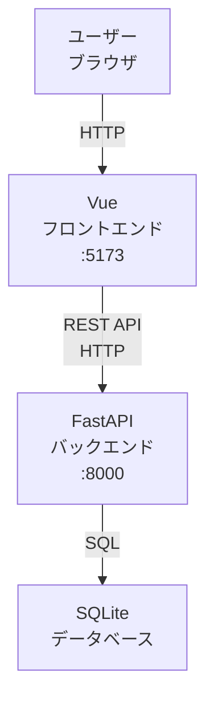
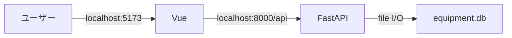
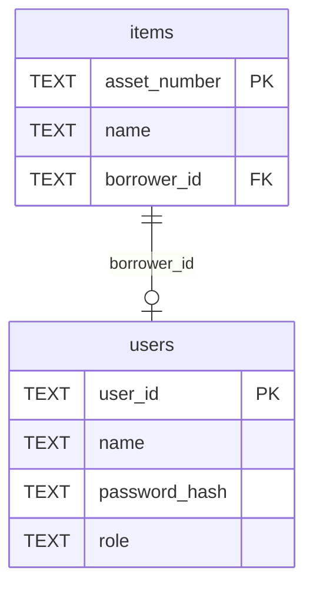
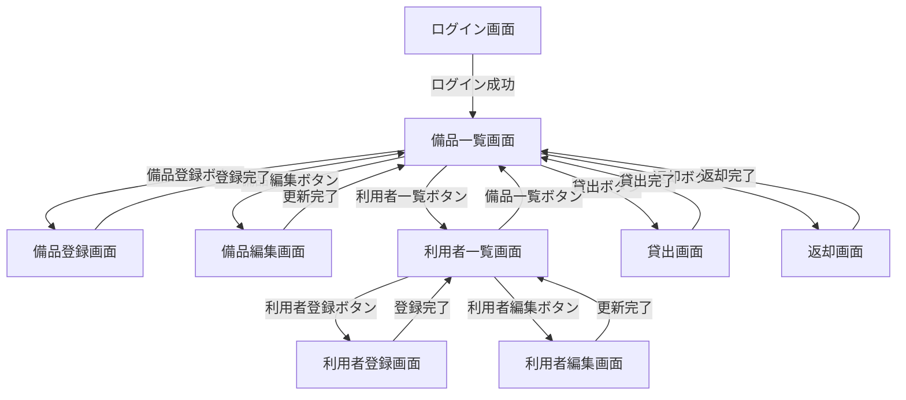
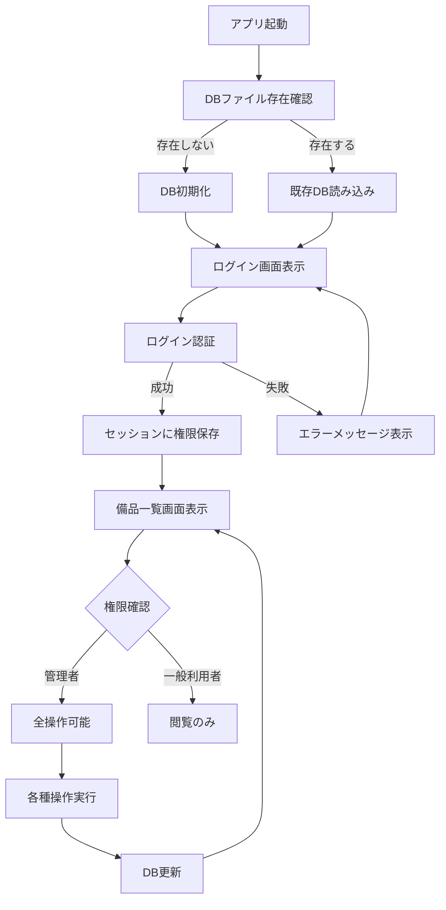
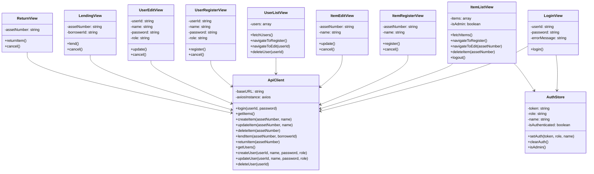
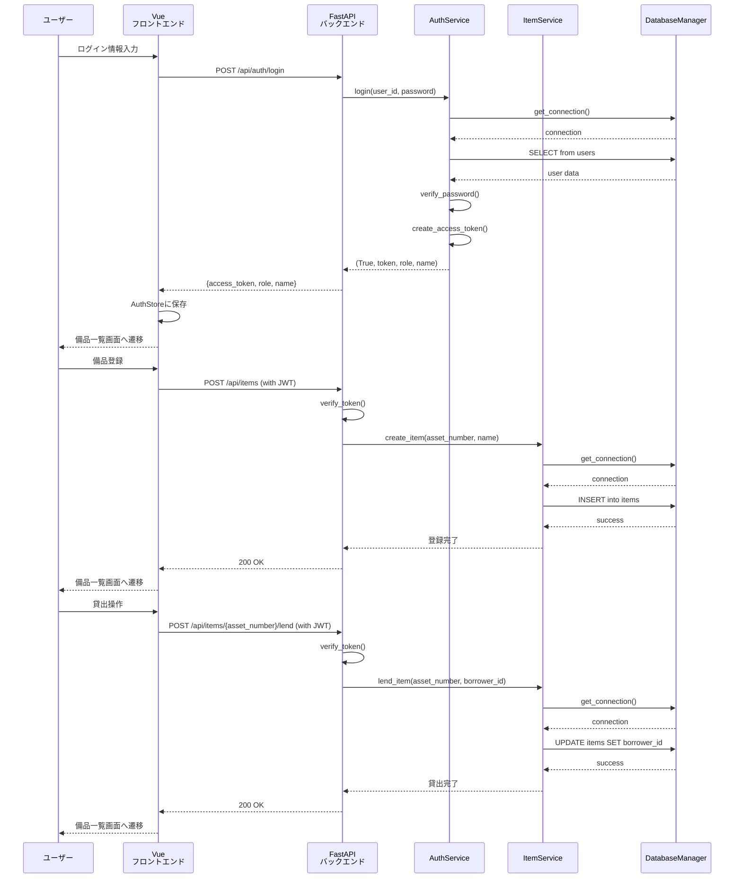

# 備品管理・貸出管理アプリ 詳細設計書

## 1. 言語・フレームワーク

### 1-1. 言語

**フロントエンド: TypeScript**  
**バックエンド: Python 3.11**

**選定理由**:
- フロントエンド: 複雑な画面構成を実現するため、型安全性の高いTypeScriptを使用
- バックエンド: FastAPIとの連携が容易なPython 3.11を使用
- データベース: SQLiteとの連携が容易

### 1-2. フレームワーク

**フロントエンド: Vue 3 + Vuetify 3**  
**バックエンド: FastAPI**

**選定理由**:
- Vue 3: リアクティブなUI構築が容易で、複雑な画面遷移と状態管理を実現可能
- Vuetify 3: Material Designベースのコンポーネントライブラリで、複雑な画面を美しく実装可能
- FastAPI: 高速なRESTful API構築が可能で、OpenAPI自動生成によりフロントエンド連携が容易
- 要件定義書で指定された基本フレームワークである（RQ-NF-FRAMEWORK-BASIC）

---

## 2. システム構成

### 2-1. コンポーネント一覧

| DS-MD-ID | コンポーネント名 | 役割 | 対応要件ID |
|---|---|---|
| DS-MD-FRONTEND-APP-UI-LOGIN-SCREEN | Vue フロントエンドアプリケーション | ユーザーインターフェースと画面制御を担当 | RQ-UI-LOGIN-SCREEN, RQ-UI-ITEM-LIST-SCREEN, RQ-UI-ITEM-REGISTER-SCREEN, RQ-UI-ITEM-EDIT-SCREEN, RQ-UI-USER-LIST-SCREEN, RQ-UI-USER-REGISTER-SCREEN, RQ-UI-USER-EDIT-SCREEN, RQ-UI-LENDING-SCREEN, RQ-UI-RETURN-SCREEN |
| DS-MD-BACKEND-API-FT-LOGIN | FastAPI バックエンドアプリケーション | RESTful APIとビジネスロジックを担当 | RQ-FT-LOGIN, RQ-FT-REGISTER-ITEM, RQ-FT-EDIT-ITEM, RQ-FT-DELETE-ITEM, RQ-FT-REGISTER-USER, RQ-FT-EDIT-USER, RQ-FT-DELETE-USER, RQ-FT-LEND-ITEM, RQ-FT-RETURN-ITEM, RQ-FT-VIEW-ITEM-LIST, RQ-FT-VIEW-USER-LIST |
| DS-MD-DATABASE-DT-ITEM | SQLite データベース | 備品と利用者のデータを永続化 | RQ-DT-ITEM, RQ-DT-USER, RQ-DT-DB-REQUIRED |

### 2-2. システム全体構成図



### 2-3. 各コンポーネントの役割と機能

#### DS-MD-FRONTEND-APP-UI-LOGIN-SCREEN: Vue フロントエンドアプリケーション

- ログイン画面、備品一覧画面、各種操作画面の表示
- ユーザー入力の受付とバリデーション
- バックエンドAPIへのHTTPリクエスト
- 認証トークン（JWT）の管理
- 権限に基づく画面表示制御

#### DS-MD-BACKEND-API-FT-LOGIN: FastAPI バックエンドアプリケーション

- ログイン認証とJWT発行
- 備品・利用者のCRUD操作
- 貸出・返却処理
- ビジネスロジックの実行
- データベースアクセス

#### DS-MD-DATABASE-DT-ITEM: SQLite データベース

- 備品テーブル（items）
- 利用者テーブル（users）
- データの永続化と整合性保証

### 2-4. コンポーネント間インターフェースとデータフロー

- **Vue → FastAPI**: RESTful API（JSON）
  - POST /api/auth/login: ログイン
  - GET /api/items: 備品一覧取得
  - POST /api/items: 備品登録
  - PUT /api/items/{asset_number}: 備品更新
  - DELETE /api/items/{asset_number}: 備品削除
  - GET /api/users: 利用者一覧取得
  - POST /api/users: 利用者登録
  - PUT /api/users/{user_id}: 利用者更新
  - DELETE /api/users/{user_id}: 利用者削除
  - POST /api/items/{asset_number}/lend: 貸出
  - POST /api/items/{asset_number}/return: 返却
- **FastAPI → SQLite**: SQL クエリ（SELECT, INSERT, UPDATE, DELETE）
- **SQLite → FastAPI**: クエリ結果（データ行）
- **FastAPI → Vue**: JSON レスポンス

### 2-5. ネットワーク構成図



---

## 3. データベース設計

### 3-1. DB の必須性

**必須** (DS-MD-DATABASE-DT-ITEM)

**理由**: 備品と利用者のデータを永続化し、アプリ再起動後もデータが残る必要がある（RQ-DT-DB-REQUIRED）

### 3-2. DB 製品の選定

**SQLite**

**選定理由**: データ規模が極端に少量（目安 100 万件以内）で、単純な構造のため、ファイルベースでセットアップが簡単な SQLite が適している

### 3-3. テーブル設計

#### DS-SC-ITEMS-DT-ITEM: items テーブル

| カラム名 | 型 | 制約 | 説明 | 対応要件ID |
|---|---|---|---|---|
| asset_number | TEXT | PRIMARY KEY | 資産管理番号 | RQ-DT-ITEM |
| name | TEXT | NOT NULL | 備品名称 | RQ-DT-ITEM |
| borrower_id | TEXT | NULL, FOREIGN KEY (users.user_id) | 借り主のユーザーID（NULLの場合は利用可能） | RQ-DT-ITEM, RQ-FT-LEND-ITEM, RQ-FT-RETURN-ITEM |

#### DS-SC-USERS-DT-USER: users テーブル

| カラム名 | 型 | 制約 | 説明 | 対応要件ID |
|---|---|---|---|---|
| user_id | TEXT | PRIMARY KEY | ユーザーID | RQ-DT-USER |
| name | TEXT | NOT NULL | 氏名 | RQ-DT-USER |
| password_hash | TEXT | NOT NULL | パスワードハッシュ（bcrypt） | RQ-DT-USER, RQ-NF-PASSWORD-HASH |
| role | TEXT | NOT NULL, CHECK(role IN ('admin', 'user')) | 権限（admin: 管理者, user: 一般利用者） | RQ-DT-USER, RQ-NF-ACCESS-CONTROL |

### 3-4. リレーション図



---

## 4. アーキテクチャ設計

### 4-1. 外部設計

#### 4-1-1. UI設計

##### 画面一覧

| DS-IF-ID | 画面名 | 要素 | 機能 | 対応要件ID |
|---|---|---|---|
| DS-IF-LOGIN-SCREEN-UI-LOGIN-SCREEN | ログイン画面 | ユーザーID入力欄、パスワード入力欄、ログインボタン | ログイン認証 | RQ-UI-LOGIN-SCREEN, RQ-FT-LOGIN |
| DS-IF-ITEM-LIST-SCREEN-UI-ITEM-LIST-SCREEN | 備品一覧画面 | 備品一覧テーブル、備品登録ボタン、利用者一覧ボタン、貸出ボタン、返却ボタン、各行に編集・削除ボタン | 備品一覧表示と各種操作 | RQ-UI-ITEM-LIST-SCREEN, RQ-FT-VIEW-ITEM-LIST |
| DS-IF-ITEM-REGISTER-SCREEN-UI-ITEM-REGISTER-SCREEN | 備品登録画面 | 資産管理番号入力欄、名称入力欄、登録ボタン | 備品登録 | RQ-UI-ITEM-REGISTER-SCREEN, RQ-FT-REGISTER-ITEM |
| DS-IF-ITEM-EDIT-SCREEN-UI-ITEM-EDIT-SCREEN | 備品編集画面 | 資産管理番号表示（変更不可）、名称入力欄、更新ボタン | 備品編集 | RQ-UI-ITEM-EDIT-SCREEN, RQ-FT-EDIT-ITEM |
| DS-IF-USER-LIST-SCREEN-UI-USER-LIST-SCREEN | 利用者一覧画面 | 利用者一覧テーブル、利用者登録ボタン、備品一覧ボタン、各行に編集・削除ボタン | 利用者一覧表示と各種操作 | RQ-UI-USER-LIST-SCREEN, RQ-FT-VIEW-USER-LIST |
| DS-IF-USER-REGISTER-SCREEN-UI-USER-REGISTER-SCREEN | 利用者登録画面 | ユーザーID入力欄、氏名入力欄、パスワード入力欄、権限選択（管理者/一般利用者）、登録ボタン | 利用者登録 | RQ-UI-USER-REGISTER-SCREEN, RQ-FT-REGISTER-USER |
| DS-IF-USER-EDIT-SCREEN-UI-USER-EDIT-SCREEN | 利用者編集画面 | ユーザーID表示（変更不可）、氏名入力欄、パスワード入力欄、権限選択、更新ボタン | 利用者編集 | RQ-UI-USER-EDIT-SCREEN, RQ-FT-EDIT-USER |
| DS-IF-LENDING-SCREEN-UI-LENDING-SCREEN | 貸出画面 | 備品選択（資産管理番号）、利用者選択（ユーザーID）、貸出ボタン | 備品貸出 | RQ-UI-LENDING-SCREEN, RQ-FT-LEND-ITEM |
| DS-IF-RETURN-SCREEN-UI-RETURN-SCREEN | 返却画面 | 備品選択（資産管理番号）、返却ボタン | 備品返却 | RQ-UI-RETURN-SCREEN, RQ-FT-RETURN-ITEM |

##### 画面遷移図



##### AAモックアップ

**ログイン画面**
```
┌─────────────────────────────────┐
│  備品管理・貸出管理システム       │
├─────────────────────────────────┤
│  ユーザーID: [____________]      │
│  パスワード: [____________]      │
│  [   ログイン   ]               │
└─────────────────────────────────┘
```

**備品一覧画面（管理者）**
```
┌─────────────────────────────────────────────────┐
│  備品一覧                           ログアウト  │
├─────────────────────────────────────────────────┤
│  [備品登録] [利用者一覧] [貸出] [返却]          │
├─────────────────────────────────────────────────┤
│  資産管理番号 | 名称     | 貸出状況 | 借り主    │
│  001         | PC-001   | 利用可能 | -         │ [編集] [削除]
│  002         | PC-002   | 貸出中   | user01    │ [編集] [削除]
└─────────────────────────────────────────────────┘
```

**備品一覧画面（一般利用者）**
```
┌─────────────────────────────────────────────────┐
│  備品一覧                           ログアウト  │
├─────────────────────────────────────────────────┤
│  資産管理番号 | 名称     | 貸出状況 | 借り主    │
│  001         | PC-001   | 利用可能 | -         │
│  002         | PC-002   | 貸出中   | user01    │
└─────────────────────────────────────────────────┘
```

**備品登録画面**
```
┌─────────────────────────────────┐
│  備品登録                        │
├─────────────────────────────────┤
│  資産管理番号: [____________]    │
│  名称:         [____________]    │
│  [   登録   ] [キャンセル]      │
└─────────────────────────────────┘
```

**備品編集画面**
```
┌─────────────────────────────────┐
│  備品編集                        │
├─────────────────────────────────┤
│  資産管理番号: 001 (変更不可)    │
│  名称:         [PC-001_____]     │
│  [   更新   ] [キャンセル]      │
└─────────────────────────────────┘
```

**利用者一覧画面**
```
┌─────────────────────────────────────────────────┐
│  利用者一覧                         ログアウト  │
├─────────────────────────────────────────────────┤
│  [利用者登録] [備品一覧]                        │
├─────────────────────────────────────────────────┤
│  ユーザーID | 氏名     | 権限                  │
│  admin      | 管理者   | 管理者                │ [編集] [削除]
│  user01     | 山田太郎 | 一般利用者            │ [編集] [削除]
└─────────────────────────────────────────────────┘
```

**利用者登録画面**
```
┌─────────────────────────────────┐
│  利用者登録                      │
├─────────────────────────────────┤
│  ユーザーID: [____________]      │
│  氏名:       [____________]      │
│  パスワード: [____________]      │
│  権限:       [管理者 ▼]         │
│  [   登録   ] [キャンセル]      │
└─────────────────────────────────┘
```

**利用者編集画面**
```
┌─────────────────────────────────┐
│  利用者編集                      │
├─────────────────────────────────┤
│  ユーザーID: user01 (変更不可)   │
│  氏名:       [山田太郎______]    │
│  パスワード: [____________]      │
│  権限:       [一般利用者 ▼]     │
│  [   更新   ] [キャンセル]      │
└─────────────────────────────────┘
```

**貸出画面**
```
┌─────────────────────────────────┐
│  貸出                            │
├─────────────────────────────────┤
│  備品:     [001 - PC-001 ▼]     │
│  利用者:   [user01 - 山田太郎 ▼]│
│  [   貸出   ] [キャンセル]      │
└─────────────────────────────────┘
```

**返却画面**
```
┌─────────────────────────────────┐
│  返却                            │
├─────────────────────────────────┤
│  備品:     [002 - PC-002 ▼]     │
│  [   返却   ] [キャンセル]      │
└─────────────────────────────────┘
```

#### 4-1-2. 外部システム連携

該当なし（要件に外部システム連携は含まれない）

#### 4-1-3. 外部DB連携

該当なし（要件に外部DB連携は含まれない）

### 4-2. 内部設計

#### 4-2-1. 処理フロー図



#### 4-2-2. 各処理の役割と機能

| DS-FN-ID | 処理名 | 役割 | 対応要件ID |
|---|---|---|
| DS-FN-INIT-DB-DT-DB-REQUIRED | DB初期化処理 | データベースファイルとテーブルを作成 | RQ-DT-DB-REQUIRED |
| DS-FN-LOGIN-FT-LOGIN | ログイン処理 | ユーザーIDとパスワードを検証し、JWTトークンを発行 | RQ-FT-LOGIN |
| DS-FN-REGISTER-ITEM-FT-REGISTER-ITEM | 備品登録処理 | 備品をitemsテーブルに挿入 | RQ-FT-REGISTER-ITEM |
| DS-FN-EDIT-ITEM-FT-EDIT-ITEM | 備品編集処理 | 指定された備品の名称を更新 | RQ-FT-EDIT-ITEM |
| DS-FN-DELETE-ITEM-FT-DELETE-ITEM | 備品削除処理 | 指定された備品をitemsテーブルから削除 | RQ-FT-DELETE-ITEM |
| DS-FN-REGISTER-USER-FT-REGISTER-USER | 利用者登録処理 | 利用者をusersテーブルに挿入（パスワードハッシュ化） | RQ-FT-REGISTER-USER |
| DS-FN-EDIT-USER-FT-EDIT-USER | 利用者編集処理 | 指定された利用者の情報を更新 | RQ-FT-EDIT-USER |
| DS-FN-DELETE-USER-FT-DELETE-USER | 利用者削除処理 | 指定された利用者をusersテーブルから削除 | RQ-FT-DELETE-USER |
| DS-FN-LEND-ITEM-FT-LEND-ITEM | 貸出処理 | 指定された備品のborrower_idを更新 | RQ-FT-LEND-ITEM |
| DS-FN-RETURN-ITEM-FT-RETURN-ITEM | 返却処理 | 指定された備品のborrower_idをNULLに更新 | RQ-FT-RETURN-ITEM |
| DS-FN-VIEW-ITEM-LIST-FT-VIEW-ITEM-LIST | 備品一覧取得処理 | itemsテーブルから全備品を取得し、貸出状況を判定 | RQ-FT-VIEW-ITEM-LIST |
| DS-FN-VIEW-USER-LIST-FT-VIEW-USER-LIST | 利用者一覧取得処理 | usersテーブルから全利用者を取得 | RQ-FT-VIEW-USER-LIST |

#### 4-2-3. バッチ設計

該当なし（要件にバッチ処理は含まれない）

---

## 5. クラス設計

### 5-1. 全クラス一覧と役割

#### 5-1-1. バックエンド（FastAPI）

| DS-CL-ID | クラス名 | 役割 | SOLID原則適合状況 | 対応要件ID |
|---|---|---|---|
| DS-CL-DATABASE-MANAGER-DT-DB-REQUIRED | DatabaseManager | データベース接続と初期化を管理 | SRP: 単一責任（DB管理のみ）<br/>OCP: 拡張可能（新テーブル追加可能）<br/>DIP: 抽象に依存（sqlite3インターフェース利用） | RQ-DT-DB-REQUIRED |
| DS-CL-AUTH-SERVICE-FT-LOGIN | AuthService | 認証処理、パスワードハッシュ化、JWT発行を管理 | SRP: 単一責任（認証のみ）<br/>DIP: 抽象に依存（bcrypt, python-joseインターフェース利用） | RQ-FT-LOGIN, RQ-NF-PASSWORD-HASH |
| DS-CL-ITEM-SERVICE-FT-REGISTER-ITEM | ItemService | 備品のCRUD操作と貸出・返却処理を管理 | SRP: 単一責任（備品管理のみ）<br/>OCP: 拡張可能（新操作追加可能） | RQ-FT-REGISTER-ITEM, RQ-FT-EDIT-ITEM, RQ-FT-DELETE-ITEM, RQ-FT-LEND-ITEM, RQ-FT-RETURN-ITEM, RQ-FT-VIEW-ITEM-LIST |
| DS-CL-USER-SERVICE-FT-REGISTER-USER | UserService | 利用者のCRUD操作を管理 | SRP: 単一責任（利用者管理のみ）<br/>OCP: 拡張可能（新操作追加可能） | RQ-FT-REGISTER-USER, RQ-FT-EDIT-USER, RQ-FT-DELETE-USER, RQ-FT-VIEW-USER-LIST |
| DS-CL-AUTH-ROUTER-FT-LOGIN | AuthRouter | 認証関連のAPIエンドポイントを定義 | SRP: 単一責任（認証API のみ）<br/>DIP: AuthServiceに依存 | RQ-FT-LOGIN |
| DS-CL-ITEM-ROUTER-FT-REGISTER-ITEM | ItemRouter | 備品関連のAPIエンドポイントを定義 | SRP: 単一責任（備品APIのみ）<br/>DIP: ItemServiceに依存 | RQ-FT-REGISTER-ITEM, RQ-FT-EDIT-ITEM, RQ-FT-DELETE-ITEM, RQ-FT-LEND-ITEM, RQ-FT-RETURN-ITEM, RQ-FT-VIEW-ITEM-LIST |
| DS-CL-USER-ROUTER-FT-REGISTER-USER | UserRouter | 利用者関連のAPIエンドポイントを定義 | SRP: 単一責任（利用者APIのみ）<br/>DIP: UserServiceに依存 | RQ-FT-REGISTER-USER, RQ-FT-EDIT-USER, RQ-FT-DELETE-USER, RQ-FT-VIEW-USER-LIST |
| DS-CL-SCHEMAS-DT-ITEM | Pydantic スキーマ | リクエスト/レスポンスのデータモデルを定義 | SRP: 単一責任（データモデルのみ） | RQ-DT-ITEM, RQ-DT-USER |

#### 5-1-2. フロントエンド（Vue）

| DS-CL-ID | クラス名 | 役割 | SOLID原則適合状況 | 対応要件ID |
|---|---|---|---|
| DS-CL-LOGIN-VIEW-UI-LOGIN-SCREEN | LoginView コンポーネント | ログイン画面の表示と操作 | SRP: 単一責任（ログイン画面のみ） | RQ-UI-LOGIN-SCREEN |
| DS-CL-ITEM-LIST-VIEW-UI-ITEM-LIST-SCREEN | ItemListView コンポーネント | 備品一覧画面の表示と操作 | SRP: 単一責任（備品一覧画面のみ） | RQ-UI-ITEM-LIST-SCREEN |
| DS-CL-ITEM-REGISTER-VIEW-UI-ITEM-REGISTER-SCREEN | ItemRegisterView コンポーネント | 備品登録画面の表示と操作 | SRP: 単一責任（備品登録画面のみ） | RQ-UI-ITEM-REGISTER-SCREEN |
| DS-CL-ITEM-EDIT-VIEW-UI-ITEM-EDIT-SCREEN | ItemEditView コンポーネント | 備品編集画面の表示と操作 | SRP: 単一責任（備品編集画面のみ） | RQ-UI-ITEM-EDIT-SCREEN |
| DS-CL-USER-LIST-VIEW-UI-USER-LIST-SCREEN | UserListView コンポーネント | 利用者一覧画面の表示と操作 | SRP: 単一責任（利用者一覧画面のみ） | RQ-UI-USER-LIST-SCREEN |
| DS-CL-USER-REGISTER-VIEW-UI-USER-REGISTER-SCREEN | UserRegisterView コンポーネント | 利用者登録画面の表示と操作 | SRP: 単一責任（利用者登録画面のみ） | RQ-UI-USER-REGISTER-SCREEN |
| DS-CL-USER-EDIT-VIEW-UI-USER-EDIT-SCREEN | UserEditView コンポーネント | 利用者編集画面の表示と操作 | SRP: 単一責任（利用者編集画面のみ） | RQ-UI-USER-EDIT-SCREEN |
| DS-CL-LENDING-VIEW-UI-LENDING-SCREEN | LendingView コンポーネント | 貸出画面の表示と操作 | SRP: 単一責任（貸出画面のみ） | RQ-UI-LENDING-SCREEN |
| DS-CL-RETURN-VIEW-UI-RETURN-SCREEN | ReturnView コンポーネント | 返却画面の表示と操作 | SRP: 単一責任（返却画面のみ） | RQ-UI-RETURN-SCREEN |
| DS-CL-API-CLIENT-FT-LOGIN | ApiClient | バックエンドAPIとの通信を担当 | SRP: 単一責任（API通信のみ）<br/>DIP: axiosインターフェース利用 | RQ-FT-LOGIN, RQ-FT-REGISTER-ITEM, RQ-FT-EDIT-ITEM, RQ-FT-DELETE-ITEM, RQ-FT-REGISTER-USER, RQ-FT-EDIT-USER, RQ-FT-DELETE-USER, RQ-FT-LEND-ITEM, RQ-FT-RETURN-ITEM, RQ-FT-VIEW-ITEM-LIST, RQ-FT-VIEW-USER-LIST |
| DS-CL-AUTH-STORE-FT-LOGIN | AuthStore（Pinia） | 認証状態（JWTトークン、権限）を管理 | SRP: 単一責任（認証状態管理のみ） | RQ-FT-LOGIN, RQ-NF-ACCESS-CONTROL |

### 5-2. クラスの責務、主要属性、主要メソッド

#### 5-2-1. バックエンド（FastAPI）

##### DS-CL-DATABASE-MANAGER-DT-DB-REQUIRED: DatabaseManager

**責務**: データベース接続と初期化

**主要属性**:
- db_path: str (データベースファイルパス)

**主要メソッド**:
- init_db(): DBファイルとテーブルを作成
- get_connection(): DB接続を取得

##### DS-CL-AUTH-SERVICE-FT-LOGIN: AuthService

**責務**: 認証処理、パスワードハッシュ化、JWT発行

**主要属性**: なし

**主要メソッド**:
- hash_password(password: str) -> str: パスワードをハッシュ化
- verify_password(password: str, password_hash: str) -> bool: パスワード検証
- login(user_id: str, password: str) -> tuple[bool, str, str, str]: ログイン認証（成功/失敗、JWTトークン、権限、氏名を返す）
- create_access_token(user_id: str, role: str) -> str: JWTトークンを生成
- verify_token(token: str) -> dict: JWTトークンを検証し、ペイロードを返す

##### DS-CL-ITEM-SERVICE-FT-REGISTER-ITEM: ItemService

**責務**: 備品のCRUD操作と貸出・返却処理

**主要属性**: なし

**主要メソッド**:
- create_item(asset_number: str, name: str) -> None: 備品を登録
- get_all_items() -> list[dict]: 全備品を取得
- update_item(asset_number: str, name: str) -> None: 備品情報を更新
- delete_item(asset_number: str) -> None: 備品を削除
- lend_item(asset_number: str, borrower_id: str) -> None: 備品を貸出
- return_item(asset_number: str) -> None: 備品を返却

##### DS-CL-USER-SERVICE-FT-REGISTER-USER: UserService

**責務**: 利用者のCRUD操作

**主要属性**: なし

**主要メソッド**:
- create_user(user_id: str, name: str, password_hash: str, role: str) -> None: 利用者を登録
- get_all_users() -> list[dict]: 全利用者を取得
- update_user(user_id: str, name: str, password_hash: str, role: str) -> None: 利用者情報を更新
- delete_user(user_id: str) -> None: 利用者を削除

##### DS-CL-AUTH-ROUTER-FT-LOGIN: AuthRouter

**責務**: 認証関連のAPIエンドポイントを定義

**主要メソッド**:
- POST /api/auth/login: ログイン（リクエストボディ: user_id, password / レスポンス: access_token, role, name）

##### DS-CL-ITEM-ROUTER-FT-REGISTER-ITEM: ItemRouter

**責務**: 備品関連のAPIエンドポイントを定義

**主要メソッド**:
- GET /api/items: 備品一覧取得（要認証）
- POST /api/items: 備品登録（要認証・管理者のみ）
- PUT /api/items/{asset_number}: 備品更新（要認証・管理者のみ）
- DELETE /api/items/{asset_number}: 備品削除（要認証・管理者のみ）
- POST /api/items/{asset_number}/lend: 貸出（要認証・管理者のみ）
- POST /api/items/{asset_number}/return: 返却（要認証・管理者のみ）

##### DS-CL-USER-ROUTER-FT-REGISTER-USER: UserRouter

**責務**: 利用者関連のAPIエンドポイントを定義

**主要メソッド**:
- GET /api/users: 利用者一覧取得（要認証・管理者のみ）
- POST /api/users: 利用者登録（要認証・管理者のみ）
- PUT /api/users/{user_id}: 利用者更新（要認証・管理者のみ）
- DELETE /api/users/{user_id}: 利用者削除（要認証・管理者のみ）

##### DS-CL-SCHEMAS-DT-ITEM: Pydantic スキーマ

**責務**: リクエスト/レスポンスのデータモデルを定義

**主要スキーマ**:
- LoginRequest: ログインリクエスト（user_id, password）
- LoginResponse: ログインレスポンス（access_token, role, name）
- ItemBase: 備品基本データ（asset_number, name）
- ItemResponse: 備品レスポンス（asset_number, name, borrower_id, borrower_name）
- ItemCreate: 備品登録リクエスト（asset_number, name）
- ItemUpdate: 備品更新リクエスト（name）
- LendRequest: 貸出リクエスト（borrower_id）
- UserBase: 利用者基本データ（user_id, name, role）
- UserResponse: 利用者レスポンス（user_id, name, role）
- UserCreate: 利用者登録リクエスト（user_id, name, password, role）
- UserUpdate: 利用者更新リクエスト（name, password, role）

#### 5-2-2. フロントエンド（Vue）

##### DS-CL-LOGIN-VIEW-UI-LOGIN-SCREEN: LoginView コンポーネント

**責務**: ログイン画面の表示と操作

**主要データ**:
- userId: string (入力されたユーザーID)
- password: string (入力されたパスワード)
- errorMessage: string (エラーメッセージ)

**主要メソッド**:
- login(): ログインボタン押下時の処理（ApiClient.loginを呼び出し、成功時はAuthStoreにトークンを保存し備品一覧へ遷移）

##### DS-CL-ITEM-LIST-VIEW-UI-ITEM-LIST-SCREEN: ItemListView コンポーネント

**責務**: 備品一覧画面の表示と操作

**主要データ**:
- items: array (備品一覧)
- isAdmin: boolean (管理者権限があるか)

**主要メソッド**:
- fetchItems(): 備品一覧をAPIから取得
- navigateToRegister(): 備品登録画面へ遷移
- navigateToEdit(assetNumber): 備品編集画面へ遷移
- navigateToUserList(): 利用者一覧画面へ遷移
- navigateToLending(): 貸出画面へ遷移
- navigateToReturn(): 返却画面へ遷移
- deleteItem(assetNumber): 備品削除
- logout(): ログアウト

##### DS-CL-ITEM-REGISTER-VIEW-UI-ITEM-REGISTER-SCREEN: ItemRegisterView コンポーネント

**責務**: 備品登録画面の表示と操作

**主要データ**:
- assetNumber: string (資産管理番号)
- name: string (名称)
- errorMessage: string (エラーメッセージ)

**主要メソッド**:
- register(): 登録ボタン押下時の処理（ApiClient.createItemを呼び出し、成功時は備品一覧へ遷移）
- cancel(): キャンセルボタン押下時の処理（備品一覧へ遷移）

##### DS-CL-ITEM-EDIT-VIEW-UI-ITEM-EDIT-SCREEN: ItemEditView コンポーネント

**責務**: 備品編集画面の表示と操作

**主要データ**:
- assetNumber: string (資産管理番号・変更不可)
- name: string (名称)
- errorMessage: string (エラーメッセージ)

**主要メソッド**:
- update(): 更新ボタン押下時の処理（ApiClient.updateItemを呼び出し、成功時は備品一覧へ遷移）
- cancel(): キャンセルボタン押下時の処理（備品一覧へ遷移）

##### DS-CL-USER-LIST-VIEW-UI-USER-LIST-SCREEN: UserListView コンポーネント

**責務**: 利用者一覧画面の表示と操作

**主要データ**:
- users: array (利用者一覧)

**主要メソッド**:
- fetchUsers(): 利用者一覧をAPIから取得
- navigateToRegister(): 利用者登録画面へ遷移
- navigateToEdit(userId): 利用者編集画面へ遷移
- navigateToItemList(): 備品一覧画面へ遷移
- deleteUser(userId): 利用者削除
- logout(): ログアウト

##### DS-CL-USER-REGISTER-VIEW-UI-USER-REGISTER-SCREEN: UserRegisterView コンポーネント

**責務**: 利用者登録画面の表示と操作

**主要データ**:
- userId: string (ユーザーID)
- name: string (氏名)
- password: string (パスワード)
- role: string (権限)
- errorMessage: string (エラーメッセージ)

**主要メソッド**:
- register(): 登録ボタン押下時の処理（ApiClient.createUserを呼び出し、成功時は利用者一覧へ遷移）
- cancel(): キャンセルボタン押下時の処理（利用者一覧へ遷移）

##### DS-CL-USER-EDIT-VIEW-UI-USER-EDIT-SCREEN: UserEditView コンポーネント

**責務**: 利用者編集画面の表示と操作

**主要データ**:
- userId: string (ユーザーID・変更不可)
- name: string (氏名)
- password: string (パスワード)
- role: string (権限)
- errorMessage: string (エラーメッセージ)

**主要メソッド**:
- update(): 更新ボタン押下時の処理（ApiClient.updateUserを呼び出し、成功時は利用者一覧へ遷移）
- cancel(): キャンセルボタン押下時の処理（利用者一覧へ遷移）

##### DS-CL-LENDING-VIEW-UI-LENDING-SCREEN: LendingView コンポーネント

**責務**: 貸出画面の表示と操作

**主要データ**:
- assetNumber: string (選択された備品の資産管理番号)
- borrowerId: string (選択された利用者のユーザーID)
- availableItems: array (利用可能な備品一覧)
- users: array (利用者一覧)
- errorMessage: string (エラーメッセージ)

**主要メソッド**:
- lend(): 貸出ボタン押下時の処理（ApiClient.lendItemを呼び出し、成功時は備品一覧へ遷移）
- cancel(): キャンセルボタン押下時の処理（備品一覧へ遷移）

##### DS-CL-RETURN-VIEW-UI-RETURN-SCREEN: ReturnView コンポーネント

**責務**: 返却画面の表示と操作

**主要データ**:
- assetNumber: string (選択された備品の資産管理番号)
- lentItems: array (貸出中の備品一覧)
- errorMessage: string (エラーメッセージ)

**主要メソッド**:
- returnItem(): 返却ボタン押下時の処理（ApiClient.returnItemを呼び出し、成功時は備品一覧へ遷移）
- cancel(): キャンセルボタン押下時の処理（備品一覧へ遷移）

##### DS-CL-API-CLIENT-FT-LOGIN: ApiClient

**責務**: バックエンドAPIとの通信

**主要属性**:
- baseURL: string (APIのベースURL: http://localhost:8000/api)
- axiosInstance: axios instance (HTTPクライアント)

**主要メソッド**:
- login(userId: string, password: string): POST /auth/login
- getItems(): GET /items
- createItem(assetNumber: string, name: string): POST /items
- updateItem(assetNumber: string, name: string): PUT /items/{asset_number}
- deleteItem(assetNumber: string): DELETE /items/{asset_number}
- lendItem(assetNumber: string, borrowerId: string): POST /items/{asset_number}/lend
- returnItem(assetNumber: string): POST /items/{asset_number}/return
- getUsers(): GET /users
- createUser(userId: string, name: string, password: string, role: string): POST /users
- updateUser(userId: string, name: string, password: string, role: string): PUT /users/{user_id}
- deleteUser(userId: string): DELETE /users/{user_id}

##### DS-CL-AUTH-STORE-FT-LOGIN: AuthStore（Pinia）

**責務**: 認証状態の管理

**主要状態**:
- token: string (JWTトークン)
- role: string (権限: admin / user)
- name: string (氏名)
- isAuthenticated: boolean (ログイン済みか)

**主要メソッド**:
- setAuth(token, role, name): 認証情報を保存
- clearAuth(): 認証情報をクリア（ログアウト）
- isAdmin(): 管理者権限があるか判定
- show_item_edit_screen(asset_number: str): 備品編集画面を表示
- show_user_list_screen(): 利用者一覧画面を表示
- show_user_register_screen(): 利用者登録画面を表示
- show_user_edit_screen(user_id: str): 利用者編集画面を表示
- show_lending_screen(): 貸出画面を表示
- show_return_screen(): 返却画面を表示

### 5-3. クラス図

#### 5-3-1. バックエンド（FastAPI）

```mermaid
classDiagram
    class DatabaseManager {
        -db_path: str
        +init_db()
        +get_connection()
    }
    
    class AuthService {
        +hash_password(password: str) -> str
        +verify_password(password: str, password_hash: str) -> bool
        +login(user_id: str, password: str) -> tuple
        +create_access_token(user_id: str, role: str) -> str
        +verify_token(token: str) -> dict
    }
    
    class ItemService {
        +create_item(asset_number: str, name: str)
        +get_all_items() -> list
        +update_item(asset_number: str, name: str)
        +delete_item(asset_number: str)
        +lend_item(asset_number: str, borrower_id: str)
        +return_item(asset_number: str)
    }
    
    class UserService {
        +create_user(user_id: str, name: str, password_hash: str, role: str)
        +get_all_users() -> list
        +update_user(user_id: str, name: str, password_hash: str, role: str)
        +delete_user(user_id: str)
    }
    
    class AuthRouter {
        +POST /api/auth/login
    }
    
    class ItemRouter {
        +GET /api/items
        +POST /api/items
        +PUT /api/items/{asset_number}
        +DELETE /api/items/{asset_number}
        +POST /api/items/{asset_number}/lend
        +POST /api/items/{asset_number}/return
    }
    
    class UserRouter {
        +GET /api/users
        +POST /api/users
        +PUT /api/users/{user_id}
        +DELETE /api/users/{user_id}
    }
    
    AuthRouter --> AuthService
    ItemRouter --> ItemService
    UserRouter --> UserService
    AuthService --> DatabaseManager
    ItemService --> DatabaseManager
    UserService --> DatabaseManager
```

#### 5-3-2. フロントエンド（Vue）



### 5-4. システム内メッセージ一覧と役割

| DS-EV-ID | メッセージ名 | 役割 | 対応要件ID |
|---|---|---|
| DS-EV-LOGIN-SUCCESS-FT-LOGIN | ログイン成功 | ログイン成功時にJWTトークンと権限をAuthStoreに保存 | RQ-FT-LOGIN |
| DS-EV-LOGIN-FAILURE-FT-LOGIN | ログイン失敗 | ログイン失敗時にエラーメッセージを表示 | RQ-FT-LOGIN |
| DS-EV-ITEM-CREATED-FT-REGISTER-ITEM | 備品登録完了 | 備品登録完了後に備品一覧画面へ遷移 | RQ-FT-REGISTER-ITEM |
| DS-EV-ITEM-UPDATED-FT-EDIT-ITEM | 備品更新完了 | 備品更新完了後に備品一覧画面へ遷移 | RQ-FT-EDIT-ITEM |
| DS-EV-ITEM-DELETED-FT-DELETE-ITEM | 備品削除完了 | 備品削除完了後に備品一覧画面を再表示 | RQ-FT-DELETE-ITEM |
| DS-EV-USER-CREATED-FT-REGISTER-USER | 利用者登録完了 | 利用者登録完了後に利用者一覧画面へ遷移 | RQ-FT-REGISTER-USER |
| DS-EV-USER-UPDATED-FT-EDIT-USER | 利用者更新完了 | 利用者更新完了後に利用者一覧画面へ遷移 | RQ-FT-EDIT-USER |
| DS-EV-USER-DELETED-FT-DELETE-USER | 利用者削除完了 | 利用者削除完了後に利用者一覧画面を再表示 | RQ-FT-DELETE-USER |
| DS-EV-ITEM-LENT-FT-LEND-ITEM | 貸出完了 | 貸出完了後に備品一覧画面へ遷移 | RQ-FT-LEND-ITEM |
| DS-EV-ITEM-RETURNED-FT-RETURN-ITEM | 返却完了 | 返却完了後に備品一覧画面へ遷移 | RQ-FT-RETURN-ITEM |

### 5-5. メッセージフロー図



---

## 6. その他設計

### 6-1. エラーハンドリング設計

| DS-FN-ID | 想定エラー | エラーメッセージ | 対応処理 | 対応要件ID |
|---|---|---|---|
| DS-FN-LOGIN-FT-LOGIN | ユーザーIDまたはパスワードが誤り | ユーザーIDまたはパスワードが正しくありません | ログイン画面にエラーメッセージを表示 | RQ-FT-LOGIN |
| DS-FN-REGISTER-ITEM-FT-REGISTER-ITEM | 資産管理番号が重複 | 資産管理番号が既に登録されています | 備品登録画面にエラーメッセージを表示 | RQ-FT-REGISTER-ITEM |
| DS-FN-DELETE-ITEM-FT-DELETE-ITEM | 貸出中の備品を削除しようとした | 貸出中の備品は削除できません | 備品一覧画面にエラーメッセージを表示 | RQ-FT-DELETE-ITEM |
| DS-FN-REGISTER-USER-FT-REGISTER-USER | ユーザーIDが重複 | ユーザーIDが既に登録されています | 利用者登録画面にエラーメッセージを表示 | RQ-FT-REGISTER-USER |
| DS-FN-DELETE-USER-FT-DELETE-USER | 貸出中の利用者を削除しようとした | 備品を借りている利用者は削除できません | 利用者一覧画面にエラーメッセージを表示 | RQ-FT-DELETE-USER |
| DS-FN-LEND-ITEM-FT-LEND-ITEM | 既に貸出中の備品を貸し出そうとした | この備品は既に貸出中です | 貸出画面にエラーメッセージを表示 | RQ-FT-LEND-ITEM |
| DS-FN-RETURN-ITEM-FT-RETURN-ITEM | 貸出されていない備品を返却しようとした | この備品は貸出されていません | 返却画面にエラーメッセージを表示 | RQ-FT-RETURN-ITEM |
| DS-API-AUTH-ERROR | JWT トークンが無効または期限切れ | 認証エラー。再度ログインしてください | ログイン画面へリダイレクト | RQ-FT-LOGIN |
| DS-API-PERMISSION-ERROR | 一般利用者が管理者専用操作を実行 | 権限がありません | エラーメッセージを表示 | RQ-NF-ACCESS-CONTROL |

### 6-2. セキュリティ設計

| DS-ID | 項目 | 内容 | 対応要件ID |
|---|---|---|
| DS-CL-AUTH-SERVICE-FT-LOGIN | パスワードハッシュ化 | bcryptを使用してパスワードをハッシュ化し、平文では保存しない | RQ-NF-PASSWORD-HASH |
| DS-CL-AUTH-SERVICE-FT-LOGIN | JWT認証 | python-joseを使用してJWTトークンを発行し、APIリクエストの認証に使用する | RQ-FT-LOGIN |
| DS-CL-ITEM-ROUTER-FT-REGISTER-ITEM | 権限制御（バックエンド） | JWTトークンから権限を取得し、管理者専用操作は管理者のみ実行可能にする | RQ-NF-ACCESS-CONTROL |
| DS-CL-ITEM-LIST-VIEW-UI-ITEM-LIST-SCREEN | 権限制御（フロントエンド） | AuthStoreの権限に基づいて、操作ボタンの表示/非表示を制御する | RQ-NF-ACCESS-CONTROL |
| DS-CL-AUTH-STORE-FT-LOGIN | セッション管理 | Piniaを使用してJWTトークンと権限を管理し、未ログイン時はログイン画面へリダイレクト | RQ-FT-LOGIN |
| DS-CL-API-CLIENT-FT-LOGIN | CORS設定 | バックエンドでCORSを許可（開発時: localhost:5173、本番: 適切なオリジン） | RQ-NF-FRAMEWORK-BASIC |

---

## 7. コード設計

### 7-1. ソースコードのディレクトリ構成

```
req-spec-driven/
├── backend/
│   ├── src/
│   │   ├── database/
│   │   ├── services/
│   │   ├── routers/
│   │   ├── schemas/
│   │   └── main.py
│   ├── tests/
│   │   ├── unit/
│   │   └── integration/
│   ├── requirements.txt
│   └── Dockerfile
├── frontend/
│   ├── src/
│   │   ├── views/
│   │   ├── components/
│   │   ├── api/
│   │   ├── stores/
│   │   ├── router/
│   │   ├── App.vue
│   │   └── main.ts
│   ├── public/
│   ├── package.json
│   ├── vite.config.ts
│   └── Dockerfile
├── e2e/
├── data/
├── docker-compose.yml
└── README.md
```

### 7-2. 各ディレクトリ配下のファイル名、役割、含まれるクラスの一覧表

#### 7-2-1. バックエンド（backend/）

| ディレクトリ | ファイル名 | 役割 | 含まれるクラス | 対応設計ID |
|---|---|---|---|
| backend/src/ | main.py | FastAPIアプリのエントリーポイント | なし（ルーターをインポートして登録） | DS-MD-BACKEND-API-FT-LOGIN |
| backend/src/database/ | database_manager.py | データベース接続と初期化 | DatabaseManager | DS-CL-DATABASE-MANAGER-DT-DB-REQUIRED |
| backend/src/services/ | auth_service.py | 認証処理、パスワードハッシュ化、JWT発行 | AuthService | DS-CL-AUTH-SERVICE-FT-LOGIN |
| backend/src/services/ | item_service.py | 備品のCRUD操作と貸出・返却処理 | ItemService | DS-CL-ITEM-SERVICE-FT-REGISTER-ITEM |
| backend/src/services/ | user_service.py | 利用者のCRUD操作 | UserService | DS-CL-USER-SERVICE-FT-REGISTER-USER |
| backend/src/routers/ | auth_router.py | 認証関連のAPIエンドポイント | AuthRouter | DS-CL-AUTH-ROUTER-FT-LOGIN |
| backend/src/routers/ | item_router.py | 備品関連のAPIエンドポイント | ItemRouter | DS-CL-ITEM-ROUTER-FT-REGISTER-ITEM |
| backend/src/routers/ | user_router.py | 利用者関連のAPIエンドポイント | UserRouter | DS-CL-USER-ROUTER-FT-REGISTER-USER |
| backend/src/schemas/ | schemas.py | Pydanticスキーマ（リクエスト/レスポンスモデル） | LoginRequest, LoginResponse, ItemBase, ItemResponse, ItemCreate, ItemUpdate, LendRequest, UserBase, UserResponse, UserCreate, UserUpdate | DS-CL-SCHEMAS-DT-ITEM |
| backend/tests/unit/ | test_auth_service.py | AuthServiceの単体テスト | なし | DS-CL-AUTH-SERVICE-FT-LOGIN |
| backend/tests/unit/ | test_item_service.py | ItemServiceの単体テスト | なし | DS-CL-ITEM-SERVICE-FT-REGISTER-ITEM |
| backend/tests/unit/ | test_user_service.py | UserServiceの単体テスト | なし | DS-CL-USER-SERVICE-FT-REGISTER-USER |
| backend/tests/integration/ | test_api.py | API統合テスト | なし | DS-CL-AUTH-ROUTER-FT-LOGIN, DS-CL-ITEM-ROUTER-FT-REGISTER-ITEM, DS-CL-USER-ROUTER-FT-REGISTER-USER |

#### 7-2-2. フロントエンド（frontend/）

| ディレクトリ | ファイル名 | 役割 | 含まれるコンポーネント/クラス | 対応設計ID |
|---|---|---|---|
| frontend/src/ | main.ts | Vueアプリのエントリーポイント | なし | DS-MD-FRONTEND-APP-UI-LOGIN-SCREEN |
| frontend/src/ | App.vue | ルートコンポーネント | なし | DS-MD-FRONTEND-APP-UI-LOGIN-SCREEN |
| frontend/src/views/ | LoginView.vue | ログイン画面 | LoginView | DS-CL-LOGIN-VIEW-UI-LOGIN-SCREEN |
| frontend/src/views/ | ItemListView.vue | 備品一覧画面 | ItemListView | DS-CL-ITEM-LIST-VIEW-UI-ITEM-LIST-SCREEN |
| frontend/src/views/ | ItemRegisterView.vue | 備品登録画面 | ItemRegisterView | DS-CL-ITEM-REGISTER-VIEW-UI-ITEM-REGISTER-SCREEN |
| frontend/src/views/ | ItemEditView.vue | 備品編集画面 | ItemEditView | DS-CL-ITEM-EDIT-VIEW-UI-ITEM-EDIT-SCREEN |
| frontend/src/views/ | UserListView.vue | 利用者一覧画面 | UserListView | DS-CL-USER-LIST-VIEW-UI-USER-LIST-SCREEN |
| frontend/src/views/ | UserRegisterView.vue | 利用者登録画面 | UserRegisterView | DS-CL-USER-REGISTER-VIEW-UI-USER-REGISTER-SCREEN |
| frontend/src/views/ | UserEditView.vue | 利用者編集画面 | UserEditView | DS-CL-USER-EDIT-VIEW-UI-USER-EDIT-SCREEN |
| frontend/src/views/ | LendingView.vue | 貸出画面 | LendingView | DS-CL-LENDING-VIEW-UI-LENDING-SCREEN |
| frontend/src/views/ | ReturnView.vue | 返却画面 | ReturnView | DS-CL-RETURN-VIEW-UI-RETURN-SCREEN |
| frontend/src/api/ | apiClient.ts | バックエンドAPI通信クライアント | ApiClient | DS-CL-API-CLIENT-FT-LOGIN |
| frontend/src/stores/ | authStore.ts | 認証状態管理（Pinia） | AuthStore | DS-CL-AUTH-STORE-FT-LOGIN |
| frontend/src/router/ | index.ts | Vue Routerの設定 | なし | DS-MD-FRONTEND-APP-UI-LOGIN-SCREEN |

#### 7-2-3. その他

| ディレクトリ | ファイル名 | 役割 | 対応設計ID |
|---|---|---|
| e2e/ | test_e2e.spec.ts | Playwrightによる画面操作テスト | DS-IF-LOGIN-SCREEN-UI-LOGIN-SCREEN, DS-IF-ITEM-LIST-SCREEN-UI-ITEM-LIST-SCREEN |
| data/ | equipment.db | SQLiteデータベースファイル | DS-SC-ITEMS-DT-ITEM, DS-SC-USERS-DT-USER |
├── Dockerfile
├── requirements.txt
└── README.md
```

### 7-3. コーディング規約表

#### 7-3-1. バックエンド（Python）

| 項目 | 規約 | 理由 |
|---|---|---|
| コーディングスタイル | PEP8 に準拠 | Python標準のスタイルガイド |
| 型ヒント | 全関数に型ヒントを付与 | 可読性とIDEサポートの向上 |
| docstring | 全関数・クラスにdocstringを記述 | コードの理解を促進 |
| 命名規則 | スネークケース（関数・変数）、パスカルケース（クラス） | PEP8に準拠 |
| インデント | スペース4つ | PEP8に準拠 |
| 行の長さ | 最大79文字 | PEP8に準拠 |

#### 7-3-2. フロントエンド（TypeScript）

| 項目 | 規約 | 理由 |
|---|---|---|
| コーディングスタイル | ESLint + Prettier を使用 | TypeScript標準のスタイルガイド |
| 型定義 | 全変数・関数に型定義を明示 | 型安全性の確保 |
| コメント | 複雑なロジックにはコメントを記述 | コードの理解を促進 |
| 命名規則 | キャメルケース（変数・関数）、パスカルケース（コンポーネント・クラス） | TypeScript慣習に準拠 |
| インデント | スペース2つ | Vue/TypeScript標準 |
| ファイル名 | コンポーネント: パスカルケース.vue、その他: キャメルケース.ts | Vue慣習に準拠 |

---

## 8. テスト設計

### 8-1. テスト種別と内容

| テスト種別 | 内容 | 対応要件ID |
|---|---|---|
| 単体テスト | 各クラスのメソッドを個別にテスト | 全機能要件 |
| 結合テスト | 複数のクラス間の連携をテスト | 全機能要件 |
| 総合テスト | システム全体の動作をテスト | 全機能要件 |
| E2Eテスト | ユーザー視点でブラウザ操作をテスト | RQ-TS-* |

### 8-2. 各テストの目的と方法

#### 単体テスト

**目的**: 各クラスのメソッドが正しく動作することを確認

**方法**: pytestを使用して、各メソッドの正常系・異常系をテスト

#### 結合テスト

**目的**: 複数のクラス間の連携が正しく動作することを確認

**方法**: pytestを使用して、サービスクラスとDatabaseManagerの連携をテスト

#### 総合テスト

**目的**: システム全体の動作が正しいことを確認

**方法**: pytestを使用して、ログインから各種操作までの一連の流れをテスト

#### E2Eテスト

**目的**: ユーザー視点で画面操作が正しく動作することを確認

**方法**: Playwrightを使用して、ブラウザ操作を自動化してテスト

### 8-3. 実装すべき全テストケース

#### 8-3-1. 単体テスト

| テストID | テスト対象 | テストケース | 期待結果 | 対応要件ID |
|---|---|---|---|---|
| UT-AUTH-001 | AuthService.hash_password | パスワードをハッシュ化 | bcryptハッシュが返される | RQ-NF-PASSWORD-HASH |
| UT-AUTH-002 | AuthService.verify_password | 正しいパスワードで検証 | Trueが返される | RQ-NF-PASSWORD-HASH |
| UT-AUTH-003 | AuthService.verify_password | 誤ったパスワードで検証 | Falseが返される | RQ-NF-PASSWORD-HASH |
| UT-AUTH-004 | AuthService.login | 正しいユーザーIDとパスワードでログイン | (True, 権限, 氏名)が返される | RQ-FT-LOGIN |
| UT-AUTH-005 | AuthService.login | 誤ったユーザーIDでログイン | (False, None, None)が返される | RQ-FT-LOGIN |
| UT-AUTH-006 | AuthService.login | 誤ったパスワードでログイン | (False, None, None)が返される | RQ-FT-LOGIN |
| UT-ITEM-001 | ItemService.create_item | 備品を登録 | 備品がitemsテーブルに挿入される | RQ-FT-REGISTER-ITEM |
| UT-ITEM-002 | ItemService.get_all_items | 全備品を取得 | 全備品のリストが返される | RQ-FT-VIEW-ITEM-LIST |
| UT-ITEM-003 | ItemService.update_item | 備品を更新 | 備品の名称が更新される | RQ-FT-EDIT-ITEM |
| UT-ITEM-004 | ItemService.delete_item | 備品を削除 | 備品がitemsテーブルから削除される | RQ-FT-DELETE-ITEM |
| UT-ITEM-005 | ItemService.lend_item | 備品を貸出 | 備品のborrower_idが更新される | RQ-FT-LEND-ITEM |
| UT-ITEM-006 | ItemService.return_item | 備品を返却 | 備品のborrower_idがNULLになる | RQ-FT-RETURN-ITEM |
| UT-USER-001 | UserService.create_user | 利用者を登録 | 利用者がusersテーブルに挿入される | RQ-FT-REGISTER-USER |
| UT-USER-002 | UserService.get_all_users | 全利用者を取得 | 全利用者のリストが返される | RQ-FT-VIEW-USER-LIST |
| UT-USER-003 | UserService.update_user | 利用者を更新 | 利用者情報が更新される | RQ-FT-EDIT-USER |
| UT-USER-004 | UserService.delete_user | 利用者を削除 | 利用者がusersテーブルから削除される | RQ-FT-DELETE-USER |

#### 8-3-2. 結合テスト

| テストID | テスト対象 | テストケース | 期待結果 | 対応要件ID |
|---|---|---|---|---|
| IT-001 | AuthService + DatabaseManager | ログイン処理 | DBから利用者情報を取得してログイン認証が成功する | RQ-FT-LOGIN |
| IT-002 | ItemService + DatabaseManager | 備品登録処理 | DBに備品が正しく登録される | RQ-FT-REGISTER-ITEM |
| IT-003 | ItemService + DatabaseManager | 貸出処理 | DBの備品のborrower_idが正しく更新される | RQ-FT-LEND-ITEM |
| IT-004 | UserService + DatabaseManager | 利用者登録処理 | DBに利用者が正しく登録される | RQ-FT-REGISTER-USER |

#### 8-3-3. 総合テスト

| テストID | テストケース | 期待結果 | 対応要件ID |
|---|---|---|---|
| ST-001 | ログイン → 備品登録 → 貸出 → 返却 | 全ての処理が正常に動作する | RQ-FT-LOGIN, RQ-FT-REGISTER-ITEM, RQ-FT-LEND-ITEM, RQ-FT-RETURN-ITEM |
| ST-002 | 管理者でログイン → 全操作が可能 | 全操作が正常に動作する | RQ-NF-ACCESS-CONTROL |
| ST-003 | 一般利用者でログイン → 閲覧のみ可能 | 閲覧のみ可能で、操作ボタンが表示されない | RQ-NF-ACCESS-CONTROL |

#### 8-3-4. E2Eテスト

要件定義書のテスト用利用シナリオ（第6章）を100%網羅するE2Eテストケースは、次章（第11章 E2Eテスト設計）で定義する。

---

## 9. 運用設計

### 9-1. 基本起動方式

**docker compose**

### 9-2. 初期化

- DB初期化: アプリ起動時にequipment.dbが存在しない場合、自動的にテーブルを作成
- 初期ユーザー: アプリ起動時にusersテーブルが空の場合、管理者ユーザー（admin / admin）を自動作成

### 9-3. 起動方法と操作説明

起動方法と操作説明はREADME.mdに記載する。

**README.mdに記載すべき内容**:
- 前提条件（Docker、Docker Composeのインストール）
- 起動コマンド（docker compose up）
- 初期ユーザー情報（admin / admin）
- アクセスURL（フロントエンド: http://localhost:5173、バックエンドAPI: http://localhost:8000）
- 停止コマンド（docker compose down）

---

## 10. ログ・監視・アラート設計

### 10-1. ログ設計

ログの設計は必須ではないため、ログの種類と内容の記述は行わない。一般的なアプリケーション動作ログ・エラーログのみを記録する。

### 10-2. 監視・アラート設計

監視・アラートの設計は必須ではないため、監視・アラートの内容と対応方法の記述は行わない。

---

## 11. E2Eテスト設計

### 11-1. E2Eテスト要件

要件書のテスト用利用シナリオ（RQ-TS-*）を100%網羅する。

### 11-2. E2Eテストシナリオ一覧

| E2E-ID | 目的 | 前提条件 | 手順 | 期待結果 | 対応要件ID |
|---|---|---|---|---|---|
| E2E-001 | ログイン成功を確認 | 利用者が登録済み | 1. ログイン画面でユーザーIDとパスワードを入力<br>2. ログインボタンをクリック | 備品一覧画面へ遷移する | RQ-TS-LOGIN-SUCCESS |
| E2E-002 | ログイン失敗を確認 | 利用者が登録済み | 1. ログイン画面で誤ったパスワードを入力<br>2. ログインボタンをクリック | エラーメッセージが表示され、ログイン画面のまま | RQ-TS-LOGIN-FAILURE |
| E2E-003 | 備品登録を確認 | 管理者でログイン済み | 1. 備品一覧画面で備品登録ボタンをクリック<br>2. 備品登録画面で資産管理番号と名称を入力<br>3. 登録ボタンをクリック | 備品一覧画面へ遷移し、登録した備品が表示される | RQ-TS-REGISTER-ITEM |
| E2E-004 | 備品編集を確認 | 管理者でログイン済み、備品が登録済み | 1. 備品一覧画面で備品の編集ボタンをクリック<br>2. 備品編集画面で名称を変更<br>3. 更新ボタンをクリック | 備品一覧画面へ遷移し、備品情報が更新されている | RQ-TS-EDIT-ITEM |
| E2E-005 | 備品削除を確認 | 管理者でログイン済み、備品が登録済み | 1. 備品一覧画面で備品の削除ボタンをクリック<br>2. 確認ダイアログでOKをクリック | 備品一覧画面で該当備品が削除されている | RQ-TS-DELETE-ITEM |
| E2E-006 | 利用者登録を確認 | 管理者でログイン済み | 1. 備品一覧画面で利用者一覧ボタンをクリック<br>2. 利用者一覧画面で利用者登録ボタンをクリック<br>3. 利用者登録画面でユーザーID、氏名、パスワード、権限を入力<br>4. 登録ボタンをクリック | 利用者一覧画面へ遷移し、登録した利用者が表示される | RQ-TS-REGISTER-USER |
| E2E-007 | 利用者編集を確認 | 管理者でログイン済み、利用者が登録済み | 1. 利用者一覧画面で利用者の編集ボタンをクリック<br>2. 利用者編集画面で氏名を変更<br>3. 更新ボタンをクリック | 利用者一覧画面へ遷移し、利用者情報が更新されている | RQ-TS-EDIT-USER |
| E2E-008 | 利用者削除を確認 | 管理者でログイン済み、利用者が登録済み | 1. 利用者一覧画面で利用者の削除ボタンをクリック<br>2. 確認ダイアログでOKをクリック | 利用者一覧画面で該当利用者が削除されている | RQ-TS-DELETE-USER |
| E2E-009 | 貸出を確認 | 管理者でログイン済み、備品と利用者が登録済み | 1. 備品一覧画面で貸出ボタンをクリック<br>2. 貸出画面で備品と利用者を選択<br>3. 貸出ボタンをクリック | 備品一覧画面へ遷移し、選択した備品が貸出中になり、借り主が表示される | RQ-TS-LEND-ITEM |
| E2E-010 | 返却を確認 | 管理者でログイン済み、備品が貸出中 | 1. 備品一覧画面で返却ボタンをクリック<br>2. 返却画面で備品を選択<br>3. 返却ボタンをクリック | 備品一覧画面へ遷移し、選択した備品が利用可能になる | RQ-TS-RETURN-ITEM |
| E2E-011 | 管理者が備品一覧を確認 | 管理者でログイン済み | 1. 備品一覧画面を表示 | 備品一覧と貸出状況が表示され、各種操作ボタンが表示される | RQ-TS-VIEW-ITEM-LIST-ADMIN |
| E2E-012 | 一般利用者が備品一覧を確認 | 一般利用者でログイン済み | 1. 備品一覧画面を表示 | 備品一覧と貸出状況が表示されるが、操作ボタンは表示されない | RQ-TS-VIEW-ITEM-LIST-USER |
| E2E-013 | 利用者一覧を確認 | 管理者でログイン済み | 1. 備品一覧画面で利用者一覧ボタンをクリック | 利用者一覧画面へ遷移し、登録済み利用者が表示される | RQ-TS-VIEW-USER-LIST |
| E2E-014 | 全機能の連携を確認 | データベースが空の状態 | 1. 管理者でログイン<br>2. 備品を登録<br>3. 利用者を登録<br>4. 備品を編集<br>5. 利用者を編集<br>6. 備品を貸出<br>7. 備品一覧で貸出状況を確認<br>8. 備品を返却<br>9. 備品一覧で利用可能になったことを確認 | 全ての操作が正常に動作し、貸出状況が正しく反映される | RQ-TS-FULL-FLOW |

### 11-3. docker compose への test_playwright サービス追加

**サービス定義**:

```yaml
services:
  test_playwright:
    image: mcr.microsoft.com/playwright:v1.59.0
    volumes:
      - ./e2e:/e2e
    working_dir: /e2e
    profiles:
      - test
    depends_on:
      - app
```

### 11-4. E2E実行コマンド

```bash
docker compose --profile test run --rm test_playwright sh -c "npm install && npx playwright test"
```

### 11-5. E2E運用設計

- **ファイル配置**: プロジェクトルート `e2e` 配下にテスト資産を配置
- **テスト実行時のURL**: `http://frontend:5173` (compose内サービス名ベース)
- **実装時・CI時の必須ゴール**: 全E2Eテストの通過
- **テスト失敗時の対応**: 修正と再実行を繰り返し、全成功まで継続

---

## 12. 設計完全性チェック

### 12-1. エンティティ・データ整合性

✅ 業務エンティティ（備品、利用者）に対するCRUD、一覧、状態管理が完全に定義されている
✅ エンティティと画面、API、クラスの対応関係が明確
✅ データ整合性（PK、FK、業務制約）が定義されている

### 12-2. トランザクション・排他制御

✅ トランザクション境界: SQLiteのautocommitを利用（各SQL実行ごとに自動コミット）
✅ 排他制御: 小規模システムのため楽観的ロックは不要と判断（同時接続数1-5人）

### 12-3. API 設計

✅ RESTful API設計が完全に定義されている（POST /api/auth/login, GET/POST/PUT/DELETE /api/items, GET/POST/PUT/DELETE /api/users, POST /api/items/{asset_number}/lend, POST /api/items/{asset_number}/return）
✅ 各APIのリクエスト/レスポンススキーマ、認証要件、エラー仕様が定義されている

### 12-4. セキュリティ・監査

✅ 認証: AuthServiceでログイン認証とJWT発行を実装
✅ 認可: APIルーターとフロントエンドの両方で権限に基づく操作制御を実装
✅ 監査ログ: 要件に含まれないため不要

### 12-5. 運用・監視

✅ ログ: 一般的なアプリケーションログのみ（要件に詳細ログは不要）
✅ 監視・アラート: 要件に含まれないため不要

### 12-6. 状態遷移・ビジネスロジック

✅ 備品の状態遷移（利用可能 ↔ 貸出中）が定義されている

### 12-7. テスト

✅ 全機能に対応する単体テスト、結合テスト、総合テスト、E2Eテストが設計されている

### 12-8. コード品質

✅ 同一意味処理の重複実装が排除され、サービスクラスで共通化されている

### 12-9. 要素の削除

以下の設計要素は削除可能かを検討したが、全て要件を満たすために必要と判断した：
- DatabaseManager: DB初期化と接続管理に必須
- AuthService: 認証、パスワードハッシュ化、JWT発行に必須
- ItemService: 備品管理に必須
- UserService: 利用者管理に必須
- AuthRouter, ItemRouter, UserRouter: RESTful APIエンドポイント定義に必須
- ApiClient: フロントエンドとバックエンドの通信に必須
- AuthStore: 認証状態管理に必須
- 各Vueコンポーネント: 画面表示と操作に必須

### 12-10. ID 付与

✅ 全ての設計要素に `DS-*` ID が付与されている

---

## レビュー結果

### 矛盾チェック

✅ 矛盾なし

### 冗長設計チェック

✅ 冗長な設計要素なし（全て要件を満たすために必要）

### 完全性制約チェック

✅ 全項目を満たしている

### ドキュメント作成ルールチェック

✅ コード例なし
✅ 将来拡張なし
✅ 選択肢を残さず具体的に明示
✅ 実装スケジュール/フェーズなし
✅ Markdown形式で記述
✅ Mermaid図を使用

---

## 完了

詳細設計書は完成しています。問題ありません。
