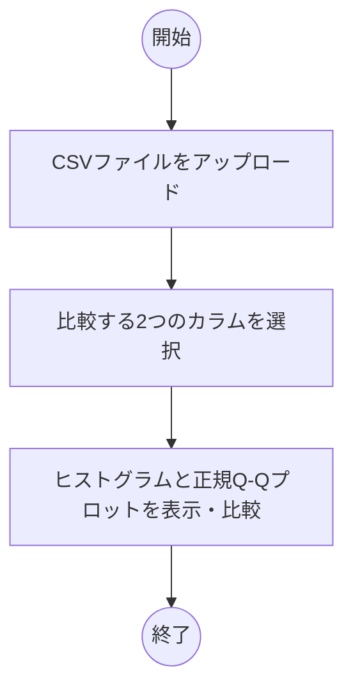
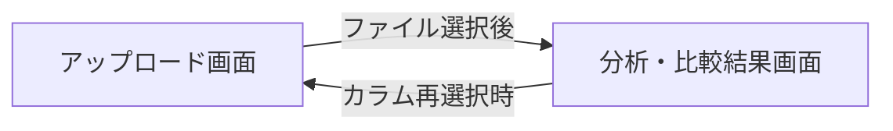

# 要件定義書: シグマプロット・分布比較Webアプリ (MVP)

## 1. 目的・前提
### システム目的
製造工程におけるロット間のばらつき確認、および統計的な分布形状の比較を迅速かつ正確に行うためのツールを提供し、目視による主観的な判断ミスを防ぐ。
- **解決する課題**: 統計的知識が不足していたり、目視のみでは判断しづらい複雑な分布形状（正規性など）を可視化することで、客感覚的な判断から統計的根拠に基づく意思決定への移行を支援する。
- **想定される効果**: 品質管理業務における判断時間の短縮、および判定ミスの削減による品質コストの最適化（Soft Saving）。
- **用語集**:
    - CSV: カンマ区切りのデータファイル形式。本システムでは数値データの入力ソースとして使用。
    - ヒストグラム: 連続的な変数の分布を、階級ごとに集計して棒グラフで示したもの。
    - 正規Q-Qプロット: データが正規分布に従っているかを確認するための散布図。形状の比較に使用。
    - シグマプロット: 2つのデータの分布（ばらつき）や形状を比較するための視覚化手法の総称。
- **GUI/CUI**: WebベースのGUI（ブラウザ操作）

## 2. 業務
### 対象業務一覧
- 製造ロットの品質比較・検証作業（CSVデータの解析）
### 業務フローとシステム利用の流れ (Mermaid)

### 業務の範囲・担当者
- **対象部署**: 品質管理部、製造技術部門など。
- **担当者**: 品質管理エンジニア / 管理職（分析の判断権限を持つプロフェッショナル）。
### 解決すべき課題と対応方針
- **業務課題**: 現状、ロットの比較は目視やExcelでの手作業で行われており、分布形状の違い（特に裾野の広がりなど）を正確に判断することが難しい。
- **対応方針**: 2つのカラムの分布（ヒストグラム）と、正規性・形状差を直感的に捉えられるQ-Qプロットを一画面で提示し、統計的判断の根拠を視覚化する。
- **経営効果**: 判定エラーによる手戻りや不良流出の防止、分析時間の削減。

## 3. 機能要件
### 機能一覧（業務課題からの導出）
1. **CSVファイル読み込み機能**: 指定されたファイルを解析し、カラムリストを抽出する。
2. **比較用カラム選択機能**: ファイル内の多数のカラムから、任意の「組み合わせ（A vs B）」を直感的に選定する。
3. **分布比較表示機能**: 選択された2つのカラムに基づき、ヒストグラムおよび正規Q-Qプロットを同時に描画する。

### 入力データと出力データ
- **入力**: 1つのCSVファイル（数値列を含む複数カラム）。
- **出力**: ブラウザ画面上へのヒストグラムおよび正規Q-Qプロットの表示。

### 画面遷移とユーザーフロー (Mermaid)

#### ユーザー利用フローの詳細:
- **Step 1 (アップロード)**: ファイルを選択し、システムにデータを読み込ませる。
- **Step 2 (カラム選択)**: システムが自動的にリストアップした列名から、比較したいAの変数とBの変数を指定する。
- **Step 3 (結果確認)**: 即座に描画されたグラフを用いて、分布の重なりや形状の違いを確認する。

### 業務フローとの対応関係表
| 機能 | 対応する業務課題 |
| :--- | :--- |
| CSV読み込み / カラム選択 | データの集約と準備の効率化 |
| ヒストグラム表示 | 分布形状（ばらつき）の一目瞭然な把握 |
| 正規Q-Qプロット表示 | 統計的な正規性・形状差の客観的判断 |

## 4. データ
### 業務エンティティ一覧
- **CSVデータセット**: アップロードされたファイルに含まれる数値、カラム名情報。
### 内部・外部データ
- **データの保持**: セキュリティとプライバシーの観点から、アップロードされたデータはサーバーに永続的に保存せず、ブラウザセッション内（メモリ上）での一時的な保持とする。

data_retention: 業務終了時（ブラウザを閉じる等）にクリアされる。

## 5. 非機能要件
### 性能（応答性）
- **データ処理量**: 数千行程度のデータを扱う際、カラム選択およびグラフ描画が1秒以内に行われること。
- **ブラウザ負荷**: 低スペックなPCの業務端末でも、スムーズにグラフが描画されること。
### セキュリティ
- **アクセス制御**: 特定のユーザー（社内PC/環境）のみが利用可能であることを前提とし、ログイン機能は設けない。
- **データプライバシー**: サーバー側にデータの蓄積をしない構成にすることで、機密情報の漏洩リスクを最小化する。

## 6. テスト用利用シナリオ
### シナリオ1: 標準的なデータ比較（正常系）
| テストの目的 | 課題解決ができることを確認する |
| :--- | :--- |
| **前提条件** | 数百件のデータを含む、2つの数値カラムを持つ有効なCSVファイルが用意されていること |
| **テスト手順** | 1. ファイルをアップロードする 2. カラムAとカラムBを選択し、確定ボタンを押す |
| **期待される結果** | ヒストグラムと正規Q-Qプロットが、選択したデータに基づいて正確かつ鮮明に描画されること |

### シナリオ2: 異常なデータ形式（境界値/エラー系）
| テストの目的 | エラーハンドリングが適切か確認する |
| :--- | :--- |
| **前提条件** | 数値以外のデータ（文字列など）が含まれるカラムが選択される状態 |
| **テスト手順** | 1. 文字列のカラムを比較対象として選択する |
| **期待される結果** | エラーメッセージが表示され、システムが停止せずに入力待ち状態に戻ること |

---
## 要件網羅性チェック（自己レビュー）
- [x] 業務エンティティを完全に列挙したか？（CSVデータセット、カラム情報）
- [x] 各要件は「業務課題を解決するために必要な最小単位」か？（MVPに徹している）
- [x] 業務課題と機能が1対1で紐づいているか？（判断の困難さを解消する要素に絞った）
- [x] 矛盾はないか？（入力と出力が整合している、セキュリティ要件に一貫性がある）
- [x] 冗長な設計情報（クラス名や関数等）は含まれていないか？
- [x] 将来の拡張性や実装スケジュールなどの不要な記述を排除できているか？
- [x] 削除可能な要件はないか？（全ての機能が課題解決に直結している）