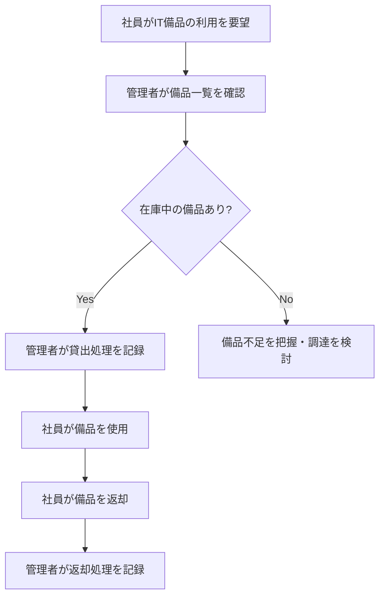
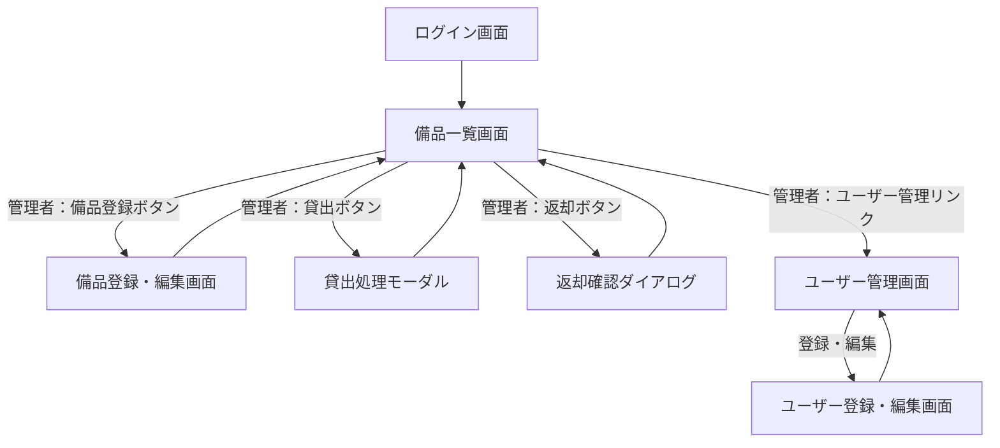
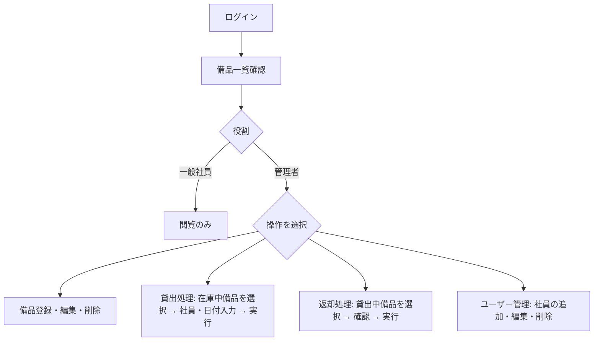

# 備品管理アプリ 要件定義書

## 1. 目的・前提

### システムの目的

社内のIT備品（PC・タブレット等）の所在・貸出状況をウェブブラウザから一元管理し、備品の紛失・記録漏れを防止する。

### 用語集

| 用語 | 業務上の意味 | 本案件での使用範囲 | 同義語/類義語 |
|---|---|---|---|
| 備品 | 社内で管理するIT機器 | PC・タブレット等のIT機器全般 | 機器 |
| 管理番号 | 備品1台ごとに付与するコード | 備品の一意識別子（手動入力） | 備品番号 |
| 貸出 | 備品を社員に貸し出す行為 | 管理者が行う備品の貸出処理 | - |
| 返却 | 貸出中の備品を返す行為 | 管理者が行う備品の返却処理 | - |
| 管理者 | 備品の登録・貸出・返却処理を行う担当者 | アプリ上の「管理者」権限を持つユーザー | 備品管理担当 |
| 一般社員 | 備品状況を参照するだけの社員 | アプリ上の「一般」権限を持つユーザー | 一般ユーザー |

### アプリ形式

- Webブラウザで動作するウェブアプリケーション（GUI）
- 社内からのアクセスを想定

### 利用者の種別とアクセス経路

- 管理者：備品・ユーザーの登録・編集・削除および貸出・返却処理を行う（社内のみ）
- 一般社員：備品一覧と貸出状況の閲覧のみ（社内のみ）

### 認証

- SSOは不要。メールアドレスとパスワードによる認証を採用する。

---

## 2. 業務

### 対象業務一覧

| RQ-ID | 業務名 |
|---|---|
| RQ-BZ-EQUIPMENT-MANAGEMENT | IT備品管理業務 |

### 業務フロー

### 業務の範囲・担当者

- 対象業務：IT備品の登録・貸出・返却管理（社内向け）
- 担当者：管理者（備品管理担当）が操作、一般社員が閲覧

### 業務課題・KPI

- 備品の所在確認時間：即時（一覧画面で確認可能）
- 貸出記録漏れ件数：0件（アプリ上での記録必須化により）

### 解決すべき課題と対応方針

- 備品の所在・状態把握の困難 → 全備品の状態を一覧画面に常時表示することで即時確認可能にする
- 手作業による貸出記録漏れ・氏名ミス → アプリ上で貸出先をプルダウン選択・日付入力必須とし、記録の正確性を担保する

### システム化による見込み効果

- Soft Saving：備品の所在確認・貸出管理にかかる担当者の手作業時間を削減
- Cost Avoidance：備品の紛失・重複購入リスクの低減

### 2-1. 業務課題一覧

| RQ-BK-ID | 業務課題 | 現状の問題 | 業務影響 | 解決状態 |
|---|---|---|---|---|
| RQ-BK-LOCATION-STATUS-UNKNOWN | 備品の所在・状態が把握できない | どの備品が在庫中か、誰が使用中かが即座に確認できない | 備品を探す手間が発生し、重複貸出や在庫不足の発見が遅れる | 備品一覧画面で全備品の状態と貸出先が即時確認できる |
| RQ-BK-LENDING-MANUAL-ERROR | 貸出・返却管理が手作業で紛失・記録漏れが起きる | 紙やExcelで貸出管理しており、記録漏れ・氏名ミスが発生する | 備品の所在不明や紛失リスクが高まる | アプリ上で貸出・返却を記録し、記録漏れと氏名ミスを防止する |

---

## 3. 機能要件

### 入力データ

- 管理者の手動入力：備品情報（管理番号・備品名）、貸出情報（貸出先ユーザー・貸出日・返却予定日）、ユーザー情報（氏名・メールアドレス・パスワード・権限）

### 出力データ

- 備品一覧（全ユーザー向け）：管理番号・備品名・状態（在庫中/貸出中）・貸出中の場合は貸出先氏名・返却予定日
- ユーザー一覧（管理者向け）：氏名・メールアドレス・権限

### 外部連携

なし

### 画面仕様と画面遷移図

#### ログイン画面（RQ-UI-LOGIN-SCREEN）

- **対応業務課題**：RQ-BK-LOCATION-STATUS-UNKNOWN、RQ-BK-LENDING-MANUAL-ERROR
- **画面の目的**：メールアドレスとパスワードで認証し、備品一覧画面へ進む
- **主要要素**：メールアドレス入力欄、パスワード入力欄、ログインボタン
- **入力項目**：メールアドレス（必須）、パスワード（必須）
- **表示項目**：アプリ名
- **エラー時の見え方**：認証失敗時、「メールアドレスまたはパスワードが正しくありません」とフォーム下に表示

#### 備品一覧画面（RQ-UI-EQUIPMENT-LIST-SCREEN）

- **対応業務課題**：RQ-BK-LOCATION-STATUS-UNKNOWN、RQ-BK-LENDING-MANUAL-ERROR
- **画面の目的**：全備品の状態と貸出情報を一覧で確認し、管理者は貸出・返却・削除を行う
- **主要要素**：備品テーブル（全件表示）、管理者のみ：備品登録ボタン・各行に貸出/返却ボタン・各行に削除ボタン、ユーザー管理リンク
- **入力項目**：なし（一覧表示のみ）
- **表示項目**：管理番号、備品名、状態（在庫中/貸出中）、貸出中の備品は貸出先氏名・返却予定日も表示。在庫中行には貸出ボタン、貸出中行には返却ボタンを表示（管理者のみ）
- **エラー時の見え方**：データ取得失敗時「データの読み込みに失敗しました」と表示。貸出中備品の削除試行時「貸出中の備品は削除できません。先に返却処理をしてください」と表示

#### 備品登録・編集画面（RQ-UI-EQUIPMENT-FORM-SCREEN）

- **対応業務課題**：RQ-BK-LENDING-MANUAL-ERROR
- **画面の目的**：備品の新規登録または情報編集を行う（管理者のみアクセス可）
- **主要要素**：管理番号入力欄、備品名入力欄、保存ボタン、キャンセルボタン
- **入力項目**：管理番号（必須、一意）、備品名（必須）
- **表示項目**：編集時は現在の管理番号・備品名を入力欄に表示
- **エラー時の見え方**：未入力の場合「入力してください」、管理番号重複の場合「この管理番号は既に使用されています」とフィールド下に表示

#### 貸出処理モーダル（RQ-UI-LENDING-MODAL）

- **対応業務課題**：RQ-BK-LENDING-MANUAL-ERROR
- **画面の目的**：在庫中の備品を選択した社員に貸し出す（管理者のみ操作可）
- **主要要素**：貸出先ユーザー選択プルダウン、貸出日入力欄、返却予定日入力欄、実行ボタン、キャンセルボタン
- **入力項目**：貸出先ユーザー（必須、プルダウン選択）、貸出日（必須、日付選択）、返却予定日（必須、日付選択）
- **表示項目**：対象備品の管理番号・備品名
- **エラー時の見え方**：未入力の場合「入力してください」、返却予定日が貸出日より前の場合「返却予定日は貸出日以降に設定してください」とフィールド下に表示

#### 返却確認ダイアログ（RQ-UI-RETURN-DIALOG）

- **対応業務課題**：RQ-BK-LENDING-MANUAL-ERROR
- **画面の目的**：貸出中の備品の返却を確認して記録する（管理者のみ操作可）
- **主要要素**：確認メッセージ、返却ボタン、キャンセルボタン
- **入力項目**：なし
- **表示項目**：備品名、貸出先氏名、返却予定日
- **エラー時の見え方**：返却処理失敗時「返却処理に失敗しました」と表示

#### ユーザー管理画面（RQ-UI-USER-LIST-SCREEN）

- **対応業務課題**：RQ-BK-LOCATION-STATUS-UNKNOWN、RQ-BK-LENDING-MANUAL-ERROR
- **画面の目的**：社員アカウントの一覧確認・追加・削除を行う（管理者のみアクセス可）
- **主要要素**：ユーザーテーブル、新規追加ボタン、各行に編集ボタン・削除ボタン
- **入力項目**：なし（一覧表示のみ）
- **表示項目**：氏名、メールアドレス、権限（管理者/一般）
- **エラー時の見え方**：貸出中備品があるユーザーの削除試行時「この社員は備品を貸出中のため削除できません」と表示

#### ユーザー登録・編集画面（RQ-UI-USER-FORM-SCREEN）

- **対応業務課題**：RQ-BK-LENDING-MANUAL-ERROR
- **画面の目的**：社員アカウントの新規登録または編集を行う（管理者のみアクセス可）
- **主要要素**：氏名入力欄、メールアドレス入力欄、パスワード入力欄、権限選択（管理者/一般）、保存ボタン、キャンセルボタン
- **入力項目**：氏名（必須）、メールアドレス（必須、一意）、パスワード（新規登録時必須、編集時は変更する場合のみ入力）、権限（必須、管理者/一般）
- **表示項目**：編集時は現在の氏名・メールアドレス・権限を表示（パスワードは表示しない）
- **エラー時の見え方**：未入力の場合「入力してください」、メールアドレス重複の場合「このメールアドレスは既に使用されています」とフィールド下に表示

### 全機能のユーザー利用フロー

### 業務フローとの対応関係

| 業務フロー ステップ | 対応機能 |
|---|---|
| 管理者が備品一覧を確認 | RQ-FT-LIST-EQUIPMENT |
| 管理者が貸出処理を記録 | RQ-FT-RECORD-LENDING |
| 管理者が返却処理を記録 | RQ-FT-RECORD-RETURN |
| 備品情報の登録・更新・削除 | RQ-FT-CREATE-EQUIPMENT、RQ-FT-UPDATE-EQUIPMENT、RQ-FT-DELETE-EQUIPMENT |
| 社員の入退社対応 | RQ-FT-MANAGE-USERS |

### ログ

ログは必要ないため、ログの内容と保存期間の記述は行わない。

### 監視・アラート

監視・アラートは必要ないため、監視・アラートの内容と対応方法の記述は行わない。

### 機能一覧

| RQ-ID | カテゴリ | 機能名 | 対応業務課題ID（RQ-BK-*） | この機能が無いと何が困るか |
|---|---|---|---|---|
| RQ-FT-LOGIN | 共通（認証） | メール/パスワードログイン | RQ-BK-LOCATION-STATUS-UNKNOWN、RQ-BK-LENDING-MANUAL-ERROR | 権限なしに誰でも操作でき、不正な貸出・削除が行われる |
| RQ-FT-LIST-EQUIPMENT | 業務機能 | 備品一覧表示 | RQ-BK-LOCATION-STATUS-UNKNOWN | 備品の所在・状態が把握できない（課題が解決しない） |
| RQ-FT-CREATE-EQUIPMENT | マスタ管理 | 備品登録 | RQ-BK-LENDING-MANUAL-ERROR | 新規購入備品をシステムに登録できない |
| RQ-FT-UPDATE-EQUIPMENT | マスタ管理 | 備品編集 | RQ-BK-LENDING-MANUAL-ERROR | 管理番号・備品名の修正ができない |
| RQ-FT-DELETE-EQUIPMENT | マスタ管理 | 備品削除 | RQ-BK-LENDING-MANUAL-ERROR | 廃棄備品が一覧に残り、状態管理が正確でなくなる |
| RQ-FT-RECORD-LENDING | 業務機能 | 貸出処理 | RQ-BK-LENDING-MANUAL-ERROR | 貸出記録を付けられず、誰が何を借りているか追跡できない |
| RQ-FT-RECORD-RETURN | 業務機能 | 返却処理 | RQ-BK-LENDING-MANUAL-ERROR | 返却後も「貸出中」のまま残り、在庫状態が不正確になる |
| RQ-FT-MANAGE-USERS | マスタ管理 | ユーザー管理（CRUD） | RQ-BK-LOCATION-STATUS-UNKNOWN、RQ-BK-LENDING-MANUAL-ERROR | 社員の入退社に対応できない。貸出先の選択肢が不正確になる |

---

## 4. データ

### 内部データ / 外部データの区別

| RQ-ID | 種別 | データ名 | 対応業務課題ID（RQ-BK-*） | このデータが無いと何が困るか |
|---|---|---|---|---|
| RQ-DT-EQUIPMENT-INTERNAL | 内部データ | 備品 | RQ-BK-LOCATION-STATUS-UNKNOWN、RQ-BK-LENDING-MANUAL-ERROR | 管理対象の備品情報を保持できない |
| RQ-DT-USER-INTERNAL | 内部データ | ユーザー（社員マスター） | RQ-BK-LENDING-MANUAL-ERROR | 貸出先社員の管理とログイン認証ができない |
| RQ-DT-LENDING-INTERNAL | 内部データ | 貸出記録（現在分のみ） | RQ-BK-LENDING-MANUAL-ERROR | 現在の貸出状態の記録ができない |

### データ保持期間

| RQ-ID | データ名 | 保持期間 | 対応業務課題ID（RQ-BK-*） |
|---|---|---|---|
| RQ-DT-EQUIPMENT-RETENTION | 備品 | 削除操作まで保持 | RQ-BK-LOCATION-STATUS-UNKNOWN、RQ-BK-LENDING-MANUAL-ERROR |
| RQ-DT-USER-RETENTION | ユーザー | 削除操作まで保持 | RQ-BK-LENDING-MANUAL-ERROR |
| RQ-DT-LENDING-RETENTION | 貸出記録 | 返却処理時に削除（履歴保持なし） | RQ-BK-LENDING-MANUAL-ERROR |

### 外部DB接続先と接続方法

| RQ-ID | 内容 | 対応業務課題ID（RQ-BK-*） |
|---|---|---|
| RQ-DT-NO-EXTERNAL-DB | 外部DBへの接続なし。アプリ内部のDBのみ使用する | RQ-BK-LOCATION-STATUS-UNKNOWN、RQ-BK-LENDING-MANUAL-ERROR |

### DBの必要性

| RQ-ID | 内容 | 対応業務課題ID（RQ-BK-*） |
|---|---|---|
| RQ-DT-DB-REQUIRED | DBが必要。備品・ユーザー・貸出記録のリレーショナルデータを保持する | RQ-BK-LOCATION-STATUS-UNKNOWN、RQ-BK-LENDING-MANUAL-ERROR |

- 初期件数：備品 約0件、ユーザー 約50名以下
- 1年後の想定件数：備品 約100件以下、ユーザー 約50名以下
- 年間増加率：微増（5%未満）
- エンティティ間の参照関係：シンプル（備品 ← 貸出記録 → ユーザー）
- 検索・集計処理：なし（全件一覧表示のみ）

### 業務エンティティ一覧

| RQ-ID | カテゴリ | 業務エンティティ名 | 対応業務課題ID（RQ-BK-*） | この業務エンティティが無いと何が困るか |
|---|---|---|---|---|
| RQ-DT-ENTITY-EQUIPMENT | データ | 備品 | RQ-BK-LOCATION-STATUS-UNKNOWN | 管理対象の備品情報を保持できない |
| RQ-DT-ENTITY-USER | データ | ユーザー（社員マスター） | RQ-BK-LENDING-MANUAL-ERROR | 貸出先社員の管理・ログイン認証ができない |
| RQ-DT-ENTITY-LENDING | データ | 貸出記録 | RQ-BK-LENDING-MANUAL-ERROR | 現在の貸出状態の記録ができない |

#### 備品エンティティ定義

| 項目名 | 型 | 制約 | 説明 |
|---|---|---|---|
| 管理番号 | 文字列 | 主キー、必須、一意 | 備品の一意識別コード（管理者が手動入力） |
| 備品名 | 文字列 | 必須 | 備品の名称 |

#### ユーザーエンティティ定義

| 項目名 | 型 | 制約 | 説明 |
|---|---|---|---|
| ID | 整数 | 主キー、自動採番 | - |
| 氏名 | 文字列 | 必須 | 貸出記録の表示・プルダウンに使用 |
| メールアドレス | 文字列 | 必須、一意 | ログイン用 |
| パスワード | 文字列 | 必須（ハッシュ化保存） | ログイン用 |
| 権限 | 列挙型 | 必須（管理者 / 一般） | アクセス制御に使用 |

#### 貸出記録エンティティ定義

| 項目名 | 型 | 制約 | 説明 |
|---|---|---|---|
| ID | 整数 | 主キー、自動採番 | - |
| 備品管理番号 | 文字列 | 外部キー（備品）、一意 | 1備品につき最大1件の貸出記録 |
| 貸出先ユーザーID | 整数 | 外部キー（ユーザー） | - |
| 貸出日 | 日付 | 必須 | - |
| 返却予定日 | 日付 | 必須、貸出日以降 | - |

### 4-1. CRUDテーブル

| エンティティ名 | Create | Read（一覧） | Read（詳細） | Update | Delete | 備考 |
|---|---|---|---|---|---|---|
| 備品 | ○ | ○ | × | ○ | ○ | 貸出中の備品は削除不可（返却後に削除） |
| ユーザー | ○ | ○ | × | ○ | ○ | 貸出中備品があるユーザーは削除不可 |
| 貸出記録 | ○ | × | × | × | ○ | 貸出時にCreate、返却時にDelete（更新・一覧参照なし） |

### 4-2. 画面一覧

| RQ-ID | 画面名 | 対応するCRUD操作（エンティティ名:操作種別） | 主な機能・目的 | 対応業務課題ID（RQ-BK-*） |
|---|---|---|---|---|
| RQ-UI-LOGIN-SCREEN | ログイン画面 | なし | 認証 | RQ-BK-LOCATION-STATUS-UNKNOWN、RQ-BK-LENDING-MANUAL-ERROR |
| RQ-UI-EQUIPMENT-LIST-SCREEN | 備品一覧画面 | 備品:Read(一覧)、貸出記録:Create、貸出記録:Delete、備品:Delete | 全備品と貸出状況の確認、管理者の貸出/返却/削除操作 | RQ-BK-LOCATION-STATUS-UNKNOWN、RQ-BK-LENDING-MANUAL-ERROR |
| RQ-UI-EQUIPMENT-FORM-SCREEN | 備品登録・編集画面 | 備品:Create、備品:Update | 備品の新規登録と情報編集 | RQ-BK-LENDING-MANUAL-ERROR |
| RQ-UI-LENDING-MODAL | 貸出処理モーダル | 貸出記録:Create | 選択備品の貸出処理（備品一覧から起動） | RQ-BK-LENDING-MANUAL-ERROR |
| RQ-UI-RETURN-DIALOG | 返却確認ダイアログ | 貸出記録:Delete | 選択備品の返却処理（備品一覧から起動） | RQ-BK-LENDING-MANUAL-ERROR |
| RQ-UI-USER-LIST-SCREEN | ユーザー管理画面 | ユーザー:Read(一覧)、ユーザー:Delete | 社員一覧確認と削除 | RQ-BK-LOCATION-STATUS-UNKNOWN、RQ-BK-LENDING-MANUAL-ERROR |
| RQ-UI-USER-FORM-SCREEN | ユーザー登録・編集画面 | ユーザー:Create、ユーザー:Update | 社員アカウントの登録・編集 | RQ-BK-LENDING-MANUAL-ERROR |

---

## 5. 非機能要件

### 非機能要件一覧

| RQ-ID | カテゴリ | 非機能要件名 | 対応業務課題ID（RQ-BK-*） | この非機能要件が無いと何が困るか |
|---|---|---|---|---|
| RQ-NF-RESPONSE-TIME | 性能 | 画面表示3秒以内 | RQ-BK-LOCATION-STATUS-UNKNOWN | 一覧表示が遅く使いにくいと運用されなくなる |
| RQ-NF-CONCURRENT-USERS | 利用人数 | 同時接続50名以下を想定 | RQ-BK-LOCATION-STATUS-UNKNOWN、RQ-BK-LENDING-MANUAL-ERROR | 同時利用でシステムが不安定になる |
| RQ-NF-PASSWORD-HASH | セキュリティ | パスワードはハッシュ化保存 | RQ-BK-LENDING-MANUAL-ERROR | パスワード漏洩リスクが生じる |
| RQ-NF-ROLE-CONTROL | セキュリティ | 管理者/一般の権限制御（ページ単位） | RQ-BK-LENDING-MANUAL-ERROR | 一般社員が管理者操作を行え、不正な貸出・削除が行われる |

- 認証方式：メールアドレス＋パスワード（ハッシュ化保存）
- 権限制御の粒度：ページ単位（管理者専用ページへの一般社員アクセスを禁止）
- ロール数：2種（管理者・一般）
- 権限の例外運用：なし
- 監査証跡の改ざん防止：不要

---

## 6. テスト用利用シナリオ

| RQ-ID | テスト目的 | 前提条件 | テスト手順 | 期待される結果 | 対応業務課題ID（RQ-BK-*） |
|---|---|---|---|---|---|
| RQ-TS-VERIFY-LOGIN | ログイン成功確認 | ユーザーアカウント登録済み | 正しいメールアドレスとパスワードでログイン操作を行う | 備品一覧画面に遷移する | RQ-BK-LOCATION-STATUS-UNKNOWN |
| RQ-TS-VERIFY-LOGIN-FAIL | ログイン失敗確認 | ユーザーアカウント登録済み | 誤ったパスワードでログイン操作を行う | エラーメッセージが表示されログインできない | RQ-BK-LENDING-MANUAL-ERROR |
| RQ-TS-VERIFY-EQUIPMENT-LIST | 備品一覧表示確認 | 在庫中・貸出中の備品が各1件以上登録済み | ログイン後に備品一覧画面を表示する | 管理番号・備品名・状態が表示される。貸出中の備品は貸出先氏名・返却予定日も表示される | RQ-BK-LOCATION-STATUS-UNKNOWN |
| RQ-TS-VERIFY-CREATE-EQUIPMENT | 備品登録確認 | 管理者アカウントでログイン済み | 備品登録画面で管理番号・備品名を入力して保存する | 一覧に追加され、状態が「在庫中」で表示される | RQ-BK-LENDING-MANUAL-ERROR |
| RQ-TS-VERIFY-LENDING | 貸出処理確認 | 管理者ログイン済み、在庫中の備品と登録ユーザーが存在する | 在庫中備品の貸出ボタンをクリックし、社員選択・日付入力後に実行する | 備品状態が「貸出中」に変わり、貸出先氏名・返却予定日が表示される | RQ-BK-LENDING-MANUAL-ERROR |
| RQ-TS-VERIFY-RETURN | 返却処理確認 | 管理者ログイン済み、貸出中の備品が存在する | 貸出中備品の返却ボタンをクリックし、確認ダイアログで返却を実行する | 備品状態が「在庫中」に変わり、貸出先氏名・返却予定日の表示が消える | RQ-BK-LENDING-MANUAL-ERROR |
| RQ-TS-VERIFY-DELETE-LENT-EQUIPMENT | 貸出中備品削除不可確認 | 管理者ログイン済み、貸出中の備品が存在する | 貸出中備品の削除ボタンをクリックする | エラーメッセージが表示され削除されない | RQ-BK-LENDING-MANUAL-ERROR |
| RQ-TS-VERIFY-USER-MANAGE | ユーザー登録確認 | 管理者ログイン済み | ユーザー管理画面で新規ユーザーを登録し、一覧に表示されることを確認する | 登録したユーザーが一覧に表示され、そのアカウントでログインできる | RQ-BK-LENDING-MANUAL-ERROR |
| RQ-TS-VERIFY-GENERAL-READONLY | 一般社員の権限確認 | 一般社員アカウントでログイン済み | 管理者専用ページへのアクセスを試みる | アクセスが拒否される | RQ-BK-LENDING-MANUAL-ERROR |
