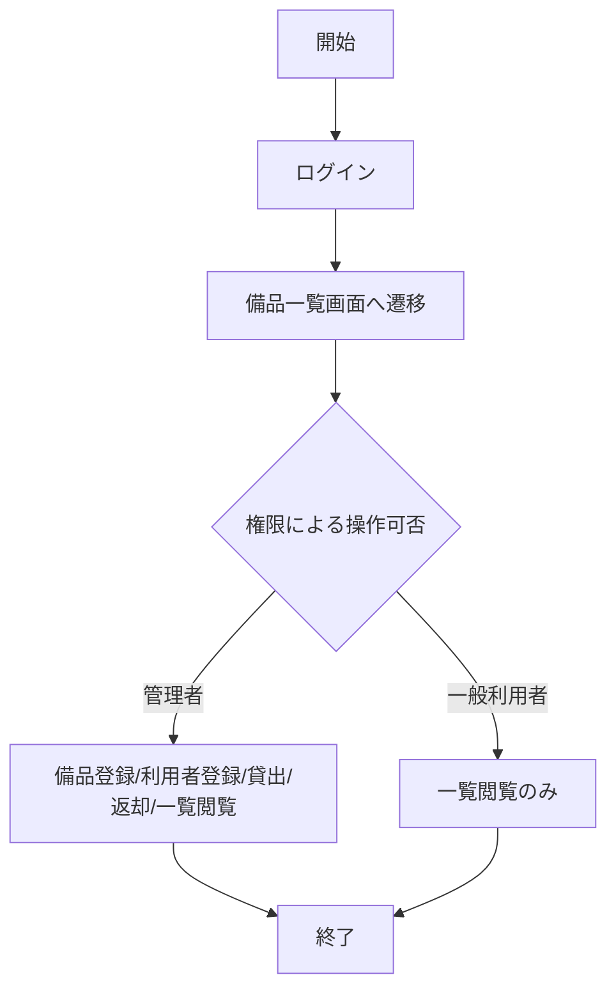
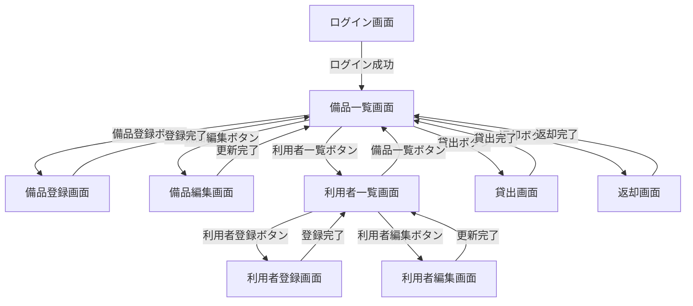
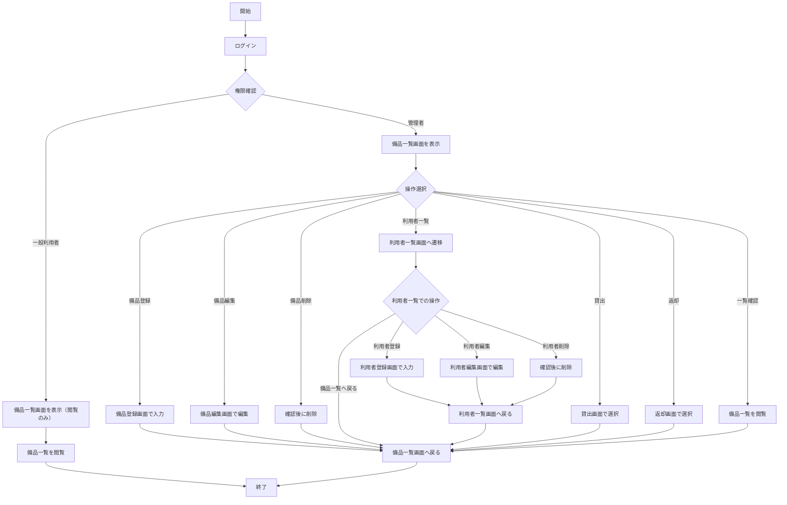
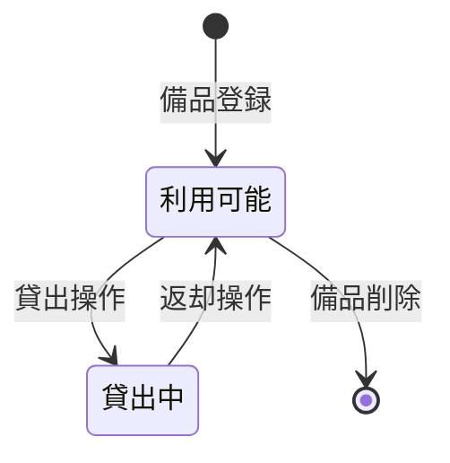

# 備品管理・貸出管理アプリ 要件定義書

## 1. 目的・前提

### 1-1. システムの目的

備品の貸出状況をリアルタイムに把握し、利用者が必要な時に備品を借りられる状態を実現する。

### 1-2. 用語集

| 用語 | 定義 |
|---|---|
| 備品 | 組織内で共有される機器や物品 |
| 利用者 | システムにログインして備品の管理や閲覧を行う人 |
| 管理者 | 備品・利用者の登録、貸出・返却操作が可能な権限を持つ利用者 |
| 一般利用者 | 備品一覧の閲覧のみ可能な権限を持つ利用者 |
| 貸出 | 備品を利用者に割り当てる操作 |
| 返却 | 貸出中の備品を利用可能な状態に戻す操作 |
| 資産管理番号 | 備品を一意に識別するための番号 |

### 1-3. GUI / CUI

**GUI**（Web GUI / Gradio）

---

## 2. 業務

### RQ-BZ-EQUIPMENT-LENDING

備品の貸出・返却・状況確認を行う業務

### 2-1. 対象業務一覧

| RQ-BZ-ID | 業務名 | 業務概要 |
|---|---|---|
| RQ-BZ-EQUIPMENT-LENDING | 備品貸出管理 | 備品の貸出・返却・状況確認を行う |

### 2-2. 業務フロー

### 2-3. 業務の範囲・担当者

- **担当者**: 組織内の備品管理担当者（管理者）、および備品の貸出状況を確認したい全利用者
- **業務範囲**: 備品の登録、利用者の登録、貸出、返却、状況確認

### 2-4. 業務課題一覧

| RQ-BK-ID | 業務課題 | 現状の問題 | 業務影響 | 解決状態 |
|---|---|---|---|---|
| RQ-BK-LENDING-STATUS-UNKNOWN | 貸出状況が不明 | 誰がどの備品を借りているか把握できない | 使いたい時に備品を借りられず、業務が滞る | システムで貸出状況をリアルタイムに把握でき、利用可能な備品がすぐに分かる |

### 2-5. 解決すべき課題と対応方針

**RQ-BK-LENDING-STATUS-UNKNOWN**に対して、以下の対応方針を取る：

- 備品の貸出状況をデータベースで管理し、リアルタイムに更新する
- 備品一覧画面で貸出中・利用可能の状態を可視化する
- 貸出・返却操作をシステム化し、手作業での記録ミスを防ぐ

### 2-6. システム化による見込み経営効果

- **Soft Saving**: 備品の所在確認にかかる時間の削減（1回あたり平均5分の削減）
- **Soft Saving**: 貸出状況の問い合わせ対応工数の削減

---

## 3. 機能要件

### 3-1. 入力データ

- **人手入力**: 備品情報（名称、資産管理番号）、利用者情報（氏名、ユーザーID、パスワード、権限）、貸出・返却操作
- **外部連携**: なし

### 3-2. 出力データ

- 備品一覧（貸出状況含む）
- 利用者一覧

### 3-3. 外部連携

なし

### 3-4. 全画面の仕様と画面遷移図

#### 画面一覧

| RQ-UI-ID | 画面名 | 概要 | 対応業務課題ID |
|---|---|---|---|
| RQ-UI-LOGIN-SCREEN | ログイン画面 | ユーザーIDとパスワードでログインする | RQ-BK-LENDING-STATUS-UNKNOWN |
| RQ-UI-ITEM-LIST-SCREEN | 備品一覧画面 | 備品一覧と貸出状況を表示する | RQ-BK-LENDING-STATUS-UNKNOWN |
| RQ-UI-ITEM-REGISTER-SCREEN | 備品登録画面 | 備品を新規登録する | RQ-BK-LENDING-STATUS-UNKNOWN |
| RQ-UI-ITEM-EDIT-SCREEN | 備品編集画面 | 備品情報を編集する | RQ-BK-LENDING-STATUS-UNKNOWN |
| RQ-UI-USER-LIST-SCREEN | 利用者一覧画面 | 利用者一覧を表示する | RQ-BK-LENDING-STATUS-UNKNOWN |
| RQ-UI-USER-REGISTER-SCREEN | 利用者登録画面 | 利用者を新規登録する | RQ-BK-LENDING-STATUS-UNKNOWN |
| RQ-UI-USER-EDIT-SCREEN | 利用者編集画面 | 利用者情報を編集する | RQ-BK-LENDING-STATUS-UNKNOWN |
| RQ-UI-LENDING-SCREEN | 貸出画面 | 備品を貸し出す | RQ-BK-LENDING-STATUS-UNKNOWN |
| RQ-UI-RETURN-SCREEN | 返却画面 | 備品を返却する | RQ-BK-LENDING-STATUS-UNKNOWN |

#### RQ-UI-LOGIN-SCREEN: ログイン画面

- **入力項目**: ユーザーID、パスワード
- **操作**: ログインボタンをクリック
- **遷移先**: 
  - ログイン成功時、権限が管理者の場合は備品一覧画面へ遷移
  - ログイン成功時、権限が一般利用者の場合は備品一覧画面へ遷移（閲覧のみ）
  - ログイン失敗時はエラーメッセージを表示

#### RQ-UI-ITEM-LIST-SCREEN: 備品一覧画面

- **表示項目**: 資産管理番号、名称、貸出状況（利用可能/貸出中）、借り主（貸出中の場合）
- **操作**（管理者のみ）: 
  - 備品登録ボタンをクリック → 備品登録画面へ遷移
  - 各備品の編集ボタンをクリック → 備品編集画面へ遷移
  - 各備品の削除ボタンをクリック → 確認後、備品を削除
  - 利用者一覧ボタンをクリック → 利用者一覧画面へ遷移
  - 貸出ボタンをクリック → 貸出画面へ遷移
  - 返却ボタンをクリック → 返却画面へ遷移
- **操作**（一般利用者）: 閲覧のみ

#### RQ-UI-ITEM-REGISTER-SCREEN: 備品登録画面

- **入力項目**: 資産管理番号、名称
- **操作**: 登録ボタンをクリック → 備品一覧画面へ遷移
- **権限**: 管理者のみ

#### RQ-UI-ITEM-EDIT-SCREEN: 備品編集画面

- **入力項目**: 資産管理番号（変更不可）、名称
- **操作**: 更新ボタンをクリック → 備品一覧画面へ遷移
- **権限**: 管理者のみ

#### RQ-UI-USER-LIST-SCREEN: 利用者一覧画面

- **表示項目**: ユーザーID、氏名、権限
- **操作**: 
  - 利用者登録ボタンをクリック → 利用者登録画面へ遷移
  - 各利用者の編集ボタンをクリック → 利用者編集画面へ遷移
  - 各利用者の削除ボタンをクリック → 確認後、利用者を削除
  - 備品一覧ボタンをクリック → 備品一覧画面へ遷移
- **権限**: 管理者のみ

#### RQ-UI-USER-REGISTER-SCREEN: 利用者登録画面

- **入力項目**: ユーザーID、氏名、パスワード、権限（管理者/一般利用者）
- **操作**: 登録ボタンをクリック → 利用者一覧画面へ遷移
- **権限**: 管理者のみ

#### RQ-UI-USER-EDIT-SCREEN: 利用者編集画面

- **入力項目**: ユーザーID（変更不可）、氏名、パスワード、権限（管理者/一般利用者）
- **操作**: 更新ボタンをクリック → 利用者一覧画面へ遷移
- **権限**: 管理者のみ

#### RQ-UI-LENDING-SCREEN: 貸出画面

- **入力項目**: 備品（資産管理番号で選択）、利用者（ユーザーIDで選択）
- **操作**: 貸出ボタンをクリック → 備品一覧画面へ遷移
- **権限**: 管理者のみ

#### RQ-UI-RETURN-SCREEN: 返却画面

- **入力項目**: 備品（資産管理番号で選択）
- **操作**: 返却ボタンをクリック → 備品一覧画面へ遷移
- **権限**: 管理者のみ

#### 画面遷移図

### 3-5. 全機能についてのユーザー利用フロー

### 3-6. 業務フローとの対応関係

業務フローで定義した各ステップは、以下の機能で実現される：

- ログイン → RQ-FT-LOGIN
- 備品登録 → RQ-FT-REGISTER-ITEM
- 備品編集 → RQ-FT-EDIT-ITEM
- 備品削除 → RQ-FT-DELETE-ITEM
- 利用者登録 → RQ-FT-REGISTER-USER
- 利用者編集 → RQ-FT-EDIT-USER
- 利用者削除 → RQ-FT-DELETE-USER
- 貸出処理 → RQ-FT-LEND-ITEM
- 返却処理 → RQ-FT-RETURN-ITEM
- 一覧閲覧 → RQ-FT-VIEW-ITEM-LIST, RQ-FT-VIEW-USER-LIST

### 3-7. ログの要否・内容・保存期間

ログは必要ないため、ログの内容と保存期間の記述は行わない。一般的なアプリケーション動作ログ・エラーログのみを記録する。

### 3-8. 監視・アラートの要否・内容・対応方法

監視・アラートは必要ないため、監視・アラートの内容と対応方法の記述は行わない。

### 3-9. 機能一覧

| RQ-ID | カテゴリ | 機能名 | 対応業務課題ID | この機能が無いと何が困るか |
|---|---|---|---|---|
| RQ-FT-LOGIN | 認証 | ログイン | RQ-BK-LENDING-STATUS-UNKNOWN | 権限制御ができず、一般利用者が備品・利用者の登録や貸出・返却操作を行えてしまう |
| RQ-FT-REGISTER-ITEM | マスタ管理 | 備品登録 | RQ-BK-LENDING-STATUS-UNKNOWN | 備品を管理できず、貸出状況の把握ができない |
| RQ-FT-EDIT-ITEM | マスタ管理 | 備品編集 | RQ-BK-LENDING-STATUS-UNKNOWN | 備品情報の修正ができず、誤った情報のまま運用される |
| RQ-FT-DELETE-ITEM | マスタ管理 | 備品削除 | RQ-BK-LENDING-STATUS-UNKNOWN | 不要になった備品を削除できず、一覧が煩雑になる |
| RQ-FT-REGISTER-USER | マスタ管理 | 利用者登録 | RQ-BK-LENDING-STATUS-UNKNOWN | 利用者を管理できず、貸出先を記録できない |
| RQ-FT-EDIT-USER | マスタ管理 | 利用者編集 | RQ-BK-LENDING-STATUS-UNKNOWN | 利用者情報の修正ができず、誤った情報のまま運用される |
| RQ-FT-DELETE-USER | マスタ管理 | 利用者削除 | RQ-BK-LENDING-STATUS-UNKNOWN | 退職した利用者などを削除できず、一覧が煩雑になる |
| RQ-FT-LEND-ITEM | 業務機能 | 備品貸出 | RQ-BK-LENDING-STATUS-UNKNOWN | 貸出操作ができず、貸出状況をシステムで管理できない |
| RQ-FT-RETURN-ITEM | 業務機能 | 備品返却 | RQ-BK-LENDING-STATUS-UNKNOWN | 返却操作ができず、貸出中の備品を利用可能な状態に戻せない |
| RQ-FT-VIEW-ITEM-LIST | 業務機能 | 備品一覧表示 | RQ-BK-LENDING-STATUS-UNKNOWN | 備品一覧と貸出状況を確認できず、どの備品が利用可能か分からない |
| RQ-FT-VIEW-USER-LIST | マスタ管理 | 利用者一覧表示 | RQ-BK-LENDING-STATUS-UNKNOWN | 利用者一覧を確認できず、利用者の管理ができない |

---

## 4. データ

### 4-1. 内部データ / 外部データの区別

| RQ-DT-ID | データ名 | 内部/外部 | 対応業務課題ID | このデータが無いと何が困るか |
|---|---|---|---|---|
| RQ-DT-ITEM-INTERNAL | 備品データ | 内部 | RQ-BK-LENDING-STATUS-UNKNOWN | 備品情報を管理できず、貸出状況を把握できない |
| RQ-DT-USER-INTERNAL | 利用者データ | 内部 | RQ-BK-LENDING-STATUS-UNKNOWN | 利用者情報を管理できず、貸出先を記録できない |

### 4-2. データ保持期間

| RQ-DT-ID | データ名 | 保持期間 | 対応業務課題ID | この保持期間が無いと何が困るか |
|---|---|---|---|---|
| RQ-DT-ITEM-RETENTION | 備品データ保持期間 | 無期限（手動削除のみ） | RQ-BK-LENDING-STATUS-UNKNOWN | 備品データが消えると、貸出状況の履歴が失われる |
| RQ-DT-USER-RETENTION | 利用者データ保持期間 | 無期限（手動削除のみ） | RQ-BK-LENDING-STATUS-UNKNOWN | 利用者データが消えると、貸出先の履歴が失われる |

### 4-3. 外部 DB 接続先と接続方法の一覧

該当なし（外部連携なし）

### 4-4. DB の必要性の有無と理由

| RQ-DT-ID | DB の必要性 | 理由 | 対応業務課題ID | DB が無いと何が困るか |
|---|---|---|---|---|
| RQ-DT-DB-REQUIRED | 必要 | 備品と利用者のデータを永続化し、アプリ再起動後もデータが残る必要がある | RQ-BK-LENDING-STATUS-UNKNOWN | データが永続化されず、アプリ再起動時にデータが失われる |

### 4-5. 業務エンティティ一覧

| RQ-DT-ID | カテゴリ | 業務エンティティ名 | 対応業務課題ID | この業務エンティティが無いと何が困るか |
|---|---|---|---|---|
| RQ-DT-ITEM | マスタ | 備品 | RQ-BK-LENDING-STATUS-UNKNOWN | 備品情報を管理できず、貸出状況を把握できない |
| RQ-DT-USER | マスタ | 利用者 | RQ-BK-LENDING-STATUS-UNKNOWN | 利用者情報を管理できず、貸出先を記録できない |

#### RQ-DT-ITEM: 備品

- **資産管理番号**: 備品を一意に識別する番号
- **名称**: 備品の名前
- **借り主**: 現在この備品を借りている利用者のユーザーID（NULL の場合は利用可能）

#### RQ-DT-USER: 利用者

- **ユーザーID**: 利用者を一意に識別するID
- **氏名**: 利用者の名前
- **パスワード**: ログイン用のパスワード（ハッシュ化して保存）
- **権限**: 管理者 / 一般利用者

### 4-5-1. 業務エンティティの状態遷移

#### 備品の状態遷移

- **利用可能**: 備品が登録されており、誰にも貸し出されていない状態（借り主がNULL）
- **貸出中**: 備品が誰かに貸し出されている状態（借り主に利用者のユーザーIDが設定されている）

### 4-6. CRUDテーブル

| エンティティ名 | Create | Read（一覧） | Read（詳細） | Update | Delete | 備考 |
|---|---|---|---|---|---|---|
| 備品 | ○ | ○ | × | ○ | ○ | Update は編集画面での更新と貸出・返却時の借り主更新 |
| 利用者 | ○ | ○ | × | ○ | ○ | Update は編集画面での更新 |

**セル値の定義**:

| 値 | 意味 |
|---|---|
| ○ | 必須の操作 |
| △ | 条件付きで必要な操作 |
| × | 対象外の操作 |

---

## 5. 非機能要件

### 5-1. 性能

| RQ-NF-ID | 非機能要件名 | 目標値 | 対応業務課題ID | この非機能要件が無いと何が困るか |
|---|---|---|---|---|
| RQ-NF-RESPONSE-TIME | 応答時間 | 5秒以内 | RQ-BK-LENDING-STATUS-UNKNOWN | 画面操作時の応答が遅く、利用者がストレスを感じる |

### 5-2. 利用人数

| RQ-NF-ID | 非機能要件名 | 目標値 | 対応業務課題ID | この非機能要件が無いと何が困るか |
|---|---|---|---|---|
| RQ-NF-CONCURRENT-USERS | 同時接続数 | 1-5人 | RQ-BK-LENDING-STATUS-UNKNOWN | 複数人が同時にアクセスできず、業務が滞る |

### 5-3. セキュリティ要件

| RQ-NF-ID | 非機能要件名 | 内容 | 対応業務課題ID | この非機能要件が無いと何が困るか |
|---|---|---|---|---|
| RQ-NF-PASSWORD-HASH | パスワードのハッシュ化 | パスワードは平文で保存せず、ハッシュ化して保存する | RQ-BK-LENDING-STATUS-UNKNOWN | パスワードが漏洩した際に、悪用されるリスクが高まる |
| RQ-NF-ACCESS-CONTROL | 権限制御 | 管理者と一般利用者で操作可能な機能を制限する | RQ-BK-LENDING-STATUS-UNKNOWN | 一般利用者が備品・利用者の登録や貸出・返却操作を行えてしまう |

### 5-4. 非機能要件一覧

| RQ-NF-ID | カテゴリ | 非機能要件名 | 対応業務課題ID | この非機能要件が無いと何が困るか |
|---|---|---|---|---|
| RQ-NF-RESPONSE-TIME | 性能 | 応答時間 | RQ-BK-LENDING-STATUS-UNKNOWN | 画面操作時の応答が遅く、利用者がストレスを感じる |
| RQ-NF-CONCURRENT-USERS | 性能 | 同時接続数 | RQ-BK-LENDING-STATUS-UNKNOWN | 複数人が同時にアクセスできず、業務が滞る |
| RQ-NF-PASSWORD-HASH | セキュリティ | パスワードのハッシュ化 | RQ-BK-LENDING-STATUS-UNKNOWN | パスワードが漏洩した際に、悪用されるリスクが高まる |
| RQ-NF-ACCESS-CONTROL | セキュリティ | 権限制御 | RQ-BK-LENDING-STATUS-UNKNOWN | 一般利用者が備品・利用者の登録や貸出・返却操作を行えてしまう |

---

## 6. テスト用利用シナリオ

| RQ-TS-ID | テスト目的 | 前提条件 | テスト手順 | 期待される結果 | 対応業務課題ID |
|---|---|---|---|---|---|
| RQ-TS-LOGIN-SUCCESS | ログイン成功を確認 | 利用者が登録済み | 1. ログイン画面でユーザーIDとパスワードを入力 2. ログインボタンをクリック | 備品一覧画面へ遷移する | RQ-BK-LENDING-STATUS-UNKNOWN |
| RQ-TS-LOGIN-FAILURE | ログイン失敗を確認 | 利用者が登録済み | 1. ログイン画面で誤ったパスワードを入力 2. ログインボタンをクリック | エラーメッセージが表示され、ログイン画面のまま | RQ-BK-LENDING-STATUS-UNKNOWN |
| RQ-TS-REGISTER-ITEM | 備品登録を確認 | 管理者でログイン済み | 1. 備品一覧画面で備品登録ボタンをクリック 2. 備品登録画面で資産管理番号と名称を入力 3. 登録ボタンをクリック | 備品一覧画面へ遷移し、登録した備品が表示される | RQ-BK-LENDING-STATUS-UNKNOWN |
| RQ-TS-EDIT-ITEM | 備品編集を確認 | 管理者でログイン済み、備品が登録済み | 1. 備品一覧画面で備品の編集ボタンをクリック 2. 備品編集画面で名称を変更 3. 更新ボタンをクリック | 備品一覧画面へ遷移し、備品情報が更新されている | RQ-BK-LENDING-STATUS-UNKNOWN |
| RQ-TS-DELETE-ITEM | 備品削除を確認 | 管理者でログイン済み、備品が登録済み | 1. 備品一覧画面で備品の削除ボタンをクリック 2. 確認ダイアログでOKをクリック | 備品一覧画面で該当備品が削除されている | RQ-BK-LENDING-STATUS-UNKNOWN |
| RQ-TS-REGISTER-USER | 利用者登録を確認 | 管理者でログイン済み | 1. 備品一覧画面で利用者一覧ボタンをクリック 2. 利用者一覧画面で利用者登録ボタンをクリック 3. 利用者登録画面でユーザーID、氏名、パスワード、権限を入力 4. 登録ボタンをクリック | 利用者一覧画面へ遷移し、登録した利用者が表示される | RQ-BK-LENDING-STATUS-UNKNOWN |
| RQ-TS-EDIT-USER | 利用者編集を確認 | 管理者でログイン済み、利用者が登録済み | 1. 利用者一覧画面で利用者の編集ボタンをクリック 2. 利用者編集画面で氏名を変更 3. 更新ボタンをクリック | 利用者一覧画面へ遷移し、利用者情報が更新されている | RQ-BK-LENDING-STATUS-UNKNOWN |
| RQ-TS-DELETE-USER | 利用者削除を確認 | 管理者でログイン済み、利用者が登録済み | 1. 利用者一覧画面で利用者の削除ボタンをクリック 2. 確認ダイアログでOKをクリック | 利用者一覧画面で該当利用者が削除されている | RQ-BK-LENDING-STATUS-UNKNOWN |
| RQ-TS-LEND-ITEM | 貸出を確認 | 管理者でログイン済み、備品と利用者が登録済み | 1. 備品一覧画面で貸出ボタンをクリック 2. 貸出画面で備品と利用者を選択 3. 貸出ボタンをクリック | 備品一覧画面へ遷移し、選択した備品が貸出中になり、借り主が表示される | RQ-BK-LENDING-STATUS-UNKNOWN |
| RQ-TS-RETURN-ITEM | 返却を確認 | 管理者でログイン済み、備品が貸出中 | 1. 備品一覧画面で返却ボタンをクリック 2. 返却画面で備品を選択 3. 返却ボタンをクリック | 備品一覧画面へ遷移し、選択した備品が利用可能になる | RQ-BK-LENDING-STATUS-UNKNOWN |
| RQ-TS-VIEW-ITEM-LIST-ADMIN | 管理者が備品一覧を確認 | 管理者でログイン済み | 1. 備品一覧画面を表示 | 備品一覧と貸出状況が表示され、各種操作ボタンが表示される | RQ-BK-LENDING-STATUS-UNKNOWN |
| RQ-TS-VIEW-ITEM-LIST-USER | 一般利用者が備品一覧を確認 | 一般利用者でログイン済み | 1. 備品一覧画面を表示 | 備品一覧と貸出状況が表示されるが、操作ボタンは表示されない | RQ-BK-LENDING-STATUS-UNKNOWN |
| RQ-TS-VIEW-USER-LIST | 利用者一覧を確認 | 管理者でログイン済み | 1. 備品一覧画面で利用者一覧ボタンをクリック | 利用者一覧画面へ遷移し、登録済み利用者が表示される | RQ-BK-LENDING-STATUS-UNKNOWN |
| RQ-TS-FULL-FLOW | 全機能の連携を確認 | データベースが空の状態 | 1. 管理者でログイン 2. 備品を登録 3. 利用者を登録 4. 備品を編集 5. 利用者を編集 6. 備品を貸出 7. 備品一覧で貸出状況を確認 8. 備品を返却 9. 備品一覧で利用可能になったことを確認 | 全ての操作が正常に動作し、貸出状況が正しく反映される | RQ-BK-LENDING-STATUS-UNKNOWN |

---

## 7. 業務課題と要件の対応表

| RQ-BK-ID | 対応する要件ID |
|---|---|
| RQ-BK-LENDING-STATUS-UNKNOWN | RQ-FT-LOGIN, RQ-FT-REGISTER-ITEM, RQ-FT-EDIT-ITEM, RQ-FT-DELETE-ITEM, RQ-FT-REGISTER-USER, RQ-FT-EDIT-USER, RQ-FT-DELETE-USER, RQ-FT-LEND-ITEM, RQ-FT-RETURN-ITEM, RQ-FT-VIEW-ITEM-LIST, RQ-FT-VIEW-USER-LIST, RQ-UI-LOGIN-SCREEN, RQ-UI-ITEM-LIST-SCREEN, RQ-UI-ITEM-REGISTER-SCREEN, RQ-UI-ITEM-EDIT-SCREEN, RQ-UI-USER-LIST-SCREEN, RQ-UI-USER-REGISTER-SCREEN, RQ-UI-USER-EDIT-SCREEN, RQ-UI-LENDING-SCREEN, RQ-UI-RETURN-SCREEN, RQ-DT-ITEM-INTERNAL, RQ-DT-USER-INTERNAL, RQ-DT-ITEM-RETENTION, RQ-DT-USER-RETENTION, RQ-DT-DB-REQUIRED, RQ-DT-ITEM, RQ-DT-USER, RQ-NF-RESPONSE-TIME, RQ-NF-CONCURRENT-USERS, RQ-NF-PASSWORD-HASH, RQ-NF-ACCESS-CONTROL, RQ-TS-LOGIN-SUCCESS, RQ-TS-LOGIN-FAILURE, RQ-TS-REGISTER-ITEM, RQ-TS-EDIT-ITEM, RQ-TS-DELETE-ITEM, RQ-TS-REGISTER-USER, RQ-TS-EDIT-USER, RQ-TS-DELETE-USER, RQ-TS-LEND-ITEM, RQ-TS-RETURN-ITEM, RQ-TS-VIEW-ITEM-LIST-ADMIN, RQ-TS-VIEW-ITEM-LIST-USER, RQ-TS-VIEW-USER-LIST, RQ-TS-FULL-FLOW |

全ての要件が業務課題 RQ-BK-LENDING-STATUS-UNKNOWN に紐づいている。
