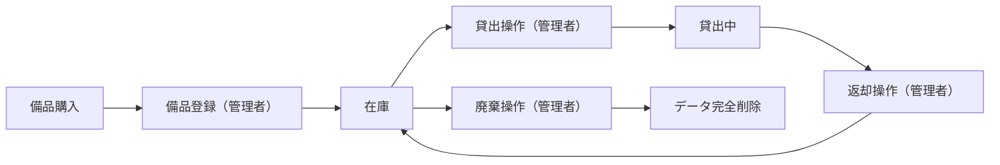
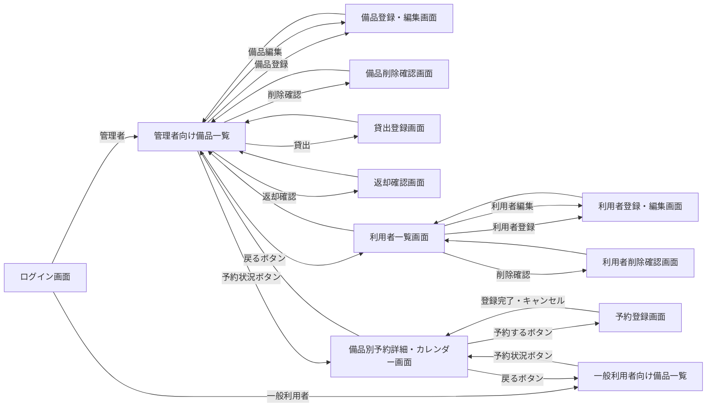
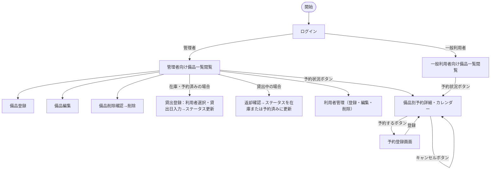

# 備品管理・貸出管理アプリ 要件定義書

---

## 1. 目的・前提

### システムの目的

PC・タブレット等の備品について、所在・在庫状況をリアルタイムで把握し、貸出・返却操作をシステム上で管理することで、Excel運用による状態把握困難と管理煩雑さを解消する。

### 用語集

| 用語 | 定義 |
|---|---|
| 備品 | 管理対象となる会社所有の機器（PC・タブレット等） |
| 在庫 | 貸出されておらず利用可能な状態（システム内値: available） |
| 予約済み | 少なくとも1件の有効な予約が存在し、かつ現在貸出中でない備品のステータス（システム内値: reserved） |
| 貸出中 | 特定の利用者に貸し出されている状態（システム内値: loaned） |
| 廃棄 | 使用不可となり、データを完全削除した状態 |
| 管理者 | 備品の登録・編集・貸出・返却・削除、および利用者管理が可能なロール（システム内値: admin） |
| 一般利用者 | 備品一覧の閲覧・予約操作が可能なロール（システム内値: general） |
| 利用者 | システムにアカウントを持つユーザーの総称（管理者・一般利用者） |
| 貸出先利用者 | 備品を現在借りている利用者 |
| 貸出日 | 備品を貸し出した日（YYYY-MM-DD 形式） |
| 部署 | 外部DBで管理される組織単位（例: 営業部・開発部） |
| 予約 | 利用者が特定の備品を指定した期間（開始日〜終了日）で事前確保すること |
| 予約期間 | 予約の開始日から終了日までの日付範囲（両端含む） |
| 予約の重複 | 同じ備品に対し、既存予約の予約期間と新規予約の予約期間が1日以上重なること |

### インターフェース種別

| RQ-ID | インターフェース種別 |
|---|---|
| RQ-UI-WEB-GUI | GUI（Webブラウザ） |

---

## 2. 業務

### 対象業務一覧

| RQ-BZ-ID | 業務名 | 説明 |
|---|---|---|
| RQ-BZ-EQUIPMENT-MANAGEMENT | 備品管理業務 | PC・タブレット等の備品の登録・貸出・返却・廃棄を行う業務 |

### 業務フロー

### 業務の範囲・担当者

| 担当者 | 業務範囲 |
|---|---|
| 管理者 | 備品登録・編集・貸出操作・返却操作・廃棄（削除）・利用者管理・利用者の部署登録・備品の予約登録・予約キャンセル |
| 一般利用者 | 備品一覧の閲覧・備品の予約登録・自分の予約のキャンセル |

### システム化による見込み効果

- **Soft Saving**: 備品の所在確認にかかる探索時間の削減
- **Soft Saving**: 貸出状況の確認・管理にかかる手作業時間の削減

### 2-1. 業務課題一覧

| RQ-BK-ID | 対応業務（RQ-BZ-*） | 業務課題 | 現状の問題 | 業務影響 | 解決状態 |
|---|---|---|---|---|---|
| RQ-BK-EQUIPMENT-STATUS-UNKNOWN | RQ-BZ-EQUIPMENT-MANAGEMENT | 備品の所在・在庫状況が不明 | Excelスプレッドシートで管理しているが最新状態の把握が困難 | 必要な備品を探す手間が発生し業務効率が低下する | 備品一覧でリアルタイムに全備品の所在・在庫状況が確認できる |
| RQ-BK-LENDING-MANAGEMENT-BURDEN | RQ-BZ-EQUIPMENT-MANAGEMENT | 貸出・返却管理が煩雑で状態ずれが発生 | Excelや口頭で管理しており、返却漏れや状態更新漏れが発生する | 備品の在庫状況が不正確になり、二重貸出のリスクが生じる | 貸出・返却操作をアプリ上で行い、ステータスを即時更新できる |
| RQ-BK-NO-DEPT-VISIBILITY | RQ-BZ-EQUIPMENT-MANAGEMENT | 利用者の所属部署が不明で部署別の備品利用状況が把握できない | 利用者情報に部署情報がなく、貸出先として氏名のみが表示される | 部署ごとの備品使用状況が把握できず、備品管理の粒度が粗い | 外部DBから部署名を取得し、利用者情報・貸出一覧・利用者一覧に所属部署が表示される |
| RQ-BK-NO-RESERVATION | RQ-BZ-EQUIPMENT-MANAGEMENT | 備品の事前予約ができず、計画的な備品確保ができない | 先着順の貸出のみで、将来の日程で備品を確保する手段がない | 需要の高い備品が争奪戦になり、必要な時に備品を確保できない | 利用者が備品を期間（開始日〜終了日）で予約でき、重複なく日程を確保できる |

---

## 3. 機能要件

### 入力データ

- 管理者が画面から手動入力する
- 外部連携（Neon PostgreSQL の部署マスタ）からの部署データ取得が加わる

### 出力データ

- 備品一覧・貸出状況の画面表示（データエクスポートなし）

### 外部連携

| RQ-ID | カテゴリ | 機能名 | 対応業務課題ID（RQ-BK-*） | この機能が無いと何が困るか |
|---|---|---|---|---|
| RQ-EX-FETCH-DEPARTMENT-MASTER | 外部連携 | 部署マスタ・ユーザー照合取得（Neon PostgreSQL） | RQ-BK-NO-DEPT-VISIBILITY | 部署名を画面表示時に取得できず、貸出一覧・利用者一覧で部署情報が欠落する |

**RQ-EX-FETCH-DEPARTMENT-MASTER の詳細:**

| 項目 | 仕様 |
|---|---|
| 接続先 | Neon PostgreSQL（`demo_departments` テーブル、`demo_users` テーブル） |
| 接続方法 | PostgreSQL 直接接続（接続プーラー PgBouncer 経由） |
| 使用ライブラリ | SQLAlchemy 2.0 + psycopg2-binary（NullPool 設定必須） |
| 接続情報管理 | 環境変数 `EXTERNAL_DB_URL` に接続文字列を格納する。コードへの直書き禁止 |
| 取得オペレーション | ログインIDによる部署名取得: `demo_users.user_id = 内部利用者のlogin_id` で照合し、JOIN で `demo_departments.department_name` を取得する |
| アクセス種別 | SELECT のみ（INSERT/UPDATE/DELETE 禁止） |
| 照合失敗時 | `demo_users.user_id` に一致するレコードがない場合は「不明」を返す。内部DBは変更しない |
| 接続失敗時 | 部署名表示欄には「不明」を表示し、他の操作は継続可能とする |
| Neon オートサスペンド | 無操作5分後にDBが停止し、初回接続時に最大数秒の応答遅延が発生する可能性がある。`RQ-NF-EXTERNAL-DB-TIMEOUT` で対応を規定する |

### 機能一覧

| RQ-ID | カテゴリ | 機能名 | 対応業務課題ID（RQ-BK-*） | この機能が無いと何が困るか |
|---|---|---|---|---|
| RQ-FT-LOGIN | 共通 | ログイン | RQ-BK-EQUIPMENT-STATUS-UNKNOWN, RQ-BK-LENDING-MANAGEMENT-BURDEN | 権限のない人が備品を操作できてしまう |
| RQ-FT-LOGOUT | 共通 | ログアウト | RQ-BK-EQUIPMENT-STATUS-UNKNOWN, RQ-BK-LENDING-MANAGEMENT-BURDEN | ログアウト手段がなく、端末を離れた際に他者が操作できる |
| RQ-FT-VIEW-EQUIPMENT-LIST | 業務機能 | 備品一覧表示 | RQ-BK-EQUIPMENT-STATUS-UNKNOWN | 備品の全体状況を把握できず、在庫確認が不可能になる |
| RQ-FT-MANAGE-EQUIPMENT | 業務機能 | 備品管理（登録・編集・削除） | RQ-BK-EQUIPMENT-STATUS-UNKNOWN | 新規備品の登録・情報修正・廃棄処理ができなくなる |
| RQ-FT-LOAN-EQUIPMENT | 業務機能 | 貸出操作 | RQ-BK-LENDING-MANAGEMENT-BURDEN | 貸出状況がシステムに反映されず在庫状態と実態が乖離する |
| RQ-FT-RETURN-EQUIPMENT | 業務機能 | 返却操作 | RQ-BK-LENDING-MANAGEMENT-BURDEN | 返却されても貸出中のままになり在庫が不正確になる |
| RQ-FT-MANAGE-BORROWER | マスタ管理 | 利用者管理（登録・編集・削除・パスワードリセット） | RQ-BK-EQUIPMENT-STATUS-UNKNOWN, RQ-BK-LENDING-MANAGEMENT-BURDEN | 利用者アカウントの追加・削除・パスワードリセットができずアクセス管理が不可能になる |
| RQ-FT-FETCH-DEPT-BY-LOGIN-ID | 業務機能 | ログインIDによる部署名動的取得 | RQ-BK-NO-DEPT-VISIBILITY | 部署名を表示できず、誰のどの部署の備品かが不明になる |
| RQ-FT-DEPT-NAME-API | 業務機能 | 部署名取得APIエンドポイント | RQ-BK-NO-DEPT-VISIBILITY | フロントエンドが非同期で部署名を取得するためのバックエンドAPIがなくなる |
| RQ-FT-DISPLAY-DEPT-IN-LOAN | 業務機能 | 貸出画面・一覧への部署表示 | RQ-BK-NO-DEPT-VISIBILITY | 貸出先の所属部署が分からず、どの部署が何を使っているか不明になる |
| RQ-FT-MAKE-RESERVATION | 業務機能 | 備品の期間予約 | RQ-BK-NO-RESERVATION | 利用者が希望期間に備品を確保する手段がなく、貸出争奪が継続する |
| RQ-FT-CANCEL-RESERVATION | 業務機能 | 予約キャンセル | RQ-BK-NO-RESERVATION | 予約を取り消す手段がなく、不要な予約が残り他の利用者が予約できなくなる |
| RQ-FT-VIEW-RESERVATION-CALENDAR | 業務機能 | 備品別予約カレンダー表示 | RQ-BK-NO-RESERVATION | 予約済み期間を視覚的に確認できず、重複した予約申請が増加する |

**RQ-FT-FETCH-DEPT-BY-LOGIN-ID の詳細:**

| 項目 | 仕様 |
|---|---|
| 取得タイミング | 画面の初期表示後に JavaScript（Fetch API）で非同期取得する。画面本体のレンダリングは外部DBの応答を待たない |
| 取得前の表示 | 部署名表示箇所に「取得中...」をプレースホルダーとして表示する |
| 照合方法 | フロントエンドが `RQ-FT-DEPT-NAME-API` エンドポイントを呼び出し、バックエンドが `demo_users.user_id = 内部利用者のlogin_id` でマッチングし JOIN で `demo_departments.department_name` を取得する |
| 照合成功時 | 取得した `department_name`（例: 営業部）で「取得中...」を置き換える |
| 照合失敗時 | 「不明」で「取得中...」を置き換える。内部DBへの書き込みは行わない |
| 外部DB接続失敗時 | 「不明」で「取得中...」を置き換える。他の表示・操作は継続可能とする |

**RQ-FT-DEPT-NAME-API の詳細:**

| 項目 | 仕様 |
|---|---|
| エンドポイント | `GET /api/department/by-login-id` |
| リクエストパラメータ | `login_id`（クエリパラメータ、必須） |
| レスポンス（成功） | `{ "department_name": "営業部" }`（HTTP 200） |
| レスポンス（照合失敗） | `{ "department_name": "不明" }`（HTTP 200） |
| 認証 | ログイン済みユーザーのみ呼び出し可。未認証は HTTP 401 を返す |
| 外部DB接続失敗時 | `{ "department_name": "不明" }`（HTTP 200）を返す。エラーはサーバーログに記録する |

### 全画面仕様

#### ログイン画面（RQ-UI-LOGIN-SCREEN）

| 項目 | 仕様 |
|---|---|
| 対象ロール | 全利用者 |
| 表示内容 | ログインID入力欄、パスワード入力欄、ログインボタン |
| 操作 | ログインIDとパスワードを入力してログイン |
| 認証成功時 | 管理者は管理者向け備品一覧画面へ、一般利用者は一般利用者向け備品一覧画面へ遷移 |
| 認証失敗時 | エラーメッセージを表示し再入力を促す |
| 対応業務課題 | RQ-BK-EQUIPMENT-STATUS-UNKNOWN, RQ-BK-LENDING-MANAGEMENT-BURDEN |

#### 管理者向け備品一覧画面（RQ-UI-ADMIN-EQUIPMENT-LIST-SCREEN）

| 項目 | 仕様 |
|---|---|
| 対象ロール | 管理者のみ |
| 表示内容 | 備品ID、備品名、ステータス（在庫・予約済み・貸出中）、貸出先利用者名（部署名）・貸出日（貸出中の場合） |
| 表示対象 | 廃棄済み（削除済み）の備品は表示しない。全件表示（ページネーションなし） |
| 操作 | 各備品行に「貸出」ボタン（在庫・予約済み時）または「返却」ボタン（貸出中時）・「削除」ボタン・「予約状況」ボタン。「備品登録」ボタン・「利用者管理」ボタン・「ログアウト」ボタン |
| ステータス表示優先順位 | 貸出中 ＞ 予約済み ＞ 在庫 |
| 対応業務課題 | RQ-BK-EQUIPMENT-STATUS-UNKNOWN, RQ-BK-NO-DEPT-VISIBILITY, RQ-BK-NO-RESERVATION |

#### 一般利用者向け備品一覧画面（RQ-UI-GENERAL-EQUIPMENT-LIST-SCREEN）

| 項目 | 仕様 |
|---|---|
| 対象ロール | 一般利用者のみ |
| 表示内容 | 備品ID、備品名、ステータス（在庫・予約済み・貸出中） |
| 表示対象 | 廃棄済みの備品は表示しない。全件表示（ページネーションなし） |
| 操作 | 閲覧のみ（貸出・返却・登録・削除ボタンなし）。各備品行に「予約状況」ボタン。「ログアウト」ボタン |
| ステータス表示優先順位 | 貸出中 ＞ 予約済み ＞ 在庫 |
| 対応業務課題 | RQ-BK-EQUIPMENT-STATUS-UNKNOWN, RQ-BK-NO-RESERVATION |

#### 備品登録・編集画面（RQ-UI-EQUIPMENT-FORM-SCREEN）

| 項目 | 仕様 |
|---|---|
| 対象ロール | 管理者のみ |
| 入力項目（登録時） | 備品ID（必須）、備品名（必須） |
| 入力項目（編集時） | 備品名のみ（備品IDは変更不可） |
| 初期ステータス（登録時） | 在庫（固定） |
| 対応業務課題 | RQ-BK-EQUIPMENT-STATUS-UNKNOWN |

#### 備品削除確認画面（RQ-UI-EQUIPMENT-DELETE-CONFIRM-SCREEN）

| 項目 | 仕様 |
|---|---|
| 対象ロール | 管理者のみ |
| 表示内容 | 削除対象の備品ID、備品名、ステータス |
| 操作 | 「削除する」ボタン（確定）、「キャンセル」ボタン |
| 制約 | 貸出中の備品は削除不可（エラーメッセージを表示） |
| 削除後 | 管理者向け備品一覧画面へ遷移 |
| 対応業務課題 | RQ-BK-EQUIPMENT-STATUS-UNKNOWN |

#### 貸出登録画面（RQ-UI-LOAN-FORM-SCREEN）

| 項目 | 仕様 |
|---|---|
| 対象ロール | 管理者のみ |
| 表示内容 | 貸出対象の備品ID、備品名 |
| 入力項目 | 貸出先利用者（ドロップダウンで選択。選択肢は「利用者名（部署名）」形式で表示。部署は非同期取得し取得前は「取得中...」を表示）、貸出日（日付入力） |
| 操作 | 「登録する」ボタン（確定）、「キャンセル」ボタン |
| 登録後 | 管理者向け備品一覧画面へ遷移し、備品ステータスが「貸出中」に更新される |
| 対応業務課題 | RQ-BK-LENDING-MANAGEMENT-BURDEN, RQ-BK-NO-DEPT-VISIBILITY |

#### 返却確認画面（RQ-UI-RETURN-CONFIRM-SCREEN）

| 項目 | 仕様 |
|---|---|
| 対象ロール | 管理者のみ |
| 表示内容 | 返却対象の備品ID、備品名、貸出先利用者名、貸出日 |
| 操作 | 「返却する」ボタン（確定）、「キャンセル」ボタン |
| 返却後 | 管理者向け備品一覧画面へ遷移し、備品ステータスが「在庫」または「予約済み」に更新される（end_date が返却日より前の予約を自動削除し、残予約数に応じて決定） |
| 対応業務課題 | RQ-BK-LENDING-MANAGEMENT-BURDEN |

#### 利用者一覧画面（RQ-UI-BORROWER-LIST-SCREEN）

| 項目 | 仕様 |
|---|---|
| 対象ロール | 管理者のみ |
| 表示内容 | 利用者名、ログインID、部署名（外部DBから非同期取得。取得前は「取得中...」、照合失敗・接続失敗は「不明」）、ロール（管理者・一般利用者）の一覧 |
| 操作 | 「利用者登録」ボタン、各利用者行に「編集」ボタン・「削除」ボタン。「備品一覧へ戻る」ボタン・「ログアウト」ボタン |
| 対応業務課題 | RQ-BK-EQUIPMENT-STATUS-UNKNOWN, RQ-BK-LENDING-MANAGEMENT-BURDEN, RQ-BK-NO-DEPT-VISIBILITY |

#### 利用者登録・編集画面（RQ-UI-BORROWER-FORM-SCREEN）

| 項目 | 仕様 |
|---|---|
| 対象ロール | 管理者のみ |
| 入力項目（登録時） | 利用者名（必須）、ログインID（必須）、パスワード（必須）、ロール（管理者/一般利用者） |
| 入力項目（編集時） | 利用者名、パスワード（省略可）、ロール（ログインIDは変更不可） |
| 対応業務課題 | RQ-BK-EQUIPMENT-STATUS-UNKNOWN, RQ-BK-LENDING-MANAGEMENT-BURDEN |

#### 利用者削除確認画面（RQ-UI-BORROWER-DELETE-CONFIRM-SCREEN）

| 項目 | 仕様 |
|---|---|
| 対象ロール | 管理者のみ |
| 表示内容 | 削除対象の利用者名、ログインID、ロール |
| 操作 | 「削除する」ボタン（確定）、「キャンセル」ボタン |
| 制約 | 自分自身・最後の管理者・現在貸出中の貸出先利用者は削除不可（エラーメッセージを表示） |
| 削除後 | 利用者一覧画面へ遷移 |
| 対応業務課題 | RQ-BK-EQUIPMENT-STATUS-UNKNOWN, RQ-BK-LENDING-MANAGEMENT-BURDEN |

#### 備品別予約詳細・カレンダー画面（RQ-UI-RESERVATION-CALENDAR-SCREEN）

| 項目 | 仕様 |
|---|---|
| 対象ロール | 全利用者 |
| 表示内容 | 対象備品の備品ID・備品名・現在のステータス、予約一覧（予約者名・部署名・開始日・終了日の一覧）、予約期間カレンダー（月次カレンダー形式で予約期間をハイライト表示） |
| 操作（全利用者） | 「予約する」ボタン（備品のステータスに関わらず常に表示）→ RQ-UI-RESERVATION-FORM-SCREEN へ遷移 |
| 操作（予約者本人・管理者） | 自分の予約行に「キャンセル」ボタンを表示する。管理者は全予約の「キャンセル」ボタンを表示する |
| キャンセル後 | 当該画面を再表示し、キャンセルされた予約が一覧から消えていること |
| 「戻る」ボタン | 遷移元の備品一覧画面に戻る |
| 対応業務課題 | RQ-BK-NO-RESERVATION |

#### 予約登録画面（RQ-UI-RESERVATION-FORM-SCREEN）

| 項目 | 仕様 |
|---|---|
| 対象ロール | 全利用者 |
| 表示内容 | 対象備品の備品ID・備品名 |
| 入力項目（一般利用者） | 開始日（日付入力、必須）、終了日（日付入力、必須、開始日以降） |
| 入力項目（管理者） | 開始日（必須）、終了日（必須）、予約者（ドロップダウンで利用者を選択） |
| 重複チェック | 登録ボタン押下時に、同じ備品の既存予約期間と重複しないかを確認する。重複している場合はエラーメッセージを表示し登録を拒否する（「指定期間は既に予約されています」） |
| 登録後 | RQ-UI-RESERVATION-CALENDAR-SCREEN に遷移し、登録した予約が一覧に表示されること |
| 「キャンセル」ボタン | RQ-UI-RESERVATION-CALENDAR-SCREEN に戻る（登録は行わない） |
| 対応業務課題 | RQ-BK-NO-RESERVATION |

### 画面一覧

| RQ-ID | カテゴリ | 画面名 | 対応業務課題ID（RQ-BK-*） | この画面が無いと何が困るか |
|---|---|---|---|---|
| RQ-UI-LOGIN-SCREEN | 画面 | ログイン画面 | RQ-BK-EQUIPMENT-STATUS-UNKNOWN, RQ-BK-LENDING-MANAGEMENT-BURDEN | ログイン導線がなく認証・ロール制御が機能しない |
| RQ-UI-ADMIN-EQUIPMENT-LIST-SCREEN | 画面 | 管理者向け備品一覧画面 | RQ-BK-EQUIPMENT-STATUS-UNKNOWN, RQ-BK-NO-DEPT-VISIBILITY, RQ-BK-NO-RESERVATION | 管理者が備品一覧・操作の起点を持てなくなる |
| RQ-UI-GENERAL-EQUIPMENT-LIST-SCREEN | 画面 | 一般利用者向け備品一覧画面 | RQ-BK-EQUIPMENT-STATUS-UNKNOWN, RQ-BK-NO-RESERVATION | 一般利用者が備品の在庫状況を確認できなくなる |
| RQ-UI-EQUIPMENT-FORM-SCREEN | 画面 | 備品登録・編集画面（共用） | RQ-BK-EQUIPMENT-STATUS-UNKNOWN | 備品の新規登録・情報修正ができなくなる |
| RQ-UI-EQUIPMENT-DELETE-CONFIRM-SCREEN | 画面 | 備品削除確認画面 | RQ-BK-EQUIPMENT-STATUS-UNKNOWN | 誤操作防止の確認ステップがなくなる |
| RQ-UI-LOAN-FORM-SCREEN | 画面 | 貸出登録画面 | RQ-BK-LENDING-MANAGEMENT-BURDEN, RQ-BK-NO-DEPT-VISIBILITY | 貸出操作（貸出先・貸出日の入力）を行う画面がなくなる |
| RQ-UI-RETURN-CONFIRM-SCREEN | 画面 | 返却確認画面 | RQ-BK-LENDING-MANAGEMENT-BURDEN | 返却操作の確認ステップがなくなる |
| RQ-UI-BORROWER-LIST-SCREEN | 画面 | 利用者一覧画面 | RQ-BK-EQUIPMENT-STATUS-UNKNOWN, RQ-BK-LENDING-MANAGEMENT-BURDEN, RQ-BK-NO-DEPT-VISIBILITY | 利用者一覧・操作の起点がなくなる |
| RQ-UI-BORROWER-FORM-SCREEN | 画面 | 利用者登録・編集画面（共用） | RQ-BK-EQUIPMENT-STATUS-UNKNOWN, RQ-BK-LENDING-MANAGEMENT-BURDEN | 利用者の追加・編集・パスワードリセットができなくなる |
| RQ-UI-BORROWER-DELETE-CONFIRM-SCREEN | 画面 | 利用者削除確認画面 | RQ-BK-EQUIPMENT-STATUS-UNKNOWN, RQ-BK-LENDING-MANAGEMENT-BURDEN | 利用者削除の確認ステップがなくなる |
| RQ-UI-RESERVATION-CALENDAR-SCREEN | 画面 | 備品別予約詳細・カレンダー画面 | RQ-BK-NO-RESERVATION | 備品の予約状況を確認・予約・キャンセルする導線がなくなる |
| RQ-UI-RESERVATION-FORM-SCREEN | 画面 | 予約登録画面 | RQ-BK-NO-RESERVATION | 予約の開始日・終了日を入力する画面がなくなる |

### 画面遷移図

### ユーザー利用フロー

### ログ

ログは必要ないため、ログの内容と保存期間の記述は行わない。

### 監視・アラート

監視・アラートは必要ないため、監視・アラートの内容と対応方法の記述は行わない。

---

## 4. データ

### 内部データ / 外部データの区別

| RQ-ID | 区分 | データ名 | 説明 | 対応業務課題ID（RQ-BK-*） |
|---|---|---|---|---|
| RQ-DT-EQUIPMENT-INTERNAL | 内部データ | 備品データ | アプリ内DBで管理する備品情報 | RQ-BK-EQUIPMENT-STATUS-UNKNOWN, RQ-BK-LENDING-MANAGEMENT-BURDEN |
| RQ-DT-BORROWER-INTERNAL | 内部データ | 利用者データ | アプリ内DBで管理する利用者情報 | RQ-BK-EQUIPMENT-STATUS-UNKNOWN, RQ-BK-LENDING-MANAGEMENT-BURDEN |
| RQ-DT-LOAN-STATE-INTERNAL | 内部データ | 貸出状態データ | アプリ内DBで管理する現在の貸出状態情報 | RQ-BK-LENDING-MANAGEMENT-BURDEN |
| RQ-DT-DEPARTMENT-EXTERNAL | 外部データ | 部署データ | 外部DB（`demo_departments`・`demo_users`）から読み取り専用で取得する部署情報。アプリ内DBには保存しない。login_id で demo_users を照合し、部署名を動的に取得する | RQ-BK-NO-DEPT-VISIBILITY |
| RQ-DT-RESERVATION-INTERNAL | 内部データ | 予約データ | アプリ内DBで管理する備品予約情報 | RQ-BK-NO-RESERVATION |

### データ保持期間

| RQ-ID | データ名 | 保持期間 | 理由 | 対応業務課題ID（RQ-BK-*） |
|---|---|---|---|---|
| RQ-DT-EQUIPMENT-RETENTION | 備品データ | 廃棄操作（削除）まで無期限 | 廃棄操作時にデータを完全削除するため保持期間なし | RQ-BK-EQUIPMENT-STATUS-UNKNOWN |
| RQ-DT-BORROWER-RETENTION | 利用者データ | 利用者削除操作まで無期限 | 管理者が利用者を削除するまで保持 | RQ-BK-EQUIPMENT-STATUS-UNKNOWN |
| RQ-DT-LOAN-STATE-RETENTION | 貸出状態データ | 返却操作時に削除 | 返却操作と同時に貸出状態レコードを削除するため保持期間なし | RQ-BK-LENDING-MANAGEMENT-BURDEN |
| RQ-DT-RESERVATION-RETENTION | 予約データ | 利用者によるキャンセル操作、または備品の返却操作（end_date が返却日より前の予約を自動削除）まで保持する | 固定の時間的保持期間は設けない。キャンセル操作（手動）または返却操作（end_date < 返却日の予約を自動削除）でレコードを削除する | RQ-BK-NO-RESERVATION |

### 外部DB接続先

| RQ-ID | 接続先 | 接続方法 | 環境変数 | 対応業務課題ID（RQ-BK-*） |
|---|---|---|---|---|
| RQ-DT-EXTERNAL-DB-NEON | Neon PostgreSQL（`demo_departments`・`demo_users`） | PostgreSQL 直接接続（SSL必須、接続プーラー経由、SQLAlchemy 2.0 + psycopg2-binary、NullPool） | `EXTERNAL_DB_URL` | RQ-BK-NO-DEPT-VISIBILITY |

### DBの必要性

| RQ-ID | 判断 | 理由 | 対応業務課題ID（RQ-BK-*） |
|---|---|---|---|
| RQ-DT-APP-DATABASE-REQUIRED | 必要 | 備品情報・利用者情報を永続化し、複数利用者がリアルタイムで参照・更新する必要があるため | RQ-BK-EQUIPMENT-STATUS-UNKNOWN, RQ-BK-LENDING-MANAGEMENT-BURDEN |

### 業務エンティティ一覧

| RQ-ID | カテゴリ | 業務エンティティ名 | 対応業務課題ID（RQ-BK-*） | この業務エンティティが無いと何が困るか |
|---|---|---|---|---|
| RQ-DT-EQUIPMENT-ENTITY | 業務エンティティ | 備品 | RQ-BK-EQUIPMENT-STATUS-UNKNOWN, RQ-BK-LENDING-MANAGEMENT-BURDEN | 管理対象の備品情報を記録できず、所在・在庫状況の把握が不可能になる |
| RQ-DT-BORROWER-ENTITY | 業務エンティティ | 利用者 | RQ-BK-EQUIPMENT-STATUS-UNKNOWN, RQ-BK-LENDING-MANAGEMENT-BURDEN | 認証・ロール管理ができず、誰でも管理者操作が可能になる |
| RQ-DT-LOAN-STATE-ENTITY | 業務エンティティ | 貸出状態 | RQ-BK-LENDING-MANAGEMENT-BURDEN | 備品の貸出先・貸出日が記録できず、二重貸出を防止できなくなる |
| RQ-DT-RESERVATION-ENTITY | 業務エンティティ | 予約 | RQ-BK-NO-RESERVATION | 備品の予約情報を記録できず、期間重複チェックと確保管理が不可能になる |

#### 備品エンティティの属性

| 属性名 | 型 | 制約 | 説明 |
|---|---|---|---|
| 備品ID | 文字列 | 主キー、管理者が入力（一意） | 備品を一意に識別するID（例: PC-001） |
| 備品名 | 文字列 | 必須 | 備品の名称（例: MacBook Pro 14インチ） |
| ステータス | 列挙型 | 必須 | 在庫（available）・予約済み（reserved）・貸出中（loaned） の3値。廃棄時はレコード削除。優先順位: 貸出中 ＞ 予約済み ＞ 在庫 |

**RQ-DT-EQUIPMENT-RESERVED-STATUS — 備品エンティティのステータス詳細:**

| RQ-ID | 内容 | 対応業務課題ID（RQ-BK-*） |
|---|---|---|
| RQ-DT-EQUIPMENT-RESERVED-STATUS | 備品エンティティのステータスに「予約済み（reserved）」を追加し、在庫（available）・予約済み（reserved）・貸出中（loaned）の3値とする。ステータスの優先順位: 貸出中 ＞ 予約済み ＞ 在庫。予約済みは「有効な予約が1件以上存在し、かつ現在貸出中でない状態」と定義する | RQ-BK-NO-RESERVATION |

#### 利用者エンティティの属性

| 属性名 | 型 | 制約 | 説明 |
|---|---|---|---|
| ログインID | 文字列 | 主キー、一意 | ログイン時に使用するID |
| 利用者名 | 文字列 | 必須 | 利用者の氏名（貸出先として画面に表示する） |
| パスワードハッシュ | 文字列 | 必須 | bcryptでハッシュ化して保存したパスワード |
| ロール | 列挙型 | 必須 | 管理者（admin）・一般利用者（general） の2値 |

#### 貸出状態エンティティの属性

| 属性名 | 型 | 制約 | 説明 |
|---|---|---|---|
| 備品ID | 文字列 | 主キー、FK→備品 | 貸出中の備品ID（1備品に1レコードのみ） |
| 利用者ログインID | 文字列 | 必須、FK→利用者 | 貸出先利用者のログインID |
| 貸出日 | 文字列 | 必須 | 貸出日（YYYY-MM-DD 形式） |

#### 予約エンティティの属性

| 属性名 | 型 | 制約 | 説明 |
|---|---|---|---|
| 予約ID | UUID | 主キー、自動生成 | 予約を一意に識別するID |
| 備品ID | 文字列 | 必須、FK→備品 | 予約対象の備品ID |
| 利用者ログインID | 文字列 | 必須、FK→利用者 | 予約した利用者のログインID |
| 開始日 | 日付 | 必須 | 予約期間の開始日（YYYY-MM-DD形式） |
| 終了日 | 日付 | 必須、開始日以降 | 予約期間の終了日（YYYY-MM-DD形式） |

### 初期データ

| RQ-ID | 内容 |
|---|---|
| RQ-OP-INITIAL-ADMIN-ENV | 最初の管理者アカウントは環境変数（INITIAL_ADMIN_LOGIN_ID・INITIAL_ADMIN_PASSWORD）を設定した状態でアプリを起動すると、利用者テーブルが空の場合のみ自動作成される。アプリ画面からの初期管理者作成機能は持たない。 |

---

## 4-1. CRUDテーブル

| エンティティ名 | Create | Read（一覧） | Read（詳細） | Update | Delete | 備考 |
|---|---|---|---|---|---|---|
| 備品 | ○ | ○ | × | ○ | ○ | Createは管理者のみ。Read（一覧）は全利用者。Update/Deleteは管理者のみ。廃棄＝完全削除 |
| 利用者 | ○ | ○ | × | △ | ○ | 全操作が管理者のみ。Updateは利用者名・パスワード・ロール変更。部署は外部DBから動的取得 |
| 貸出状態 | ○ | × | × | × | ○ | 管理者のみ。Create=貸出操作、Delete=返却操作 |
| 予約 | ○ | ○ | × | × | ○ | Createは全利用者（一般利用者は自分自身のみ、管理者は任意の利用者で登録）。Read一覧は全利用者（RQ-UI-RESERVATION-CALENDAR-SCREENで表示）。Updateなし（修正はキャンセル→再登録）。Delete=キャンセル操作（一般利用者は自分の予約のみ、管理者は全て） |

---

## 5. 非機能要件

### 非機能要件一覧

| RQ-ID | カテゴリ | 非機能要件名 | 対応業務課題ID（RQ-BK-*） | この非機能要件が無いと何が困るか |
|---|---|---|---|---|
| RQ-NF-CONCURRENT-USERS | 性能・利用人数 | 同時接続数20人以下を想定 | RQ-BK-EQUIPMENT-STATUS-UNKNOWN, RQ-BK-LENDING-MANAGEMENT-BURDEN | 超過時にシステムが応答不能になり業務停止するリスクがある |
| RQ-NF-RESPONSE-TIME | 性能 | 通常操作（一覧表示・登録・更新）の応答時間3秒以内 | RQ-BK-EQUIPMENT-STATUS-UNKNOWN, RQ-BK-LENDING-MANAGEMENT-BURDEN | 操作のたびに待機が発生し業務効率が悪化する |
| RQ-NF-PASSWORD-HASH-STORAGE | セキュリティ | パスワードをbcryptでハッシュ化して保存する（平文保存禁止） | RQ-BK-EQUIPMENT-STATUS-UNKNOWN, RQ-BK-LENDING-MANAGEMENT-BURDEN | DB漏洩時に利用者のパスワードが直接流出する |
| RQ-NF-ROLE-BASED-AUTHORIZATION | セキュリティ | ロールに応じた画面・操作の制限を必ず適用する | RQ-BK-LENDING-MANAGEMENT-BURDEN | 一般利用者が貸出・返却・削除操作を行いデータが破壊される |
| RQ-NF-SESSION-AUTO-LOGOUT-60MIN | セキュリティ | JWT有効期限60分、期限切れ後は自動的にログイン画面へ遷移する | RQ-BK-EQUIPMENT-STATUS-UNKNOWN, RQ-BK-LENDING-MANAGEMENT-BURDEN | セッションが無期限に有効となり、離席中の不正操作リスクが高まる |
| RQ-NF-EXTERNAL-DB-TIMEOUT | 性能 | 外部DB接続タイムアウトを5秒以内に設定する。タイムアウト発生時は部署名表示欄に「不明」を表示し、他の操作は継続可能とする | RQ-BK-NO-DEPT-VISIBILITY | タイムアウト設定がないと外部DB停止時にアプリ全体が無応答になる |
| RQ-NF-EXTERNAL-DB-READONLY | セキュリティ | 外部DB（Neon PostgreSQL）に対してSELECT以外のSQL（INSERT/UPDATE/DELETE）を実行してはならない | RQ-BK-NO-DEPT-VISIBILITY | 誤った書き込み操作が外部DBを破壊するリスクがある |
| RQ-NF-RESERVATION-CONFLICT-PREVENTION | セキュリティ・整合性 | 同一備品への重複予約（期間が1日以上重なる予約）をDBトランザクションで排他制御し、同時リクエスト時でも重複を許可しない | RQ-BK-NO-RESERVATION | 同時予約リクエストで重複予約が発生し、予約の信頼性が損なわれる |

---

## 6. テスト用利用シナリオ

| RQ-ID | テスト目的 | 前提条件 | テスト手順 | 期待される結果 | 対応業務課題ID（RQ-BK-*） |
|---|---|---|---|---|---|
| RQ-TS-VERIFY-ADMIN-LOGIN | 管理者が正常にログインできること | 管理者アカウントが登録済み | 1. ログイン画面を開く 2. 管理者ログインIDとパスワードを入力 3. ログインボタンを押す | 管理者向け備品一覧画面が表示され、備品登録・利用者管理ボタンが表示される | RQ-BK-EQUIPMENT-STATUS-UNKNOWN, RQ-BK-LENDING-MANAGEMENT-BURDEN |
| RQ-TS-VERIFY-GENERAL-LOGIN | 一般利用者が正常にログインでき、管理者操作ボタンが表示されないこと | 一般利用者アカウントが登録済み | 1. ログイン画面を開く 2. 一般利用者ログインIDとパスワードを入力 3. ログインボタンを押す | 一般利用者向け備品一覧画面が表示され、操作ボタンが表示されない | RQ-BK-EQUIPMENT-STATUS-UNKNOWN |
| RQ-TS-VERIFY-INITIAL-ADMIN-CREATION | 初期管理者が環境変数から自動作成されること | 環境変数 INITIAL_ADMIN_LOGIN_ID・INITIAL_ADMIN_PASSWORD が設定済みで利用者テーブルが空 | 1. アプリを起動する 2. 環境変数のログインIDとパスワードでログインする | 管理者向け備品一覧画面に遷移する | RQ-BK-EQUIPMENT-STATUS-UNKNOWN, RQ-BK-LENDING-MANAGEMENT-BURDEN |
| RQ-TS-VERIFY-EQUIPMENT-MANAGEMENT | 管理者が備品の登録・編集・削除・貸出中削除不可を確認できること | 管理者でログイン済み | 1. 備品登録 2. 備品名編集 3. 貸出可能備品を削除 4. 貸出中備品の削除を試みる | 登録・編集・削除が成功する。貸出中備品の削除はエラーが表示される | RQ-BK-EQUIPMENT-STATUS-UNKNOWN |
| RQ-TS-VERIFY-BORROWER-MANAGEMENT | 管理者が利用者の登録・編集・削除・制限を確認できること | 管理者でログイン済み | 1. 利用者登録 2. 権限変更 3. 削除可能利用者を削除 4. 自分自身・最後の管理者・貸出中貸出先の削除を試みる | 登録・編集・削除が成功する。制限対象の操作はエラーが表示される | RQ-BK-EQUIPMENT-STATUS-UNKNOWN, RQ-BK-LENDING-MANAGEMENT-BURDEN |
| RQ-TS-VERIFY-LOAN-EQUIPMENT | 管理者が在庫備品を貸出操作できること | 管理者でログイン済み、在庫状態の備品と利用者が存在する | 1. 管理者向け備品一覧から在庫備品の「貸出」ボタンを押す 2. 貸出登録画面で利用者と貸出日を入力して登録する | 備品のステータスが「貸出中」に更新され、一覧に貸出先利用者名と貸出日が表示される | RQ-BK-LENDING-MANAGEMENT-BURDEN |
| RQ-TS-VERIFY-RETURN-EQUIPMENT | 管理者が貸出中備品を返却操作できること | 管理者でログイン済み、貸出中状態の備品が存在する | 1. 管理者向け備品一覧から貸出中備品の「返却」ボタンを押す 2. 返却確認画面で内容を確認して返却を実行する | 備品のステータスが「在庫」に更新され、貸出先と貸出日が表示されなくなる | RQ-BK-LENDING-MANAGEMENT-BURDEN |
| RQ-TS-VERIFY-GENERAL-EQUIPMENT-VIEW | 一般利用者が備品一覧を閲覧専用で参照できること | 一般利用者でログイン済み、備品が存在する | 1. 一般利用者向け備品一覧画面を開く | 全備品の状態が表示され、登録・貸出・返却・削除ボタンが表示されない | RQ-BK-EQUIPMENT-STATUS-UNKNOWN |
| RQ-TS-VERIFY-LOGOUT | ログアウト後に再ログインなしで管理者画面にアクセスできないこと | 任意の利用者でログイン済み | 1. ログアウトボタンを押す 2. ブラウザで管理者向け画面URLへ直接アクセスする | ログイン画面に遷移し、管理者画面へのアクセスが拒否される | RQ-BK-EQUIPMENT-STATUS-UNKNOWN, RQ-BK-LENDING-MANAGEMENT-BURDEN |
| RQ-TS-VERIFY-AUTO-LOGOUT | 60分後にセッションが自動切断されること | 任意の利用者でログイン済み | 1. ログイン後、60分経過後に操作する | セッションが切れ、ログイン画面に遷移する | RQ-BK-EQUIPMENT-STATUS-UNKNOWN, RQ-BK-LENDING-MANAGEMENT-BURDEN |
| RQ-TS-VERIFY-DEPT-DISPLAY-FROM-EXTERNAL | 画面が即時表示され、非同期で外部DBから部署名が取得・更新されること | 管理者でログイン済み、外部DB接続可能、login_id が demo_users.user_id に存在する利用者が登録済み | 1. 利用者一覧画面を開く 2. 画面の初期表示を確認する（部署名欄に「取得中...」が表示されること） 3. 非同期取得完了後を確認する | 2. 画面本体（備品名・利用者名等）が部署名取得を待たず即時表示される 3. 「取得中...」が demo_departments から取得した部署名に置き換わる | RQ-BK-NO-DEPT-VISIBILITY |
| RQ-TS-VERIFY-DEPT-DISPLAY-IN-LOAN | 貸出登録時に貸出先利用者の部署名が表示されること | 管理者でログイン済み、部署ありの利用者が存在する | 1. 在庫備品の「貸出」ボタンを押す 2. 貸出登録画面の貸出先ドロップダウンを確認する | ドロップダウンに「利用者名（部署名）」の形式で選択肢が表示される | RQ-BK-NO-DEPT-VISIBILITY |
| RQ-TS-VERIFY-DEPT-DISPLAY-IN-EQUIPMENT-LIST | 備品一覧の貸出先情報に部署名が表示されること | 管理者でログイン済み、貸出中の備品が存在し、その貸出先利用者に部署が設定されている | 1. 管理者向け備品一覧を開く | 貸出中の備品行に「貸出先利用者名（部署名）」が表示される | RQ-BK-NO-DEPT-VISIBILITY |
| RQ-TS-VERIFY-RESERVATION-CREATE | 一般利用者が備品を期間指定で予約できること | 一般利用者でログイン済み、在庫状態の備品が存在する | 1. 備品一覧から対象備品の「予約状況」ボタンを押す 2. カレンダー画面で「予約する」を押す 3. 予約登録画面で開始日・終了日を入力して登録する | カレンダー画面に戻り、登録した予約期間がカレンダーにハイライト表示される。備品一覧のステータスが「予約済み」に変わる | RQ-BK-NO-RESERVATION |
| RQ-TS-VERIFY-RESERVATION-CONFLICT | 重複する期間の予約が拒否されること | 一般利用者でログイン済み、ある備品に「2026-06-01〜2026-06-05」の予約が存在する | 1. 同じ備品に「2026-06-03〜2026-06-07」の期間で予約を試みる | 「指定期間は既に予約されています」エラーが表示され、予約が登録されない | RQ-BK-NO-RESERVATION |
| RQ-TS-VERIFY-RESERVATION-NON-OVERLAP | 重複しない期間の複数予約が許可されること | 一般利用者でログイン済み、ある備品に「2026-06-01〜2026-06-05」の予約が存在する | 1. 同じ備品に「2026-06-10〜2026-06-15」の期間で予約を試みる | 予約が正常に登録され、カレンダーに両方の予約期間が表示される | RQ-BK-NO-RESERVATION |
| RQ-TS-VERIFY-RESERVATION-CANCEL | 予約者本人が自分の予約をキャンセルできること | 一般利用者でログイン済み、当該利用者の予約が存在する | 1. 該当備品の「予約状況」ボタンを押す 2. カレンダー画面で自分の予約行の「キャンセル」ボタンを押す | カレンダー画面から該当予約が消え、他に予約がない場合は備品ステータスが「在庫」に変わる | RQ-BK-NO-RESERVATION |
| RQ-TS-VERIFY-ADMIN-CANCEL-OTHERS-RESERVATION | 管理者が他の利用者の予約をキャンセルできること | 管理者でログイン済み、他の利用者の予約が存在する | 1. 該当備品の「予約状況」ボタンを押す 2. 他の利用者の予約行にある「キャンセル」ボタンを押す | 該当予約がカレンダーから消える | RQ-BK-NO-RESERVATION |
| RQ-TS-VERIFY-RESERVATION-TO-LOAN | 管理者が予約済み備品に対して貸出操作でき、返却時に期間終了済み予約が自動削除されること | 管理者でログイン済み、予約が存在し、備品が在庫または予約済み状態 | 1. 管理者向け備品一覧から該当備品の「貸出」ボタンを押す 2. 貸出登録画面で予約者を選択して登録する 3. 備品を返却する | 2. 備品ステータスが「貸出中」に変わる 3. end_date が返却日より前の予約が自動削除される。残予約がなければ備品ステータスが「在庫」になる | RQ-BK-NO-RESERVATION |
| RQ-TS-VERIFY-EXTERNAL-DB-FAILURE | 外部DBへの接続失敗時に部署名が「不明」と表示されること | 外部DBが接続不可の状態（環境変数に不正な値を設定） | 1. 利用者一覧画面または備品一覧画面を開く | 部署名表示欄に「不明」が表示される。他の画面表示・操作は継続可能 | RQ-BK-NO-DEPT-VISIBILITY |

---

## 業務課題と要件の対応表

| RQ-BK-ID | 業務課題 | 対応する要件ID |
|---|---|---|
| RQ-BK-EQUIPMENT-STATUS-UNKNOWN | 備品の所在・在庫状況が不明 | RQ-FT-LOGIN, RQ-FT-LOGOUT, RQ-FT-VIEW-EQUIPMENT-LIST, RQ-FT-MANAGE-EQUIPMENT, RQ-FT-MANAGE-BORROWER, RQ-UI-LOGIN-SCREEN, RQ-UI-ADMIN-EQUIPMENT-LIST-SCREEN, RQ-UI-GENERAL-EQUIPMENT-LIST-SCREEN, RQ-UI-EQUIPMENT-FORM-SCREEN, RQ-UI-EQUIPMENT-DELETE-CONFIRM-SCREEN, RQ-UI-BORROWER-LIST-SCREEN, RQ-UI-BORROWER-FORM-SCREEN, RQ-UI-BORROWER-DELETE-CONFIRM-SCREEN, RQ-DT-EQUIPMENT-INTERNAL, RQ-DT-BORROWER-INTERNAL, RQ-DT-EQUIPMENT-RETENTION, RQ-DT-BORROWER-RETENTION, RQ-DT-APP-DATABASE-REQUIRED, RQ-DT-EQUIPMENT-ENTITY, RQ-DT-BORROWER-ENTITY, RQ-NF-CONCURRENT-USERS, RQ-NF-RESPONSE-TIME, RQ-NF-PASSWORD-HASH-STORAGE, RQ-NF-ROLE-BASED-AUTHORIZATION, RQ-NF-SESSION-AUTO-LOGOUT-60MIN, RQ-TS-VERIFY-ADMIN-LOGIN, RQ-TS-VERIFY-GENERAL-LOGIN, RQ-TS-VERIFY-INITIAL-ADMIN-CREATION, RQ-TS-VERIFY-EQUIPMENT-MANAGEMENT, RQ-TS-VERIFY-BORROWER-MANAGEMENT, RQ-TS-VERIFY-GENERAL-EQUIPMENT-VIEW, RQ-TS-VERIFY-LOGOUT, RQ-TS-VERIFY-AUTO-LOGOUT |
| RQ-BK-LENDING-MANAGEMENT-BURDEN | 貸出・返却管理が煩雑で状態ずれが発生 | RQ-FT-LOGIN, RQ-FT-LOGOUT, RQ-FT-LOAN-EQUIPMENT, RQ-FT-RETURN-EQUIPMENT, RQ-FT-MANAGE-BORROWER, RQ-UI-LOGIN-SCREEN, RQ-UI-ADMIN-EQUIPMENT-LIST-SCREEN, RQ-UI-LOAN-FORM-SCREEN, RQ-UI-RETURN-CONFIRM-SCREEN, RQ-UI-BORROWER-LIST-SCREEN, RQ-UI-BORROWER-FORM-SCREEN, RQ-UI-BORROWER-DELETE-CONFIRM-SCREEN, RQ-DT-EQUIPMENT-INTERNAL, RQ-DT-BORROWER-INTERNAL, RQ-DT-LOAN-STATE-INTERNAL, RQ-DT-APP-DATABASE-REQUIRED, RQ-DT-EQUIPMENT-ENTITY, RQ-DT-BORROWER-ENTITY, RQ-DT-LOAN-STATE-ENTITY, RQ-DT-LOAN-STATE-RETENTION, RQ-NF-CONCURRENT-USERS, RQ-NF-RESPONSE-TIME, RQ-NF-PASSWORD-HASH-STORAGE, RQ-NF-ROLE-BASED-AUTHORIZATION, RQ-NF-SESSION-AUTO-LOGOUT-60MIN, RQ-TS-VERIFY-ADMIN-LOGIN, RQ-TS-VERIFY-INITIAL-ADMIN-CREATION, RQ-TS-VERIFY-BORROWER-MANAGEMENT, RQ-TS-VERIFY-LOAN-EQUIPMENT, RQ-TS-VERIFY-RETURN-EQUIPMENT, RQ-TS-VERIFY-LOGOUT, RQ-TS-VERIFY-AUTO-LOGOUT |
| RQ-BK-NO-DEPT-VISIBILITY | 利用者の所属部署が不明で部署別の備品利用状況が把握できない | RQ-EX-FETCH-DEPARTMENT-MASTER, RQ-FT-FETCH-DEPT-BY-LOGIN-ID, RQ-FT-DEPT-NAME-API, RQ-FT-DISPLAY-DEPT-IN-LOAN, RQ-UI-BORROWER-LIST-SCREEN, RQ-UI-LOAN-FORM-SCREEN, RQ-UI-ADMIN-EQUIPMENT-LIST-SCREEN, RQ-DT-DEPARTMENT-EXTERNAL, RQ-DT-EXTERNAL-DB-NEON, RQ-NF-EXTERNAL-DB-TIMEOUT, RQ-NF-EXTERNAL-DB-READONLY, RQ-TS-VERIFY-DEPT-DISPLAY-FROM-EXTERNAL, RQ-TS-VERIFY-DEPT-DISPLAY-IN-LOAN, RQ-TS-VERIFY-DEPT-DISPLAY-IN-EQUIPMENT-LIST, RQ-TS-VERIFY-EXTERNAL-DB-FAILURE |
| RQ-BK-NO-RESERVATION | 備品の事前予約ができず、計画的な備品確保ができない | RQ-FT-MAKE-RESERVATION, RQ-FT-CANCEL-RESERVATION, RQ-FT-VIEW-RESERVATION-CALENDAR, RQ-UI-ADMIN-EQUIPMENT-LIST-SCREEN, RQ-UI-GENERAL-EQUIPMENT-LIST-SCREEN, RQ-UI-RESERVATION-CALENDAR-SCREEN, RQ-UI-RESERVATION-FORM-SCREEN, RQ-DT-RESERVATION-INTERNAL, RQ-DT-RESERVATION-RETENTION, RQ-DT-RESERVATION-ENTITY, RQ-DT-EQUIPMENT-RESERVED-STATUS, RQ-NF-RESERVATION-CONFLICT-PREVENTION, RQ-TS-VERIFY-RESERVATION-CREATE, RQ-TS-VERIFY-RESERVATION-CONFLICT, RQ-TS-VERIFY-RESERVATION-NON-OVERLAP, RQ-TS-VERIFY-RESERVATION-CANCEL, RQ-TS-VERIFY-ADMIN-CANCEL-OTHERS-RESERVATION, RQ-TS-VERIFY-RESERVATION-TO-LOAN |
