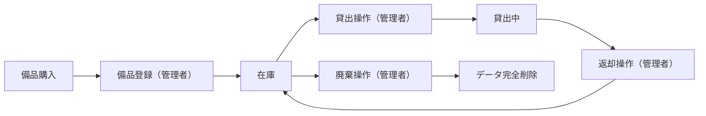
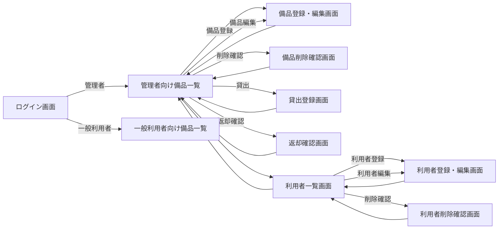
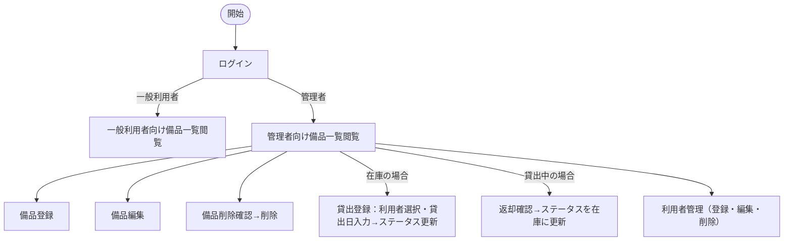

# 備品管理・貸出管理アプリ 要件定義書

---

## 1. 目的・前提

### システムの目的

PC・タブレット等の備品について、所在・在庫状況をリアルタイムで把握し、貸出・返却操作をシステム上で管理することで、Excel運用による状態把握困難と管理煩雑さを解消する。

### 用語集

| 用語 | 定義 |
|---|---|
| 備品 | 管理対象となる会社所有の機器（PC・タブレット等） |
| 在庫 | 貸出されておらず利用可能な状態（システム内値: available） |
| 貸出中 | 特定の利用者に貸し出されている状態（システム内値: loaned） |
| 廃棄 | 使用不可となり、データを完全削除した状態 |
| 管理者 | 備品の登録・編集・貸出・返却・削除、および利用者管理が可能なロール（システム内値: admin） |
| 一般利用者 | 備品一覧の閲覧のみ可能なロール（システム内値: general） |
| 利用者 | システムにアカウントを持つユーザーの総称（管理者・一般利用者） |
| 貸出先利用者 | 備品を現在借りている利用者 |
| 貸出日 | 備品を貸し出した日（YYYY-MM-DD 形式） |

### インターフェース種別

| RQ-ID | インターフェース種別 |
|---|---|
| RQ-UI-WEB-GUI | GUI（Webブラウザ） |

---

## 2. 業務

### 対象業務一覧

| RQ-BZ-ID | 業務名 | 説明 |
|---|---|---|
| RQ-BZ-EQUIPMENT-MANAGEMENT | 備品管理業務 | PC・タブレット等の備品の登録・貸出・返却・廃棄を行う業務 |

### 業務フロー

### 業務の範囲・担当者

| 担当者 | 業務範囲 |
|---|---|
| 管理者 | 備品登録・編集・貸出操作・返却操作・廃棄（削除）・利用者管理 |
| 一般利用者 | 備品一覧の閲覧のみ |

### システム化による見込み効果

- **Soft Saving**: 備品の所在確認にかかる探索時間の削減
- **Soft Saving**: 貸出状況の確認・管理にかかる手作業時間の削減

### 2-1. 業務課題一覧

| RQ-BK-ID | 対応業務（RQ-BZ-*） | 業務課題 | 現状の問題 | 業務影響 | 解決状態 |
|---|---|---|---|---|---|
| RQ-BK-EQUIPMENT-STATUS-UNKNOWN | RQ-BZ-EQUIPMENT-MANAGEMENT | 備品の所在・在庫状況が不明 | Excelスプレッドシートで管理しているが最新状態の把握が困難 | 必要な備品を探す手間が発生し業務効率が低下する | 備品一覧でリアルタイムに全備品の所在・在庫状況が確認できる |
| RQ-BK-LENDING-MANAGEMENT-BURDEN | RQ-BZ-EQUIPMENT-MANAGEMENT | 貸出・返却管理が煩雑で状態ずれが発生 | Excelや口頭で管理しており、返却漏れや状態更新漏れが発生する | 備品の在庫状況が不正確になり、二重貸出のリスクが生じる | 貸出・返却操作をアプリ上で行い、ステータスを即時更新できる |

---

## 3. 機能要件

### 入力データ

- 管理者が画面から手動入力する（外部連携なし）

### 出力データ

- 備品一覧・貸出状況の画面表示（データエクスポートなし）

### 外部連携

| RQ-ID | 判断 | 理由 |
|---|---|---|
| RQ-EX-NO-EXTERNAL-INTEGRATION | 外部連携なし | 全データをアプリ内部で管理し、外部システムとの連携は不要 |

### 機能一覧

| RQ-ID | カテゴリ | 機能名 | 対応業務課題ID（RQ-BK-*） | この機能が無いと何が困るか |
|---|---|---|---|---|
| RQ-FT-LOGIN | 共通 | ログイン | RQ-BK-EQUIPMENT-STATUS-UNKNOWN, RQ-BK-LENDING-MANAGEMENT-BURDEN | 権限のない人が備品を操作できてしまう |
| RQ-FT-LOGOUT | 共通 | ログアウト | RQ-BK-EQUIPMENT-STATUS-UNKNOWN, RQ-BK-LENDING-MANAGEMENT-BURDEN | ログアウト手段がなく、端末を離れた際に他者が操作できる |
| RQ-FT-VIEW-EQUIPMENT-LIST | 業務機能 | 備品一覧表示 | RQ-BK-EQUIPMENT-STATUS-UNKNOWN | 備品の全体状況を把握できず、在庫確認が不可能になる |
| RQ-FT-MANAGE-EQUIPMENT | 業務機能 | 備品管理（登録・編集・削除） | RQ-BK-EQUIPMENT-STATUS-UNKNOWN | 新規備品の登録・情報修正・廃棄処理ができなくなる |
| RQ-FT-LOAN-EQUIPMENT | 業務機能 | 貸出操作 | RQ-BK-LENDING-MANAGEMENT-BURDEN | 貸出状況がシステムに反映されず在庫状態と実態が乖離する |
| RQ-FT-RETURN-EQUIPMENT | 業務機能 | 返却操作 | RQ-BK-LENDING-MANAGEMENT-BURDEN | 返却されても貸出中のままになり在庫が不正確になる |
| RQ-FT-MANAGE-BORROWER | マスタ管理 | 利用者管理（登録・編集・削除・パスワードリセット） | RQ-BK-EQUIPMENT-STATUS-UNKNOWN, RQ-BK-LENDING-MANAGEMENT-BURDEN | 利用者アカウントの追加・削除・パスワードリセットができずアクセス管理が不可能になる |

### 全画面仕様

#### ログイン画面（RQ-UI-LOGIN-SCREEN）

| 項目 | 仕様 |
|---|---|
| 対象ロール | 全利用者 |
| 表示内容 | ログインID入力欄、パスワード入力欄、ログインボタン |
| 操作 | ログインIDとパスワードを入力してログイン |
| 認証成功時 | 管理者は管理者向け備品一覧画面へ、一般利用者は一般利用者向け備品一覧画面へ遷移 |
| 認証失敗時 | エラーメッセージを表示し再入力を促す |
| 対応業務課題 | RQ-BK-EQUIPMENT-STATUS-UNKNOWN, RQ-BK-LENDING-MANAGEMENT-BURDEN |

#### 管理者向け備品一覧画面（RQ-UI-ADMIN-EQUIPMENT-LIST-SCREEN）

| 項目 | 仕様 |
|---|---|
| 対象ロール | 管理者のみ |
| 表示内容 | 備品ID、備品名、ステータス（在庫・貸出中）、貸出先利用者名・貸出日（貸出中の場合） |
| 表示対象 | 廃棄済み（削除済み）の備品は表示しない。全件表示（ページネーションなし） |
| 操作 | 各備品行に「貸出」ボタン（在庫時）または「返却」ボタン（貸出中時）・「削除」ボタン。「備品登録」ボタン・「利用者管理」ボタン・「ログアウト」ボタン |
| 対応業務課題 | RQ-BK-EQUIPMENT-STATUS-UNKNOWN |

#### 一般利用者向け備品一覧画面（RQ-UI-GENERAL-EQUIPMENT-LIST-SCREEN）

| 項目 | 仕様 |
|---|---|
| 対象ロール | 一般利用者のみ |
| 表示内容 | 備品ID、備品名、ステータス（在庫・貸出中） |
| 表示対象 | 廃棄済みの備品は表示しない。全件表示（ページネーションなし） |
| 操作 | 閲覧のみ（貸出・返却・登録・削除ボタンなし）。「ログアウト」ボタン |
| 対応業務課題 | RQ-BK-EQUIPMENT-STATUS-UNKNOWN |

#### 備品登録・編集画面（RQ-UI-EQUIPMENT-FORM-SCREEN）

| 項目 | 仕様 |
|---|---|
| 対象ロール | 管理者のみ |
| 入力項目（登録時） | 備品ID（必須）、備品名（必須） |
| 入力項目（編集時） | 備品名のみ（備品IDは変更不可） |
| 初期ステータス（登録時） | 在庫（固定） |
| 対応業務課題 | RQ-BK-EQUIPMENT-STATUS-UNKNOWN |

#### 備品削除確認画面（RQ-UI-EQUIPMENT-DELETE-CONFIRM-SCREEN）

| 項目 | 仕様 |
|---|---|
| 対象ロール | 管理者のみ |
| 表示内容 | 削除対象の備品ID、備品名、ステータス |
| 操作 | 「削除する」ボタン（確定）、「キャンセル」ボタン |
| 制約 | 貸出中の備品は削除不可（エラーメッセージを表示） |
| 削除後 | 管理者向け備品一覧画面へ遷移 |
| 対応業務課題 | RQ-BK-EQUIPMENT-STATUS-UNKNOWN |

#### 貸出登録画面（RQ-UI-LOAN-FORM-SCREEN）

| 項目 | 仕様 |
|---|---|
| 対象ロール | 管理者のみ |
| 表示内容 | 貸出対象の備品ID、備品名 |
| 入力項目 | 貸出先利用者（ドロップダウンで選択）、貸出日（日付入力） |
| 操作 | 「登録する」ボタン（確定）、「キャンセル」ボタン |
| 登録後 | 管理者向け備品一覧画面へ遷移し、備品ステータスが「貸出中」に更新される |
| 対応業務課題 | RQ-BK-LENDING-MANAGEMENT-BURDEN |

#### 返却確認画面（RQ-UI-RETURN-CONFIRM-SCREEN）

| 項目 | 仕様 |
|---|---|
| 対象ロール | 管理者のみ |
| 表示内容 | 返却対象の備品ID、備品名、貸出先利用者名、貸出日 |
| 操作 | 「返却する」ボタン（確定）、「キャンセル」ボタン |
| 返却後 | 管理者向け備品一覧画面へ遷移し、備品ステータスが「在庫」に更新される |
| 対応業務課題 | RQ-BK-LENDING-MANAGEMENT-BURDEN |

#### 利用者一覧画面（RQ-UI-BORROWER-LIST-SCREEN）

| 項目 | 仕様 |
|---|---|
| 対象ロール | 管理者のみ |
| 表示内容 | 利用者名、ログインID、ロール（管理者・一般利用者）の一覧 |
| 操作 | 「利用者登録」ボタン、各利用者行に「編集」ボタン・「削除」ボタン。「備品一覧へ戻る」ボタン・「ログアウト」ボタン |
| 対応業務課題 | RQ-BK-EQUIPMENT-STATUS-UNKNOWN, RQ-BK-LENDING-MANAGEMENT-BURDEN |

#### 利用者登録・編集画面（RQ-UI-BORROWER-FORM-SCREEN）

| 項目 | 仕様 |
|---|---|
| 対象ロール | 管理者のみ |
| 入力項目（登録時） | 利用者名（必須）、ログインID（必須）、パスワード（必須）、ロール（管理者/一般利用者） |
| 入力項目（編集時） | 利用者名、パスワード（省略可）、ロール（ログインIDは変更不可） |
| 対応業務課題 | RQ-BK-EQUIPMENT-STATUS-UNKNOWN, RQ-BK-LENDING-MANAGEMENT-BURDEN |

#### 利用者削除確認画面（RQ-UI-BORROWER-DELETE-CONFIRM-SCREEN）

| 項目 | 仕様 |
|---|---|
| 対象ロール | 管理者のみ |
| 表示内容 | 削除対象の利用者名、ログインID、ロール |
| 操作 | 「削除する」ボタン（確定）、「キャンセル」ボタン |
| 制約 | 自分自身・最後の管理者・現在貸出中の貸出先利用者は削除不可（エラーメッセージを表示） |
| 削除後 | 利用者一覧画面へ遷移 |
| 対応業務課題 | RQ-BK-EQUIPMENT-STATUS-UNKNOWN, RQ-BK-LENDING-MANAGEMENT-BURDEN |

### 画面一覧

| RQ-ID | カテゴリ | 画面名 | 対応業務課題ID（RQ-BK-*） | この画面が無いと何が困るか |
|---|---|---|---|---|
| RQ-UI-LOGIN-SCREEN | 画面 | ログイン画面 | RQ-BK-EQUIPMENT-STATUS-UNKNOWN, RQ-BK-LENDING-MANAGEMENT-BURDEN | ログイン導線がなく認証・ロール制御が機能しない |
| RQ-UI-ADMIN-EQUIPMENT-LIST-SCREEN | 画面 | 管理者向け備品一覧画面 | RQ-BK-EQUIPMENT-STATUS-UNKNOWN | 管理者が備品一覧・操作の起点を持てなくなる |
| RQ-UI-GENERAL-EQUIPMENT-LIST-SCREEN | 画面 | 一般利用者向け備品一覧画面 | RQ-BK-EQUIPMENT-STATUS-UNKNOWN | 一般利用者が備品の在庫状況を確認できなくなる |
| RQ-UI-EQUIPMENT-FORM-SCREEN | 画面 | 備品登録・編集画面（共用） | RQ-BK-EQUIPMENT-STATUS-UNKNOWN | 備品の新規登録・情報修正ができなくなる |
| RQ-UI-EQUIPMENT-DELETE-CONFIRM-SCREEN | 画面 | 備品削除確認画面 | RQ-BK-EQUIPMENT-STATUS-UNKNOWN | 誤操作防止の確認ステップがなくなる |
| RQ-UI-LOAN-FORM-SCREEN | 画面 | 貸出登録画面 | RQ-BK-LENDING-MANAGEMENT-BURDEN | 貸出操作（貸出先・貸出日の入力）を行う画面がなくなる |
| RQ-UI-RETURN-CONFIRM-SCREEN | 画面 | 返却確認画面 | RQ-BK-LENDING-MANAGEMENT-BURDEN | 返却操作の確認ステップがなくなる |
| RQ-UI-BORROWER-LIST-SCREEN | 画面 | 利用者一覧画面 | RQ-BK-EQUIPMENT-STATUS-UNKNOWN, RQ-BK-LENDING-MANAGEMENT-BURDEN | 利用者一覧・操作の起点がなくなる |
| RQ-UI-BORROWER-FORM-SCREEN | 画面 | 利用者登録・編集画面（共用） | RQ-BK-EQUIPMENT-STATUS-UNKNOWN, RQ-BK-LENDING-MANAGEMENT-BURDEN | 利用者の追加・編集・パスワードリセットができなくなる |
| RQ-UI-BORROWER-DELETE-CONFIRM-SCREEN | 画面 | 利用者削除確認画面 | RQ-BK-EQUIPMENT-STATUS-UNKNOWN, RQ-BK-LENDING-MANAGEMENT-BURDEN | 利用者削除の確認ステップがなくなる |

### 画面遷移図

### ユーザー利用フロー

### ログ

ログは必要ないため、ログの内容と保存期間の記述は行わない。

### 監視・アラート

監視・アラートは必要ないため、監視・アラートの内容と対応方法の記述は行わない。

---

## 4. データ

### 内部データ / 外部データの区別

| RQ-ID | 区分 | データ名 | 説明 | 対応業務課題ID（RQ-BK-*） |
|---|---|---|---|---|
| RQ-DT-EQUIPMENT-INTERNAL | 内部データ | 備品データ | アプリ内DBで管理する備品情報 | RQ-BK-EQUIPMENT-STATUS-UNKNOWN, RQ-BK-LENDING-MANAGEMENT-BURDEN |
| RQ-DT-BORROWER-INTERNAL | 内部データ | 利用者データ | アプリ内DBで管理する利用者情報 | RQ-BK-EQUIPMENT-STATUS-UNKNOWN, RQ-BK-LENDING-MANAGEMENT-BURDEN |
| RQ-DT-LOAN-STATE-INTERNAL | 内部データ | 貸出状態データ | アプリ内DBで管理する現在の貸出状態情報 | RQ-BK-LENDING-MANAGEMENT-BURDEN |

### データ保持期間

| RQ-ID | データ名 | 保持期間 | 理由 | 対応業務課題ID（RQ-BK-*） |
|---|---|---|---|---|
| RQ-DT-EQUIPMENT-RETENTION | 備品データ | 廃棄操作（削除）まで無期限 | 廃棄操作時にデータを完全削除するため保持期間なし | RQ-BK-EQUIPMENT-STATUS-UNKNOWN |
| RQ-DT-BORROWER-RETENTION | 利用者データ | 利用者削除操作まで無期限 | 管理者が利用者を削除するまで保持 | RQ-BK-EQUIPMENT-STATUS-UNKNOWN |
| RQ-DT-LOAN-STATE-RETENTION | 貸出状態データ | 返却操作時に削除 | 返却操作と同時に貸出状態レコードを削除するため保持期間なし | RQ-BK-LENDING-MANAGEMENT-BURDEN |

### 外部DB接続先

| RQ-ID | 判断 | 理由 |
|---|---|---|
| RQ-DT-NO-EXTERNAL-DB | 外部DB接続なし | アプリ内部SQLiteのみを使用する |

### DBの必要性

| RQ-ID | 判断 | 理由 | 対応業務課題ID（RQ-BK-*） |
|---|---|---|---|
| RQ-DT-APP-DATABASE-REQUIRED | 必要 | 備品情報・利用者情報を永続化し、複数利用者がリアルタイムで参照・更新する必要があるため | RQ-BK-EQUIPMENT-STATUS-UNKNOWN, RQ-BK-LENDING-MANAGEMENT-BURDEN |

### 業務エンティティ一覧

| RQ-ID | カテゴリ | 業務エンティティ名 | 対応業務課題ID（RQ-BK-*） | この業務エンティティが無いと何が困るか |
|---|---|---|---|---|
| RQ-DT-EQUIPMENT-ENTITY | 業務エンティティ | 備品 | RQ-BK-EQUIPMENT-STATUS-UNKNOWN, RQ-BK-LENDING-MANAGEMENT-BURDEN | 管理対象の備品情報を記録できず、所在・在庫状況の把握が不可能になる |
| RQ-DT-BORROWER-ENTITY | 業務エンティティ | 利用者 | RQ-BK-EQUIPMENT-STATUS-UNKNOWN, RQ-BK-LENDING-MANAGEMENT-BURDEN | 認証・ロール管理ができず、誰でも管理者操作が可能になる |
| RQ-DT-LOAN-STATE-ENTITY | 業務エンティティ | 貸出状態 | RQ-BK-LENDING-MANAGEMENT-BURDEN | 備品の貸出先・貸出日が記録できず、二重貸出を防止できなくなる |

#### 備品エンティティの属性

| 属性名 | 型 | 制約 | 説明 |
|---|---|---|---|
| 備品ID | 文字列 | 主キー、管理者が入力（一意） | 備品を一意に識別するID（例: PC-001） |
| 備品名 | 文字列 | 必須 | 備品の名称（例: MacBook Pro 14インチ） |
| ステータス | 列挙型 | 必須 | 在庫（available）・貸出中（loaned） の2値。廃棄時はレコード削除 |

#### 利用者エンティティの属性

| 属性名 | 型 | 制約 | 説明 |
|---|---|---|---|
| ログインID | 文字列 | 主キー、一意 | ログイン時に使用するID |
| 利用者名 | 文字列 | 必須 | 利用者の氏名（貸出先として画面に表示する） |
| パスワードハッシュ | 文字列 | 必須 | bcryptでハッシュ化して保存したパスワード |
| ロール | 列挙型 | 必須 | 管理者（admin）・一般利用者（general） の2値 |

#### 貸出状態エンティティの属性

| 属性名 | 型 | 制約 | 説明 |
|---|---|---|---|
| 備品ID | 文字列 | 主キー、FK→備品 | 貸出中の備品ID（1備品に1レコードのみ） |
| 利用者ログインID | 文字列 | 必須、FK→利用者 | 貸出先利用者のログインID |
| 貸出日 | 文字列 | 必須 | 貸出日（YYYY-MM-DD 形式） |

### 初期データ

| RQ-ID | 内容 |
|---|---|
| RQ-OP-INITIAL-ADMIN-ENV | 最初の管理者アカウントは環境変数（INITIAL_ADMIN_LOGIN_ID・INITIAL_ADMIN_PASSWORD）を設定した状態でアプリを起動すると、利用者テーブルが空の場合のみ自動作成される。アプリ画面からの初期管理者作成機能は持たない。 |

---

## 4-1. CRUDテーブル

| エンティティ名 | Create | Read（一覧） | Read（詳細） | Update | Delete | 備考 |
|---|---|---|---|---|---|---|
| 備品 | ○ | ○ | × | ○ | ○ | Createは管理者のみ。Read（一覧）は全利用者。Update/Deleteは管理者のみ。廃棄＝完全削除 |
| 利用者 | ○ | ○ | × | △ | ○ | 全操作が管理者のみ。Updateは利用者名・パスワード・ロール変更 |
| 貸出状態 | ○ | × | × | × | ○ | 管理者のみ。Create=貸出操作、Delete=返却操作 |

---

## 5. 非機能要件

### 非機能要件一覧

| RQ-ID | カテゴリ | 非機能要件名 | 対応業務課題ID（RQ-BK-*） | この非機能要件が無いと何が困るか |
|---|---|---|---|---|
| RQ-NF-CONCURRENT-USERS | 性能・利用人数 | 同時接続数20人以下を想定 | RQ-BK-EQUIPMENT-STATUS-UNKNOWN, RQ-BK-LENDING-MANAGEMENT-BURDEN | 超過時にシステムが応答不能になり業務停止するリスクがある |
| RQ-NF-RESPONSE-TIME | 性能 | 通常操作（一覧表示・登録・更新）の応答時間3秒以内 | RQ-BK-EQUIPMENT-STATUS-UNKNOWN, RQ-BK-LENDING-MANAGEMENT-BURDEN | 操作のたびに待機が発生し業務効率が悪化する |
| RQ-NF-PASSWORD-HASH-STORAGE | セキュリティ | パスワードをbcryptでハッシュ化して保存する（平文保存禁止） | RQ-BK-EQUIPMENT-STATUS-UNKNOWN, RQ-BK-LENDING-MANAGEMENT-BURDEN | DB漏洩時に利用者のパスワードが直接流出する |
| RQ-NF-ROLE-BASED-AUTHORIZATION | セキュリティ | ロールに応じた画面・操作の制限を必ず適用する | RQ-BK-LENDING-MANAGEMENT-BURDEN | 一般利用者が貸出・返却・削除操作を行いデータが破壊される |
| RQ-NF-SESSION-AUTO-LOGOUT-60MIN | セキュリティ | JWT有効期限60分、期限切れ後は自動的にログイン画面へ遷移する | RQ-BK-EQUIPMENT-STATUS-UNKNOWN, RQ-BK-LENDING-MANAGEMENT-BURDEN | セッションが無期限に有効となり、離席中の不正操作リスクが高まる |

---

## 6. テスト用利用シナリオ

| RQ-ID | テスト目的 | 前提条件 | テスト手順 | 期待される結果 | 対応業務課題ID（RQ-BK-*） |
|---|---|---|---|---|---|
| RQ-TS-VERIFY-ADMIN-LOGIN | 管理者が正常にログインできること | 管理者アカウントが登録済み | 1. ログイン画面を開く 2. 管理者ログインIDとパスワードを入力 3. ログインボタンを押す | 管理者向け備品一覧画面が表示され、備品登録・利用者管理ボタンが表示される | RQ-BK-EQUIPMENT-STATUS-UNKNOWN, RQ-BK-LENDING-MANAGEMENT-BURDEN |
| RQ-TS-VERIFY-GENERAL-LOGIN | 一般利用者が正常にログインでき、管理者操作ボタンが表示されないこと | 一般利用者アカウントが登録済み | 1. ログイン画面を開く 2. 一般利用者ログインIDとパスワードを入力 3. ログインボタンを押す | 一般利用者向け備品一覧画面が表示され、操作ボタンが表示されない | RQ-BK-EQUIPMENT-STATUS-UNKNOWN |
| RQ-TS-VERIFY-INITIAL-ADMIN-CREATION | 初期管理者が環境変数から自動作成されること | 環境変数 INITIAL_ADMIN_LOGIN_ID・INITIAL_ADMIN_PASSWORD が設定済みで利用者テーブルが空 | 1. アプリを起動する 2. 環境変数のログインIDとパスワードでログインする | 管理者向け備品一覧画面に遷移する | RQ-BK-EQUIPMENT-STATUS-UNKNOWN, RQ-BK-LENDING-MANAGEMENT-BURDEN |
| RQ-TS-VERIFY-EQUIPMENT-MANAGEMENT | 管理者が備品の登録・編集・削除・貸出中削除不可を確認できること | 管理者でログイン済み | 1. 備品登録 2. 備品名編集 3. 貸出可能備品を削除 4. 貸出中備品の削除を試みる | 登録・編集・削除が成功する。貸出中備品の削除はエラーが表示される | RQ-BK-EQUIPMENT-STATUS-UNKNOWN |
| RQ-TS-VERIFY-BORROWER-MANAGEMENT | 管理者が利用者の登録・編集・削除・制限を確認できること | 管理者でログイン済み | 1. 利用者登録 2. 権限変更 3. 削除可能利用者を削除 4. 自分自身・最後の管理者・貸出中貸出先の削除を試みる | 登録・編集・削除が成功する。制限対象の操作はエラーが表示される | RQ-BK-EQUIPMENT-STATUS-UNKNOWN, RQ-BK-LENDING-MANAGEMENT-BURDEN |
| RQ-TS-VERIFY-LOAN-EQUIPMENT | 管理者が在庫備品を貸出操作できること | 管理者でログイン済み、在庫状態の備品と利用者が存在する | 1. 管理者向け備品一覧から在庫備品の「貸出」ボタンを押す 2. 貸出登録画面で利用者と貸出日を入力して登録する | 備品のステータスが「貸出中」に更新され、一覧に貸出先利用者名と貸出日が表示される | RQ-BK-LENDING-MANAGEMENT-BURDEN |
| RQ-TS-VERIFY-RETURN-EQUIPMENT | 管理者が貸出中備品を返却操作できること | 管理者でログイン済み、貸出中状態の備品が存在する | 1. 管理者向け備品一覧から貸出中備品の「返却」ボタンを押す 2. 返却確認画面で内容を確認して返却を実行する | 備品のステータスが「在庫」に更新され、貸出先と貸出日が表示されなくなる | RQ-BK-LENDING-MANAGEMENT-BURDEN |
| RQ-TS-VERIFY-GENERAL-EQUIPMENT-VIEW | 一般利用者が備品一覧を閲覧専用で参照できること | 一般利用者でログイン済み、備品が存在する | 1. 一般利用者向け備品一覧画面を開く | 全備品の状態が表示され、登録・貸出・返却・削除ボタンが表示されない | RQ-BK-EQUIPMENT-STATUS-UNKNOWN |
| RQ-TS-VERIFY-LOGOUT | ログアウト後に再ログインなしで管理者画面にアクセスできないこと | 任意の利用者でログイン済み | 1. ログアウトボタンを押す 2. ブラウザで管理者向け画面URLへ直接アクセスする | ログイン画面に遷移し、管理者画面へのアクセスが拒否される | RQ-BK-EQUIPMENT-STATUS-UNKNOWN, RQ-BK-LENDING-MANAGEMENT-BURDEN |
| RQ-TS-VERIFY-AUTO-LOGOUT | 60分後にセッションが自動切断されること | 任意の利用者でログイン済み | 1. ログイン後、60分経過後に操作する | セッションが切れ、ログイン画面に遷移する | RQ-BK-EQUIPMENT-STATUS-UNKNOWN, RQ-BK-LENDING-MANAGEMENT-BURDEN |

---

## 業務課題と要件の対応表

| RQ-BK-ID | 業務課題 | 対応する要件ID |
|---|---|---|
| RQ-BK-EQUIPMENT-STATUS-UNKNOWN | 備品の所在・在庫状況が不明 | RQ-FT-LOGIN, RQ-FT-LOGOUT, RQ-FT-VIEW-EQUIPMENT-LIST, RQ-FT-MANAGE-EQUIPMENT, RQ-FT-MANAGE-BORROWER, RQ-UI-LOGIN-SCREEN, RQ-UI-ADMIN-EQUIPMENT-LIST-SCREEN, RQ-UI-GENERAL-EQUIPMENT-LIST-SCREEN, RQ-UI-EQUIPMENT-FORM-SCREEN, RQ-UI-EQUIPMENT-DELETE-CONFIRM-SCREEN, RQ-UI-BORROWER-LIST-SCREEN, RQ-UI-BORROWER-FORM-SCREEN, RQ-UI-BORROWER-DELETE-CONFIRM-SCREEN, RQ-DT-EQUIPMENT-INTERNAL, RQ-DT-BORROWER-INTERNAL, RQ-DT-EQUIPMENT-RETENTION, RQ-DT-BORROWER-RETENTION, RQ-DT-APP-DATABASE-REQUIRED, RQ-DT-EQUIPMENT-ENTITY, RQ-DT-BORROWER-ENTITY, RQ-NF-CONCURRENT-USERS, RQ-NF-RESPONSE-TIME, RQ-NF-PASSWORD-HASH-STORAGE, RQ-NF-ROLE-BASED-AUTHORIZATION, RQ-NF-SESSION-AUTO-LOGOUT-60MIN, RQ-TS-VERIFY-ADMIN-LOGIN, RQ-TS-VERIFY-GENERAL-LOGIN, RQ-TS-VERIFY-INITIAL-ADMIN-CREATION, RQ-TS-VERIFY-EQUIPMENT-MANAGEMENT, RQ-TS-VERIFY-BORROWER-MANAGEMENT, RQ-TS-VERIFY-GENERAL-EQUIPMENT-VIEW, RQ-TS-VERIFY-LOGOUT, RQ-TS-VERIFY-AUTO-LOGOUT |
| RQ-BK-LENDING-MANAGEMENT-BURDEN | 貸出・返却管理が煩雑で状態ずれが発生 | RQ-FT-LOGIN, RQ-FT-LOGOUT, RQ-FT-LOAN-EQUIPMENT, RQ-FT-RETURN-EQUIPMENT, RQ-FT-MANAGE-BORROWER, RQ-UI-LOGIN-SCREEN, RQ-UI-ADMIN-EQUIPMENT-LIST-SCREEN, RQ-UI-LOAN-FORM-SCREEN, RQ-UI-RETURN-CONFIRM-SCREEN, RQ-UI-BORROWER-LIST-SCREEN, RQ-UI-BORROWER-FORM-SCREEN, RQ-UI-BORROWER-DELETE-CONFIRM-SCREEN, RQ-DT-EQUIPMENT-INTERNAL, RQ-DT-BORROWER-INTERNAL, RQ-DT-LOAN-STATE-INTERNAL, RQ-DT-APP-DATABASE-REQUIRED, RQ-DT-EQUIPMENT-ENTITY, RQ-DT-BORROWER-ENTITY, RQ-DT-LOAN-STATE-ENTITY, RQ-DT-LOAN-STATE-RETENTION, RQ-NF-CONCURRENT-USERS, RQ-NF-RESPONSE-TIME, RQ-NF-PASSWORD-HASH-STORAGE, RQ-NF-ROLE-BASED-AUTHORIZATION, RQ-NF-SESSION-AUTO-LOGOUT-60MIN, RQ-TS-VERIFY-ADMIN-LOGIN, RQ-TS-VERIFY-INITIAL-ADMIN-CREATION, RQ-TS-VERIFY-BORROWER-MANAGEMENT, RQ-TS-VERIFY-LOAN-EQUIPMENT, RQ-TS-VERIFY-RETURN-EQUIPMENT, RQ-TS-VERIFY-LOGOUT, RQ-TS-VERIFY-AUTO-LOGOUT |
