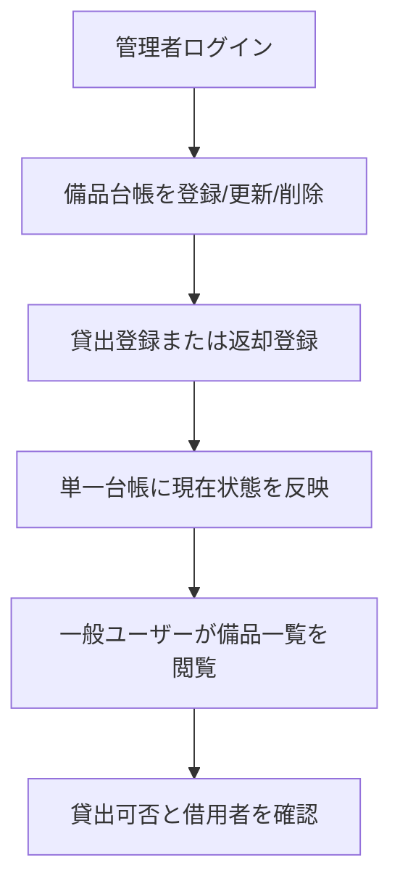
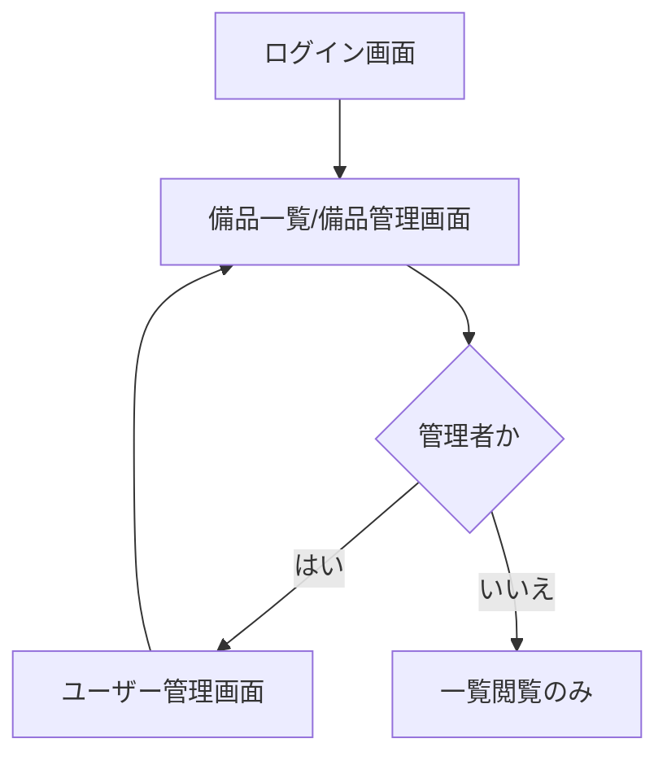
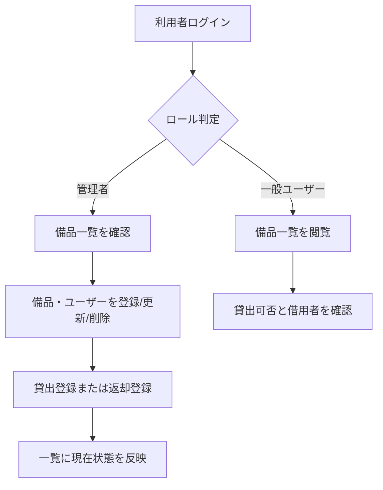
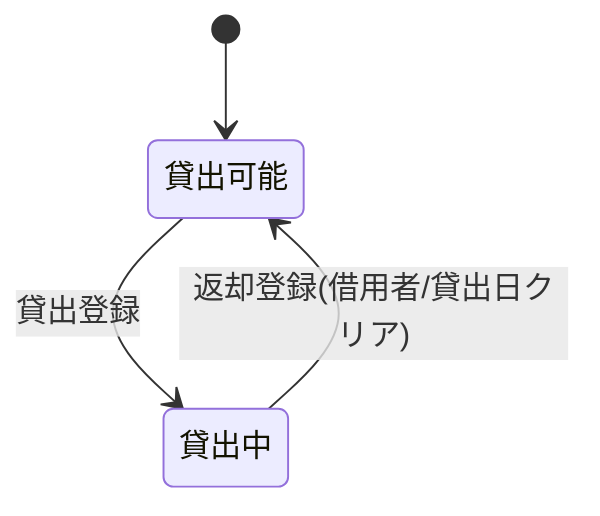
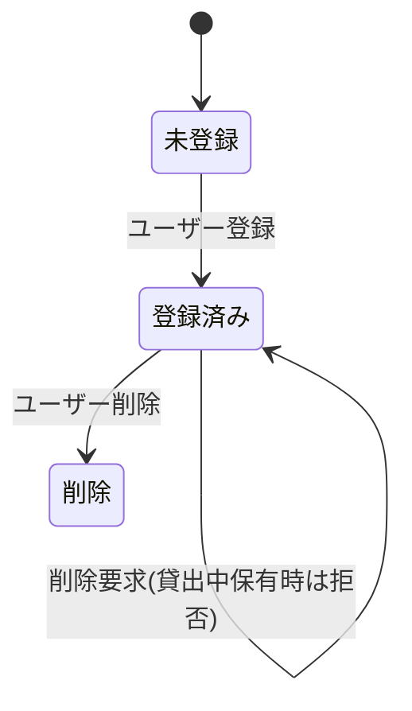

# 備品管理・貸出管理アプリ 要件定義書

## 1. 目的・前提

### 1-1. システムの目的

備品台帳を単一アプリに統一し、一般ユーザーが「貸出中か」「誰に貸し出されているか」を1分以内で確認できる状態を作る。

### 1-2. 用語集

| 用語 | 定義 |
|---|---|
| 資産管理番号 | 備品個体を一意に識別する番号。1備品に1つ割り当てる。 |
| 貸出状態 | `貸出可能` または `貸出中` の2状態。 |
| 管理者 | 備品・ユーザーの登録/更新/削除と、貸出/返却登録を実施する利用者。 |
| 一般ユーザー | 備品一覧の閲覧のみ可能な利用者。 |

### 1-3. GUI か CUI か

| RQ-ID | 種別 | 内容 | 対応業務課題ID（RQ-BK-*） |
|---|---|---|---|
| `RQ-UI-WEB-GUI-USE` | UI種別 | Web GUI を採用する。 | `RQ-BK-BORROWER-VISIBILITY`, `RQ-BK-LEDGER-FRAGMENTATION` |

---

## 2. 業務

### 2-1. 対象業務一覧

| RQ-BZ-ID | 業務名 | 概要 |
|---|---|---|
| `RQ-BZ-ASSET-LEDGER-MANAGEMENT` | 備品台帳管理業務 | 備品情報を単一台帳で登録・更新・削除する。 |
| `RQ-BZ-ASSET-LENDING-RETURN-MANAGEMENT` | 備品貸出返却業務 | 貸出登録と返却登録により現在の貸出状態を管理する。 |

### 2-2. 業務フロー（mermaid）

### 2-3. 業務の範囲・担当者

| 業務ID | 範囲 | 担当者 |
|---|---|---|
| `RQ-BZ-ASSET-LEDGER-MANAGEMENT` | 備品情報とユーザー情報の登録・更新・削除 | 管理者 |
| `RQ-BZ-ASSET-LENDING-RETURN-MANAGEMENT` | 貸出登録・返却登録・一覧閲覧 | 管理者、一般ユーザー |

### 2-4. 業務課題・KPI

| RQ-BK-ID | 業務課題 | KPI |
|---|---|---|
| `RQ-BK-BORROWER-VISIBILITY` | 誰に貸しているかを即時に把握できない | 一般ユーザーが借用者を確認するまでの時間を1分以内にする |
| `RQ-BK-LEDGER-FRAGMENTATION` | 担当ごとに台帳が分散し整合性が崩れる | 月次点検時の台帳不整合件数を0件にする |

### 2-5. 解決すべき課題と対応方針

| RQ-BK-ID | 解決課題 | 対応方針 |
|---|---|---|
| `RQ-BK-BORROWER-VISIBILITY` | 借用者確認に時間がかかる | 資産管理番号昇順の一覧に借用者名を表示し、貸出状態を即時確認可能にする |
| `RQ-BK-LEDGER-FRAGMENTATION` | 台帳の分散管理で不整合が発生する | 管理者がSQLite単一DBに手動再登録し、以後は同一アプリのみで更新する |

### 2-6. システム化による見込み経営効果

| RQ-BK-ID | 効果区分 | 内容 |
|---|---|---|
| `RQ-BK-BORROWER-VISIBILITY` | Soft Saving | 借用者照会の探索時間を削減し、問い合わせ対応時間を短縮する |
| `RQ-BK-LEDGER-FRAGMENTATION` | Cost Avoidance | 台帳不整合による再確認・再入力の手戻り工数を抑制する |

### 2-1. 業務課題一覧（必須）

| RQ-BK-ID | 業務課題 | 現状の問題 | 業務影響 | 解決状態 |
|---|---|---|---|---|
| `RQ-BK-BORROWER-VISIBILITY` | 借用者確認の遅延 | 備品ごとの借用者情報をすぐ参照できない | 問い合わせ対応に時間がかかる | 一覧で借用者名を即時確認できる |
| `RQ-BK-LEDGER-FRAGMENTATION` | 台帳分散による不整合 | 担当別台帳の更新タイミングが揃わない | 正しい貸出可否を判断できない | 単一台帳で不整合0件を維持できる |

### 2-7. 業務課題と機能の整合

| RQ-BK-ID | 対応機能ID | 確認結果 |
|---|---|---|
| `RQ-BK-BORROWER-VISIBILITY` | `RQ-FT-VIEW-ASSET-LIST`, `RQ-FT-REGISTER-LOAN`, `RQ-FT-REGISTER-RETURN-CLEAR-CURRENT-LOAN` | 業務課題を満たす最低機能が定義されている |
| `RQ-BK-LEDGER-FRAGMENTATION` | `RQ-FT-REGISTER-ASSET`, `RQ-FT-UPDATE-ASSET`, `RQ-FT-REGISTER-USER`, `RQ-OP-INITIAL-LEDGER-MANUAL-REGISTRATION` | 業務課題を満たす最低機能が定義されている |

---

## 3. 機能要件

### 3-1. 入力データ（人手入力 / 外部連携）

| RQ-ID | 種別 | 入力内容 | 入力者 | 対応業務課題ID（RQ-BK-*） |
|---|---|---|---|---|
| `RQ-FT-REGISTER-ASSET` | 人手入力 | 資産管理番号、備品名 | 管理者 | `RQ-BK-LEDGER-FRAGMENTATION` |
| `RQ-FT-REGISTER-USER` | 人手入力 | ログインID、表示名、権限、初期PW | 管理者 | `RQ-BK-LEDGER-FRAGMENTATION` |
| `RQ-FT-REGISTER-LOAN` | 人手入力 | 資産管理番号、借用者、貸出日 | 管理者 | `RQ-BK-BORROWER-VISIBILITY`, `RQ-BK-LEDGER-FRAGMENTATION` |
| `RQ-EX-DISABLE-EXTERNAL-SYSTEM-INTEGRATION` | 外部連携 | 外部システムからの入力は受け付けない | なし | `RQ-BK-LEDGER-FRAGMENTATION` |

### 3-2. 出力データ

| RQ-ID | 出力項目 | 内容 | 対応業務課題ID（RQ-BK-*） |
|---|---|---|---|
| `RQ-FT-VIEW-ASSET-LIST` | 備品一覧 | `資産管理番号 / 備品名 / 状態 / 借用者名` を資産管理番号昇順で表示する | `RQ-BK-BORROWER-VISIBILITY`, `RQ-BK-LEDGER-FRAGMENTATION` |

### 3-3. 外部連携

| RQ-ID | 項目 | 内容 | 対応業務課題ID（RQ-BK-*） |
|---|---|---|---|
| `RQ-EX-DISABLE-EXTERNAL-SYSTEM-INTEGRATION` | 外部連携要件 | 外部システム連携は実施しない | `RQ-BK-LEDGER-FRAGMENTATION` |

### 3-4. GUI の場合：全画面の仕様と画面遷移図

| RQ-ID | 画面名 | 利用者 | 仕様 | 対応業務課題ID（RQ-BK-*） |
|---|---|---|---|---|
| `RQ-UI-LOGIN-SCREEN` | ログイン画面 | 管理者、一般ユーザー | ログインIDとパスワードで認証する | `RQ-BK-BORROWER-VISIBILITY`, `RQ-BK-LEDGER-FRAGMENTATION` |
| `RQ-UI-ASSET-LIST-MANAGEMENT-SCREEN` | 備品一覧/備品管理画面 | 管理者、一般ユーザー | 一般ユーザーは一覧閲覧のみ。管理者は同一画面の行操作で備品登録/更新/削除/貸出登録/返却登録を実行する | `RQ-BK-BORROWER-VISIBILITY`, `RQ-BK-LEDGER-FRAGMENTATION` |
| `RQ-UI-USER-MANAGEMENT-SCREEN` | ユーザー管理画面 | 管理者 | ユーザー登録/更新/削除、初期PW再設定を実行する。貸出中備品を持つユーザーは削除不可とする | `RQ-BK-LEDGER-FRAGMENTATION` |

### 3-5. 全機能のユーザー利用フロー（mermaid）

### 3-6. 業務フローとの対応関係

| RQ-ID | 業務フロー工程 | 対応内容 |
|---|---|---|
| `RQ-FT-REGISTER-ASSET` | 備品台帳を登録/更新/削除 | 備品情報の新規登録 |
| `RQ-FT-UPDATE-ASSET` | 備品台帳を登録/更新/削除 | 備品情報の更新 |
| `RQ-FT-REGISTER-LOAN` | 貸出登録または返却登録 | 借用者・貸出日・状態を更新 |
| `RQ-FT-REGISTER-RETURN-CLEAR-CURRENT-LOAN` | 貸出登録または返却登録 | 借用者・貸出日をクリアし状態を貸出可能へ戻す |
| `RQ-FT-VIEW-ASSET-LIST` | 一般ユーザーが備品一覧を閲覧 | 借用者と貸出可否の確認 |

### 3-7. ログの要否・内容・保存期間

| RQ-ID | 項目 | 要件 | 対応業務課題ID（RQ-BK-*） |
|---|---|---|---|
| `RQ-OP-ERROR-LOG-CAPTURE` | ログ内容 | エラーログのみ記録し、操作監査ログは記録しない | `RQ-BK-LEDGER-FRAGMENTATION` |
| `RQ-OP-ERROR-LOG-RETENTION-90D` | 保存期間 | エラーログを90日保持する | `RQ-BK-LEDGER-FRAGMENTATION` |
| `RQ-OP-AUDIT-LOG-NOT-REQUIRED` | 監査ログ | 監査要件は現時点で対象外とし、監査ログは記録しない | `RQ-BK-LEDGER-FRAGMENTATION` |

### 3-8. 監視・アラートの要否・内容・対応方法

| RQ-ID | 項目 | 要件 | 対応業務課題ID（RQ-BK-*） |
|---|---|---|---|
| `RQ-OP-MONITORING-ALERT-NOT-REQUIRED` | 監視・アラート | 監視・アラートは必要ないため、監視・アラートの内容と対応方法の記述は行わない。 | `RQ-BK-LEDGER-FRAGMENTATION` |

### 3-9. 機能一覧

| RQ-ID | カテゴリ | 機能名 | 対応業務課題ID（RQ-BK-*） | この機能が無いと何が困るか |
|---|---|---|---|---|
| `RQ-FT-AUTHENTICATE-USER` | 共通（認証） | ID/パスワード認証 | `RQ-BK-BORROWER-VISIBILITY`, `RQ-BK-LEDGER-FRAGMENTATION` | ロール別の利用制御ができない |
| `RQ-FT-AUTHORIZE-BY-ROLE` | 共通（認可） | 管理者/一般ユーザーの権限制御 | `RQ-BK-BORROWER-VISIBILITY`, `RQ-BK-LEDGER-FRAGMENTATION` | 一般ユーザーが台帳を更新できて整合性が崩れる |
| `RQ-FT-VIEW-ASSET-LIST` | 業務機能 | 備品一覧閲覧 | `RQ-BK-BORROWER-VISIBILITY` | 誰に貸しているか確認できない |
| `RQ-FT-REGISTER-LOAN` | 業務機能 | 貸出登録 | `RQ-BK-BORROWER-VISIBILITY`, `RQ-BK-LEDGER-FRAGMENTATION` | 現在の借用者を記録できない |
| `RQ-FT-REGISTER-RETURN-CLEAR-CURRENT-LOAN` | 業務機能 | 返却登録（借用者/貸出日クリア） | `RQ-BK-BORROWER-VISIBILITY`, `RQ-BK-LEDGER-FRAGMENTATION` | 返却後も貸出中の誤表示が残る |
| `RQ-FT-REGISTER-ASSET` | マスタ管理 | 備品登録 | `RQ-BK-LEDGER-FRAGMENTATION` | 単一台帳の初期整備ができない |
| `RQ-FT-UPDATE-ASSET` | マスタ管理 | 備品更新 | `RQ-BK-LEDGER-FRAGMENTATION` | 台帳情報の最新化ができない |
| `RQ-FT-DELETE-ASSET-WITH-LOAN-CHECK` | マスタ管理 | 備品削除（貸出中は削除不可） | `RQ-BK-BORROWER-VISIBILITY`, `RQ-BK-LEDGER-FRAGMENTATION` | 貸出先情報が失われ不整合になる |
| `RQ-FT-REGISTER-USER` | マスタ管理 | ユーザー登録（手動） | `RQ-BK-LEDGER-FRAGMENTATION` | 貸出先を正規ユーザーに紐づけられない |
| `RQ-FT-UPDATE-USER` | マスタ管理 | ユーザー更新 | `RQ-BK-LEDGER-FRAGMENTATION` | 表示名や権限の誤りを修正できない |
| `RQ-FT-DELETE-USER-WITH-LOAN-CHECK` | マスタ管理 | ユーザー削除（貸出中保有時は削除不可） | `RQ-BK-BORROWER-VISIBILITY`, `RQ-BK-LEDGER-FRAGMENTATION` | 借用者情報が欠落する |
| `RQ-FT-CHANGE-OWN-PASSWORD` | 共通（認証） | 利用者自身のPW変更 | `RQ-BK-LEDGER-FRAGMENTATION` | 管理者への再設定依頼が集中し運用が停滞する |
| `RQ-FT-RESET-USER-PASSWORD` | 共通（認証） | 管理者による初期PW再設定 | `RQ-BK-LEDGER-FRAGMENTATION` | PW失念時に利用者が復旧できない |
| `RQ-EX-DISABLE-EXTERNAL-SYSTEM-INTEGRATION` | 外部連携 | 外部連携なしの固定スコープ | `RQ-BK-LEDGER-FRAGMENTATION` | 連携仕様調整で台帳統一の立ち上げが遅れる |
| `RQ-OP-INITIAL-LEDGER-MANUAL-REGISTRATION` | 運用 | 分散台帳の手動再登録 | `RQ-BK-LEDGER-FRAGMENTATION` | 分散台帳を単一台帳へ統一できない |
| `RQ-OP-BACKUP-NOT-REQUIRED-REINPUT-ACCEPTED` | 運用 | バックアップは実施せず再入力で復旧 | `RQ-BK-LEDGER-FRAGMENTATION` | 運用負荷最小化方針を維持できない |

### 3-10. 機能と画面・ユーザーフローの対応検証

| 機能ID | 画面ID | ユーザーフロー工程 | 対応確認 |
|---|---|---|---|
| `RQ-FT-AUTHENTICATE-USER` | `RQ-UI-LOGIN-SCREEN` | ログイン | 一致 |
| `RQ-FT-VIEW-ASSET-LIST` | `RQ-UI-ASSET-LIST-MANAGEMENT-SCREEN` | 一覧閲覧 | 一致 |
| `RQ-FT-REGISTER-LOAN` | `RQ-UI-ASSET-LIST-MANAGEMENT-SCREEN` | 貸出登録 | 一致 |
| `RQ-FT-REGISTER-RETURN-CLEAR-CURRENT-LOAN` | `RQ-UI-ASSET-LIST-MANAGEMENT-SCREEN` | 返却登録 | 一致 |
| `RQ-FT-REGISTER-USER` | `RQ-UI-USER-MANAGEMENT-SCREEN` | ユーザー登録 | 一致 |
| `RQ-FT-RESET-USER-PASSWORD` | `RQ-UI-USER-MANAGEMENT-SCREEN` | PW再設定 | 一致 |

---

## 4. データ

### 4-1. 内部データ / 外部データの区別

| RQ-ID | データ名 | 区分 | 内容 | 対応業務課題ID（RQ-BK-*） |
|---|---|---|---|---|
| `RQ-DT-ASSET-MASTER-INTERNAL-DATA` | 備品マスタ | 内部データ | 資産管理番号、備品名、貸出状態、借用者、貸出日 | `RQ-BK-BORROWER-VISIBILITY`, `RQ-BK-LEDGER-FRAGMENTATION` |
| `RQ-DT-USER-MASTER-INTERNAL-DATA` | ユーザーマスタ | 内部データ | ログインID、表示名、権限、PWハッシュ | `RQ-BK-LEDGER-FRAGMENTATION` |
| `RQ-DT-CURRENT-LOAN-STATE-INTERNAL-DATA` | 現在貸出状態データ | 内部データ | 備品ごとの現在の借用者と貸出日 | `RQ-BK-BORROWER-VISIBILITY` |
| `RQ-DT-ERROR-LOG-INTERNAL-DATA` | エラーログ | 内部データ | 発生時刻、画面、エラー内容 | `RQ-BK-LEDGER-FRAGMENTATION` |
| `RQ-DT-NO-EXTERNAL-DATA` | 外部データ | 外部データ | 外部データは使用しない | `RQ-BK-LEDGER-FRAGMENTATION` |

### 4-2. データ保持期間

| RQ-ID | データ名 | 保持期間 | 対応業務課題ID（RQ-BK-*） |
|---|---|---|---|
| `RQ-DT-ASSET-MASTER-RETENTION-UNTIL-DELETED` | 備品マスタ | 削除されるまで保持 | `RQ-BK-LEDGER-FRAGMENTATION` |
| `RQ-DT-USER-MASTER-RETENTION-UNTIL-DELETED` | ユーザーマスタ | 削除されるまで保持 | `RQ-BK-LEDGER-FRAGMENTATION` |
| `RQ-DT-CURRENT-LOAN-NO-HISTORY-RETENTION` | 現在貸出状態データ | 返却登録時に借用者と貸出日をクリアし、履歴は保持しない | `RQ-BK-BORROWER-VISIBILITY`, `RQ-BK-LEDGER-FRAGMENTATION` |
| `RQ-DT-ERROR-LOG-RETENTION-90D` | エラーログ | 90日保持 | `RQ-BK-LEDGER-FRAGMENTATION` |

### 4-3. 外部 DB 接続先と接続方法の一覧

| RQ-ID | 接続先 | 接続方法 | 対応業務課題ID（RQ-BK-*） |
|---|---|---|---|
| `RQ-DT-NO-EXTERNAL-DB-CONNECTION` | なし | 外部DB接続は行わない | `RQ-BK-LEDGER-FRAGMENTATION` |

### 4-4. DB の必要性の有無と理由

| RQ-ID | 判定 | 理由 | 対応業務課題ID（RQ-BK-*） |
|---|---|---|---|
| `RQ-DT-USE-SQLITE-LOCAL-DB` | 必要 | アプリ内DBとしてSQLiteを使用する | `RQ-BK-LEDGER-FRAGMENTATION` |
| `RQ-DT-DB-REQUIRED-FOR-UNIFIED-LEDGER` | 必要 | 単一台帳を一貫して更新し、不整合0件を維持するため | `RQ-BK-LEDGER-FRAGMENTATION` |

### 4-5. 業務エンティティ一覧

| RQ-ID | カテゴリ | 業務エンティティ名 | 対応業務課題ID（RQ-BK-*） | この業務エンティティが無いと何が困るか |
|---|---|---|---|---|
| `RQ-DT-ASSET-ENTITY` | データ | 備品 | `RQ-BK-BORROWER-VISIBILITY`, `RQ-BK-LEDGER-FRAGMENTATION` | 借用者・貸出可否を管理できない |
| `RQ-DT-USER-ENTITY` | データ | ユーザー | `RQ-BK-LEDGER-FRAGMENTATION` | 借用者を正規ユーザーに紐づけできない |

### 4-6. エンティティ定義表

#### 備品エンティティ（`RQ-DT-ASSET-ENTITY`）

| 項目名 | 型 | 必須 | 説明 |
|---|---|---|---|
| 資産管理番号 | 文字列 | 必須 | 一意キー |
| 備品名 | 文字列 | 必須 | 備品表示名 |
| 貸出状態 | 列挙 | 必須 | `貸出可能` / `貸出中` |
| 借用者ログインID | 文字列 | 条件付き | 貸出中のみ必須 |
| 貸出日 | 日付 | 条件付き | 貸出中のみ必須 |

#### ユーザーエンティティ（`RQ-DT-USER-ENTITY`）

| 項目名 | 型 | 必須 | 説明 |
|---|---|---|---|
| ログインID | 文字列 | 必須 | 一意キー |
| 表示名 | 文字列 | 必須 | 一覧に表示する氏名 |
| 権限 | 列挙 | 必須 | `管理者` / `一般ユーザー` |
| パスワードハッシュ | 文字列 | 必須 | ハッシュ化済みPW |

### 4-1. CRUDテーブル（必須）

| エンティティ名 | Create | Read（一覧） | Read（詳細） | Update | Delete | 備考 |
|---|---|---|---|---|---|---|
| 備品 | ○ | ○ | × | ○ | △ | 貸出中は削除不可 |
| ユーザー | ○ | ○ | × | ○ | △ | 貸出中備品保有時は削除不可 |

### 4-7. データ整合制約

| RQ-ID | 制約 | 内容 | 対応業務課題ID（RQ-BK-*） |
|---|---|---|---|
| `RQ-DT-ASSET-NUMBER-UNIQUE` | 一意制約 | 資産管理番号は重複不可 | `RQ-BK-LEDGER-FRAGMENTATION` |
| `RQ-DT-LOGIN-ID-UNIQUE` | 一意制約 | ログインIDは重複不可 | `RQ-BK-LEDGER-FRAGMENTATION` |
| `RQ-DT-BORROWER-MUST-BE-REGISTERED-USER` | 参照整合制約 | 貸出登録時の借用者はユーザー一覧から選択し、未登録ユーザーを指定不可とする | `RQ-BK-BORROWER-VISIBILITY`, `RQ-BK-LEDGER-FRAGMENTATION` |

### 4-8. エンティティ状態遷移

#### 備品状態遷移

#### ユーザー状態遷移

---

## 5. 非機能要件

### 5-1. 性能

| RQ-ID | 項目 | 要件 | 対応業務課題ID（RQ-BK-*） |
|---|---|---|---|
| `RQ-NF-ASSET-LIST-RESPONSE-UNDER-2S` | 応答時間 | 備品総数50件以下の一覧表示を2秒以内で完了する | `RQ-BK-BORROWER-VISIBILITY` |

### 5-2. 利用人数

| RQ-ID | 項目 | 要件 | 対応業務課題ID（RQ-BK-*） |
|---|---|---|---|
| `RQ-NF-CONCURRENT-USERS-10` | 同時利用人数 | 同時利用10人までを対象とする | `RQ-BK-BORROWER-VISIBILITY`, `RQ-BK-LEDGER-FRAGMENTATION` |

### 5-3. セキュリティ要件

| RQ-ID | 項目 | 要件 | 対応業務課題ID（RQ-BK-*） |
|---|---|---|---|
| `RQ-NF-ROLE-BASED-AUTHORIZATION` | 認可 | 管理者のみ更新系操作を許可し、一般ユーザーは閲覧のみ許可する | `RQ-BK-BORROWER-VISIBILITY`, `RQ-BK-LEDGER-FRAGMENTATION` |
| `RQ-NF-LAN-ONLY-HTTP-ACCESS` | 通信経路 | 社内LANからのHTTPアクセスのみ許可する | `RQ-BK-LEDGER-FRAGMENTATION` |
| `RQ-NF-PASSWORD-HASH-STORAGE` | パスワード保護 | パスワードはハッシュ化して保存する | `RQ-BK-LEDGER-FRAGMENTATION` |
| `RQ-NF-PASSWORD-COMPLEXITY-RULE-NONE` | パスワードポリシー | 文字数・文字種制約は設けない（社内閉域で運用負荷最小化を優先） | `RQ-BK-LEDGER-FRAGMENTATION` |

### 5-4. 非機能要件一覧

| RQ-ID | カテゴリ | 非機能要件名 | 対応業務課題ID（RQ-BK-*） | この非機能要件が無いと何が困るか |
|---|---|---|---|---|
| `RQ-NF-ASSET-LIST-RESPONSE-UNDER-2S` | 性能 | 一覧2秒以内表示 | `RQ-BK-BORROWER-VISIBILITY` | 借用者確認が1分以内で終わらない |
| `RQ-NF-CONCURRENT-USERS-10` | 利用人数 | 同時利用10人 | `RQ-BK-BORROWER-VISIBILITY`, `RQ-BK-LEDGER-FRAGMENTATION` | 利用集中時に一覧確認や更新が失敗する |
| `RQ-NF-ROLE-BASED-AUTHORIZATION` | セキュリティ | ロール別認可 | `RQ-BK-BORROWER-VISIBILITY`, `RQ-BK-LEDGER-FRAGMENTATION` | 不正更新で台帳不整合が発生する |
| `RQ-NF-LAN-ONLY-HTTP-ACCESS` | セキュリティ | 社内LANのみアクセス許可 | `RQ-BK-LEDGER-FRAGMENTATION` | 想定外経路からのアクセスを許して運用が不安定になる |
| `RQ-NF-PASSWORD-HASH-STORAGE` | セキュリティ | PWハッシュ保存 | `RQ-BK-LEDGER-FRAGMENTATION` | 認証情報保護ができない |
| `RQ-NF-PASSWORD-COMPLEXITY-RULE-NONE` | セキュリティ | PW制約なし | `RQ-BK-LEDGER-FRAGMENTATION` | 社内運用での初期導入負荷を抑えられない |

---

## 6. テスト用利用シナリオ

| RQ-TS-ID | テスト目的 | 前提条件 | テスト手順 | 期待される結果 | 対応業務課題ID（RQ-BK-*） |
|---|---|---|---|---|---|
| `RQ-TS-VERIFY-ADMIN-REGISTER-LOAN-RETURN` | 管理者の備品登録・貸出・返却の正常処理を確認する | 管理者アカウントでログイン済み | 備品登録→貸出登録→返却登録を実行する | 貸出時に借用者/貸出日が設定され、返却時に借用者/貸出日がクリアされる | `RQ-BK-BORROWER-VISIBILITY`, `RQ-BK-LEDGER-FRAGMENTATION` |
| `RQ-TS-VERIFY-GENERAL-USER-VIEW-BORROWER` | 一般ユーザーの閲覧要件を確認する | 一般ユーザーでログイン済み、貸出中備品が存在する | 備品一覧を表示する | `資産管理番号/備品名/状態/借用者名` が表示され、借用者を確認できる | `RQ-BK-BORROWER-VISIBILITY` |
| `RQ-TS-VERIFY-PASSWORD-CHANGE-AND-RESET` | 利用者自己変更と管理者再設定の正常処理を確認する | 対象ユーザーが存在する | 利用者がPW変更→ログイン確認→管理者が初期PW再設定→再ログイン確認 | 変更後PWと再設定後PWの双方でログイン成功する | `RQ-BK-LEDGER-FRAGMENTATION` |
| `RQ-TS-REJECT-PRIVILEGE-VIOLATION` | 一般ユーザーの更新操作拒否を確認する | 一般ユーザーでログイン済み | 備品更新/削除/貸出登録/返却登録を試行する | すべて権限不足で拒否され、データが変更されない | `RQ-BK-LEDGER-FRAGMENTATION` |
| `RQ-TS-REJECT-DELETE-WHEN-LOAN-EXISTS` | 貸出中データの削除禁止を確認する | 貸出中備品とその借用者ユーザーが存在する | 貸出中備品の削除と、貸出中備品を持つユーザー削除を試行する | いずれも削除不可エラーとなり、データが保持される | `RQ-BK-BORROWER-VISIBILITY`, `RQ-BK-LEDGER-FRAGMENTATION` |

---

## 7. 業務課題と要件の対応表

### 7-1. 業務課題（RQ-BK-*）→ 要件（RQ-*）

| RQ-BK-ID | 業務課題 | 対応要件ID |
|---|---|---|
| `RQ-BK-BORROWER-VISIBILITY` | 借用者確認の遅延 | `RQ-UI-WEB-GUI-USE`, `RQ-UI-LOGIN-SCREEN`, `RQ-UI-ASSET-LIST-MANAGEMENT-SCREEN`, `RQ-FT-AUTHENTICATE-USER`, `RQ-FT-AUTHORIZE-BY-ROLE`, `RQ-FT-VIEW-ASSET-LIST`, `RQ-FT-REGISTER-LOAN`, `RQ-FT-REGISTER-RETURN-CLEAR-CURRENT-LOAN`, `RQ-FT-DELETE-ASSET-WITH-LOAN-CHECK`, `RQ-FT-DELETE-USER-WITH-LOAN-CHECK`, `RQ-DT-ASSET-MASTER-INTERNAL-DATA`, `RQ-DT-CURRENT-LOAN-STATE-INTERNAL-DATA`, `RQ-DT-CURRENT-LOAN-NO-HISTORY-RETENTION`, `RQ-DT-ASSET-ENTITY`, `RQ-DT-BORROWER-MUST-BE-REGISTERED-USER`, `RQ-NF-ASSET-LIST-RESPONSE-UNDER-2S`, `RQ-NF-CONCURRENT-USERS-10`, `RQ-NF-ROLE-BASED-AUTHORIZATION`, `RQ-TS-VERIFY-ADMIN-REGISTER-LOAN-RETURN`, `RQ-TS-VERIFY-GENERAL-USER-VIEW-BORROWER`, `RQ-TS-REJECT-DELETE-WHEN-LOAN-EXISTS` |
| `RQ-BK-LEDGER-FRAGMENTATION` | 台帳分散による不整合 | `RQ-UI-WEB-GUI-USE`, `RQ-UI-LOGIN-SCREEN`, `RQ-UI-ASSET-LIST-MANAGEMENT-SCREEN`, `RQ-UI-USER-MANAGEMENT-SCREEN`, `RQ-FT-AUTHENTICATE-USER`, `RQ-FT-AUTHORIZE-BY-ROLE`, `RQ-FT-REGISTER-ASSET`, `RQ-FT-UPDATE-ASSET`, `RQ-FT-DELETE-ASSET-WITH-LOAN-CHECK`, `RQ-FT-REGISTER-USER`, `RQ-FT-UPDATE-USER`, `RQ-FT-DELETE-USER-WITH-LOAN-CHECK`, `RQ-FT-REGISTER-LOAN`, `RQ-FT-REGISTER-RETURN-CLEAR-CURRENT-LOAN`, `RQ-FT-CHANGE-OWN-PASSWORD`, `RQ-FT-RESET-USER-PASSWORD`, `RQ-EX-DISABLE-EXTERNAL-SYSTEM-INTEGRATION`, `RQ-OP-ERROR-LOG-CAPTURE`, `RQ-OP-ERROR-LOG-RETENTION-90D`, `RQ-OP-AUDIT-LOG-NOT-REQUIRED`, `RQ-OP-MONITORING-ALERT-NOT-REQUIRED`, `RQ-OP-BACKUP-NOT-REQUIRED-REINPUT-ACCEPTED`, `RQ-OP-INITIAL-LEDGER-MANUAL-REGISTRATION`, `RQ-DT-ASSET-MASTER-INTERNAL-DATA`, `RQ-DT-USER-MASTER-INTERNAL-DATA`, `RQ-DT-ERROR-LOG-INTERNAL-DATA`, `RQ-DT-NO-EXTERNAL-DATA`, `RQ-DT-ASSET-MASTER-RETENTION-UNTIL-DELETED`, `RQ-DT-USER-MASTER-RETENTION-UNTIL-DELETED`, `RQ-DT-ERROR-LOG-RETENTION-90D`, `RQ-DT-NO-EXTERNAL-DB-CONNECTION`, `RQ-DT-USE-SQLITE-LOCAL-DB`, `RQ-DT-DB-REQUIRED-FOR-UNIFIED-LEDGER`, `RQ-DT-ASSET-ENTITY`, `RQ-DT-USER-ENTITY`, `RQ-DT-ASSET-NUMBER-UNIQUE`, `RQ-DT-LOGIN-ID-UNIQUE`, `RQ-DT-BORROWER-MUST-BE-REGISTERED-USER`, `RQ-NF-CONCURRENT-USERS-10`, `RQ-NF-ROLE-BASED-AUTHORIZATION`, `RQ-NF-LAN-ONLY-HTTP-ACCESS`, `RQ-NF-PASSWORD-HASH-STORAGE`, `RQ-NF-PASSWORD-COMPLEXITY-RULE-NONE`, `RQ-TS-VERIFY-ADMIN-REGISTER-LOAN-RETURN`, `RQ-TS-VERIFY-PASSWORD-CHANGE-AND-RESET`, `RQ-TS-REJECT-PRIVILEGE-VIOLATION`, `RQ-TS-REJECT-DELETE-WHEN-LOAN-EXISTS` |

### 7-2. 要件（RQ-*）→ 業務課題（RQ-BK-*）

| RQ-ID | 対応業務課題ID（RQ-BK-*） |
|---|---|
| `RQ-UI-WEB-GUI-USE` | `RQ-BK-BORROWER-VISIBILITY`, `RQ-BK-LEDGER-FRAGMENTATION` |
| `RQ-UI-LOGIN-SCREEN` | `RQ-BK-BORROWER-VISIBILITY`, `RQ-BK-LEDGER-FRAGMENTATION` |
| `RQ-UI-ASSET-LIST-MANAGEMENT-SCREEN` | `RQ-BK-BORROWER-VISIBILITY`, `RQ-BK-LEDGER-FRAGMENTATION` |
| `RQ-UI-USER-MANAGEMENT-SCREEN` | `RQ-BK-LEDGER-FRAGMENTATION` |
| `RQ-FT-AUTHENTICATE-USER` | `RQ-BK-BORROWER-VISIBILITY`, `RQ-BK-LEDGER-FRAGMENTATION` |
| `RQ-FT-AUTHORIZE-BY-ROLE` | `RQ-BK-BORROWER-VISIBILITY`, `RQ-BK-LEDGER-FRAGMENTATION` |
| `RQ-FT-VIEW-ASSET-LIST` | `RQ-BK-BORROWER-VISIBILITY` |
| `RQ-FT-REGISTER-ASSET` | `RQ-BK-LEDGER-FRAGMENTATION` |
| `RQ-FT-UPDATE-ASSET` | `RQ-BK-LEDGER-FRAGMENTATION` |
| `RQ-FT-DELETE-ASSET-WITH-LOAN-CHECK` | `RQ-BK-BORROWER-VISIBILITY`, `RQ-BK-LEDGER-FRAGMENTATION` |
| `RQ-FT-REGISTER-USER` | `RQ-BK-LEDGER-FRAGMENTATION` |
| `RQ-FT-UPDATE-USER` | `RQ-BK-LEDGER-FRAGMENTATION` |
| `RQ-FT-DELETE-USER-WITH-LOAN-CHECK` | `RQ-BK-BORROWER-VISIBILITY`, `RQ-BK-LEDGER-FRAGMENTATION` |
| `RQ-FT-REGISTER-LOAN` | `RQ-BK-BORROWER-VISIBILITY`, `RQ-BK-LEDGER-FRAGMENTATION` |
| `RQ-FT-REGISTER-RETURN-CLEAR-CURRENT-LOAN` | `RQ-BK-BORROWER-VISIBILITY`, `RQ-BK-LEDGER-FRAGMENTATION` |
| `RQ-FT-CHANGE-OWN-PASSWORD` | `RQ-BK-LEDGER-FRAGMENTATION` |
| `RQ-FT-RESET-USER-PASSWORD` | `RQ-BK-LEDGER-FRAGMENTATION` |
| `RQ-EX-DISABLE-EXTERNAL-SYSTEM-INTEGRATION` | `RQ-BK-LEDGER-FRAGMENTATION` |
| `RQ-OP-ERROR-LOG-CAPTURE` | `RQ-BK-LEDGER-FRAGMENTATION` |
| `RQ-OP-ERROR-LOG-RETENTION-90D` | `RQ-BK-LEDGER-FRAGMENTATION` |
| `RQ-OP-AUDIT-LOG-NOT-REQUIRED` | `RQ-BK-LEDGER-FRAGMENTATION` |
| `RQ-OP-MONITORING-ALERT-NOT-REQUIRED` | `RQ-BK-LEDGER-FRAGMENTATION` |
| `RQ-OP-BACKUP-NOT-REQUIRED-REINPUT-ACCEPTED` | `RQ-BK-LEDGER-FRAGMENTATION` |
| `RQ-OP-INITIAL-LEDGER-MANUAL-REGISTRATION` | `RQ-BK-LEDGER-FRAGMENTATION` |
| `RQ-DT-ASSET-MASTER-INTERNAL-DATA` | `RQ-BK-BORROWER-VISIBILITY`, `RQ-BK-LEDGER-FRAGMENTATION` |
| `RQ-DT-USER-MASTER-INTERNAL-DATA` | `RQ-BK-LEDGER-FRAGMENTATION` |
| `RQ-DT-CURRENT-LOAN-STATE-INTERNAL-DATA` | `RQ-BK-BORROWER-VISIBILITY` |
| `RQ-DT-ERROR-LOG-INTERNAL-DATA` | `RQ-BK-LEDGER-FRAGMENTATION` |
| `RQ-DT-NO-EXTERNAL-DATA` | `RQ-BK-LEDGER-FRAGMENTATION` |
| `RQ-DT-ASSET-MASTER-RETENTION-UNTIL-DELETED` | `RQ-BK-LEDGER-FRAGMENTATION` |
| `RQ-DT-USER-MASTER-RETENTION-UNTIL-DELETED` | `RQ-BK-LEDGER-FRAGMENTATION` |
| `RQ-DT-CURRENT-LOAN-NO-HISTORY-RETENTION` | `RQ-BK-BORROWER-VISIBILITY`, `RQ-BK-LEDGER-FRAGMENTATION` |
| `RQ-DT-ERROR-LOG-RETENTION-90D` | `RQ-BK-LEDGER-FRAGMENTATION` |
| `RQ-DT-NO-EXTERNAL-DB-CONNECTION` | `RQ-BK-LEDGER-FRAGMENTATION` |
| `RQ-DT-USE-SQLITE-LOCAL-DB` | `RQ-BK-LEDGER-FRAGMENTATION` |
| `RQ-DT-DB-REQUIRED-FOR-UNIFIED-LEDGER` | `RQ-BK-LEDGER-FRAGMENTATION` |
| `RQ-DT-ASSET-ENTITY` | `RQ-BK-BORROWER-VISIBILITY`, `RQ-BK-LEDGER-FRAGMENTATION` |
| `RQ-DT-USER-ENTITY` | `RQ-BK-LEDGER-FRAGMENTATION` |
| `RQ-DT-ASSET-NUMBER-UNIQUE` | `RQ-BK-LEDGER-FRAGMENTATION` |
| `RQ-DT-LOGIN-ID-UNIQUE` | `RQ-BK-LEDGER-FRAGMENTATION` |
| `RQ-DT-BORROWER-MUST-BE-REGISTERED-USER` | `RQ-BK-BORROWER-VISIBILITY`, `RQ-BK-LEDGER-FRAGMENTATION` |
| `RQ-NF-ASSET-LIST-RESPONSE-UNDER-2S` | `RQ-BK-BORROWER-VISIBILITY` |
| `RQ-NF-CONCURRENT-USERS-10` | `RQ-BK-BORROWER-VISIBILITY`, `RQ-BK-LEDGER-FRAGMENTATION` |
| `RQ-NF-ROLE-BASED-AUTHORIZATION` | `RQ-BK-BORROWER-VISIBILITY`, `RQ-BK-LEDGER-FRAGMENTATION` |
| `RQ-NF-LAN-ONLY-HTTP-ACCESS` | `RQ-BK-LEDGER-FRAGMENTATION` |
| `RQ-NF-PASSWORD-HASH-STORAGE` | `RQ-BK-LEDGER-FRAGMENTATION` |
| `RQ-NF-PASSWORD-COMPLEXITY-RULE-NONE` | `RQ-BK-LEDGER-FRAGMENTATION` |
| `RQ-TS-VERIFY-ADMIN-REGISTER-LOAN-RETURN` | `RQ-BK-BORROWER-VISIBILITY`, `RQ-BK-LEDGER-FRAGMENTATION` |
| `RQ-TS-VERIFY-GENERAL-USER-VIEW-BORROWER` | `RQ-BK-BORROWER-VISIBILITY` |
| `RQ-TS-VERIFY-PASSWORD-CHANGE-AND-RESET` | `RQ-BK-LEDGER-FRAGMENTATION` |
| `RQ-TS-REJECT-PRIVILEGE-VIOLATION` | `RQ-BK-LEDGER-FRAGMENTATION` |
| `RQ-TS-REJECT-DELETE-WHEN-LOAN-EXISTS` | `RQ-BK-BORROWER-VISIBILITY`, `RQ-BK-LEDGER-FRAGMENTATION` |

---

## 8. MVP最小化確認（削除可能要件の整理）

| 削除した要件候補 | 削除理由 | 削除しても業務が成立する根拠 |
|---|---|---|
| 貸出履歴の保持 | 現在貸出状態のみ保持で要件達成可能 | 借用者確認は現在状態のみで成立する |
| 備品検索機能 | 備品総数50件以下で一覧目視確認可能 | KPI（1分以内確認）を満たせる |
| 監視・アラート | MVPでは不要と確定 | 手動運用で現時点の業務継続が可能 |
| バックアップ | 再入力可能・停止許容で運用確定 | 運用負荷最小化を優先できる |
| 外部システム連携 | 単一アプリ内運用に限定 | 台帳統一の立ち上げを最短化できる |

上記を削除した結果、残要件は「借用者可視化」と「台帳統一」に必要な最小構成のみとする。
