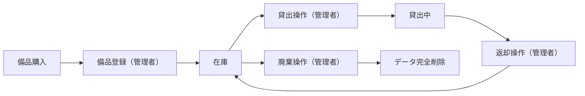
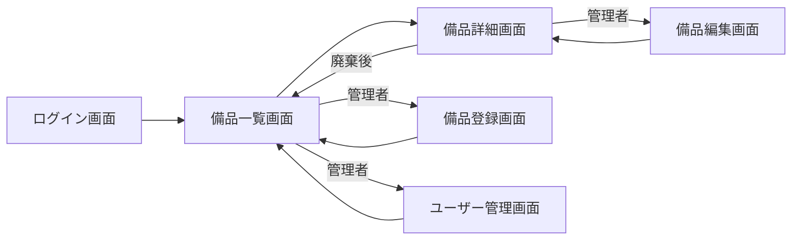
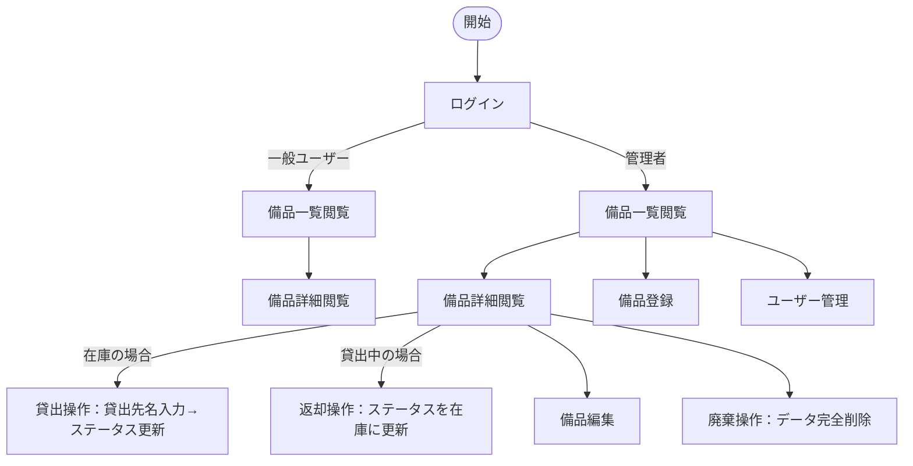

# 備品管理・貸出管理アプリ 要件定義書

---

## 1. 目的・前提

### システムの目的

PC・タブレット等の備品について、所在・在庫状況をリアルタイムで把握し、貸出・返却操作をシステム上で管理することで、Excel運用による状態把握困難と管理煩雑さを解消する。

### 用語集

| 用語 | 定義 |
|---|---|
| 備品 | 管理対象となる会社所有の機器（PC・タブレット等） |
| 在庫 | 貸出されておらず利用可能な状態 |
| 貸出中 | 特定の利用者に貸し出されている状態 |
| 廃棄 | 使用不可となり、データを完全削除した状態 |
| 管理者 | 備品の登録・編集・貸出・返却・削除、およびユーザー管理が可能なロール |
| 一般ユーザー | 備品一覧・詳細の閲覧のみ可能なロール |

### インターフェース種別

GUI（Webブラウザ）

---

## 2. 業務

### 対象業務一覧

| RQ-BZ-ID | 業務名 | 説明 |
|---|---|---|
| RQ-BZ-EQUIPMENT-MANAGEMENT | 備品管理業務 | PC・タブレット等の備品の登録・貸出・返却・廃棄を行う業務 |

### 業務フロー

### 業務の範囲・担当者

| 担当者 | 業務範囲 |
|---|---|
| 管理者 | 備品登録・編集・貸出操作・返却操作・廃棄（削除）・ユーザー管理 |
| 一般ユーザー | 備品一覧・詳細の閲覧のみ |

### システム化による見込み効果

- **Soft Saving**: 備品の所在確認にかかる探索時間の削減
- **Soft Saving**: 貸出状況の確認・管理にかかる手作業時間の削減

### 2-1. 業務課題一覧

| RQ-BK-ID | 対応業務（RQ-BZ-*） | 業務課題 | 現状の問題 | 業務影響 | 解決状態 |
|---|---|---|---|---|---|
| RQ-BK-EQUIPMENT-STATUS-UNKNOWN | RQ-BZ-EQUIPMENT-MANAGEMENT | 備品の所在・在庫状況が不明 | Excelスプレッドシートで管理しているが最新状態の把握が困難 | 必要な備品を探す手間が発生し業務効率が低下する | 備品一覧でリアルタイムに全備品の所在・在庫状況が確認できる |
| RQ-BK-LENDING-MANAGEMENT-BURDEN | RQ-BZ-EQUIPMENT-MANAGEMENT | 貸出・返却管理が煩雑で状態ずれが発生 | Excelや口頭で管理しており、返却漏れや状態更新漏れが発生する | 備品の在庫状況が不正確になり、二重貸出のリスクが生じる | 貸出・返却操作をアプリ上で行い、ステータスを即時更新できる |

---

## 3. 機能要件

### 入力データ

- 管理者が画面から手動入力する（外部連携なし）

### 出力データ

- 備品一覧・詳細情報の画面表示（データエクスポートなし）

### 外部連携

なし

### 機能一覧

| RQ-ID | カテゴリ | 機能名 | 対応業務課題ID（RQ-BK-*） | この機能が無いと何が困るか |
|---|---|---|---|---|
| RQ-FT-LOGIN | 共通 | ログイン | RQ-BK-EQUIPMENT-STATUS-UNKNOWN, RQ-BK-LENDING-MANAGEMENT-BURDEN | 権限のない人が備品を操作できてしまう |
| RQ-FT-LIST-EQUIPMENT | 業務機能 | 備品一覧表示 | RQ-BK-EQUIPMENT-STATUS-UNKNOWN | 備品の全体状況を把握できず、在庫確認が不可能になる |
| RQ-FT-VIEW-EQUIPMENT | 業務機能 | 備品詳細表示 | RQ-BK-EQUIPMENT-STATUS-UNKNOWN, RQ-BK-LENDING-MANAGEMENT-BURDEN | 個別備品の詳細情報（現在の貸出先など）が確認できない |
| RQ-FT-CREATE-EQUIPMENT | 業務機能 | 備品登録 | RQ-BK-EQUIPMENT-STATUS-UNKNOWN | 新規備品をシステムに登録できず管理対象外になる |
| RQ-FT-EDIT-EQUIPMENT | 業務機能 | 備品編集 | RQ-BK-EQUIPMENT-STATUS-UNKNOWN | 備品情報（型番・シリアル番号等）の誤りを修正できない |
| RQ-FT-LEND-EQUIPMENT | 業務機能 | 貸出操作 | RQ-BK-LENDING-MANAGEMENT-BURDEN | 貸出状況がシステムに反映されず在庫状態と実態が乖離する |
| RQ-FT-RETURN-EQUIPMENT | 業務機能 | 返却操作 | RQ-BK-LENDING-MANAGEMENT-BURDEN | 返却されても貸出中のままになり在庫が不正確になる |
| RQ-FT-DELETE-EQUIPMENT | 業務機能 | 備品廃棄（削除） | RQ-BK-EQUIPMENT-STATUS-UNKNOWN | 廃棄済みの備品が一覧に残り続け管理が混乱する |
| RQ-FT-MANAGE-USERS | マスタ管理 | ユーザー管理 | RQ-BK-EQUIPMENT-STATUS-UNKNOWN, RQ-BK-LENDING-MANAGEMENT-BURDEN | ユーザーアカウントの追加・削除ができずアクセス管理が不可能になる |
| RQ-FT-RESET-PASSWORD | マスタ管理 | パスワードリセット | RQ-BK-EQUIPMENT-STATUS-UNKNOWN, RQ-BK-LENDING-MANAGEMENT-BURDEN | ユーザーがパスワードを忘れた際にアクセス不可能のままになる |
| RQ-UI-LOGIN-SCREEN | 画面 | ログイン画面 | RQ-BK-EQUIPMENT-STATUS-UNKNOWN, RQ-BK-LENDING-MANAGEMENT-BURDEN | ログイン導線がなく認証・ロール制御が機能しない |
| RQ-UI-EQUIPMENT-LIST-SCREEN | 画面 | 備品一覧画面 | RQ-BK-EQUIPMENT-STATUS-UNKNOWN | 備品一覧を閲覧する起点がなく全体状況を把握できない |
| RQ-UI-EQUIPMENT-DETAIL-SCREEN | 画面 | 備品詳細画面 | RQ-BK-EQUIPMENT-STATUS-UNKNOWN, RQ-BK-LENDING-MANAGEMENT-BURDEN | 個別備品の詳細確認・貸出・返却操作の起点がなくなる |
| RQ-UI-EQUIPMENT-CREATE-SCREEN | 画面 | 備品登録画面 | RQ-BK-EQUIPMENT-STATUS-UNKNOWN | 備品を新規登録する画面がなく管理開始できない |
| RQ-UI-EQUIPMENT-EDIT-SCREEN | 画面 | 備品編集画面 | RQ-BK-EQUIPMENT-STATUS-UNKNOWN | 登録済み備品の情報を修正できなくなる |
| RQ-UI-USER-MANAGEMENT-SCREEN | 画面 | ユーザー管理画面 | RQ-BK-EQUIPMENT-STATUS-UNKNOWN, RQ-BK-LENDING-MANAGEMENT-BURDEN | ユーザーの追加・削除・パスワードリセットを行う場所がなくなる |

### 全画面仕様

#### ログイン画面（RQ-UI-LOGIN-SCREEN）

| 項目 | 仕様 |
|---|---|
| 対象ロール | 全ユーザー |
| 表示内容 | ユーザーID入力欄、パスワード入力欄、ログインボタン |
| 操作 | ユーザーIDとパスワードを入力してログイン |
| 認証失敗時 | エラーメッセージを表示し再入力を促す |
| 対応業務課題 | RQ-BK-EQUIPMENT-STATUS-UNKNOWN, RQ-BK-LENDING-MANAGEMENT-BURDEN |

#### 備品一覧画面（RQ-UI-EQUIPMENT-LIST-SCREEN）

| 項目 | 仕様 |
|---|---|
| 対象ロール | 全ユーザー |
| 表示内容 | 備品名、型番、シリアル番号、ステータス（在庫・貸出中）、現在の貸出先（貸出中の場合） |
| 表示対象 | 廃棄済み（削除済み）の備品は表示しない。全件表示（ページネーションなし） |
| 管理者向け操作 | 「備品登録」ボタン、「ユーザー管理」ボタン |
| 対応業務課題 | RQ-BK-EQUIPMENT-STATUS-UNKNOWN |

#### 備品詳細画面（RQ-UI-EQUIPMENT-DETAIL-SCREEN）

| 項目 | 仕様 |
|---|---|
| 対象ロール | 全ユーザー（閲覧）、管理者（操作） |
| 表示内容 | 備品名、型番、シリアル番号、ステータス、現在の貸出先（貸出中の場合） |
| 管理者向け操作 | 貸出ボタン（在庫時のみ表示）、返却ボタン（貸出中時のみ表示）、編集ボタン、廃棄（削除）ボタン |
| 貸出操作時 | 貸出先名（テキスト入力）を入力してステータスを「貸出中」に更新 |
| 返却操作時 | 確認後ステータスを「在庫」に更新し貸出先名をクリア |
| 廃棄操作時 | 確認ダイアログ後にデータを完全削除し、備品一覧に遷移 |
| 対応業務課題 | RQ-BK-EQUIPMENT-STATUS-UNKNOWN, RQ-BK-LENDING-MANAGEMENT-BURDEN |

#### 備品登録画面（RQ-UI-EQUIPMENT-CREATE-SCREEN）

| 項目 | 仕様 |
|---|---|
| 対象ロール | 管理者のみ |
| 入力項目 | 備品名（必須）、型番（必須）、シリアル番号（必須・一意） |
| 初期ステータス | 在庫（固定） |
| 対応業務課題 | RQ-BK-EQUIPMENT-STATUS-UNKNOWN |

#### 備品編集画面（RQ-UI-EQUIPMENT-EDIT-SCREEN）

| 項目 | 仕様 |
|---|---|
| 対象ロール | 管理者のみ |
| 編集可能項目 | 備品名、型番、シリアル番号 |
| 編集不可項目 | ステータス（貸出・返却操作で変更する） |
| 対応業務課題 | RQ-BK-EQUIPMENT-STATUS-UNKNOWN |

#### ユーザー管理画面（RQ-UI-USER-MANAGEMENT-SCREEN）

| 項目 | 仕様 |
|---|---|
| 対象ロール | 管理者のみ |
| 表示内容 | ユーザーID、ロール（管理者・一般ユーザー）の一覧 |
| 操作 | ユーザー追加（ユーザーID・初期パスワード・ロール設定）、ユーザー削除、パスワードリセット（管理者が任意の新パスワードを設定） |
| 対応業務課題 | RQ-BK-EQUIPMENT-STATUS-UNKNOWN, RQ-BK-LENDING-MANAGEMENT-BURDEN |

### 画面遷移図

### ユーザー利用フロー

### ログ

ログは必要ないため、ログの内容と保存期間の記述は行わない。

### 監視・アラート

監視・アラートは必要ないため、監視・アラートの内容と対応方法の記述は行わない。

---

## 4. データ

### 内部データ / 外部データの区別

| RQ-ID | 区分 | データ名 | 説明 | 対応業務課題ID（RQ-BK-*） |
|---|---|---|---|---|
| RQ-DT-EQUIPMENT-INTERNAL | 内部データ | 備品データ | アプリ内DBで管理する備品情報 | RQ-BK-EQUIPMENT-STATUS-UNKNOWN, RQ-BK-LENDING-MANAGEMENT-BURDEN |
| RQ-DT-USER-INTERNAL | 内部データ | ユーザーデータ | アプリ内DBで管理するユーザー情報 | RQ-BK-EQUIPMENT-STATUS-UNKNOWN, RQ-BK-LENDING-MANAGEMENT-BURDEN |

### データ保持期間

| RQ-ID | データ名 | 保持期間 | 理由 | 対応業務課題ID（RQ-BK-*） |
|---|---|---|---|---|
| RQ-DT-EQUIPMENT-RETENTION | 備品データ | 廃棄操作（削除）まで無期限 | 廃棄操作時にデータを完全削除するため保持期間なし | RQ-BK-EQUIPMENT-STATUS-UNKNOWN |
| RQ-DT-USER-RETENTION | ユーザーデータ | ユーザー削除操作まで無期限 | 管理者がユーザーを削除するまで保持 | RQ-BK-EQUIPMENT-STATUS-UNKNOWN |

### 外部DB接続先

なし（アプリ内部DBのみ使用）

### DBの必要性

| RQ-ID | 判断 | 理由 | 対応業務課題ID（RQ-BK-*） |
|---|---|---|---|
| RQ-DT-DB-NECESSITY | 必要 | 備品情報・ユーザー情報を永続化し、複数ユーザーがリアルタイムで参照・更新する必要があるため | RQ-BK-EQUIPMENT-STATUS-UNKNOWN, RQ-BK-LENDING-MANAGEMENT-BURDEN |

### 業務エンティティ一覧

| RQ-ID | カテゴリ | 業務エンティティ名 | 対応業務課題ID（RQ-BK-*） | この業務エンティティが無いと何が困るか |
|---|---|---|---|---|
| RQ-DT-EQUIPMENT-ENTITY | 業務エンティティ | 備品 | RQ-BK-EQUIPMENT-STATUS-UNKNOWN, RQ-BK-LENDING-MANAGEMENT-BURDEN | 管理対象の備品情報を記録できず、所在・在庫状況の把握が不可能になる |
| RQ-DT-USER-ENTITY | 業務エンティティ | ユーザー | RQ-BK-EQUIPMENT-STATUS-UNKNOWN, RQ-BK-LENDING-MANAGEMENT-BURDEN | 認証・ロール管理ができず、誰でも管理者操作が可能になる |

#### 備品エンティティの属性

| 属性名 | 型 | 制約 | 説明 |
|---|---|---|---|
| 備品ID | 文字列 | 主キー、システム自動採番 | 備品を一意に識別するID |
| 備品名 | 文字列 | 必須 | 備品の名称（例：MacBook Pro 14インチ） |
| 型番 | 文字列 | 必須 | メーカー型番 |
| シリアル番号 | 文字列 | 必須、一意 | 個体を識別するシリアル番号 |
| ステータス | 列挙型 | 必須 | 在庫・貸出中 の2値（廃棄時はレコード削除） |
| 貸出先名 | 文字列 | 任意 | ステータスが「貸出中」のときの貸出先氏名。在庫時はNULL |

#### ユーザーエンティティの属性

| 属性名 | 型 | 制約 | 説明 |
|---|---|---|---|
| ユーザーID | 文字列 | 主キー、一意 | ログイン時に使用するID |
| パスワードハッシュ | 文字列 | 必須 | ハッシュ化して保存したパスワード |
| ロール | 列挙型 | 必須 | 管理者・一般ユーザー の2値 |

### 初期データ

- 最初の管理者アカウントはデプロイ時にDB直接投入またはシード処理で作成する。アプリ画面からの初期管理者作成機能は持たない。

---

## 4-1. CRUDテーブル

| エンティティ名 | Create | Read（一覧） | Read（詳細） | Update | Delete | 備考 |
|---|---|---|---|---|---|---|
| 備品 | ○ | ○ | ○ | ○ | ○ | Createは管理者のみ。Readは全ユーザー。Update/Deleteは管理者のみ。廃棄＝完全削除 |
| ユーザー | ○ | ○ | × | △ | ○ | 全操作が管理者のみ。Updateはパスワードリセットのみ |

---

## 5. 非機能要件

### 非機能要件一覧

| RQ-ID | カテゴリ | 非機能要件名 | 対応業務課題ID（RQ-BK-*） | この非機能要件が無いと何が困るか |
|---|---|---|---|---|
| RQ-NF-CONCURRENT-USERS | 性能・利用人数 | 同時接続数20人以下を想定 | RQ-BK-EQUIPMENT-STATUS-UNKNOWN, RQ-BK-LENDING-MANAGEMENT-BURDEN | 超過時にシステムが応答不能になり業務停止するリスクがある |
| RQ-NF-RESPONSE-TIME | 性能 | 通常操作（一覧表示・登録・更新）の応答時間3秒以内 | RQ-BK-EQUIPMENT-STATUS-UNKNOWN, RQ-BK-LENDING-MANAGEMENT-BURDEN | 操作のたびに待機が発生し業務効率が悪化する |
| RQ-NF-PASSWORD-HASH | セキュリティ | パスワードをハッシュ化して保存する（平文保存禁止） | RQ-BK-EQUIPMENT-STATUS-UNKNOWN, RQ-BK-LENDING-MANAGEMENT-BURDEN | DB漏洩時にユーザーのパスワードが直接流出する |
| RQ-NF-ROLE-ACCESS | セキュリティ | ロールに応じた画面・操作の制限を必ず適用する | RQ-BK-LENDING-MANAGEMENT-BURDEN | 一般ユーザーが貸出・返却・削除操作を行いデータが破壊される |

---

## 6. テスト用利用シナリオ

| RQ-ID | テスト目的 | 前提条件 | テスト手順 | 期待される結果 | 対応業務課題ID（RQ-BK-*） |
|---|---|---|---|---|---|
| RQ-TS-LOGIN-ADMIN | 管理者が正常にログインできること | 管理者アカウントが登録済み | 1. ログイン画面を開く 2. 管理者IDとパスワードを入力 3. ログインボタンを押す | 備品一覧画面が表示され、備品登録・ユーザー管理ボタンが表示される | RQ-BK-EQUIPMENT-STATUS-UNKNOWN, RQ-BK-LENDING-MANAGEMENT-BURDEN |
| RQ-TS-LOGIN-GENERAL | 一般ユーザーが正常にログインでき、管理者操作ボタンが表示されないこと | 一般ユーザーアカウントが登録済み | 1. ログイン画面を開く 2. 一般ユーザーIDとパスワードを入力 3. ログインボタンを押す | 備品一覧画面が表示されるが、備品登録・ユーザー管理ボタンは表示されない | RQ-BK-EQUIPMENT-STATUS-UNKNOWN |
| RQ-TS-LOGIN-FAIL | 誤ったパスワードでログイン失敗すること | 管理者アカウントが登録済み | 1. ログイン画面を開く 2. 正しいIDと誤ったパスワードを入力 3. ログインボタンを押す | エラーメッセージが表示され、備品一覧画面に遷移しない | RQ-BK-EQUIPMENT-STATUS-UNKNOWN |
| RQ-TS-VIEW-EQUIPMENT-LIST | 全ユーザーが備品一覧を閲覧できること | 備品が複数登録済み（在庫・貸出中が混在） | 1. ログイン後に備品一覧画面を開く | 全備品（廃棄済み除く）が備品名・型番・シリアル番号・ステータス・貸出先名とともに表示される | RQ-BK-EQUIPMENT-STATUS-UNKNOWN |
| RQ-TS-CREATE-EQUIPMENT | 管理者が備品を登録できること | 管理者としてログイン済み | 1. 備品一覧画面で備品登録ボタンを押す 2. 備品名・型番・シリアル番号を入力 3. 登録ボタンを押す | 登録した備品が備品一覧に「在庫」ステータスで表示される | RQ-BK-EQUIPMENT-STATUS-UNKNOWN |
| RQ-TS-LEND-EQUIPMENT | 管理者が在庫備品を貸出操作できること | 管理者としてログイン済み、在庫状態の備品が存在する | 1. 備品詳細画面を開く 2. 貸出ボタンを押す 3. 貸出先名を入力する 4. 確定する | 備品のステータスが「貸出中」に更新され、一覧・詳細に貸出先名が表示される | RQ-BK-LENDING-MANAGEMENT-BURDEN |
| RQ-TS-RETURN-EQUIPMENT | 管理者が貸出中備品を返却操作できること | 管理者としてログイン済み、貸出中状態の備品が存在する | 1. 貸出中備品の詳細画面を開く 2. 返却ボタンを押す 3. 確認ダイアログで確定する | 備品のステータスが「在庫」に更新され、貸出先名が空になる | RQ-BK-LENDING-MANAGEMENT-BURDEN |
| RQ-TS-DELETE-EQUIPMENT | 管理者が備品を廃棄（完全削除）できること | 管理者としてログイン済み、在庫状態の備品が存在する | 1. 備品詳細画面を開く 2. 廃棄ボタンを押す 3. 確認ダイアログで確定する | 備品一覧画面に遷移し、廃棄した備品が一覧から消える | RQ-BK-EQUIPMENT-STATUS-UNKNOWN |
| RQ-TS-GENERAL-USER-NO-OPERATION | 一般ユーザーが管理者操作を実行できないこと | 一般ユーザーとしてログイン済み | 1. 備品詳細画面を開く | 貸出・返却・編集・廃棄の各ボタンが表示されない | RQ-BK-LENDING-MANAGEMENT-BURDEN |
| RQ-TS-MANAGE-USERS | 管理者がユーザーを追加・削除できること | 管理者としてログイン済み | 1. ユーザー管理画面を開く 2. ユーザー追加でID・初期PW・ロールを設定して登録 3. 同じ画面から登録したユーザーを削除する | ユーザー追加後に一覧に表示され、削除後に一覧から消える | RQ-BK-EQUIPMENT-STATUS-UNKNOWN, RQ-BK-LENDING-MANAGEMENT-BURDEN |
| RQ-TS-RESET-PASSWORD | 管理者がユーザーのパスワードをリセットできること | 管理者としてログイン済み、一般ユーザーが存在する | 1. ユーザー管理画面でパスワードリセットを選択 2. 新パスワードを入力して確定 | 対象ユーザーが新パスワードでログインできる | RQ-BK-EQUIPMENT-STATUS-UNKNOWN, RQ-BK-LENDING-MANAGEMENT-BURDEN |

---

## 業務課題と要件の対応表

| RQ-BK-ID | 業務課題 | 対応する要件ID |
|---|---|---|
| RQ-BK-EQUIPMENT-STATUS-UNKNOWN | 備品の所在・在庫状況が不明 | RQ-FT-LOGIN, RQ-FT-LIST-EQUIPMENT, RQ-FT-VIEW-EQUIPMENT, RQ-FT-CREATE-EQUIPMENT, RQ-FT-EDIT-EQUIPMENT, RQ-FT-DELETE-EQUIPMENT, RQ-FT-MANAGE-USERS, RQ-FT-RESET-PASSWORD, RQ-UI-LOGIN-SCREEN, RQ-UI-EQUIPMENT-LIST-SCREEN, RQ-UI-EQUIPMENT-DETAIL-SCREEN, RQ-UI-EQUIPMENT-CREATE-SCREEN, RQ-UI-EQUIPMENT-EDIT-SCREEN, RQ-UI-USER-MANAGEMENT-SCREEN, RQ-DT-EQUIPMENT-INTERNAL, RQ-DT-USER-INTERNAL, RQ-DT-EQUIPMENT-RETENTION, RQ-DT-USER-RETENTION, RQ-DT-DB-NECESSITY, RQ-DT-EQUIPMENT-ENTITY, RQ-DT-USER-ENTITY, RQ-NF-CONCURRENT-USERS, RQ-NF-RESPONSE-TIME, RQ-NF-PASSWORD-HASH, RQ-NF-ROLE-ACCESS, RQ-TS-LOGIN-ADMIN, RQ-TS-LOGIN-GENERAL, RQ-TS-LOGIN-FAIL, RQ-TS-VIEW-EQUIPMENT-LIST, RQ-TS-CREATE-EQUIPMENT, RQ-TS-LEND-EQUIPMENT, RQ-TS-DELETE-EQUIPMENT, RQ-TS-MANAGE-USERS, RQ-TS-RESET-PASSWORD |
| RQ-BK-LENDING-MANAGEMENT-BURDEN | 貸出・返却管理が煩雑で状態ずれが発生 | RQ-FT-LOGIN, RQ-FT-VIEW-EQUIPMENT, RQ-FT-LEND-EQUIPMENT, RQ-FT-RETURN-EQUIPMENT, RQ-FT-MANAGE-USERS, RQ-FT-RESET-PASSWORD, RQ-UI-LOGIN-SCREEN, RQ-UI-EQUIPMENT-DETAIL-SCREEN, RQ-UI-USER-MANAGEMENT-SCREEN, RQ-DT-EQUIPMENT-INTERNAL, RQ-DT-USER-INTERNAL, RQ-DT-DB-NECESSITY, RQ-DT-EQUIPMENT-ENTITY, RQ-DT-USER-ENTITY, RQ-NF-CONCURRENT-USERS, RQ-NF-RESPONSE-TIME, RQ-NF-PASSWORD-HASH, RQ-NF-ROLE-ACCESS, RQ-TS-LOGIN-ADMIN, RQ-TS-LEND-EQUIPMENT, RQ-TS-RETURN-EQUIPMENT, RQ-TS-GENERAL-USER-NO-OPERATION, RQ-TS-MANAGE-USERS, RQ-TS-RESET-PASSWORD |
