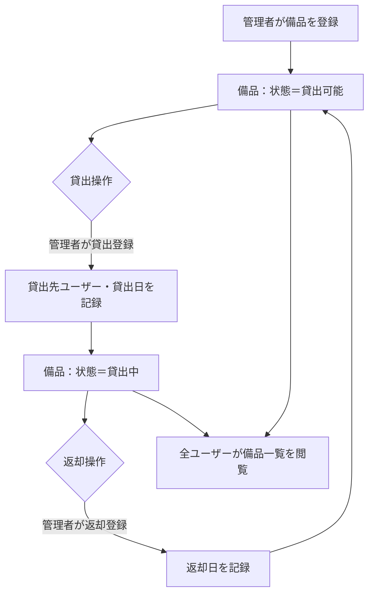
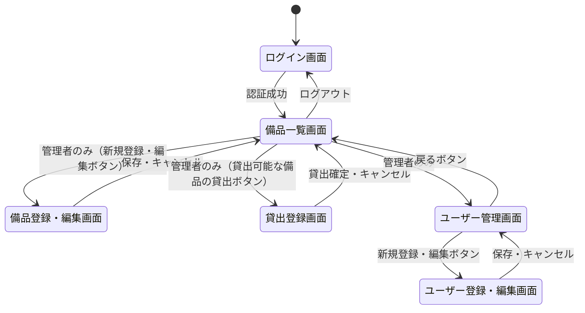
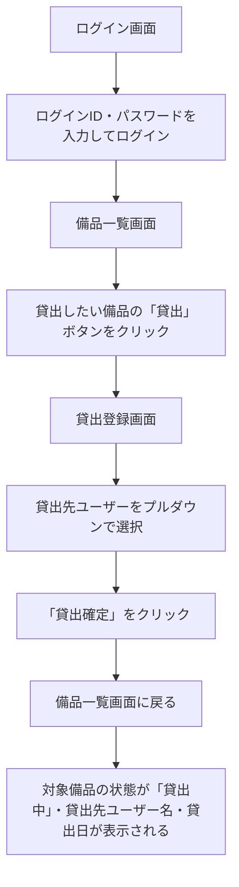
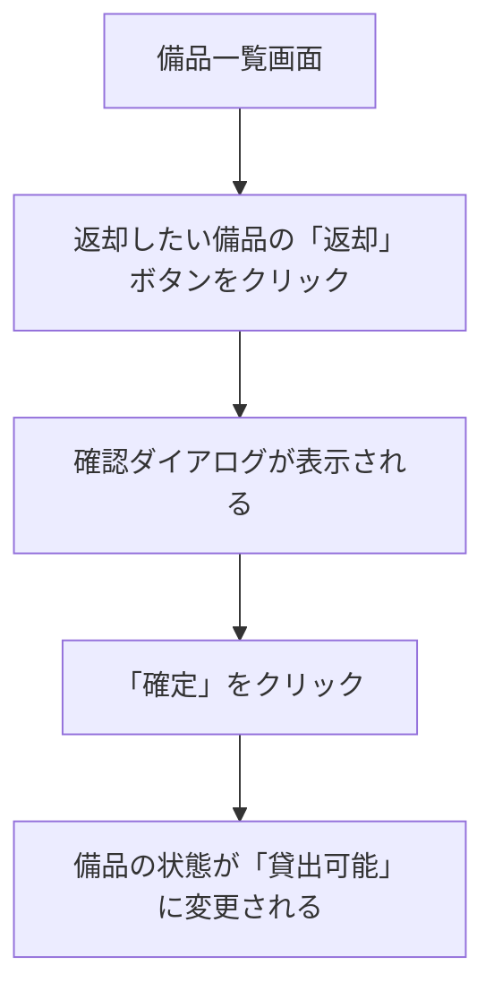
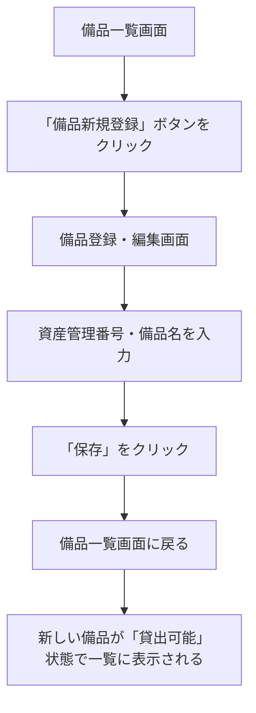
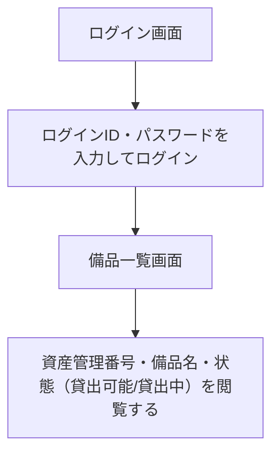

# 備品管理・貸出管理アプリ 要件定義書

## 1. 目的・前提

### 1-1. システムの目的

社内備品の所在と貸出状況を一元管理し、誰がどの備品を持っているかを即座に把握できる Web アプリケーション。担当者ごとのバラバラな台帳管理を廃止し、ブラウザからアクセスできる単一の管理システムに統一する。

### 1-2. 用語集

| 用語 | 定義 |
|---|---|
| 備品 | 社内で管理・貸出対象となる物品（PC、プロジェクター等） |
| 資産管理番号 | 備品を一意に識別するための管理番号。担当者が付与する文字列 |
| ログインID | ユーザーがログイン時に使用する識別子。システム内で一意とする |
| 貸出 | 管理者が備品を特定ユーザーに割り当て、状態を「貸出中」にする操作 |
| 返却 | 管理者が備品の状態を「貸出可能」に戻す操作 |
| 管理者 | 備品・ユーザーの登録・編集・削除・貸出・返却が可能な役割 |
| 一般ユーザー | 備品の状態一覧を閲覧するのみの役割 |

### 1-3. アプリ形態

GUI（Web アプリ）

---

## 2. 業務

### 2-1. 対象業務一覧

| RQ-BZ-ID | 業務名 |
|---|---|
| RQ-BZ-EQUIPMENT-MANAGEMENT | 備品管理業務 |
| RQ-BZ-LOAN-MANAGEMENT | 貸出管理業務 |

### 2-2. 業務フロー

### 2-3. 業務の範囲・担当者

| 業務 | 担当者 |
|---|---|
| 備品の登録・編集・削除 | 管理者 |
| 貸出・返却操作 | 管理者 |
| ユーザーの登録・編集・削除 | 管理者 |
| 備品一覧の閲覧 | 全ユーザー（管理者・一般ユーザー） |

### 2-4. 業務課題・KPI

| 課題 | 現状 | 目標 |
|---|---|---|
| 備品の貸出先不明 | 誰が何を持っているか口頭確認が必要 | システムで即座に確認可能（確認工数ゼロ） |
| 台帳の複数バージョン乱立 | 担当者ごとに台帳ファイルが乱立 | 台帳はシステムに一本化（乱立ゼロ） |

### 2-5. 解決すべき課題と対応方針

- **RQ-BK-UNKNOWN-HOLDER**：備品の貸出先が不明 → システムで貸出先ユーザーと貸出日を記録し、管理者が一覧で即座に確認できるようにする
- **RQ-BK-MULTI-LEDGER**：台帳の複数バージョン乱立 → 全ユーザーが同一の Web アプリを参照することで台帳を一本化する

### 2-6. システム化による見込み経営効果

- **Soft Saving**：備品の所在確認工数の削減（現状：口頭確認5〜10分/回 → 0分/回）
- **Soft Saving**：台帳更新・整合作業の削減（現状：担当者ごとの個別台帳管理 → 自動一元化）

### 2-7. 業務課題一覧

| RQ-BK-ID | 業務課題 | 現状の問題 | 業務影響 | 解決状態 |
|---|---|---|---|---|
| RQ-BK-UNKNOWN-HOLDER | 備品の貸出先が分からない | 誰がどの備品を持っているか記録がない | 備品の所在確認に口頭確認・探索が必要 | 貸出先・貸出日をシステムに記録し即座に確認できる |
| RQ-BK-MULTI-LEDGER | 台帳が担当者ごとに分散管理されている | 担当者がそれぞれ独自の台帳を持ち、複数バージョンが乱立 | どの台帳が最新か判断できず、情報の信頼性が低い | 全員が同一システムを参照し、台帳が一本化される |

---

## 3. 機能要件

### 3-1. 入力データ

- 管理者によるキーボード・フォーム入力（備品情報、ユーザー情報、貸出情報）

### 3-2. 出力データ

- 備品一覧（全ユーザー共通）：資産管理番号、備品名、状態（貸出可能/貸出中）、貸出中の備品には貸出先ユーザー名を表示
- 備品一覧（管理者向け追加表示）：上記に加え、貸出中の備品には貸出日を表示。操作ボタン（貸出・返却・編集・削除・新規登録）を表示

### 3-3. 外部連携

なし

### 3-4. 全画面の仕様と画面遷移

#### 画面一覧

| 画面名 | 対象ユーザー | 概要 |
|---|---|---|
| ログイン画面 | 全員 | ログインID・パスワードを入力してログインする |
| 備品一覧画面 | 全員 | 備品の状態一覧を表示する。管理者には操作ボタンも表示する |
| 備品登録・編集画面 | 管理者のみ | 資産管理番号・備品名を入力して備品を登録・編集する |
| 貸出登録画面 | 管理者のみ | 貸出先ユーザーを選択して貸出を登録する |
| ユーザー管理画面 | 管理者のみ | ユーザー一覧を表示し、登録・編集・削除を行う |
| ユーザー登録・編集画面 | 管理者のみ | ユーザー情報（ユーザー名・ログインID・パスワード・役割）を入力して登録・編集する |

#### 画面遷移図

### 3-5. ユーザー利用フロー

#### 管理者：備品貸出フロー

#### 管理者：備品返却フロー

#### 管理者：備品登録フロー

#### 一般ユーザー：備品状態閲覧フロー

### 3-6. 業務フローとの対応関係

| 業務フローのステップ | 対応機能 |
|---|---|
| 管理者が備品を登録 | RQ-FT-CREATE-EQUIPMENT |
| 管理者が貸出登録 | RQ-FT-LEND-EQUIPMENT |
| 管理者が返却登録 | RQ-FT-RETURN-EQUIPMENT |
| 全ユーザーが備品一覧を閲覧 | RQ-FT-LIST-EQUIPMENT |

### 3-7. ログ

ログは必要ないため、ログの内容と保存期間の記述は行わない。アプリフレームワークの標準エラーログのみを使用する。

### 3-8. 監視・アラート

監視・アラートは必要ないため、監視・アラートの内容と対応方法の記述は行わない。

### 3-9. 機能一覧

| RQ-ID | カテゴリ | 機能名 | 対応業務課題ID | この機能が無いと何が困るか |
|---|---|---|---|---|
| RQ-FT-LOGIN | 共通（認証） | ログイン | RQ-BK-UNKNOWN-HOLDER, RQ-BK-MULTI-LEDGER | 誰でも操作できてしまい、役割による操作制限が機能しない |
| RQ-FT-LOGOUT | 共通（認証） | ログアウト | RQ-BK-UNKNOWN-HOLDER, RQ-BK-MULTI-LEDGER | セッションが残り、他者が継続操作できてしまう |
| RQ-FT-LIST-EQUIPMENT | 業務機能 | 備品一覧表示 | RQ-BK-UNKNOWN-HOLDER, RQ-BK-MULTI-LEDGER | 備品の状態と貸出先を確認できず、業務課題が解決されない |
| RQ-FT-CREATE-EQUIPMENT | マスタ管理 | 備品登録 | RQ-BK-MULTI-LEDGER | 新規備品をシステムに登録できず、台帳が不完全になる |
| RQ-FT-EDIT-EQUIPMENT | マスタ管理 | 備品編集 | RQ-BK-MULTI-LEDGER | 備品名・資産管理番号の誤りを修正できない |
| RQ-FT-DELETE-EQUIPMENT | マスタ管理 | 備品削除 | RQ-BK-MULTI-LEDGER | 廃棄した備品をシステムから削除できず、台帳に不要なデータが残る |
| RQ-FT-LEND-EQUIPMENT | 業務機能 | 備品貸出登録 | RQ-BK-UNKNOWN-HOLDER | 誰がいつ備品を借りたか記録できず、業務課題が解決されない |
| RQ-FT-RETURN-EQUIPMENT | 業務機能 | 備品返却登録 | RQ-BK-UNKNOWN-HOLDER | 返却後も「貸出中」のまま状態が残り、正確な貸出状況を把握できない |
| RQ-FT-CREATE-USER | マスタ管理 | ユーザー登録 | RQ-BK-MULTI-LEDGER | 新しいメンバーをシステムに追加できず、貸出先として選択できない |
| RQ-FT-EDIT-USER | マスタ管理 | ユーザー編集 | RQ-BK-MULTI-LEDGER | ユーザー名・ログインID・パスワード・役割の誤りを修正できない |
| RQ-FT-DELETE-USER | マスタ管理 | ユーザー削除 | RQ-BK-MULTI-LEDGER | 退職者等のアカウントを削除できず、不要なユーザーが残る |

#### 業務制約

- 貸出中の備品は削除不可とする。返却操作後にのみ削除できる
- 貸出中の備品を持つユーザーは削除不可とする。対象備品の返却後にのみ削除できる
- 初期管理者アカウントはシステム初期化時にシードデータとして1件登録する

#### 画面要件一覧

| RQ-ID | カテゴリ | 画面名 | 対応業務課題ID | この画面が無いと何が困るか |
|---|---|---|---|---|
| RQ-UI-LOGIN-SCREEN | 画面 | ログイン画面 | RQ-BK-UNKNOWN-HOLDER, RQ-BK-MULTI-LEDGER | 認証ができず、管理者機能を一般ユーザーから守れない |
| RQ-UI-EQUIPMENT-LIST-SCREEN | 画面 | 備品一覧画面 | RQ-BK-UNKNOWN-HOLDER, RQ-BK-MULTI-LEDGER | 備品の状態と貸出先を一覧で確認できない |
| RQ-UI-EQUIPMENT-FORM-SCREEN | 画面 | 備品登録・編集画面 | RQ-BK-MULTI-LEDGER | 備品データを入力・修正できない |
| RQ-UI-LEND-SCREEN | 画面 | 貸出登録画面 | RQ-BK-UNKNOWN-HOLDER | 貸出先ユーザーを選択して貸出を記録できない |
| RQ-UI-USER-MANAGEMENT-SCREEN | 画面 | ユーザー管理画面 | RQ-BK-MULTI-LEDGER | ユーザーの一覧・登録・編集・削除ができない |
| RQ-UI-USER-FORM-SCREEN | 画面 | ユーザー登録・編集画面 | RQ-BK-MULTI-LEDGER | ユーザー情報の入力・修正ができない |

---

## 4. データ

### 4-1. 内部データ / 外部データ区分

| RQ-DT-ID | 区分 | 内容 | 対応業務課題ID |
|---|---|---|---|
| RQ-DT-INTERNAL-DATA | 内部データ | 備品データ・貸出履歴・ユーザーデータの全てをアプリ内蔵 DB で管理する | RQ-BK-UNKNOWN-HOLDER, RQ-BK-MULTI-LEDGER |

外部データは存在しない。

### 4-2. データ保持期間

| RQ-DT-ID | 対象データ | 保持期間 | 対応業務課題ID |
|---|---|---|---|
| RQ-DT-RETENTION | 全データ（備品・貸出履歴・ユーザー） | 無期限（自動削除なし） | RQ-BK-UNKNOWN-HOLDER, RQ-BK-MULTI-LEDGER |

### 4-3. 外部 DB 接続先と接続方法

なし（アプリ内蔵 DB のみ使用する）

### 4-4. DB の必要性

| RQ-DT-ID | 内容 | 理由 | 対応業務課題ID |
|---|---|---|---|
| RQ-DT-DB-REQUIRED | DB が必要 | 備品の状態・貸出履歴・ユーザー情報を永続化するために必要 | RQ-BK-UNKNOWN-HOLDER, RQ-BK-MULTI-LEDGER |

### 4-5. 業務エンティティ一覧

| RQ-ID | カテゴリ | 業務エンティティ名 | 対応業務課題ID | この業務エンティティが無いと何が困るか |
|---|---|---|---|---|
| RQ-DT-EQUIPMENT-ENTITY | データ | 備品 | RQ-BK-UNKNOWN-HOLDER, RQ-BK-MULTI-LEDGER | 管理対象の備品データが存在せず、システム自体が成立しない |
| RQ-DT-LOAN-ENTITY | データ | 貸出記録 | RQ-BK-UNKNOWN-HOLDER | 誰がいつ備品を借りたか記録できず、業務課題が解決されない |
| RQ-DT-USER-ENTITY | データ | ユーザー | RQ-BK-UNKNOWN-HOLDER, RQ-BK-MULTI-LEDGER | 貸出先を特定できず、ログインによる役割制御もできない |

#### 備品エンティティの属性

| 属性名 | 型 | 必須 | 説明 |
|---|---|---|---|
| 備品ID | 整数（自動採番） | ○ | システム内部の一意識別子 |
| 資産管理番号 | 文字列 | ○ | 担当者が付与する管理番号。システム内で一意とする |
| 備品名 | 文字列 | ○ | 備品の名称 |
| 状態 | 列挙（貸出可能 / 貸出中） | ○ | 現在の貸出状態 |

#### 貸出記録エンティティの属性

| 属性名 | 型 | 必須 | 説明 |
|---|---|---|---|
| 貸出記録ID | 整数（自動採番） | ○ | 一意識別子 |
| 備品ID | 整数 | ○ | 対象備品への参照 |
| 貸出先ユーザーID | 整数 | ○ | 貸出先ユーザーへの参照 |
| 貸出日 | 日付 | ○ | 貸出が登録された日付 |
| 返却日 | 日付 | × | 返却操作が行われた日付。未返却時は NULL |

#### ユーザーエンティティの属性

| 属性名 | 型 | 必須 | 説明 |
|---|---|---|---|
| ユーザーID | 整数（自動採番） | ○ | 一意識別子 |
| ユーザー名 | 文字列 | ○ | 画面に表示される表示名 |
| ログインID | 文字列 | ○ | ログイン時の識別子。システム内で一意とする |
| パスワードハッシュ | 文字列 | ○ | ハッシュ化して保存したパスワード |
| 役割 | 列挙（管理者 / 一般ユーザー） | ○ | アクセス権限を決定する役割 |

### 4-6. CRUD テーブル

| エンティティ名 | Create | Read（一覧） | Read（詳細） | Update | Delete | 備考 |
|---|---|---|---|---|---|---|
| 備品 | ○ | ○ | × | ○ | ○ | 詳細画面は持たず、一覧と登録・編集フォームで管理する。貸出中の備品は削除不可 |
| 貸出記録 | ○ | ○ | × | △ | × | 貸出・返却操作で自動生成・更新する。手動編集・削除は不可。Update は返却日の記録のみ |
| ユーザー | ○ | ○ | × | ○ | ○ | 詳細画面は持たず、一覧と登録・編集フォームで管理する。貸出中の備品を持つユーザーは削除不可 |

---

## 5. 非機能要件

### 5-1. 非機能要件一覧

| RQ-ID | カテゴリ | 非機能要件名 | 対応業務課題ID | この非機能要件が無いと何が困るか |
|---|---|---|---|---|
| RQ-NF-RESPONSE-TIME | 性能 | 全画面の応答時間を3秒以内とする | RQ-BK-UNKNOWN-HOLDER, RQ-BK-MULTI-LEDGER | 操作が重くなり、実務での使用が定着しない |
| RQ-NF-CONCURRENT-USERS | 性能 | 最大10名の同時接続を保証する | RQ-BK-UNKNOWN-HOLDER, RQ-BK-MULTI-LEDGER | チーム全員が同時利用できず、業務に支障が出る |
| RQ-NF-SECURITY-ROLE | セキュリティ | 管理者と一般ユーザーのロールベースアクセス制御を実装する | RQ-BK-UNKNOWN-HOLDER, RQ-BK-MULTI-LEDGER | 一般ユーザーが備品の登録・削除・貸出操作を実行できてしまう |
| RQ-NF-SECURITY-PASSWORD | セキュリティ | パスワードをハッシュ化して DB に保存する | RQ-BK-UNKNOWN-HOLDER, RQ-BK-MULTI-LEDGER | パスワードが平文で保存され、情報漏洩時に全アカウントが危険になる |

---

## 6. テスト用利用シナリオ

| RQ-TS-ID | テスト目的 | 前提条件 | テスト手順 | 期待される結果 | 対応業務課題ID |
|---|---|---|---|---|---|
| RQ-TS-LOGIN-SUCCESS | ログイン正常系 | 管理者アカウントが登録済み | 正しいログインIDとパスワードを入力してログインボタンを押す | 備品一覧画面に遷移する | RQ-BK-UNKNOWN-HOLDER, RQ-BK-MULTI-LEDGER |
| RQ-TS-LOGIN-FAIL | ログイン異常系 | 管理者アカウントが登録済み | 誤ったパスワードを入力してログインボタンを押す | エラーメッセージが表示され、画面が遷移しない | RQ-BK-UNKNOWN-HOLDER, RQ-BK-MULTI-LEDGER |
| RQ-TS-CREATE-EQUIPMENT | 備品登録 | 管理者でログイン済み | 「備品新規登録」ボタンから資産管理番号・備品名を入力して保存する | 備品一覧画面に新しい備品が「貸出可能」状態で表示される | RQ-BK-MULTI-LEDGER |
| RQ-TS-EDIT-EQUIPMENT | 備品編集 | 管理者でログイン済み、備品が1件以上登録済み | 備品一覧から編集ボタンを押し、備品名を変更して保存する | 一覧に変更後の備品名が表示される | RQ-BK-MULTI-LEDGER |
| RQ-TS-DELETE-EQUIPMENT-OK | 貸出可能な備品の削除 | 管理者でログイン済み、「貸出可能」状態の備品が登録済み | 備品一覧から削除ボタンを押して確定する | 対象備品が一覧から消える | RQ-BK-MULTI-LEDGER |
| RQ-TS-DELETE-EQUIPMENT-NG | 貸出中の備品削除不可確認 | 管理者でログイン済み、「貸出中」状態の備品が存在する | 貸出中の備品の削除ボタンを押す | エラーメッセージが表示され、削除されない | RQ-BK-MULTI-LEDGER |
| RQ-TS-LEND-EQUIPMENT | 備品貸出 | 管理者でログイン済み、「貸出可能」状態の備品と一般ユーザーが登録済み | 貸出可能な備品の「貸出」ボタンを押し、貸出先ユーザーを選択して確定する | 備品の状態が「貸出中」に変わり、管理者画面に貸出先ユーザー名・貸出日が表示される | RQ-BK-UNKNOWN-HOLDER |
| RQ-TS-RETURN-EQUIPMENT | 備品返却 | 管理者でログイン済み、「貸出中」状態の備品が存在する | 貸出中の備品の「返却」ボタンを押して確定する | 備品の状態が「貸出可能」に変わる | RQ-BK-UNKNOWN-HOLDER |
| RQ-TS-GENERAL-USER-VIEW | 一般ユーザーの閲覧・操作制限確認 | 一般ユーザーでログイン済み、貸出中の備品が存在する | 備品一覧画面を閲覧し、管理者用ボタン（貸出・返却・編集・削除・新規登録）が表示されないことを確認する | 資産管理番号・備品名・状態・貸出先ユーザー名が表示され、操作ボタンは表示されない | RQ-BK-UNKNOWN-HOLDER, RQ-BK-MULTI-LEDGER |
| RQ-TS-CREATE-USER | ユーザー登録 | 管理者でログイン済み | ユーザー管理画面から新規ユーザーを登録する | 新しいユーザーが一覧に表示される | RQ-BK-MULTI-LEDGER |
| RQ-TS-DELETE-USER-NG | 貸出中備品を持つユーザーの削除不可確認 | 管理者でログイン済み、貸出中の備品を持つユーザーが存在する | 対象ユーザーの削除ボタンを押す | エラーメッセージが表示され、削除されない | RQ-BK-MULTI-LEDGER |
| RQ-TS-DELETE-USER-OK | 貸出中備品のないユーザーの削除 | 管理者でログイン済み、貸出中の備品を持たないユーザーが存在する | 対象ユーザーの削除ボタンを押して確定する | 対象ユーザーが一覧から消える | RQ-BK-MULTI-LEDGER |

---

## 業務課題と要件の対応表

| RQ-BK-ID | 業務課題 | 対応する要件 ID |
|---|---|---|
| RQ-BK-UNKNOWN-HOLDER | 備品の貸出先が分からない | RQ-FT-LOGIN, RQ-FT-LOGOUT, RQ-FT-LIST-EQUIPMENT, RQ-FT-LEND-EQUIPMENT, RQ-FT-RETURN-EQUIPMENT, RQ-UI-LOGIN-SCREEN, RQ-UI-EQUIPMENT-LIST-SCREEN, RQ-UI-LEND-SCREEN, RQ-DT-INTERNAL-DATA, RQ-DT-RETENTION, RQ-DT-DB-REQUIRED, RQ-DT-EQUIPMENT-ENTITY, RQ-DT-LOAN-ENTITY, RQ-DT-USER-ENTITY, RQ-NF-RESPONSE-TIME, RQ-NF-CONCURRENT-USERS, RQ-NF-SECURITY-ROLE, RQ-NF-SECURITY-PASSWORD, RQ-TS-LOGIN-SUCCESS, RQ-TS-LOGIN-FAIL, RQ-TS-LEND-EQUIPMENT, RQ-TS-RETURN-EQUIPMENT, RQ-TS-GENERAL-USER-VIEW |
| RQ-BK-MULTI-LEDGER | 台帳の複数バージョン乱立 | RQ-FT-LOGIN, RQ-FT-LOGOUT, RQ-FT-LIST-EQUIPMENT, RQ-FT-CREATE-EQUIPMENT, RQ-FT-EDIT-EQUIPMENT, RQ-FT-DELETE-EQUIPMENT, RQ-FT-CREATE-USER, RQ-FT-EDIT-USER, RQ-FT-DELETE-USER, RQ-UI-LOGIN-SCREEN, RQ-UI-EQUIPMENT-LIST-SCREEN, RQ-UI-EQUIPMENT-FORM-SCREEN, RQ-UI-USER-MANAGEMENT-SCREEN, RQ-UI-USER-FORM-SCREEN, RQ-DT-INTERNAL-DATA, RQ-DT-RETENTION, RQ-DT-DB-REQUIRED, RQ-DT-EQUIPMENT-ENTITY, RQ-DT-LOAN-ENTITY, RQ-DT-USER-ENTITY, RQ-NF-RESPONSE-TIME, RQ-NF-CONCURRENT-USERS, RQ-NF-SECURITY-ROLE, RQ-NF-SECURITY-PASSWORD, RQ-TS-LOGIN-SUCCESS, RQ-TS-LOGIN-FAIL, RQ-TS-CREATE-EQUIPMENT, RQ-TS-EDIT-EQUIPMENT, RQ-TS-DELETE-EQUIPMENT-OK, RQ-TS-DELETE-EQUIPMENT-NG, RQ-TS-GENERAL-USER-VIEW, RQ-TS-CREATE-USER, RQ-TS-DELETE-USER-NG, RQ-TS-DELETE-USER-OK |
