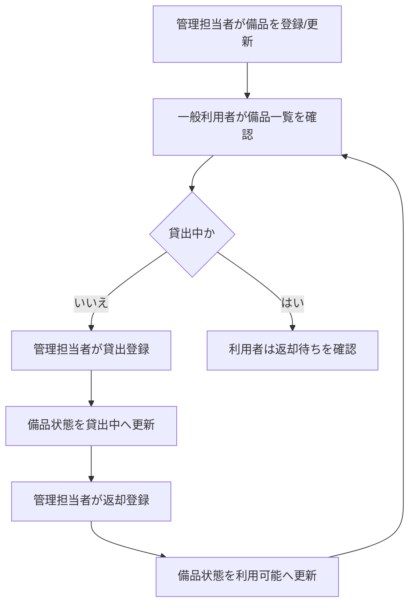
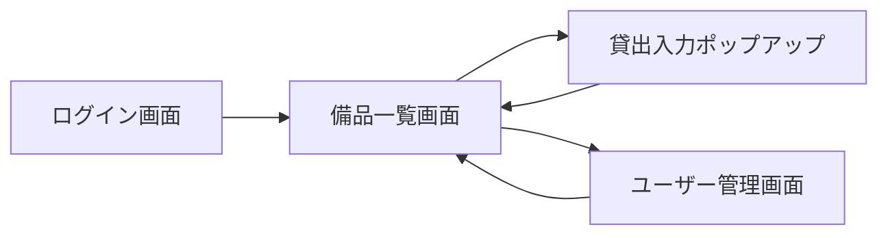
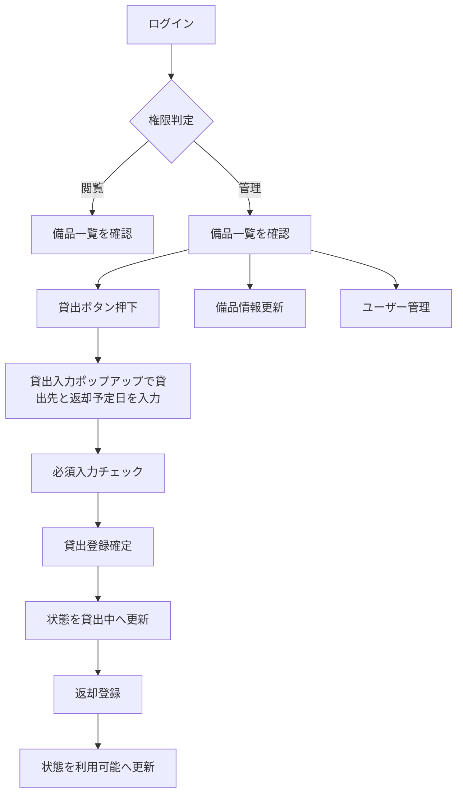

# 備品管理システム 要件定義書

## 1. 目的・前提

### 1-1. システムの目的
本システムの目的は、備品の所在と貸出状態を一元管理し、在庫の所在・数量の不一致を削減することである。

### 1-2. 用語集

| 用語 | 業務上の意味 | 本案件での使用範囲 | 同義語/類義語 |
|---|---|---|---|
| 備品 | 会社が保有し、貸出対象となる物品 | 登録、貸出、返却、一覧表示 | 資産、物品 |
| 管理担当者 | 総務部門で備品台帳と貸出返却を更新する担当者 | 更新操作全般 | 総務担当 |
| 一般利用者 | 備品の貸出状況を閲覧する利用者 | 閲覧操作のみ | 社員、利用者 |
| 貸出状態 | 備品が利用可能か貸出中かを示す状態 | 一覧表示、貸出返却処理 | 在庫状態 |
| ユーザー管理 | ログインアカウント（氏名、ログインID、パスワード、権限、有効/無効）を管理する業務 | 管理担当者向け管理機能 | アカウント管理 |

### 1-3. 操作形態
- GUI（画面操作）を採用する。

## 2. 業務

### 2-1. 対象業務一覧

| RQ-ID | 業務名 | 内容 | 対応業務課題ID（RQ-BK-*） |
|---|---|---|---|
| RQ-BZ-ASSET-MANAGEMENT | 備品管理業務 | 備品台帳管理、貸出、返却、貸出状態の照会を行う | RQ-BK-INVENTORY-MISMATCH |

### 2-2. 業務フロー

### 2-3. 業務の範囲・担当者
- 管理担当者: 備品マスタ更新、貸出登録、返却登録、ユーザーアカウント管理を担当する。
- 一般利用者: 備品一覧で貸出中かどうかと貸出中の利用者名を確認する。

### 2-4. 業務課題・KPI

| RQ-BK-ID | 業務課題 | 現状の問題 | 業務影響 | 解決状態 |
|---|---|---|---|---|
| RQ-BK-INVENTORY-MISMATCH | 備品の所在・数量不一致 | 台帳更新の遅れで実在庫との差異が発生する | 所在確認に時間がかかり、貸出可否判断が遅れる | 備品状態が常に最新化され、所在確認時間を1分以内に短縮する |

KPI目標（導入後3か月）:
- 棚卸差異率: 10% から 2% 以下
- 備品所在確認時間: 10分 から 1分以内

### 2-5. 解決すべき課題と対応方針
- 課題: 備品状態の更新遅れ。
- 方針: 管理担当者が貸出・返却をシステムで即時登録し、一覧へ即時反映する。

### 2-6. システム化による見込み経営効果
- Hard Saving: 備品探索の工数削減（所在確認時間短縮による直接工数削減）。
- Soft Saving: 問い合わせ対応時間の削減、貸出可否判断の迅速化。
- NWC: 本案件では対象外（調達在庫最適化機能を含めないため）。
- Cost Avoidance: 重複購入の抑制（貸出中可視化で不要購入を回避）。
- TCO Savings: 手作業台帳運用の継続コスト低減。

### 2-7. 業務課題と要件の対応表

| RQ-BK-ID | 対応要件ID（RQ-*） |
|---|---|
| RQ-BK-INVENTORY-MISMATCH | RQ-FT-MANAGE-ASSET-MASTER, RQ-FT-REGISTER-LOAN, RQ-FT-REGISTER-RETURN, RQ-FT-VIEW-ASSET-STATUS, RQ-FT-MANAGE-USER-ACCOUNT, RQ-FT-AUTHENTICATE-USER, RQ-UI-LOGIN-SCREEN, RQ-UI-ASSET-LIST-SCREEN, RQ-UI-LOAN-ENTRY-POPUP, RQ-UI-USER-MANAGEMENT-SCREEN, RQ-DT-INTERNAL-EXTERNAL-DATA-BOUNDARY, RQ-DT-DATA-RETENTION-POLICY, RQ-DT-EXTERNAL-DB-CONNECTION-NONE, RQ-DT-DB-NECESSITY, RQ-DT-ASSET-ENTITY, RQ-DT-USER-ACCOUNT-ENTITY, RQ-DT-LOAN-STATUS-ENTITY, RQ-NF-RESPONSE-TIME-3S, RQ-NF-CONCURRENT-USERS-20, RQ-NF-LOW-SECURITY-POLICY, RQ-TS-VERIFY-LOGIN-ROLE-CONTROL, RQ-TS-VERIFY-LOAN-FLOW, RQ-TS-VERIFY-RETURN-FLOW, RQ-TS-VERIFY-STATUS-VISIBILITY |

## 3. 機能要件

### 3-1. 入力データ（人手入力 / 外部連携）
- 人手入力:
  - 備品情報（備品名、管理番号、保管場所、状態）
  - 貸出情報（貸出先、貸出日、返却予定日）
  - 返却情報（返却日、返却時状態）
  - ユーザー情報（氏名、ログインID、パスワード、権限、有効/無効）
- 外部連携入力: なし

### 3-2. 出力データ
- 備品一覧（利用可能/貸出中、貸出中利用者名）
- 管理担当者向け更新結果（登録成功/失敗）

### 3-3. 外部連携
- 外部システム連携は行わない。

### 3-4. 画面仕様（GUI）

#### RQ-UI-LOGIN-SCREEN（対応業務課題ID: RQ-BK-INVENTORY-MISMATCH）
- 画面の目的: 利用者の認証と権限判定を行う。
- 主要要素: ログインID入力欄、パスワード入力欄、ログインボタン、エラーメッセージ領域。
- 入力項目: ログインID、パスワード。
- 表示項目: システム名、ログイン案内、認証結果。
- エラー時の見え方: 認証失敗時に画面上部へ「IDまたはパスワードが正しくない」を表示し、入力欄を保持する。

#### RQ-UI-ASSET-LIST-SCREEN（対応業務課題ID: RQ-BK-INVENTORY-MISMATCH）
- 画面の目的: 備品の現在状態を一覧表示し、管理担当者が貸出/返却/マスタ更新を実行する。
- 主要要素: 検索欄、備品一覧テーブル、貸出ボタン、返却ボタン、編集ボタン。
- 入力項目: 検索条件、返却日、備品属性更新値。
- 表示項目: 備品名、管理番号、保管場所、状態、貸出中利用者名。
- エラー時の見え方: 必須入力不足や不正日付時に対象入力欄直下へエラー表示し、保存を中止する。

#### RQ-UI-LOAN-ENTRY-POPUP（対応業務課題ID: RQ-BK-INVENTORY-MISMATCH）
- 画面の目的: 備品一覧画面の貸出ボタン押下時に、貸出登録に必要な情報を入力させる。
- 主要要素: 貸出先入力欄、返却予定日入力欄、確定ボタン、キャンセルボタン、エラーメッセージ領域。
- 入力項目: 貸出先、返却予定日。
- 表示項目: 対象備品名、管理番号。
- エラー時の見え方: 貸出先未入力または返却予定日未入力の場合、ポップアップ内に必須エラーを表示し、確定処理を中止する。

#### RQ-UI-USER-MANAGEMENT-SCREEN（対応業務課題ID: RQ-BK-INVENTORY-MISMATCH）
- 画面の目的: ログインアカウントを管理する。
- 主要要素: ユーザー一覧、登録フォーム、更新ボタン、有効/無効切替。
- 入力項目: 氏名、ログインID、パスワード、権限、有効/無効。
- 表示項目: ユーザー一覧、権限、有効状態。
- エラー時の見え方: 重複ログインIDや必須入力不足をフォーム上に表示し、確定を中止する。

### 3-5. 画面遷移図

### 3-6. 全機能のユーザー利用フロー

### 3-7. 業務フローとの対応関係
- 管理担当者の更新操作（貸出・返却・マスタ更新）は業務フローの状態更新ステップに対応する。
- 一般利用者の一覧閲覧は業務フローの貸出可否確認ステップに対応する。

### 3-8. ログの要否・内容・保存期間
- ログは必要ないため、ログの内容と保存期間の記述は行わない。

### 3-9. 監視・アラートの要否・内容・対応方法
- 監視・アラートは必要ないため、監視・アラートの内容と対応方法の記述は行わない。

### 3-10. 機能一覧

| RQ-ID | カテゴリ | 機能名 | 対応業務課題ID（RQ-BK-*） | この機能が無いと何が困るか |
|---|---|---|---|---|
| RQ-FT-AUTHENTICATE-USER | RQ-FT | 利用者認証 | RQ-BK-INVENTORY-MISMATCH | 更新権限を管理担当者に限定できず、台帳の正確性が崩れる |
| RQ-FT-MANAGE-ASSET-MASTER | RQ-FT | 備品マスタ管理 | RQ-BK-INVENTORY-MISMATCH | 備品属性が古いままとなり、所在確認の前提が崩れる |
| RQ-FT-REGISTER-LOAN | RQ-FT | 貸出登録 | RQ-BK-INVENTORY-MISMATCH | 貸出中備品を追跡できず、所在不明が増加する |
| RQ-FT-REGISTER-RETURN | RQ-FT | 返却登録 | RQ-BK-INVENTORY-MISMATCH | 利用可能状態へ戻らず、在庫情報が不正確になる |
| RQ-FT-VIEW-ASSET-STATUS | RQ-FT | 備品一覧閲覧 | RQ-BK-INVENTORY-MISMATCH | 一般利用者が貸出状況を確認できず、問い合わせが増加する |
| RQ-FT-MANAGE-USER-ACCOUNT | RQ-FT | ユーザーアカウント管理 | RQ-BK-INVENTORY-MISMATCH | 権限運用が維持できず、更新責任の分離ができない |
| RQ-UI-LOGIN-SCREEN | RQ-UI | ログイン画面 | RQ-BK-INVENTORY-MISMATCH | 利用者認証を実施できず権限制御が成立しない |
| RQ-UI-ASSET-LIST-SCREEN | RQ-UI | 備品一覧統合画面 | RQ-BK-INVENTORY-MISMATCH | 一覧確認と更新導線が分断され、更新遅れが発生する |
| RQ-UI-LOAN-ENTRY-POPUP | RQ-UI | 貸出入力ポップアップ | RQ-BK-INVENTORY-MISMATCH | 貸出先と返却予定日の必須入力を強制できず、貸出情報が欠落する |
| RQ-UI-USER-MANAGEMENT-SCREEN | RQ-UI | ユーザー管理画面 | RQ-BK-INVENTORY-MISMATCH | ログイン運用の継続更新ができない |

## 4. データ

### 4-1. 内部データ / 外部データの区別
- RQ-DT-INTERNAL-EXTERNAL-DATA-BOUNDARY（対応業務課題ID: RQ-BK-INVENTORY-MISMATCH）
  - 内部データ: 備品情報、ユーザーアカウント情報、現在の貸出状態。
  - 外部データ: なし。

### 4-2. データ保持期間
- RQ-DT-DATA-RETENTION-POLICY（対応業務課題ID: RQ-BK-INVENTORY-MISMATCH）
  - 備品情報、ユーザーアカウント情報、現在の貸出状態のみ保持する。
  - 返却済み履歴は保持しない。

### 4-3. 外部DB接続先と接続方法
- RQ-DT-EXTERNAL-DB-CONNECTION-NONE（対応業務課題ID: RQ-BK-INVENTORY-MISMATCH）
  - 外部DBへの接続は行わない。

### 4-4. DB必要性の有無と理由
- RQ-DT-DB-NECESSITY（対応業務課題ID: RQ-BK-INVENTORY-MISMATCH）
  - システム内部DBを必須とする。
  - 理由: 同時利用時の更新整合性と状態検索性能を担保するため。

### 4-5. 業務エンティティ一覧

| RQ-ID | カテゴリ | 業務エンティティ名 | 対応業務課題ID（RQ-BK-*） | この業務エンティティが無いと何が困るか |
|---|---|---|---|---|
| RQ-DT-ASSET-ENTITY | RQ-DT | 備品エンティティ | RQ-BK-INVENTORY-MISMATCH | 何を管理対象にするか定義できない |
| RQ-DT-USER-ACCOUNT-ENTITY | RQ-DT | ユーザーアカウントエンティティ | RQ-BK-INVENTORY-MISMATCH | 認証と権限制御を運用できない |
| RQ-DT-LOAN-STATUS-ENTITY | RQ-DT | 貸出状態エンティティ | RQ-BK-INVENTORY-MISMATCH | 現在の貸出中/利用可能を判定できない |

## 4-1. CRUDテーブル

| エンティティ名 | Create | Read（一覧） | Read（詳細） | Update | Delete | 備考 |
|---|---|---|---|---|---|---|
| 備品エンティティ | ○ | ○ | ○ | ○ | × | 削除は行わず有効/無効で管理 |
| ユーザーアカウントエンティティ | ○ | ○ | ○ | ○ | × | 削除は行わず有効/無効で管理 |
| 貸出状態エンティティ | ○ | ○ | ○ | ○ | × | 返却時は状態更新で対応 |

## 5. 非機能要件

### 5-1. 非機能要件一覧

| RQ-ID | カテゴリ | 非機能要件名 | 対応業務課題ID（RQ-BK-*） | この非機能要件が無いと何が困るか |
|---|---|---|---|---|
| RQ-NF-RESPONSE-TIME-3S | RQ-NF | 応答時間は通常操作3秒以内 | RQ-BK-INVENTORY-MISMATCH | 現場での所在確認が滞る |
| RQ-NF-CONCURRENT-USERS-20 | RQ-NF | 同時利用人数20人 | RQ-BK-INVENTORY-MISMATCH | 同時利用時に更新待ちで運用が停滞する |
| RQ-NF-LOW-SECURITY-POLICY | RQ-NF | ロックなし・自動ログアウトなし | RQ-BK-INVENTORY-MISMATCH | 社内軽量運用方針に合わず運用負荷が増える |

## 6. テスト用利用シナリオ

| RQ-ID | テスト目的 | 前提条件 | テスト手順 | 期待される結果 | 対応業務課題ID（RQ-BK-*） |
|---|---|---|---|---|---|
| RQ-TS-VERIFY-LOGIN-ROLE-CONTROL | 管理担当者と一般利用者の権限制御を確認する | 管理担当者アカウントと一般利用者アカウントが登録済み | 管理担当者でログインして更新操作可否を確認し、一般利用者でログインして閲覧のみ可否を確認する | 管理担当者は更新可能、一般利用者は閲覧のみ可能 | RQ-BK-INVENTORY-MISMATCH |
| RQ-TS-VERIFY-LOAN-FLOW | 貸出登録で状態が貸出中に更新されることを確認する | 利用可能状態の備品が1件存在する | 管理担当者で該当備品の貸出ボタンを押下し、ポップアップで貸出先と返却予定日を入力して確定する | 貸出先と返却予定日が未入力の場合はエラー表示で確定不可となり、入力後は状態が貸出中となり貸出中利用者名が表示される | RQ-BK-INVENTORY-MISMATCH |
| RQ-TS-VERIFY-RETURN-FLOW | 返却登録で状態が利用可能に戻ることを確認する | 貸出中状態の備品が1件存在する | 管理担当者で該当備品に返却登録を実行する | 備品一覧で状態が利用可能に更新される | RQ-BK-INVENTORY-MISMATCH |
| RQ-TS-VERIFY-STATUS-VISIBILITY | 一般利用者が貸出状態を確認できることを確認する | 複数備品に利用可能と貸出中の状態が混在している | 一般利用者でログインし一覧を表示する | 各備品の状態と貸出中利用者名が確認できる | RQ-BK-INVENTORY-MISMATCH |

## 7. 要件網羅性チェック結果

### 7-1. 業務エンティティ列挙
- 備品エンティティ、ユーザーアカウントエンティティ、貸出状態エンティティを列挙済み。

### 7-2. エンティティ表の作成
- 業務エンティティ一覧およびCRUDテーブルを作成済み。

### 7-3. マスタ該当エンティティ管理機能
- 備品エンティティ、ユーザーアカウントエンティティに管理機能を定義済み。

### 7-4. 機能カテゴリ網羅
- 業務機能: 定義済み。
- マスタ管理: 定義済み。
- 共通（認証・認可）: 定義済み。
- 運用: ログ/監視不要と明示済み。
- 外部連携: 連携なしと定義済み。

### 7-5. 状態遷移定義
- 利用可能 → 貸出中 → 利用可能 の遷移を業務フローと利用フローで定義済み。

### 7-6. 機能と画面・ユーザーフロー対応
- 機能一覧、画面仕様、画面遷移図、ユーザーフローで対応を検証済み。

### 7-7. 削除可能要件の列挙と削除実施
削除候補として検討し、削除済み:
- 返却遅延通知機能
- 棚卸差異分析機能
- 外部システム連携
- 操作履歴ログ機能
- 監視・アラート機能

削除後の成立性:
- 備品の所在・貸出状態を最新化する目的は維持される。

### 7-8. 最小要件確認
- 残存要件は業務課題 RQ-BK-INVENTORY-MISMATCH を解決する最小構成である。

### 7-9. ID付与確認
- 全要件項目に RQ-* ID を付与済み。

### 7-10. BK対応確認
- 全ての非 RQ-BK 要件が RQ-BK-INVENTORY-MISMATCH に紐づく。
- RQ-BK-INVENTORY-MISMATCH に対応要件が複数存在する。
