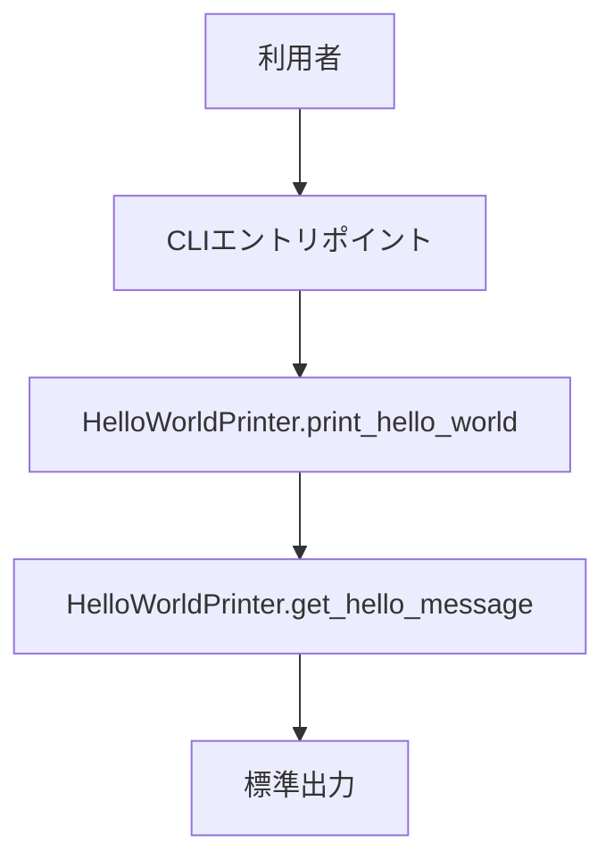
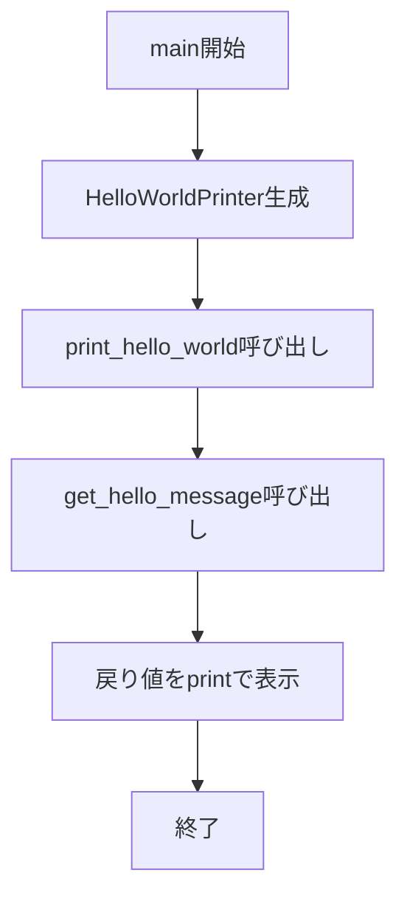
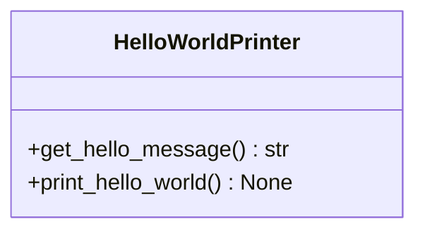
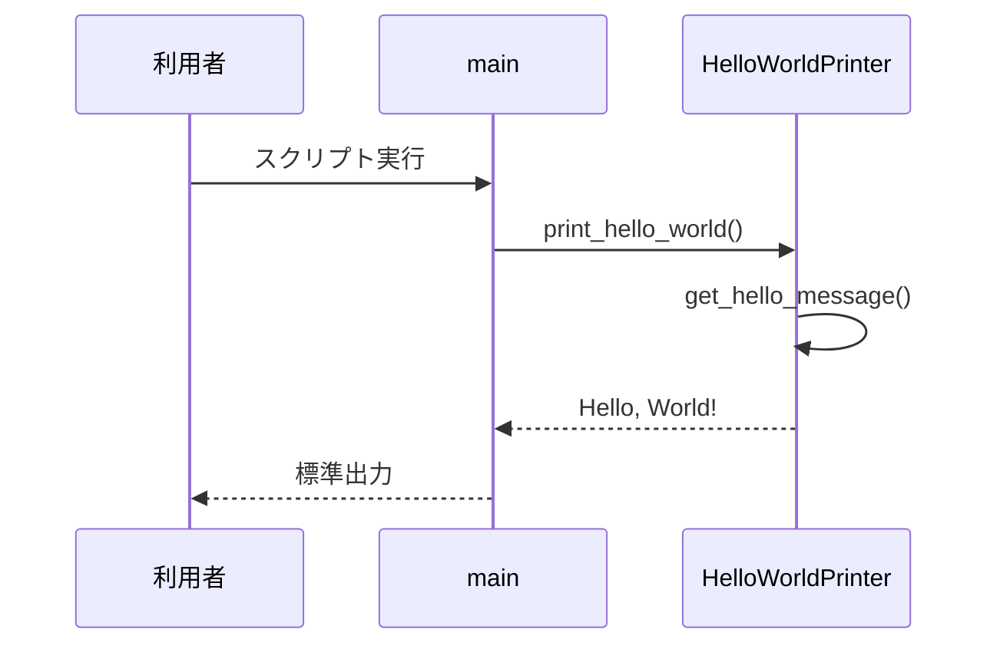

# 詳細設計書

## 1. 言語・フレームワーク

| 設計ID | 項目 | 選定結果 | 選定理由 |
|---|---|---|---|
| DS-MD-HELLO-MODULE-FT-PRINT-HELLO-WORLD | 言語 | Python | 最小構成でのCUI実行と可読性を両立できるため。 |
| DS-IF-CLI-ENTRY-UI-CLI-EXECUTION | フレームワーク | なし | 固定文字列出力のみで外部FWが不要なため。 |

## 2. システム構成

### 2-1. コンポーネント一覧

| 設計ID | コンポーネント名 | 役割 | 対応要件ID |
|---|---|---|---|
| DS-MD-HELLO-MODULE-FT-PRINT-HELLO-WORLD | Helloモジュール | 出力処理全体を保持する。 | RQ-FT-PRINT-HELLO-WORLD |
| DS-CL-HELLO-WORLD-PRINTER-FT-PRINT-HELLO-WORLD | HelloWorldPrinterクラス | 文字列取得と表示処理の責務を分離する。 | RQ-FT-GET-HELLO-MESSAGE, RQ-FT-PRINT-HELLO-WORLD |

### 2-2. システム全体構成図（mermaid）

### 2-3. 各コンポーネントの役割と機能

| 設計ID | 役割 | 機能 |
|---|---|---|
| DS-MD-HELLO-MODULE-FT-PRINT-HELLO-WORLD | 実行制御 | クラス生成と表示メソッド起動を行う。 |
| DS-CL-HELLO-WORLD-PRINTER-FT-PRINT-HELLO-WORLD | 出力制御 | 表示文字列取得と標準出力実行を行う。 |

### 2-4. コンポーネント間インターフェースとデータフロー

| 設計ID | 送信元 | 送信先 | データ |
|---|---|---|---|
| DS-IF-CLI-ENTRY-UI-CLI-EXECUTION | CLIエントリ | print_hello_world | メソッド呼び出し |
| DS-IF-GET-MESSAGE-FT-GET-HELLO-MESSAGE | print_hello_world | get_hello_message | 文字列取得要求 |

### 2-5. ネットワーク構成図（mermaid）

## 3. データベース設計

### 3-1. DB必須性判定

| 設計ID | 判定 | 理由 |
|---|---|---|
| DS-SC-NO-PERSISTENCE-DT-DB-NOT-REQUIRED | 不要 | 固定文字列をメモリ上で扱うのみで永続化不要のため。 |

DB は必須ではないため、DB 設計は行わない。

### 3-2. テーブル設計

該当なし。

### 3-3. リレーション図（mermaid）

## 4. アーキテクチャ設計

### 4-1. 外部設計

#### 4-1-1. UI設計（CUI）

| 設計ID | コマンド | 引数 | 動作 |
|---|---|---|---|
| DS-IF-CLI-ENTRY-UI-CLI-EXECUTION | Pythonスクリプト実行 | なし | HelloWorldPrinter を生成して print_hello_world を実行する。 |

#### 4-1-2. 外部システム連携

| 設計ID | 連携有無 | 内容 |
|---|---|---|
| DS-IF-NO-EXTERNAL-CONNECTOR-EX-NO-EXTERNAL-INTEGRATION | なし | external 配下の参照・接続は行わない。 |

#### 4-1-3. 外部DB連携

| 設計ID | 連携有無 | 内容 |
|---|---|---|
| DS-IF-NO-EXTERNAL-DB-DT-NO-EXTERNAL-DB | なし | 外部DB接続は実施しない。 |

### 4-2. 内部設計

#### 4-2-1. 処理フロー図（mermaid）

#### 4-2-2. 各処理の役割と機能

| 設計ID | 処理名 | 役割 | 機能 |
|---|---|---|---|
| DS-FN-GET-HELLO-MESSAGE-FT-GET-HELLO-MESSAGE | get_hello_message | 文字列生成 | 固定文字列を返す。 |
| DS-FN-PRINT-HELLO-WORLD-FT-PRINT-HELLO-WORLD | print_hello_world | 表示実行 | 取得文字列を標準出力へ表示する。 |

#### 4-2-3. バッチ設計

| 設計ID | 判定 | 内容 |
|---|---|---|
| DS-BT-NO-BATCH-OP-NO-APPLICATION-LOG | 不要 | バッチ処理は存在しない。 |

## 5. クラス設計

### 5-1. 全クラス一覧と役割

| 設計ID | クラス名 | 役割 | S | O | L | I | D |
|---|---|---|---|---|---|---|---|
| DS-CL-HELLO-WORLD-PRINTER-FT-PRINT-HELLO-WORLD | HelloWorldPrinter | 文字列取得と表示処理の提供 | ○ | ○ | ○ | ○ | ○ |

### 5-2. クラスの責務・主要属性・主要メソッド

| 設計ID | クラス名 | 責務 | 主要属性 | 主要メソッド |
|---|---|---|---|---|
| DS-CL-HELLO-WORLD-PRINTER-FT-PRINT-HELLO-WORLD | HelloWorldPrinter | 表示用文字列の取得と表示 | なし | DS-FN-GET-HELLO-MESSAGE-FT-GET-HELLO-MESSAGE, DS-FN-PRINT-HELLO-WORLD-FT-PRINT-HELLO-WORLD |

### 5-3. クラス図（mermaid）

### 5-4. システム内メッセージ一覧と役割

| 設計ID | メッセージ | 役割 |
|---|---|---|
| DS-IF-GET-MESSAGE-FT-GET-HELLO-MESSAGE | get_hello_message 呼び出し | 表示対象文字列を取得する。 |
| DS-IF-PRINT-MESSAGE-FT-PRINT-HELLO-WORLD | print 呼び出し | 標準出力へ文字列を表示する。 |

### 5-5. メッセージフロー図（mermaid）

## 6. その他設計

### 6-1. エラーハンドリング設計

| 設計ID | 想定エラー | 対応 |
|---|---|---|
| DS-FN-PRINT-HELLO-WORLD-FT-PRINT-HELLO-WORLD | 標準出力失敗（稀） | 例外を伝播し、実行失敗として終了する。 |

### 6-2. セキュリティ設計

| 設計ID | 項目 | 内容 |
|---|---|---|
| DS-IF-STATIC-OUTPUT-NF-NO-SECRET-OUTPUT | 出力制御 | 固定文字列のみを扱い、機密情報を出力しない。 |

## 7. コード設計

### 7-1. ディレクトリ構成（AA）

- docs
- src

### 7-2. ファイル一覧・役割・含まれるクラス

| 設計ID | ディレクトリ | ファイル名 | 役割 | 含まれるクラス |
|---|---|---|---|---|
| DS-MD-HELLO-MODULE-FT-PRINT-HELLO-WORLD | src | hello.py | CUI実行と表示処理を提供する | DS-CL-HELLO-WORLD-PRINTER-FT-PRINT-HELLO-WORLD |

### 7-3. コーディング規約

| 設計ID | 項目 | 規約 |
|---|---|---|
| DS-MD-HELLO-MODULE-FT-PRINT-HELLO-WORLD | Python規約 | PEP8準拠、型ヒント必須。 |

## 8. テスト設計

### 8-1. テスト種別と内容

| 設計ID | テスト種別 | 内容 |
|---|---|---|
| DS-FN-GET-HELLO-MESSAGE-FT-GET-HELLO-MESSAGE | 単体テスト | get_hello_message の戻り値検証 |
| DS-FN-PRINT-HELLO-WORLD-FT-PRINT-HELLO-WORLD | 単体テスト | print_hello_world の出力検証 |
| DS-MD-HELLO-MODULE-FT-PRINT-HELLO-WORLD | 結合テスト | main から表示までの一連動作検証 |
| DS-IF-CLI-ENTRY-UI-CLI-EXECUTION | 総合テスト | CUI実行で期待文字列が表示されることを検証 |
| DS-IF-CLI-ENTRY-UI-CLI-EXECUTION | e2eテスト | 利用者視点での実行確認 |

### 8-2. 各テストの目的と方法

| 設計ID | 目的 | 方法 |
|---|---|---|
| DS-FN-GET-HELLO-MESSAGE-FT-GET-HELLO-MESSAGE | 固定文字列取得保証 | 戻り値比較 |
| DS-FN-PRINT-HELLO-WORLD-FT-PRINT-HELLO-WORLD | 出力保証 | 標準出力キャプチャ |

### 8-3. 実装すべき全テストケース

| 設計ID | 区分 | テストケース |
|---|---|---|
| DS-FN-GET-HELLO-MESSAGE-FT-GET-HELLO-MESSAGE | 単体 | 戻り値が Hello, World! である |
| DS-FN-PRINT-HELLO-WORLD-FT-PRINT-HELLO-WORLD | 単体 | print_hello_world が1回出力する |
| DS-MD-HELLO-MODULE-FT-PRINT-HELLO-WORLD | 結合 | クラス生成から出力まで成功する |
| DS-IF-CLI-ENTRY-UI-CLI-EXECUTION | 総合 | スクリプト実行で期待出力となる |
| DS-IF-CLI-ENTRY-UI-CLI-EXECUTION | e2e | 利用者操作で期待出力を確認できる |

## 9. 運用設計

| 設計ID | 項目 | 内容 |
|---|---|---|
| DS-OP-DOCKER-COMPOSE-ENTRY-OP-NO-APPLICATION-LOG | 起動方式 | docker compose を基本起動方式とする。 |
| DS-OP-INIT-NOT-REQUIRED-DT-DB-NOT-REQUIRED | 初期化 | DBスキーマ・初期ユーザー初期化は不要。 |
| DS-OP-README-RUNBOOK-OP-NO-APPLICATION-LOG | README記載 | 起動方法と操作説明を README.md に記載する。 |

## 10. ログ・監視・アラート設計

### 10-1. ログ設計

| 設計ID | 判定 | 内容 |
|---|---|---|
| DS-OP-NO-APP-LOG-OP-NO-APPLICATION-LOG | 不要 | ログの設計は必須ではないため、ログの種類と内容の記述は行わない。 |

### 10-2. 監視・アラート設計

| 設計ID | 判定 | 内容 |
|---|---|---|
| DS-OP-NO-MONITORING-OP-NO-MONITORING-ALERT | 不要 | 監視・アラートの設計は必須ではないため、監視・アラートの内容と対応方法の記述は行わない。 |

## 11. E2Eテスト設計

### 11-1. シナリオ網羅方針

| 設計ID | 方針 | 内容 |
|---|---|---|
| DS-IF-CLI-ENTRY-UI-CLI-EXECUTION | 網羅方針 | 要件書のテスト用利用シナリオを100%網羅する。 |

### 11-2. E2Eシナリオ定義

| 設計ID | 目的 | 前提条件 | 手順 | 期待結果 |
|---|---|---|---|---|
| DS-FN-PRINT-HELLO-WORLD-FT-PRINT-HELLO-WORLD | 出力フロー検証 | Python実行環境がある | スクリプトを実行する | Hello, World! が表示される |

### 11-3. docker compose への test_playwright サービス

| 設計ID | 項目 | 内容 |
|---|---|---|
| DS-IF-E2E-PLAYWRIGHT-TS-EXECUTE-HELLO-PRINT | イメージ | mcr.microsoft.com/playwright:v1.59.0 を使用する。 |
| DS-IF-E2E-PLAYWRIGHT-TS-EXECUTE-HELLO-PRINT | プロファイル | test プロファイルでのみ起動する。 |
| DS-IF-E2E-PLAYWRIGHT-TS-EXECUTE-HELLO-PRINT | マウント | テストコードをマウントして即時反映する。 |

### 11-4. E2E実行コマンド設計

| 設計ID | 項目 | 内容 |
|---|---|---|
| DS-IF-E2E-COMMAND-TS-EXECUTE-HELLO-PRINT | 実行コマンド | docker compose run --rm test_playwright sh -c "npm install && npx playwright test" |

### 11-5. E2E運用設計

| 設計ID | 項目 | 内容 |
|---|---|---|
| DS-IF-E2E-FILE-PLACEMENT-TS-EXECUTE-HELLO-PRINT | ファイル配置 | e2e 配下にテスト資産を配置する。 |
| DS-IF-E2E-MOCK-REAL-POLICY-TS-EXECUTE-HELLO-PRINT | モード方針 | 外部連携がないため mock/real モード分割は行わない。 |
| DS-IF-E2E-SCRIPT-POLICY-TS-EXECUTE-HELLO-PRINT | スクリプト方針 | テスト環境作成スクリプトは bash で実装する。 |
| DS-IF-E2E-URL-POLICY-TS-EXECUTE-HELLO-PRINT | URL方針 | compose サービス名ベースでURLを定義する。 |
| DS-IF-E2E-GOAL-POLICY-TS-EXECUTE-HELLO-PRINT | 完了条件 | E2E 全件通過を必須ゴールとする。 |
| DS-IF-E2E-RETRY-POLICY-TS-EXECUTE-HELLO-PRINT | 失敗時方針 | 失敗時は修正と再実行を繰り返し、全成功まで継続する。 |
