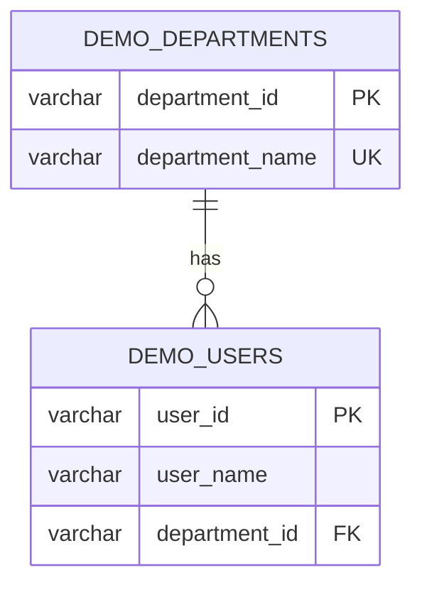

# 外部連携調査レポート（neon-postgres）

## 1. システム概要

- システム名: `neon-postgres`
- 役割: 借用者の `user_id` から部署名を参照し、備品一覧と予約カレンダー表示に利用する
- 接続種別: DB系（PostgreSQL）
- 公式ドキュメントURL: `https://neon.tech/docs`

## 2. 認証・接続情報

- 認証方式: ID/パスワード認証 + TLS（`sslmode=require`）
- ベース接続情報: PostgreSQL接続文字列方式
- 必要な環境変数（値は記載しない）:
  - `EXTERNAL_DEPARTMENT_DB_URL`
  - `EXTERNAL_DEPARTMENT_DB_CONNECT_TIMEOUT_SEC`
  - `EXTERNAL_DEPARTMENT_DB_QUERY_TIMEOUT_SEC`

## 3. オペレーション一覧

| オペレーション名 | エンドポイント | メソッド | 主要パラメータ | レスポンス概要 |
|---|---|---|---|---|
| 借用者部署名取得 | `SQL/public.demo_users + public.demo_departments` | SELECT | `user_id`（=内部`login_id`） | `department_name` |
| 予約カレンダー向け部署名取得 | `SQL/public.demo_users + public.demo_departments` | SELECT | `user_id` の集合 | `user_id` ごとの `department_name` |
| 参照整合確認 | `SQL/public.demo_users` | SELECT | `user_id` | 該当ユーザー存在有無 |

## 4. 連携先データ構造

### 4-1. テーブル設計

| テーブル | カラム名 | 型 | 制約 |
|---|---|---|---|
| `public.demo_departments` | `department_id` | `character varying` | PK, NOT NULL |
| `public.demo_departments` | `department_name` | `character varying` | UNIQUE, NOT NULL |
| `public.demo_users` | `user_id` | `character varying` | PK, NOT NULL |
| `public.demo_users` | `user_name` | `character varying` | NOT NULL |
| `public.demo_users` | `department_id` | `character varying` | FK(`demo_departments.department_id`), NOT NULL |

### 4-2. リレーション図

## 5. 制限事項

- レート制限: 連携先から明示制限は提示なし
- ページネーション: 本連携対象の参照はキー指定中心のため不要
- タイムアウト推奨値:
  - 接続タイムアウト: 10秒
  - クエリタイムアウト: 3秒以内で完了する運用
- その他制約:
  - 外部DBは読み取り専用で扱う
  - 認証情報は `.env` 管理とし、ドキュメントへ値を記載しない

## 6. モック実装の説明

- モック方式: psycopg差し替え方式（`external/neon-postgres/mock/psycopg_mock.py`）
- 選定理由: 連携はPostgreSQL直接参照であり、HTTPモックよりも実装責務（SQL実行）に一致するため
- モックの役割:
  - SQL文字列を簡易解析して `user_id` を抽出する
  - 既知 `user_id`（`U001`〜`U010`）なら対応部署名を返す
  - 未知 `user_id` なら `None`（NULL相当）を返す
- 利用手順:
  1. mockモードで `psycopg.connect` を `patch_psycopg_connect` で差し替える
  2. 部署名取得SQLを実行する
  3. 既知ユーザーは部署名、未知ユーザーは `None` を確認する

## 7. 既存ライブラリ選定結果

### 7-1. 候補比較（7項目）

| 候補 | メンテナンス状況 | 利用実績規模 | ライセンス | カバレッジ | 認証方式サポート | 型定義 | テスタビリティ |
|---|---|---|---|---|---|---|---|
| `psycopg` | 継続更新 | 高い | PostgreSQL License | 本件に必要なSELECTを満たす | 接続文字列/TLS設定に対応 | あり | 高い |
| `SQLAlchemy` | 継続更新 | 高い | MIT | 本件に必要なSELECTを満たす | 接続文字列/TLS設定に対応 | あり | 高い |
| `asyncpg` | 継続更新 | 高い | Apache-2.0 | 本件に必要なSELECTを満たす | 接続文字列/TLS設定に対応 | あり | 中 |

### 7-2. 推奨理由

- 推奨: `psycopg`
- 理由: 読み取り専用の外部DB参照を最小構成で実装でき、現在のFastAPI/Python構成に対して追加抽象化が不要なため

### 7-3. 不採用理由

- `SQLAlchemy`: 本件は単純SELECT中心であり、ORM層追加は要件範囲に対して過剰
- `asyncpg`: 非同期専用最適化の利点より、接続管理の単純性を優先

### 7-4. リスク評価

- 運用リスク: 認証情報管理不備による接続失敗
- 法務リスク: 採用候補はいずれも商用利用実績のあるライセンスで重大懸念なし
- 保守リスク: 外部スキーマ変更時に `login_id=user_id` 対応が崩れる可能性

### 7-5. ユーザー最終決定

- 採用ライブラリ: `psycopg`
- 決定状態: 採用確定

## 8. E2E二モード運用方針

- モード定義:
  - mockモード: ローカルモックを利用して外部連携E2Eを実行する
  - realモード: 実外部DBへ接続して検証する
- 切替方法:
  - Docker Composeプロファイルで `mock` / `real` を切替える
  - テスト実行コマンドでモード指定を付与する
- 運用方針:
  - 実装時・CI時は mockモードE2E全件通過を必須とする
  - realモードE2Eは手動実行を必須とする
  - モック実装は `external/neon-postgres/mock/` に配置し、E2E側からシンボリックリンク参照し、リンク自体をGit管理する
