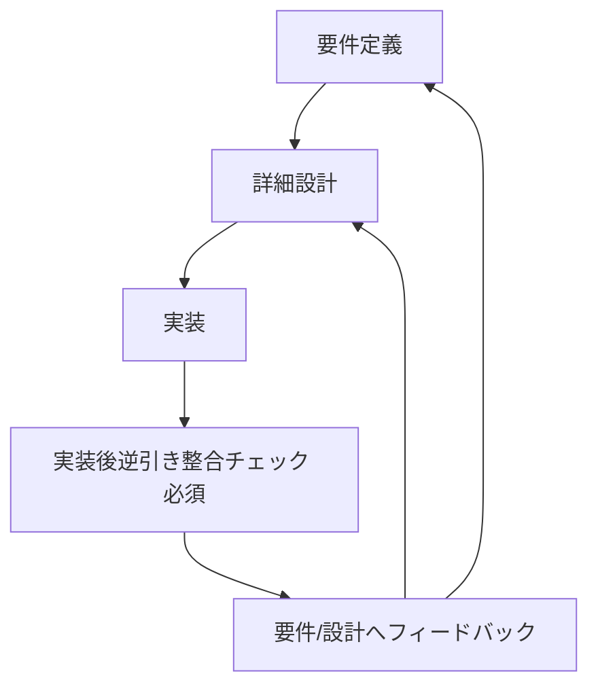
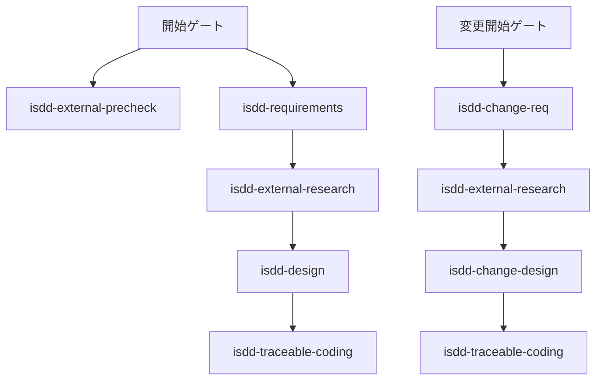
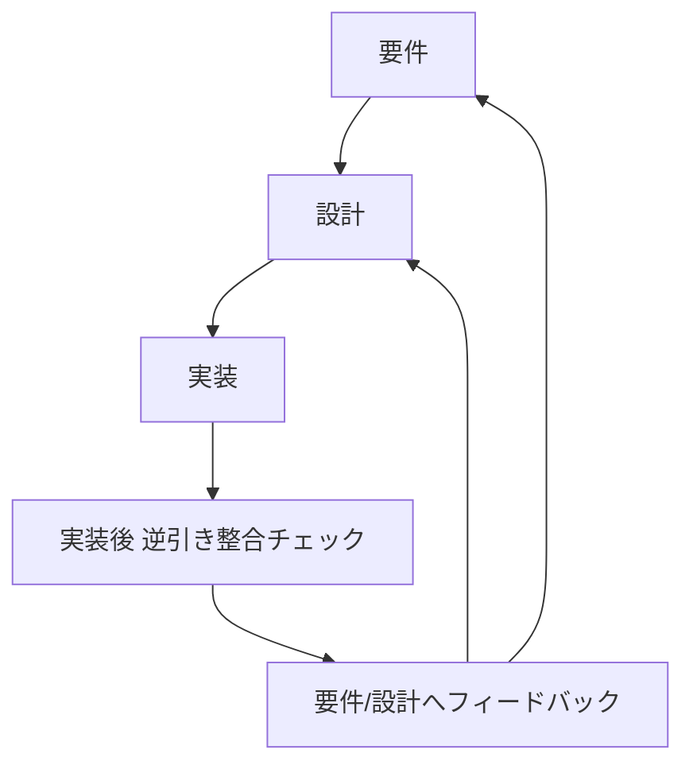

# isdd 変更候補検討資料（改訂版）

## 1. 本資料の位置づけ
本資料は、以下5論点の変更方針を確定し、必要な論点は複数案で再検討した結果をまとめたものである。

1. ヒアリング時の説明の平易化
2. 用語集を意味のあるものにする
3. 設計不要な要件IDを生まないための大局設計
4. 実装後の逆引き整合フロー（isdd-reverse-engineering拡張か新スキルか）
5. 外部連携プリチェック強化

## 2. 決定事項サマリ

| 論点 | 決定 |
|---|---|
| 1 | 案B + 案C を採用 |
| 2 | 案A + 案B を採用（ただしAは既存要素あり。強化が必要） |
| 3 | scripts起点ではなく「設計不要IDを作らない」方向で再検討（本資料で複数案提示） |
| 4 | 案Aを採用（実装後に必ず逆引き整合）。実現方式は複数案比較の上で推奨を提示 |
| 5 | 案A + 案B + 案C を採用 |

---

## 3. 論点1 ヒアリング時の説明の平易化（確定）

### 3.1 採用方針
案B（業務での言い換え必須）と案C（画面要素説明の必須化）を同時採用する。

### 3.2 変更詳細

#### 変更対象
- skills/isdd-requirements/SKILL.md
- skills/isdd-change-req/SKILL.md
- skills/isdd-reverse-engineering/SKILL.md
- skills/isdd-common/references/hearing-complexity-rules.md
- skills/isdd-common/references/requirements-chapters.md

#### 具体変更
1. ヒアリング質問テンプレートを「専門語」と「業務語」の二段表現にする。
2. 実際の質問文は業務語のみを提示し、内部的に専門語へマッピングする。
3. 画面要件ヒアリング時、画面ごとに以下5項目を必須化する。
   - 画面の目的
   - 主要要素（ボタン、一覧、入力欄）
   - 入力項目
   - 表示項目
   - エラー時の見え方
4. 5項目が埋まらない画面は「未確定画面」とし、要件確定ゲートを通過不可にする。

### 3.3 期待効果
- 非ITユーザーが質問意図を理解しやすくなる。
- 画面定義の不足による設計手戻りを減らせる。

---

## 4. 論点2 用語集を意味のあるものにする（確定）

### 4.1 「案Aは既にあるか」への回答
結論として、案Aの土台は既に存在する。

現状の requirements-chapters には「用語集（不明用語は必ず確認）」が記載済みである。
ただし、以下が不足している。

- 用語定義項目の固定フォーマットがない。
- 新出ドメイン語に対する進行停止ゲートがスキル側で明示されていない。
- 用語定義の妥当性（利用範囲、境界）の確認手順が弱い。

したがって、案Aは「新設」ではなく「既存要素の強化」が正確である。

### 4.2 採用方針
案A（用語集定義必須）+ 案B（新出語の意味確定まで停止）を採用する。

### 4.3 変更詳細

#### 変更対象
- skills/isdd-common/references/requirements-chapters.md
- skills/isdd-requirements/SKILL.md
- skills/isdd-change-req/SKILL.md
- skills/isdd-reverse-engineering/SKILL.md

#### 具体変更
1. 用語集を表形式で固定する。

| 用語 | 業務上の意味 | 本案件での使用範囲 | 同義語/類義語 |
|---|---|---|---|

2. 新出ドメイン語検出時の停止ルールを追加する。
   - 意味未確定の用語がある場合は次の機能要件質問へ進まない。
3. 用語が要件文に登場する場合、用語集との参照整合を確認する。

### 4.4 期待効果
- 要件・設計・実装での語義ズレを抑制できる。
- 変更時の影響分析が容易になる。

---

## 5. 論点3 設計不要な要件IDを生まないための大局設計（再検討）

本論点の本質は「チェッカーの判定調整」ではなく、設計対象にならない要件IDの発生を上流で抑止することである。

### 5.1 再検討案

| 案 | 方針 | 要点 |
|---|---|---|
| 案3-A | 全要件ID維持 + 設計除外表で運用 | 要件は広く作るが設計対象外を明示して進行 |
| 案3-B | 設計対象性ゲートを要件工程に追加 | DSが必要な要件のみRQとして確定。非対象は要件記述方法を変更 |
| 案3-C | 二層ID体系化 | 仕様説明用IDと設計実装用IDを分離 |
| 案3-D | 変更時フィードバック駆動 | 設計で不要判定された要件をchange-reqへ戻し、要件側で再定義・統合・削除 |

### 5.2 メリット・デメリット

| 案 | メリット | デメリット |
|---|---|---|
| 案3-A | 既存資産への影響が最小。導入が早い。 | 「意味のない設計除外リスト」が残り続けやすい。 |
| 案3-B | 設計不要IDを上流で抑止できる。最も本質対応。 | 要件ヒアリングの判定責務が増える。 |
| 案3-C | 管理は明確になる。 | 体系が複雑化し、運用教育コストが高い。 |
| 案3-D | 現場の実態を要件へ戻せる。 | ループ運用ルールが弱いと形骸化しやすい。 |

### 5.3 推奨方針
案3-B + 案3-D の組み合わせを推奨する。

#### 推奨理由
- 案3-Bで発生抑止を行い、案3-Dで現場知見を要件へ還流できるため。
- 「設計しない要件IDの一覧」を設計書側に積み上げる運用を回避できるため。

### 5.4 実装方針（具体）

#### 追加する判定ゲート
要件定義時に各候補要件へ以下判定を必須化する。

| 判定軸 | 判定内容 |
|---|---|
| 設計具体性 | クラス/関数/IF/データモデルのどれかに落ちるか |
| 実装責務 | プロダクト実装で担保するか、運用ルールで担保するか |
| 検証可能性 | テストで成否判定できるか |

判定結果:
- 3軸すべて成立: RQとして確定し設計対象にする。
- 成立しない: RQ化しない。業務説明・運用前提・用語定義へ移す。

#### フィードバックループ
1. 設計工程で「DSに落とせないRQ候補」を検出する。
2. change-reqへ必ずフィードバックする。
3. 変更要件で以下いずれかへ再編する。
   - 真に不要なら削除
   - 業務課題へ統合
   - 運用要件へ再定義
   - 実装可能な粒度へ分割

#### scripts側の役割見直し
- scriptsは「上流判定の結果を検証する補助」に位置づける。
- scripts単独で仕様運用を決めない。

---

## 6. 論点4 実装後の逆引き整合（案A確定）と実現方式の再検討

方針は案Aで確定する。
実装完了後に必ず逆引き整合チェックを実施する。

### 6.1 実現方式の比較

| 案 | 内容 | メリット | デメリット |
|---|---|---|---|
| 案4-A1 | isdd-reverse-engineering を拡張し、実装後整合モードを追加 | 既存スキル資産を活用可能 | スキル責務が肥大化しやすい |
| 案4-A2 | 新スキル（例: isdd-post-implementation-review）を新設 | 責務分離が明確。運用指示が分かりやすい | 新規スキル管理コストが増える |
| 案4-A3 | A1 + 共通部品切り出し（推奨） | 再利用性が高く、段階導入しやすい | 初期設計がやや重い |
| 案4-A4 | A2 + 共通部品切り出し（推奨） | 責務分離と再利用性を両立 | 初期実装工数が最も大きい |

### 6.2 推奨方針
案4-A4を推奨する。

#### 推奨理由
- 逆引き「初期導入」と「実装後整合チェック」は利用場面が異なるため、スキル分離が運用上明確。
- 共通部品を切り出せば、両スキルの重複実装を防げる。

### 6.3 共通部品化・エージェント化の対象

| 共通部品 | 役割 | 提供形態 |
|---|---|---|
| 構造抽出部品 | モジュール、クラス、関数、依存関係抽出 | 共有スクリプト/ライブラリ |
| RQ-DS突合部品 | 要件IDと設計IDの整合判定 | 共有スクリプト |
| 実装差分要約部品 | 実装差分から仕様影響点を抽出 | 専用サブエージェント |
| フィードバック生成部品 | 要件・設計への差分反映候補を文章化 | 専用サブエージェント |

### 6.4 フロー改訂案（必須ステップ）

### 6.5 変更対象
- README.md
- skills/isdd-traceable-coding/SKILL.md
- skills/isdd-reverse-engineering/SKILL.md
- 新規作成想定: skills/isdd-post-implementation-review/SKILL.md
- 共通部品格納先（新設想定）: skills/isdd-common/scripts 配下

---

## 7. 論点5 外部連携プリチェック強化（確定）

### 7.1 採用方針
案A + 案B + 案C を同時採用する。

### 7.2 変更詳細

#### 変更対象
- skills/isdd-external-precheck/SKILL.md
- precheck_report の出力フォーマット定義
- 必要に応じて isdd-external-research との境界記述

#### 具体変更
1. 認証付き接続ヒアリングの固定化
   - 接続先
   - 認証方式
   - 必要環境変数名
   - 接続元制約（IP、ネットワーク、VPN）
2. .env入力を必須化（値そのものは記録しない）
3. Python venv上で実接続テストを実施し、接続可否を証跡化する。
4. 接続成功時にスキーマ（エンティティ）一覧を取得し、precheck成果物へ記録する。

### 7.3 完了条件
- 接続可否が事実ベースで確認済み
- 認証方式と環境変数名が定義済み
- 取得可能なエンティティ一覧が記録済み
- 機密値の文書記録なし

---

## 8. 反映方針（改訂対象の全体マップ）

| 区分 | 変更対象 |
|---|---|
| ヒアリング平易化 | isdd-requirements, isdd-change-req, isdd-reverse-engineering, hearing-complexity-rules |
| 用語統制 | requirements-chapters, isdd-requirements, isdd-change-req, isdd-reverse-engineering |
| 設計不要ID抑止 | isdd-requirements, isdd-change-req, isdd-design, isdd-change-design, scripts運用方針 |
| 実装後逆引き整合 | README, isdd-traceable-coding, isdd-reverse-engineering, 新規スキル候補 |
| 外部連携プリチェック | isdd-external-precheck, precheck_report定義, external-research境界定義 |

---

## 9. 最終結論

- 論点1は案B + 案Cで確定し、ヒアリング平易化と画面要素明確化を同時実装する。
- 論点2は案A + 案Bで確定し、既存の用語集要素を強化して停止ゲートを追加する。
- 論点3は「scripts調整」中心ではなく「設計不要IDを上流で作らない」設計へ転換し、案3-B + 案3-Dを軸にする。
- 論点4は案Aで確定し、実装後逆引き整合を必須化する。実現方式は新スキル化 + 共通部品化（案4-A4）を推奨する。
- 論点5は案A + 案B + 案Cで確定し、認証付き実接続とスキーマ確認までをプリチェック完了条件にする。

この方針により、ドキュメント品質改善ではなく、上流の要件生成ルールと実装後フィードバック循環を強化する方向でisdd全体の運用整合を高める。

---

## 10. 文書レビュー結果（必須）

### 10.1 矛盾確認
- 5論点の採用方針と本文詳細に矛盾がないことを確認した。
- 論点4は「案A採用」を前提に、実現方式比較を行う構造で整合していることを確認した。

### 10.2 冗長性確認
- 以前版で重複していた「scripts中心の議論」を削除し、論点3の本質へ再構成した。
- 章ごとの結論を簡潔化し、同一結論の重複記載を削減した。

### 10.3 不足確認
- 「案Aは既にあるか」の問いに対して、既存有無と不足点を明示した。
- 論点3と4は複数案比較・推奨理由・具体変更まで記載済みであることを確認した。
# isdd 変更候補検討資料

## 1. 目的
本資料は、以下の5つの変更候補について、スキル単位での変更方法を複数比較し、メリット・デメリットを整理し、統合方針を明確化するための検討結果をまとめたものである。

1. ヒアリング時の説明の平易化
2. 用語集を意味のあるものにする
3. scriptsでチェックしているIDの整理
4. isddフローの変更（実装後の整合性チェック）
5. 外部連携プリチェックの強化（接続・スキーマ確認）

## 2. 現状整理

### 2.1 現行フロー

### 2.2 現状の論点
- ヒアリングルールでは「MVPという語は直接使わない」方針があるが、実際の案内文では専門用語が混在しやすい。
- 用語の意味確認が「必須ゲート」になっておらず、業務用語が曖昧なまま進行する余地がある。
- `rq_integrity_checker.py` は `RQ-BK` を軸に全カテゴリの関連を検証する実装であり、チェック対象を縮小する場合の方針が未確定。
- 実装後に逆引き検証を必須で回すフローがREADME上で固定化されていない。
- `isdd-external-precheck` は接続テスト記載はあるが、接続方法・認証情報入力・スキーマ取得手順の具体度に揺れがある。

## 3. 変更候補1: ヒアリング時の説明の平易化

### 3.1 変更方法案

| 案 | 変更内容 | 主な変更対象 |
|---|---|---|
| 案A | 専門用語禁止リストを導入し、質問文を平易語で固定する | isdd-requirements, isdd-change-req, isdd-reverse-engineering, isdd-common/references/hearing-complexity-rules.md |
| 案B | 各質問に「業務での言い換え」を必須併記する | 同上 |
| 案C | 画面要件ヒアリングで「画面要素説明」を必須項目化する | isdd-requirements, isdd-change-req, requirements-chapters.md |

### 3.2 メリット・デメリット

| 案 | メリット | デメリット |
|---|---|---|
| 案A | 運用ぶれが最小。レビュー観点が明確。 | 表現の自由度が下がる。 |
| 案B | ユーザー理解が向上し、合意形成が速い。 | 記述量が増え、ヒアリングが長くなりやすい。 |
| 案C | 画面定義の不足を直接防止できる。 | 要件定義初期の負荷が上がる。 |

### 3.3 統合方針
- 採用: 案A + 案C
- 理由: 平易化を強制しつつ、画面定義の抜け漏れを直接抑止できるため。
- 実施要点:
  - 「MVP」「非機能」などの語をそのまま質問に出さず、業務影響ベースの表現へ統一する。
  - 画面要件では、各画面に対して「目的」「主要要素」「入力項目」「表示項目」「エラー時の見え方」を必須確認とする。

## 4. 変更候補2: 用語集を意味のあるものにする

### 4.1 変更方法案

| 案 | 変更内容 | 主な変更対象 |
|---|---|---|
| 案A | 用語集章を追加し、業務用語を定義必須にする | requirements-chapters.md, isdd-requirements, isdd-change-req |
| 案B | 用語検知ゲートを導入し、新出ドメイン語が出たら進行停止して意味確認する | isdd-requirements, isdd-change-req, isdd-reverse-engineering |
| 案C | 用語に「判断境界」を必須化する（何を含む/含まない） | 同上 |

### 4.2 メリット・デメリット

| 案 | メリット | デメリット |
|---|---|---|
| 案A | 文書としての参照性が高い。 | 形式だけ埋まるリスクがある。 |
| 案B | 曖昧語の持ち込みを確実に防げる。 | ヒアリングのテンポが遅くなる。 |
| 案C | 実装時の解釈差異を強く抑制できる。 | 定義負荷が大きく、初期負担が増える。 |

### 4.3 統合方針
- 採用: 案A + 案B
- 理由: 「記録」と「強制確認」の両輪が必要で、どちらか単独では欠けるため。
- 実施要点:
  - 用語集は「用語名」「業務上の意味」「このプロジェクトでの使用範囲」を必須項目とする。
  - 新出ドメイン語を検知した時点で、意味が確定するまで次質問へ進まない。

## 5. 変更候補3: scriptsでチェックしているIDの整理

### 5.1 比較対象
今回の主論点は「RQのうち、`RQ-BK` と `RQ-FT` を中心に検証範囲を絞るか」である。

### 5.2 変更方法案

| 案 | チェック範囲 | 主な変更対象 |
|---|---|---|
| 案A | 現状維持（全カテゴリ） | rq_integrity_checker.py, rq_ds_link_checker.py は現状踏襲 |
| 案B | `RQ-BK` + `RQ-FT` のみ必須、他カテゴリは任意 | 同スクリプト両方 |
| 案C | 二層化: 必須は `RQ-BK` + `RQ-FT`、拡張チェックで全カテゴリ | 同スクリプト両方 + README運用定義 |

### 5.3 メリット・デメリット

| 案 | メリット | デメリット |
|---|---|---|
| 案A | 品質担保が最も強い。設計漏れ検出力が高い。 | 運用負荷が高く、初期導入の障壁になる。 |
| 案B | 実装スピードが上がり、運用が簡単。 | UI・NF・DTの漏れを見逃しやすい。 |
| 案C | 速度と品質の両立が可能。移行しやすい。 | ルール設計が複雑になりやすい。 |

### 5.4 `RQ-BK` + `RQ-FT` に絞る場合の要点
- メリット:
  - 業務課題と機能の主線に集中できる。
  - チェック結果の解釈が簡単になり、改善サイクルが速い。
- デメリット:
  - 画面要件、データ保持、非機能の抜けを検出しづらくなる。
  - 外部連携や運用要件の欠落が後工程で顕在化しやすい。

### 5.5 統合方針
- 採用: 案C
- 理由: 主線の速度を維持しつつ、品質低下を回避できるため。
- 実施要点:
  - チェッカーは「必須チェック」と「拡張チェック」を明示的に分離する。
  - 完了判定は必須チェック合格を最低条件とし、拡張チェックの結果は欠落の種類を明示して扱う。

## 6. 変更候補4: isddフローの変更（実装後の逆引き整合）

### 6.1 変更方法案

| 案 | 変更内容 | 主な変更対象 |
|---|---|---|
| 案A | `isdd-traceable-coding` 完了後に `isdd-reverse-engineering` を必須実行 | README, isdd-traceable-coding, isdd-reverse-engineering |
| 案B | 変更有無に関わらず毎回実行 | 同上 |
| 案C | 初回実装後と変更実装後のみ必須実行 | 同上 + change系スキル |

### 6.2 メリット・デメリット

| 案 | メリット | デメリット |
|---|---|---|
| 案A | 実装差分の仕様乖離を早期発見できる。 | 実行回数が増え、工数が増える。 |
| 案B | 一貫性は最も高い。 | 過剰運用になり、軽微修正でも負荷が重い。 |
| 案C | 効果が高い局面に絞って運用できる。 | 対象判定のルール運用が必要。 |

### 6.3 統合方針
- 採用: 案C
- 理由: 「初回実装後」と「変更実装後」の2局面を必須化すれば、実害の大きい乖離を抑えつつ過剰運用を回避できるため。
- 実施要点:
  - READMEの新規/変更フローに「実装後逆引き整合ステップ」を明記する。
  - `isdd-reverse-engineering` に「実装後検証モード」を追加し、既存ロジック非変更のまま整合確認専用で利用する。

### 6.4 改訂後フロー（統合案）

## 7. 変更候補5: 外部連携プリチェック強化

### 7.1 変更方法案

| 案 | 変更内容 | 主な変更対象 |
|---|---|---|
| 案A | 認証付き接続情報のヒアリング項目を固定化し `.env` 入力を必須化 | isdd-external-precheck |
| 案B | Python venv 前提で接続検証を標準手順化し、接続結果を報告書へ必須記録 | isdd-external-precheck, precheck_reportフォーマット |
| 案C | 接続成功後にスキーマ（エンティティ）取得を必須化 | isdd-external-precheck, isdd-external-research との境界定義 |

### 7.2 メリット・デメリット

| 案 | メリット | デメリット |
|---|---|---|
| 案A | 認証方式の取り違えを減らせる。 | 初回ヒアリング項目が増える。 |
| 案B | 実接続可否を早期に確定できる。 | 実行環境準備の負荷が増える。 |
| 案C | 要件定義前にデータ実体を把握できる。 | 連携先によっては取得権限調整が必要。 |

### 7.3 統合方針
- 採用: 案A + 案B + 案C
- 理由: いずれかを欠くと、接続可否は確認できても要件定義に必要な事実が揃わないため。
- 実施要点:
  - precheckで必ず「接続先」「認証方式」「必要環境変数名」「接続確認結果」「取得したエンティティ一覧」を出力する。
  - 機密値そのものは記録せず、環境変数名と取得結果の事実のみ記録する。

## 8. スキル別変更マップ

| スキル | 変更内容 |
|---|---|
| isdd-requirements | 平易語質問固定、画面要素説明の必須化、用語検知停止ゲート追加 |
| isdd-change-req | 平易語質問固定、画面要素説明の必須化、用語検知停止ゲート追加 |
| isdd-design | 画面定義不足の受け入れ禁止条件を追加 |
| isdd-change-design | 画面定義不足の受け入れ禁止条件を追加 |
| isdd-reverse-engineering | 実装後整合チェックモードを明記し、再実行前提フローへ適合 |
| isdd-traceable-coding | 完了条件に「逆引き整合チェック起動」を追加 |
| isdd-external-precheck | 認証付き接続手順、`.env` 入力、venv接続検証、スキーマ取得確認を必須化 |
| isdd-common/references/hearing-complexity-rules.md | 非専門向け質問テンプレート規則を追加 |
| isdd-common/references/requirements-chapters.md | 用語集章を新設し必須化 |
| scripts/rq_integrity_checker.py | 必須チェック/拡張チェックの二層化 |
| scripts/rq_ds_link_checker.py | 必須チェック/拡張チェックの二層化 |
| README.md | 実装後逆引き整合チェックを標準フローへ反映 |

## 9. 統合結論
- 平易化は「専門用語抑制」と「画面要素説明必須」を同時適用する。
- 用語集は「章追加」だけでなく「新出用語の意味確定まで進行停止」を必須化する。
- IDチェックは「必須（BK/FT）」と「拡張（全カテゴリ）」の二層運用に整理する。
- フローは「初回実装後」と「変更実装後」に必ず逆引き整合チェックを実行する。
- 外部連携プリチェックは「認証付き実接続」と「スキーマ確認」までを完了条件にする。

この統合方針により、ヒアリングのわかりやすさ、要件の意味精度、検証運用の現実性、実装後の仕様整合性、外部連携の事前確度を同時に改善できる。