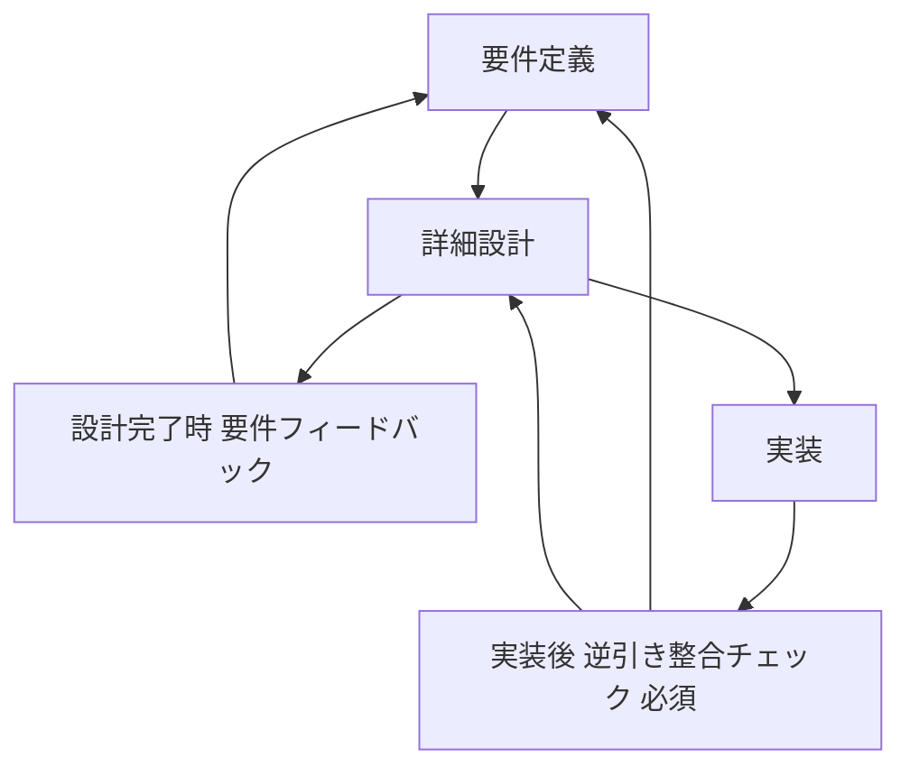

# isdd 変更仕様・再検討結果（改訂版）

## 1. この文書の目的
本書は、変更方針が確定した論点は「実施仕様」として確定記述し、再検討が必要な論点のみ複数案比較を行った結果をまとめる。

対象論点:
1. ヒアリング時の説明の平易化（確定）
2. 用語集を意味のあるものにする（確定）
3. 設計で不要になりがちなIDの整理とチェック方針（再検討）
4. isddフロー変更: 実装後逆引き整合（案A確定）+ 設計完了時の要件フィードバックループ新設（再検討）
5. 外部連携プリチェック強化（確定）

---

## 2. 決定事項一覧

| 論点 | 決定 |
|---|---|
| 1 | 案B + 案Cを採用 |
| 2 | 案A + 案Bを採用（Aは既存要素を強化） |
| 3 | 主論点を再定義して再検討（本書で複数案提示） |
| 4 | 実装後逆引き整合は案Aで確定。加えて「設計完了時の要件フィードバックループ」を新設し、スキル構成を再検討 |
| 5 | 案A + 案B + 案Cを採用 |

---

## 3. 論点1 ヒアリング時の説明の平易化（確定仕様）

### 3.1 変更対象
- skills/isdd-requirements/SKILL.md
- skills/isdd-change-req/SKILL.md
- skills/isdd-reverse-engineering/SKILL.md
- skills/isdd-common/references/hearing-complexity-rules.md
- skills/isdd-common/references/requirements-chapters.md

### 3.2 実施仕様
1. 質問文の出力形式を「業務での言い換え」に統一する。
2. 専門用語を使う場合は、同一発話内で必ず平易語に言い換える。
3. 画面要件のヒアリングに、以下の必須確認項目を追加する。
   - 画面の目的
   - 画面の主要要素
   - 入力項目
   - 表示項目
   - エラー時表示
4. 上記5項目が未確定の画面は要件確定不可とし、ヒアリング継続を必須化する。

### 3.3 変更後の運用ルール
- ヒアリング完了判定に「画面要素定義完了」を追加する。
- 画面遷移図のみで完了扱いにしない。

---

## 4. 論点2 用語集を意味のあるものにする（確定仕様）

### 4.1 現状評価（Aは既にあるか）
用語集の章そのものは既存の必須章立てに存在する。
不足しているのは運用強度であり、以下を強化対象とする。

- 用語定義フォーマットが固定されていない
- 新出ドメイン語の意味未確定でも先へ進めてしまう
- 要件本文と用語集の参照整合チェックが弱い

### 4.2 変更対象
- skills/isdd-common/references/requirements-chapters.md
- skills/isdd-requirements/SKILL.md
- skills/isdd-change-req/SKILL.md
- skills/isdd-reverse-engineering/SKILL.md

### 4.3 実施仕様
1. 用語集の記載形式を固定する。

| 用語 | 業務上の意味 | 本案件での使用範囲 | 同義語/類義語 |
|---|---|---|---|

2. 新出ドメイン語が出現した時点で意味確定まで進行停止する。
3. 要件本文の用語は用語集に存在する語のみ使用可とする。
4. 用語集にない語が本文にある場合はレビュー不合格とする。

### 4.4 変更後の運用ルール
- 用語未確定は「要件未確定」と同義に扱う。
- 変更要件時も同ルールを必須適用する。

---

## 5. 論点3 設計で不要になりがちなIDの整理とチェック方針（再検討）

### 5.1 主論点の再定義
本論点は「scriptsで何をチェックするか」ではなく、先に「設計で不要になりがちなIDを整理」し、その上で「チェック範囲をどう最適化するか」を決めることが本質である。

### 5.2 設計不要になりがちなIDの整理

#### 5.2.1 分類

| 分類 | IDカテゴリ | 設計への落とし込み傾向 |
|---|---|---|
| 常時コンテキスト | RQ-BZ, RQ-BK | 設計要素を直接持たない（要求の根拠） |
| 設計直結 | RQ-FT, RQ-UI, RQ-EX, RQ-DT | DSへの変換対象になりやすい |
| 条件付き設計 | RQ-NF, RQ-OP | 実装や運用設計が必要な場合のみDS化 |
| 設計非直結になりやすい | RQ-TS | テストシナリオ記述として成立し、必ずしも実装設計要素に直結しない |

#### 5.2.2 現在の問題構造
- RQを網羅的に作成する一方、DSに落ちないIDが発生する。
- その結果、チェッカーで欠落扱いとなり、設計書に「説明のためだけのID」や「設計しないIDリスト」が残りやすい。

### 5.3 再検討案

| 案 | 方針 | 概要 |
|---|---|---|
| 案3-A | チェッカー側で除外カテゴリを増やす | 生成は現状維持し、検証のみ緩和 |
| 案3-B | 要件定義時に設計対象判定を必須化する | 設計対象にならない候補はRQとして採番しない |
| 案3-C | RQを二層化する | 設計対象RQと説明RQを明示的に分離 |
| 案3-D | 設計工程での不要ID検出を要件へ強制フィードバックする | 設計で落ちないRQを変更要件へ戻して再整理 |

### 5.4 メリット・デメリット

| 案 | メリット | デメリット |
|---|---|---|
| 案3-A | 既存資産変更が少なく導入が速い | 原因を残したままの対症療法になる |
| 案3-B | 不要IDの発生を上流で抑止できる | 要件ヒアリングに判定責務が増える |
| 案3-C | 管理上の意味は明確 | ID体系が複雑化し教育コストが高い |
| 案3-D | 実務で発見された不整合を要件へ戻せる | フィードバック運用を徹底しないと形骸化する |

### 5.5 推奨方針
案3-B + 案3-Dを推奨する。

#### 理由
- 上流抑止（B）と後工程フィードバック（D）を両輪化できる。
- 「設計しないIDリスト」を設計書に残す運用を避けられる。

### 5.6 具体変更（推奨方針採用時）

#### 変更対象
- skills/isdd-requirements/SKILL.md
- skills/isdd-change-req/SKILL.md
- skills/isdd-design/SKILL.md
- skills/isdd-change-design/SKILL.md
- skills/isdd-common/references/id-definitions.md
- skills/isdd-common/scripts/rq_integrity_checker.py
- skills/isdd-common/scripts/rq_ds_link_checker.py

#### 追加ルール
1. 要件採番前に「設計対象判定」を必須化する。
2. 判定基準は以下3軸で固定する。
   - 実装責務として担保するか
   - 設計要素（DSカテゴリ）へ変換可能か
   - 検証可能な受け入れ条件を持つか
3. 3軸を満たさない候補はRQ採番せず、業務説明・運用前提・用語集へ移管する。
4. 設計工程でDS化できなかったRQは、change-reqへ強制フィードバックする。
5. scriptsは以下の順で検証する。
   - 上流判定の整合（設計対象判定の漏れ）
   - RQ-DS対応整合

---

## 6. 論点4 isddフロー変更（案A確定）+ 設計完了時フィードバックループ新設（再検討）

### 6.1 確定事項
- 実装後は必ず逆引き整合チェックを実行する（案A）。
- 設計完了時にも、要件で見つからなかった点を要件定義へ戻すフィードバックループを新設する。

### 6.2 フロー要件

### 6.3 スキル構成の再検討案

| 案 | 構成 | メリット | デメリット |
|---|---|---|---|
| 案4-B1 | 既存スキル拡張のみ | 新規スキル追加が不要 | 各スキルの責務が肥大化する |
| 案4-B2 | フィードバック専用スキルを新設 | ループ処理の責務が明確 | 新規保守対象が増える |
| 案4-B3 | 専用スキル + 共通部品 + 専用サブエージェント | 再利用性と運用明確性を両立 | 初期実装コストが高い |

### 6.4 推奨方針
案4-B3を推奨する。

#### 理由
- 設計完了時ループと実装後ループは、手順は似るが入力粒度と判定観点が異なる。
- 専用スキル化で運用が明確になり、共通部品化で重複実装を抑止できる。

### 6.5 具体変更（推奨方針採用時）

#### 変更対象
- README.md
- skills/isdd-design/SKILL.md
- skills/isdd-change-design/SKILL.md
- skills/isdd-traceable-coding/SKILL.md
- skills/isdd-reverse-engineering/SKILL.md
- 新規作成: skills/isdd-feedback-loop/SKILL.md
- 共通部品: skills/isdd-common/scripts 配下

#### 追加する機能責務
1. 設計完了時フィードバック
   - 設計で新たに判明した前提・制約・例外ケースを抽出
   - 要件へ反映すべき差分候補を生成
   - change-req相当の更新手順へ接続
2. 実装後逆引き整合
   - 実装差分から要件/設計乖離を抽出
   - 乖離の要件反映・設計反映の分岐を提示
3. 共通部品
   - 差分抽出
   - RQ-DS整合判定
   - フィードバック文案生成

---

## 7. 論点5 外部連携プリチェック強化（確定仕様）

### 7.1 変更対象
- skills/isdd-external-precheck/SKILL.md
- precheck_reportの記載テンプレート
- 必要に応じて skills/isdd-external-research/SKILL.md

### 7.2 実施仕様
1. 認証付き接続ヒアリングを固定化する。
   - 接続先
   - 認証方式
   - 必要環境変数名
   - 接続経路制約
2. .env入力を必須化する（機密値そのものは文書記録しない）。
3. Python venv上で実接続テストを実施する。
4. 接続成功後にスキーマまたはエンティティ一覧を取得し、precheck成果物へ記録する。

### 7.3 完了条件
- 接続可否の実測結果がある
- 認証方式と必要環境変数名が確定している
- 取得可能エンティティ一覧が記録されている
- 機密値をドキュメントへ保存していない

---

## 8. 反映対象一覧

| 種別 | 対象 |
|---|---|
| 既存スキル更新 | isdd-requirements, isdd-change-req, isdd-design, isdd-change-design, isdd-reverse-engineering, isdd-traceable-coding, isdd-external-precheck |
| 共通参照更新 | hearing-complexity-rules, requirements-chapters, id-definitions |
| スクリプト更新 | rq_integrity_checker.py, rq_ds_link_checker.py |
| 新規スキル候補 | isdd-feedback-loop |
| フロー文書更新 | README.md |

---

## 9. 文書レビュー結果（必須）

### 9.1 矛盾確認
- 確定事項（1,2,5）では案を残さず実施仕様へ落とし込んだ。
- 論点4は案A確定を前提に記述し、追加要件（設計完了時ループ）を別軸で再検討した。

### 9.2 冗長性確認
- 固定論点から不要な比較案を削除した。
- 再検討論点（3,4）のみ比較表を残し、目的と結論を分離して明確化した。

### 9.3 要求適合確認
- 「どこにどのような変更をするか」を論点ごとに対象ファイルと実施仕様で明記した。
- 論点3は主論点を修正し、設計不要IDの整理を先に行った上で複数案を再提示した。
- 論点4は案A固定で記述し、設計完了時の要件フィードバックループ新設とスキル構成案の比較を追加した。
