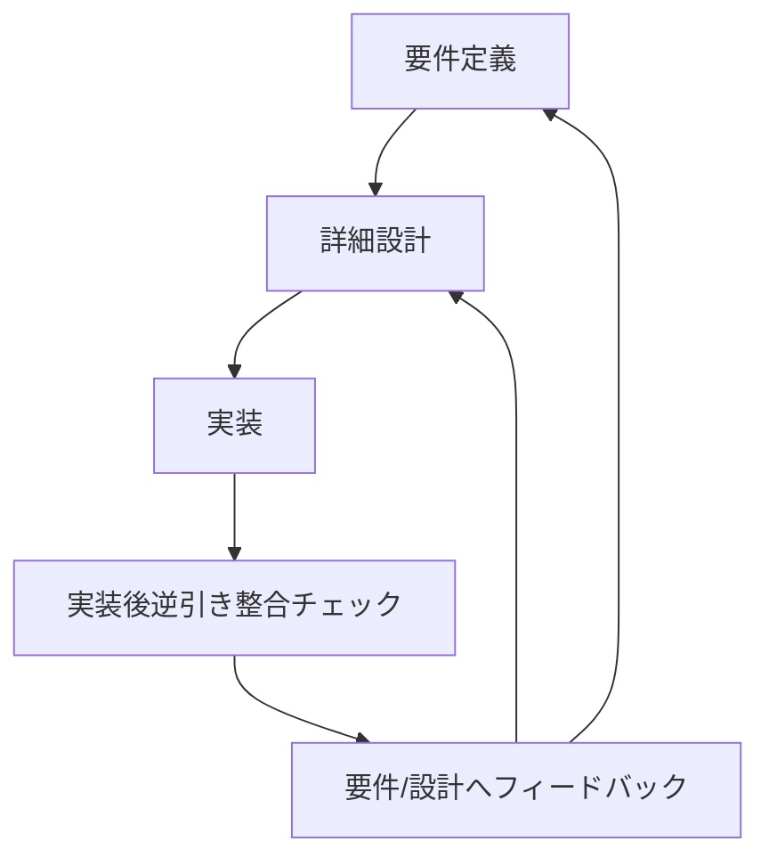

# isdd 変更点整理資料

## 1. 本資料の目的
本資料は、5つの論点について決定済みの変更点を明確化し、実運用に反映するための記述を整理したものである。

---

## 2. 論点1 ヒアリング時の説明の平易化

### 2.1 変更内容
ヒアリングでは専門用語中心の説明をやめ、ユーザーの業務文脈で理解できる表現を前提とする。

ただし、業務語は一般語と異なる意味を持つことがあるため、用語の意味をエージェント側で推定して確定してはならない。業務語は必ずユーザーに確認して定義する。

### 2.2 具体的な運用変更
1. 質問文は業務文脈の平易な言葉で提示する。
2. ユーザーが使った業務語は、次の質問へ進む前に必ず意味確認を行う。
3. 画面要件ヒアリングでは、各画面ごとに次の5項目を必須確認とする。
   - 画面の目的
   - 主要要素（ボタン、一覧、入力欄など）
   - 入力項目
   - 表示項目
   - エラー時の見え方
4. 5項目が埋まっていない画面は未確定として扱い、要件定義の完了判定を行わない。

### 2.3 反映対象
- skills/isdd-requirements/SKILL.md
- skills/isdd-change-req/SKILL.md
- skills/isdd-reverse-engineering/SKILL.md
- skills/isdd-common/references/hearing-complexity-rules.md
- skills/isdd-common/references/requirements-chapters.md

---

## 3. 論点2 用語集を意味のあるものにする

### 3.1 変更内容
用語集は「用語の存在確認」ではなく「業務上の意味を固定する仕組み」として運用する。

新しいドメイン用語が出た場合、意味が確定するまで要件ヒアリングを進めない。これにより、語義が曖昧なまま機能要件や設計要件が増えることを防止する。

### 3.2 具体的な運用変更
1. 用語集は次の固定項目で記載する。

| 用語 | 業務上の意味 | 本案件での使用範囲 | 同義語/類義語 |
|---|---|---|---|

2. 用語確認ゲートを追加する。
   - 新出用語が発生
   - 意味確認を実施
   - 用語集へ反映
   - 反映完了後にのみ次の要件質問へ進行
3. 要件本文に記載する用語は、用語集の定義と一致しなければならない。

### 3.3 反映対象
- skills/isdd-common/references/requirements-chapters.md
- skills/isdd-requirements/SKILL.md
- skills/isdd-change-req/SKILL.md
- skills/isdd-reverse-engineering/SKILL.md

---

## 4. 論点3 設計不要な要件IDを生まないための大局設計

### 4.1 検討前提
問題の本質は、チェッカースクリプトの判定条件だけではなく、要件定義時点で設計に落ちない要件IDを生成してしまう運用にある。

そのため、RQカテゴリ全体とDSカテゴリ全体を並べて、設計対象性を整理したうえで運用方式を再検討する。

### 4.2 RQカテゴリの全種別整理

| RQカテゴリ | 主な意味 | 設計要素（DS）に直接落ちる可能性 |
|---|---|---|
| RQ-BZ | 対象業務 | 低い（文脈要件） |
| RQ-BK | 業務課題 | 低い（文脈要件） |
| RQ-FT | 機能要件 | 高い |
| RQ-UI | 画面要件 | 高い |
| RQ-EX | 外部連携要件 | 高い |
| RQ-DT | データ要件 | 高い |
| RQ-NF | 非機能要件 | 中〜高（監視、認証、制御設計など） |
| RQ-TS | テストシナリオ要件 | 中（テスト設計に落ちる） |
| RQ-OP | 運用要件 | 中（運用設計や起動方式に落ちる） |

### 4.3 DSカテゴリの全種別整理

| DSカテゴリ | 意味 |
|---|---|
| DS-MD | モジュール |
| DS-IF | インターフェース/API |
| DS-CL | クラス |
| DS-FN | 関数/メソッド |
| DS-SC | スキーマ/データモデル |
| DS-BT | バッチ |
| DS-EV | イベント |

### 4.4 設計不要IDを抑止するための複数方式

#### 方式1: 要件定義で設計対象性を必須判定する方式
要件を確定する時点で、次の3条件を満たすものだけを設計対象IDとして確定する。

- 設計具体性: DSカテゴリのいずれかに落とせる
- 実装責務: 実装側で担保する内容である
- 検証可能性: テストで成否判定できる

3条件を満たさない内容は、要件IDとして新規発行せず、業務背景・運用前提・用語定義として記録する。

利点:
- 設計不要な要件IDの新規発行を上流で抑止できる。

懸念:
- 要件ヒアリング時の判定負荷が上がる。

#### 方式2: RQカテゴリごとに設計対象ルールを固定する方式
カテゴリごとに「設計必須」「条件付き設計」「設計対象外」を定義して運用する。

例:
- 設計必須: RQ-FT, RQ-UI, RQ-EX, RQ-DT
- 条件付き: RQ-NF, RQ-TS, RQ-OP
- 設計対象外: RQ-BZ, RQ-BK

利点:
- 判定基準が明確で、担当者によるブレが減る。

懸念:
- 条件付きカテゴリの扱いで境界事例が発生しやすい。

#### 方式3: 設計工程でのフィードバック前提方式
要件は広めに定義するが、設計時にDSへ落ちない要件を検出したら、必ず変更要件工程へ戻して再定義する。

フィードバック処理:
1. 設計で未マッピング要件を抽出
2. change-reqへ戻す
3. 次のいずれかに再編
   - 削除
   - 業務課題へ統合
   - 運用前提へ移動
   - 実装可能な粒度へ分割

利点:
- 実装現場で判明した事実を確実に上流へ戻せる。

懸念:
- ループ運用が弱いと、戻し忘れが発生する。

### 4.5 採用する運用の方向
フィードバックループは必ず採用する。

そのうえで、要件定義段階の設計対象性判定を導入し、設計工程で発見された未マッピング要件を変更要件へ必ず戻す二段運用とする。

### 4.6 反映対象
- skills/isdd-requirements/SKILL.md
- skills/isdd-change-req/SKILL.md
- skills/isdd-design/SKILL.md
- skills/isdd-change-design/SKILL.md
- scripts運用ルール（READMEの検証運用記述）

---

## 5. 論点4 実装後の逆引き整合

### 5.1 現状
現行フローでは、要件定義から設計、実装までの流れは定義されているが、実装完了後に逆引きで整合を再検証する工程が標準フローとして固定されていない。

このため、実装時の発見事項が要件書・設計書へ戻らず、ドキュメントと実装が時間差でずれるリスクがある。

### 5.2 変更内容
実装完了後に逆引き整合を必須工程として追加する。

実現方式は、専用スキルを新設し、共通部品を切り出して運用する。

#### 新設する役割
- 実装後整合専用スキル
  - 例: isdd-post-implementation-review
- 既存の isdd-reverse-engineering
  - 初期導入向けの逆引き機能に集中

#### 共通部品化する機能
- コード構造抽出
- RQ-DS対応突合
- 実装差分の要約
- 要件・設計へのフィードバック文生成

これらは共通スクリプトまたは専用サブエージェントとして切り出し、初期導入と実装後整合の両方から再利用する。

### 5.3 改訂後フロー

### 5.4 反映対象
- README.md
- skills/isdd-traceable-coding/SKILL.md
- skills/isdd-reverse-engineering/SKILL.md
- 新規スキル: skills/isdd-post-implementation-review/SKILL.md
- 共通部品: skills/isdd-common/scripts 配下

---

## 6. 論点5 外部連携プリチェック強化

### 6.1 変更内容
外部連携のプリチェックは、接続可否確認にとどめず、認証付き実接続とスキーマ確認までを完了条件にする。

### 6.2 具体的な運用変更
1. ヒアリング項目を固定化する。
   - 接続先
   - 認証方式
   - 必要環境変数名
   - 接続元制約（ネットワーク、VPN、IP制限）
2. .envへの設定を必須化する。
   - 機密値そのものは文書に保存しない。
   - 環境変数名のみを記録する。
3. Python venv上で実接続テストを実施し、接続可否を証跡化する。
4. 接続成功時は、取得可能なスキーマ（エンティティ一覧）を記録する。

### 6.3 完了条件
- 接続可否が実接続で確認済み
- 認証方式と環境変数名が記録済み
- 取得可能エンティティ一覧が記録済み
- 機密値の記録なし

### 6.4 反映対象
- skills/isdd-external-precheck/SKILL.md
- precheck_reportフォーマット
- skills/isdd-external-research/SKILL.md（境界条件の明記が必要な場合）

---

## 7. 全体反映マップ

| 領域 | 主な変更先 |
|---|---|
| ヒアリング平易化 | isdd-requirements, isdd-change-req, isdd-reverse-engineering, hearing-complexity-rules |
| 用語統制 | requirements-chapters, isdd-requirements, isdd-change-req, isdd-reverse-engineering |
| 設計不要ID抑止 | isdd-requirements, isdd-change-req, isdd-design, isdd-change-design, README運用記述 |
| 実装後逆引き整合 | README, isdd-traceable-coding, isdd-reverse-engineering, 新規実装後整合スキル |
| 外部連携プリチェック | isdd-external-precheck, precheck_report, external-research境界記述 |

---

## 8. 文書レビュー結果

### 8.1 矛盾確認
- 決定済み論点はすべて「変更内容のみ」の記述に統一し、不要な比較記述を削除した。
- 論点3のみ、再検討要求に従って複数方式を提示し、フィードバック採用を明記した。

### 8.2 冗長性確認
- 方式ラベル表記のうち、不要な記号的記述を削減した。
- 反映対象は各論点末尾に集約し、重複記述を削除した。

### 8.3 要求反映確認
- 「業務語は必ずユーザー確認」の要求を論点1に反映した。
- 論点2の不要章（既存有無説明、採用方針）を削除した。
- 論点4は現状と変更後の差分を詳細化した。
- 論点5は変更点説明のみの構成に統一した。
