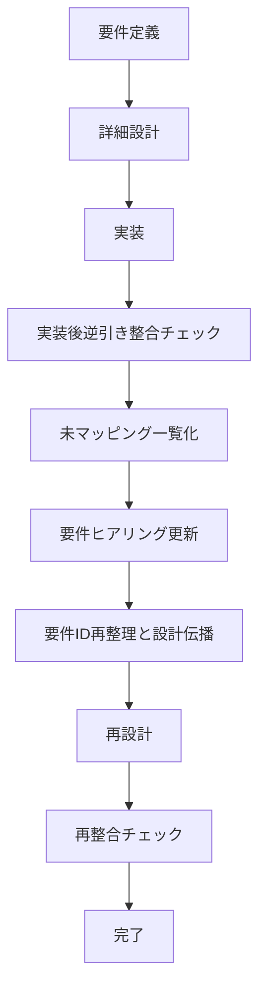

# isdd 変更点整理資料

## 1. 本資料の目的
本資料は、5つの論点について決定済みの変更点を明確化し、実運用に反映するための記述を整理したものである。

---

## 2. 論点1 ヒアリング時の説明の平易化

### 2.1 変更内容
ヒアリングでは専門用語中心の説明をやめ、ユーザーの業務文脈で理解できる表現を前提とする。

ただし、業務語は一般語と異なる意味を持つことがあるため、用語の意味をエージェント側で推定して確定してはならない。業務語は必ずユーザーに確認して定義する。

### 2.2 具体的な運用変更
1. 質問文は業務文脈の平易な言葉で提示する。
2. ユーザーが使った業務語は、次の質問へ進む前に必ず意味確認を行う。
3. 画面要件ヒアリングでは、各画面ごとに次の5項目を必須確認とする。
   - 画面の目的
   - 主要要素（ボタン、一覧、入力欄など）
   - 入力項目
   - 表示項目
   - エラー時の見え方
4. 5項目が埋まっていない画面は未確定として扱い、要件定義の完了判定を行わない。

### 2.3 反映対象
- skills/isdd-requirements/SKILL.md
- skills/isdd-change-req/SKILL.md
- skills/isdd-reverse-engineering/SKILL.md
- skills/isdd-common/references/hearing-complexity-rules.md
- skills/isdd-common/references/requirements-chapters.md

---

## 3. 論点2 用語集を意味のあるものにする

### 3.1 変更内容
用語集は「用語の存在確認」ではなく「業務上の意味を固定する仕組み」として運用する。

新しいドメイン用語が出た場合、意味が確定するまで要件ヒアリングを進めない。これにより、語義が曖昧なまま機能要件や設計要件が増えることを防止する。

### 3.2 具体的な運用変更
1. 用語集は次の固定項目で記載する。

| 用語 | 業務上の意味 | 本案件での使用範囲 | 同義語/類義語 |
|---|---|---|---|

2. 用語確認ゲートを追加する。
   - 新出用語が発生
   - 意味確認を実施
   - 用語集へ反映
   - 反映完了後にのみ次の要件質問へ進行
3. 要件本文に記載する用語は、用語集の定義と一致しなければならない。

### 3.3 反映対象
- skills/isdd-common/references/requirements-chapters.md
- skills/isdd-requirements/SKILL.md
- skills/isdd-change-req/SKILL.md
- skills/isdd-reverse-engineering/SKILL.md

---

## 4. 論点3 設計工程から要件へのフィードバック方式

### 4.4 設計工程から要件へ戻す複数方式

本資料での最重要前提として、以下を定義する。

- 変更要件定義、変更設計を使うのは、新たな要求が追加された場合のみとする。
- 初回要件定義から開始した設計、実装で発生した要件修正は、起点となる同一の要件定義を更新して扱う。
- 変更要件定義から開始した設計、実装で発生した要件修正も、当該変更要件定義そのものを更新して扱う。
- 設計、実装中に見つかった差分を次の新しい変更要件として積み増さない。

上記前提のもとで、方式Dを次の内容で確定運用とする。

#### 方式D 設計未マッピング要件の一覧化と逐次ヒアリング方式
設計工程で未マッピングが出た場合、起票テンプレートは作成せず、未マッピング一覧を正本として要件定義のやり直しヒアリングを行う。

運用手順:
1. 設計工程で次の差分を抽出し、未マッピング一覧を作成する。
   - 設計に落ちない既存要件
   - 設計で新たに必要になった要件
2. 一覧は要件単位で管理し、1件ずつユーザーヒアリングを実施する。
3. 各要件に対して次のいずれかを確定する。
   - 不要として削除
   - 要件内容を修正
   - 要件を分割または統合
   - 要件を追加
4. 確定結果を起点の要件定義へ直接反映する。
5. 要件ID体系を再整理し、変更があったIDを設計へ伝播する。
6. 設計を再実行し、未マッピングがゼロになるまで繰り返す。

完了条件:
- 未マッピング一覧がゼロ
- 更新済み要件定義と設計定義のID対応が一致
- ヒアリング結果が各要件に対して記録済み

### 4.6 反映対象
- skills/isdd-design/SKILL.md
- skills/isdd-change-design/SKILL.md
- skills/isdd-change-req/SKILL.md
- skills/isdd-requirements/SKILL.md
- skills/isdd-common/scripts/rq_ds_link_checker.py
- README.md の完了ゲート記述

---

## 5. 論点4 実装後の逆引き整合

### 5.1 変更前の状態
現状のフローは、要件定義、詳細設計、実装までは定義されているが、実装後に仕様整合を強制する標準工程が不足している。

現状で起きる問題:
1. 実装中に判明した仕様差分が要件書へ戻らない。
2. 実装中に判明した構造差分が設計書へ戻らない。
3. トレーサブルコメントは付くが、要件と設計の正本更新が遅れる。

### 5.2 変更後の状態
実装完了の直後に、実装後逆引き整合チェックを必須工程として追加する。

この工程を担う専用スキルを新設し、既存の逆引きスキルと責務分離する。

要件変更が必要になった場合は、4.4で定義した方式Dに従い、未マッピング一覧をもとに要件定義を1件ずつヒアリングで更新する。変更要件起票や起票テンプレート運用は行わない。

### 5.3 スキルごとの変更前後

#### isdd-reverse-engineering
変更前:
- 既存プロジェクトを初回でisdd化する機能が中心。

変更後:
- 初回導入時の逆引き専用に責務を限定する。
- 実装後整合チェックの責務は持たない。

#### isdd-post-implementation-review（新規）
変更前:
- 存在しない。

変更後:
- 実装後整合チェックを実行する専用スキルとして追加する。
- 入力: 現行コード、要件書、設計書、直近実装差分。
- 出力:
   - 整合レポート
   - 要件への反映提案
   - 設計への反映提案

#### isdd-traceable-coding
変更前:
- コメントカバレッジとRQ-DS整合チェックで完了可能。

変更後:
- 完了条件に実装後逆引き整合チェック実行を追加する。
- 実装後整合レポートの参照を必須化する。
- 要件修正が必要な場合は、4.4方式Dで要件更新が完了するまで完了としない。

#### isdd-design と isdd-change-design
変更前:
- 設計完了後の整合確認は設計時点中心。

変更後:
- 実装後整合で戻された差分を4.4方式Dの未マッピング一覧として受け取る。
- 一覧の各要件に対するユーザーヒアリング完了後、更新済み要件IDを受け取り再設計する。
- 変更要件定義、変更設計は新規要求の追加時のみ利用し、同一要求内の修正では利用しない。

### 5.4 共通部品化する範囲

| 共通部品 | 既存/新規/変更 | 役割 | 主な利用スキル |
|---|---|---|---|
| 構造抽出部品 | 既存を変更 | モジュール、クラス、関数、依存関係の抽出 | reverse-engineering, post-implementation-review |
| RQ-DS突合部品 | 既存を変更 | 要件IDと設計IDの未対応、重複、不整合の判定 | design系, traceable-coding, post-implementation-review |
| 差分要約部品 | 新規 | 実装差分の仕様影響点抽出 | post-implementation-review |
| 未マッピング一覧生成部品 | 新規 | 4.4方式Dで使う要件単位の差分一覧生成 | design系, post-implementation-review |
| 要件ヒアリング連携部品 | 新規 | 一覧の要件を1件ずつヒアリング順へ変換 | requirements系, change-req系 |
| ID再採番伝播部品 | 新規 | 更新後の要件IDを設計IDへ再伝播 | design系, change-design系 |

### 5.5 実装後逆引き整合の標準手順
1. 実装完了後に専用スキルを起動する。
2. コード構造抽出を実行する。
3. 要件書と設計書を読み、RQ-DS突合を実行する。
4. 実装差分を解析し、仕様への影響点を抽出する。
5. 未マッピング一覧を生成する。
6. 4.4方式Dに従い、一覧の要件を1件ずつユーザーヒアリングして要件定義を更新する。
7. 更新後の要件IDを設計へ伝播し、再設計を実施する。
8. 再度整合チェックを実行し、未整合ゼロで完了とする。

### 5.6 入出力定義

入力:
- docs/requirements.md
- docs/detail_design.md
- 対象ソースコード
- 直近変更差分情報

出力:
- 実装後逆引き整合レポート
- 未マッピング一覧
- 要件更新結果一覧
- 設計ID再伝播結果

### 5.7 完了ゲート
- 実装後逆引き整合チェックを実行済み
- 未整合項目がゼロ
- 変更が必要な場合、4.4方式Dで要件ヒアリング更新済み
- 更新後IDの設計伝播と再チェック完了

### 5.8 改訂後フロー

### 5.9 反映対象
- README.md
- skills/isdd-reverse-engineering/SKILL.md
- skills/isdd-post-implementation-review/SKILL.md
- skills/isdd-traceable-coding/SKILL.md
- skills/isdd-design/SKILL.md
- skills/isdd-change-design/SKILL.md
- skills/isdd-common/scripts 配下の共通部品

---

## 6. 論点5 外部連携プリチェック強化

### 6.1 変更内容
外部連携のプリチェックは、接続可否確認にとどめず、認証付き実接続とスキーマ確認までを完了条件にする。

### 6.2 具体的な運用変更
1. ヒアリング項目を固定化する。
   - 接続先
   - 認証方式
   - 必要環境変数名
   - 接続元制約（ネットワーク、VPN、IP制限）
2. .envへの設定を必須化する。
   - 機密値そのものは文書に保存しない。
   - 環境変数名のみを記録する。
3. Python venv上で実接続テストを実施し、接続可否を証跡化する。
4. 接続成功時は、取得可能なスキーマ（エンティティ一覧）を記録する。

### 6.3 完了条件
- 接続可否が実接続で確認済み
- 認証方式と環境変数名が記録済み
- 取得可能エンティティ一覧が記録済み
- 機密値の記録なし

### 6.4 反映対象
- skills/isdd-external-precheck/SKILL.md
- precheck_reportフォーマット
- skills/isdd-external-research/SKILL.md（境界条件の明記が必要な場合）

---

## 7. 全体反映マップ

| 領域 | 主な変更先 |
|---|---|
| ヒアリング平易化 | isdd-requirements, isdd-change-req, isdd-reverse-engineering, hearing-complexity-rules |
| 用語統制 | requirements-chapters, isdd-requirements, isdd-change-req, isdd-reverse-engineering |
| 設計不要ID抑止 | isdd-requirements, isdd-change-req, isdd-design, isdd-change-design, README運用記述 |
| 実装後逆引き整合 | README, isdd-traceable-coding, isdd-reverse-engineering, 新規実装後整合スキル |
| 外部連携プリチェック | isdd-external-precheck, precheck_report, external-research境界記述 |

---

## 8. 文書レビュー結果

### 8.1 矛盾確認
- 決定済み論点はすべて「変更内容のみ」の記述に統一し、不要な比較記述を削除した。
- 論点3のみ、再検討要求に従って複数方式を提示し、フィードバック採用を明記した。

### 8.2 冗長性確認
- 方式ラベル表記のうち、不要な記号的記述を削減した。
- 反映対象は各論点末尾に集約し、重複記述を削除した。

### 8.3 要求反映確認
- 「業務語は必ずユーザー確認」の要求を論点1に反映した。
- 論点2の不要章（既存有無説明、採用方針）を削除した。
- 論点3は4.1〜4.3を削除し、4.4方式Dを詳細運用へ更新した。
- 論点4は4.4方式Dと接続し、起票なしの要件ヒアリング更新とID伝播を反映した。
- 論点4の共通部品表へ既存、新規、変更の区分列を追加した。
- 論点5は変更点説明のみの構成に統一した。
